# ASTR Core Solver Maintenance Documentation Design

## Status

Accepted through the `grill-with-docs` requirements interview on 2026-09-07.
The source-audit baseline is tracked commit `a78814d`. Implementation begins only
after the user reviews this written specification.

## Objective

Create a maintainable documentation system for the ASTR core solver that allows a new
research student to find the correct entry point and allows a core developer to assess
the impact of a numerical, boundary, MPI, GPU, statistics, build, or restart change.
The documentation must describe current code accurately, distinguish target architecture,
and keep every important relationship traceable to source and validation evidence.

## Audience

The documentation serves two reader paths:

| Reader | First need | Documentation path |
|---|---|---|
| New research student | Build, configure, run, restart, and locate the main numerical path | Quick-start navigation and operational guides |
| Core maintainer | Understand ownership, dependencies, invariants, change impact, and required validation | Architecture, data-flow, parallel, numerical-contract, and change guides |

Chinese is the prose language. Fortran module and procedure names, field names,
configuration keys, and established architecture terms remain in English.

## Scope

Detailed coverage is limited to the production core solver:

- top-level and `src/` CMake configuration;
- CPU production code under `src/`;
- CUDA Fortran production code under `src_gpu/`;
- validation scripts only where they provide evidence or a required maintenance gate.

The detailed structure excludes `pastr/`, `miniapps/`, `chemMech/`, unrelated examples,
historical runtime output, presentations, and untracked reference material. Example inputs
may be cited only when a build, run, restart, boundary, or validation procedure requires them.

## Chosen documentation approach

The design combines human-curated architecture documents with a generated lexical source
inventory. The architecture documents own meaning, responsibility, state ownership, and
supported contracts. The inventory owns deterministic facts that can be checked for drift.

```mermaid
flowchart LR
    accTitle: Maintenance documentation evidence flow
    accDescr: Current source facts feed a generated inventory, while maintainers audit those facts into current and target architecture documents and bind them to operational and validation guides.

    tracked_source["Tracked core source"] --> source_audit["Read-only source audit"]
    source_audit --> generated_inventory["Generated source inventory"]
    generated_inventory --> curated_current["Curated current architecture"]
    approved_plans["Approved plans and ADRs"] --> curated_target["Curated target architecture"]
    curated_current --> maintenance_guides["Maintenance and run guides"]
    curated_target --> maintenance_guides
    validation_evidence["Validation evidence"] --> maintenance_guides
    maintenance_guides --> drift_check{"Drift check passes?"}
    drift_check -->|yes| accepted_docs(["Accepted documentation"])
    drift_check -->|no| stop_update(["Stop and update evidence"])

    classDef source fill:#dbeafe,stroke:#2563eb,stroke-width:2px,color:#1e3a5f
    classDef document fill:#dcfce7,stroke:#16a34a,stroke-width:2px,color:#14532d
    classDef gate fill:#fef3c7,stroke:#d97706,stroke-width:2px,color:#78350f
    classDef stop fill:#fee2e2,stroke:#dc2626,stroke-width:2px,color:#7f1d1d

    class tracked_source,approved_plans,validation_evidence source
    class generated_inventory,curated_current,curated_target,maintenance_guides,accepted_docs document
    class drift_check gate
    class stop_update stop
```



## Deliverables

```text
documents/maintenance/
|-- README.md
|-- architecture-current.md
|-- architecture-target.md
|-- repository-structure.md
|-- runtime-and-dataflow.md
|-- parallel-gpu-architecture.md
|-- numerical-contracts.md
|-- build-run-restart.md
|-- change-impact-guide.md
|-- validation-and-troubleshooting.md
`-- generated/
    `-- source-inventory.md

scripts/maintenance/
`-- audit_source_inventory.py
```

The existing `CONTEXT.md` receives only project-specific canonical terminology. ADR 0022
records why architecture interpretation and generated source facts are separated.

## Mermaid diagram set

The documents contain one navigation diagram and nine focused architecture diagrams:

| Location | Diagram | Question answered |
|---|---|---|
| `README.md` | Documentation navigation | Where does each reader start? |
| `repository-structure.md` | Repository structure | Which core directories and build files own each responsibility? |
| `architecture-current.md` | Current layered architecture | How do CPU orchestration, GPU facade, CUDA backend, MPI, HDF5, and dependencies interact now? |
| `architecture-current.md` | Core module dependencies | Which state, initialization, geometry, boundary, solver, statistics, and I/O modules depend on each other? |
| `runtime-and-dataflow.md` | Startup flow | How does execution reach the time loop? |
| `runtime-and-dataflow.md` | RK sequence | In what order do filter, boundary, halo, gradients, RHS, sources, update, statistics, and output occur? |
| `runtime-and-dataflow.md` | Field ownership | When are host or device fields authoritative, reduced, or transferred? |
| `parallel-gpu-architecture.md` | Halo sequence | How do pack, transfer, MPI, unpack, endpoint averaging, `hm`, and `hm+1` differ? |
| `architecture-target.md` | Target backend architecture | How can the facade admit CUDA, HIP, or DCU paths without changing CPU orchestration? |
| `validation-and-troubleshooting.md` | Validation gates | Which evidence is required before a maintenance claim is accepted? |

Diagrams use an overview-plus-detail pattern. A diagram should normally stay below 30 nodes,
use one primary direction, and split when another concern would create crossing edges.
Each supported Mermaid type includes `accTitle` and `accDescr`, uses `snake_case` identifiers,
and uses `classDef` rather than inline styling.

Current and target architecture are never mixed into one diagram. Current diagrams contain
only source-audited behavior. Target diagrams visibly distinguish planned, restricted, and
deferred capabilities.

## Source evidence convention

Source locations use file paths plus module/procedure names instead of fixed line numbers.
Critical claims also identify the audit baseline or an owning validation document. Each
manually asserted diagram relationship has a nearby evidence table with:

- source file;
- module or procedure;
- relationship or invariant;
- validation evidence where applicable;
- condition requiring re-audit.

The documentation does not use a successful build as proof of numerical equivalence, a
CPU/GPU comparison as proof of physical validity, or a kernel profile as proof of end-to-end
performance.

## Generated source inventory

`scripts/maintenance/audit_source_inventory.py` uses the Python standard library and does
not modify solver source or build files. It scans production sources and relevant CMake files,
folds Fortran continuation statements, and records:

- source files and build membership;
- program, module, declared subroutine, and declared function names;
- `use`, `call`, and include relationships;
- a deterministic fingerprint of audited source contents.

The scanner is explicitly lexical. Generic interfaces, procedure pointers, preprocessor
branches, and runtime dispatch that cannot be resolved are reported as limitations or manual
audit edges, not guessed as definite calls.

The command interface is:

```bash
python3 scripts/maintenance/audit_source_inventory.py --write
python3 scripts/maintenance/audit_source_inventory.py --check
```

`--write` deterministically updates the tracked
`documents/maintenance/generated/source-inventory.md`. `--check` returns nonzero when the
generated inventory is stale, a production source is absent from its expected CMake list,
or an explicitly structured evidence reference names a missing path or symbol. The command
is documented in maintenance and commit checklists but is not added to CMake, CTest, or CI.

## Operational documentation

Build and run instructions have a platform-neutral main path plus a table of differences
for the local NVHPC workstation and A800/HPC environments. Shared documentation excludes
accounts, host names, credentials, and private remote paths.

Restart documentation separates:

- checkpoint field ownership;
- step/time consistency checks;
- physical and MPI halo reconstruction;
- statistics continuation semantics;
- source-checkpoint immutability;
- failure conditions that require stopping rather than continuing.

No GPU HDF5 implementation is implied. Initialization, checkpoint, and field output remain
explicit CPU-owned boundaries unless the current source audit proves otherwise.

## Numerical contracts

The maintenance set summarizes numerical contracts, code entry points, data dependencies,
and invariants. It links to existing numerical-scheme documents for full formulas rather
than duplicating them. At minimum it distinguishes:

- explicit central derivatives and filter;
- explicit upwind reconstruction and flux splitting;
- Ducros and selective Roe paths;
- RK3 and RHS sign/order;
- physical-boundary closures;
- unsupported compact, species, chemistry, turbulence, moving-grid, and immersed-boundary scope.

## Change-impact guides

Six change recipes are required:

1. add a case;
2. add or change a boundary condition;
3. change a numerical scheme;
4. add a device field;
5. change HaloTransport;
6. add a statistic.

Every recipe lists the entry point, affected modules, ownership and MPI/GPU semantics,
invariants, required tests, and conditions that stop the change from progressing.

## Troubleshooting contract

Troubleshooting entries use the fixed structure:

```text
Symptom -> Diagnostic criterion -> Root cause -> Action -> Stop condition
```

The initial set covers LF/CRLF input handling, NaN/CFL failures, invalid CPU oracles,
boundary and halo ownership, restart/checkpoint mismatches, HDF5 dependencies, MPI device
binding, GPU residency, Compute Sanitizer, Nsight Systems, and Nsight Compute permissions.
Complete historical debugging narratives remain in existing reports rather than being copied.

## Validation and rendering

Documentation validation includes:

1. deterministic inventory generation;
2. inventory freshness through `--check`;
3. existence checks for structured source evidence;
4. CMake source-membership checks;
5. Markdown placeholder and broken-relative-link scans;
6. Mermaid syntax and accessibility checks;
7. temporary rendering of every Mermaid block with an isolated Mermaid CLI npm cache;
8. manual inspection of temporary renders for clipping, unreadable labels, and incoherent edges;
9. `git diff --check` and explicit Git-scope review.

Temporary rendering output is written under `/tmp` and removed after inspection. No SVG,
PNG, PDF, EPS, or JPEG diagram artifact is saved or committed. The project dependency files
remain unchanged.

## Acceptance criteria

The documentation implementation is complete when:

- every production source in `src/` and `src_gpu/` appears exactly once in the generated inventory;
- each source has a concise responsibility and CMake-membership result;
- all critical current-architecture relationships have file and symbol evidence;
- current and target architecture are visibly separate;
- all ten Mermaid diagrams pass syntax and temporary-render inspection;
- two consecutive inventory generations are byte-identical;
- `--check` passes and a controlled stale-inventory test fails;
- the six change recipes and required troubleshooting topics are present;
- build, run, and restart commands agree with the audited top-level CMake and runtime contracts;
- no solver behavior, CMake target, CI configuration, running OpenSBLI service, or unrelated untracked file is changed.

## Implementation sequence

1. Freeze and record the tracked-source audit baseline.
2. Implement the lexical source inventory and its tests.
3. Audit repository, module, startup, RK, RHS, boundary, data-ownership, and halo relationships.
4. Write current architecture and operations documents from source evidence.
5. Write the target architecture from accepted ADRs and roadmap documents.
6. Write numerical, change-impact, validation, and troubleshooting guides.
7. Generate the tracked inventory and run drift checks.
8. Temporarily render and inspect all Mermaid blocks.
9. Review claims, links, placeholders, Git scope, and the live OpenSBLI service state.

## Explicit non-goals

- No solver, numerical, boundary, MPI, GPU, CMake, CTest, or CI behavior change.
- No exhaustive semantic call graph for every procedure.
- No detailed documentation of peripheral applications or every example.
- No committed rendered Mermaid artifact.
- No credentials or private remote execution paths.
- No claim that target CUDA/HIP/DCU architecture is already implemented.
