# GPU compact production statistics design

_ASTR dynamic-inflow D4 production design, approved approach 1, 2026-09-10_

---

## Scope

This design adds production statistics for three-dimensional, single-species,
non-reacting `bl` and `swbli` GPU cases. The first admitted geometry has a
periodic homogeneous z direction and a physical y-min wall. Cartesian and
static curvilinear extrusions are supported. A general non-homogeneous
three-dimensional average is not implied.

The implementation shall:

- accumulate compact statistics on the GPU without a full-field copy at each sample;
- retain density-weighted raw moments rather than only derived quantities;
- compute wall pressure, streamwise wall shear, and wall-normal heat flux;
- preserve statistics across a same-grid, same-topology restart;
- write compact rank-local binary state at checkpoint boundaries;
- assemble human-facing fields in a separate postprocessor;
- keep the existing CPU three-dimensional statistics path unchanged.

RANS/LES, chemistry, multiple species, moving grids, non-periodic z statistics,
GPU HDF5, and arbitrary statistics requested after a production run are outside
this phase.

## Statistical contract

### Plane moments

At every accepted sample, the solver integrates over physical spanwise line
segments and accumulates over time. For a quantity $f$, the raw sum is

$$
S_f(i,j)=\sum_{n=1}^{N_s}\sum_{k=1}^{N_k}
\frac{f^n_{i,j,k-1}+f^n_{i,j,k}}{2}\,\Delta s_{i,j,k},
$$

where

$$
\Delta s_{i,j,k}=
\left\lVert\boldsymbol{x}_{i,j,k}-\boldsymbol{x}_{i,j,k-1}\right\rVert.
$$

Using physical segment length avoids treating a non-uniform curvilinear
extrusion as a uniformly spaced Cartesian line. Each MPI z slab owns its local
segments `k=1:km`; shared interface nodes are endpoints of neighboring segments
and are not counted as independent samples.

The device array `plane_sum_d(0:im,0:jm,1:12)` stores:

| Index | Raw sum | Derived use |
| ---: | --- | --- |
| 1 | $S_\rho$ | Favre denominator and mean density |
| 2-4 | $S_{\rho u}$, $S_{\rho v}$, $S_{\rho w}$ | Favre velocity |
| 5 | $S_{\rho T}$ | Favre temperature |
| 6 | $S_p$ | Reynolds mean pressure |
| 7-9 | $S_{\rho uu}$, $S_{\rho vv}$, $S_{\rho ww}$ | normal stresses |
| 10-12 | $S_{\rho uv}$, $S_{\rho uw}$, $S_{\rho vw}$ | shear stresses |

The static line measure

$$
L_z(i,j)=\sum_{k=1}^{N_k}\Delta s_{i,j,k}
$$

is stored separately. The postprocessor derives

$$
\overline{\rho}=\frac{S_\rho}{N_sL_z},\qquad
\widetilde{u_i}=\frac{S_{\rho u_i}}{S_\rho},\qquad
\widetilde{T}=\frac{S_{\rho T}}{S_\rho},\qquad
\overline{p}=\frac{S_p}{N_sL_z},
$$

and

$$
\widetilde{u_i''u_j''}=
\frac{S_{\rho u_i u_j}}{S_\rho}
-\widetilde{u_i}\widetilde{u_j}.
$$

Derived means and stresses are never accumulated recursively. Preserving raw
moments permits a restart or combination of adjacent sampling windows without
changing the mathematical result beyond floating-point reduction order.

### Wall quantities

The y-min wall uses the inward unit normal $\boldsymbol{n}$ already constructed
from the grid geometry. The local streamwise tangent is obtained from the wall
grid line in increasing i, projected onto the tangent plane and normalized:

$$
\boldsymbol{t}_s=
\frac{\boldsymbol{d}_i-(\boldsymbol{d}_i\cdot\boldsymbol{n})\boldsymbol{n}}
{\left\lVert\boldsymbol{d}_i-(\boldsymbol{d}_i\cdot\boldsymbol{n})\boldsymbol{n}\right\rVert}.
$$

The accumulated wall quantities are

$$
p_w=p,\qquad
\tau_w=\boldsymbol{t}_s\cdot\boldsymbol{\tau}\boldsymbol{n},qquad
q_w=\kappa\nabla T\cdot\boldsymbol{n},
$$

with

$$
\tau_{ij}=\mu\left(\frac{\partial u_i}{\partial x_j}
+\frac{\partial u_j}{\partial x_i}
-\frac{2}{3}\frac{\partial u_k}{\partial x_k}\delta_{ij}\right).
$$

The sign follows the inward normal and increasing-i streamwise tangent. On an
axis-aligned lower wall this reduces to the current ASTR convention for
$\mu\,\partial u/\partial y$ and $\kappa\,\partial T/\partial y$.

`wall_sum_d(0:im,1:3)` stores the spanwise and temporal integrals of
$p_w$, $\tau_w$, and $q_w$. `wall_measure_d(0:im)` stores the corresponding
spanwise line length. Wall arrays are allocated only on ranks with `jrk==0`.

## Runtime data flow

```mermaid
flowchart LR
    accTitle: Compact statistics data flow
    accDescr: GPU-resident flow fields are reduced into compact raw moments during sampling, checkpointed as rank-local sidecars, and assembled after the run.

    resident_flow[Resident q and primitive fields] --> prepare_stats[Prepare boundaries and gradients]
    prepare_stats --> sample_gate{Sampling step?}
    sample_gate -->|No| rk_update[Advance RK stages]
    sample_gate -->|Yes| plane_kernel[Accumulate plane moments]
    sample_gate -->|Yes| wall_kernel[Accumulate wall quantities]
    plane_kernel --> explicit_sync[Explicit kernel synchronization]
    wall_kernel --> explicit_sync
    explicit_sync --> checkpoint_gate{Checkpoint due?}
    checkpoint_gate -->|No| rk_update
    checkpoint_gate -->|Yes| compact_copy[Copy compact state only]
    compact_copy --> sidecar[Write rank sidecar]
    sidecar --> rk_update
    sidecar --> postprocess[Assemble global statistics offline]

    classDef process fill:#dbeafe,stroke:#2563eb,stroke-width:2px,color:#1e3a5f
    classDef decision fill:#fef9c3,stroke:#ca8a04,stroke-width:2px,color:#713f12
    classDef output fill:#dcfce7,stroke:#16a34a,stroke-width:2px,color:#14532d

    class resident_flow,prepare_stats,plane_kernel,wall_kernel,explicit_sync,compact_copy,rk_update process
    class sample_gate,checkpoint_gate decision
    class sidecar,postprocess output
```

Sampling occurs in the existing GPU statistics phase after physical boundaries,
halo exchange, and `gradcal` have prepared the same state observed by CPU
`rkfirst` statistics. The sample gate is
`nstep>0 .and. lavg .and. mod(nstep,feqavg)==0`.

Every accumulation kernel retains the project baseline of explicit
synchronization. There is no D2H transfer on a non-checkpoint sampling step.

## Module boundaries

### GPU implementation

Add `src_gpu/production_statistics_gpu.cuf` with these public operations:

- `initialize_compact_statistics_gpu()` validates capability, allocates arrays,
  computes static measures, and restores a sidecar when restarting;
- `accumulate_compact_statistics_gpu()` applies the sampling gate and launches
  plane and wall kernels;
- `prepare_compact_statistics_checkpoint()` copies compact arrays and writes
  temporary rank-local files;
- `commit_compact_statistics_checkpoint()` publishes temporary files only after
  the main flow checkpoint succeeds;
- `release_compact_statistics_gpu()` frees device and host buffers.

`src_gpu/gpu_runtime.cuf` remains the facade visible to `src/`. The normal path
shall not expose device arrays or CUDA types to CPU modules.

### Minimal CPU integration

`src/mainloop.F90` adds facade calls at the existing statistics and checkpoint
boundaries. `src/initialisation.F90` must not call the CPU full-three-dimensional
`readmeanflow` when the GPU compact backend owns the statistics state.

No numerical kernel, halo width, boundary formula, or existing CPU statistics
formula is changed. The known `readmeanflow` assignment of the `tu3` dataset to
the `tu2` array is outside this implementation and requires separate user
approval before repair.

### Postprocessor

Add `scripts/gpu_statistics/assemble_compact_statistics.py`. It shall:

- validate format version, endianness, dimensions, topology, offsets, step,
  sample count, and finite values;
- combine rank-local z-segment sums and merge x/y blocks;
- verify overlapping x/y interface nodes before selecting one owner;
- derive Favre means and six stresses from raw moments;
- write a compact HDF5 analysis file and an ASCII metadata report;
- refuse zero density sum, zero physical measure, missing ranks, duplicate
  ownership, or incompatible checkpoint generations.

The solver does not depend on Python or `h5py`; only offline assembly does.

## Checkpoint and restart

Each MPI rank writes `compact_stats.rankXXXXXXXX.bin`. The file contains:

1. a format magic and version;
2. global dimensions and MPI topology;
3. rank coordinates, global offsets, and local dimensions;
4. checkpoint step, physical time, sample count, and sampling start;
5. local plane and wall measures;
6. local raw moment arrays.

The checkpoint sequence is:

1. Copy compact statistics to host and write rank-local temporary files.
2. Synchronize ranks and execute the existing main flow checkpoint.
3. Rotate the preceding compact sidecars to `bakup/`.
4. Atomically publish the temporary files in `outdat/`.
5. Synchronize ranks before continuing.

Restart requires exact agreement with the flow checkpoint step, sample count,
grid, topology, rank coordinates, and offsets. A changed topology or missing
sidecar stops the run. Silent reset is prohibited because it would mix unequal
statistical windows.

The first implementation guarantees same-topology restart. Topology-independent
redistribution is a separate capability.

## Capability gate

Compact production statistics are enabled when all conditions hold:

- the runtime-selected backend is GPU;
- `lavg=t`;
- `flowtype` is `bl` or `swbli`;
- the case is three-dimensional and single-species non-reacting;
- z is declared homogeneous and both z boundaries are periodic;
- the y-min wall is an admitted no-slip wall;
- the grid is static and the physical spanwise line measure is positive;
- Sutherland viscosity and existing gradient fields are available.

An unsupported combination fails before the first sample. It does not fall back
to full-field D2H accumulation.

## Validation strategy

### Mathematical unit tests

Python tests shall verify reconstruction of Favre means and stresses from raw
moments, concatenation of adjacent time windows, binary format validation, and
failure on missing or incompatible rank files.

### CUDA probes

A manufactured linear velocity and temperature field shall verify:

- all 12 plane moments on uniform and non-uniform z coordinates;
- wall pressure, stress traction, heat flux, and sign convention;
- geometric projection on a warped static extrusion;
- finite results and positive measures under Compute Sanitizer.

### Solver comparisons

The compact GPU result shall be compared with a small-grid host reference that
uses the same physical segment quadrature. Required cases are:

| Case | Required decomposition |
| --- | --- |
| Static profile BL | NP=1 |
| Dynamic profile BL | NP=1 |
| Dynamic filtered CURVE BL | NP=4 `2x2x1` |
| z decomposition | NP=2 `1x1x2` |
| Three-direction communication | NP=8 `2x2x2` smoke |

Raw moments, derived Favre fields, six stresses, wall quantities, measures, and
sample metadata use `atol=rtol=1e-10`. The split/restart result is compared with
an uninterrupted result at the same final step.

### Residency and performance

Nsight Systems must show no full-field D2H/H2D transfer caused by a non-checkpoint
sample. Checkpoint transfers may contain only compact plane, wall, measure, and
metadata buffers. Compute Sanitizer must report zero errors.

At `feqavg=1`, compact statistics should add no more than 10% to the median
complete-RK time on the local representative BL case. A larger measured cost
does not permit weakening the numerical contract; it triggers a separate kernel
optimization decision.

## D3 dependency

D4 supplies the mean velocity, Favre temperature, Reynolds stresses, and wall
quantities needed by the D3 precursor acceptance. D3 additionally requires
momentum-thickness and friction-Reynolds diagnostics plus selected probe time
series for temporal correlations. Time correlations cannot be reconstructed
from the compact time-averaged moments and therefore remain a separate small
probe-stream extension.

No D3 physical-convergence claim is made until a long precursor run demonstrates
stable `Re_theta`, `Re_tau`, profiles, periodic continuity, and temporal
decorrelation over a frozen averaging window.

## Acceptance boundary

D4 is complete only when all mathematical tests, CUDA probes, NP=1/2/4/8 solver
comparisons, same-topology restart, Compute Sanitizer, residency audit, and
performance measurement pass. Build success or one short solver run is not D4
completion.

D3 remains a physical-validation stage even after D4 code acceptance. Numerical
equivalence between CPU and GPU does not establish a statistically developed
turbulent precursor.
