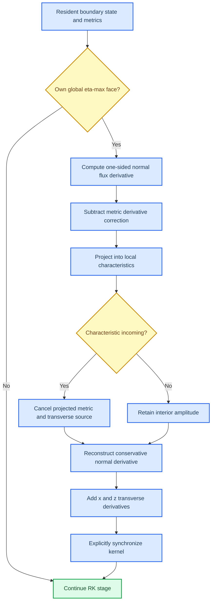

# Curvilinear NSCBC non-reflecting boundary design

_Approved design for the first Kim-Lee-style curved open-boundary slice in ASTR, 2026-09-11_

---

## Scope

This design adds a source-balanced non-reflecting generalized characteristic boundary
condition for the upper computational eta face. The admitted case is:

- three-dimensional;
- single-species and non-reacting, with `numq=5`;
- static, single-block curvilinear geometry;
- a genuinely curved physical upper-y face represented by `bctype=52`;
- periodic z boundaries;
- explicit spatial schemes and explicit Runge-Kutta time integration;
- inviscid boundary validation with `diffterm=f` in the first phase.

The first phase does not claim viscous GCBC, chemistry, multiple species,
moving grids, multiblock interfaces, all-six-face open boundaries, compact
schemes, or production SBLI farfield closure.

The existing target-state relaxation modes remain available for their current
validated Cartesian cases. They are not reinterpreted as mathematically
non-reflecting conditions.

## Decision

Add a new runtime mode:

```text
ASTR_NSCBC_FARFIELD_MODE=nonreflecting
```

This mode makes the total incoming characteristic derivative zero by balancing
the multidimensional metric and transverse source. It does not use a target
farfield state, a pressure target, `gmachmax2`,
`ymax-ymin`, or any other relaxation length or rate.

The existing strings retain their current behavior:

| Runtime string | Internal policy | Existing behavior |
| --- | --- | --- |
| `compatibility` | legacy pressure relaxation | Replaces the historical incoming acoustic quantity using pressure relaxation |
| `incoming_only` | target-state relaxation | Relaxes only locally incoming characteristics toward a constant target state |
| `sbli_shock` | target-state relaxation | Relaxes incoming characteristics toward the configured piecewise SBLI target |
| `nonreflecting` | source-balanced incoming closure | Cancels the source contribution in locally incoming characteristics |

Internally, the implementation should use an integer policy rather than pass a
boolean named `incoming_only`. The SBLI target selection remains a separate
flag inside the target-state relaxation policy.

## Mathematical contract

### Local geometric direction

At the upper computational boundary, eta is constant and increases out of the
domain. The local outward unit normal is

$$
\boldsymbol{n}
=
\frac{\nabla\eta}{\lVert\nabla\eta\rVert}
=
\frac{(\eta_x,\eta_y,\eta_z)}
{\sqrt{\eta_x^2+\eta_y^2+\eta_z^2}}.
$$

ASTR obtains these components from `dxi(i,jm,k,2,:)` on CPU and
`dxi_d(i,jm,k,2,:)` on GPU. The implementation must not substitute the global
y direction and must not flip the normal from a Cartesian-coordinate test.

For normal velocity $u_n=\boldsymbol{u}\cdot\boldsymbol{n}$ and sound speed
$c$, the five Euler characteristic speeds are

$$
\lambda_m=
\left(u_n,u_n,u_n,u_n+c,u_n-c\right).
$$

On the upper face, a characteristic is incoming if $\lambda_m<0$. A zero
eigenvalue is retained as a stationary, non-incoming characteristic.

### Conservative curvilinear characteristic update

Let $\widetilde{F}_{\eta}$ be the conservative normal flux in computational
coordinates. The normal flux derivative is evaluated with the established
three-point one-sided boundary operator. The metric correction is

$$
\boldsymbol{R}_{\eta}
=
\boldsymbol{F}_{x}\frac{\partial(J\eta_x)}{\partial\eta}
+
\boldsymbol{F}_{y}\frac{\partial(J\eta_y)}{\partial\eta}
+
\boldsymbol{F}_{z}\frac{\partial(J\eta_z)}{\partial\eta}.
$$

Using the existing ASTR conservative characteristic matrices, the interior
normal characteristic amplitudes are

$$
\boldsymbol{L}
=
\boldsymbol{P}^{-1}
\frac{1}{J}
\left(
\frac{\partial\widetilde{F}_{\eta}}{\partial\eta}
-\boldsymbol{R}_{\eta}
\right).
$$

Let the complete metric-plus-transverse source be
$\boldsymbol{S}=\boldsymbol{R}_{\eta}+\boldsymbol{T}_{\xi}+\boldsymbol{T}_{\zeta}$.
The new policy applies

$$
L_m^{\mathrm{bc}}=
\begin{cases}
\displaystyle-\left[\boldsymbol{P}^{-1}\boldsymbol{S}/J\right]_m,
& \lambda_m<-\epsilon_{\lambda},\\
L_m, & \lambda_m\ge-\epsilon_{\lambda}.
\end{cases}
$$

Here $\epsilon_{\lambda}=64\epsilon_{\mathrm{mach}}
\max(c,|u_n|)$ prevents roundoff-level zero waves from changing class. Thus an
incoming mode satisfies
$L_m^{\mathrm{bc}}+[\boldsymbol{P}^{-1}\boldsymbol{S}/J]_m=0$.

The modified normal derivative is reconstructed as

$$
\left.
\frac{\partial\widetilde{F}_{\eta}}{\partial\eta}
\right|_{\mathrm{bc}}
=
J\boldsymbol{P}\boldsymbol{L}^{\mathrm{bc}}
+\boldsymbol{R}_{\eta}.
$$

The x- and z-direction transverse conservative flux derivatives are then
included in the boundary RHS. Their discrete metric cancellation with
$\boldsymbol{R}_{\eta}$ is required for uniform-flow preservation on a
curvilinear grid. This follows the generalized-coordinate characteristic
structure introduced by Kim and Lee.[^1] Retaining transverse and metric terms
is also required by later detailed curvilinear NSCBC derivations.[^3] Kim and
Lee's second paper further retains the transverse and viscous contributions as
source terms in the multidimensional characteristic relations.[^2] The first
ASTR gate isolates the inviscid part rather than claiming that the separately
computed diffusion RHS closes this viscous characteristic formulation.

### Separation from target-state relaxation

A target-state correction has the form

$$
L_m^{\mathrm{bc}}
=
\sigma_m
\left[\boldsymbol{P}^{-1}
(\boldsymbol{Q}-\boldsymbol{Q}_{\infty})\right]_m,
$$

where $\sigma_m$ has inverse-time dimensions. The farfield state alone cannot
define this rate. The present `nonreflecting` mode therefore does not read or
project `rho/u/v/w/T` targets. A later relaxation mode may accept an explicitly
specified rate, but it must not infer that rate from `ymax-ymin` and call the
choice part of the Kim-Lee formulation.

## Runtime data flow



No `gmachmax2` reduction is launched in this mode. No target-state data are
transferred to the kernel. Every CUDA kernel retains the project requirement
for explicit post-kernel synchronization.

## Geometry contract

The uniform-flow gate uses the existing `y-wavy` mapping:

$$
x=\xi,\qquad
y=\eta+a\sin\xi\sin\zeta,\qquad
z=\zeta,
$$

with $a=0.15$. This mapping has analytic $J=1$, while both eta boundary faces
have spatially varying physical normals. It activates all three components of
$\nabla\eta$ without coupling the first boundary gate to a varying analytic
Jacobian.

The uniform-flow boundary contract is

| Face | Boundary condition |
| --- | --- |
| x-min | `bctype=11` |
| x-max | `bctype=21` |
| y-min | `bctype=41` |
| y-max | `bctype=52`, `nonreflecting` |
| z-min/z-max | periodic |

Initialization must reject a non-finite or non-positive Jacobian, a zero
$\lVert\nabla\eta\rVert$, or an upper-face normal whose computational
orientation points toward the first interior eta plane. Geometry admission is
performed before any CUDA boundary kernel launch.

The acoustic gate uses periodic x/z boundaries and a `y-upper-ramp` mapping.
The lower part of the domain remains Cartesian through the measurement plane,
while a quintic ramp activates the curved upper face. This separates the
incident-wave definition from the curved-boundary response without replacing
the local eta-normal boundary calculation.

## Module boundaries

### CPU boundary policy

`src/bc.F90` owns runtime parsing and the CPU reference behavior. It will:

- define named integer policies for legacy pressure relaxation,
  target-state relaxation, and source-balanced non-reflection;
- recognize `ASTR_NSCBC_FARFIELD_MODE=nonreflecting`;
- provide a query for the selected policy;
- add a focused helper that projects the complete source and balances only
  locally incoming LODI amplitudes;
- bypass target-state configuration and the global boundary Mach reduction for
  the source-balanced policy;
- bypass the optional transverse boundary-plane filter by default in the new
  mode.

The established `farfield_nscbc(ndir=4)` normal-flux, metric-correction, and
transverse-flux assembly remains the CPU numerical reference. Other directions
and existing modes are unchanged.

### GPU boundary policy

`src_gpu/boundary_gpu.cuf` retains the legacy kernel calculation. A separate
target-free kernel and wrapper implement source-balanced non-reflection, so the
new launch does not carry unused target, relaxation-length, or
boundary-Mach arguments. The new kernel will:

1. construct the local normal from `dxi_d`;
2. compute the five local eigenvalues;
3. project the complete source and balance only eigenvalues below the
   machine-zero deadband;
4. reconstruct the normal derivative with `pnor` and `jacob_d`;
5. add the existing x/z transverse derivatives;
6. update `qrhs_d` with the established ASTR sign convention;
7. synchronize explicitly after the launch.

`src_gpu/mainloop_gpu.cuf` skips the upper-face Mach reduction and communication
used only by the disabled boundary-plane filter. The established bctype=52
full-RK snapshot/restore remains active because it defines the CPU/GPU
statistics phase independently of filtering. Ranks that do not own the global
upper-y face do not launch the GCBC kernel.

### Capability admission

`src_gpu/case_capability_gpu.cuf` and the geometry-aware checks in
`src_gpu/mainloop_gpu.cuf` will admit a curved upper `bctype=52` only when the
new mode and every scope restriction are satisfied. Existing curved-boundary
reject tests remain active for all older `52` policies.

Unsupported requests terminate before a CUDA launch. Silent fallback to
`compatibility`, Cartesian normals, pressure relaxation, or target-state
relaxation is prohibited.

## Filter policy

The existing x-then-z upper-plane filter interface is retained because current
Cartesian `bctype=52` regressions depend on its sequencing. It is not part of
the source-balanced non-reflecting GCBC definition.

The first `nonreflecting` phase requires the boundary-plane filter to be off.
If a later input requests this filter with the new mode before its dedicated
validation is complete, the runtime must stop with a specific capability
error. Filter-enabled GCBC is a separate numerical experiment because it
changes the incident and reflected spectra measured at the boundary.

## Failure policy

The new mode stops before GPU execution when any of the following is true:

- the requested face is not the global upper eta face;
- the problem is not three-dimensional;
- `numq/=5`, species equations exist, or additional mode equations exist;
- the grid is moving or multiblock;
- `diffterm=t` in this first phase;
- the unvalidated boundary-plane filter is requested;
- a required metric or state value is non-finite;
- the Jacobian is non-positive or the eta metric norm is zero;
- the upper eta coordinate direction points into the domain;
- the MPI topology is outside the admitted validation matrix.

These are capability failures, not conditions for falling back to an older
boundary model.

## Validation contract

Build success, CPU/GPU agreement, uniform-flow preservation, acoustic
non-reflection, MPI decomposition correctness, and memory safety are separate
gates. Passing one gate does not imply the others.

### Gate 0: parser and legacy regressions

- Parse all four runtime strings and reject unknown strings.
- Verify that `compatibility`, `incoming_only`, and `sbli_shock` produce their
  pre-change results on their existing Cartesian tests.
- Verify that only `nonreflecting` can pass the new curved-52 capability gate.

### Gate 1: characteristic algebra

A focused host/device probe supplies local states, non-axis-aligned metric
vectors, and multidimensional source vectors. It records the eigenvalues,
incoming mask, balanced LODI values, and reconstructed conservative derivative.

Acceptance requires:

- every incoming component cancels its projected source contribution;
- every component outside the incoming deadband is bitwise unchanged within one
  backend;
- CPU/GPU normals, eigenvalues, and reconstructed derivatives differ by at
  most `1e-12` in absolute value;
- local subsonic outflow, local subsonic inflow, supersonic outflow, and
  supersonic inflow are all covered.

### Gate 2: uniform-flow preservation

A constant, stationary perfect-gas state is advanced for 10 Runge-Kutta steps
on the `y-wavy` grid with `lfilter=f` and `diffterm=f`. The boundary setup is
chosen to be compatible with the constant state.

Acceptance requires:

- the maximum relative drift of every conservative variable is at most
  `1e-10` over the full field;
- the same limit holds on the upper two eta planes;
- CPU/GPU full-field differences are at most `1e-10`;
- no non-finite value occurs.

Failure at this gate blocks all acoustic tests because it indicates an error in
metric cancellation, transverse terms, orientation, or sign convention.

### Gate 3: outgoing acoustic pulse

The initial perturbation is a weak plane-y compact-support acoustic packet with
a $\cos^4$ envelope. Its propagation direction has a positive upward
component, and its amplitude remains in the linear regime. Periodic x/z
boundaries remove lateral edge contamination. The generator rejects a grid
unless the support spans at least 15 physical y intervals.

At a probe surface below the curved boundary, define the outgoing and incoming
acoustic invariants

$$
W_{+}=p'+\rho_0c_0u_n',\qquad
W_{-}=p'-\rho_0c_0u_n'.
$$

The time-integrated characteristic energies are

$$
E_{\pm}=
\int_{t_0}^{t_1}\int_{S_p}
\frac{W_{\pm}^{2}}{4\rho_0c_0^2}
\,\mathrm{d}S\,\mathrm{d}t,
$$

and the measured pressure-amplitude reflection coefficient is

$$
R=\sqrt{\frac{E_-}{E_+}}.
$$

Acceptance requires:

- `nonreflecting` gives $R\le 0.05$;
- its $R$ is no greater than one quarter of the matched `compatibility`
  control;
- CPU and GPU values of $R$ differ by at most `1e-3`;
- $R$ does not increase under three-level grid refinement;
- the field remains finite after the packet exits.

The accepted refinement sequence is `64x48x64`, `80x60x80`, and `96x72x96`.
The coarser `32x24x32` candidate spans only 7.64 support intervals and is
therefore an invalid acoustic-resolution test, not a failed boundary result.

The reflection measurement script must record the integration surface, time
window, base state, perturbation amplitude, and grid resolution. If these are
not available, it must refuse to report $R$.

### Gate 4: MPI decomposition

Run the accepted single-rank case with:

| MPI ranks | Topologies |
| ---: | --- |
| 1 | `1x1x1` |
| 2 | `2x1x1`, `1x2x1`, `1x1x2` |
| 4 | `2x2x1`, `2x1x2`, `1x2x2` |
| 8 | `2x2x2` |

Only ranks with `jrk==jrkm` own the physical upper face. x/z decomposition of
that face uses the established halo exchange rather than rank-local periodic
assumptions.

Acceptance requires:

- matched-topology CPU/GPU full fields differ by at most `1e-10`;
- CPU fields from different decompositions differ by at most `1e-10`;
- boundary probe histories agree within `1e-10` before reduction;
- the reduced reflection coefficient differs from NP=1 by at most `1e-3`.

These oversubscribed local runs are correctness evidence, not multi-GPU
scaling evidence.

### Gate 5: runtime safety

- Run Compute Sanitizer for NP=1.
- Run Compute Sanitizer for NP=2 `1x2x1`, so only one rank layer owns the
  upper physical boundary.
- Require zero reported memory errors.
- Confirm through an Nsight Systems trace that `nonreflecting` launches no
  upper-face Mach reduction and no legacy x/z boundary-plane filter.
- Require one non-reflecting RHS launch per owned RK substage.
- Confirm that every new kernel is followed by the established explicit
  synchronization call.

## Diagnostic implementation and figures

The acoustic diagnostic follows the required definition-to-code-to-figure
traceability:

| Quantity | Mathematical definition | Implementation | Outputs |
| --- | --- | --- | --- |
| Local wave mask | $\lambda_m<0$ | characteristic algebra probe | text report |
| Uniform-flow drift | $\lVert Q(t)-Q(0)\rVert_{\infty}$ | uniform-flow checker | text report |
| Characteristic energies | $E_+$ and $E_-$ above | acoustic reflection analyzer | CSV and text report |
| Reflection coefficient | $R=\sqrt{E_-/E_+}$ | acoustic reflection analyzer | EPS and JPEG |

Scientific plots contain no title and use:

```python
import scienceplots

plt.style.use(["science", "ieee", "std-colors"])
plt.rcParams["axes.grid"] = False
plt.rcParams["grid.alpha"] = 0.0
plt.rcParams.update(
    {
        "axes.labelsize": 16,
        "xtick.labelsize": 14,
        "ytick.labelsize": 14,
        "legend.fontsize": 14,
    }
)
```

No additional font family is configured. Each scientific figure is written in
both EPS and JPEG formats. The output directory remains an explicit variable
near the top of the plotting script so it can be adjusted manually.

## Implementation sequence

1. Add parser tests and named internal policies.
2. Add the CPU source-balanced incoming helper and algebra tests.
3. Add the GPU policy branch and device algebra probe.
4. Add the curved-52 capability and geometry admission checks.
5. Pass the NP=1 uniform-flow gate.
6. Implement and pass the outgoing acoustic-pulse gate.
7. Pass the NP=2, NP=4, and NP=8 topology matrix.
8. Pass Compute Sanitizer and trace-based runtime checks.
9. Update `documents/GPU_VALIDATION_MATRIX.md`,
   `documents/ASTR_GPU_CURRENT_STATUS_AND_NEXT_TARGETS.md`, and
   `documents/ASTR_FULL_GPU_ARCHITECTURE_PLAN.md` with evidence-bounded claims.

## Completion statement

Completion of this design establishes only the tested static single-block,
non-reacting, inviscid, curved upper-eta source-balanced non-reflecting GCBC capability.
The next design must address viscous characteristic source terms before this
boundary is described as a full Navier-Stokes GCBC or used as production
evidence for viscous SBLI.

## References

[^1]: Kim, J. W., and Lee, D. J. (2000). "Generalized Characteristic Boundary Conditions for Computational Aeroacoustics." _AIAA Journal_, 38(11), 2040-2049. https://doi.org/10.2514/2.891

[^2]: Kim, J. W., and Lee, D. J. (2004). "Generalized Characteristic Boundary Conditions for Computational Aeroacoustics, Part 2." _AIAA Journal_, 42(1), 47-55. https://doi.org/10.2514/1.9029

[^3]: Haselbacher, A., and Landmann, B. (2019). "NSCBC on Curvilinear Grids." https://www.researchgate.net/publication/332718083_NSCBC_on_Curvilinear_Grids
