# GPU Mixed-Precision Phase MP3 Characteristic-Flux Design

_ASTR CUDA Fortran shock-sensitive workspace experiment, 2026-09-12_

---

## Status and decision

Phase MP3-A adds one experimental mixed-precision candidate named
`characteristic_flux`. It converts only the five-component characteristic
interface-flux workspace from FP64 to FP32. The Ducros sensor, expanded shock
mask, Roe and characteristic reconstruction algebra, conservative right-hand
side, Runge-Kutta state, and MPI transport remain unchanged.

The initial phase was limited to the all-periodic S0-A6 through S0-A10
characteristic cases. The completed MP3-XP extension additionally admits the
existing S0-B0 x-physical zero-extrapolation case. Other physical-boundary
characteristic kernels, CURVE cases, diffusion, filtering, and OpenSBLI
production promotion remain outside the admitted path.

The FP64 path remains the production default. The completed local campaign
classifies this candidate as `local-pass-not-promoted`; it does not establish
long-time shock-boundary-layer physical equivalence.

## Runtime contract

The existing top-level mode remains:

```text
ASTR_GPU_PRECISION_MODE=fp64|mixed_workspace
```

The exactly-one-candidate selector becomes:

```text
ASTR_GPU_MIXED_CANDIDATE=flux|derivative|viscous_flux|characteristic_flux
```

The following rules apply:

- `characteristic_flux` requires `mixed_workspace` and is never selected by
  default;
- all MPI ranks must request the same candidate;
- unknown, combined, rank-inconsistent, or ineligible selections abort before
  GPU work starts;
- an ineligible request must not silently fall back to FP64;
- rank zero reports the requested candidate, active workspace, FP64 reference
  bytes, and allocated mixed-workspace bytes;
- an unset candidate retains the existing backward-compatible `flux` choice.

The existing `fp64` configuration with no explicit candidate remains
behaviorally unchanged.

## Precision boundary

### Ownership table

| Data or operation | MP3-A precision | Rationale |
| --- | --- | --- |
| `q_d`, `qrhs_d`, `qsave_d` and RK update | FP64 | Authoritative solution state |
| Primitive variables and thermodynamic state | FP64 | Preserve reconstruction inputs |
| Raw Ducros sensor `shock_sensor_d` | FP64 | Preserve threshold proximity and halo values |
| Expanded `shock_mask_d` | `integer(1)` | Require exact activation topology |
| Roe averages, eigenvectors and MP7 reconstruction | FP64 | Avoid changing characteristic decisions and algebra |
| Final interface flux `fh(1:5)` before storage | FP64 | Round only at the workspace boundary |
| `flux_characteristic_work_sp_d` | FP32 | Sole MP3-A memory candidate |
| Flux difference and `qrhs_d` accumulation | FP64 | Promote both workspace loads before subtraction |
| Solution and sensor MPI payloads | FP64 | Preserve tags, counts, ordering and transport semantics |
| Diagnostics, reductions, checkpoints and HDF5 output | FP64 | Keep evidence and output contracts unchanged |

No FP64 mirror of the FP32 characteristic-flux workspace is permitted. When
the candidate is active, allocation is mutually exclusive:

```text
fp64_reference_bytes = halo_points * 5 * 8
mixed_workspace_bytes = halo_points * 5 * 4
```

where:

```text
halo_points = (im + 2*hm + 1) * (jm + 2*hm + 1) * (km + 2*hm + 1)
```

### Computation flow

```mermaid
flowchart LR
    accTitle: MP3 Characteristic Flux Precision Flow
    accDescr: FP64 solution and shock sensing feed FP64 characteristic reconstruction, only the final interface flux workspace is FP32, and values are promoted before FP64 right-hand-side accumulation

    fp64_state([FP64 solution state]) --> fp64_sensor[Compute FP64 Ducros sensor]
    fp64_sensor --> sensor_halo[Exchange FP64 sensor halo]
    sensor_halo --> exact_mask[Expand integer shock mask]
    fp64_state --> fp64_reconstruction[Evaluate FP64 Roe and MP7 flux]
    exact_mask --> fp64_reconstruction
    fp64_reconstruction --> fp32_workspace[Cast final flux to FP32 workspace]
    fp32_workspace --> fp64_rhs[Promote loads and update FP64 RHS]
    fp64_rhs --> fp64_rk([Advance FP64 RK state])

    classDef authoritative fill:#dbeafe,stroke:#2563eb,stroke-width:2px,color:#1e3a5f
    classDef candidate fill:#fef9c3,stroke:#ca8a04,stroke-width:2px,color:#713f12
    classDef discrete fill:#f3f4f6,stroke:#6b7280,stroke-width:2px,color:#1f2937

    class fp64_state,fp64_sensor,sensor_halo,fp64_reconstruction,fp64_rhs,fp64_rk authoritative
    class fp32_workspace candidate
    class exact_mask discrete
```



The characteristic workspace itself is not exchanged through MPI. It is
written and consumed direction by direction after the solution and sensor
halos have already been refreshed. MP3-A therefore introduces no FP32 pack,
unpack, MPI datatype, message count, or private-tag change.

## Kernel scope

MP3-A adds candidate-specific versions of six periodic kernels:

- `characteristic_upwind_flux_x_global_sp_kernel`;
- `characteristic_upwind_flux_y_global_sp_kernel`;
- `characteristic_upwind_flux_z_global_sp_kernel`;
- `characteristic_upwind_rhs_x_global_sp_kernel`;
- `characteristic_upwind_rhs_y_global_sp_kernel`;
- `characteristic_upwind_rhs_z_global_sp_kernel`.

MP3-XP adds two bounded x-physical counterparts:

- `characteristic_upwind_flux_x_physical_global_sp_kernel`;
- `characteristic_upwind_rhs_x_physical_global_sp_kernel`.

Each writer calls the existing FP64
`characteristic_reconstruction_interface_flux`, retains `real(8) :: fh(5)`,
and casts only `fh(m)` on store. Each reader converts both adjacent FP32
interface values to FP64 before differencing and accumulation into `qrhs_d`.

The existing block shapes remain fixed:

| Direction | Block shape |
| --- | --- |
| x | `(512,1,1)` |
| y | `(32,16,1)` |
| z | `(64,1,8)` |

Every selected writer and reader launch retains an explicit
`sync_after_kernel` call. MP3-A does not change streams, synchronization order,
the file-local register cap, or the cached characteristic implementation.

## Eligibility boundary

`characteristic_flux` is admitted only when all of the following hold:

- `ASTR_GPU_PRECISION_MODE=mixed_workspace`;
- `lchardecomp=t`;
- `conschm='543e'` and `recon_schem=3`;
- either `lihomo=t`, `ljhomo=t`, and `lkhomo=t`, or the existing
  `gpu_shock_characteristic_s0b0_xphysical_supported()` gate;
- `diffterm=f` and `lfilter=f`;
- `numq=5`, `num_species=0`, and `num_modequ=0`;
- `rkscheme='rk3'`;
- the existing GPU case-capability gate accepts the case.

`ASTR_SHOCK_SENSOR_DUMP` is a validation aid, not a runtime eligibility
requirement. Validation drivers enable it so raw sensor values and mask
topology can be compared directly.

Physical x boundaries other than the exact S0-B0 gate, physical x/y boundaries,
NSCBC, GCBC, CURVE metrics, diffusion, filtering, chemistry, multispecies state,
and non-RK3 paths are hard rejections for this candidate. Eligibility can
expand only after a separate design and its own FP64-reference validation.

## Failure behavior

The run aborts rather than falling back or weakening a gate when any of the
following occurs:

- candidate or precision selection differs between MPI ranks;
- the case violates an eligibility condition;
- allocation fails or both FP32 and FP64 characteristic workspaces are active;
- the candidate produces a non-finite state;
- any expanded shock-mask cell differs from the GPU FP64 reference;
- the raw sensor changes relative to the GPU FP64 reference;
- conservative-field error grows without an explained FP32 storage bound;
- a pre-existing FP64 baseline defect prevents a valid comparison.

An observed discrepancy in the CPU baseline or physical model is reported for
manual decision. MP3-A must not repair CPU behavior as a side effect.

## Validation gates

### Contract and build gates

1. Add failing source-contract tests before implementation.
2. Extend the runtime probe for the new valid value, invalid values,
   precision/candidate mismatch, MPI-rank inconsistency, and ineligible cases.
3. Verify mutually exclusive allocation and exact analytical byte accounting.
4. Build the probe and complete `astr` target through the root `CMakeLists.txt`
   with NVHPC.
5. Run the existing MP0 through MP2 contract suite to prevent selector and
   allocation regressions.

### Numerical and MPI gates

The evidence set contains three references where applicable: CPU, GPU FP64,
and GPU `characteristic_flux`. The candidate decision is based primarily on
GPU FP64 versus candidate so pre-existing CPU/GPU reconstruction-order effects
are not attributed to FP32 storage.

| Gate | Decomposition | Required evidence |
| --- | --- | --- |
| S0-A6 | NP=1 | Pilot fields, statistics, raw sensor and exact mask |
| S0-A7 | NP=2, `2x1x1` | x-slab field, sensor and exact-mask comparison |
| S0-A8 | NP=2, `1x2x1` | y-slab field, sensor and exact-mask comparison |
| S0-A9 | NP=2, `1x1x2` | z-slab field, sensor and exact-mask comparison |
| S0-A10 | NP=8, `2x2x2` | Three-axis halo correctness; no scaling claim on two local GPUs |
| MP3-XP1 | NP=1, S0-B0 x physical | Complete field including both physical planes, statistics, raw sensor and exact mask |
| MP3-XP2 | NP=2, `2x1x1`, S0-B0 x physical | Both physical owners, internal x halo, and rankwise sensor/mask comparison |

The NP=1 S0-A6 pilot determines the candidate field and statistics tolerances
from observed FP32 workspace rounding. The frozen value is ten times the
observed maximum rounded upward on the `1-2-5` engineering sequence, with a
fixed `1e-5` ceiling for both field and statistics comparisons. Those
tolerances are frozen before the remaining matrix runs. They must not be
relaxed after seeing a failing multi-rank result.

The expanded mask must match the GPU FP64 mask exactly. Because MP3-A does not
modify sensor computation or transport, the raw sensor must also match the GPU
FP64 run exactly. The existing CPU-versus-GPU raw-sensor tolerance remains a
separate baseline gate.

### Safety, memory and timing gates

- Compute Sanitizer must report zero invalid-access errors on a reduced NP=1
  periodic characteristic case and on both ranks of the NP=2 x-physical case.
- Allocation logs must show the predicted 50 percent reduction for the
  characteristic workspace and no FP64 mirror.
- Five interleaved complete-RK FP64/candidate runs report median, spread,
  workspace bytes, and sampled peak device memory.
- Timing is measurement-only. No speedup threshold is an acceptance gate.
- `nvitop` or `nvidia-smi` confirms that the benchmark executes on the GPU,
  but utilization alone is not performance evidence.

## Classification and stop conditions

The contract, build, S0-A6 through S0-A10, sanitizer, and byte-accounting gates
pass. GPU FP64 versus candidate raw sensors are identical and every mask
mismatch count is zero. The largest field and statistics differences are
`1.83e-7` and `1.01e-7`, below the frozen `2e-6` absolute gates. Compute
Sanitizer reports `ERROR SUMMARY: 0 errors`.

Five interleaved `400x16x16` measurements give FP64/candidate complete-RK
medians of `0.023973636/0.025151473 s`, so the candidate is `4.913%` slower.
The selected workspace is reduced exactly from `11,984,760` to `5,992,380`
bytes, while sampled peak device memory changes from `656` to `650 MiB`.

The resulting classification is `local-pass-not-promoted`. The timing
regression does not invalidate numerical admission, but it prevents any local
performance claim.

MP3-XP1 and MP3-XP2 pass the frozen `2e-6` field/statistics gates. Both have a
maximum field difference of `1.5973888878306752e-7`, a maximum statistics
difference of `1.0126266403176487e-7`, bitwise-identical GPU FP64/candidate
sensors, and zero mask mismatches. The NP=2 sanitizer run reports two
`ERROR SUMMARY: 0 errors` records. This bounded extension is classified as
`x-physical-local-pass-not-promoted`.

The follow-on MP3-HBL1 gate admits only
`gpu_s2_hbl_selective_roe_diffusion_supported()`: a Cartesian Mach-5 viscous
HBL slice with `543e/643e`, MP7 characteristic reconstruction,
`bctype=11/21/41/51/1/1`, no filter, no sponge, five equations, and RK3. Its
frozen field setting is `CANDIDATE_FIELD_ATOL=5.0e-07`; statistics and sensor
absolute tolerances are `1.0e-12`, with all relative tolerances zero. NP=1 and
NP=2 x/y/z slabs pass with maximum field/statistics differences of
`2.0437756598212786e-08` and `1.6875389974302379e-14`. Raw-sensor difference and
every mask mismatch count are zero. Two-rank x/y sanitizer runs are clean and
the selected storage is reduced exactly by 50%. The bounded classification is
`hbl-cartesian-local-pass-not-promoted`, not physical HBL/SBLI or performance
promotion.

The phase stops for user review when mask equality fails, sensor equality
fails, non-finite values appear, error growth is unexplained, the FP64 baseline
is defective, or a physical discrepancy is encountered. Thresholds are not
changed to force acceptance.

OpenSBLI remains only partially physically closed in the current validation
record. MP3-A therefore cannot be promoted by an OpenSBLI smoke run or local
restart consistency. Production promotion requires a later long-trajectory
physical gate and the deferred A800 campaign.

## Exclusions and later work

MP3-A does not convert the Ducros sensor, shock mask, Roe matrices,
characteristic algebra, physical-boundary characteristic workspaces outside the
S0-B0 x-physical slice and exact MP3-HBL1 capability, MPI
payloads, filter storage, authoritative state, output format, or physical
models. It does not combine candidates or enable FP16, BF16, TF32, Tensor
Cores, fast math, compact schemes, RANS/LES, chemistry, or multispecies flow.

A possible MP3-B sensor-storage experiment remains separate because FP32
sensor rounding can move values across the shock threshold and alter the
activated interface set. It requires threshold-distance diagnostics and is not
authorized by this design.
