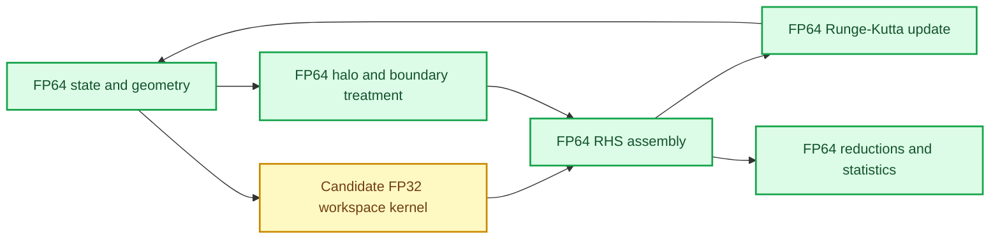

# GPU mixed-precision workspace design

_Approved architecture direction for controlled mixed-precision evaluation in ASTR, 2026-09-12_

## Scope

This design defines a staged mixed-precision path for the existing CUDA
Fortran solver. It does not change the numerical scheme, physical model, MPI
decomposition, checkpoint format, or the FP64 production baseline.

The first implementation phase keeps the authoritative flow state, geometry,
boundary algebra, communication, time integration, and diagnostics in FP64.
Only selected temporary work arrays may use FP32. Each candidate is introduced
and validated independently before any candidates are combined.

The FP64 production path remains the default. MP1 through MP3 provide four
mutually exclusive experimental exceptions: scalar `flux_work`, diagnostic
`dvel/dtmp`, viscous `sigma/qflux`, or periodic characteristic-interface-flux
workspaces may be allocated as `real(4)` within their admitted cases. `q_d`,
`qrhs_d`, `qsave_d`, `qwork_d`, `filter_work_d`, primitive fields, metrics,
physical-boundary characteristic workspaces, Roe algebra, and the shock sensor
remain `real(8)`.

## Decision

Adopt an **FP64 state plus optional FP32 workspace** architecture.

The production default remains:

```text
ASTR_GPU_PRECISION_MODE=fp64
```

The first experimental mode is:

```text
ASTR_GPU_PRECISION_MODE=mixed_workspace
```

Precision must be expressed through explicit Fortran kinds and array types.
Global compiler switches such as `-r4`, blanket source conversion, and
unqualified fast-math options are prohibited because they obscure precision
ownership and prevent field-by-field rollback. All MPI ranks must select the
same runtime precision mode.

Candidate kernels should produce FP32 workspace values directly and cast them
back only when accumulating into an FP64 output. Dedicated whole-field
conversion kernels are not part of the default design. If one is proposed, its
extra traversal, launch, and synchronization cost must be measured separately.
Every added GPU kernel retains the project's explicit post-kernel
synchronization rule.



## Precision ownership

### FP64 invariants

The following data and operations remain FP64 throughout the first mixed-
precision campaign:

| Area | FP64 ownership |
| --- | --- |
| Conservative state | `q_d`, `qrhs_d`, `qsave_d`, and Runge-Kutta updates |
| Primitive state | `rho_d`, `vel_d`, `prs_d`, `tmp_d` |
| Geometry | `jacob_d`, `dxi_d`, `x_d`, and physical boundary normals |
| Communication | solution, filter, diffusion, and sensor halo payloads |
| Boundary algebra | Roe eigensystems, NSCBC/GCBC, wall conditions, and CURVE-C23 viscous source coupling |
| Time control | CFL, time, and time-step evaluation |
| Diagnostics | conservation, statistics, norms, and production reductions |
| Persistence | checkpoint, restart, HDF5, and CPU-owned output interfaces |

These invariants prevent low-precision drift from entering the authoritative
state through MPI boundaries, physical boundary conditions, geometry, or time
integration before the workspace strategy is understood.

### Ordered FP32 candidates

Candidates are evaluated in the following order. The order reflects expected
numerical risk and rollback cost, not a claim that every candidate will be
retained.

| Order | Candidate | Initial rationale | Main numerical risk |
| --- | --- | --- | --- |
| 1 | `flux_work_d` | Large scalar reconstruction workspace with a narrow lifetime | Repeated conversion and stencil cancellation |
| 2 | `dvel_d`, `dtmp_d` | Diagnostic-gradient storage used by statistics, but not by solver diffusion | Wall-gradient and heat-flux diagnostic accuracy |
| 3 | `sigma_d`, `qflux_d` | Large viscous flux workspaces | Accumulated diffusion and boundary-source error |
| 4 | periodic `flux_characteristic_work_d` | Potential memory reduction in characteristic reconstruction | Roe projection and shock-region sensitivity |
| 5 | `shock_sensor_d` | Temporary sensor storage | Threshold crossings and changed characteristic masks |
| 6 | `filter_work_d` or `qwork_d` workspace only | Largest remaining temporary memory opportunity | High-order cancellation and error injected every filtered step |

Only one row is changed at a time. A combined mode is considered only after
the isolated candidates have frozen numerical and performance evidence.

## Non-goals

This phase does not:

- convert `q_d` or the Runge-Kutta update to FP32;
- send FP32 halo messages or write FP32 checkpoints;
- change explicit sixth-order derivatives, tenth-order filtering, Roe fluxes,
  NSCBC/GCBC, or physical models;
- enable FP16, BF16, or TF32 arithmetic;
- promise Tensor Core acceleration;
- enable global fast-math or relaxed IEEE behavior;
- replace CPU FP64 reference calculations; or
- treat a successful short smoke test as physical validation.

The existing stencil kernels are scalar and bandwidth-oriented rather than
dense matrix multiplications. Tensor Core use would require a separate
algorithmic reformulation and independent numerical validation. It is a later
research option, not part of the workspace conversion.

## Phased implementation

### MP0: Baseline and instrumentation

Freeze the FP64 reference before changing array precision.

Required work:

- obtain A800 FP64 TGV, HBL, and selected SBLI timing baselines;
- inventory every device array, allocation size, owner, lifetime, and kernel
  reader/writer;
- record candidate conversion points and ensure they add no host transfer;
- use at least five independent timing repetitions to estimate benchmark
  variation; and
- verify build files contain no global precision-conversion option.

MP0 produces the tolerance and performance-noise contract used by later
stages. Existing FP64 field thresholds must not be copied blindly to an FP32
workspace experiment.

### MP1: Smooth-flow workspace pilot

Evaluate `flux_work_d` first on uniform and smooth flows. Characteristic
workspace storage is evaluated separately under MP3 after derivative and
viscous-flux ownership is established.

Required gates include uniform free-stream preservation, curvilinear
free-stream preservation, short TGV field differences, long TGV energy and
dissipation histories, and an acoustic propagation case.

#### MP1 first-candidate status, 2026-09-12

The first candidate is implemented behind
`ASTR_GPU_PRECISION_MODE=mixed_workspace`. It is active only for all-periodic,
physical-space `543e` reconstruction with WENO7 or MP7, no characteristic
decomposition, no filtering, and no diffusion. FP64 reconstruction arithmetic
rounds directly into one FP32 scalar workspace; the RHS kernels convert each
workspace value to FP64 while accumulating into `qrhs_d`. There is no
whole-field conversion kernel and every new kernel retains an explicit
post-launch synchronization.

The local RTX 4000 Ada admission evidence is:

- CPU versus GPU FP64 remains at roundoff for `32^3`, 20-step WENO7 and MP7;
  the largest conservative-field difference is `2.84e-13`.
- GPU FP64 versus mixed has maximum `q5` differences of `8.87e-7` for WENO7
  and `1.20e-6` for MP7. Maximum TGV-statistics differences are below `3e-11`.
  The provisional gates are therefore `2e-6` absolute for fields and `5e-11`
  absolute for statistics, both with zero relative tolerance.
- WENO7 also passes NP=2 `2x1x1` and NP=4 `2x2x1` correctness checks. Halo
  payloads remain FP64.
- Compute Sanitizer reports zero invalid-access errors on the mixed path.
  Full leak checking separately exposes six existing 512-byte statistics
  temporaries that remain allocated at process exit; their call stacks do not
  include the new flux workspace.
- The scalar workspace storage is exactly halved. At `128^3`, it changes from
  `21,484,952` to `10,742,476` bytes per rank and sampled peak device memory
  changes from `1578` to `1568 MiB`.
- Five paired `128^3` runs give FP64/mixed median complete-RK times of
  `1.219752923/1.224175191 s`; mixed is `0.363%` slower. The corresponding
  spreads are `0.886%/0.291%`, so there is no local speedup evidence.

Classification: **viable but not promoted**. The mode provides verified memory
reduction and bounded short-run error, but remains experimental pending longer
physical gates, restart checks, and A800 NP=1/2/4 measurement. `fp64` remains
the production default.

### MP2: Viscous and curvilinear workspaces

Evaluate derivative and viscous-flux workspaces independently. HBL and
CURVE-C23 supply wall-gradient, skin-friction, heat-flux, reflection, and
boundary-source checks. Geometry, normals, boundary characteristic algebra,
and final RHS accumulation remain FP64.

#### MP2 implementation and local classification, 2026-09-12

At MP2 completion, the runtime selector was:

```text
ASTR_GPU_MIXED_CANDIDATE=flux|derivative|viscous_flux
```

It is collectively checked across MPI ranks and allocates exactly one candidate
workspace. Unset input retains the MP1-compatible `flux` default. Selecting
`derivative` or `viscous_flux` while the top-level precision mode is FP64 is a
hard error.

The derivative candidate changes only stored diagnostic gradients. FP64 stencil
and metric arithmetic is rounded once into FP32 `dvel/dtmp`; statistics readers
promote values before FP64 constitutive algebra and reduction. The solver
diffusion path is not a consumer of these arrays and continues to reconstruct
gradients independently from FP64 `vel/tmp`.

The viscous-flux candidate evaluates stresses and heat fluxes in FP64 and rounds
only the final `sigma/qflux` stores. Every stored-diffusion RHS reader promotes
the value before metric projection, differencing, and FP64 RHS accumulation.
For periodic and MPI boundaries, FP32 fields are packed into the existing FP64
device/host transport buffers and unpacked back to FP32. This preserves the
established MPI tags, element counts, neighbor order, host-staged payload type,
optional overlap callback ordering, and explicit post-kernel synchronization.

Local acceptance evidence is:

- derivative: NP=1/2/4 TGV fields are unchanged; Cartesian and CURVE HBL wall
  diagnostics agree to `3.91e-13` or better; invalid-access memcheck is zero;
- viscous flux: 10-step TGV maximum conservative-field difference is
  `3.70e-13`; Cartesian HBL maximum field and post-processing differences are
  `4.26e-12` and `1.97e-12`; CURVE-C23 uniform, acoustic, and viscous-HBL cases
  pass; NP=2/4 and invalid-access memcheck pass;
- derivative storage changes from `26,364,000` to `13,182,000` bytes per rank
  at `64^3`; viscous-flux storage changes from `30,375,000` to `15,187,500`
  bytes. Both reductions are exactly 50%;
- five interleaved `64^3` complete-RK measurements give derivative FP64/
  candidate medians of `8.706775/8.891394 ms` and viscous-flux medians of
  `8.736809/9.417326 ms`. The candidates are `2.120%` and `7.789%` slower on
  the local RTX 4000 Ada GPU.

Classification: **local-pass-not-promoted** for both candidates. Their measured
value is memory capacity, not local speed. They remain isolated experimental
options pending A800 and long/restart gates, and they must not be combined.

### MP3: Shock-sensitive workspaces

Evaluate characteristic reconstruction on Shu-Osher or the controlled SBLI
gates. Evaluate `shock_sensor_d` only after all smoother candidates have been
resolved. Sensor admission requires both continuous sensor differences and an
exact or explicitly bounded mask-change analysis near the threshold.

The externally validated FP64 OpenSBLI path is the oracle for this stage. A
mixed-precision shock result cannot be promoted before the corresponding FP64
physical gate is closed.

#### MP3-A implementation and local classification, 2026-09-12

The current selector is:

```text
ASTR_GPU_MIXED_CANDIDATE=flux|derivative|viscous_flux|characteristic_flux
```

`characteristic_flux` is admitted only for all-periodic, inviscid, unfiltered,
five-equation single-component RK3 cases using `543e`, MP7, and characteristic
decomposition. The existing FP64 reconstruction computes `fh(1:5)` and casts
only the final stores to `flux_characteristic_work_sp_d`; adjacent values are
promoted before FP64 RHS differencing. The Ducros sensor, exact integer mask,
Roe matrices, characteristic algebra, state, RHS, and MPI payloads remain
unchanged.

S0-A6 through S0-A10 pass with frozen field/statistics absolute tolerances of
`2e-6`, exact GPU-FP64/candidate raw sensors, and zero mask mismatches. The
largest field and statistics differences are `1.83e-7` and `1.01e-7`.
Compute Sanitizer reports zero invalid-access errors. At `400x16x16`, five
interleaved runs give FP64/candidate complete-RK medians of
`0.023973636/0.025151473 s`: the candidate is `4.913%` slower. Its selected
workspace changes from `11,984,760` to `5,992,380` bytes, an exact 50%
reduction, while sampled peak device memory changes from `656` to `650 MiB`.

Classification: **local-pass-not-promoted**. This is a bounded periodic
short-run memory option, not an OpenSBLI, physical-boundary, long-time, or A800
production result. FP64 remains the default.

### MP4: Filter workspace

Evaluate the explicit tenth-order filter workspace last. The test matrix must
cover full and scalar filter modes, smooth periodic flow, physical wall
closures, curvilinear flow, and repeated filtering. This stage must distinguish
memory reduction caused by scalar workspace mode from additional reduction
caused by FP32 storage.

### MP5: A800 production decision

Repeat retained candidates on A800 for NP=1, NP=2, and NP=4 with one MPI rank
per physical GPU. Report whole-step runtime, kernel time, conversion overhead,
peak memory, largest allocatable grid, communication time, and numerical error.

Candidates that remain useful but do not justify the production risk stay as
documented experimental modes. `fp64` remains the default unless the complete
production gate is approved.

## Validation gates

Validation separates software correctness, numerical agreement, physical
agreement, and performance.

### Software correctness

- CPU and GPU builds pass without global precision switches.
- Compute Sanitizer reports no invalid access, race, or leak attributable to
  the new mode.
- Density, pressure, temperature, metrics, and time step remain finite and
  physically admissible.
- NP=1/2/4 runs agree on the selected mode and preserve restart semantics.
- Profiling shows no conversion-induced whole-field H2D/D2H transfer and no
  avoidable conversion-only traversal or launch.
- Every added kernel is followed by an explicit synchronization.

### Numerical agreement

- Record $L_\infty$, $L_2$, and relative norms for every primitive and
  conservative field.
- Compare FP64 GPU, mixed GPU, and CPU FP64 at the same Runge-Kutta phase.
- Freeze candidate-specific thresholds from MP0 pilot evidence, expected FP32
  workspace roundoff, and the discretization uncertainty of the case.
- Do not require bitwise identity or automatically reuse the current
  `1e-10` FP64-equivalence threshold.
- Reject unexplained monotonic growth even when the final short-run norm is
  below a provisional threshold.

### Physical and statistical agreement

- TGV: kinetic energy, dissipation or enstrophy history, and long-time trend.
- HBL: wall pressure, skin friction, heat flux, and velocity/temperature
  profiles.
- Acoustic and CURVE-C23: reflection coefficient and boundary stability.
- Shock/SBLI: shock location, wall quantities, sensor distribution, and
  characteristic mask.
- MPI/restart: topology independence and continuous statistical histories.

Passing numerical norms does not by itself establish physical equivalence.
Each production candidate must pass both levels for every affected flow class.

## Relaxed performance-candidate policy

The discovery phase has no fixed minimum speedup or memory-saving percentage.
A numerically admissible candidate may be retained for further study when at
least one of the following is demonstrated:

- a repeatable positive runtime signal larger than the measured benchmark
  noise;
- a measured memory reduction consistent with array-size accounting;
- a larger grid or rank-local problem becomes allocatable and runnable;
- a useful portability or operational benefit is created for a future GPU
  backend.

A candidate with a small RTX or initial A800 speedup is recorded as
**viable but not promoted** rather than discarded. This permits architecture-
dependent gains to be reassessed without weakening the production default.

A candidate is rejected when it fails a numerical or physical gate, causes a
statistically credible whole-step regression without compensating memory or
capacity value, introduces new host transfers or synchronization, or fails to
deliver the memory reduction predicted by its storage change.

Production promotion is stricter than candidate retention. The A800 result
must be non-regressive at whole-step level and provide a measured benefit in
runtime, memory, problem capacity, energy, or backend portability. The report
must state the observed effect and uncertainty; no predetermined percentage is
required.

## MPI, restart, and backend constraints

- Halo payloads remain FP64 in the first campaign, so mixed workspaces do not
  alter the current HaloTransport protocol or MPI tags.
- Rank-local workspace conversion must occur after required FP64 halo data is
  available and before FP64 RHS accumulation.
- Checkpoints remain FP64 and store only authoritative state. Restarting a
  mixed run therefore reconstructs temporary workspaces rather than persisting
  them.
- Precision kinds and ownership belong behind backend-neutral interfaces.
  CUDA-specific conversion intrinsics must not leak into `src/`.
- A future HIP/DCU implementation may retain a candidate for memory or
  portability value even when the NVIDIA speedup is small, but it must pass the
  same numerical gates.

## Failure and rollback behavior

An unknown precision mode, inconsistent MPI-rank mode, unsupported candidate,
failed allocation, non-finite conversion result, or invalid physical state is
a hard runtime error. The solver must not silently fall back within a running
case because that would make the numerical trajectory and performance record
ambiguous.

Rollback means rerunning with `ASTR_GPU_PRECISION_MODE=fp64`. The FP64 code
path, array declarations, and validation drivers remain intact throughout the
campaign.

## Orthogonal flux-pair fusion

`ASTR_GPU_FLUX_PAIR_MODE=fused` is a kernel-structure optimization independent
of workspace precision. It combines the positive and negative periodic `543e`
reconstruction kernels but does not change the FP64 authoritative state or the
precision-mode contract. FP64 split/fused and mixed split/fused must therefore
be validated as separate pairs. Neither candidate may hide a regression in the
other, and production promotion requires A800 evidence for each mode alone
before their combined configuration is considered.

## Success definition

The mixed-precision workspace phase is successful when:

- precision ownership is explicit and auditable;
- the FP64 production path remains unchanged and reproducible;
- each candidate has isolated field, physical, memory, and timing evidence;
- retained candidates add no hidden host transfer or communication-format
  change;
- A800 NP=1/2/4 results support an explicit promote, retain-experimental, or
  reject decision for every tested candidate; and
- claims distinguish reduced storage, increased problem capacity, kernel
  acceleration, whole-step acceleration, and physical validity.
