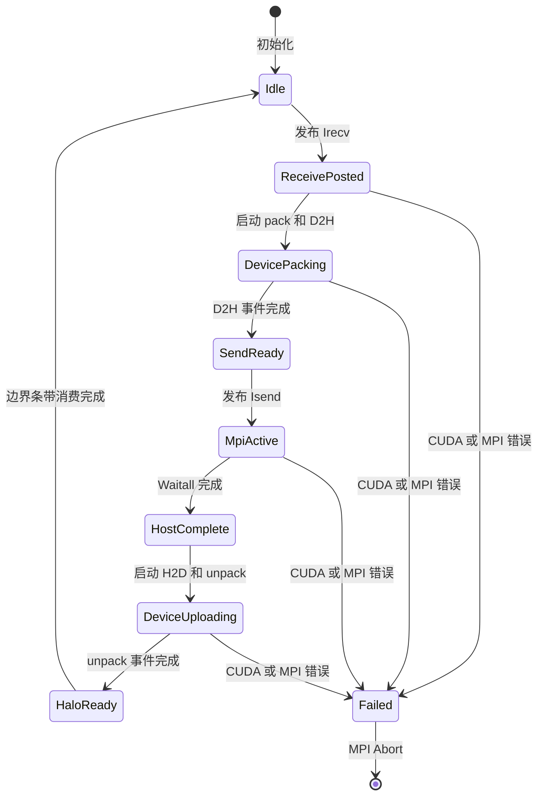
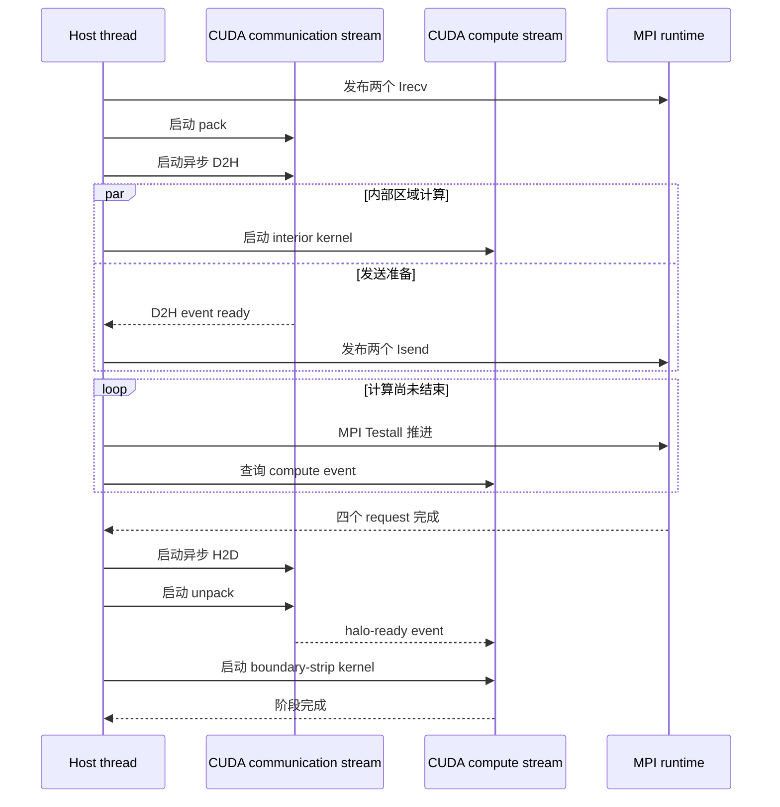

# ASTR P4 计算与通信重叠设计

_面向本地双 GPU 筛选和后续 A800 单节点强扩展验收，2026-09-15_

---

## 📋 决策摘要

本阶段采用主机暂存双流流水线。它在不依赖 CUDA-aware MPI 的条件下，将
GPU pack、异步 D2H、MPI halo、异步 H2D 和 unpack 与不依赖 halo 的内部区域
计算重叠。现有 `pageable`、`pinned` 和 `pinned-overlap` 后端保持不变，新增
`pinned-pipeline` 作为受控实验后端。

本阶段先修复性能基准的无效 HDF5 生命周期开销，再建立可归因时间线，最后
实现异步流水线。A800 上正在运行的任务不终止、不修改，也不作为本地实现的
交互式测试环境。

验收目标保持为 A800 单节点 `512x512x512` TGV、FP64、完整五变量滤波工作区，
拓扑最优 NP=1 到 NP=4 强扩展效率不低于 70%，逐场误差不超过 `1e-10`。
本地双 GPU 只承担实现筛选、正确性、Compute Sanitizer 和 Nsight Systems
重叠证据，不产生 A800 性能结论。

## 🔍 已确认的问题

### A800 基准生命周期失真

任务 `458942` 的 NP=1 完整 RK 中位时间约为 `1.75868 s`。NP=2 x-slab
warm-up 的完整 RK 均值约为 `1.32896 s`，对应初步强扩展效率 `66.17%`。
其中首阶段准备效率约为 `74.85%`，后续积分效率约为 `62.95%`。NP=2 达到
70% 效率需要将完整 RK 时间再降低约 `5.47%`。这些数值来自未完成矩阵，
只能用于定位，不能作为最终论文数据。

当前 benchmark 每个独立进程都会重新执行生成网格和初始场写出。
`gridgeneration::gridgen` 在生成网格后调用 `writegrid`，
`initialisation::flowinit` 无条件调用 `writeflfed`。NP=2 warm-up 因而写出约
`3.24 GB` 网格和约 `6.48 GB` 流场，进程生命周期接近四小时，而 22 个 RK
步只占约 29 秒。`FEQCHKPT > MAXSTEP` 仅关闭时间循环内 checkpoint，不能关闭
这两次启动写出。

### 当前重叠范围不足

[`halo_transport_gpu.cuf`](../../../src_gpu/halo_transport_gpu.cuf) 中的
`exchange_host_pair` 只有在传入 callback 时才使用非阻塞 MPI。当前 callback
只用于完全周期、开启黏性项且使用 stored diffusion 路径时的第一条活动分解轴。
它仅把 MPI request 存活期与三个 diffusion-RHS 内部 kernel 重叠。

以下阶段仍然串行：

- pack kernel 与强制设备同步
- device-to-host 赋值
- 大部分 solution 和 filter halo
- 第二、第三条分解轴的通信
- host-to-device 赋值与 unpack kernel
- `sigma_d` 之后的 `qflux_d` halo

因此 `pinned-overlap` 是局部 MPI wait 隐藏，不是完整通信流水线。

### 全局 selective sync 不是目标实现

既有单卡实验将 `cudaDeviceSynchronize` 大幅减少后没有得到完整 RK 收益。
本阶段不重新启用全局“尽量不同步”策略。同步只根据跨流、MPI host buffer、
halo消费和主机读回依赖移除，默认流上的计算顺序仍由 CUDA stream 保证。

## 🏗️ 目标架构

### 运行模式

| 配置 | 用途 | 默认值 | 约束 |
| --- | --- | --- | --- |
| `ASTR_GPU_HALO_TRANSPORT=pageable` | 兼容基线 | 默认 | 阻塞主机暂存 |
| `ASTR_GPU_HALO_TRANSPORT=pinned` | 固页基线 | 可选 | 阻塞 MPI |
| `ASTR_GPU_HALO_TRANSPORT=pinned-overlap` | P3 基线 | 可选 | 仅 stored diffusion 局部重叠 |
| `ASTR_GPU_HALO_TRANSPORT=pinned-pipeline` | P4 候选 | 新增、可选 | 首期仅周期 TGV |
| `ASTR_GPU_SYNC_MODE=explicit` | 调试与回归 | 默认 | 每个 kernel 后设备同步 |
| `ASTR_GPU_SYNC_MODE=dependency` | P4 候选 | 新增、可选 | 仅与 `pinned-pipeline` 联用 |
| `ASTR_GPU_BENCHMARK_NO_FIELD_IO=1` | 计算基准 | 新增、默认关闭 | 仅 GPU TGV 且启用 RK timing |

所有 MPI rank 必须选择相同模式。非法组合、rank 间配置不一致、固定主机内存
注册失败或异步状态机非法迁移均 fail closed。注册失败时不得静默宣称流水线
有效，可以明确回退到 `pageable`，同时输出统一的失活原因。

### 组件职责

| 组件 | 新职责 | 不承担的职责 |
| --- | --- | --- |
| `gpu_check` | 启动错误检查、流边界同步、依赖事件等待 | 决定数值阶段顺序 |
| `halo_transport_gpu` | request/context 生命周期、MPI进度、固页缓冲注册 | pack/unpack 数值索引 |
| `halo_exchange_gpu` | 各轴 pack/unpack、异步拷贝和事件连接 | 选择内部区计算 kernel |
| `mainloop_gpu` | 启动内部区、等待 halo、启动边界条带 | 直接管理 MPI request |
| benchmark driver | 五轮计时、I/O禁用、完整元数据与结果校验 | 修改生产输出配置 |
| profile analyzer | 阶段时间、MPI/kernel交叠和同步计数 | 用单核时间代替完整 RK |

### Halo context

每个活动方向和字段族拥有独立 context，至少保存：

- 方向、字段族、消息长度和固定 tag
- 两个接收与两个发送 request
- device send/receive buffer 和 pinned host send/receive buffer
- pack/D2H 完成事件和 H2D/unpack 完成事件
- 当前状态、激活标志和失败原因

context 不拥有权威流场。缓冲区在 request 完成和消费事件完成前不得复用。
首期保持单主机线程调用 MPI，不要求 `MPI_THREAD_MULTIPLE`。

### 单方向流水线

接收缓冲区与发送缓冲区相互独立，因此 `MPI_Irecv` 可以在 pack 前发布。
pack 与 D2H 位于 communication stream，内部区域 kernel 位于 compute stream。
两者只读取同一权威输入时允许并发，不允许未声明的跨流读写竞争。

### 多方向扩展

首个实现一次只激活一条分解轴，用于验证状态机和单轴 slab。随后扩展为每轴
独立 context，使 `2x2x1`、`2x1x2` 和 `1x2x2` 能同时提前发布接收。不同轴
继续使用现有私有固定 MPI tag 区间，不复用仍处于 active 状态的 request 或
buffer。

多方向并发不能改变数值操作顺序。filter 的 x、y、z pass 仍依次完成，只在
每个 pass 内将内部区计算与该方向 halo 重叠。solution 与 diffusion flux 可在
字段依赖允许时提前发布接收，但 boundary-strip kernel 必须等待对应方向的
halo-ready event。

## 🔄 同步与错误语义

### 保留的同步边界

`dependency` 模式仍在以下位置建立明确完成关系：

1. MPI 读取 pinned send buffer 前等待 D2H 完成事件
2. boundary-strip kernel 消费 receive buffer 前等待 unpack 完成事件
3. host 统计量、验证快照、checkpoint 或文件输出读取 device 数据前
4. 完整 RK 计时采样结束前
5. 程序退出和缓冲区释放前

kernel launch 后继续立即调用 `cudaGetLastError`。异步执行错误在最近的流或
事件边界报告，并同时输出该 stream 最后一个 kernel label。不得用删除错误
检查换取性能。

### 可以移除的同步

只有满足以下条件时才移除 `cudaDeviceSynchronize`：

- 前后 kernel 位于同一 stream，CUDA顺序已经建立依赖
- 并发 stream 对同一数组只有 read-read 或访问不重叠区域
- host 不读取未完成的 device 或 pinned buffer
- MPI 不访问尚未完成 D2H 的 send buffer
- 后续消费方具有显式 event 依赖

没有依赖图证明的同步保持不动。物理边界、CURVE、shock、chemistry、统计量和
文件输出路径在首期继续使用 `explicit`。

## ⚙️ 分阶段实施

### P4-0 基准可信化

1. 增加默认关闭的 `ASTR_GPU_BENCHMARK_NO_FIELD_IO`
2. 仅在 GPU 周期 TGV 且启用 RK timing 时跳过 `writegrid` 和初始 `writeflfed`
3. 保持生产输入、checkpoint、统计量和普通运行输出语义不变
4. benchmark 检查运行目录内没有新 `grid.h5` 和 `flowfield.h5`
5. 为 prepare、filter、solution halo、convection、diffusion flux、diffusion halo、
   diffusion RHS 和 RK update 建立可解析阶段标记
6. 本地 `256^3` NP=1/2 x、y、z slab 各完成五轮基线

P4-0 是后续优化的阻塞门槛。未消除HDF5生命周期开销或无法形成阶段归因时，
不得改通信实现。

### P4-1 单轴异步状态机

1. 新增 `pinned-pipeline` 和 `dependency`，保持默认配置不变
2. 实现 per-axis context、异步 pack/D2H、MPI进度、异步H2D/unpack
3. 首先接入周期 TGV 的 solution halo
4. 再接入完整 qwork filter halo
5. 最后接入 `sigma_d` 和 `qflux_d` diffusion halo
6. 对 x、y、z slab 分别验证实际重叠和完整 RK 时间

### P4-2 内部区与边界条带

1. 为每个候选阶段明确 interior 下标范围和宽度
2. interior kernel 不读取任何远端 halo
3. boundary-strip kernel 只覆盖受对应方向 halo 影响的网格点
4. 每个网格点每阶段只写一次权威输出
5. 先保持算术表达式和求值顺序不变，再单独评估 kernel 数量增加的代价

### P4-3 多轴和消息聚合

1. 为二维分解同时维护两个 context
2. 为三维正确性测试维护三个 context
3. 单独评估合并 `sigma_d(1:6)` 和 `qflux_d(1:3)` 的九变量消息
4. 只有完整 RK 改善时保留消息聚合
5. 本地 NP=4/8 共享双卡只用于正确性，不报告扩展效率

### P4-4 A800 验收

本地门槛通过并形成干净提交后，才准备新的 A800 作业。该作业不复用当前
`458942`，也不修改其目录。正式矩阵至少包含：

| 类型 | 网格 | MPI | 拓扑 |
| --- | --- | --- | --- |
| 强扩展 | `512x512x512` | NP=1 | `1x1x1` |
| 强扩展 | `512x512x512` | NP=2 | 三种 slab |
| 强扩展 | `512x512x512` | NP=4 | 三种 slab 与三种双轴分解 |
| 时间线 | `512x512x512` | NP=2/4 | 各自最优拓扑 |

## ✅ 验证门槛

### 基准逻辑

- `ASTR_GPU_BENCHMARK_NO_FIELD_IO` 默认关闭
- 非TGV、CPU、未启用RK timing或rank配置不一致时 fail closed
- 性能运行不生成网格或流场HDF5
- 五轮计时仍保留独立进程、warm-up和20个有效RK样本
- 计时结果拒绝缺rank、缺step、非有限值和重复冲突记录

### 数值正确性

- FP64完整工作区保持权威
- NP=1/2 的 x、y、z slab 完成 1、10 和 100 步逐场比较
- `q` 与原始变量最大绝对误差不超过 `1e-10`
- TGV动能、拟涡能和耗散率统计差不超过既有门槛
- NP=4/8共享双卡只验证多轴状态机、固定tag和halo内容

### 并发安全

- Compute Sanitizer memcheck 为 0 errors
- racecheck 不报告 pipeline 新增的数据竞争
- request 未完成前不能复用host或device buffer
- context 退出时没有active request、未销毁event或已注册host buffer
- 任一 rank 失败时使用统一 MPI abort 路径

### 性能证据

- Nsight Systems 同时采集 CUDA、MPI 和阶段标记
- 报告 pack、D2H、MPI wait、H2D、unpack和interior kernel时间
- 直接报告MPI request与interior kernel的时间交集
- 报告 `cudaDeviceSynchronize`、stream/event wait和MPI调用次数
- 本地候选相对 `pinned-overlap/explicit` 回退不得超过2%
- 本地没有收益但具有真实重叠证据的候选只保留为opt-in，不晋升默认
- A800最终NP=4强扩展效率不低于70%

## 🚫 非目标

本阶段不包含：

- 修改六阶中心差分、十阶中心滤波或RK3公式
- CUDA-aware MPI、NVSHMEM、NCCL或GPUDirect RDMA生产接入
- 多节点扩展
- 物理边界、CURVE、shock或chemistry路径的异步化
- GPU HDF5、checkpoint或场输出移植
- 为减少通信而缩短固定 `hm` halo层数
- 用GPU利用率或单kernel时间替代完整RK验收

## ⚠️ 风险与回退

| 风险 | 检测 | 回退 |
| --- | --- | --- |
| MPI缺少异步进度 | request完成状态和时间线 | 主机持续 `MPI_Testall` |
| 拷贝与kernel不能重叠 | CUDA copy-engine时间线 | 保留pinned阻塞路径 |
| 拆分kernel增加launch成本 | NP=1与NP=2完整RK | 候选保持opt-in或撤销 |
| 多流发生数据竞争 | racecheck与逐场误差 | 回退到explicit同步 |
| 固页注册失败 | 所有rank统一状态 | 明确记录后回退pageable |
| A800与本地排序不同 | A800配对矩阵 | 不外推本地性能结论 |

## 📚 内部依据

- [GPU性能优化计划](../../../documents/ASTR_GPU_PERFORMANCE_OPTIMIZATION_PLAN.md)
- [P3基线报告](../../../documents/ASTR_PHASE_P3_BASELINE_REPORT.md)
- [P3实施计划](../../../documents/ASTR_PHASE_P3_IMPLEMENTATION_PLAN.md)
- [A800 TGV缩放矩阵计划](../../../documents/ASTR_A800_TGV_SCALING_MATRIX_PLAN.md)
- [GPU并行架构维护文档](../../../documents/maintenance/parallel-gpu-architecture.md)
