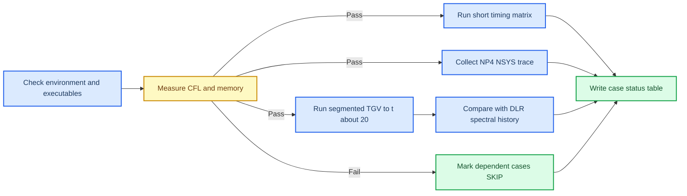

# ASTR four-A800 TGV campaign plan

_Submission-ready TGV-only performance and production campaign, updated 2026-09-08._

---

## 🎯 Campaign objective

One Slurm submission runs the retained Taylor-Green vortex cases, records each
case independently, and continues after a case-level failure. The campaign
produces CPU/GPU timing, one-to-four-GPU strong scaling, HaloTransport evidence,
an NSYS trace, and a restartable `512^3` production trajectory to approximately
`t=20`.

The production trajectory is compared with the DLR `512^3`, `Re=1600` spectral
diagnostic history.[^1] The spectral data is a physical reference rather than a
discretization-level oracle because ASTR solves the weakly compressible system
at `Ma=0.1` and applies an explicit tenth-order filter.

## 📋 Retained case matrix

All solver executions use the TGV initial condition. The common numerical
configuration is `Re=1600`, `Ma=0.1`, explicit sixth-order central derivatives,
explicit tenth-order filtering, RK3, and periodic boundaries.

| ID | Grid and execution | Resources | Purpose | Failure behavior |
| --- | --- | --- | --- | --- |
| T0 | `512^3`, one short advance | GPU NP=1 | Measure `dt` for CFL=1, finite state, occupancy, and peak memory | Dependent cases become `SKIP` |
| T1a | `256^3`, five 10-advance runs | CPU NP=1 | Same-node CPU wall-time baseline | Record `FAIL`, continue |
| T1b | `256^3`, five 10-advance runs | GPU NP=1 | Same-size GPU wall-time baseline | Record `FAIL`, continue |
| T2 | `512^3`, five runs with 20 retained advances | GPU NP=1 | Single-A800 baseline | Record `FAIL`, continue |
| T3 | Same as T2 | GPU NP=2, `1x1x2` | Two-A800 strong scaling | Record `FAIL`, continue |
| T4 | Same as T2 | GPU NP=4, `1x1x4` | Four-A800 strong scaling | Record `FAIL`, continue |
| T5 | Same as T4 with pageable halo staging | GPU NP=4, `1x1x4` | HaloTransport control | Record `FAIL`, continue |
| T6 | `512^3`, five advances under NSYS | GPU NP=4, `1x1x4` | CUDA, synchronization, and MPI timeline | Record `FAIL`, continue |
| T7 | `512^3`, segmented to approximately `t=20` | GPU NP=4, `1x1x4` | Production physics and DLR comparison | Retry each failed segment once |

`MAXSTEP=N` currently performs `N+1` RK advances. The timing driver therefore
uses 22 advances, discards the first two, and retains exactly 20 per repetition.
T1 uses `MAXSTEP=9` for exactly 10 end-to-end advances.

## 🧮 CFL and production length

T0 runs with a trial step and reads ASTR's own `time step for CFL=1` value,
denoted by $\Delta t_{\mathrm{CFL}=1}$. The production step is

$$
\Delta t = \operatorname{floor}_{10^{-12}}\left(0.50\,\Delta t_{\mathrm{CFL}=1}\right).
$$

The number of physical advances is

$$
N = \left\lceil \frac{20}{\Delta t}\right\rceil.
$$

The local `128^3` observation gives CFL `0.6524326` at `Delta t=1.0e-3`.
Uniform-grid scaling predicts `Delta t_CFL=1` near `3.833e-4` at `512^3`, hence
`Delta t` near `1.916e-4` and approximately 104,390 advances. These are planning
values only; T0 replaces them with the A800 executable's measured result.

Every completed production segment must report `0 < CFL < 1`. T7 stops if any
reported value reaches unity. The target CFL of `0.50` leaves margin for early
transient variation and temporal-discretization error.

## 🔄 Restart and error isolation

T7 uses absolute 2,000-step segment endpoints. A successful endpoint requires:

- solver exit status zero
- `The job is done!` in the segment log
- no crash, IEEE exception, or non-finite marker
- every reported CFL strictly between zero and one
- `outdat/auxiliary.txt` at the expected absolute step
- a nonempty `outdat/flowfield.h5`

One failed attempt restores the last valid checkpoint and retries once. If a
checkpoint write was interrupted, recovery is allowed only when ASTR's `bakup`
copy has the expected prior step. The driver never advances the segment counter
without a validated checkpoint.

The platform reports `MaxTime=UNLIMITED` and `JobRequeue=0` for `A800-N` on
2026-09-08. The batch allocation is therefore requested for seven days, while
checkpoint segmentation protects against solver failure but not complete node
or scheduler loss.

## 📊 DLR comparison contract

The archived reference contains 2,000 points from `t=0` through `t=19.99` at
increments of `0.01`. Its columns are time, kinetic energy, dissipation rate
`-dE/dt`, and enstrophy. The reference dissipation maximum is
`0.012857528187` at `t=8.97`.

ASTR samples are linearly interpolated to the DLR times. The report contains:

- relative L2 differences for energy, dissipation, and enstrophy
- ASTR and DLR peak dissipation values and times
- peak-time and peak-amplitude differences
- all 2,000 aligned samples
- a red-blue comparison figure in EPS and JPEG formats

ASTR writes its first statistics row after the first RK advance. The comparator
adds the analytic `t=0` TGV values `E=0.125`, `Omega=0.375`, and
`epsilon=2*Omega/Re=0.00046875`; subsequent samples come only from ASTR output.

The first production run reports these differences without an arbitrary
pass/fail tolerance. Finite evolution, CFL compliance, checkpoint continuity,
and complete time coverage remain hard gates.

## 🔍 Pre-submission audit gate

Formal `sbatch` submission is prohibited until all login-node checks pass:

1. Stage the current source below `/data/user/hd56000/weiph`.
2. Build CPU and GPU executables from the top-level `CMakeLists.txt`.
3. Confirm no relaxed-math option in `compile_commands.json`.
4. Verify the DLR SHA256 equals
   `60bfeaee2dd32de1b9e7171c70cf3774b6053d82a785d526c055547a0757017a`.
5. Run Python unit tests and Bash syntax checks.
   Use `/data/user/hd56000/weiph/venv_tgv_campaign_py311/bin/python`; the
   platform Python 3.6 is below the validation scripts' supported version.
6. Run `ASTR_CAMPAIGN_DRY_RUN=1` and inspect all nine case labels.
7. Launch the GPU executable on the login node only far enough to confirm that
   input, dynamic libraries, HDF5, and MPI initialize before the expected
   no-device failure.
8. Present the exact commit, executable hashes, requested resources, expected
   output root, and unresolved risks for user approval.

The login node must not run the real `512^3` solver workload. The audit itself
did not submit a formal job. After user approval, the campaign was submitted
as Slurm job `451398` on 2026-09-08; it remained `PENDING (Priority)` when
checked on 2026-09-09.

[^1]: DLR Institute of Aerodynamics and Flow Technology, `spectral_Re1600_512.gdiag`, http://www.as.dlr.de/hiocfd/spectral_Re1600_512.gdiag
