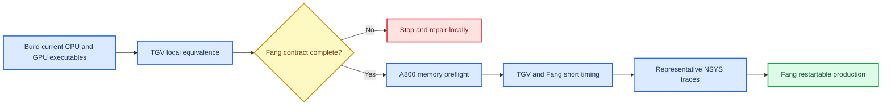

# A800 TGV and Fang SBLI execution plan

_ASTR GPU pre-submission and production matrix, updated 2026-09-08._

---

## 🎯 Evidence target

The A800 campaign retains two cases only. Periodic Taylor-Green vortex (TGV)
provides controlled CPU/GPU and strong-scaling evidence. The Fang et al. Mach
2.25 shock-wave/turbulent-boundary-layer interaction (SWTBLI) case provides a
full-size three-dimensional application with physical walls, inflow/outflow,
an imposed incident shock, transition forcing, shock sensing, viscous terms,
and MPI halo transport.[^1]

The Fang case reproduces the published physical configuration, not the exact
published discretization. The paper uses a compact sixth-order treatment for
diffusion, whereas the approved ASTR GPU scope uses explicit sixth-order
central differences and does not include compact linear solves.[^1]

## 📊 Retained case matrix

`MAXSTEP=N` advances `N+1` complete RK steps in the current controller. Timing
scripts must count `ASTR_GPU_RK_TIMING` records instead of assuming that
`MAXSTEP` equals the number of samples.

| ID | Case and grid | GPU topology | Execution length | Class | Evidence |
| --- | --- | --- | --- | --- | --- |
| T1 | TGV `512x512x512` | NP=1 | one complete RK step | Short preflight | Full-ASTR memory allocation and finite-state gate |
| T2 | TGV `512x512x512` | NP=1 | five independent runs, each with two warm-up and 20 timed RK steps | Short performance | Single-GPU A800 baseline |
| T3 | TGV `512x512x512` | NP=2 `1x1x2` | same as T2 | Short performance | Two-GPU strong scaling |
| T4 | TGV `512x512x512` | NP=4 `1x1x4` | same as T2 | Short performance | Four-GPU strong scaling |
| T5 | TGV `512x512x512` | NP=4 | pageable and pinned-overlap, five runs each | Short performance | End-to-end HaloTransport benefit |
| T6 | TGV `256x256x256` | CPU NP=1 and GPU NP=1 | three independent runs, each with two warm-up and 10 timed RK steps | Short performance | Same-node CPU/GPU speedup |
| F1 | Fang reduced gate `1008x112x64` | CPU/GPU NP=4 `4x1x1` | three complete RK steps | Short correctness | Field, statistic, boundary, sensor, and MPI equivalence |
| F2 | Fang `4020x220x256` | NP=4 `4x1x1` | one complete RK step | Short preflight | Memory, finite-state, boundary, and GPU-occupancy gate |
| F3 | Fang `4020x220x256` | NP=2 `2x1x1` | three independent runs, each with two warm-up and 10 timed RK steps | Short performance | Two-GPU full-case baseline if memory permits |
| F4 | Fang `4020x220x256` | NP=4 `4x1x1` | same as F3 | Short performance | Four-GPU full-case throughput and NP=2 to NP=4 scaling |
| F5 | Fang `4020x220x256` | NP=4 `4x1x1` | restartable segments until statistical gates close | Long production | Time/spanwise statistics and physical comparison |
| P1 | TGV `512x512x512` | NP=4 | two warm-up and three profiled RK steps | Short diagnostic | NSYS compute, synchronization, and MPI decomposition |
| P2 | Fang `4020x220x256` | NP=4 `4x1x1` | two warm-up and three profiled RK steps | Short diagnostic | NSYS complex-case compute and communication decomposition |

The Fang mesh has `226,406,400` points. Linear scaling from the current
`256^3` curvilinear peak gives an initial estimate of about `65 GiB/GPU` for
NP=2 and `33 GiB/GPU` for NP=4. These values are planning estimates only; F2
must measure the actual allocation before F3 or F5 is submitted.

## 🧪 Local platform-readiness gates

The local workstation cannot validate A800 timing. It can close the following
submission risks:

1. Rebuild CPU and GPU executables from the same current checkout with the
   repository top-level `CMakeLists.txt`.
2. Run TGV NP=1 and multi-rank explicit-scheme comparisons with filtering and
   diffusion enabled; require finite fields and CPU/GPU differences within the
   owning `1e-10` gates.
3. Run the existing Mach-2 physical-SBLI NSCBC gate as a component test for
   profile inflow, upper shock state, wall, outlet, diffusion, MP7/Roe/Ducros,
   and MPI halo transport. This result is not Fang evidence.
4. Reject A800 submission until a Fang-specific case generator reproduces the
   Mach `2.25`, `Re_delta0=11277`, domain `85.1x10.5x1.85`, wall temperature,
   Rankine-Hugoniot upper state, NSCBC outlet, outlet sponge, periodic spanwise
   boundary, and deterministic transition forcing of the target case.[^1]
5. Validate NP=4 `4x1x1` for the Fang path. The current OpenSBLI conservative
   admission gate allows NP=4 plane decompositions only and therefore cannot
   serve as this validation.
6. Generate every production input on the login node and run parser/admission
   checks there. A no-GPU failure is acceptable only after input, HDF5, MPI,
   shared-library, and case-contract checks have completed.
7. Keep all remote source, build, temporary, profile, and output files below
   `/data/user/hd56000/weiph`.

Any failed gate stops the sequence. Later tests must not run with a silently
simplified boundary condition, disabled shock path, reduced grid, or changed
numerical scheme.

## 📋 Local execution status

Status on 2026-09-08: the retained TGV driver and the mixed-Mach profile-inlet
component gate pass locally. Fang production remains blocked by case-specific
inputs that are not published in sufficient detail for exact reconstruction.

| Gate | Result | Evidence |
| --- | --- | --- |
| Current CPU/GPU build from top-level CMake | Pass | `build_cpu_probe/bin/astr` and `build_gpu_probe/bin/astr` rebuilt successfully |
| Input, boundary, and OpenSBLI Python unit subset | Pass | 19 tests passed with `PYTHONPATH=tests/gpu_validation` |
| TGV NP=1, `128^3`, 10 steps, filter and diffusion | Pass | Maximum field difference `q5=2.8421709430404007e-13` |
| TGV NP=2 `1x1x2`, `128^3`, 3 steps | Pass | Maximum field difference `q5=2.8421709430404007e-13` |
| TGV NP=4 `1x1x4`, `128^3`, 3 steps | Pass | Maximum field difference `q5=2.8421709430404007e-13` |
| Physical-SBLI component gate, NP=1, 2 steps | Pass | Maximum field difference `q1=1.3322676295501878e-15`; maximum statistic difference below `3.6e-13` |
| Physical-SBLI component gate, NP=2 `2x1x1`, 2 steps | Pass | Maximum field difference `q1=1.3322676295501878e-15`; maximum statistic difference below `1.6e-13` |
| Multi-rank TGV performance-driver unit contracts | Pass | 9 timing and driver tests passed |
| Multi-rank TGV performance-driver integration | Pass | `typedefine` is initialized; NP=1 and NP=2 pageable/pinned-overlap driver integration passed locally |
| Fang modal wall-forcing contract | Pass | CPU/GPU use the configured 5 temporal modes, 10 spanwise modes, and a shared deterministic phase file |
| Fang mixed-Mach profile inlet | Pass | `mach_pressure` gate contains 8 subsonic and 23 supersonic profile points; CPU/GPU pressure error `5.5511151231257827e-17` |
| Existing complete-state profile inlet | Pass | Default behavior retained; CPU/GPU reconstructed `q5` difference `7.1054273576010019e-15` |
| Fang-specific F1 gate | Blocked | Author-provided grid/stretching, inlet profile or developed restart, forcing phases, and exact streamwise placement are still required |

The `bctype=11 + prof` inlet now retains its existing complete-state behavior by
default. `ASTR_PROFILE_INFLOW_MODE=mach_pressure` selects the Fang-compatible
mixed-Mach treatment: local normal Mach number is computed with the geometric
x-min normal, pressure is extrapolated only at subsonic profile points, and
density is reconstructed from the prescribed temperature. This closes the
inlet logic defect without silently changing existing cases. It does not
replace the missing author inputs or validate the complete Fang configuration.

## 🚀 Production acceptance

F5 separates development and sampling. Formal sampling starts only after mass
flow, upstream skin friction, interaction-region wall pressure, and separation
length show stationary block statistics. Production evidence must include:

| Quantity | Required output |
| --- | --- |
| Mean wall pressure | Streamwise distribution and block convergence |
| Wall-pressure fluctuation | RMS distribution and sample count |
| Skin-friction coefficient | Mean distribution, separation, and reattachment |
| Negative-skin-friction probability | Streamwise distribution |
| Reference-station boundary layer | Mean velocity and Reynolds-stress profiles |
| Shock system | Instantaneous and mean density-gradient or pressure field |
| Restart continuity | Statistics immediately before and after every restart |

Running F4 proves computational capability only. A production claim requires
F5 statistical closure. Without a developed turbulent restart, convergence
from the published laminar inlet and transition strip is a schedule risk and
must not be replaced by a short-run physical claim.

## 🗑️ Removed work

The campaign does not include TGV `384^3`, a generic `1024x256x192` SBLI
benchmark, the full TGV weak-scaling matrix, an exhaustive NP=4 topology sweep,
an all-kernel NCU matrix, Fang NP=1, or repeated small-grid regression matrices.
The OpenSBLI thin-layer case remains prior correctness evidence and is not used
as the main A800 performance workload.

[^1]: Fang, J., Zheltovodov, A. A., Yao, Y., Moulinec, C., and Emerson, D. R. (2020). "On the turbulence amplification in shock-wave/turbulent boundary layer interaction." *Journal of Fluid Mechanics*, 897, A32. https://doi.org/10.1017/jfm.2020.350
