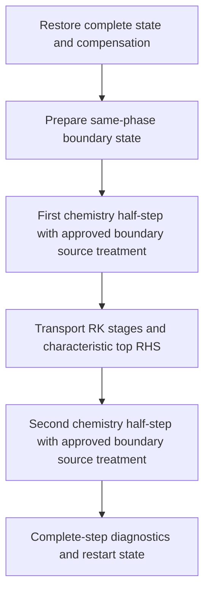

# AIR5 Two-Temperature Characteristic Top Boundary

## Inflow-Transit Relaxation: Implemented and Refined (2026-09-27)

The user approved replacing only the nonacoustic target relaxation with
`k_c = (max(-u_n,0)/a_ref)*(1/tau)`. The fixed frozen sound speed a_ref is
computed once from the configured HBL farfield state, not from the evolving
boundary node; L_c=a_ref*tau is the equivalent transit length. CPU and GPU
pass the same reference to the shared host/device characteristic routine.
The rate is evaluated without forming a mass flux followed by density
division, and the reference speed and rate are checked for finiteness.

The normal advective characteristic correction is unchanged. The two acoustic
projections still use 1/tau, and their incoming/outgoing tests are unchanged.
Only the nonacoustic projection uses k_c. There is no tanh weight, empirical
velocity deadband, speed cap, or new source/diffusion projection. The rate is
continuous at zero normal velocity but is not continuously differentiable
there. The default prescribed boundary remains unchanged.

Characteristic checkpoint policy version is now 2. The existing metadata
already includes the farfield state and tau, so a_ref is reproducible without
another independent parameter. Version-1 characteristic checkpoints are
rejected rather than silently resumed under the new policy; prescribed-mode
checkpoints retain version 1. The GPU validation/restart opt-in guards remain.

Verification:

- Root-CMake `astr` and characteristic probe builds pass. CPU/GPU eigenmode,
  zero-NO baseline, +/-1e-3 and +/-1e-6 m/s and zero-speed transit tests pass.
  Doubling the reference speed halves the isolated convective relaxation;
  zero reference speed is rejected. Probe memcheck: zero errors.
- 24 characteristic Python tests and six subtests pass.
- NP2 y-slab coupled viscous three-step CPU/GPU comparison passes all 18
  phases: max scaled difference 1.71090e-13, top 1.44970e-13, limit 2e-10.
- Original coupled 60 ns refinement passes the unchanged volume and top
  criteria at dt=5/2.5/1.25 ns (12/24/48 updates). Saved states are admissible
  and mass closure <=5.56e-16.

| Region/component | Coarse/medium scaled difference | Medium/fine scaled difference |
|---|---:|---:|
| Volume density | 8.10526e-9 | 2.01961e-9 |
| Volume total energy | 2.20317e-8 | 5.48970e-9 |
| Volume vibrational energy | 4.58855e-9 | 1.14334e-9 |
| Top density | 7.31595e-12 | 1.78538e-12 |
| Top total energy | 3.54173e-11 | 8.73798e-12 |
| Top vibrational energy | 3.40634e-12 | 8.46495e-13 |

This is short-window coupled refinement, not a formal third-order claim or
physical SBLI admission. The formerly nonmonotonic top differences are removed.
NP2 GPU six-step versus three-plus-restart-three comparison is bitwise identical
for checkpoint q/carry and zero-difference for the nine saved phases. Changed
tau, missing metadata, disabled compensation and old policy version all reject.

The V-T-only long-window control still aborts in its coarse run with status 202
(`symmetric received face budget`). No downstream tests follow that failure.
It remains an independent admissibility-budget blocker. New-policy long
acoustic/reflection and multi-topology coverage also remain to be completed;
the previous policy's evidence must not be silently promoted.

Evidence root: `tests/gpu_validation/out/air5_characteristic_20260927/`.
`transit_rate_cpu_y_coupled`, `transit_rate_gpu_y_coupled`,
`source_refinement_transit_rate_60ns`, `transit_rate_restart_gpu_y`,
`source_refinement_transit_rate_vt_60ns`. No Git or remote operations.

## Time-Refinement Attribution: Convective-Wave Switching (2026-09-27)

Saved-stage analysis identifies a dominant contribution to the failed 60 ns
refinement. At top i=1, k=0, the last-step normal velocities (m/s) are:

| dt (ns) | RK1 | RK2 | RK3 |
|---|---:|---:|---:|
| 5 | 7.57809e-5 | -1.92908e-5 | 2.82247e-5 |
| 2.5 | 2.93962e-5 | -1.93133e-5 | 5.03655e-6 |
| 1.25 | 5.32927e-6 | -1.93189e-5 | -6.99599e-6 |

`air5_top_transport_rhs` sets the nonacoustic incoming correction to
`P_c*(normal_flux_gradient - (q-target)/tau)` only when v<0. Here P_c is
the complement of the two acoustic projectors. The projected advective
normal gradient tends to zero with v, but `-P_c*(q-target)/tau` need not.
Source evolution makes q differ from the fixed reservoir even near v=0.
Thus the current constant-rate nonacoustic relaxation is discontinuous at
flow reversal. This is a boundary-policy issue, not evidence of GPU arithmetic
failure or a general proof that all incoming-only NSCBC formulations are wrong.

Using the saved states and actual SSP-RK3 weights (1/6,1/6,2/3), integrate only
that switched relaxation contribution over the last step. At i=1, k=0:

| Difference | Observed density difference | Switched contribution | Contribution/observed |
|---|---:|---:|---:|
| coarse - medium | -7.89817815e-10 | -7.89782258e-10 | 0.99995498 |
| medium - fine | 1.25899539e-9 | 1.25900500e-9 | 1.00000763 |

The same ratios for total energy are 1.00117874 and 0.99981161; for vibrational
energy, 0.99779721 and 1.00041888. At i=15 the agreement is similarly close.
This frozen-trajectory attribution accounts for the observed nonmonotonic
differences to within 0.3% in these quantities. It is not a counterfactual flow
integration, does not remove all residuals, and does not close the acceptance
gate. Ordinary monotonic timestep refinement is not guaranteed while an RK
quadrature samples a discontinuous boundary RHS across different stages.

Reproduce with `tests/gpu_validation/analyze_air5_characteristic_switch.py`,
using `--root .../source_refinement_inverse_rate_60ns` and a new `--output`
path. The saved report is `switch_attribution.json` in that case directory.
The script reads ASTR snapshots and projects a diagnostic vector only; it does
not implement a second flow integrator or alter any saved field.

An additional V-T-only 60 ns control (`source_refinement_inverse_rate_vt_60ns`)
now passes the former chemistry overflow but aborts its coarse case with
status 202 in `symmetric received face budget`. Its contract/result/log are
preserved. This separate admissibility failure is not yet localized and is not
a completed refinement control. No medium/fine or downstream runs follow it.

Decision needed before modifying the boundary: test a continuous incoming
convective relaxation rate `max(-v,0)/L_ref`, with L_ref=a_ref*tau from the
fixed reservoir, while keeping acoustic relaxation and wave selection intact.
This is a proposed candidate, not an established optimal NSCBC parameter or
an authorized solver change. It introduces no empirical velocity deadband.
An alternative is to retain the discontinuous policy and handle reversal
events explicitly in time integration, which is a larger change. Do not
silently relax the existing refinement criterion. Independently resolve the
V-T face-budget failure before claiming complete source-active validation.

## Approved Inverse-Rate V-T Jacobian Repair (2026-09-27)

The user approved the shared CPU/GPU algebraic repair and explicitly requested
safe multiplication order and finite intermediate checks. For a pair, let r
be the relaxing-species density, M the Millikan-White time, and
C=(N_A/W_m)*sigma*mean_speed. Define k=C*r, D=1+M*k, R=k/D,
w_P=1/D and w_M=(M*k)/D. Then the existing pair inverse time and its derivative
are evaluated as

`R = 1/(M + 1/(C*r)) = k/D`,

`dR = R*(w_P*dlog(C) - w_M*dlog(M)) + ((C/D)/D)*dr`.

The explicit density term uses sequential division, not a squared denominator;
no division by r and no Park time are formed. C is formed before multiplication
by r, so multiplying trace density by a small cross section cannot prematurely
underflow. w_M uses the product ratio, not `1-w_P`, avoiding cancellation in the
small-k limit. Each pair retains the original temperature power and reduced
collision mass. The mixture derivative remains `sum(dx*R + x*dR)`.
Zero-cross-section pairs use R=1/M, w_P=0, w_M=1, and no explicit density term.
The existing exact-zero relaxing-species branch is unchanged.

CPU/GPU check M, collision coefficient, collision rate, M*k, D, R, explicit
density derivative, pressure derivative and derivative factors for finiteness;
invalid intermediates return a failure, never a clipped state. This is not a
new physical relaxation model or a change to chemistry error tolerances.
Validation results (same local FP64 build, no tolerance changes):

- Root-CMake `astr`, `chemistry_source_gpu_probe`, `chemistry_ros2_gpu_probe`
  builds pass. The source probe adds seven valid cases: zero NO, 1e-20,
  captured 6.301775586262159e-165, 1e-250, minimum normal, minimum subnormal,
  and the complete captured failure state. Four source modes give zero status
  mismatches and finite source/Jacobian comparisons. The minimum subnormal is
  constructed by its IEEE bit pattern, not a compile-time `nearest(0,1)`.
- Maximum normalized source/Jacobian CPU/GPU tolerance ratios are 0.0187634
  and 0.000522566 (pass <=1); ordinary-mixture centered-difference Jacobian
  ratio is 0.183822 (same pre-existing 1e-8 absolute + 1e-6 relative scale).
  Three `test_chemistry_source_gpu.py` tests pass. ROS-2 comparisons pass
  with zero status/diagnostic mismatches. Source-probe memcheck: zero errors.
- NP2 y-slab viscous V-T, dt=5 ns, three updates: both backends complete;
  18 matched phases give max scaled difference 2.59848e-15 and top 1.06322e-15.
  The former status-7 reproducer is resolved without species clipping.
- Coupled viscous dt=1.25 ns, three updates: 18 phases give max scaled
  difference 1.71090e-13 and top 1.44970e-13, below the unchanged 2e-10
  threshold. Full-path memcheck reports zero errors on both MPI ranks and
  passes the same CPU-reference field comparison.

The original coupled 60 ns refinement was rerun at 5/2.5/1.25 ns. All three
trajectories complete with admissible saved states and mass closure <=5.56e-16,
but the unchanged refinement gate still fails:

| Component | Coarse/medium scaled difference | Medium/fine scaled difference |
|---|---:|---:|
| Density | 1.57975673e-8 | 2.51799080e-8 |
| Total energy | 5.20729858e-8 | 8.31169169e-8 |
| Vibrational energy | 5.77534845e-8 | 9.18231954e-8 |

Maxima remain at top j=128, i=1 or 15. Corresponding interior maxima decrease
by approximately four. These differences are essentially unchanged from the
pre-repair experiment, so removing the normal positivity gap and V-T overflow
does not resolve the independent top time-refinement issue. No downstream
restart/topology/physical SBLI acceptance follows from these local passes.

Evidence root: `tests/gpu_validation/out/air5_characteristic_20260927/`.
Runs: `inverse_rate_cpu_y_vt`, `inverse_rate_gpu_y_vt`,
`inverse_rate_cpu_y_coupled`, `inverse_rate_gpu_y_coupled`,
`inverse_rate_gpu_y_coupled_memcheck`, `source_refinement_inverse_rate_60ns`.
The last directory contains the unchanged contract and failed `result.json`.
Earlier failure evidence is retained in the following sections.

## Normal Positivity Candidate and V-T Overflow Blocker (2026-09-27)

The user approved the normal transport repair described below. CPU and GPU now
construct the checked low baseline using a first-order inward normal derivative
and tangential LLF fluxes. The second-order normal characteristic RHS is retained
as the high candidate. Its correction uses the existing symmetric species and
two-temperature energy trial with one active side and the same factor-six
reserve as the four tangential faces. The characteristic eigenvalue selection,
target and relaxation rate are unchanged. First-order projected NSCBC is not
asserted to be universally admissible: the combined low baseline remains a
fail-fast check. Only an additional eleven-component top plane is stored.

Root-CMake builds of `astr` and `air5_characteristic_thermo_probe` pass. The
new `AIR5_ZERO_TRACE_NORMAL_BASELINE_PASS` probe reproduces the negative
second-order NO derivative and verifies the zero first-order RHS for that
specific state. The original NP2 y-slab viscous V-T diagnostic at dt=5 ns now
completes all three updates on CPU with saved-state checks passing. This does
not establish the complete CPU/GPU or time-refinement gate.

The matched GPU run passes the former first-step RK3 failure but stops at
step index 2, chemistry half 2, status 7 (nonfinite). A failure-only GPU record
captures local indices, input q and chemistry carry without altering arithmetic.
The instrumented repeat reports rank 0 local (2,12,6), inside the domain, with
rho_NO=6.301775586262159e-165 kg/m3 and finite input/carry. Failure is inside
ROS-2, before its final conservative-to-primitive conversion.

For this captured state, T=2999.6963167944064 K and the NO/N2 collision
coefficient C=2.438135228304287e9 gives tau_Park=1/(C*rho_NO)=
6.508475540220838e154 s. The implemented V-T Jacobian forms both
`tau_Park/rho_NO` and `tau_pair*tau_pair`. Both overflow FP64; their subsequent
ratio is NaN. CPU `chemistry_properties.F90` and GPU
`chemistry_relaxation_gpu.cuf` contain the same unsafe expression. The CPU
flow run passing does not establish robustness for this different tiny state.

Proposed separate repair, awaiting approval: differentiate the inverse pair
rate directly. With r=rho_NO, tau_Park=1/(C*r), and M=tau_MW, write
`1/tau_pair = C*r/(1+M*C*r)` and differentiate this bounded expression,
including temperature/pressure/composition dependence. Keep the existing
collision-density convention, source model, tolerances and zero-species policy;
use the original M-only expression where the collision cross section is zero.
Validate zero/trace and ordinary mixtures in CPU/GPU before rerunning this gate.
No negative clipping or empirical trace cutoff is proposed.

Artifacts under `tests/gpu_validation/out/air5_characteristic_20260927/`:
`normal_budget_cpu_y_vt`, `normal_budget_gpu_y_vt`, and
`normal_budget_gpu_y_vt_failure_probe`. Coupled 60 ns refinement, restart,
multi-topology and SBLI admission remain stopped at this failed gate.

## Current Gate: Normal Baseline Positivity (2026-09-27)

The user approved explicit `symmetric_species + layered` for subsequent formal
validation, without changing solver defaults. Refinement and restart drivers
now record/use that configuration. The coupled GPU NP2 y-slab runs at
dt=5/2.5/1.25 ns all complete at 60 ns with admissible saved states and mass
closure below 5.56e-16. Nevertheless the unchanged temporal-refinement criterion
fails: scaled coarse/medium versus medium/fine differences are 1.57976e-8 versus
2.51799e-8 (density), 5.20730e-8 versus 8.31169e-8 (total energy), and
5.77535e-8 versus 9.18232e-8 (vibrational energy). Maxima lie near the top's
inlet/outlet intersections (i=1 or 15); interior differences decrease by about
a factor of four. No downstream MPI/restart or SBLI acceptance is reported.

A V-T-only diagnostic control, retaining viscosity but disabling species
reactions, aborts at the low-order baseline on the coarse timestep. CPU
reproduces this at the first step's RK3, global (15,128,4). Saved pre-RHS fields
give rho_NO=0 at the top and at its immediate inward neighbor, and
rho_NO=3.22639442e-28 two inward nodes away. Tangential adjacent NO values are
zero. With dy=7.8125e-5 m and outward v=5.10997467e-4 m/s, the existing normal
derivative gives

`-v * [1.5*(q0-q1) - 0.5*(q1-q2)]/dy = -1.05515480e-27 kg/(m3 s)`.

The incoming acoustic eigenvector has zero NO component at q0_NO=0; the
tangential LLF NO divergence also vanishes. The SSP-RK3 baseline is consequently
-3.51718e-36 kg/m3, or -1.71737e-46 after multiplication by the uniform Jacobian.
This matches the CPU failure log. It is a rejected candidate, not a saved
accepted negative state. A second-order one-sided derivative is not itself a
positivity-preserving low-order normal baseline, even for outward convection.

This is an independently demonstrated normal admissibility gap; it is not yet
proof of the complete cause of the coupled refinement nonmonotonicity. Next
proposed numerical change requires approval: construct an admissible normal
transport baseline and limit high-order corrections with consistent species
mass and two-temperature energy constraints, retaining the characteristic
incoming/outgoing acoustic policy. Do not clip negative species or relax tests.

Artifacts below `tests/gpu_validation/out/air5_characteristic_20260927/`:
`source_refinement_symmetric_layered_60ns` (formal failed criterion),
`source_refinement_symmetric_layered_vt_control` (failed diagnostic), and
`tangential_budget_cpu_y_vt_control` (CPU localization). The V-T run is not a
completed refinement control. The following sections retain earlier evidence.

## Tangential Positivity Repair Candidate (2026-09-27)

The user approved extending positivity to the dynamic top's tangential
convection. The candidate reuses `air5_limit_symmetric_convection` and
`air5_symmetric_convection_gpu` in a top-only mode. It does not alter the normal
characteristic projector, the incoming/outgoing eigenvalue test or the target.

For each top node, form the SSP-RK baseline from the unchanged normal
characteristic RHS plus the two tangential LLF flux divergences. Reject an
inadmissible low-order baseline. For each tangential face, pass its high/low
candidates and both active-side baselines to the existing five-species
symmetric flux trial, including its mass, gas-constant moment and
two-temperature energy corrections. The existing factor-six face reserve is
retained for the four tangential faces; it is not a new empirical tolerance.
The inlet-owned corner is excluded, the top/outlet corner is active, and an
external face has only its active-side budget. MPI/periodic faces use the
existing owner-to-neighbor accepted-flux exchange without face averaging.

The limited tangential divergence is added to the retained normal RHS before
the previously approved shared diffusion budget. Both per-face consumer
budgets and the complete convective RK candidate are checked. No negative
species clipping, relaxed nonnegativity test or new common eleven-component
coefficient is introduced. Top face diagnostics use `top_shared_faces` names
so they do not overwrite interior symmetric-face evidence.

At the physical top/outlet exterior face, the low flux is evaluated at the
boundary node itself, not through an exterior ghost-cell LLF pair. The ghost
metric is not covered by the interior LLF contract. An initial implementation
using that pair produced a spurious outward mass flux of -0.572789533166 and
was rejected. The corrected implementation uses only the active-side budget;
internal faces continue to use the two adjacent states and one accepted flux.

This remains a correctness candidate, with the bounded results below. The
reuse can allocate the existing volume-sized symmetric workspaces when the
interior did not already use them; no reduced-memory or performance claim is
made. Top-plane-only workspace specialization is a future optimization, not
part of the numerical acceptance gate.

### Repair Regression And Configuration Isolation

The dt=1.25 ns, 16x128x16, NP2 1x2x1, coupled viscous three-update reproducer
now completes on both CPU and GPU. Saved-phase state and strict species/mass
checks pass separately. The old negative top N baseline no longer stops CPU.
However, the original full_state/full_state configuration fails the unchanged
CPU/GPU comparison tolerance of 2e-10. This is not reported as a completed gate.

At global (1,11,0), first-stage metric-weighted energy convection RHS is zero
on CPU and -0.32070174867108114 on GPU. The same values occur in saved artifacts
from BEFORE the tangential repair. At the adjacent y=12 node, pre-RHS N is
3.85641330e-20 on CPU and 1.20370622e-35 on GPU, and the full-state convection
ratios are 1 and 0.25593171. The shared fluid/species limiter converts this
trace-scale difference into resolved energy artificial diffusion.

Matched diagnostic configurations, with all other input unchanged:

| Convection | Diffusion | First RK update maximum scaled CPU/GPU difference | Result |
|---|---|---:|---|
| full_state | full_state | 9.81247274786966e-4 | comparison fails |
| symmetric_species | full_state | 2.83909910906398e-8 | comparison fails |
| symmetric_species | layered | 1.56865370316264e-13 | comparison passes |

For the last configuration, all 18 saved phase comparisons at steps 0 and 2
pass: maximum 2.202140302036423e-13, top maximum 4.9771416921588106e-14. Top Ev
changes during the final chemical half-step, so this is not a frozen-source
test. The matched two-rank Compute Sanitizer memcheck reports zero errors on
both ranks and also passes the phase comparison. The root CMake build and
24 characteristic checker tests pass. The code defaults were not changed. These option-isolation runs do not
replace the original formal time-refinement contract. Adoption of
`symmetric_species + layered` for that contract was subsequently approved; then
repeat 60 ns refinement, additional MPI topologies and restart before SBLI.

Evidence root: `tests/gpu_validation/out/air5_characteristic_20260927/`.
Successful state runs are `tangential_budget_{cpu,gpu}_y_v2`; option isolation
uses `tangential_budget_{cpu,gpu}_y_{symmetric,layered}_diagnostic`. Only the
layered pair has a successful CPU/GPU comparison result. Initial failed
exterior-flux diagnostic runs remain preserved and are not acceptance evidence.
Memory-check evidence is `tangential_budget_gpu_y_layered_memcheck`.

Previous gate boundary (before the repair above): frozen acoustic and short source/viscous CPU/GPU gates pass.
The approved compensation normalization repair passes CPU NP2 and GPU NP1/NP2/
NP8 same-mode bitwise restart, same-phase comparisons and GPU memcheck. Source
time refinement exposed a shared CPU/GPU dynamic-top diffusion positivity gap.
The approved shared-budget candidate now passes GPU NP2 three updates at
dt=1.25 ns, but CPU detects a negative tangential-convection baseline before
diffusion. Acceptance is paused at that gate. Oblique/grazing and old-seed
conversion remain open. No new-
boundary reacting SBLI or production admission is claimed.
Scope: Cartesian upper-y face, outward normal +y, existing AIR5 model and N-1
independent composition. Old all-state prescribed boundary remains the default.

The next approved experiment is specified in
`ASTR_AIR5_CHARACTERISTIC_ACOUSTIC_GATE.md`. It isolates acoustic reflection with
explicit frozen chemistry/V-T sources before returning to reacting boundaries.

## Verified Starting Point

The existing incident target has downstream normal velocity approximately
-645.78949 m/s and frozen sound speed 937.43006 m/s. Normal acoustic speeds are
-1583.21955 and +291.64057 m/s. One acoustic branch leaves the domain even
though the mean normal flow enters it. Replacing every top-plane conservative
component fixes both incoming and outgoing information.

`src/chemistry_boundary.F90:apply_air5_hbl_boundary` and its GPU counterpart
currently perform that full-state replacement. CPU chemistry advances only
`is:ie,js:je,ks:ke`. The physical top is excluded by `src/parallel.F90`.
GPU chemistry has the same interior bounds. Merely deleting the top assignment
would therefore leave a boundary node that is not advanced by chemistry or by
the ordinary interior transport update.

The GPU statistics preparation calls `air5_prepare_spatial_state_gpu` before
the first chemistry snapshot, while the CPU first snapshot precedes the first
boundary refresh. The frozen incident startup seed still has the old top state.
This explains the first snapshot mismatch. It does not justify changing CPU
initialization as part of a diagnostic-only patch. New-mode lifecycle must be
specified explicitly and tested from both a seed and a same-mode restart.

## Frozen Thermodynamics

For partial densities r_s, species gas constants R_s, constant translational
heat capacities c_vs and formation energies e_fs, define

\[
A=\sum_s r_s R_s,\quad B=\sum_s r_s c_{vs},\quad
F=\sum_s r_s e_{fs},\quad \beta=A/B.
\]

With stored total energy density E, momentum m, and vibrational energy density
E_v, the actual model gives

\[
H=E-\frac{m\cdot m}{2\rho}-E_v-F,\qquad
T=H/B,\qquad p=\beta H,\qquad a_f^2=(1+\beta)p/\rho.
\]

For an arbitrary consistent conservative increment dq, its pressure increment is

\[
dp=\beta\left[dE-u\cdot dm+\tfrac12|u|^2d\rho-dE_v\right]
 +\sum_s\left[(R_s-\beta c_{vs})T-\beta e_{fs}\right]dr_s.
\]

This follows by differentiating the implemented equation of state, not by
substituting an equilibrium gamma. Vibrational relaxation and composition
changes both affect pressure. The formula is a required CPU/GPU algebra probe
against finite differences and chemically/vibrationally perturbed states.

Eleven stored conservative slots are constrained by sum(r_s)=rho. The physical
independent dimension is ten: two acoustic, one entropy, two tangential
velocity, four independent composition, and one vibrational mode. Do not
invert an unconstrained eleven-dimensional primitive mapping or add a sixth
independent composition equation.

## Characteristic Compatibility

Let v be the outward normal velocity. The two local acoustic derivative
combinations are

\[
L_\pm=(v\pm a_f)(\partial_y p\pm\rho a_f\partial_y v).
\]

For the primitive pressure and normal-velocity equations written as normal
advection plus all remaining terms S_p and S_v,

\[
\partial_t p\pm\rho a_f\partial_t v=-L_\pm+S_p\pm\rho a_f S_v.
\]

S includes the transverse transport, viscous/diffusive contributions and,
when discussing the unsplit PDE, chemical and vibrational source contributions.
The pressure differential above maps the conservative contributions into S_p.
Outgoing L is retained from interior derivatives. Incoming L requires an
external-data closure. Setting an incoming L to zero is not generally the
same as setting its incoming time derivative to zero when S is nonzero.

For the present downstream target only L_minus is incoming acoustically.
Entropy, tangential velocity, composition and vibration convect with v and
are incoming there. At the upstream target v=0 these convective modes are
grazing, not strictly incoming. Their treatment cannot be inherited from the
downstream inflow branch or decided by an unexplained Mach cutoff.

## Decisions Before Implementation

1. Incoming target closure: user-approved candidate is characteristic relaxation
   with explicitly supplied physical relaxation time(s), with no hidden default
   inherited from the five-equation solver. Zero relaxation rate (not zero
   relaxation time) is a wave
   reflection control, not a guarantee that the prescribed shock target is
   maintained. An instantaneous incoming-state projection is a different
   boundary algorithm, not just a zero-parameter version of this derivative BC.
2. Boundary chemistry/source lifecycle: the old boundary is an external
   prescribed reservoir and is not chemically integrated. A new dynamic
   boundary must specify how it follows chemistry/V-T and incoming constraints.
   Extending the existing six-variable constant-density chemistry solve and
   then projecting states is not automatically a consistent constrained solve.
   If that projected-source closure is selected, source evolution can alter pressure/normal velocity and therefore
   invalidates assuming all boundary chemistry variables have the same six-by-six
   ODE structure as the interior. No such extension is implemented here.
3. External target remains the fixed piecewise incident state unless explicitly
   approved otherwise. A chemically evolving external reference would change
   the physical problem. It must not be introduced merely to make a uniform
   reacting boundary test pass.

On 2026-09-26 the user approved explicitly configured incoming-characteristic
relaxation as a test candidate: tau=Ly/a_infinity, with tau/2 and 2*tau
sensitivity controls. This is permission to develop and test the candidate,
not an optimality or production-acceptance claim. The old all-state prescribed
mode remains the default. Items 2 and 3 are not changed by this approval;
boundary chemistry/source coupling requires a separate derived and accepted
contract before modifying the boundary integration domain.

### Approved Candidate Scales

For the current frozen incident seed, `air5_hbl_domain.dat` gives
Ly=0.004505785713766645 m. The upstream state in
`incident_shock_metadata.json`, evaluated with the current AIR5 frozen EOS,
gives a_infinity=778.0891928821296 m/s. Do not substitute the downstream sound
speed or recompute this external reference from the evolving boundary state.

| Candidate | Relaxation time, s | Relaxation rate, 1/s |
| --- | ---: | ---: |
| 0.5 tau | 2.8954172317165265e-6 | 345373.36762590084 |
| tau | 5.790834463433053e-6 | 172686.68381295042 |
| 2 tau | 1.1581668926866106e-5 | 86343.34190647521 |

Provenance: `tests/gpu_validation/out/air5_mach4_incident_20260926/seed/`,
`chemMech/air5_kimjo12.json`, and the existing `primitive_metrics` EOS helper.
The reference uses a_f^2=(1+A/B)*p/rho with the upstream composition.
Candidate test inputs must record the explicit dimensional time in seconds;
these case-dependent numbers are not hard-coded solver defaults. A zero time
is invalid, whereas a zero relaxation rate is a distinct no-relaxation control.

The existing 50 ns window is only 0.00863433419*tau. It cannot establish
weak parameter sensitivity or long-time target maintenance. Dedicated wave
tests must separate incident and reflected signals after propagation, and
target-maintenance tests must span relevant relaxation times. Quantitative
reflection and admissibility gates remain to be frozen with the boundary
source/lifecycle design before those tests are run.

## Approved Source Coupling

On 2026-09-26, after reviewing the distinction below, the user approved candidate
A and its strictly-negative incoming-speed / exactly-grazing rule. Candidate B
is retained only to explain the alternative, not as another runtime mode.
The external target remains fixed. This approval does not waive the remaining
lifecycle design or numerical/physical gates.

Source inspection on 2026-09-26 confirms that `air5_chemistry_half_step` in
`src/chemistry_solver.F90` holds density, momentum and total energy fixed and
advances the five stored partial densities and vibrational energy. The species
mass constraint remains in force; this is not five independent mass fractions.
`apply_air5_hbl_boundary` in `src/chemistry_boundary.F90` overwrites the top and
zeros its compensation. Those operations cannot remain on a dynamically evolved
top. The following derivation defines the approved closure; solver wiring remains pending.

### Two Different Meanings Of Relaxation

On the ten-dimensional mass-consistent tangent space, write the boundary PDE as

\[
\dot q=-A_n(q)\partial_n q+R_\perp(q)+S_c(q).
\]

Here R_perp includes transverse convection and the full viscous/diffusive
residual, including normal diffusion. S_c includes chemistry and vibration
relaxation only. Let l_m and r_m be dual left/right modes, and let
P_in=sum(r_m l_m) over strictly negative outward-normal eigenvalues. These
projectors act on instantaneous increments, not on globally integrated
characteristic invariants. In particular l_m(q) dot(q) must not be replaced
by d[l_m(q)q]/dt.

For a fixed external target q_star, the candidate local relaxation amplitude is
K l_m(q)(q-q_star), K=1/tau. It has the same units as the normal characteristic
amplitude l_m A_n partial_n q. This is a local nonlinear relaxation construction,
not a claim of exact finite-amplitude Riemann-invariant matching.

**A: relax incoming normal-convection amplitudes, retain physical sources.**
Replace only incoming l_m A_n partial_n q by that relaxation amplitude:

\[
\dot q=-(I-P_{in})A_n\partial_n q
       -K P_{in}(q-q_\star)+R_\perp+S_c.
\]

Thus incoming modes obey

\[
l_m\dot q=-K l_m(q-q_\star)+l_m R_\perp+l_m S_c.
\]

Outgoing normal-convection amplitudes and all physical source terms remain.
Incoming state deviations need not decay with exactly tau when sources are
active. A reacting boundary is not held at the stationary reservoir state.
This is the approved development candidate, not a validated production BC.

**B: prescribe the total incoming time response.**
To impose l_m dot(q)=-K l_m(q-q_star), the incoming normal amplitude must instead
contain l_m(R_perp+S_c) as well. The resulting equation is

\[
\dot q=(I-P_{in})(-A_n\partial_n q+R_\perp+S_c)
       -K P_{in}(q-q_\star).
\]

This explicitly cancels incoming transverse, viscous and chemical responses.
It represents a different external constraint. For the current subsonic normal
inflow only the plus acoustic mode is outgoing. Even though unprojected
chemistry has zero density/momentum/total-energy source, its projected outgoing
source generally does not: with the acoustic right vector normalized to unit
density, its amplitude is (d p[S_c])/(2 a_f^2). Therefore the interior fixed-rho,
fixed-momentum, fixed-energy six-variable ROS-2 solve cannot directly integrate
this projected boundary ODE. Full chemistry followed by state projection is
not an established substitute for that ODE.

### Operator Accounting For Candidate A

Use S_c in the two existing chemistry half-steps and use the remaining terms
of candidate A in the transport stages. Do not insert S_c again into the
transport characteristic residual. Integrate physical top nodes during the
chemical half-steps with the same ROS-2 physics as interior nodes; retain the
old integration bounds for the old prescribed mode. This permits reuse of the
six-variable solver without changing its physical invariants.

This algebra establishes source accounting, not second-order boundary accuracy.
State-dependent projectors, stiff splitting, positivity, ghost closures and
intermediate-stage boundary preparation still require separate tests. Chemistry
contributions to pressure must use the EOS differential above, even though the
split chemical solve updates species and vibrational energy directly.

At an exactly grazing convective eigenvalue, candidate A leaves the mode outside
P_in, retaining transverse, viscous and chemical evolution. Negative speeds are
incoming and positive speeds outgoing. No empirical Mach cutoff or frozen
target-based classification is proposed. The discontinuous classification near
zero requires explicit positive/zero/negative-speed tests before acceptance.

Top compensation must survive both chemistry halves and RK stages. Ghost filling
must not replace the evolved physical top or clear its carry. The current code
applies inlet after top, so the inlet owns the top/inlet corner; retaining that
priority requires excluding that corner from dynamic top updates. Top/outlet
and periodic-z ownership, transport stencils, restart mode metadata and
admissibility handling remain implementation-contract items, not completed work.

### Discriminating Tests Before SBLI

- With zero gradients and K=0, candidate A must reproduce the same homogeneous
  chemistry/V-T trajectory as the interior, including pressure response. A
  fixed, chemically unequilibrated external target is not an exact uniform-flow
  solution when K is nonzero; do not mark that intended forcing as a bug.
- In frozen, source-free uniform flow with q=q_star, the boundary RHS must vanish.
- For a mass-consistent source increment, verify that the full characteristic
  decomposition reconstructs that increment and that the split transport
  operator contains no duplicate chemical pressure contribution.
- Compare candidate A and B algebraically for nonzero chemical pressure source;
  their incoming acoustic derivatives must differ by the projected source.
  They must not be labeled equivalent implementations.
- Follow with source-active time refinement, outward-wave reflection, oblique
  target maintenance and grazing tests. Numerical thresholds for these new
  physical gates must be fixed before running them; no SBLI admission follows
  from the present algebra alone.

The cited reacting-NSCBC papers support accounting for source and transverse
terms. They do not by themselves validate candidate A, the AIR5 two-temperature
extension, or this Strang-split implementation. The approval above covers
candidate A's source-retaining meaning of relaxation and its grazing rule.

## Required Implementation Contract

### Verified Wiring Map, 2026-09-26

The following map was checked against the working tree after the local RHS
probe passed. No production boundary dispatch has been enabled by this audit.

| Surface | Existing implementation | Required new-mode treatment |
| --- | --- | --- |
| CPU transport sign | `src/solver.F90:rhscal` negates convection before the AIR5 convection limiter and diffusion | Assemble characteristic RHS with physical time-derivative sign and convert to the stored Jacobian-weighted RHS once; do not negate it twice |
| CPU transport update | `src/mainloop.F90:time_integration_rk` updates all physical nodes, including top | Supply top RHS once; preserve origin and carry in existing compensated RK; do not add a second top update |
| GPU transport update | `src_gpu/chemistry_solver_gpu.cuf:air5_rk3_first_update_kernel` and `air5_rk3_update_kernel` exclude nodes beyond je | Add explicit dynamic-top ownership for save/update; initialize top qsave and origin/carry at stage 1 |
| Chemistry | CPU `air5_chemistry_half_step` and GPU counterpart use interior bounds | Include owned dynamic-top nodes in both half-steps without including prescribed corners; reuse full source solver |
| Top fill | CPU/GPU HBL boundary fills physical top and ghosts with target | In new mode fill ghosts from an explicitly defined extension of the evolved top; never reset the physical plane to target |
| Carry clearing | CPU/GPU HBL boundary unconditionally clears the top plane | Preserve dynamic-top carry, clearing only externally prescribed nodes |
| Primitive preparation | GPU chemistry half-step refreshes HBL boundary and face primitives | Recover top primitives from accepted q, not external target, before spatial derivatives and diagnostics |
| Checkpoint | `src/readwrite.F90` already writes/restores 11 carry fields including j=jm | Reuse stored fields; add/check boundary-mode and relaxation provenance, and prevent boundary preparation from destroying restored top/carry |
| Periodic interfaces | `src/parallel.F90` synchronizes compensation on shared/periodic faces | Include top edge data under existing ownership; exchange before transverse differentiation |

Do not globally change `commvar:je`. It controls more than time integration:
convective and diffusive limiting, face loops and low-order admissibility
budgets use it. `air5_limit_symmetric_convection` clears and rebuilds the
interior RHS. A top correction inserted before a broadened limiter loop could
be overwritten; inserting it afterwards does not confer that limiter's
positivity guarantee on the top. A dedicated owned-top path is needed.

### Admissibility And Spatial Closure Work Remaining

Spatial contract approved by the user on 2026-09-26:

1. At the Cartesian upper-y physical node use the existing explicit second-order
   endpoint formula D_y q=(3 q_j-4 q_(j-1)+q_(j-2))/(2 delta_y). Use the exact
   local flux differential A_y(q)D_y q for characteristic normal convection.
   Do not silently substitute D_y F(q), which has a different nonlinear
   truncation error. No compact solve or new sixth-order extrapolation is added.
2. Retain existing tangential convection and viscous flux discretizations and
   their near-boundary order reductions. Do not claim sixth-order accuracy at
   the physical endpoint. Interior formats and shock sensor remain unchanged.
3. Fill external top ghosts with the evolved physical top state. The proposed
   endpoint derivative uses only physical nodes, not that constant extension.
   Audit sensor, filter and transverse derivative consumers separately; constant
   ghosts do not establish a zero physical normal derivative. Filter-enabled
   acceptance remains required before claiming support for that combination.
4. Preserve existing face priority: inlet owns top/inlet, top owns top/outlet.
   New mode must skip the dynamic top node in the outflow replacement, rather
   than extrapolating it and then trying to restore it from a target. At the
   top/outlet corner use the x endpoint stencil for tangential terms and the
   top characteristic equation for time evolution. This is a specific corner
   closure to test, not a simultaneous independent prescription of both faces.
5. Use the fail-fast admissibility contract below. No new boundary limiter,
   clipping or automatic step-size adjustment is implicit in this proposal.

`air5_y_flux_differential` supplies the analytic A_y dq operation as a shared
host/device routine. `air5_top_normal_convection` evaluates the approved endpoint
in difference form and applies that differential. The extended probe directly
checks device differentials and quadratic endpoint samples in the same 90 mode
and velocity combinations (fixed scaled tolerance 2e-10). CPU constant-state
endpoint derivatives are exactly zero; zero spacing is rejected. CPU/GPU probe
builds and executions pass; GPU memcheck reports zero errors. These are local
algebra/stencil checks, not complete spatial-boundary or physical acceptance.

The local characteristic RHS does not define a complete spatial boundary. The
current AIR5 diffusive face reconstruction uses a second-order one-sided
physical-end derivative, fourth order at the second adjacent interior location,
and sixth order in the interior. This is visible in
`projected_air5_face_flux` and `differentiate_air5_flux`; a new top must not be
described as uniformly sixth order merely because the bulk stencil is sixth
order. The convection endpoint closure, viscous endpoint closure and ghost
extension must be specified together before enabling runtime selection.

Keep the existing interior conservative face limiter unchanged initially.
Compute the new top's complete stage candidate including transverse transport,
normal diffusion and characteristic normal convection. Check mass consistency,
species nonnegativity and the two-temperature model domain before accepting
that candidate. On failure, report the stage, global node and failed quantity
and stop. Do not clip species, silently scale the full boundary RHS or switch
back to the strong-state boundary. This is a fail-fast development contract,
not a proof that the new boundary has a positivity-preserving discretization.

The top/inlet corner remains prescribed by the inlet (the current final writer).
The approved top/outlet contract above retains top ownership and the x endpoint
stencil for tangential terms. Excluding it and extrapolating from interior is
not equivalent to that contract. This must be represented explicitly in
ownership and corner tests, rather than inferred from kernel launch order.

Restart checks must distinguish a deliberate old-mode seed conversion from a
same-mode continuation. A same-mode restart restores the complete dynamic top
and all carries without reinitialization. Seed conversion must be explicitly
recorded in test inputs; it cannot silently be treated as same-mode restart
equivalence. Boundary metadata checks must be collective across ranks so a
configuration mismatch cannot strand other ranks in halo communication.

- CPU/GPU use identical entry phases. Carry belongs to the accepted dynamic
  boundary state and must not be zeroed unconditionally as in the old prescribed
  mode. If a component is externally replaced, the corresponding carry policy
  must follow that operation and be tested.
- Use the physical top node as a genuine boundary evolution node. Keep ghost
  extension separate from its evolution, with a declared one-sided explicit
  normal derivative and transverse halo exchange before differentiation.
- Specify top/inlet and top/outlet corner priority. A one-dimensional face
  formula alone does not determine corner compatibility.
- Do not add chemistry sources to transport RHS while retaining the same source
  in both Strang chemistry halves. Map each source contribution to its actual
  integration operator before coding.
- Preserve composition closure, nonnegativity, two-temperature admissibility
  and compensation consistency. Do not clip negative species to hide an
  incompatible characteristic update.
- Freeze numerical acceptance thresholds before running uniform, acoustic,
  oblique inflow, source, MPI, restart and SBLI tests. Reflection and target
  maintenance are separate measurements; exact all-variable target equality
  is not an appropriate characteristic-boundary gate.

## 2026-09-27 Source And Viscous Backend Checks

After the completed acoustic matrix, the user requested execution of remaining
pre-SBLI gates. The backend driver now supports V-T-only, frozen and coupled
source modes with optional viscosity. The short test uses 16x128x16 intervals,
dt=5 ns, three updates, T=3000 K and bulk Tv=1500 K, a pulse centered at
y=0.0096 m, compensation enabled and the same 2e-10 scaled field tolerance.
The wall has T=Tv=3000 K, with Tv transitioning to 1500 K over the lower 10%
of the domain. An initial input with a nonequilibrium wall was rejected before
advancement; the input was corrected, not the wall model.

| Same-phase comparison | Maximum scaled difference |
| --- | ---: |
| V-T only, inviscid GPU/CPU NP1 | 2.763221750178165e-15 |
| Frozen source, viscous GPU/CPU NP1 | 5.246320135196957e-15 |
| Coupled chemistry/V-T and viscosity GPU/CPU NP1 | 1.520149580689518e-13 |
| Coupled viscous GPU NP8 2x2x2 against CPU NP1 | 1.520149580689518e-13 |
| Coupled viscous GPU NP2 y-slab against CPU NP1 | 1.520149580689518e-13 |

All 18 physical phase fields pass composition and model-domain checks. Both
NP2 y-slab GPU ranks report zero memcheck errors. The final second chemistry
half changes dynamic-top Ev by up to 2.319986178281397 J/m3 and changes species
densities; this is not a zero-source case. Full total energy is unchanged by
that chemistry half at the sampled top nodes. Evidence directories under
`tests/gpu_validation/out/air5_characteristic_20260927/` are `source_vt_*_wall`,
`viscous_*`, `coupled_viscous_*`. The spanwise state remains homogeneous.

These are implementation-equivalence gates, not an independent proof of the
boundary model or physical temporal convergence. No new solver numerical
method was introduced by this test extension. Before new-boundary reacting SBLI
startup, retain the following open requirements:

1. Frozen oblique inflow, outflow and grazing physical tests, with target and
   outgoing-wave observables distinguished. Fix quantitative physical thresholds
   before those experiments, not after examining results.
2. Source-active time refinement and source-retention checks beyond CPU/GPU
   agreement. A fixed nonequilibrium target does not imply exact uniform flow.
3. Explicit old-prescribed-seed conversion remains open. Same-mode short restart
   now passes the repaired NP1/NP2/NP8 gates below. Restart remains limited to an
   explicit validation opt-in; production remains unadmitted.
4. Matched incident-shock short startup with shock sensor/limiters, actual inlet
   and wall settings, timestep pair, and top/outlet corner checks. Only then
   extend the reacting SBLI observation window. Filter support is not required
   for this no-filter startup, and remains unadmitted.

## 2026-09-27 Restart Check And Compensation Blocker

The checkpoint now records top mode, schema version and 38 scalar contract
values (relaxation rate, wall temperature, profile origin, incident location/
flag, farfield and incident conservative targets). It does not fingerprint the
entire inlet profile or chemical configuration. Characteristic restart requires
`ASTR_AIR5_TOP_RESTART_VALIDATION=on`, compensation enabled and restored, matching
metadata, and the existing GPU validation opt-in. Filter and non-RK3 guards
remain. Legacy prescribed checkpoints cannot silently seed characteristic mode.

`run_air5_characteristic_restart_gate.py` compares six continuous updates with
three updates plus restart and three more, using the coupled viscous case above.
NP1 passes: all nine final-step phase fields have zero difference, and all 11
checkpoint conservative fields, all 11 carry fields, time and step are bitwise
equal. The seed contains 311214 nonzero carry entries. Changed tau, missing
top version metadata and disabled compensation each trigger the expected
collective rejection (exit 91). Evidence: `restart_gpu_np1/result.json` beneath
`tests/gpu_validation/out/air5_characteristic_20260927/`.

NP2 y-slab continuous and seed runs complete, but restart stops before stepping:
`nonfinite or invalid low-part compensated checkpoint`. All checkpoint q/carry
values are finite. Only two entries violate `abs(carry)<=4*spacing(q)`, both
normal momentum at global `(x,y,z)=(3,64,0)` and `(3,64,16)` on the shared y face
and periodic z endpoints. Their values are:

- q3 = 3.3327160638660024e-23;
- carry3 = 4.930380657631324e-32;
- 4*spacing(q3) = 2.350988701644575e-38.

`src/chemistry_compensation.F90:compensated_mean` retains the average carry and
TwoSum residual without renormalizing the resulting high/carry pair. Therefore
its representation `high-carry` does not guarantee the spacing(high) bound
enforced by `src/readwrite.F90:initialize_air5_compensated_flow`. The actual
Fortran lifecycle probe reproduces the contract gap with high inputs +1/-1
and both carries 2^-53: the mean high is zero and mean carry is 2^-53, exactly
representing the mean -2^-53, yet failing the restart bound. This proves the
bound is not an invariant of the current averaging API; it does not establish
that all compensation arithmetic or arbitrary checkpoints are correct.

The NP1/NP2 seed conservative comparison passes (largest component absolute
difference 2.9496208468429366e-16; mass-fraction closure 4.440892098500626e-16).
Evidence: `restart_gpu_y/split/restart.log`, `restart_gpu_y/seed/`, and
`restart_seed_topology_comparison.json` in the same output root. No NP8 restart,
downstream physical gate or SBLI run was launched after this failure.

Human decision required for this shared CPU/GPU numerical contract. Recommended
candidate: normalize the shared-node high/carry pair together using an
error-free sum, preserving the represented value rather than clearing carry or
loosening the bound. This needs coordinated CPU/GPU and face-order handling,
then cancellation probes, mass/energy admissibility, same-phase comparisons and
NP1/NP2/NP8 restart regressions. An alternative is explicitly supporting
non-normalized checkpoint pairs with a newly justified validation contract.
At discovery neither correction had been implemented. The user subsequently
approved joint normalization; implementation and verification follow below.

## Shared-Node Compensation Normalization

The approved correction applies TwoSum to `(high,-carry)` after each axis has
completed its existing conservative shared-node average, before exchanging the
next axis. If the sum is `s` with residual `e`, the new pair is `(s,-e)`, still
representing `high-carry`. This does not discard compensation, clip a state or
relax checkpoint validation. The x/y/z order remains unchanged. Physical faces
without a neighbour are untouched; periodic duplicate endpoints are included.

CPU `compensated_normalize` and `compensation_normalize_faces` are dispatched
from `parallel:air5_compensation_axis`. GPU
`normalize_compensation_face_kernel` applies the same arithmetic only on the
owned shared faces, with explicit synchronization and no additional full-field
host transfer. Primitive-face refresh occurs after normalization. No change
was made to chemistry sources, the RK scheme or the reader's spacing bound.

The root-CMake lifecycle probe tests exact cancellation, retained low bits,
idempotence, the observed checkpoint pair, MPI faces and physical-face exclusion.
Its two-rank run reports `COMPENSATION_NORMALIZATION_PASS`. The CUDA-capable
ASTR executable builds. Results from full restart/backend checks are recorded
separately below; a primitive probe alone is not restart admission.

### Post-Repair Acceptance

The same coupled viscous 16x128x16-interval, dt=5 ns case was regenerated with
the repaired executable. Six continuous updates are compared with three plus
three after restart. All four runs pass nine final-step phase comparisons with
zero difference and bitwise equality of the 11 checkpoint high fields, 11 carry
fields, time and step:

| Backend and topology | Evidence directory | Nonzero seed carry entries |
| --- | --- | ---: |
| GPU NP1 | `restart_normalized_gpu_np1` | 310968 |
| GPU NP2 1x2x1 | `restart_normalized_gpu_y` | 311114 |
| GPU NP8 2x2x2 | `restart_normalized_gpu_xyz` | 311817 |
| CPU NP2 1x2x1 | `restart_normalized_cpu_y` | 310947 |

Each directory contains `result.json`, executable/input provenance in
`continuous/gate.json` and `split/gate.json`, fresh/restart logs, seed and final
checkpoints. Paths are relative to
`tests/gpu_validation/out/air5_characteristic_20260927/`. All seed and final
checkpoints satisfy the unchanged spacing bound with zero violations. State
domain, nonnegative species and the 128-epsilon composition gate also pass.
Changed tau, missing metadata and compensation-off are rejected in every run.

Same-phase comparisons retain the original 2e-10 bound:

- CPU/GPU NP2: maximum scaled difference 1.5020056137636135e-13
  (`normalized_cpu_gpu_y.json`).
- GPU NP2 versus GPU NP1: 1.421085490840224e-15.
- GPU NP8 versus GPU NP1: 1.4210855456268673e-15.
- CPU NP2 versus GPU NP1: 1.5020056137638392e-13
  (these three in `normalized_topology.json`).

The three-update coupled-viscous NP2 case in `normalized_gpu_y_memcheck` passes
both rank memchecks with zero errors, including the new normalization kernels.
The targeted Python suite passes 27 tests plus six subtests. The root-CMake
Fortran lifecycle probe passes with two ranks. NP8 shares the two local GPUs;
it is not an eight-GPU performance measurement. These are short, spanwise-
homogeneous implementation checks, not long-time reacting SBLI validation.

No migration of the old invalid checkpoint was performed. It remains rejected
by the unchanged reader; this repair prevents the shared-node representation
defect in newly generated trajectories. No silent legacy-to-characteristic
conversion, filter admission or production promotion is included.

## Source Refinement Failure: Dynamic-Top Diffusion Budget

`run_air5_characteristic_source_refinement.py` prepares the same coupled viscous
16x128x16 case on GPU NP2 y-slab with dt=5/2.5/1.25 ns and 12/24/48 updates to
60 ns. The pre-run contract compares componentwise successive endpoint
differences scaled by rho, rho*a, pressure, rho for each species, and pressure
for Ev. Resolved differences must decrease; differences below 100 epsilon in
these fixed scales are labelled roundoff-unresolved, not convergence order.
State admissibility is independently mandatory. Python does not advance flow.

In `source_refinement_60ns_versioned_mpi`, coarse and medium finish at the
logged common complete-step endpoint. Fine fails after the first RK update:
`fixed air5 GPU HBL farfield boundary failed, status=3`. This is invalid
composition. `fine_cpu_diagnostic` reproduces a composition failure with the CPU
path, same dt and input, restricted to the first update. No temporal-convergence
pass or downstream physical admission is reported.

At GPU global node (2,128,0), component 8 (rho_N) is zero before RK1. The saved
full RHS divided by the uniform Jacobian gives -4.568675475230533e-14 kg/(m3 s).
The diagnostic first-Euler candidate, excluding unsaved carry, is
-5.710844344038167e-23 kg/m3. This is not a measurement of the actual post-update
device minimum. The CPU snapshot reconstruction also finds negative N candidates,
with minimum -7.618741300470454e-23 at (6,128,12), under the same qualification.

The first-stage viscous/inviscid input q fields are bitwise equal. In the
`fine_inviscid_diagnostic` control the full first update completes normally;
at the same node the RHS is +1.1535640793268616e-18 kg/(m3 s). The isolated added
viscous contribution is -4.5687908316384654e-14. The top kernel directly calls
`air5_diffusive_face_flux` and forms the viscous contribution without the
interior diffusion-ratio budget. Its normal-convection contribution at this
zero-N outward-flow node is positive, not the observed negative contribution.
This isolates a boundary diffusion admissibility gap, rather than a CPU/GPU
equivalence failure or an established fault in the normalization repair.

Correction subsequently approved by the user: include dynamic-top nodes in
the species diffusion budget, share each corrected face flux with its adjacent
interior node, and keep the species mass constraint and two-temperature energy
compatibility together. Do not zero negative species, relax tolerances, or
multiply all eleven conservative components by one trace-species coefficient.
Convective/characteristic admissibility remains a separate requirement; passing
the inviscid one-step control is not its general proof. A corrected boundary
must repeat the same failing input, CPU/GPU phases, MPI/restart, memcheck and
the unchanged time-refinement contract before extending the SBLI window.

All paths above are below `tests/gpu_validation/out/air5_characteristic_20260927/`.
`diffusion_isolation.json` and `fine/top_failure_reconstruction.json` record the
diagnostics. No solver numerical correction was made in this round.

### Approved Diffusion Candidate And Remaining Convection Blocker

The subsequent implementation assembles the characteristic convection baseline
before diffusion. CPU `air5_diffusion_updated_node` includes the physical top,
excluding the inlet-owned corner and including the outlet-owned corner, in
species budgets, energy budgets and the final corrected flux divergence. GPU
launches the existing budget/divergence kernels on the disjoint top bounds.
Both paths compute top ratios before halo exchange and use the same face minimum
as the adjacent interior. The old raw-diffusion top overwrite is removed.
No clipping, new common eleven-component coefficient or tolerance change is
introduced. Existing `full_state` and `layered` diffusion choices are retained;
their coefficients are not redefined by this patch. In particular, the legacy
`full_state` choice still shares a diffusion coefficient across its diffusive
components. This is not a claim of independent species limiting in that mode.

Build and 24 characteristic-checker unit tests pass. With the original
`full_state` setting, `diffusion_budget_gpu_y` completes three coupled viscous
updates at dt=1.25 ns, passes saved-phase state/mass checks, and has nonzero top
second-half vibrational evolution (maximum absolute Ev change 0.5806364 J/m3).

`diffusion_budget_cpu_y` stops at RK1 with `air5 transport baseline is outside
the admissible domain`. From saved pre-RHS q and convection RHS, 18 active top
nodes have negative N Euler candidates. The minimum is -4.602609197485644e-42
kg/m3 at global (14,128,11), with q_N=0 and convection RHS
-3.6820873579885156e-33 kg/(m3 s). These are reconstructed limiter-baseline
values, not an accepted post-update state, and exclude unsaved compensation.
The last three normal N densities are exactly zero and normal velocity is
positive (0.0017322553047260777 m/s). Normal species convection and the incoming
acoustic species contribution vanish there; the negative residual is tangential
convection. The top still uses unrestricted high-order tangential face fluxes.
The corresponding GPU state has a positive normal N contribution and does not
exercise this exact zero-donor CPU pattern.

The source time-refinement matrix, layered diffusion, restart, additional MPI
topologies and memcheck have NOT been rerun after this candidate. They are paused
at the first failed numerical gate. Next proposed correction requires approval:
bring top tangential convective faces into an admissible low-order baseline and
shared species/mass/two-temperature energy flux correction, preserving the
characteristic incoming/outgoing policy. Do not fix the failure by allowing
negative baseline values or relying on positive diffusion to cancel them.

Earlier `source_refinement_60ns/coarse` and `source_refinement_60ns_v2/medium`
returned launcher status 3 despite normal-completion logs and complete final
snapshots. Their clean repeated/traced runs agree exactly where compared; the
exit anomaly remains unconfirmed, and those failed launches are not acceptance
evidence. The versioned HPC-X Open MPI 4.1.9a1 launcher is recorded explicitly
in the latest contract; changing it did not remove the fine-case numerical
failure. `fine_exit_status/run.log` explicitly captures MPI_ABORT and rank exit
3, distinguishing this reproducible failure from the earlier exit anomaly.

## Literature Basis

Multidimensional reacting NSCBC must account for transverse, viscous and
reaction terms in characteristic amplitudes; this is not only a normal-Mach
sign switch. See [Yoo and Im (2007)](https://www.tandfonline.com/doi/abs/10.1080/13647830600898995).
Source terms are essential to avoid unphysical pressure/velocity gradients in
reacting boundary treatments; see [Sutherland and Kennedy (2003)](https://www.sciencedirect.com/science/article/pii/S0021999103003280).
These references motivate the compatibility accounting, not a claim that their
single-temperature implementation directly supplies the present two-temperature
split boundary solver. The EOS differential and mode count above are derived
specifically from the current ASTR AIR5 model.

## Algebra Evidence

CPU spatial assembly entry `chemistry_flow_solver:air5_characteristic_top_rhs`
is now called after the interior convection limiter and diffusion assembly. It
assembles analytic normal convection, existing tangential convection (x endpoint
at the owned top/outlet corner), and all three diffusive flux divergences.
It accounts for the existing opposite species-diffusion flux sign and converts
between physical RHS and Jacobian-weighted storage exactly once. The caller
must have validated a uniform Cartesian grid and prepared the diffusion flux
workspace and halos. Invalid thermodynamics, spacing or nonfinite RHS cause a
collective failure. This entry neither updates q/carry nor provides a positivity
limiter. Existing CPU RK advances top q and carry; both chemistry half-steps
include dynamic-top nodes. HBL preparation preserves the top and its carry,
extends ghosts and leaves the top/outlet corner to the top. The inlet remains
the owner at the other corner. Root CMake CPU astr build passes.

Development controls: `ASTR_AIR5_TOP_MODE=prescribed|characteristic`, default
prescribed; characteristic requires explicit positive finite
`ASTR_AIR5_TOP_TAU` in seconds, consistent across ranks. Configuration currently
rejects GPU, restart, filter and non-RK3 combinations. The uniform Cartesian
geometry is checked. These are temporary fail-fast implementation limits, not
a reduction of the goal: GPU, restart and the remaining gates still must be
completed. Zero-rate control is available in the algebra API but not yet in
the runtime configuration.

Whole-solver stationary-uniform CPU check:
`tests/gpu_validation/run_air5_characteristic_uniform.py` prepares a 15x15x7
interval grid, rho=0.05 kg/m3, T=Tv=1500 K, zero velocity and Y=(.767,.233,0,0,0).
The wall has the same temperature. Source mode vt makes the source vanish at
this state; this is not a reacting-source test. Three 1 ns steps with compensation
enabled were run for characteristic and prescribed modes. Initial/final sampled
pre-chemistry and post-transport physical arrays are compared with the analytic
11-component conservative state, including the top and corners. Fixed scaled
tolerance is 2e-10; both maximum discrepancies are 7.073019170245721e-16.
Evidence is under `tests/gpu_validation/out/air5_characteristic_20260926/`,
`uniform_cpu_v2` and `uniform_prescribed_v2`. The report's NumPy boolean JSON
serialization bug was fixed and existing files rechecked without rerunning.
The first v1 log had an IEEE invalid flag. Subsequent invalid-trap runs captured
SIGFPE in both characteristic and prescribed modes at the existing
`air5_limit_full_state_convection` probe-only `min(probe_thermal_ratio,candidate_ratio)`.
Evidence: `uniform_cpu_trap_v1/run.log` and `uniform_prescribed_trap_v2/run.log`.
The latter disassembly executes `vminsd` before the conditional/masked result
selection; the candidate operand is 1.0. The other operand is the probe thermal
statistic, which source initializes only when `probe_point` is true. The same
conditional initialization and min expression exist in HEAD, not just these
boundary edits. This strongly supports uninitialized diagnostic storage exposed
by optimized evaluation, rather than a new top-BC instability. It remains an
intermittent defect: other trap runs complete without it. No claim is made that
all solution effects have been excluded.

The user approved the minimal CPU correction on 2026-09-26. Probe species
ratios, probe scales and thermal ratio are now initialized unconditionally at
each node before limiter arithmetic. Output remains conditional; limiter
formulas, tolerances, physical sources and boundary behavior are unchanged.
Root CMake CPU astr rebuild passes. Four invalid-trap runs, two per top mode,
complete normally with no invalid flag: `probe_init_fixed_char_trap1/2` and
`probe_init_fixed_prescribed_trap1/2` under the same evidence directory.
Each still meets the 2e-10 analytic gate with discrepancy 7.073019170245721e-16.

Matched pre/post-fix physical-domain comparisons cover 20 conservative stage
files per mode (40 total), with atol=rtol=0 and maximum difference exactly zero.
Reports: `probe_init_char_field_comparison.txt` and
`probe_init_prescribed_field_comparison.txt`. All 11 conservative and 11 carry
datasets in available checkpoints are bitwise equal, but those checkpoints
are step 0 only. No post-fix claim of measured final nonzero-carry equivalence
is made from that initial-only evidence. Source initialization plus the trapped
and field checks close this scoped diagnostic defect; wider boundary acceptance
remains separate. Acoustic and source-test preparation may now resume.

`run_air5_characteristic_uniform.py --trap-invalid` enables x86 SSE/x87 invalid
traps through GDB without changing the executable. It is a local diagnostic,
not a portable production mode. The harness was corrected to inspect registers
only while the inferior is alive; earlier v3's post-exit debugger error was not
a solver failure. Prescribed v4 completes with traps enabled and passes the
same 2e-10 analytic gate, confirming intermittency rather than eliminating it.
Acoustic/reflection, reactive-source, nonuniform stage admissibility, MPI,
restart, GPU full-solver memcheck and matched SBLI gates remain open.

Root CMake target `air5_characteristic_thermo_probe` calls the existing Fortran
primitive/conservative thermodynamics, not a separate flow integrator. It tests
three temperatures with inward, grazing and outward normal mean velocity.
All ten independent mass-consistent perturbation directions are checked against
a sixth-order central directional derivative of the actual EOS. Maximum
normalized pressure-derivative discrepancy: 3.3201570017246693e-13 (gate 2e-10).
Both acoustic and all eight convected eigenvectors satisfy the finite-difference
normal-flux Jacobian relation. Maximum normalized errors are 4.64636e-11 and
1.99794e-11 for relative perturbations 1e-3 and 2e-3, both below the unchanged
2e-10 gate. Acoustic directions freeze composition and specific vibrational
energy. The initial unpaired 1e-4 finite-difference probe failed in nominally
zero derivative components; paired differences and the two larger perturbation
checks reduce cancellation error without changing the acceptance tolerance.
Additional source-decomposition checks use synthetic mass-conserving composition
and vibrational-energy increments at all three states. The nonacoustic remainder
has zero pressure/normal-velocity increment and preserves the mass constraint;
maximum scaled residual is 1.3877787807814457e-15 (gate 1e-12). These are not
reaction-rate or integrated source tests.

`src/chemistry_characteristic.F90:air5_top_transport_rhs` implements candidate A
as a shared host/device local operator. Its caller must provide validated AIR5
pressure, frozen sound speed, EOS pressure gradient and mass-consistent states
and increments. It accepts a relaxation rate in 1/s, including the explicit
zero-rate control. The CPU path is wired through the explicit runtime top-mode
environment selection; zero-rate selection is not exposed by that parser. The physical chemistry
source is deliberately absent from this transport-only interface.

The extended probe checks all ten modes at the three base states and their
positive/negative supersonic Galilean shifts: 90 CPU and 90 GPU evaluations.
Both backends meet the fixed component-scaled RHS tolerance 2e-10. CPU checks
also verify unprojected remaining transport, exact uniform-state zero RHS and
negative-rate rejection. Root CMake CPU/GPU probe builds pass; GPU Compute
Sanitizer memcheck reports zero errors. Device launches explicitly synchronize.
These local tests do not validate boundary stencils, source integration, full
RK, MPI, restart, acoustic reflection or SBLI. Those gates remain open.

## GPU Lifecycle Staging

The device implementation now includes dynamic top ghost extension with strict
EOS validation, top/outlet corner preservation, and carry preservation except
at the inlet-owned corner. `get_air5_top_target_gpu` mirrors the incident or
similarity-farfield target without host field transfers. The two chemical halves
include the physical top through a disjoint launch of the existing ROS-2 kernel.

`air5_characteristic_top_rhs_kernel` assembles the approved one-sided normal
operator, transverse convection and three-direction viscous contribution. It
uses the shared characteristic algebra and records errors before any update.
A separate top-plane call to the existing RK kernels saves/restores top origin
and compensation exactly through their existing interfaces. Interior bounds
are unchanged. Every new launch retains explicit synchronization.

This is staged implementation, not numerical admission. The CPU configuration
guard still rejects characteristic mode with `usegpu=t`; it also rejects
restart/filter/non-RK3 combinations. Do not remove these guards as a consequence
of compilation alone. The ongoing acoustic baseline uses the unchanged CPU
executable. GPU preparation cannot replace the mandatory acoustic, oblique,
source, MPI, restart and full-boundary memory gates.

NVHPC CUDA compilation rejects strided state sections passed directly to the
shared host/device normal operator. Both callers now load the two interior
states into contiguous local vectors before the call. This changes argument
storage, not the approved derivative formula. The running CPU executable has
not been rebuilt or replaced.

Root-CMake CUDA-capable `astr` now builds successfully. RDC linking required
the shared characteristic device module to use the existing
`ASTR_AIR5_MAXREGCOUNT` cap, matching its transport-kernel caller. The capped
local algebra probe still passes (pressure derivative 3.32016e-13, flux
derivative 4.64636e-11, source decomposition 1.38778e-15); memcheck is zero.
This probe does not execute the newly assembled top-plane GPU kernel.

Three-step frozen-source uniform regressions in
`out/air5_characteristic_20260926/staged_gpu_prescribed_frozen` (GPU, old top)
and `staged_cuda_cpu_characteristic` (CPU path in the CUDA binary, new top)
both pass at 7.073019170245721e-16 normalized drift against 2e-10. Paths are
relative to `tests/gpu_validation/`. No dynamic-top GPU result is claimed.
