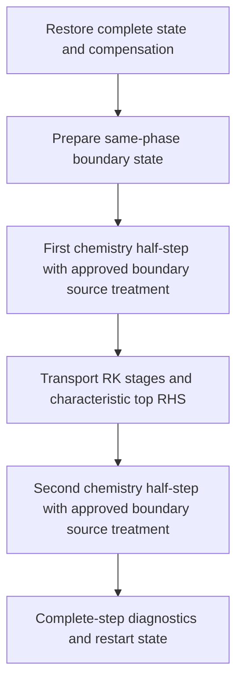

# AIR5 Two-Temperature Characteristic Top Boundary

Status: source-retaining closure approved; CPU cold-start dynamic top is wired
and stationary-uniform checked. GPU full-boundary, restart and physical gates
remain open. Shared local CPU/GPU algebra is separately probed.
Scope: Cartesian upper-y face, outward normal +y, existing AIR5 model and N-1
independent composition. Old all-state prescribed boundary remains the default.

The next approved experiment is specified in
`ASTR_AIR5_CHARACTERISTIC_ACOUSTIC_GATE.md`. It isolates acoustic reflection with
explicit frozen chemistry/V-T sources before returning to reacting boundaries.

## Verified Starting Point

The existing incident target has downstream normal velocity approximately
-645.78949 m/s and frozen sound speed 937.43006 m/s. Normal acoustic speeds are
-1583.21955 and +291.64057 m/s. One acoustic branch leaves the domain even
though the mean normal flow enters it. Replacing every top-plane conservative
component fixes both incoming and outgoing information.

`src/chemistry_boundary.F90:apply_air5_hbl_boundary` and its GPU counterpart
currently perform that full-state replacement. CPU chemistry advances only
`is:ie,js:je,ks:ke`. The physical top is excluded by `src/parallel.F90`.
GPU chemistry has the same interior bounds. Merely deleting the top assignment
would therefore leave a boundary node that is not advanced by chemistry or by
the ordinary interior transport update.

The GPU statistics preparation calls `air5_prepare_spatial_state_gpu` before
the first chemistry snapshot, while the CPU first snapshot precedes the first
boundary refresh. The frozen incident startup seed still has the old top state.
This explains the first snapshot mismatch. It does not justify changing CPU
initialization as part of a diagnostic-only patch. New-mode lifecycle must be
specified explicitly and tested from both a seed and a same-mode restart.

## Frozen Thermodynamics

For partial densities r_s, species gas constants R_s, constant translational
heat capacities c_vs and formation energies e_fs, define

\[
A=\sum_s r_s R_s,\quad B=\sum_s r_s c_{vs},\quad
F=\sum_s r_s e_{fs},\quad \beta=A/B.
\]

With stored total energy density E, momentum m, and vibrational energy density
E_v, the actual model gives

\[
H=E-\frac{m\cdot m}{2\rho}-E_v-F,\qquad
T=H/B,\qquad p=\beta H,\qquad a_f^2=(1+\beta)p/\rho.
\]

For an arbitrary consistent conservative increment dq, its pressure increment is

\[
dp=\beta\left[dE-u\cdot dm+\tfrac12|u|^2d\rho-dE_v\right]
 +\sum_s\left[(R_s-\beta c_{vs})T-\beta e_{fs}\right]dr_s.
\]

This follows by differentiating the implemented equation of state, not by
substituting an equilibrium gamma. Vibrational relaxation and composition
changes both affect pressure. The formula is a required CPU/GPU algebra probe
against finite differences and chemically/vibrationally perturbed states.

Eleven stored conservative slots are constrained by sum(r_s)=rho. The physical
independent dimension is ten: two acoustic, one entropy, two tangential
velocity, four independent composition, and one vibrational mode. Do not
invert an unconstrained eleven-dimensional primitive mapping or add a sixth
independent composition equation.

## Characteristic Compatibility

Let v be the outward normal velocity. The two local acoustic derivative
combinations are

\[
L_\pm=(v\pm a_f)(\partial_y p\pm\rho a_f\partial_y v).
\]

For the primitive pressure and normal-velocity equations written as normal
advection plus all remaining terms S_p and S_v,

\[
\partial_t p\pm\rho a_f\partial_t v=-L_\pm+S_p\pm\rho a_f S_v.
\]

S includes the transverse transport, viscous/diffusive contributions and,
when discussing the unsplit PDE, chemical and vibrational source contributions.
The pressure differential above maps the conservative contributions into S_p.
Outgoing L is retained from interior derivatives. Incoming L requires an
external-data closure. Setting an incoming L to zero is not generally the
same as setting its incoming time derivative to zero when S is nonzero.

For the present downstream target only L_minus is incoming acoustically.
Entropy, tangential velocity, composition and vibration convect with v and
are incoming there. At the upstream target v=0 these convective modes are
grazing, not strictly incoming. Their treatment cannot be inherited from the
downstream inflow branch or decided by an unexplained Mach cutoff.

## Decisions Before Implementation

1. Incoming target closure: user-approved candidate is characteristic relaxation
   with explicitly supplied physical relaxation time(s), with no hidden default
   inherited from the five-equation solver. Zero relaxation rate (not zero
   relaxation time) is a wave
   reflection control, not a guarantee that the prescribed shock target is
   maintained. An instantaneous incoming-state projection is a different
   boundary algorithm, not just a zero-parameter version of this derivative BC.
2. Boundary chemistry/source lifecycle: the old boundary is an external
   prescribed reservoir and is not chemically integrated. A new dynamic
   boundary must specify how it follows chemistry/V-T and incoming constraints.
   Extending the existing six-variable constant-density chemistry solve and
   then projecting states is not automatically a consistent constrained solve.
   If that projected-source closure is selected, source evolution can alter pressure/normal velocity and therefore
   invalidates assuming all boundary chemistry variables have the same six-by-six
   ODE structure as the interior. No such extension is implemented here.
3. External target remains the fixed piecewise incident state unless explicitly
   approved otherwise. A chemically evolving external reference would change
   the physical problem. It must not be introduced merely to make a uniform
   reacting boundary test pass.

On 2026-09-26 the user approved explicitly configured incoming-characteristic
relaxation as a test candidate: tau=Ly/a_infinity, with tau/2 and 2*tau
sensitivity controls. This is permission to develop and test the candidate,
not an optimality or production-acceptance claim. The old all-state prescribed
mode remains the default. Items 2 and 3 are not changed by this approval;
boundary chemistry/source coupling requires a separate derived and accepted
contract before modifying the boundary integration domain.

### Approved Candidate Scales

For the current frozen incident seed, `air5_hbl_domain.dat` gives
Ly=0.004505785713766645 m. The upstream state in
`incident_shock_metadata.json`, evaluated with the current AIR5 frozen EOS,
gives a_infinity=778.0891928821296 m/s. Do not substitute the downstream sound
speed or recompute this external reference from the evolving boundary state.

| Candidate | Relaxation time, s | Relaxation rate, 1/s |
| --- | ---: | ---: |
| 0.5 tau | 2.8954172317165265e-6 | 345373.36762590084 |
| tau | 5.790834463433053e-6 | 172686.68381295042 |
| 2 tau | 1.1581668926866106e-5 | 86343.34190647521 |

Provenance: `tests/gpu_validation/out/air5_mach4_incident_20260926/seed/`,
`chemMech/air5_kimjo12.json`, and the existing `primitive_metrics` EOS helper.
The reference uses a_f^2=(1+A/B)*p/rho with the upstream composition.
Candidate test inputs must record the explicit dimensional time in seconds;
these case-dependent numbers are not hard-coded solver defaults. A zero time
is invalid, whereas a zero relaxation rate is a distinct no-relaxation control.

The existing 50 ns window is only 0.00863433419*tau. It cannot establish
weak parameter sensitivity or long-time target maintenance. Dedicated wave
tests must separate incident and reflected signals after propagation, and
target-maintenance tests must span relevant relaxation times. Quantitative
reflection and admissibility gates remain to be frozen with the boundary
source/lifecycle design before those tests are run.

## Approved Source Coupling

On 2026-09-26, after reviewing the distinction below, the user approved candidate
A and its strictly-negative incoming-speed / exactly-grazing rule. Candidate B
is retained only to explain the alternative, not as another runtime mode.
The external target remains fixed. This approval does not waive the remaining
lifecycle design or numerical/physical gates.

Source inspection on 2026-09-26 confirms that `air5_chemistry_half_step` in
`src/chemistry_solver.F90` holds density, momentum and total energy fixed and
advances the five stored partial densities and vibrational energy. The species
mass constraint remains in force; this is not five independent mass fractions.
`apply_air5_hbl_boundary` in `src/chemistry_boundary.F90` overwrites the top and
zeros its compensation. Those operations cannot remain on a dynamically evolved
top. The following derivation defines the approved closure; solver wiring remains pending.

### Two Different Meanings Of Relaxation

On the ten-dimensional mass-consistent tangent space, write the boundary PDE as

\[
\dot q=-A_n(q)\partial_n q+R_\perp(q)+S_c(q).
\]

Here R_perp includes transverse convection and the full viscous/diffusive
residual, including normal diffusion. S_c includes chemistry and vibration
relaxation only. Let l_m and r_m be dual left/right modes, and let
P_in=sum(r_m l_m) over strictly negative outward-normal eigenvalues. These
projectors act on instantaneous increments, not on globally integrated
characteristic invariants. In particular l_m(q) dot(q) must not be replaced
by d[l_m(q)q]/dt.

For a fixed external target q_star, the candidate local relaxation amplitude is
K l_m(q)(q-q_star), K=1/tau. It has the same units as the normal characteristic
amplitude l_m A_n partial_n q. This is a local nonlinear relaxation construction,
not a claim of exact finite-amplitude Riemann-invariant matching.

**A: relax incoming normal-convection amplitudes, retain physical sources.**
Replace only incoming l_m A_n partial_n q by that relaxation amplitude:

\[
\dot q=-(I-P_{in})A_n\partial_n q
       -K P_{in}(q-q_\star)+R_\perp+S_c.
\]

Thus incoming modes obey

\[
l_m\dot q=-K l_m(q-q_\star)+l_m R_\perp+l_m S_c.
\]

Outgoing normal-convection amplitudes and all physical source terms remain.
Incoming state deviations need not decay with exactly tau when sources are
active. A reacting boundary is not held at the stationary reservoir state.
This is the approved development candidate, not a validated production BC.

**B: prescribe the total incoming time response.**
To impose l_m dot(q)=-K l_m(q-q_star), the incoming normal amplitude must instead
contain l_m(R_perp+S_c) as well. The resulting equation is

\[
\dot q=(I-P_{in})(-A_n\partial_n q+R_\perp+S_c)
       -K P_{in}(q-q_\star).
\]

This explicitly cancels incoming transverse, viscous and chemical responses.
It represents a different external constraint. For the current subsonic normal
inflow only the plus acoustic mode is outgoing. Even though unprojected
chemistry has zero density/momentum/total-energy source, its projected outgoing
source generally does not: with the acoustic right vector normalized to unit
density, its amplitude is (d p[S_c])/(2 a_f^2). Therefore the interior fixed-rho,
fixed-momentum, fixed-energy six-variable ROS-2 solve cannot directly integrate
this projected boundary ODE. Full chemistry followed by state projection is
not an established substitute for that ODE.

### Operator Accounting For Candidate A

Use S_c in the two existing chemistry half-steps and use the remaining terms
of candidate A in the transport stages. Do not insert S_c again into the
transport characteristic residual. Integrate physical top nodes during the
chemical half-steps with the same ROS-2 physics as interior nodes; retain the
old integration bounds for the old prescribed mode. This permits reuse of the
six-variable solver without changing its physical invariants.

This algebra establishes source accounting, not second-order boundary accuracy.
State-dependent projectors, stiff splitting, positivity, ghost closures and
intermediate-stage boundary preparation still require separate tests. Chemistry
contributions to pressure must use the EOS differential above, even though the
split chemical solve updates species and vibrational energy directly.

At an exactly grazing convective eigenvalue, candidate A leaves the mode outside
P_in, retaining transverse, viscous and chemical evolution. Negative speeds are
incoming and positive speeds outgoing. No empirical Mach cutoff or frozen
target-based classification is proposed. The discontinuous classification near
zero requires explicit positive/zero/negative-speed tests before acceptance.

Top compensation must survive both chemistry halves and RK stages. Ghost filling
must not replace the evolved physical top or clear its carry. The current code
applies inlet after top, so the inlet owns the top/inlet corner; retaining that
priority requires excluding that corner from dynamic top updates. Top/outlet
and periodic-z ownership, transport stencils, restart mode metadata and
admissibility handling remain implementation-contract items, not completed work.

### Discriminating Tests Before SBLI

- With zero gradients and K=0, candidate A must reproduce the same homogeneous
  chemistry/V-T trajectory as the interior, including pressure response. A
  fixed, chemically unequilibrated external target is not an exact uniform-flow
  solution when K is nonzero; do not mark that intended forcing as a bug.
- In frozen, source-free uniform flow with q=q_star, the boundary RHS must vanish.
- For a mass-consistent source increment, verify that the full characteristic
  decomposition reconstructs that increment and that the split transport
  operator contains no duplicate chemical pressure contribution.
- Compare candidate A and B algebraically for nonzero chemical pressure source;
  their incoming acoustic derivatives must differ by the projected source.
  They must not be labeled equivalent implementations.
- Follow with source-active time refinement, outward-wave reflection, oblique
  target maintenance and grazing tests. Numerical thresholds for these new
  physical gates must be fixed before running them; no SBLI admission follows
  from the present algebra alone.

The cited reacting-NSCBC papers support accounting for source and transverse
terms. They do not by themselves validate candidate A, the AIR5 two-temperature
extension, or this Strang-split implementation. The approval above covers
candidate A's source-retaining meaning of relaxation and its grazing rule.

## Required Implementation Contract

### Verified Wiring Map, 2026-09-26

The following map was checked against the working tree after the local RHS
probe passed. No production boundary dispatch has been enabled by this audit.

| Surface | Existing implementation | Required new-mode treatment |
| --- | --- | --- |
| CPU transport sign | `src/solver.F90:rhscal` negates convection before the AIR5 convection limiter and diffusion | Assemble characteristic RHS with physical time-derivative sign and convert to the stored Jacobian-weighted RHS once; do not negate it twice |
| CPU transport update | `src/mainloop.F90:time_integration_rk` updates all physical nodes, including top | Supply top RHS once; preserve origin and carry in existing compensated RK; do not add a second top update |
| GPU transport update | `src_gpu/chemistry_solver_gpu.cuf:air5_rk3_first_update_kernel` and `air5_rk3_update_kernel` exclude nodes beyond je | Add explicit dynamic-top ownership for save/update; initialize top qsave and origin/carry at stage 1 |
| Chemistry | CPU `air5_chemistry_half_step` and GPU counterpart use interior bounds | Include owned dynamic-top nodes in both half-steps without including prescribed corners; reuse full source solver |
| Top fill | CPU/GPU HBL boundary fills physical top and ghosts with target | In new mode fill ghosts from an explicitly defined extension of the evolved top; never reset the physical plane to target |
| Carry clearing | CPU/GPU HBL boundary unconditionally clears the top plane | Preserve dynamic-top carry, clearing only externally prescribed nodes |
| Primitive preparation | GPU chemistry half-step refreshes HBL boundary and face primitives | Recover top primitives from accepted q, not external target, before spatial derivatives and diagnostics |
| Checkpoint | `src/readwrite.F90` already writes/restores 11 carry fields including j=jm | Reuse stored fields; add/check boundary-mode and relaxation provenance, and prevent boundary preparation from destroying restored top/carry |
| Periodic interfaces | `src/parallel.F90` synchronizes compensation on shared/periodic faces | Include top edge data under existing ownership; exchange before transverse differentiation |

Do not globally change `commvar:je`. It controls more than time integration:
convective and diffusive limiting, face loops and low-order admissibility
budgets use it. `air5_limit_symmetric_convection` clears and rebuilds the
interior RHS. A top correction inserted before a broadened limiter loop could
be overwritten; inserting it afterwards does not confer that limiter's
positivity guarantee on the top. A dedicated owned-top path is needed.

### Admissibility And Spatial Closure Work Remaining

Spatial contract approved by the user on 2026-09-26:

1. At the Cartesian upper-y physical node use the existing explicit second-order
   endpoint formula D_y q=(3 q_j-4 q_(j-1)+q_(j-2))/(2 delta_y). Use the exact
   local flux differential A_y(q)D_y q for characteristic normal convection.
   Do not silently substitute D_y F(q), which has a different nonlinear
   truncation error. No compact solve or new sixth-order extrapolation is added.
2. Retain existing tangential convection and viscous flux discretizations and
   their near-boundary order reductions. Do not claim sixth-order accuracy at
   the physical endpoint. Interior formats and shock sensor remain unchanged.
3. Fill external top ghosts with the evolved physical top state. The proposed
   endpoint derivative uses only physical nodes, not that constant extension.
   Audit sensor, filter and transverse derivative consumers separately; constant
   ghosts do not establish a zero physical normal derivative. Filter-enabled
   acceptance remains required before claiming support for that combination.
4. Preserve existing face priority: inlet owns top/inlet, top owns top/outlet.
   New mode must skip the dynamic top node in the outflow replacement, rather
   than extrapolating it and then trying to restore it from a target. At the
   top/outlet corner use the x endpoint stencil for tangential terms and the
   top characteristic equation for time evolution. This is a specific corner
   closure to test, not a simultaneous independent prescription of both faces.
5. Use the fail-fast admissibility contract below. No new boundary limiter,
   clipping or automatic step-size adjustment is implicit in this proposal.

`air5_y_flux_differential` supplies the analytic A_y dq operation as a shared
host/device routine. `air5_top_normal_convection` evaluates the approved endpoint
in difference form and applies that differential. The extended probe directly
checks device differentials and quadratic endpoint samples in the same 90 mode
and velocity combinations (fixed scaled tolerance 2e-10). CPU constant-state
endpoint derivatives are exactly zero; zero spacing is rejected. CPU/GPU probe
builds and executions pass; GPU memcheck reports zero errors. These are local
algebra/stencil checks, not complete spatial-boundary or physical acceptance.

The local characteristic RHS does not define a complete spatial boundary. The
current AIR5 diffusive face reconstruction uses a second-order one-sided
physical-end derivative, fourth order at the second adjacent interior location,
and sixth order in the interior. This is visible in
`projected_air5_face_flux` and `differentiate_air5_flux`; a new top must not be
described as uniformly sixth order merely because the bulk stencil is sixth
order. The convection endpoint closure, viscous endpoint closure and ghost
extension must be specified together before enabling runtime selection.

Keep the existing interior conservative face limiter unchanged initially.
Compute the new top's complete stage candidate including transverse transport,
normal diffusion and characteristic normal convection. Check mass consistency,
species nonnegativity and the two-temperature model domain before accepting
that candidate. On failure, report the stage, global node and failed quantity
and stop. Do not clip species, silently scale the full boundary RHS or switch
back to the strong-state boundary. This is a fail-fast development contract,
not a proof that the new boundary has a positivity-preserving discretization.

The top/inlet corner remains prescribed by the inlet (the current final writer).
The approved top/outlet contract above retains top ownership and the x endpoint
stencil for tangential terms. Excluding it and extrapolating from interior is
not equivalent to that contract. This must be represented explicitly in
ownership and corner tests, rather than inferred from kernel launch order.

Restart checks must distinguish a deliberate old-mode seed conversion from a
same-mode continuation. A same-mode restart restores the complete dynamic top
and all carries without reinitialization. Seed conversion must be explicitly
recorded in test inputs; it cannot silently be treated as same-mode restart
equivalence. Boundary metadata checks must be collective across ranks so a
configuration mismatch cannot strand other ranks in halo communication.

- CPU/GPU use identical entry phases. Carry belongs to the accepted dynamic
  boundary state and must not be zeroed unconditionally as in the old prescribed
  mode. If a component is externally replaced, the corresponding carry policy
  must follow that operation and be tested.
- Use the physical top node as a genuine boundary evolution node. Keep ghost
  extension separate from its evolution, with a declared one-sided explicit
  normal derivative and transverse halo exchange before differentiation.
- Specify top/inlet and top/outlet corner priority. A one-dimensional face
  formula alone does not determine corner compatibility.
- Do not add chemistry sources to transport RHS while retaining the same source
  in both Strang chemistry halves. Map each source contribution to its actual
  integration operator before coding.
- Preserve composition closure, nonnegativity, two-temperature admissibility
  and compensation consistency. Do not clip negative species to hide an
  incompatible characteristic update.
- Freeze numerical acceptance thresholds before running uniform, acoustic,
  oblique inflow, source, MPI, restart and SBLI tests. Reflection and target
  maintenance are separate measurements; exact all-variable target equality
  is not an appropriate characteristic-boundary gate.

## Literature Basis

Multidimensional reacting NSCBC must account for transverse, viscous and
reaction terms in characteristic amplitudes; this is not only a normal-Mach
sign switch. See [Yoo and Im (2007)](https://www.tandfonline.com/doi/abs/10.1080/13647830600898995).
Source terms are essential to avoid unphysical pressure/velocity gradients in
reacting boundary treatments; see [Sutherland and Kennedy (2003)](https://www.sciencedirect.com/science/article/pii/S0021999103003280).
These references motivate the compatibility accounting, not a claim that their
single-temperature implementation directly supplies the present two-temperature
split boundary solver. The EOS differential and mode count above are derived
specifically from the current ASTR AIR5 model.

## Algebra Evidence

CPU spatial assembly entry `chemistry_flow_solver:air5_characteristic_top_rhs`
is now called after the interior convection limiter and diffusion assembly. It
assembles analytic normal convection, existing tangential convection (x endpoint
at the owned top/outlet corner), and all three diffusive flux divergences.
It accounts for the existing opposite species-diffusion flux sign and converts
between physical RHS and Jacobian-weighted storage exactly once. The caller
must have validated a uniform Cartesian grid and prepared the diffusion flux
workspace and halos. Invalid thermodynamics, spacing or nonfinite RHS cause a
collective failure. This entry neither updates q/carry nor provides a positivity
limiter. Existing CPU RK advances top q and carry; both chemistry half-steps
include dynamic-top nodes. HBL preparation preserves the top and its carry,
extends ghosts and leaves the top/outlet corner to the top. The inlet remains
the owner at the other corner. Root CMake CPU astr build passes.

Development controls: `ASTR_AIR5_TOP_MODE=prescribed|characteristic`, default
prescribed; characteristic requires explicit positive finite
`ASTR_AIR5_TOP_TAU` in seconds, consistent across ranks. Configuration currently
rejects GPU, restart, filter and non-RK3 combinations. The uniform Cartesian
geometry is checked. These are temporary fail-fast implementation limits, not
a reduction of the goal: GPU, restart and the remaining gates still must be
completed. Zero-rate control is available in the algebra API but not yet in
the runtime configuration.

Whole-solver stationary-uniform CPU check:
`tests/gpu_validation/run_air5_characteristic_uniform.py` prepares a 15x15x7
interval grid, rho=0.05 kg/m3, T=Tv=1500 K, zero velocity and Y=(.767,.233,0,0,0).
The wall has the same temperature. Source mode vt makes the source vanish at
this state; this is not a reacting-source test. Three 1 ns steps with compensation
enabled were run for characteristic and prescribed modes. Initial/final sampled
pre-chemistry and post-transport physical arrays are compared with the analytic
11-component conservative state, including the top and corners. Fixed scaled
tolerance is 2e-10; both maximum discrepancies are 7.073019170245721e-16.
Evidence is under `tests/gpu_validation/out/air5_characteristic_20260926/`,
`uniform_cpu_v2` and `uniform_prescribed_v2`. The report's NumPy boolean JSON
serialization bug was fixed and existing files rechecked without rerunning.
The first v1 log had an IEEE invalid flag. Subsequent invalid-trap runs captured
SIGFPE in both characteristic and prescribed modes at the existing
`air5_limit_full_state_convection` probe-only `min(probe_thermal_ratio,candidate_ratio)`.
Evidence: `uniform_cpu_trap_v1/run.log` and `uniform_prescribed_trap_v2/run.log`.
The latter disassembly executes `vminsd` before the conditional/masked result
selection; the candidate operand is 1.0. The other operand is the probe thermal
statistic, which source initializes only when `probe_point` is true. The same
conditional initialization and min expression exist in HEAD, not just these
boundary edits. This strongly supports uninitialized diagnostic storage exposed
by optimized evaluation, rather than a new top-BC instability. It remains an
intermittent defect: other trap runs complete without it. No claim is made that
all solution effects have been excluded.

The user approved the minimal CPU correction on 2026-09-26. Probe species
ratios, probe scales and thermal ratio are now initialized unconditionally at
each node before limiter arithmetic. Output remains conditional; limiter
formulas, tolerances, physical sources and boundary behavior are unchanged.
Root CMake CPU astr rebuild passes. Four invalid-trap runs, two per top mode,
complete normally with no invalid flag: `probe_init_fixed_char_trap1/2` and
`probe_init_fixed_prescribed_trap1/2` under the same evidence directory.
Each still meets the 2e-10 analytic gate with discrepancy 7.073019170245721e-16.

Matched pre/post-fix physical-domain comparisons cover 20 conservative stage
files per mode (40 total), with atol=rtol=0 and maximum difference exactly zero.
Reports: `probe_init_char_field_comparison.txt` and
`probe_init_prescribed_field_comparison.txt`. All 11 conservative and 11 carry
datasets in available checkpoints are bitwise equal, but those checkpoints
are step 0 only. No post-fix claim of measured final nonzero-carry equivalence
is made from that initial-only evidence. Source initialization plus the trapped
and field checks close this scoped diagnostic defect; wider boundary acceptance
remains separate. Acoustic and source-test preparation may now resume.

`run_air5_characteristic_uniform.py --trap-invalid` enables x86 SSE/x87 invalid
traps through GDB without changing the executable. It is a local diagnostic,
not a portable production mode. The harness was corrected to inspect registers
only while the inferior is alive; earlier v3's post-exit debugger error was not
a solver failure. Prescribed v4 completes with traps enabled and passes the
same 2e-10 analytic gate, confirming intermittency rather than eliminating it.
Acoustic/reflection, reactive-source, nonuniform stage admissibility, MPI,
restart, GPU full-solver memcheck and matched SBLI gates remain open.

Root CMake target `air5_characteristic_thermo_probe` calls the existing Fortran
primitive/conservative thermodynamics, not a separate flow integrator. It tests
three temperatures with inward, grazing and outward normal mean velocity.
All ten independent mass-consistent perturbation directions are checked against
a sixth-order central directional derivative of the actual EOS. Maximum
normalized pressure-derivative discrepancy: 3.3201570017246693e-13 (gate 2e-10).
Both acoustic and all eight convected eigenvectors satisfy the finite-difference
normal-flux Jacobian relation. Maximum normalized errors are 4.64636e-11 and
1.99794e-11 for relative perturbations 1e-3 and 2e-3, both below the unchanged
2e-10 gate. Acoustic directions freeze composition and specific vibrational
energy. The initial unpaired 1e-4 finite-difference probe failed in nominally
zero derivative components; paired differences and the two larger perturbation
checks reduce cancellation error without changing the acceptance tolerance.
Additional source-decomposition checks use synthetic mass-conserving composition
and vibrational-energy increments at all three states. The nonacoustic remainder
has zero pressure/normal-velocity increment and preserves the mass constraint;
maximum scaled residual is 1.3877787807814457e-15 (gate 1e-12). These are not
reaction-rate or integrated source tests.

`src/chemistry_characteristic.F90:air5_top_transport_rhs` implements candidate A
as a shared host/device local operator. Its caller must provide validated AIR5
pressure, frozen sound speed, EOS pressure gradient and mass-consistent states
and increments. It accepts a relaxation rate in 1/s, including the explicit
zero-rate control. The CPU path is wired through the explicit runtime top-mode
environment selection; zero-rate selection is not exposed by that parser. The physical chemistry
source is deliberately absent from this transport-only interface.

The extended probe checks all ten modes at the three base states and their
positive/negative supersonic Galilean shifts: 90 CPU and 90 GPU evaluations.
Both backends meet the fixed component-scaled RHS tolerance 2e-10. CPU checks
also verify unprojected remaining transport, exact uniform-state zero RHS and
negative-rate rejection. Root CMake CPU/GPU probe builds pass; GPU Compute
Sanitizer memcheck reports zero errors. Device launches explicitly synchronize.
These local tests do not validate boundary stencils, source integration, full
RK, MPI, restart, acoustic reflection or SBLI. Those gates remain open.

## GPU Lifecycle Staging

The device implementation now includes dynamic top ghost extension with strict
EOS validation, top/outlet corner preservation, and carry preservation except
at the inlet-owned corner. `get_air5_top_target_gpu` mirrors the incident or
similarity-farfield target without host field transfers. The two chemical halves
include the physical top through a disjoint launch of the existing ROS-2 kernel.

`air5_characteristic_top_rhs_kernel` assembles the approved one-sided normal
operator, transverse convection and three-direction viscous contribution. It
uses the shared characteristic algebra and records errors before any update.
A separate top-plane call to the existing RK kernels saves/restores top origin
and compensation exactly through their existing interfaces. Interior bounds
are unchanged. Every new launch retains explicit synchronization.

This is staged implementation, not numerical admission. The CPU configuration
guard still rejects characteristic mode with `usegpu=t`; it also rejects
restart/filter/non-RK3 combinations. Do not remove these guards as a consequence
of compilation alone. The ongoing acoustic baseline uses the unchanged CPU
executable. GPU preparation cannot replace the mandatory acoustic, oblique,
source, MPI, restart and full-boundary memory gates.

NVHPC CUDA compilation rejects strided state sections passed directly to the
shared host/device normal operator. Both callers now load the two interior
states into contiguous local vectors before the call. This changes argument
storage, not the approved derivative formula. The running CPU executable has
not been rebuilt or replaced.

Root-CMake CUDA-capable `astr` now builds successfully. RDC linking required
the shared characteristic device module to use the existing
`ASTR_AIR5_MAXREGCOUNT` cap, matching its transport-kernel caller. The capped
local algebra probe still passes (pressure derivative 3.32016e-13, flux
derivative 4.64636e-11, source decomposition 1.38778e-15); memcheck is zero.
This probe does not execute the newly assembled top-plane GPU kernel.

Three-step frozen-source uniform regressions in
`out/air5_characteristic_20260926/staged_gpu_prescribed_frozen` (GPU, old top)
and `staged_cuda_cpu_characteristic` (CPU path in the CUDA binary, new top)
both pass at 7.073019170245721e-16 normalized drift against 2e-10. Paths are
relative to `tests/gpu_validation/`. No dynamic-top GPU result is claimed.
