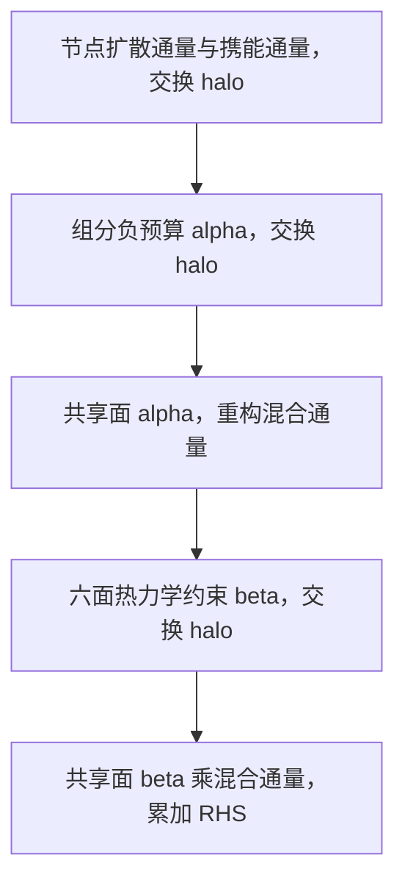
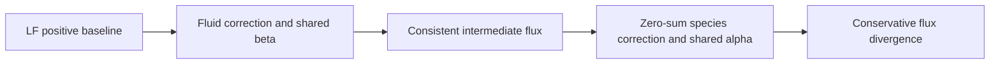

# Mach 4 平板前驱近壁分辨率与入口敏感性

日期：2026-09-24。范围：当前工作树的 N2/O2 初始组成、AIR5 双温耦合反应
平板前驱；无入射激波。这里只增加诊断和入口厚度对照，不修改求解器或壁面格式。

## 结论

已完成 128/256/512 点同相位空间对照及 512 点的 dt=2/1 ns 对照。
256/512 点的首点 y+ 已小于 1，但仍不能关闭壁面量收敛门槛：域中部的空间/
导数模板敏感性突出，入口附近还存在显著时间敏感性。入口厚度变化影响近入口
区域，但不是域中部壁面诊断差异的唯一解释。不从当前场提取已发展入口，
不施加入射激波，也不把这些离散敏感性归为机器噪声。

## 壁面单位与分辨率

本轮计算瞬时局部壁面单位：

$$
\tau_w=\mu_w(\partial u/\partial y)_w,\quad
u_\tau=\sqrt{|\tau_w|/\rho_w},\quad
\nu_w=\mu_w/\rho_w,\quad y_1^+=y_1u_\tau/\nu_w.
$$

平直无滑移壁面上切向的壁面法向速度导数为零，因而使用上述剪切表达式。
黏度由固定 AIR5 输运模型按当地壁面 T、Tv、p、Y 计算，不使用自由来流黏度。
剪切保留符号，仅摩擦长度使用绝对值。接近零剪切时不能靠小 y+ 宣布分辨率通过。
沿 z 逐点计算，再平均；去掉周期重复端点。范围覆盖 x 内点 1--62，不含入口/出口。
ASTR 为节点网格，壁面 j=0、第一内点 j=1，`y1=dy`，不能用 `dy/2`。

[Di Renzo & Urzay, JFM 912 A29 (2021)](https://web.stanford.edu/~jurzay/RU_2021.pdf)
在第 7 页采用壁面黏性尺度，第一近壁网格尺度小于 1，并在附录 B 做网格加密。
本文仅借鉴其近壁设计尺度；当前是层流前驱，y+ 小于 1 不是普适的必要充分判据。
也不能将本轮瞬时诊断等同于该文的时间/展向平均壁面单位。

| 法向点数与相位 | 第一内点距离 um | 三点诊断 y+ 范围 | 七点诊断 y+ 范围 |
|---|---:|---:|---:|
| 64，t=2 us | 71.5204 | 2.784--3.334 | 5.190--7.311 |
| 128，t=2 us | 35.4786 | 1.375--1.504 | 1.566--2.489 |
| 64，t=10 us | 71.5204 | 2.460--3.758 | 1.285--8.993 |

七点模板对非光滑近壁剖面的敏感性更大，不能选较小的三点结果作为通过依据。
先前同 t=2 us 的 64/128 对照中，三点 Cf 相差约 18.6%，热流相差约 9.5--10%。
因此即使加密后 y+ 达标，也必须继续比较 Cf、两温热流、T/Tv 和组分剖面。

固定当前 128 点、t=2 us 的壁面剪切估计，y+<=1 要求 dy 不超过约
23.6 um（三点）或 14.25 um（七点）。候选均匀网格估算如下，均未运行：

| 法向点数 | dy / um | 预计最大 y+，三点 / 七点 |
|---|---:|---:|
| 256 | 17.6697 | 0.749 / 1.240 |
| 384 | 11.7645 | 0.499 / 0.825 |
| 512 | 8.8176 | 0.374 / 0.619 |

这些值仅按 dy 线性缩放，实际剪切会随网格与时间改变。优先以均匀 256/512 点
构成可比较的加密序列，避免本轮同时引入拉伸度量。以后可考虑首点 10--14 um
的近壁加密网格，但需单独验证度量与输运。当前 8 个展向点是层流挤出诊断，
不是三维湍流 DNS 的展向分辨率验证。

## 入口条件审查

当前解析四次速度剖面与线性温度关系只用于启动，不是双温反应边界层相似解。
同一剖面沿 x 铺满初场，v=w=0。该初场并不必然违反连续方程，但不满足已发展
边界层的动量、黏性加热与反应输运平衡，整个域均会经历启动调整。
同一参考文献附录 A 从边界层方程获得耦合入口剖面，提示后续应检查入口动力学
相容性；其振动平衡模型不同，不能直接替代当前双温剖面。

128 点基准入口第一内点的冻结法向 Mach 为 0.2091；前四个内点均亚声速，
声速点约 y=0.1621 mm。离散插值得到入口 delta99 约 0.8057 mm，
其中有 22 个非壁面节点。这些数量不能单独代表热/化学层已解析。

`src/chemistry_boundary.F90::apply_air5_hbl_boundary` 先施加壁面，再施加顶面，
最后全量指定入口 q，入口优先覆盖角点。u/T/Tv 的壁面目标相容，入口角点 p/Y
保持指定剖面，而其他壁面点由内部状态构造。局部亚声速入口的全量指定存在
出射声波反射风险；这不是本轮已定位的 CPU bug，不据此自行改为特征入口。
当前顶面基础 v=0，已有 similarity farfield 的 x 缩放不会生成非零位移速度。

## 同 checkpoint 入口厚度对照

三个算例均使用 128 点基准 step1000、t=2 us 的同一内部 checkpoint，
只将入口剖面厚度改为 0.9/1.0/1.1 倍。壁面与自由流状态、机理、网格、dt、
源项、格式不变，z 挤出，NP=2 x-slab。剖面数据的 y 坐标缩放，域顶点坐标不动。
归档元数据保留原始种子尺度，实际扰动取 `contract.json::inlet_thickness_scale`。

每组 501 次更新，dt=2 ns；比较完整 RK checkpoint1500，即 t=3.000 us，
不是最后更新的 3.002 us。这是 1 us 的入口阶跃响应，不是三个已发展入口的稳态对照。

| 项目 | 基准 | 厚度 0.9 倍 | 厚度 1.1 倍 |
|---|---:|---:|---:|
| 最大 CFL | 0.0991463 | 0.0994657 | 0.0991464 |
| 最后 checkpoint 最大 p / kPa | 21.0467 | 22.4491 | 21.0226 |
| x 节点 2，三点 Cf | 0.00231592 | 0.00243201 | 0.00222886 |
| 同站向流体热流 / kW m^-2 | 106.845 | 129.698 | 82.792 |
| 同站 Cf 相对基准变化 | 0 | +5.01% | -3.76% |
| 同站热流相对基准变化 | 0 | +21.39% | -22.51% |

每组末步 18 组阶段快照均通过有限值、正性、固定物性域和质量闭合检查。
入口附近壁压和热流对厚度敏感，尤其热流穿零附近应报告绝对差，不以大相对数值
冒充误差发散。x 节点 4 的三点热流为基准 +17.74、薄入口 -53.34、厚入口
+107.05 kW/m2；这些是尚未收敛的壁面诊断，不是确认物理传热反转。

在 x 节点 32，扰动相对基准的截面最大 |delta p|/pinf <4e-10、
|delta u|/Uinf <1.1e-9。但三种入口的壁面导数模板差异仍一致存在：
该站基准三点/七点热流分别约 -4.195/+65.221 kW/m2。
因此在这个短时间窗内，入口厚度扰动不能解释域中部的全部壁面诊断差异。
不能外推为长时间入口不敏感，更不能据此排除边界反射或启动耦合。

## 后续顺序与证据


先在同一个物理时间 t=2 us 比较 128/256/512 点，并对代表网格做 dt/2 对照。
加密会增加黏性时间步约束，dt 由运行前估算与短步监测确定，不能只沿用对流 CFL。
保留两种导数诊断与带符号热流，不通过换模板、加滤波或放宽物性域制造通过。
若加密/减步长后仍不收敛，再定位边界闭合与内点输运，明确 CPU 缺陷先交人工决定。

- 壁面单位：`tests/gpu_validation/out/air5_mach4_yplus_inlet_audit_20260924/wall_units.json`。
- 入口对照：`tests/gpu_validation/out/air5_mach4_inlet_sensitivity_20260924/`。
- 同相位结果：上述目录的 `comparison.json`，每组附 `contract.json`、checkpoint、日志和阶段场。
- 壁面实现：`check_air5_precursor_evolution.py::wall_response`，三点与七点导数。
- 对照执行：`run_air5_inlet_sensitivity.py`；检查：`check_air5_inlet_sensitivity.py`。
- 诊断与准备脚本相关 20 项 pytest 通过。三个 ASTR 双卡任务均退出 0，已结束。

本轮未修改物理模型、CPU/GPU 数值格式或已有生产任务，未执行 Git 操作。

## 后续加密对照执行记录

用户确认后，于同日启动 `run_air5_mach4_resolution.py`，沿用归档 ASTR 可执行文件。
固定 x/z 为 64/8 个节点，全部从同一解析初态重新推进，不从粗网格插值重启。
比较相位均为完整 RK 的 t=2 us。矩阵为 y256、y512 的 dt=2 ns，以及 y512
的 dt=1 ns。每组的最后更新晚于比较 checkpoint 一个 dt，阶段快照只用于状态检查。

已有 y128 场抽样得到最大的运动黏性/热扩散/组分扩散尺度约
`0.00494/0.00705/0.00803 m2/s`（第一项含 4/3 因子）。据此，y512、dt=2 ns
的最大 `dt*D/dy^2` 约 0.207。这只是预估，不是耦合高阶离散的稳定性上界。
y512 的 21 次更新短步检查已通过，最大 CFL 0.2863917，末步 18 组状态通过。

执行状态以 `out/air5_mach4_resolution_20260924/matrix.json` 为准：

| 算例 | 状态 | 已得结论 |
|---|---|---|
| y128, dt=2 ns | 复用已有 t=2 us 证据 | 不重跑未变化的基线 |
| y256, dt=2 ns | 完成 1001 次更新，阶段状态通过 | 首点 y+ 为 0.684--0.722（三点）、0.758--0.904（七点） |
| y512, dt=2 ns | 完成 1001 次更新，阶段状态通过 | 最大 CFL 0.2864240，耗时约 479.65 s |
| y512, dt=1 ns | 完成 2001 次更新，阶段状态通过 | 最大 CFL 0.1432136，耗时约 940.02 s |

y128 相对 y256 的三点 Cf 差约 6.6%，热流差约 9.6--9.8%；七点差异仍大。
y+ 达到设计尺度没有关闭壁面量收敛门槛。相同归档场的比较程序自检得到严格零差。
没有修改壁面格式、启用滤波或放宽物性边界。

### 同相位空间差异

各次比较均以右侧更细网格为分母，下表取域中部 x 节点 32。
百分比是两个离散结果之差，不是真解误差。三点/七点是独立后处理导数，
不表示本轮切换了 ASTR 的求解器格式。

| 比较 | 导数模板 | Cf 差 | 平动热流差 | 振动热流差 | 总热流差 |
|---|---|---:|---:|---:|---:|
| y128 → y256 | 三点 | 6.629% | 237.11% | 6.317% | 9.578% |
| y256 → y512 | 三点 | 1.487% | 19.731% | 1.440% | 0.278% |
| y128 → y256 | 七点 | 90.56% | 651.47% | 91.01% | 148.84% |
| y256 → y512 | 七点 | 37.46% | 324.59% | 37.79% | 48.11% |

三点诊断的 y256 → y512 平动热流为 `4.457 → 5.553 kW/m2`，振动热流为
`63.804 → 62.898 kW/m2`。二者变化部分抵消，总热流接近不能证明双温传热收敛。
同一 y512、dt=2 ns 状态的七点 Cf/总热流比三点高约 12.46%/7.31%。
在入口附近，三点总热流的网格差仍可达 10.64%（x 节点 4）。

y512 在 t=2 us 的首点 y+ 为 `0.3400--0.3569`（三点）、
`0.3592--0.3842`（七点），全域内点均达到本轮选定的近壁尺度。
但同站位剖面仍有差异：x 节点 32 的最大 u/T/Tv 差约
`39.15 m/s / 18.95 K / 18.06 K`。相同插值比较在 t=0 仅为
`0.0418 m/s / 0.0201 K / 0.0201 K`，不能用线性插值误差解释主要差异。
该站位移厚度差仅 0.00954%，壁压差 0.2073%，整体量会掩盖局部剖面差异。

### 同相位时间差异

以下固定 y512，比较 dt=2 ns 与 1 ns，分母为 1 ns 结果：

| 站位 | 导数模板 | Cf 差 | 平动热流差 | 振动热流差 | 总热流差 |
|---|---|---:|---:|---:|---:|
| 域中部 x 节点 32 | 三点 | 0.0182% | 0.7354% | 0.0175% | 0.0440% |
| 域中部 x 节点 32 | 七点 | 0.2647% | 4.004% | 0.2732% | 0.4028% |
| 近入口 x 节点 1 | 三点 | 0.1305% | 2.149% | 0.1638% | 1.382% |
| 近入口 x 节点 1 | 七点 | 8.291% | 25.108% | 8.369% | 19.824% |
| 近入口 x 节点 2 | 七点 | 7.617% | 35.611% | 7.529% | 22.056% |

x 节点 2 的七点总热流为 `133.313 → 171.038 kW/m2`，不是分母近零造成的
大百分比。全域最大 u/T/Tv/p 差约 `15.54 m/s / 5.68 K / 7.25 K / 22.85 Pa`，
这些最大值均出现在入口第一内列。域中部 u/T 最大差约 `2.28 m/s / 1.40 K`。
所以只能说域中部时间差小于空间/模板差，不能外推为全域时间步无关性通过。

三组正式计算各有 18 组末步阶段状态检查通过，最大质量闭合残差小于
`1.66e-13`，温度约 1499.79--3000 K，无负部分密度或固定物性域越界。
用户服务 `astr-mach4-resolution-20260924` 已退出 0，全部任务结束。
这些是有界运行证据，不是 CPU/GPU 等价性的新门槛，更不是物理验收。

### 后续定位与复查入口

本轮没有发现足以认定明确 CPU bug 的证据，也没有修复数值格式。
后续优先只读检查入口首几列与近壁输运闭合的耦合，区分启动调整、奇偶网格
扰动与边界反射。若需要格式修复，先给出可重现证据并交人工决定。
根据定位结果再决定补 dt=0.5 ns 或更细网格，不自动追加长时运行。

正式证据位于 `tests/gpu_validation/out/air5_mach4_resolution_20260924/`：

- `matrix.json`：实际执行结果、末阶段检查、最初三个下游站位比较。
- `extended_comparison.json`：包含入口附近站位、全域时间差及首点 y+ 范围。
- 各算例的完整 checkpoint、`contract.json`、日志及 `field_review.json`。
- 512 点短步预检查另存于 `out/air5_mach4_y512_dt2ns_pilot_20260924/`。

执行脚本为 `tests/gpu_validation/run_air5_mach4_resolution.py`。
同一命令追加 `--review-only` 仅重做离线诊断，不启动 ASTR，也不覆盖原执行矩阵。
同归档自比较严格为零，错误物理时间比较被拒绝。20 项已有相关测试通过。

## 2026-09-24 同检查点算子定位

### 结论与范围

入口附近的时间步敏感性已经定位到全状态对流保正限制环节，不能归为机器
舍入或当前 GPU/CPU 实现差异。近壁壁面导数的空间敏感性尚未闭合，不能把
这两个问题合并为同一个原因。本轮不修改保正算法、边界闭合或物性模型。

从 y512、dt=2 ns 的同一个 t=2 us checkpoint 分别执行 CPU 一步、GPU 一步
和 GPU 两个 1 ns 步，末时刻均为 2.002 us。源文件仅增加验证开关控制的
`conv_raw` 和 GPU `diffusion_ratio` 快照。旧归档可执行文件与新可执行文件的
18 份 GPU 状态快照逐位相同。CPU/GPU 18 份同阶段状态均满足
`abs(delta q) <= 1e-9 + 1e-10*abs(q_cpu)`，最大绝对差 `1.7463e-10`，
最大 `abs(delta q)/max(abs(q_cpu),1)` 为 `1.1981e-14`。
这只排除了本检查点单步尺度的明显移植偏差，不代表长期误差已关闭。

三组重放共检查 72 份状态快照，部分密度非负，T 为约 1499.82--3000 K，
p 为约 19.992--20.874 kPa，最大组分质量闭合残差 `1.18e-15`。
ASTR 始终执行完整推进；Python 仅负责快照比较和未接受状态的代数诊断。

### 对流保正限制是时间敏感性的主要来源

两种时间步的首个半步化学时长不同，所以进入第一 RK 阶段的全部变量并非
严格相同。流向动量输入逐点相同，能量和组分有小幅差异。以下直接比较
同一 RK 阶段不同算子后的 RHS，不将它表述为完全冻结化学的对照。

| rank 0 第一阶段，dt=2 ns 对 dt=1 ns | 流向动量 RHS 最大差 | 总能量 RHS 最大差 |
|---|---:|---:|
| 高阶原始对流 `conv_raw` | 1.6614e-12 | 1.3086e-9 |
| 全状态保正之后 `conv` | 1.9405e-5 | 2.9401e-2 |
| 加入扩散之后 `full` | 1.9405e-5 | 2.9401e-2 |

表内是 ASTR 含几何 Jacobian 权重的守恒 RHS，未除 Jacobian，不能当作
SI 加速度或温度变化率。最终同相位流向速度最大差为 `0.77013 m/s`，
下游 rank 为 `0.04053 m/s`。这不是此前从初始时刻各跑到 2 us 的
`15.54 m/s` 全程累积差，两个实验不能混用。

第一阶段最小节点限制系数由 `0.12999` 变为 `0.22643`，下游 rank 由
`0.68021` 变为 `1.0`。日志显示激活的是 N、NO 组分约束，其他全状态
约束未报告激活。节点系数经过相邻节点取最小值，形成共享界面系数：

`F = F_low + theta_face * (F_high - F_low)`。

同一 `theta_face` 用于全部 11 个守恒分量，所以痕量组分的非负要求也会
改变主体流场的动量、能量通量。实现位于
`src/chemistry_solver.F90::air5_limit_full_state_convection` 和
`src_gpu/chemistry_solver_gpu.cuf::air5_limit_full_state_convection_kernel`。


当前逐面充分条件具有保守性：对原始高阶 RHS 做仅供诊断的第一阶段试算
`q_trial = q_pre + dt * RHS_raw / J`，下游 rank 的 5600 个受限局部节点
均没有负组分。上游 rank 的 5551 个受限节点中，5530 个试算也非负。
计数排除物理边界和重复 z 端点，按 rank 单独计数，不作为全域去重节点数。
该检查只判断组分非负，不证明可独立放开某一界面系数，亦不替代完整状态约束。

入口处确实存在不安全的原始试算：局部 `(i,j,k)=(1,80,1)` 的 N 部分密度
从 `6.3909e-25` 变为 `-1.4640e-25 kg/m3`，约为原值的 `-22.9%`。
这是未接受的代数诊断状态，不是 ASTR 实际接受了负值。其绝对量虽小，
相对本组分不是舍入量级，不能据此删除限制器或把它直接截零。

### 近壁空间敏感性仍需独立检查

第一阶段上游 x 节点 1 的受限区在 y 节点 32--98，前六层系数均为 1。
抽查入口与下游站位，前六层限制前后流向动量 RHS 差约 `1e-20`，仅为
计算顺序舍入量级。该重放的 dt=2 ns 第一阶段扩散限制器也未激活。
因此不能把壁面模板差异直接归因于局部保正限制。

已有 t=2 us、x 节点 32 的 y512 速度前六个节点增量依次约为
`51.39, 51.02, 51.93, 50.60, 52.15, 50.16 m/s`，呈交替大小特征。
`gradcal` 加通量散度的黏性路径在内点相当于组合一阶中心导数。对恒系数
无限/周期均匀网格的严格交替模式 `(-1)^j`，该一阶导数为零，因此复合
算子也不衰减该模式。真实壁面、变物性和其他算子不满足这一简化前提，
所以这里只记录可能保留短波扰动的机制，不宣称已证明完整离散失稳。

下一步先核查近壁闭合的离散响应与解析光滑剖面的一致性，并评估能否减少
全状态限制器中逐面充分条件的过度限制，同时保留共享界面守恒与完整状态
非负性。任何 CPU 数值方法或边界闭合修正都先提交人工决策。
暂不追加长时算例、取消保正或施加入射激波。

### 复查入口

- 输出：`tests/gpu_validation/out/air5_mach4_error_replay_20260924/`。
- 核心诊断：`operator_diagnosis.json`，包括逐阶段/逐分量 RHS、限制分布、
  状态门槛及同物理时刻的场差。
- 等价性：`cpu_gpu.txt`、`instrumentation_unchanged.txt`。
- 重放：`run_air5_sbli_domain_replay.py` 新增 `--backend cpu` 与
  `--snapshot-step-secondary`，默认仍为原有 GPU 路径。
- 离线复查：`python3 tests/gpu_validation/check_air5_mach4_error_replay.py
  --root tests/gpu_validation/out/air5_mach4_error_replay_20260924`。
- 根 CMake 构建通过，诊断、限制器及壁面后处理相关 15 项测试通过。

## 保正限制器第一阶段候选：species_budget

用户确认后，先实现一个可归因的小改动，而不是同时改变分量与方向的限制。
`ASTR_AIR5_CONVECTION_LIMITER=full_state` 保持原算法和默认行为；
`species_budget` 是显式选择的 CPU/GPU 同步候选。各 MPI rank 必须选择一致，
非法或不一致配置直接终止。配置独立于是否启用化学源项，冻结输运也可使用。

### 改动与数学依据

对于某一 SSPRK 阶段，记低阶节点状态为 $U_L$，六面高低阶通量差对节点的
增量为 $C_f$，其中已包含该阶段时间步系数。令第 s 个部分密度的负预算为
$P_s^-=\sum_f\min(0,C_{f,s})$，节点系数满足
$r_i\le\min_s\{1,U_{L,s}/(-P_s^-)\}$，仅对 $P_s^-<0$ 取商。
共享界面系数满足 $0\le\theta_f\le r_i$，因此

$$
U_s^{new}=U_{L,s}+\sum_f\theta_f C_{f,s}
\ge U_{L,s}+r_i P_s^-\ge0.
$$

代码原先已计算此预算，同时还要求每个人工六倍面状态
$U_L+6\theta_f C_f$ 的各部分密度非负。候选仅取消后一项重复的组分约束，
不取消预算、不改变界面系数共享方式、不截断已更新组分。
人工面状态可能有负组分，但不提交给物性或化学求解器，也不是接受的流场。

密度、振动能下界及平动内能下界仍逐面检查。振动能余量是守恒变量的仿射
函数；当前固定 cv 模型的平动余量是仿射项减去 $|m|^2/(2\rho)$，在
$\rho>0$ 上为凹函数。这些约束通过原有六面凸组合保证最终状态可容许，
最终组分非负由上述独立预算保证。该论证限定于当前模型，不外推到任意 EOS。

同一系数仍作用于全部 11 个分量，所以质量通量闭合与共享界面守恒结构不变。
扩散和滤波限制器完全不变。跨方向参数化限制及组分/流体分层解耦留待后续，
不能将本候选称为这些方案的完整实现。

这种按约束性质分别处理的方法受到参数化保界通量的启发，但不是对
[Du & Yang 多组分有限差分方法](https://doi.org/10.1007/s42967-020-00117-y)
的完整复现。统一系数本身并非 bug，参见
[Lohmann & Kuzmin 的同步通量限制](https://doi.org/10.1016/j.jcp.2016.09.025)。

### 验证范围

代数测试覆盖零组分、1e-25 痕量、六面不利预算以及相邻节点进一步缩小各面
系数后的可容许性。实际推进仅使用 ASTR。运行
`run_air5_convection_limiter_probe.py`，依次进行旧路径回归、候选 GPU/CPU
单步和两个半步同相位对照，每次重放后先检查状态，再继续下一项。
任何负部分密度、物性越界或 CPU/GPU 不一致均停止，不转入长时物理验证。

### 2026-09-24 有界重放结果

使用 y512、NP=2 x-slab 的同一个 t=2 us checkpoint，比较 dt=2 ns 的一次
更新与 dt=1 ns 的两次更新。终点同为 t=2.002 us。所有重放使用 FP64、显式
同步和关闭滤波，CPU/GPU 使用同一候选。结果属于短时算子诊断，不是收敛验证。

| 指标 | 原 full_state | species_budget 候选 |
| --- | ---: | ---: |
| 入口 rank 的终点最大速度差 (m/s) | 0.77012597 | 0.67414882 |
| 下游 rank 的终点最大速度差 (m/s) | 0.04052728 | 3.91279e-7 |
| dt=2 ns 首阶段日志受限节点数 | 12744 | 40 |
| dt=2 ns 首阶段最小对流系数 | 0.12999 | 0.76208 |

日志节点数保留原统计口径，可能包括 rank 共享节点和周期重复端点，不作为
全域去重计数。下游改善明显，但入口最大差只降低约 12.5%，仍非机器误差。
新候选首阶段入口 rank 的动量 RHS 时间步差，从原始对流的 `1.66e-12` 变为
对流限制后的 `3.50e-6`，加入扩散后为 `1.24e-5`。这些 RHS 尚含网格度量，
不能直接解释为 SI 加速度。

扩散算法虽未修改，其激活状态已随对流预测状态改变：dt=2 ns 的首阶段，
入口 rank 有 49 个内点的扩散系数小于 1，最小为 `0.168904`；第三阶段
35 个、最小 `0.0998593`。计数由诊断器排除物理边界和重复 z 端点。
下游 rank 三阶段扩散系数均为 1。原 full_state 对照首阶段扩散未激活。
因此下一步必须检查对流预测状态与扩散可容许预算的耦合，不能仅按对流
受限点减少的比例宣称入口问题已解决，也不能取消扩散保护。

验证证据：

- 根 CMake 构建通过。默认 full_state 与改动前存档的 18 份阶段状态逐位一致。
- 候选 CPU/GPU 的 18 份状态通过，最大缩放差 `1.19809e-14`。
- 四组重放共 90 份快照状态检查通过，无负部分密度、非有限值或物性越界，
  最大质量闭合残差 `1.17013e-15`。
- 限制器和重放分析的针对性测试 14 项通过。扩展静态契约检查为 43 通过、
  4 失败，失败为本次修改前已不符合当前源码的 flowtype/初始化/restart/
  checkpoint 文本断言；未修订这些无关断言，不能宣称完整测试集通过。
- NP=2 冻结组分平移、扩散层及振动能脉冲均通过 CPU/GPU、守恒与独立 RHS
  检查，最大场缩放差 `3.09368e-14`。该检查也覆盖无化学源项时配置的初始化。
- NP=2 正常激波、压力出口的 dt=1e-11 s 单次更新通过，18 份场最大缩放差
  `1.10093e-15`，物理点与出口检查通过。这只是激波启动路径检查。
- 此前 dt=1e-8 s、三次更新的补充正常激波任务未完成 CPU 阶段，未生成
  对照报告，不计为通过；更小时间步的检查不替代它，也不证明长时激波收敛。

候选状态为 `bounded-candidate-pass-not-promoted`。保留默认 full_state，
不自动追加长时运行或入射激波，也不修改壁面闭合。未新增性能或内存安全结论。

输出及复查：

- `tests/gpu_validation/out/air5_mach4_species_budget_20260924/`：
  `probe_summary.json`、`operator_diagnosis.json`、各组存档可执行程序与输入。
- `tests/gpu_validation/out/air5_species_budget_frozen_20260924/`：三个冻结
  算例的 CPU/GPU 和独立契约报告。
- `tests/gpu_validation/out/air5_species_budget_shock_smoke_20260924/`：
  激波单次更新的场对照及两份正常激波检查报告。
- `tests/gpu_validation/out/air5_species_budget_shock_20260924/`：未完成的
  较大时间步尝试，保留其 CPU 日志，不与通过记录混用。

## 入口扩散预算定位及新的有限精度失败

2026-09-24 在提交 `91adfea` 后继续只读数值诊断，未修改通量、边界、时间
积分公式或保正阈值。新增 CPU 单点中间量记录及物理量转换前快照。
本节的新失败收紧前节候选结论：`species_budget` 不可提升为生产默认，
原有单步等价性通过不代表两个半步的 CPU/GPU 正性门槛通过。

### 入口速度差的共享界面传递

NP=2、y512、同一 t=2 us 检查点，候选 dt=2 ns 首阶段的最大终点速度差
邻域为 rank0、局部 `(i,j)=(1,35)`。此点的对流及扩散节点系数均为 1，
但相邻 `(1,36)` 的扩散系数为 `0.168904026992334`，共享 y 界面取二者
最小值，故该点仍受邻点限制影响。单点记录在 k=0，节点系数与已存 GPU
快照一致到浮点舍入量级。

在 `(1,36,0)`，NO 部分密度的实际预算如下，单位均为 kg/m3：

| 首阶段 NO 预算 | dt=2 ns | dt=1 ns 的第一个半步 |
| --- | ---: | ---: |
| 化学半步后、输运前 | 7.29237e-17 | 7.08232e-17 |
| 对流增量 | -6.62849e-17 | -3.31244e-17 |
| 对流预测后剩余量 | 6.63878e-18 | 3.76988e-17 |
| 扩散六面负预算 | -1.09680e-17 | -5.49144e-18 |
| 未限制扩散试算后的 NO | -3.59348e-18 | 3.25751e-17 |

dt=2 ns 的未接受试算确实为负，约为剩余 NO 的 -54.1%，不是相对此组分的
机器噪声，不能直接取消限制。六面负预算允许系数约 `0.605286`，但原有
人工六倍面状态的 NO 约束进一步压至 `0.168904`；所有面密度及热力学
约束单独检查均允许系数 1。这里同时存在真实预算不足和额外充分条件的
过度限制，不是二者择一。

该系数还缩放黏性动量通量。共享界面在首阶段对相邻 j=35 点带来的动量
增量差为 `-0.0548778 kg/(m2 s)`。该点更新后密度为 `0.0332294 kg/m3`，
对应速度更新差 `-1.65148 m/s`。这是从实际面通量得到的局部代数归因，
不是完整 RK 终点误差；完整终点的一步/两个半步最大差仍为 `0.674149 m/s`。
dt=1 ns 第二个半步的 j=36 点也开始受限，首阶段系数 `0.184120`。
因此不能把第一个半步未激活解释为整个短时间窗口均不需要限制。

入口物理点 NO=0、下游逐渐生成的剖面与上述局部耗尽相联系，但现有证据
没有证明指定零产物入口本身错误，也没有证明壁面闭合或 MPI 通信是该误差
的根源。不修改入口组成、壁面格式或源项。

### 新失败：预算计算和实际 RK 更新的浮点路径不一致

候选 CPU 的 dt=1 ns 两次更新在 step1001/RK3、rank0 局部 `(1,84,2)`
以 `chemistry_status_invalid_composition=3` 终止。此前只做过候选 CPU
dt=2 ns 单步等价性，而两个半步只在 GPU 运行，故未覆盖这个失败。
用原存档可执行程序重新执行 CPU 两半步，同一步、同一位置复现。

从新增 `pre_updatefvar` 快照读到实际失败状态：N 部分密度
`-1.981600486218471e-43 kg/m3`，全域快照只有一个负部分密度。
该点质量闭合残差为 `-1.38778e-17 kg/m3`，在既有闭合容差内，失败来自
N 的负号，不是总质量闭合。对应旧 GPU 已接受值为
`3.0053645394106826e-42 kg/m3`。

CPU 扩散限制器的同点数据为：

- 对流预测后 N 为 `3.0053645394106826e-42 kg/m3`。
- 六面负预算给出系数 `2.53222e-15`，额外面条件给出实际共享系数
  `5.551115123125782e-16`。
- 用已记录的预测状态和六面受限增量求和，N 仍为
  `2.4303491251818952e-42 kg/m3`。
- 实际程序先累加对流、扩散 RHS，再由主循环重组 RK 状态，最终却得到上述
  负值。两个相抵消的 RK 量在映射空间约为 `1.39742e-38`，而剩余量接近
  运算舍入尺度；独立 NumPy 重排还会得到另一正值，不能用重算代替实际数组。

因此，精确算术中的负预算证明没有覆盖实际浮点 RHS 累加及 RK 更新的
消去误差。`air5_interior_ratio` 当前仅对系数调用一次向内 `nearest`，
这不构成整个更新表达式的非负性保证。该结论是当前候选路径的可复现
有限精度缺口，不外推为所有默认算例都失败。

这与 j=36 的 NO 预算不足必须分开：前者约 `1e-43` 是保正极限处的舍入
失败，后者未限制增量相对 NO 存量已经过大，并通过共享系数影响动量。
不能用“均为机器误差”解释入口的 m/s 级速度差。

### 执行状态与下一步决策

本轮所有重放已结束，新的失败出现后未运行更长算例或更多时间步精化。
根 CMake 构建通过，17 项诊断/限制器测试通过，但数值验收明确失败。
CPU dt=2 ns 单步加诊断前后 18 份状态逐位一致。CPU dt=1 ns 的旧存档与
两种诊断版本，失败前 32 份已输出状态逐位一致，排除诊断改变推进结果。
缺失的末阶段文件未跳过或补造，不把部分状态通过计作完整重放通过。

建议先提交人工决策处理有限精度保正：让预算覆盖实际 RK 表达式的舍入
误差，或使实际更新与受证明的状态构造一致，并保留共享面守恒。不以截零、
经验组分地板或放宽检查替代修复。通过失败检查点后，再评估扩散分层限制：
组分扩散通量及其携带的能量同步限制，黏性应力和热传导只按各自完整状态
约束处理。该轮诊断结束时两项修复均未执行；随后获批的舍入修复见下节，
分层扩散限制仍未实施。

证据位于 `tests/gpu_validation/out/air5_mach4_diffusion_probe_20260924/`：
`cpu_dt2` 为完成的单步，`cpu_dt1` 为原入口点两半步诊断，
`cpu_dt1_archive` 为旧可执行程序复现，`cpu_dt1_failure` 为实际失败点诊断。
各目录保留 `contract.json`、`result.json`、日志及阶段快照。`probe.json`
由 `check_air5_diffusion_probe.py` 校验六面增量、负预算和系数后生成。
`pre_updatefvar` 是经过 RK 和物理边界处理、尚未经物理量转换认可的状态，
不能当作接受的流场统计。

## 已授权的有限精度修复：输运负预算的舍入余量

用户确认后，仅修正 CPU/GPU 对流和扩散的组分预算，不实施扩散分层限制。
令 B 为低阶/对流预测部分密度，D 为六面负增量之和的相反数，S 为该组分
参与 RK 与面通量运算的绝对值尺度。使用 FP64 单位舍入误差
`u=epsilon(1d0)/2`、`gamma_n=n*u/(1-n*u)` 和向上相邻浮点值构造
`R=nextUp(gamma_128*S)`，再令

`theta=min(1,max(0,B-R)/(D+R))`。

最后对严格介于 0 和 1 的系数沿用向内 `nearest`。D=0 时不施加这项限制。
这是从可用通量预算中预留舍入余量，不给最终部分密度赋正数或截零。
余量随本组分的存量和通量同比例缩放，精确零组分且零通量不产生人工组分。
对流的 S 使用两个 RK 存量项及六面的 `2*abs(F_low)+abs(F_high)`，
扩散的 S 使用两个 RK 存量项、对流 RHS 及六面扩散通量的绝对值。
全部量在相同网格度量尺度下计算，不能混用 SI 密度和映射通量。

128 是固定六面、SSPRK3 算术路径的保守操作计数上界，不是据算例拟合的
容差或浓度阈值。以已计算出的面通量为输入，尺度构造按 32 次、负预算
构造按 24 次、预测状态与实际 RHS/RK 重组按 48 次、余量及商按 12 次
计数，总计不超过 116 次，向上取 128。该预算不把面通量的物理离散误差
当作舍入误差，也不是对任意精度、任意时间格式或下溢极限的普适保正证明。
改变这些运算路径时应重新审计计数和缩放。

修复保持界面两侧同一个最小系数，全部守恒分量共享通量的结构不变。
密度、平动/振动能条件以及最终严格负值检查继续生效；未修改滤波、边界、
化学模型或源项。它同时作用于 full_state 和 species_budget 输运路径，
默认选择仍是 full_state；修改后不再要求相对旧二进制逐位一致。

实现：`chemistry_model::air5_transport_species_ratio` 和对应 CUDA device
函数；共享 `air5_transport_roundoff_gamma` 常量，未引入新的 GPU 场数组
或 MPI 通信。`air5_transport_roundoff_probe` 是由根 CMake 构建的 Fortran
代数检查，覆盖消去余量、精确零、未受限通量及二进制尺度不变性。
`run_air5_transport_roundoff_replay.py` 首先执行原失败的 CPU 两半步，之后
依次进行 GPU 两半步、CPU/GPU 完整单步，并逐项检查接受状态和相位一致性。

### 本地修复回归结果

根 CMake 主程序构建、Fortran 代数检查以及 17 项针对性 Python 测试均通过。
原失败检查点的 CPU 两半步现在正常完成，后续 GPU 两半步、CPU/GPU 完整
单步也全部完成。108 份接受状态均无负组分、非有限值或物性越界。
两半步的 36 份 CPU/GPU 对照最大缩放差 `1.22125e-14`，完整单步的
18 份对照为 `1.19809e-14`，最大质量闭合残差 `1.17013e-15`。

原失败点 step1001/RK3、rank0 `(1,84,2)` 的 N 部分密度为：

| 路径 | N 部分密度 (kg/m3) |
| --- | ---: |
| 修复前 CPU，转换前拒绝状态 | -1.981600486218471e-43 |
| 修复后 CPU，接受状态 | 1.9531964948512062e-39 |
| 修复后 GPU，接受状态 | 1.9522575455407498e-39 |

正余量由共享面通量系数产生，不是对该节点赋值。痕量残差的相对差不能
替代完整场的误差指标；本轮关闭的是这条已复现的有限精度失败，不据此
宣称极小痕量的相对精度或所有工况的保正性均得到证明。

默认 full_state 另完成 NP=2、2,1,1 的冻结组分平移、扩散层和振动能脉冲
检查，CPU/GPU、独立 RHS 与守恒检查通过，最大场缩放差 `3.09368e-14`。
同拓扑正常激波压力出口、dt=1e-11 s 单次更新通过，18 份 CPU/GPU 场
最大缩放差 `1.10093e-15`。这是短步回归，不代替未完成的较大时间步
正常激波或长时 SBLI 验证。本轮没有新增内存安全或性能结论。

入口/下游 rank 的同终点速度差仍分别为 `0.6741488233 m/s` 和
`3.91279e-7 m/s`，与修复前的候选结果相同到所报告精度。有限精度修复
没有关闭入口时间步敏感性，下一步仍是审查分层扩散限制，默认 full_state
不变，species_budget 未提升为生产默认。

证据目录：

- `tests/gpu_validation/out/air5_transport_roundoff_20260924/`：
  四组重放、`roundoff_summary.json` 和 `operator_diagnosis.json`。
- `tests/gpu_validation/out/air5_roundoff_frozen_20260924/`：默认路径的
  三组冻结输运及独立契约检查。
- `tests/gpu_validation/out/air5_roundoff_shock_20260924/`：默认路径的
  正常激波短步场比较和出口检查。

重放二进制 SHA256 为 `7d6a099e2ab4925f5f162b8f5b2a74faff90f9812366b8c7efba5f3ba151fe6d`。
程序本身不增加启动 SHA256 输出，摘要仅作为离线验证证据保存。

## 入口速度差的闭合收支与应力面通量定位

有限精度修复后，进一步分析相同 checkpoint 的 1 次 2 ns 与 2 次 1 ns
推进。以下差值统一定义为两个半步减去一个整步。最大速度差位于 rank0
局部 `(1,35,1)`，是第一层演化内点，不是指定入口面。CPU/GPU 的 `i=0`
入口面终点速度差均严格为零，边界实现只将入口状态写入 `i<=0`。
该内点两条轨迹的终点速度分别为 `1812.2171147203`、`1812.8912635436 m/s`。

只读脚本 `check_air5_inlet_velocity_budget.py` 使用实际阶段 RHS 和状态快照，
按 SSPRK3 的 RHS 权重 `(1/6,1/6,2/3)` 汇总；阶段更新之后的状态改变量
权重为 `(1/6,2/3,1)`。同时单列源项前后、阶段间和 transport 后的状态变化。
它不是独立流场推进器。速度归因使用精确端点恒等式
`u_f-u_c=[(m_f-m_c)-u_c*(rho_f-rho_c)]/rho_f`，其中 m 为 x 动量密度，
c/f 分别为整步/半步轨迹，不能忽略本次 `2.29846e-7 kg/m3` 的密度差。

| 实际轨迹上的速度差贡献 | m/s |
| --- | ---: |
| 对流原始 RHS，含其密度变化贡献 | +4.03086917e-5 |
| 对流限制额外贡献 | CPU 0，GPU -2.21e-15 |
| 扩散 RHS | +0.67410851465 |
| 源项前后、阶段间及 transport 后的直接状态变化 | 0 |
| RHS 快照之后的更新残差 | +6.50e-13 |
| 直接观测的终点差 | +0.67414882334 |

CPU/GPU 分别独立闭合，扩散项占当前端点差约 99.994%。这排除了该重放中
直接入口赋值错误及 GPU 特有误差作为主因，不表示化学过程对先前的组分
分布没有影响，也不排除其他工况的边界问题。

### 共享系数改变了相邻应力通量的抵消

对最大差异点做 CPU 单节点只读重放。2 ns 首阶段该点自己的扩散系数为 1，
但其 y 正侧邻点 `(1,36,1)` 的系数为 `0.1689040269921219`。
共享面使用两侧最小系数后，j=35 的 y 负侧系数为 1，正侧为 0.168904。
以下数值为已经包含该 RK 阶段时间系数的动量密度增量，不是应力本身：

| 首阶段 x 动量密度增量 | kg/(m2 s) |
| --- | ---: |
| y 负侧面，未限制 | -0.0768906279471 |
| y 正侧面，未限制 | +0.0660306407899 |
| 全六面未限制之和 | -0.0108957670383 |
| 全六面使用实际共享系数后之和 | -0.0657735666940 |

限制一个面的通量，破坏两面原有的大幅抵消，使该点净黏性动量增量的绝对值
约增为六倍，而不是简单地减小黏性加速度。对应首阶段局部速度改变量
`-1.65148329844 m/s`，不能将它与最终 RK 的 `0.674149 m/s` 直接等同。
共享面通量仍然守恒，不能通过取消两侧共享或逐节点截断来解决此问题。

同一二进制对 j=36 的重新探测确认：NO 对流后存量 `6.63878e-18 kg/m3`，
扩散负预算 `-1.09680e-17 kg/m3`，不限制的试探结果 `-3.59348e-18 kg/m3`。
预算条件允许 0.605286，人工六倍面条件进一步压到 0.168904；激活的仅为
y 两面 NO 条件，各面的密度/热力学条件允许 1。这是真实的局部预算不足，
不能以机器误差为理由直接关闭组分限制。1 ns 第一个半步此面不限制，
第二个半步的阶段 1/3 系数约为 0.184120/0.186739，故减小 dt 不是始终免限。

进一步用各阶段实际面通量将扩散贡献拆开：共享应力系数的直接改变贡献
`+0.70891717072 m/s`，实际两条轨迹上未限制应力的变化贡献
`-0.03480865607 m/s`，合计 `+0.67410851465 m/s`。
这是既有轨迹上的代数归因，后者已经包含受限流场反馈；它不是关闭应力
限制后重新推进的结果，不能据此预报修改后误差必然等于某个数值。

### 下一项人工决策与证据

本轮只新增后处理与诊断测试，未修改主程序数值路径。建议下一项候选是
分层扩散限制，而非无条件关闭保正：将组分扩散及其携带的焓/振动能成组
限制，将应力及黏性功、平动/振动导热另行构造，并保留完整热力学状态约束。
各组分仍需一致的守恒面处理以保持总扩散质量通量闭合；不能分别任意缩放
11 个分量，或仅释放总能量而不同步组分携能。当前能量面通量尚未按通道
输出，完整分层候选需补能量预算检查，CPU/GPU 同步实现后再回放原失败点。
去除扩散人工面状态中重复组分条件可放宽 0.1689 至 0.6053，但单独这样做
仍会把 NO 约束施加到应力上，不等于完成分层解耦。两项均未执行。

新证据目录 `tests/gpu_validation/out/air5_inlet_stress_20260924/`：
`cpu_dt2/cpu_dt1` 为 j=35 的完整单步/两个半步，`cpu_dt2_neighbor` 为 j=36。
三次重放正常完成，与无探针基线分别 68/136/68 份二进制阶段文件逐位一致，
因此继承此前相同接受状态的正性检查结果，不把未接受快照计入接受状态。
`inlet_velocity_budget.json` 保存 CPU/GPU 收支、应力分解和逐阶段面系数；
邻点 `probe.json` 保存激活约束。六项新诊断及三项既有重放测试通过，共九项。
不新增长时、物理收敛、内存安全或性能通过声明，未做 Git 写入操作。

## 能量约束的分层扩散候选（2026-09-24）

经用户批准，CPU/GPU 均新增 `ASTR_AIR5_DIFFUSION_LIMITER=layered`。
不设置该变量或设为 `full_state` 时仍走原路径。它与对流选项
`ASTR_AIR5_CONVECTION_LIMITER` 独立；本轮入口回放的对流选项固定为
`species_budget`。边界、化学源项、滤波和时间格式未改变。

### 通量分层与能量约束



第一层仅用六面组分负预算及已有 FP64 舍入余量计算节点系数，然后取
相邻节点的最小值作为共享面系数 alpha。该层不再检查人工六倍面状态的
组分条件，也不把组分预算直接施加到黏性应力。五个组分仍共用 alpha，
不能各自限幅后破坏总扩散质量通量闭合。

将原映射扩散面通量记为 F，其中组分扩散携能通量为 C：

```text
C_momentum = 0
C_E  = reconstruct[ -J * metric . sum_s(h_s * J_s) ]
C_Ev = reconstruct[ -J * metric . sum_s(e_vs * J_s) ]

Fmix_momentum = F_momentum
Fmix_species  = alpha * F_species
Fmix_E       = F_E  + (alpha - 1) * C_E
Fmix_Ev      = F_Ev + (alpha - 1) * C_Ev
```

这里 J 为映射 Jacobian，J_s 为物理组分扩散通量。C 在节点上按原物性
计算，再使用与原总能量通量相同的几何投影、中心面重构和物理边界闭合。
不能用面平均焓乘已重构的组分通量替代这个次序。alpha=1 时直接保留
原能量值，避免不必要的相减再相加。

第二层以已通过的对流/RK 预测状态 B 为基准，对混合后的六面增量逐一
检查 `B + 6*beta*delta(Fmix)` 的密度、平动能余量和振动能下界，得到
节点 beta。交换 halo 后取共享面最小值，最终通量为 `beta*Fmix`。
热力学约束确有需要时仍可限制应力、黏性功和导热，不能称为无条件释放
应力。六面人工状态在这一层不重复检查组分。

在精确算术下，组分负预算忽略全部正贡献，因而后续任何面 beta 位于
[0,1] 均不会破坏第一层的组分下界。热力学可容许集合具有凸性，最终状态
是六个受约束面状态的等权平均。每个界面两侧共用 alpha 和 beta，保留
守恒通量结构。这不是对有限精度、模型温压上界或任意时间步的普适证明，
最终状态的严格检查继续执行。

组分运算沿用 gamma_128 余量：相对于前述不超过 116 次的计数，分层路径
仅在每个面的组分通量中多乘一次 alpha，共增加六次，保守计数不超过
122 次。能量携带通量的运算不进入组分余量计数。不增加经验参数或浓度地板。

CPU 实现在 `src/chemistry_solver.F90` 的 `layered_air5_node_faces` 和
`limit_air5_diffusion_energy`；GPU 对应 `src_gpu/chemistry_solver_gpu.cuf`
的 `air5_layered_face_gpu`、`air5_diffusion_energy_ratio_kernel` 及三方向 RHS。
候选额外分配六个携能通量场和一个 beta 场，均含 halo，每个 RK stage
增加六分量携能通量及 beta 的两次 halo 交换。默认路径不分配这些新数组。
MPI 交换后再消费系数，新增 kernel 仍显式同步。本轮未声称性能收益。

### 同检查点短回放结果

仍从 y512、t=2 us 的同一 checkpoint 出发，比较一步 2 ns 与两步 1 ns。
本轮可执行文件 SHA256 为
`66426f062cec03e32489611745ed5c6fd766d6720a0ac0a199cc6daff30854da`。
四个 CPU/GPU 回放使用相同可执行文件和输入物理参数。

| 检查量 | 原 full_state 扩散 | layered 扩散 |
|---|---:|---:|
| 同端点全域最大速度差，m/s | 0.6741488233 | 0.01420108188 |
| 原异常点 rank0 (1,35,1) 的速度差绝对值，m/s | 0.6741488233 | 4.278167808e-6 |
| 下游 rank 最大速度差，m/s | 3.912791726e-7 | 3.912791726e-7 |
| 真实入口 i=0 的速度差，m/s | 0 | 0 |

全域最大差降低约 97.89%，但不是误差收敛阶或物理验证结论。
108 份接受状态通过非负组分及物性范围检查；CPU/GPU 最大尺度化差
`1.22e-14`，组分质量闭合相对差最大约 `1.17e-15`。
alpha 在一步回放最小为 `0.30722655`，两半步最小约 `1.26e-12`；
全部已记录 beta=1。因此本例直接检验了组分限制激活而应力不被一起限制
的路径，未覆盖真实流场中 beta<1 的能量回退激活。

剩余最大差位于 rank0 `(1,79,0)`。两半步减一步的速度收支为：对流限制
`-0.01554522330 m/s`、扩散 `+0.001343328821 m/s`、原始对流
`+8.12606e-7 m/s`，合计 `-0.01420108188 m/s`。原异常点的扩散贡献则为
`-5.70799e-6 m/s`。这表明原 NO 扩散限制导致的应力耦合放大已显著减弱，
不代表剩余对流限制或入口相容性问题已解决。

### 回归与后续门槛

- 根 CMake 构建及 23 项针对性测试通过。三个新分层代数测试覆盖携能一致性、热力学限制
  激活和邻居独立缩小面系数；它们不是 Python 流动推进器。
- 双 rank 周期组分对流波、组分扩散层、振动能脉冲通过 CPU/GPU 同相位
  比较及已有独立半离散 RHS、质量闭合、守恒检查。
- 12x6x6 正常激波、dt=1e-11 s 的单 rank Compute Sanitizer memcheck
  报告 0 错误、0 字节泄漏，原有短步状态检查通过。它不验证激波长时稳定性。
- 关闭分层选项的 GPU 同检查点回放，62 份二进制阶段文件与此前默认扩散
  路径逐位一致，包括 18 份受比较的阶段状态。

证据目录分别为 `tests/gpu_validation/out/air5_layered_diffusion_20260924/`、
`air5_layered_frozen_20260924/`、`air5_layered_memcheck_20260924/` 和
`air5_layered_default_regression_20260924/`（后三者同属前述 out/）。
入口目录内 `roundoff_summary.json` 为状态门槛，`inlet_velocity_budget.json`
为原异常点收支，`layered_diagnostics.json` 为两层系数及剩余最大差点收支。

候选不提升为默认。下一步先补 beta<1 的实际 ASTR 能量约束压力测试、
限制激活跨 MPI 界面的共享通量检查，再做有界的多步 dt/dt/2 时间敏感性
检查。CURVE、长时平板/入射激波及性能不在本轮通过范围，不能直接追加
生产 SBLI 或据本次短回放宣称入口时间收敛。

## C5-6B 后续门槛：分层激活与多步回放（2026-09-24）

本轮未修改 Fortran/CUDA 求解器或物理边界，继续使用上一节 SHA256 对应的
同一可执行文件。新增的是实际 ASTR 测试准备、状态检查和同末时刻比较，
没有另建 Python 流动推进器，也未执行 Git 写入操作。

### 实际能量限制与跨 MPI 激活

`run_air5_layered_stress_gate.py` 从已验证的周期 ev-pulse checkpoint 复制
独立输入，构造 48x6x6 网格的两种离散压力测试。所有推进由 ASTR 完成，
采用冻结化学 `air5evpulse`、现有六阶显式扩散、关闭滤波、FP64 显式同步。
每种测试均运行 CPU NP=1、CPU NP=2 和 GPU NP=2；双 rank 为 x-slab。

- 能量测试：p=100 kPa，T=4000 K，固定质量分数
  `[0.70,0.20,0.03,0.02,0.05]`，Tv 背景 350 K，第 26 个流向网格索引
  处为 2000 K。它激活振动能下界限制，不是平滑解精度或真实热脉冲验证。
- 组分测试：同样的 p/T，Tv=1500 K；背景 N2/O2=0.78/0.22，N/O/NO=0，
  索引 26 处 N2/O2/N=0.77/0.22/0.01。由等压状态方程重构 rho。
  不设置痕量组分地板，保留精确零浓度节点。
- 域长为三个方向均 `2*pi*ref_len`，`ref_len=1e-4 m`，dt=5e-9 s，
  每个运行仅一个完整 RK 步。这里 dt 和空间尺度是限制器覆盖测试设置，
  不据 CFL 或保正通过声称离散扩散精度、时间稳定区或物理准确性。

初次使用 `ref_len=1e-2 m, dt=5e-7 s` 的能量测试未激活 beta，覆盖检查
明确拒绝并停止，未计入通过。后来同时缩短域和时间步，保持对流 CFL
约 0.6066073，增强扩散相对于对流的作用，才覆盖目标路径。

| 实际 ASTR 检查 | 结果 |
|---|---:|
| 能量测试 beta 最小值 | 0.2262799124 |
| 能量测试 MPI 接口附近 beta 最小值 | 0.2262799124 |
| 能量测试 alpha | 全部为 1 |
| 组分测试 alpha 最小值及 MPI 接口附近最小值 | 0 |
| 组分测试 beta | 全部为 1 |
| 六次运行最大全域守恒尺度化残差 | 2.44e-13 |
| NP1 CPU 与 NP2 CPU/GPU 逐场最大尺度化差 | 3.03e-14 |

逐阶段检查 rho、部分密度、平动温度、压力、振动能模型上下界和质量闭合。
检查共享节点及两侧相邻 halo/内点系数一致，并将六个阶段的全域拥有节点
重组后与 NP1 CPU 比较。全域守恒求和不重复计入 MPI 和周期端点。
该检查覆盖 x-slab 接口，不扩大为全部 MPI 拓扑或 CURVE 通过声明。
三维压力测试的六份完整运行记录在
`tests/gpu_validation/out/air5_layered_stress_scaled_20260924/`。
`summary.json` 为运行与接口结果，`state_recheck.json` 为包含振动能上界的
后处理复核；未激活的初次试验保留在 `air5_layered_stress_20260924/`。

### 2.0 到 2.2 us 的双卡耦合窗口

回到原 Mach 4 y512 checkpoint，入口/壁面、网格、化学模型、耦合源项均
不变，仍为无激波平板。固定 `species_budget + layered`，分别使用
2 ns/100 次更新和 1 ns/200 次更新。采用最终 `post_chemistry` 状态比较
相同 t=2.2 us，不把不同时间的最后 checkpoint 混在一起比较。

| 检查量 | 2 ns / 100 步 | 1 ns / 200 步 |
|---|---:|---:|
| 最大已输出 CFL | 0.2864527 | 0.1432273 |
| 起点及末步接受快照数 | 36 | 36 |
| 保存状态 T 范围，K | 1499.7626--3000.8757 | 1499.7626--3000.8756 |
| 保存状态 p 范围，Pa | 19988.95--20904.46 | 19988.95--20903.76 |
| 最大质量闭合相对残差 | 1.68e-14 | 3.06e-14 |
| 末步三个 RK 阶段 beta | 全部为 1 | 全部为 1 |

两次均正常结束，保存的接受状态未发现负组分或物性越界。并非保存了所有
中间状态；实际求解器中的逐阶段严格检查仍启用。
末时刻 rank0 的最大 u 差为 `2.51413553 m/s`，约 `8.08e-4 Uinf`，
位于局部 `(3,50,4)`。T/p 的最大差分别约 `1.11004 K / 5.05785 Pa`。
下游 rank 的最大 u 差仅 `1.45348e-7 m/s`。本轮记录的精确入口仍为规定状态，
域内 w 的最大绝对值分别达到 `0.0095671 / 0.0071055 m/s`。
横向扰动按既定策略记录，不因此写成物理收敛通过。

从粗时间步运行的同一晚期 checkpoint（step1090、t=2.18 us）另做 CPU/GPU
各一步 2 ns 回放：18 份阶段场通过原逐元素 `1e-9+1e-10*abs(q)` 门槛，
最大尺度化差 `1.51e-13`，原始最大绝对差 `1.15e-8`（不同分量量纲不同）。
两端保存状态有效。没有发现新的 CPU/GPU 移植不一致，但这一检查不能
排除两端共有的数值敏感性，也不能仅凭末步系数唯一归因整个 100 步误差。

证据在 `tests/gpu_validation/out/air5_layered_multistep_20260924/`：
`gpu_dt2/gpu_dt1` 为同窗口运行，`matched_window.json` 为逐场差异，
`late_cpu/late_gpu` 与 `late_cpu_gpu.json` 为晚期同状态对照。
`check_air5_mach4_error_replay.py --matched-window` 校验 checkpoint、可执行
文件、选项、起止时间、更新次数和实际相位，再生成比较，不授予物理通过。

### 第三档时间步结果及停止点

同一初态的 0.5 ns/400 步也已正常完成，仍结束于 t=2.2 us。最大已输出
CFL 为 `0.0716139`。36 份起点/末步接受快照 T 为
`1499.7625--3000.8755 K`，p 为 `19988.95--20904.42 Pa`，最大质量闭合
相对残差 `6.46e-14`，未发现负组分或物性域错误。末步能量系数仍全部为 1。

| 同末时刻比较 | 2 ns 对 1 ns | 1 ns 对 0.5 ns |
|---|---:|---:|
| 入口所在 rank 最大 u 差，m/s | 2.51413553 | 3.27229555 |
| 对应局部 i,j,k | 3,50,4 | 4,56,0 |
| 最大 u 差 / Uinf | 8.07773e-4 | 1.05136e-3 |
| 同 rank 最大 T 差，K | 1.11004 | 1.50706 |
| 同 rank 最大 p 差，Pa | 5.05785 | 6.22596 |
| 下游 rank 最大 u 差，m/s | 1.45348e-7 | 3.31465e-8 |

这三个时间步在当前窗口下没有显示入口区域的差异收缩。最大 u 差增大约
30%，而下游差异减小，不能把全域结果写为三阶时间收敛、机器误差或单纯
CFL 超限。短回放原异常点的改进仍成立，但不等于多步入口敏感性已解决。
这些是相邻时间步结果之差，不是相对精确解的误差。

**时间收敛门槛未通过，停止后续长时/入射激波计算。** 不提升默认选项，
不截零、不添加浓度地板、不修改壁面格式、不放宽接受阈值。
下一步应在入口局部针对有限窗口累计对流/扩散/源项收支，并检查对流
限制与精确零组分、规定入口的相互作用。此前单步对流限制的定位是候选
解释，不能替代本窗口的累计证据。若需修改对流通量分层或入口物理条件，
先提交人工决策；本轮没有实施这些改变。

第三档运行保存在上述目录的 `gpu_dt05/`，比较文件为
`matched_window_dt1_dt05.json`。本轮 25 项针对性测试通过，所有计算已结束。
未重新编译或重复未变化的 sanitizer，因为本轮求解器和已验证可执行文件
均未改变；不能把上轮内存安全记录表述成这三个长窗口的新 sanitizer 运行。

## 晚期入口差异定位：NO 预算与全分量对流耦合

2026-09-24 继续诊断，没有改变通量、边界、源项或验收阈值。只在 CPU
`air5_limit_full_state_convection` 增加默认关闭的单点只读探针，记录限制器
实际使用的预算、面修正及共享系数。没有另外实现 Python 流场推进器。

### 同状态短回放和精确收支

从已有粗时间步运行的 step1090、t=2.18 us checkpoint 出发，比较一次
2 ns 与两次 1 ns，均到 t=2.182 us。仍为 NP2、2,1,1、
`species_budget + layered`、无滤波、无入射激波的原物理模型。
复用原 GPU 2 ns 快照，补跑 GPU 两次 1 ns，并运行带探针的 CPU 两组对照。

入口所在 rank 的最大速度差在局部 `(1,40,4)`，即入口内侧第一个更新平面，
不是规定入口平面 `i=0`。差值符号为细时间步结果减粗时间步结果。
以下由实际 RK 阶段快照计算，既不是禁用某个算子的反事实重跑，也不是
相对精确解的误差。采用端点恒等式
`delta_u = (delta_rho_u - u_coarse * delta_rho) / rho_fine`，
以 SSPRK3 的实际权重分别累计各 RHS 项及阶段间直接状态变化。

| 对 GPU 端点速度差的贡献 | m/s |
|---|---:|
| 原始高阶对流 | -0.00010470055 |
| 对流保正限制修正 | -0.44219381639 |
| 扩散 | +0.01255900092 |
| 源项/边界直接修改密度和流向动量 | 0 |
| 实际端点速度差 | -0.42973951602 |

收支闭合残差为 `4.71e-13 m/s`，规定入口平面速度差严格为零。下游 rank
最大速度差仅 `1.61e-8 m/s`。CPU 的入口最大差为 `-0.42973951600 m/s`，
对应对流限制贡献 `-0.44219381637 m/s`。源项仍可通过组分和能量改变后续
通量，因此直接动量贡献为零不等于排除了化学源项的间接作用。

### 触发项及跨分量放大路径

探针直接读出 `(1,40,4)` 在粗步 RK1 的实际 NO 预算：

| 量 | 数值 |
|---|---:|
| 低阶更新的 NO 密度预算 B，kg/m3 | 1.22723565748e-17 |
| 所有负向面修正之和 Pminus，kg/m3 | -2.22379302362e-17 |
| NO 预算限制系数 | 0.55186595355 |
| 其他组分预算系数 | 全部为 1 |
| 面状态及振动能余量约束的最小系数 | 1 |
| 高阶六面修正全部相加后的 NO 密度，kg/m3 | 1.41917849335e-17 |

x 左、右面 NO 修正分别为 `-2.22378398915e-17` 和
`+2.23517637036e-17 kg/m3`。负预算算法只累计负项，不利用这两个修正的
抵消，因而尽管该点完整高阶对流试更新的 NO 仍为正，预算仍触发。
这说明该充分保正条件在本点偏保守，不说明可以全域直接取消它：相邻节点
共享面系数，局部未受限状态为正不能保证所有节点同时为正。

该预算的 FP64 误差尺度为 `6.27131e-17 kg/m3`，gamma128 预留量约
`8.91e-31 kg/m3`，而负预算超出可用量约 `9.97e-18 kg/m3`。NO 的绝对量
确实极小，但本次系数变化不是这项舍入预留造成的，不能按机器噪声截零。

粗步当地三个 RK 系数为 `0.551866 / 1 / 0.819223`；细步的六个阶段当地
系数均为 1。共享面仍会受到邻点约束，例如粗步 RK1 的 y 两面系数为
`0.387976 / 0.347260`，并非两面都等于本点系数。
代码将每个面的同一系数应用于全部 11 个分量，因此 NO 的预算改变也会
改变密度和动量通量。CPU 探针逐面重构的限制修正与实际 RHS 一致，
端点对流限制贡献按方向分为 x `-0.07206579`、y `-0.37015297`、
z `+0.00002495 m/s`，总和为 `-0.44219382 m/s`。

当前已确认的局部机制是：痕量 NO 的负预算触发随时间步改变，共享面系数
又将这一变化耦合到主流密度/动量通量。它在晚期同状态回放中贡献了主要
速度差，不是新发现的 CPU/GPU 移植不一致，也不是入口速度被直接改写。
整个 0.2 us 窗口的累计归因尚未完成，不能将以上单步数值直接等同于
此前 `2.51414 / 3.27230 m/s` 的全窗口差异。

### 验证与后续决策

- 根 CMake 构建通过。开启探针的 CPU 粗步 80 份二进制阶段文件与修改前
  无探针回放逐位一致，包含 q、RHS 和系数，探针没有改变该条轨迹。
- 新增三次运行的 90 份接受快照通过原状态门槛；最小 T 为 1499.7703 K，
  最大 T 为 3000.8049 K，最大质量闭合相对残差 `1.15e-15`。
- 细步 CPU/GPU 36 份同阶段场通过原 `1e-9 + 1e-10*abs(q)` 门槛，
  最大尺度化差 `7.18e-11`。这不是整个长窗口的 CPU/GPU 验证。
- 默认仍为 full_state，本次仅增加诊断。没有取消保正、加组分地板或
  修改壁面/入口；没有重新运行未变化的 GPU kernel sanitizer。

下一项数值方案应先提交人工决策：在保持共享面守恒、组分通量和等于总
质量通量、总能量和振动能可容许性的前提下，减少痕量组分对流体通量的
不必要限制。不能简单独立限幅五组分、保持其他分量原样，也不能依据本点
高阶试更新为正便直接禁用全域限制器。长时/入射激波门槛仍保持停止。

证据目录为 `tests/gpu_validation/out/air5_layered_inlet_localization_20260924/`：
`gpu_budget.json`、`cpu_budget.json` 保存完整 RK 收支，`coarse_probe.json`、
`fine_probe.json` 保存逐面预算，`axis_budget.json` 为方向分解，
`verification.json` 保存状态、CPU/GPU 和逐位对照。检查脚本是
`check_air5_inlet_velocity_budget.py --coarse-case ... --fine-case ...` 和
`check_air5_convection_probe.py`。本次诊断可执行文件 SHA256 为
`97a9e89268cd3015a93a7b7d9eb2db0fdae202d9806d4625fd0623e03a629f24`，
原 GPU 回放沿用上一节归档的可执行文件，未混淆两者的来源。

## C5-6B 一致组分对流限制候选（2026-09-24）

用户批准在保持保正性的前提下修改通量限制。新增运行时可选项
`ASTR_AIR5_CONVECTION_LIMITER=consistent_species`，CPU/GPU 同步实现，
默认仍为 `full_state`，`species_budget` 原路径保留。扩散继续使用已批准的
`layered` 候选，边界、反应源项、FP64 和关闭滤波的设置不变。

### 两层共享面通量

记已有 LF 通量为 $F^L$，原高阶通量为 $F^H$，流体分量集合为
$(\rho,\rho u,\rho v,\rho w,\rho E,\rho e_v)$。AIR5 已有 N2 余量通量关系
为 $F_{N_2}=F_\rho-\sum_{s\ne N_2}F_s$，本次沿用而不新增依赖组分选择。

第一层构造目标 $B$：流体分量取 $F^H$，O2/N/O/NO 取 $F^L$，N2 按余量
闭合。沿 $F^L\rightarrow B$ 使用完整状态保正检查，得到两侧共享的
$\beta_f=\min(\beta_i,\beta_j)$，形成 $F^0=F^L+\beta_f(B-F^L)$。
独立组分在这一层没有反扩散修正，因此痕量 NO 的负修正预算不会直接
限制密度和动量。密度、N2 以及双温能量约束仍可限制流体通量。

第二层保持 $F^0$ 的全部流体分量，O2/N/O/NO 恢复为原高阶目标，N2
再次按固定质量通量闭合，记为 $F^1$。最终通量为
$F=F^0+\alpha_f(F^1-F^0)$，其中 $\alpha_f$ 仍取相邻节点约束的最小值。
第二层满足 $\Delta F_\rho=\Delta F_{\rho\boldsymbol u}=\Delta F_{\rho E}
=\Delta F_{\rho e_v}=0$ 及 $\sum_s\Delta F_s=0$。
不能给五个组分完全独立的任意系数，否则可能破坏总质量通量一致性。



保正检查针对每个 RK 阶段的原状态凸组合：第一层保留完整六面可容许性
检查；第二层采用所有负面修正的组分预算，并保留振动能下界及平动热能
的六面凸分解检查。第二层更改组分仍会改变形成能和热容，所以不能删除
能量检查。任一低阶/中间基态不满足条件均直接停止，不裁剪组分或放宽
物性有效范围。两层各交换一个标量 halo，面通量对相邻点共用。

有限精度保护沿用基于操作数规模的 gamma128 预算，候选采用三份预算
覆盖两次混合（$3\gamma_{128}>\gamma_{256}$），且 N2 的误差尺度包含
质量和独立组分通量的绝对操作数，不仅使用相减后的余量。这是浮点误差
预留，不是浓度地板或经验化学参数。它不替代最终接受状态的严格检查。

实现入口为 `air5_consistent_convective_face[s]` 及 GPU 同名 `_gpu` 过程，
分别位于 `src/chemistry_solver.F90` 和 `src_gpu/chemistry_solver_gpu.cuf`。
新增一个持久标量 `convection_fluid_ratio[_d]`，没有新增整套 11 分量
通量数组。快照 `convection_fluid_ratio` 和 `convection_species_ratio`
区分两层系数；旧 `convection_ratio` 在候选下表示第二层系数。
旧单层 CPU 探针明确拒绝本候选，避免将旧收支解释错误套用到两层通量。

该设计借鉴顺序限制和一致多组分输运原则，并非直接复现某篇方法：
[Dobrev 等，2018，顺序凸限制](https://doi.org/10.1016/j.jcp.2017.12.012)、
[Plewa 与 Mueller，1999，一致多组分通量](https://arxiv.org/abs/astro-ph/9807241)。
其原始模型和离散方式不同，不能把文献的定理直接当作 AIR5 双温实现证明。

### 当前验收结果

- 根 CMake/NVHPC 构建通过；35 项相关局部代数和诊断测试通过。
- 晚期 t=2.18 us 检查点一次 2 ns/两次 1 ns 的 GPU 回放保存状态均通过
  组分非负、质量闭合和双温物性范围检查。最大 u 差从旧方案的
  `0.429739516 m/s` 降为 `2.89254679e-5 m/s`，最大差位置变为 `(1,32,4)`。
- 新最大差点的对流限制速度差贡献为 `6.02e-16 m/s`，原对流贡献
  `-2.6333e-6 m/s`，扩散贡献 `-2.6292e-5 m/s`，精确 RK 收支闭合。
  这说明该短回放的直接动量限制路径已消除，不代表组分变化不再通过
  热力学间接影响流场。
- CPU/GPU 一次 2 ns 的 18 份同阶段场通过原逐场门槛，最大尺度化差
  `1.36e-14`。54 份 GPU 及 18 份 CPU 接受状态检查通过。
- 实际 ASTR 周期能量/组分压力测试的 CPU NP1、CPU NP2、GPU NP2 共六次
  运行通过。流体层系数最低 `0.167150`，组分层最低 `0`；两层均覆盖
  x-slab 接口附近限制激活。保存场无负组分，11 分量周期守恒最大尺度化
  残差 `2.43e-13`，相对 CPU NP1 的逐场最大尺度化差 `3.03e-14`。
  系数在接近零的预算下可有舍入敏感性，不要求 CPU/GPU 系数逐位一致。

短回放证据位于 `out/air5_consistent_convection_20260924/`，包含
`matched_window.json`、`velocity_budget.json` 和 `verification.json`；压力
测试位于 `out/air5_consistent_stress_20260924/summary.json`，均相对于
`tests/gpu_validation/`。可执行文件 SHA256 为
`372224df75491767dee321076649d99bba93a88b77165234158ef2153e7be683`。
长窗口、内存检查及关闭候选回归的结果另记于本节后续，不据以上短回放
直接提升默认或关闭长期物理门槛。

### 有限窗口与剩余限制

继续从原 step1000、t=2 us 的同一检查点启动 GPU NP2 x-slab，对照
2/1/0.5 ns 的 100/200/400 次更新，均到 t=2.2 us。三次正常结束，保存的
108 份接受状态通过非负、双温物性域及质量闭合检查。最大闭合相对残差
`6.30e-14`，三档最大 CFL 为 `0.2864527 / 0.1432273 / 0.0716139`。
这些是起止所选 RK 阶段的保存快照，非每一步的全场归档。

| 最大端点差 | 2 ns 与 1 ns | 1 ns 与 0.5 ns |
| --- | ---: | ---: |
| 旧方案入口 rank 的 u，m/s | 2.51414 | 3.27230 |
| 新候选入口 rank 的 u，m/s | 0.00116307 | 0.000905875 |
| 新候选入口 rank 的 v，m/s | 0.0102317 | 0.00654343 |
| 新候选入口 rank 的 w，m/s | 0.00279652 | 0.00135679 |
| 新候选入口 rank 的 T，K | 0.0521286 | 0.0422907 |
| 新候选入口 rank 的 p，Pa | 0.369121 | 0.237650 |
| 新候选入口 rank 的 rho_NO，kg/m3 | 4.71633e-17 | 6.67584e-17 |

速度差显著减小且开始收缩，但 u 的收缩比仅约 1.28，不能据此宣称 RK3
阶数恢复。N/O/NO 的最大部分密度差未全部单调下降；它们的绝对量虽小，
仍不能跳过组分与热力学的整体收敛门槛。组分层内还共用系数，组成改变
也仍可通过 EOS 和输运反馈到流体。这些是后续诊断方向，不是已完成的
因果归因。候选不提升为生产默认，不接续长期 SBLI 或入射激波物理验证。

窗口证据为 `tests/gpu_validation/out/air5_consistent_window_20260924/`
的 `matched_window.json` 和 `matched_window_fine.json`，每个目录的
`contract.json` 固定检查点、程序哈希、方法和终止物理时间。
本轮没有以程序墙钟时间作性能结论。

周期能量压力测试另以 GPU NP2 运行 Compute Sanitizer memcheck，两个
进程均报告 0 错误、0 字节泄漏，且仍触发跨 MPI 流体系数限制；接受状态
及周期守恒复查通过。证据为压力测试目录的 `memcheck.json`、
`memcheck_states.json` 和 `energy_gpu_np2_memcheck/run.log`。
关闭本候选、保留 `species_budget + layered` 的 CPU 回放，80 份二进制
阶段文件与此前归档逐位一致，记录在短回放目录 `old_mode_regression.json`。
GPU 对应回放的 74 份阶段文件也逐位一致，记录在 `old_gpu_regression.json`。
此项是已保留旧候选的回归，不冒充默认 full_state 的完整矩阵回归。

后续先检查剩余组分预算的时间步敏感性与压力/温度响应，并补压力平衡
及 N2 接近耗尽时的适用性验证。当前方案沿用 N2 依赖通量，不保证 N2
极小时仍能保留大幅流体高阶修正。CURVE、强激波和长期物理门槛不在本轮
通过范围。未更改边界格式、关闭保正、裁剪痕量组分或执行 Git 写入。

## 两层候选的热力学相容性诊断（2026-09-24）

### 进一步定位：独立组分仍然共限

复用下述 CPU/GPU NP2 接触输运快照，分析第一 RK 阶段原始及受限 RHS，
未修改求解器或启动新的流场计算。`air5_consistent_convective_face` 的第二层
保留流体通量，但独立组分仍使用同一个 alpha。因此隔离动量并未隔离组分
之间的限制。首阶段 NO 的最大修正为 `2.51510e-15 kg/m3`，N2/O2 的最大
相反修正为 `8.60615e-5 kg/m3`，二者相差约十个数量级。

`check_air5_consistent_residual.py --contact-case ... --np 2` 新增只读 EOS
反事实诊断。以原始 RHS 的首阶段预测为参照，其结果为：

| 首阶段状态或局部反事实 | 最大温差 K | 最大压差 Pa |
| --- | ---: | ---: |
| 实际受限状态 | 0.458219 | 1.32376 |
| 保留组分，仅改总能量以恢复原温度 | 9.10e-13 | 12.7778 |
| 保留组分，仅改总能量以恢复原压力 | 0.511176 | 1.46e-11 |
| O2 恢复原预测值，N2 按质量余量闭合，其余不变 | 1.14e-10 | 3.05e-9 |

CPU/GPU 给出相同的主要结论。这是**逐点诊断，不是保守界面算法**，不能
把最后一行作为完整 RK、界面守恒或一般保正验证，也不得直接写回流场。
表中首阶段数值与下文完整 RK 的 1.31117 Pa 不属于同一时间相位。

令 $G=\sum_s\rho_sR_s$。两状态若恢复同一温度 $T_a$，仍有
$p_b-p_a=T_a(G_b-G_a)$。本例该精确关系的最大闭合差为 `2.74e-11 Pa`。
固定组分修正使 G 改变时，单改总能量不能同时恢复原温度与原压力。因此
不能把补能量当作当前缺陷的完整修复。主要误差来自共用 alpha 让主要组分
受到过大连带修正；实际反应流的其他误差尚不能据此全部排除。

下一步应先设计按组分预算、相邻单元共享同一界面通量的受限质量转移，
联合检查总质量闭合及热力学相容性。必须避免重新引入低 N2 余量相减问题，
并保留能量可容许性检查。该数值方法仍待审定，本轮未实施。

证据：`out/air5_consistent_residual_20260924/contact_counterfactual_cpu.json`
及 `contact_counterfactual_gpu.json`，路径相对于 `tests/gpu_validation/`。
新增两个诊断代数测试，与相关测试合计 41 项通过。未放宽压力平衡门槛。

本轮仅扩展诊断与小算例，没有修改 CPU/GPU 求解器或重编译。沿用上一节
哈希为 `372224df...` 的可执行文件。用户批准的范围是定位剩余误差并补充
针对性算例，不包含再次修改数值方法。新的相容性问题需先提交人工决策。

### 剩余误差位置与精确收支

原 t=2--2.2 us 三档快照中，入口 rank 的 N/O 最大差位于 `(2,39,k)`，
NO 最大差位于 `(3,41,0)` 或 `(2,39,4)`，O2 最大差位于 `(3,50--52,k)`。
N/O/NO 细步最大差分别为粗步最大差的 `1.288 / 1.252 / 1.415` 倍。
例如细档 NO 最大差点的两组部分密度为 `4.37536e-15` 和
`4.30860e-15 kg/m3`，差占当地含量约 1.53%。绝对量很小，但不能据此称为
FP64 舍入误差。最大值位置会移动，也不能用不同位置的比值直接估计时间阶。

`check_air5_inlet_velocity_budget.py` 的 `step_budget` / `replay_trajectory`
现可选择全部 11 个守恒分量，默认仍返回原密度/动量收支。新脚本
`check_air5_consistent_residual.py` 对每个组分、温差最大点记录状态与两层系数，
并使用精确有限差恒等式分解温压变化。它不推进流动。

记 $\boldsymbol m=\rho\boldsymbol u$、$K=|\boldsymbol m|^2/(2\rho)$、
$C=\sum_s\rho_s c_{v,s}$、$G=\sum_s\rho_s R_s$，两端状态为 a、b，
$\Delta=b-a$。当前固定比热模型满足

$$
C_b\Delta T=\Delta(\rho E)-\Delta(\rho e_v)
-\sum_s(e_{f,s}+T_a c_{v,s})\Delta\rho_s
-\frac{(\boldsymbol m_a+\boldsymbol m_b)\cdot\Delta\boldsymbol m}{2\rho_b}
+\frac{K_a}{\rho_b}\Delta\rho,
\qquad \Delta p=G_b\Delta T+T_a\sum_s R_s\Delta\rho_s.
$$

将精确 RK 分量收支代入此式即可得到算子贡献，不是小扰动线性近似。
仅起止快照齐全的长窗口只做端点分解，不将其写成整个窗口的累计归因。
复用此前同一 t=2.18 us 检查点的一次 2 ns/两次 1 ns 短回放，结果如下。

| 温差最大点 `(3,50,1)` 的贡献 | 温差 K |
| --- | ---: |
| 实际细步减粗步 | -0.00367561219 |
| 原高阶对流 | -0.00006627070 |
| 对流限制修正 | -0.00387564437 |
| 扩散 | +0.00026626510 |
| 前后源项/边界合计 | +3.78e-8 |
| 收支闭合残差 | -1.27e-12 |

O2 差最大点的对流限制贡献为 `+9.30913e-7 kg/m3`，扩散抵消
`-1.46839e-8 kg/m3`，两者解释该点主要组分差。NO 差最大点的对流限制和
扩散贡献分别为 `-2.37741e-18`、`-2.59898e-18 kg/m3`，源项合计约
`-8.49e-21 kg/m3`。这些局部证据不支持将本次短回放误差主因归为 ROS2；
也不排除源项在更长时间上的反馈。长窗口累计归因尚未完成。

### 等压等速组分输运对照

扩展 `run_air5_layered_stress_gate.py --fixture contact low_n2`。两项均使用
ASTR 完整 RK 推进：周期网格上界 `48,6,6`，立方域边长 `2*pi*1e-4 m`，
`p=1e5 Pa`，`T=4000 K`，`Tv=1500 K`，`u=100 m/s`，`v=w=0`，
`dt=5e-9 s`，一次 RK3 更新，最大 CFL 小于 0.645。使用现有冻结反应
`air5evpulse` 流型、关闭扩散与滤波、开启当前 LLF/MP7 配置。关闭反应和
扩散只用于这一独立算子试验，不修改 Mach 4 生产工况。

设 $w_i=(1-\cos(2\pi i/48))/2$。接触输运种子取
$Y_{N_2}=0.77-0.1w_i$、$Y_{O_2}=1-Y_{N_2}$，仅在 i=26 放入
$Y_{NO}=10^{-12}$，同时从 O2 扣除等量质量分数。N/O 为精确零，密度按
$\rho=p/(T\sum_sY_sR_s)$ 重构。常量温压与速度的精确冻结、无黏输运解
保持这些量不变；本测试量化离散压力平衡，不以正常退出冒充通过。

三组控制各完成 CPU NP1、CPU NP2、GPU NP2，代表性 GPU 结果为：

| 配置 | 最大压力漂移 Pa | 最大温度漂移 K | 最大流向速度漂移 m/s |
| --- | ---: | ---: | ---: |
| consistent_species，NO=1e-12 | 1.31117 | 0.443826 | 0.00202037 |
| consistent_species，NO=0 | 5.83e-11 | 2.28e-12 | 3.27e-13 |
| full_state，NO=1e-12 | 1.46e-10 | 2.28e-12 | 3.27e-13 |

第一组流体系数 beta 全为 1，组分系数 alpha 最低为 0，并在 MPI 接口附近
激活。去掉局部 NO 后两层系数都为 1。各组保存状态非负，周期守恒通过，
CPU/GPU 一致。因此新的压力漂移不是反应、扩散、物理边界或新 GPU 移植
误差；**两层候选未通过这一离散压力平衡要求**，不能提升为生产默认。
旧 full_state 在本测试中保持压速并不推翻其在入口案例中限制过强的问题。

进一步核对首 RK 阶段的恒温关系
$\rho E-\rho e_v-\sum_s(e_{f,s}+T_0c_{v,s})\rho_s
-u_0\rho u+u_0^2\rho/2=0$。
原始对流 RHS 的等效温度缺陷约 `1.19e-13 K`，候选限制后的缺陷为
`0.458160 K`。使用更新后的热容及精确动能偏差恢复首阶段温度，预测与
实际 `0.458219 K` 温变相差不超过 `2.03e-12 K`。
限制修正给 N2/O2 带来约 `8.60615e-5 kg/m3` 的相反增量，而总能量、
振动能和流体分量的修正仅在舍入量级。由此确认：只对组分进行零和修正
虽然保持总质量，仍会破坏原组分与能量通量之间的恒温相容关系。
能量下界检查只保证可容许性，不保证温度、压力不受伪扰动。

### N2 低含量边界

另一独立初场取 $Y_{N_2}=10^{-12}(1+w_i)$、$Y_{O_2}=0.7-0.1w_i$、
$Y_N=0.1+0.05w_i$、$Y_{NO}=0.02$，O 由质量分数余量给定，温压速度同上。
这里的 `1e-12` 是受控初始条件，不是求解器浓度地板。CPU NP1/NP2 和
GPU NP2 均正常完成，最小组分密度仍约 `3.59e-14 kg/m3`，但流体系数
最低约 `1.46e-10`，组分系数最低约 `8.41e-10`，局部已几乎退回低阶通量。
这证实了固定 N2 依赖通量在低含量状态下的适用性限制，不能称为低耗散通过。

按既有全场容差，单/双 rank CPU/GPU 比较通过，所有小算例的最大尺度化
场差不超过 `5.65e-15`，周期守恒残差不超过 `8.71e-14`。但低含量测试末步
N2 的 CPU/GPU 最大绝对差为 `3.14e-17 kg/m3`，当地最大相对差约
`5.38e-4`，不能用前述总体尺度化数字掩盖余量相减对痕量组分的影响。

### 决策点与证据

本轮完成两项针对性算例及两个对照，共 12 次小规模求解器运行。独立
内存检查已在前轮同一二进制上完成，本轮不重复；39 项针对性测试通过。
保正、守恒与后端一致性通过，压力平衡和低含量低耗散适用性不通过。
继续暂停长期平板/SBLI 和候选默认提升，不添加截零、组分地板或放宽门槛。

`require_contact_equilibrium` 将初场常量检查的同一容差应用于推进后状态：
压力 `1e-7 Pa`、温度 `1e-9 K`、速度 `1e-10 m/s`。复用保存数据运行此
检查，两个控制通过，含 NO 的两层候选明确失败。它是这一独立常量状态
测试的相容性要求，不是给真实 SBLI 强行规定这些绝对误差。驱动器的
`--require-contact-equilibrium` 可将该检查设为失败即停止的回归入口；
默认诊断模式的状态/守恒通过不代表压力平衡通过。

下一数值方案需要同时考虑质量、组分与携带能量的通量相容性，并重新检查
压力平衡。不能将“给组分修正补一个能量项”直接当作已证明的解法，也不能
不经审定直接恢复全 11 分量共享系数。此处为人工审定数值方案的停止点。

证据位于 `tests/gpu_validation/out/`：

- `air5_consistent_residual_20260924/`：`short_budget.json`、
  `window_coarse.json`、`window_fine.json`、`contact_operator_identity.json`。
- `air5_consistent_contact_20260924/`：接触及 N2 低含量的六次运行。
- `air5_consistent_contact_no_trace_20260924/`：无 NO 的三次控制运行。
- `air5_full_state_contact_20260924/`：原全状态限制的三次控制运行。

新脚本只读取快照、构造初场并驱动 ASTR，没有增加 Python 流动推进器。
