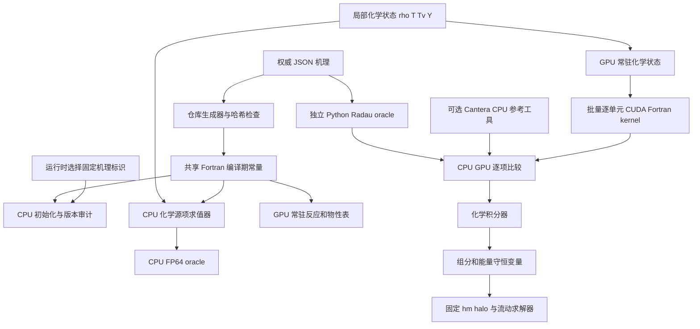

# ASTR 五组分双温化学 GPU 移植计划

状态：Phase C0 至 C4 已完成；Phase C5 第 1 至 5 项、第 6 项 A0 短时门槛、C5-6B 的 `q(1:11)` 激波格式核心/周期激波管门槛以及 C5-6B1 捕获型反应正常激波扩展短时门槛已完成；2026-09-24 按人工决定暂缓正常激波横向误差诊断，推进 B2 入射激波边界与 SBLI 工程接入；B2-0 数据准备、B2-1 CPU/GPU 边界和 B2-2 单/双卡启动短步已完成，A1/B1/B2 长时物理门槛未关闭
日期：2026-09-23
适用分支：`feature/gpu_dev`

## 0. 当前实施状态

Phase C0 已形成以下可审计实现：

- `chemMech/air5_kimjo12.json` 冻结 `N2/O2/N/O/NO` 五组分、十二反应、
  固定热力学、Kim-Jo 优先解离、Millikan-White/Park V-T 参数和严格 SI 单位；
- `scripts/generate_air5_mechanism.py` 在生成前拒绝未知组分、缺项、重复反应、
  非 SI 单位、非有限值和越界有效域，并确定性生成
  `src/chemistry_air5_data.F90`；
- `src/chemistry_core.F90`、`src/chemistry_properties.F90` 和
  `src/chemistry_kinetics.F90` 中对应 module 实现 FP64 纯函数
  状态门禁、完整总能量恢复、`Ev <-> Tv`、有限速率/V-T 耦合瞬时源项、
  质量与 N/O 元素残差以及完整六变量解析 Jacobian；
- 根构建增加默认关闭的 `ASTR_WITH_AIR5_CHEMISTRY`。该选项与旧
  `CHEMISTRY/COMB` Cantera 路径互斥，固定 air5 后端不链接 Cantera；
- 根目录 `chem/` 已加入 `.gitignore`，继续只作为本地只读溯源材料。

Phase C1 在此基础上增加：

- `src/chemistry_kinetics.F90` 中的 `chemistry_linear6` 实现按行尺度化、带部分
  主元的固定 `6x6` LU；同文件的 `chemistry_ros2` 实现 KPP ROS-2 `2(1)` 固定步
  和单元局部自适应推进，
  返回建议步长、接受/拒绝次数及 RHS/Jacobian 求值次数；
- `src/chemistry_kinetics.F90` 中的 `chemistry_source` 以默认 coupled、
  chemical-only 和 VT-only 三种模式
  共用同一套热力学闭合，非法模式在源项计算前失败；
- `tests/gpu_validation/air5_radau_reference.py` 直接读取正式 JSON，以独立
  SciPy Radau 实现核对三种源项模式与完整轨迹；
- 有效域端点允许机器舍入尺度的压力构造误差，但不截断状态，也不放宽
  `200/10000 K` 与 `1e2/1e7 Pa` 的范围外拒绝。

Phase C2 在不修改 `numq` 和 CFD 主循环的条件下增加：

- `src_gpu/chemistry_core_gpu.cuf`、`chemistry_relaxation_gpu.cuf` 和
  `chemistry_kinetics_gpu.cuf` 中对应 module 实现 FP64 设备端
  状态门禁、热力学反演、V-T 松弛以及瞬时源项和完整解析 Jacobian；
- 固定五组分十二反应表以编译期参数进入设备代码。批量 launcher 只接收
  device 数组，不执行 H2D/D2H；
- 一个 CUDA 线程处理一个状态，源项、总能量零源项、Jacobian、十二个反应
  进度率和状态码写入独立工作数组，不原位修改 `q5` 或化学状态；
- coupled、chemical-only 和 VT-only 使用同一设备实现，每次 kernel 启动后
  通过 `sync_after_kernel(...,force_sync=.true.)` 显式同步并检查错误；
- CPU API 增加可选的十二反应进度率诊断输出，默认调用行为不变。

Phase C3 继续保持 `numq=5` 和 CFD 主循环不变，并增加：

- `src_gpu/chemistry_kinetics_gpu.cuf` 中的 `chemistry_linear6_gpu` 复刻 CPU 的
  缩放部分主元固定 `6x6` LU；同文件的 `chemistry_ros2_gpu` 实现一线程一状态的
  FP64 KPP ROS-2 `2(1)`，
  各状态独立接受、拒绝和调整局部子步；
- 批量 launcher 只接收 device 数组，并在 kernel 后强制同步和检查 CUDA 错误；
- 无效控制量、非法状态和尝试次数耗尽均按 CPU 语义 fail closed，返回初始状态，
  不裁剪温度、不归一化组分，也不修改约束量 `q5`。

Phase C4 冻结并实现 CFD 输运状态合同：

- `src/chemistry_core.F90` 中的 `chemistry_state_layout` 集中定义 `q(1)` 密度、
  `q(2:4)` 动量、`q(5)`
  完整总能量、`q(6:10)` 五个组分密度和 `q(11)` 振动能；
- air5-enabled 构建复用输入文件中的 `lcomb` 作为运行时开关，并向所有 MPI rank
  广播。`lcomb=f` 保持既有非反应布局；
- `lcomb=t` 只接受 `num_species=5`、`turbmode=none` 和 `lfilter=f`，通过校验后
  一次性设置 `num_modequ=1`、`numq=11`；非法组合在修改布局前 fail closed；
- CPU/GPU 主循环以同一 `numq=11` 权威状态推进，并在设备端常驻五个组分密度、
  完整总能量和振动能；
- 已接入守恒量/原始量转换、六阶显式中心对流、Blottner/Wilke/
  modified-Eucken/Gupta 输运、完整组分扩散焓和振动能扩散；
- 固定 `hm` 的 `q(1:11)` 和扩散通量 halo 已通过 x/y/z slab 及
  `2x2x2` 拓扑。C4 不调用化学积分 kernel，也不宣称反应流耦合。

当前 C0+C1 CPU 基线证据为：46 项测试和 18 个参数化子用例通过；
`Ev -> Tv -> Ev`、`q5 -> T -> q5` 最大归一化残差分别约为
`9.94e-16` 和 `1.50e-16`；CPU 源项质量/元素最大归一化残差约为
`1.28e-16`；严格正组分内点的解析 Jacobian 对尺度化中心差分 oracle 的最大
门槛比约为 `0.184`，精确零组分边界对二阶单边 Richardson oracle 的最大门槛比
在 GNU/NVHPC 下分别约为 `0.249/0.388`，均小于接受上限 1。GNU CPU 与 NVHPC
CUDA-enabled 顶层构建均成功，`ldd`
不含 Cantera。Phase C1 的非刚性固定步观测阶门槛 `>=1.8` 已通过，强刚性状态
在 `2048/4096/8192` 子步下对 Radau 的误差单调下降并在最细层达到温度、主组分
和痕量组分门槛。代表矩阵覆盖振动滞后、振动超前、近平衡、低温、高温、低压
和高压状态；三种源项模式均与 independent Radau 对齐。化学关闭后的 10 步 TGV
CPU/GPU 统计量回归通过，最大绝对差约为 `4.67e-14`；逐场回归也通过，守恒变量
最大绝对差为 `q5` 的 `2.84e-13`，原始变量最大绝对差为压力的 `1.14e-13`，
均低于 `1e-10` 门槛。

加入 C2 后的组合矩阵为 `52 passed, 18 subtests passed`。GPU 单状态和十四状态
批量探针覆盖冷区、近平衡、强反应、`1e3/1e6 Pa` 有效域端点，以及
`200/10000 K`、`1e2/1e7 Pa`、负组分和 NaN 的 fail-closed 状态。源项、十二
反应进度率和解析 Jacobian 的最大逐项门槛比分别为 `1.88e-2`、`1.40e-2` 和
`4.88e-4`；总能量源项与 `q5` 改变量均为零，CPU/GPU 状态码无差异。
Compute Sanitizer 报告 `0 errors` 和 `0 bytes leaked`。启用 CUDA 与 air5 的
顶层 `astr` 完整构建通过，化学关闭的 10 步 TGV 统计量回归继续通过，最大
绝对差约为 `4.67e-14`。

加入 C3 后的组合矩阵为 `58 passed, 18 subtests passed`。CPU/GPU 轨迹矩阵覆盖
冷态、强反应态、振动超前态和高温高压态，并分别运行 coupled、chemical-only
和 VT-only 模式。GPU 终态最大门槛比为 `2.76e-4`，接受/拒绝次数、RHS/Jacobian
调用次数和状态码与 CPU 完全一致。质量、N 元素和 O 元素最大漂移分别为
`8.09e-16`、`1.59e-15` 和 `3.61e-16`；`q5` 和输入状态改变量均为零。直接
`6x6` 求解探针覆盖主元交换、极端尺度和奇异矩阵，CPU/GPU 状态一致。
Compute Sanitizer 报告 `0 errors` 和 `0 bytes leaked`。启用 C3 模块的完整
`astr` 构建和化学关闭的 10 步 TGV 统计量回归通过，后者最大绝对差仍约为
`4.67e-14`。

加入完整 C4 后的组合矩阵为 `80 passed, 18 subtests passed`。CUDA+air5 与
CPU-only+air5 顶层 `astr` 均完整链接。均匀组分 TGV 的 CPU/GPU 快照在 NP=1、
NP=2 x/y/z slab 和 NP=8 `2x2x2` 下通过 `atol=rtol=1e-10`，最大绝对差分别不超过
`4.44e-15` 和 `3.55e-15`。NP=1 十步全局质量、总能量、N/O 元素和组分闭合的
最大相对漂移为 `7.37e-14`。专用 `air5wave` 初场使用零速度、恒温恒压和三向
N2/O2 正弦扰动；密度加权 N2 方差在一个 RK 步后相对下降 `3.3721e-6`，组分
均值相对变化不超过 `1.46e-16`。该门槛在 NP=1、NP=2 三种 slab 和 NP=8
`2x2x2` 上均通过，并独立发现和修正了把物理扩散通量 `Js=-rho*Ds*grad(Ys)`
以错误正号装入组分 RHS 的反扩散缺陷。三种 halo transport 的 NP=2/3 生产
合约精确通过；关闭 OpenMPI CUDA 缓冲区探测后的 NP=1 Compute Sanitizer 为
`0 errors`、`0 bytes leaked`。化学关闭后的非反应 TGV 回归最大统计量差为
`1.12e-14`。

本机 RTX 4000 Ada 上的 8192 状态混合批次中，各状态接受子步范围为 `1..15`，
拒绝范围为 `0..2`，无失败状态。Nsight Compute 测得 156 registers/thread、
3040 B stack/thread、25% 理论 occupancy 和 12.4% 实测 occupancy；local-load 与
local-store sector 分别约为 `2.64e8` 和 `1.26e8`。该网格只有 0.44 waves/SM，
因此这些结果用于定位寄存器、局部内存和负载长尾，不作为生产吞吐量结论。

机理一致性已直接核对 Kim-Jo 2021 原文 Table 1 的振动弛豫参数、Table 2 的
优先解离参数、Table 3 的五组分离解速率和 Table 4 的低温平衡常数。只读 donor
archive 的 SHA-256 与 JSON 记录一致；测试逐一撤销 12 个反应的 `1e-6` 速率
前因子换算和五类平衡常数的 `delta_nu*ln(1e6)` 修正，恢复论文/CGS 参数。
Fortran probe 在启用 `invalid/zero/overflow` 浮点异常捕获时验证 NaN 状态先返回
`chemistry_status_nonfinite`，不会在范围比较或源项计算中触发异常后继续运行。

C3 已证明独立批量瞬时源项和自适应 ROS-2 轨迹在 GPU 上执行。C4 已证明
`numq=11` 权威状态、无反应组分/`Ev` 对流扩散和多 MPI halo 可在 GPU CFD
主循环中常驻推进。C5 第 1 至 5 项已经完成 Strang 耦合、非均匀输运、激波后
松弛、三维多 rank 和高温反应 TGV 门槛；C5-6A0 已完成 Cartesian 高焓平板
短时边界、CPU/GPU 同相位、MPI 和内存安全门槛。独立双温平板物理验证、反应流
restart、`q(1:11)` 激波捕捉和有限速率空气 SBLI 仍属于 C5 至 C6。

精确零组分位于非负状态域边界。若对该分量使用严格中心差分，负向扰动必然产生
负组分并触发 fail-closed，与已冻结的正性门禁冲突。当前测试在质量分数 `1e-4`
的痕量极限使用中心差分，并在精确零初始生成物上使用保持非负的二阶单边差分及
Richardson 外推。两类测试均保持 `rtol=1e-6, atol=1e-8`。该边界验收语义已于
2026-09-14 确认；不得通过允许生产源项接受负组分来满足测试形式。

## 1. 目标

在保持当前非反应 ASTR GPU 主线、显式空间格式、多 MPI rank、曲线网格与
边界条件能力不退化的前提下，增加面向高温空气的 GPU 化学能力。第一条正式
物理模型路线限定为 `N2/O2/N/O/NO` 五组分、平动温度与振动温度分离的双温模型。

该路线首先建立可独立验证的 CPU 参考模型，再实现 CUDA Fortran 后端。CPU
代码进入现有 `src/`，GPU 代码进入现有 `src_gpu/`。不创建新的顶层源码目录。

## 2. 已确认决策

1. 暂停当前性能优化主线，打开顶层方案中的 Phase 5 化学移植阶段。
2. `chem/` 仅作为本地只读二次开发参考，不加入 Git，不参与正式构建。
3. 不将 `chem/astr/src/` 整体合并或覆盖到当前 `src/`。
4. CPU 参考实现放入对应 `src/` 模块，CUDA Fortran 实现放入对应 `src_gpu/` 模块。
5. 首条化学路线采用五组分双温高温空气模型，不以通用 Cantera 机理作为首个
   GPU 后端。
6. 当前工程仍统一使用项目根目录 `CMakeLists.txt` 构建。
7. `use_gpu` 继续由运行时输入决定，不能用编译选项替代。
8. GPU 内核间继续保留显式同步，除非后续建立独立的正确性与性能决策。
9. FP64 是化学移植的权威数值基线。化学模块暂不进入混合精度范围。
10. 流动与化学采用 Strang 分裂：局部化学算子推进 `deltat/2`，现有
    非反应流动 RK 推进 `deltat`，局部化学算子再推进 `deltat/2`。
11. 有限速率反应与 V-T 松弛在同一个局部化学算子内耦合积分，不在两者之间
    再做算子分裂。
12. 第一阶段正式机理冻结为 Kim-Jo/Park 五组分十二反应中性空气约化机理，
    组分固定为 `N2/O2/N/O/NO`。离子、电子和完整十一组分空气模型不属于
    第一阶段范围。
13. Cantera 仅保留为独立、可选的 CPU 参考工具。五组分双温生产版 ASTR
    可执行文件不链接 Cantera，也不在 CPU 或 GPU 生产时间循环中调用 Cantera。
    生产 CPU 与 GPU 后端使用同一套自主实现的固定机理、热力学常量和能量定义。
14. 第五个流动守恒量采用完整总能量定义：`q5` 同时包含动能、平动转动内能、
    振动内能和组分生成能。`Ev` 作为独立演化的振动模态能，同时也是 `q5` 的
    组成部分。绝热定容化学半步保持密度、动量和 `q5` 不变，耦合更新组分与
    `Ev` 后反解 `T/Tv`；不得再向 `q5` 添加显式生成能源项。
15. 振动模态能纳入统一守恒数组。五组分、无湍流模型使用 `numq=11`：
    `q(1:5)` 为流动守恒量，`q(6:10)=rho*Ys`，`q(11)=Ev=rho*e_v`。
    `qrhs(11)`、`qsave(11)`、过滤、边界与 halo 均复用统一守恒量基础设施。
    `tve` 只是由 `q(11)、rho、Ys` 重建的派生缓存，不再维护另一份权威 `Ev`。
16. 第一阶段反应流路径固定 `lfilter=f`。现有十阶显式中心滤波不保持组分正性，
    不得通过组分截零或简单归一化掩盖负值。非反应算例已有的 `full/scalar`
    过滤路径保持不变；反应流过滤及其质量、元素和能量约束投影另立后续阶段。
17. 首个 CPU/GPU 生产化学积分器采用自适应二阶 L-stable ROS2。每个局部状态
    以五个组分密度和一个振动模态能构成六变量耦合系统，每个 ROS2 stage
    求解固定 $6\times6$ 线性系统。GPU 第一版由一个 CUDA 线程负责一个网格
    单元的完整局部子循环和私有线性求解；这不是单元到物理 CUDA core 的绑定。
18. ROS2 生产路径使用完整解析 Jacobian，必须包含固定 `rho`、动量和 `q5`
    条件下组分与 `Ev` 对 `T/Tv` 的隐式耦合导数。CPU 中另建中心差分 Jacobian
    作为正组分内点的逐元素导数 oracle；非负状态域边界使用单边方向导数。
    数值 Jacobian 不进入生产 CPU/GPU 时间循环。
19. 第一阶段热力学采用五组分理想混合气体、固定平动转动自由度、双原子
    谐振子振动能和固定组分生成能。N/O 的平动定容热容为 `3/2*Rs`，
    N2/O2/NO 为 `5/2*Rs`；不包含 NASA 温变热容、电子激发、转动非平衡、
    离子或电子。固定完整总能量下 `T` 代数恢复，只有混合物 `Tv` 有界反解。
20. 第一阶段层流输运采用 Blottner 单组分黏度、Wilke 混合规则、modified
    Eucken 平动转动热导率、Gupta 二元扩散拟合和带修正速度的混合平均组分
    扩散。振动热传导及组分携带振动能单独进入 `Ev` 通量，完整组分焓进入
    `q5` 扩散通量。Stefan-Maxwell、Soret、Dufour 和体积黏度暂不纳入。
21. 化学验证采用双层基准。CPU Fortran FP64 ROS2 生产后端是 GPU 移植等价
    基准；独立 Python/SciPy `solve_ivp(method='Radau')` 零维驱动器是积分与
    模型轨迹基准。两者读取同一份带版本和哈希的正式机理数据，但不共享积分
    算法。Cantera 仅作其能力范围内的局部单温核对，历史 `zeroDimChem.zip`
    输出仅作趋势与量级参考。
22. `chemMech/air5_kimjo12.json` 是首阶段机理的唯一权威数据源。仓库内生成器
    产生共享的 `src/chemistry_air5_data.F90` 编译期常量模块，CPU 与 CUDA
    Fortran 均使用该模块；JSON 和生成文件同时纳入 Git，并由测试检查再生成
    结果和内容哈希。生产程序不在运行时读取或广播机理，只输出机理标识和版本，
    不输出 SHA-256，也不接受任意外部机理文件。
23. 零维正式验收域限定为 `T=300--8000 K`、`Tv=300--8000 K` 和
    `p=1e3--1e6 Pa`。验证采用冷空气、未解离空气、部分解离空气、近平衡状态、
    零初始生成物以及平动与振动强非平衡状态的代表性组合，不做无信息增益的
    全笛卡尔积。`200 K`、`10000 K`、`1e2 Pa` 和 `1e7 Pa` 只用于拒绝路径、
    有限值和失败报告测试；超过 `8000 K` 不作当前固定热容中性空气模型的物理
    精度声明。零维基准采用 SI，ASTR 无量纲状态通过独立适配层转换。
24. 化学验收采用按对象分层、按尺度归一化的门槛。热力学往返残差上限为
    `1e-12`；尺度化解析 Jacobian 对正组分内点中心差分及精确零组分单边
    Richardson oracle 均采用 `rtol=1e-6, atol=1e-8`；
    CPU/GPU 瞬时源项采用 `1e-13*source_scale + 5e-12*abs(reference)`；
    CPU/GPU ROS2 温度和主要组分采用 `rtol=1e-9`，痕量组分采用
    `atol=1e-13, rtol=1e-8`。收敛后的 ROS2 对独立 Radau，温度上限为
    `rtol=1e-7`，主要组分为 `rtol=1e-6`，痕量组分为 `atol=1e-10`。
    CPU 质量/元素归一化残差不超过 `5e-13`，GPU 与完整轨迹不超过 `5e-12`，
    每个接受化学子步的总能量相对漂移不超过 `5e-12`。接受状态必须严格非负；
    NaN、Inf、越界温度或失败后继续推进均直接失败。门槛可依据证据收紧，不能
    为通过测试而放宽。

其中 `source_scale` 定义为同一状态下参考源项向量各分量绝对值的最大值；若整个
参考向量为零，则要求 CPU/GPU 均返回精确零或使用该测试预先定义的物理量纲尺度，
不得用任意常数掩盖近零误差。
25. 反应流算例按隔离风险晋级：周期小三维网格中的空间均匀反应器；冻结化学的
    准一维组分平移、二元扩散和振动能脉冲；Cartesian 准一维正常激波后化学与
    V-T 松弛；三维挤出正常激波；高温周期 TGV；层流高焓平板边界层；最终
    有限速率空气 SBLI。高温 TGV 只承担三维耦合、守恒和性能压力测试，不作为
    化学物理验证。含燃料火焰算例与当前五组分空气机理不相容，不进入该路线。
26. 多 MPI 化学 kernel 只更新现有 `is:ie,js:je,ks:ke` 活动范围，不更新外部
    halo，也不在自适应 ROS2 子步内通信。第一个化学半步后只交换权威
    `q(1:11)`，沿用 `qswap` 的一个重复接口面加 `hm` 个外部 halo 面语义；
    primitive、`T/Tv/Ys` 和物性由接收后的 `q` 重建。第二个化学半步后 halo
    标记失效，推迟到下一个确实需要 halo 的消费者。全局守恒采用单元体积积分
    避免重复接口节点；每个半步只回传并全局归约小型状态记录，任一 rank 失败时
    所有 rank 同步终止。
27. 性能验收分为本地开发证据和 A800 权威结果。本地两张 19.2 GB RTX 4000
    Ada 只承担正确性、Compute Sanitizer、Nsight 和容量预检；A800 采用一 rank
    绑定一 GPU。正式矩阵包括 `256^3 NP=1`、`384^3 NP=1/2/4` 和
    `512^3 NP=2/4`，预热 2 次后计时 5 次，变异系数不超过 3%。化学关闭时
    非反应路径回归开销不超过 2%，`384^3` 从 2 卡到 4 卡并行效率目标不低于
    70%。首个正确 A800 基线形成前不预设 CPU 加速倍数；形成后另行冻结目标。
28. ROS-2 固定采用 KPP 的 L-stable `2(1)` 系数集：
    `gamma=1+1/sqrt(2)`、`a21=1/gamma`、`c21=-2/gamma`、
    `m1=3/(2*gamma)`、`m2=e1=e2=1/(2*gamma)`。每次尝试子步只分解一次
    `6x6` 矩阵并回代两个 stage。误差范数采用调用方提供 `rtol/atol(6)` 的
    六分量加权 RMS，控制器安全因子为 `0.9`，步长倍率限制为 `[0.2,5]`。
    RODAS3 只作为未来可选积分器，不属于 C1 实现范围。
29. 第一版 CPU/GPU ROS-2 均允许每个单元独立接受或拒绝子步，并返回建议步长、
    接受/拒绝次数以及 RHS/Jacobian 求值次数。若 GPU 实测的 `p95/p50` 子步数
    比值超过 2 或有效线程利用率低于约 70%，优先评估按预测步长或刚性分桶；
    warp 级同步拒绝仅作为桶内离散程度较小时的后续候选，不进入正确性基线。

## 3. 二次开发审计结论

`chem/astr` 是一份较老的完整 ASTR CPU 副本，而不是可直接链接的化学库。
其中 `thermchem.F90` 与当前主线版本相同，没有提供 GPU Cantera 实现。可借鉴的
新增内容主要是：

- `chemrct.F90`：五组分反应参数、正逆反应速率、组分和化学能源项；
- `relx.F90`：振动能、振动温度反解与 V-T 松弛；
- `fludyna.F90` 和 `solver.F90` 中的 Blottner、Wilke、Eucken、Gupta 物性与输运；
- `commtype.F90`、`commvar.F90` 和 `commarray.F90` 中的模型与场变量草案；
- `mainloop.F90` 中 `Ev` 参与 Runge-Kutta 时间推进的原型。

以下问题使该副本不能直接作为移植基线：

- `qalg%TTP_ALG` 等状态没有完整初始化；
- 主体副本缺少必需的 `datin/rct.dat`，配套 `zeroDimChem.zip` 后续提供了一份
  候选文件，但尚未形成可追溯的正式机理；
- `heatbath` 输入与读取顺序不匹配；
- 反应组分数不匹配仅告警而不终止；
- `Ev2tv` 的 Newton 更新未保护小导数，可能产生 `Inf/NaN`；
- 非双温路径可能访问未分配的 `tve`；
- 机理文件由每个 MPI rank 独立读取；
- 每个 RK stage 中存在多个全域自动数组或临时分配；
- 现有分析结果缺少完整原始算例和有效 Git 来源；
- 源码和输入中存在大量 CRLF，不满足 NVHPC 输入安全要求。

因此，二次开发代码只提供公式、数据结构和调用关系线索。所有进入正式分支的
实现必须经过独立提取、修复、单位审计和测试。

### 3.1 `zeroDimChem.zip` 候选包审计

本地候选包为 `chem/zeroDimChem.zip`，SHA-256 为
`353edc87d665026a6650f3aa06862e1574df74248a2b2864d284fe0ea3692da1`。
该文件继续留在不跟踪的 `chem/` 中。审计时只读取压缩包或将指定文件释放到
`/tmp`，不把压缩包及其内容加入正式源码。

该包补齐了以下材料：

- 五组分顺序为 `N2/O2/N/O/NO` 的 `datin/rct.dat`；
- 12 条中性高温空气反应，逆反应采用平衡常数模型；
- 解离反应采用 $\sqrt{T T_v}$，交换反应采用平动温度；
- 反应系数标记为 CGS 单位，现有原型在形成 SI 质量源项时乘以 $10^6$；
- 零维初态为 $T=T_v=4000\ \mathrm{K}$、$\rho=0.01\ \mathrm{kg/m^3}$、
  $Y_{N_2}=0.7653$、$Y_{O_2}=0.2347$，其余组分为零；
- 历史计算采用 `deltat=5.0e-7 s`，推进 400000 步到 `t=0.2 s`；
- `monitor0001.dat` 含 400001 个有限状态，HDF5 checkpoint 每 10000 步输出一次。

历史轨迹从 4000 K 松弛至约 2926.98 K，最终质量分数约为
`N2/O2/N/O/NO = 0.747076/0.152197/1.27988e-5/0.0616899/0.0390241`。
这些数值只定义候选回归轨迹，不构成独立物理验证。

与 J. G. Kim 和 S. M. Jo 在 *International Journal of Heat and Mass
Transfer* 169 (2021) 120950 中表 2 至表 4 的逐项核对表明：

- N2、O2 和 NO 的解离 Arrhenius 参数对应论文表 3 的中性碰撞体子集；
- 五类反应的逆反应平衡常数拟合对应论文表 4 的低于 20000 K 参数；
- N2、O2 和 NO 的优先解离振动能移除参数对应论文表 2；
- 双温解离反应使用 Park 几何平均温度 $\sqrt{T T_v}$；
- `N2 + O -> NO + N` 和 `NO + O -> N + O2` 两条交换反应采用论文所述的
  Park 系列参数，而不是 Kim-Jo 新拟合的解离参数。

因此，该文件应称为“Kim-Jo/Park 五组分十二反应中性空气约化机理”。它不是
Kim-Jo 论文的完整 11 组分空气模型，不含离子、电子、缔合电离、电荷交换和
电子碰撞电离。第一阶段若采用该机理，不得把结果表述为完整 11 组分模型。

包内存在以下证据冲突：

- `rct.dat` 的时间戳为 2026-09-02，主要轨迹与 HDF5 输出为 2026-06-22，
  不能证明现有输出由压缩包中的这一版机理生成；
- `run.log` 和 `errnode.log` 来自更早的失败运行，包含 `Ev2tv` 不收敛和大量
  `NaN`，不能与后续有限轨迹混作同一次计算证据；
- `fturbstats.dat` 同样包含 `NaN`；
- `chemstats.dat` 的旧标签顺序为 `O2/O/N2/N/NO`，与正式候选顺序
  `N2/O2/N/O/NO` 不一致，且只含初始和一步数据；
- 历史轨迹按打印精度计算的最大 $|\sum_s Y_s-1|$ 约为 $1.08\times10^{-7}$，
  N、O 元素相对漂移分别约为 $6.95\times10^{-8}$ 和 $2.50\times10^{-7}$；
- 按原型的 `q5 + rho*sum(Y_s*e0_s)` 解释计算，总能量相对漂移约为
  $8.4\times10^{-4}$。该差异不能仅凭文本输出精度解释为零，必须在正式 CPU
  oracle 中重新定位。

因此，本包可用于冻结候选反应集合、初始状态和回归曲线，但不能直接作为 CPU
oracle。正式实现必须重新生成全精度轨迹，并把输入机理摘要、代码版本、积分器、
容差和守恒残差写入同一个验证记录。

## 4. 领域术语

### 化学状态

单个网格点上决定热力学和反应速率的局部状态。第一阶段至少包含密度、平动
温度、振动温度和五个组分质量分数。

### 化学源项求值器

从一个不可变的化学状态计算组分生成率、总能量源项和振动能源项。求值器只
定义瞬时源项，不决定时间积分算法。

### 化学积分器

将化学源项在一个物理时间步或子步内推进到新状态的算法。显式 RK、化学子循环、
点隐式方法和算子分裂属于不同积分策略，不能与源项公式混为同一模块。

### GPU 等价 oracle

与 CUDA Fortran 生产路径采用相同固定机理、热力学闭合、解析 Jacobian 和
FP64 ROS2 算法的 CPU Fortran 实现。它用于定位 GPU 移植误差，但不能排除两套
生产实现共享同一公式或算法错误。

### 独立零维 oracle

位于验证脚本中的 Python/SciPy 高精度零维实现。它直接读取与生产后端相同的
版本化机理数据，但使用独立实现的方程和 Radau 或 BDF 隐式积分，不复用生产
ROS2。它用于检查状态轨迹、守恒、刚性积分误差和时间步收敛，不进入正式 ASTR
可执行文件。

### 生产级化学路径

通过独立零维物理验证、CPU/GPU 数值等价、多 MPI 所有权、长时正性和守恒检查，
并能与流动时间推进稳定耦合的路径。编译通过或单步 kernel 对比不等于生产级。

### 生产化学后端

ASTR 正式时间推进调用的化学实现。第一阶段仅指 CPU 和 CUDA Fortran 两套
Kim-Jo/Park 五组分双温固定机理实现，不依赖 Cantera 运行库。

### Cantera CPU 参考后端

独立于生产版 ASTR 的可选验证工具，用于核对单温热力学、组分参考能、部分
反应速率和平衡状态。它不能单独定义双温反应、优先解离或 V-T 松弛的权威轨迹。

### 完整双温总能量

第五个流动守恒量采用

$$
q_5=\rho\left[\frac{u_i u_i}{2}+e_{\mathrm{tr}}(T,Y)
+e_{\mathrm v}(T_v,Y)+\sum_sY_s e_s^0\right].
$$

其中振动能既包含在 `q5` 中，又通过独立模态方程确定其在总内能中的分配。
两者不是两份能量。化学反应和 V-T 松弛只能重新分配各内能组成，不得改变
绝热定容局部化学算子的 `q5`。

### 统一双温守恒状态

五组分、无湍流模型的正式守恒状态为
`[rho,rho*u,rho*v,rho*w,rho*E,rho*Y1,...,rho*Y5,Ev]`。振动模态能的唯一
权威存储是 `q(idx_ev)`；`tve` 和其他热力学量均可从守恒状态重建。实现使用
具名索引常量而不是在 kernel 中散布字面值 `11`。

### 单元局部 ROS2 积分

局部未知量为

$$
\boldsymbol z=[\rho Y_{N_2},\rho Y_{O_2},\rho Y_N,\rho Y_O,
\rho Y_{NO},E_v]^T.
$$

每个源项求值均在固定 `rho`、动量和完整 `q5` 下恢复 `T/Tv`，并同时计算
有限速率反应与 V-T 松弛。GPU 第一版采用一线程一单元。线程内部执行 ROS2
stage、固定 $6\times6$ 线性求解、误差估计、子步拒绝和重试。线程由 warp
调度到 CUDA core 上执行，不存在一个网格单元永久占用一个物理 core 的关系。

生产 Jacobian 定义为完整约束导数

$$
J_{mn}=\left.\frac{\partial S_m}{\partial z_n}\right|_{\rho,\rho\boldsymbol u,q_5},
$$

因此必须包含组分和振动能扰动引起的 $T$ 与 $T_v$ 变化。冻结温度的反应率
偏导不是该 ROS2 系统的 Jacobian。CPU 中以尺度相关的双边中心差分重新执行
完整热力学反解，形成只用于测试的内点数值 Jacobian；精确零组分使用二阶单边
差分及 Richardson 外推，避免构造负组分。两者均用于逐元素验证解析表达式。

### 第一阶段双温热力学

五组分采用理想混合气体状态方程

$$
p=\rho T\sum_sY_sR_s,\qquad R_s=R_u/M_s.
$$

平动转动内能使用固定自由度：N/O 为 $3R_sT/2$，N2/O2/NO 为
$5R_sT/2$。N2/O2/NO 的振动内能采用谐振子关系

$$
e_{\mathrm v,s}=\frac{R_s\theta_{\mathrm v,s}}
{\exp(\theta_{\mathrm v,s}/T_v)-1},
$$

N/O 的振动内能为零。加上固定组分生成能后，平动温度由完整总能量直接恢复：

$$
T=\frac{q_5/\rho-u_i u_i/2-E_v/\rho-\sum_sY_se_s^0}
{\sum_sY_sc_{v,\mathrm{tr},s}}.
$$

混合物 `Tv` 由 `Ev/rho=sum(Ys*ev_s(Tv))` 有界求解。该模型不包含 NASA
温变热容、电子激发能、转动非平衡、离子和电子，不得表述为完整高温空气模型。

### 第一阶段层流输运

单组分黏度采用 Blottner 拟合，混合物黏度使用 Wilke 规则。平动转动热导率
采用 modified Eucken 关系并按一致的混合规则组合。Gupta 二元扩散拟合形成
混合平均扩散系数，扩散通量通过修正速度满足

$$
\sum_s\boldsymbol J_s=0.
$$

完整总能量中的组分扩散必须携带

$$
h_s=e_{\mathrm{tr},s}+e_{\mathrm v,s}+e_s^0+R_sT,
$$

振动模态能通量同时包含振动热传导和组分携带振动能。`chem/astr` 原型遗漏
扩散焓中的 `e0`，并在混合扩散分母较小时使用无物理依据的 `1e-6` 截断；
两者均不作为兼容行为移植。接近纯组分的极限必须通过有界公式和零通量测试处理。

## 5. 目标架构

架构边界如下：

- `chemMech/air5_kimjo12.json` 是机理参数的唯一手工维护数据源；
- 仓库生成器产生共享 Fortran 编译期常量，测试通过再生成差异和内容哈希防止
  JSON 与生成模块漂移；
- 生产版 ASTR 的 CPU/GPU 五组分后端均不链接或调用 Cantera；
- Cantera 只通过独立可选验证目标参与单温热力学、参考能和局部速率核对；
- 生产程序不运行时读取或 MPI 广播机理文件，不接受任意外部机理；
- 程序启动只输出固定机理标识和版本，不输出内容哈希；
- GPU 反应表在初始化后常驻设备；
- 化学源项是局部运算，不交换源项 halo；
- 组分守恒变量、振动能和热力学状态按流动阶段需要交换固定 `hm` halo；
- 第一阶段反应流能力门禁拒绝 `lfilter=t`，现有非反应过滤后端不作改动；
- 统一 `q/qrhs/qsave` 覆盖五个组分守恒量和振动模态能，不建立并行的
  `Ev/Evrhs/Evsave` 全域推进路径；
- `tve` 可在设备端常驻以避免重复反解，但它是失效后必须由统一守恒状态重建的
  派生缓存，不能独立参与 checkpoint 或成为边界条件的第二权威来源；
- 化学源项求值与时间积分分层，以便先验证公式，再选择刚性积分策略；
- 每个化学半步内部同时更新组分、平动热力学状态和振动能状态；
- 绝热定容化学半步固定 `rho`、动量和完整 `q5`，更新 `rho*Ys` 与 `Ev` 后
  通过同一套热力学定义反解 `T/Tv`；
- 不设置 `-sum(e0_s*omega_s)` 形式的独立 `q5` 化学源项，避免生成能重复记账；
- 第一个化学半步结束后重建热力学状态，再进入流动 RK 和所需 halo 交换；
- 第二个化学半步必须从完整输运步后的状态重新计算反应率和松弛率；
- 文件输出和 checkpoint 仍由 CPU 管理，不纳入本阶段 GPU 化。

## 6. 计划文件映射

以下文件名是当前设计候选，最终命名在实现前冻结。

| 职责 | CPU 文件 | GPU 文件 |
|---|---|---|
| 模型类型 | `src/chemistry_core.F90` | `src_gpu/chemistry_core_gpu.cuf` |
| 权威机理数据 | `chemMech/air5_kimjo12.json` | 不直接读取 |
| 机理生成器 | `scripts/generate_air5_mechanism.py` | 生成共享常量模块 |
| 五组分编译期常量 | `src/chemistry_air5_data.F90` | 复用同一 Fortran 模块 |
| 热力学与振动能关系 | `src/chemistry_properties.F90` | `src_gpu/chemistry_core_gpu.cuf` |
| 反应速率与源项 | `src/chemistry_kinetics.F90` | `src_gpu/chemistry_kinetics_gpu.cuf` |
| V-T 松弛 | `src/chemistry_properties.F90` | `src_gpu/chemistry_relaxation_gpu.cuf` |
| 固定 `6x6` 线性求解 | `src/chemistry_kinetics.F90` | `src_gpu/chemistry_kinetics_gpu.cuf` |
| KPP ROS-2 时间积分 | `src/chemistry_kinetics.F90` | `src_gpu/chemistry_kinetics_gpu.cuf` |
| 可选 Cantera 参考驱动 | `tests/gpu_validation/` 下独立测试目标 | 不进入 GPU 后端 |
| 统一守恒场与派生热力学缓存 | 现有 `src/commarray.F90` | 现有 `src_gpu/commarray_gpu.cuf` |
| 主循环编排 | 现有 `src/mainloop.F90` | 现有 `src_gpu/mainloop_gpu.cuf` |
| 能力门禁 | 现有 CPU 输入检查 | 现有 `src_gpu/case_capability_gpu.cuf` |

对 `src/solver.F90`、`src/mainloop.F90`、`src/commarray.F90` 和 `src/commvar.F90`
只允许最小接口修改。反应公式和迭代器不能继续堆入 `solver.F90`。

## 7. 分阶段推进

### Phase C0：模型与输入可信化

目标：形成可版本化、可审计的五组分双温模型输入和 CPU 纯函数接口。

任务：

- 确定完整反应集合、Arrhenius 单位、逆反应处理和第三体规则；
- 核对五组分分子量、生成焓、振动特征温度和输运系数来源；
- 冻结固定平动转动热容、生成能参考基准和谐振子振动特征温度；
- 将现有全局 `CHEMISTRY/COMB` Cantera 依赖与五组分生产后端解耦；
- 在根 `CMakeLists.txt` 中把 Cantera 核对工具设为独立可选目标；
- 定义严格 SI 制的 `chemMech/air5_kimjo12.json` schema，包含固定组分顺序、
  反应、第三体、逆反应、热力学、输运、来源和适用温度范围；
- 编写确定性生成器，拒绝未知组分、缺项、重复反应和单位不一致，并生成共享的
  `src/chemistry_air5_data.F90`；
- 将权威 JSON 与生成模块纳入 Git，测试重新生成并检查逐字节一致和内容哈希；
- 所有算法枚举在构造时显式初始化；
- 运行时仅允许固定 `air5_kimjo12` 机理标识，不读取或广播机理参数；
- 为 `Ev <-> Tv` 建立有界、可报告失败的求解接口；
- 为完整总能量建立平动温度代数恢复，并拒绝低于给定组分与 `Ev` 所允许最低
  内能的不可实现状态；
- 为混合物 `Ev -> Tv` 建立有上下界、单调残差和失败状态的求解接口；
- 建立源项质量守恒和 N/O 元素守恒检查。
- 建立完整解析 Jacobian 与 CPU 数值 Jacobian 的逐元素验证，覆盖温度、
  振动温度、解离程度、近平衡状态和精确零生成物；正组分内点使用中心差分，
  非负状态域边界使用单边方向导数，且差分扰动必须按变量尺度选择。

验收：

- 输入错误均在初始化阶段明确终止；
- 五组分数据和全部反应参数具有来源与单位记录；
- 不启用 Cantera 也能完成包含固定五组分 CPU 模块的 GNU CPU 与 NVHPC
  CUDA-enabled 顶层构建；
- 生产版 `astr` 的动态库依赖中不存在 Cantera；
- 单状态源项测试有限，组分总质量源项和元素残差满足确定阈值；
- 尺度化解析 Jacobian 与正组分内点中心差分、精确零组分单边 Richardson
  oracle 均满足 `rtol=1e-6, atol=1e-8`；
- `Ev -> Tv -> Ev` 往返测试覆盖低温、高温和接近平衡状态，归一化残差
  不超过 `1e-12`；
- `q5 -> T -> q5` 往返测试覆盖不同组分、解离程度、速度和振动能状态，
  归一化残差不超过 `1e-12`；
- Kim-Jo/Park 平衡常数拟合与固定 `e0/cv/Ev` 热力学在选定温度范围内完成
  独立一致性审计；不以旧代码曾运行作为一致性证据。

### Phase C1：零维 CPU 双温 oracle

目标：把化学公式正确性与 CFD 空间离散完全分开。

实施状态：已完成。该结论只覆盖 CPU FP64 零维化学算子及独立 Radau 对照，
不包含 GPU kernel、CFD 主循环耦合或反应流物理算例。

任务：

- 建立 CPU Fortran FP64 ROS2 零维定容驱动器，作为 GPU 等价基准；
- ROS2 固定为 KPP L-stable `2(1)` 变体，采用一次带部分主元的 `6x6` LU
  分解和两次回代，Jacobian 使用当前 `J(i,j)=dS_i/dy_j` 列向量定义而不转置；
- 自适应控制采用六分量加权 RMS 误差，安全因子 `0.9`、倍率范围 `[0.2,5]`；
  stage 或候选状态不可实现时拒绝并减半步长，不截零、不归一化；
- 返回建议下一步长、接受/拒绝子步数、RHS/Jacobian 求值次数和失败状态，供
  后续 GPU 子步统计与分桶使用；
- 在 `tests/gpu_validation/` 建立独立 Python/SciPy 零维驱动器，采用高精度
  `solve_ivp(method='Radau')`，必要时以 BDF 交叉检查；
- 独立驱动器直接读取权威 JSON；CPU ROS2 使用由该 JSON 生成的共享 Fortran
  常量，测试先验证二者未漂移；
- 正式状态矩阵覆盖 `T/Tv=300--8000 K` 和 `p=1e3--1e6 Pa`，采用代表性
  组合而不是完整笛卡尔积；
- 保留历史量级对照状态：`rho=0.01 kg/m3`、`T=Tv=4000 K`、
  `Y_N2/Y_O2=0.7653/0.2347`，但重新生成权威轨迹；
- 覆盖 `T=4000/6000/8000 K, Tv=300/1000 K` 的振动滞后状态，以及
  `T=1000/3000 K, Tv=4000/6000 K` 的振动超前状态；
- 以 `200 K`、`10000 K`、`1e2 Pa` 和 `1e7 Pa` 检查范围外拒绝、有限值和
  失败报告，不把这些状态纳入物理精度通过率；
- 输出 `T(t)`、`Tv(t)`、`Y_s(t)`、总能量和元素残差；
- 分开验证冻结化学的 V-T 松弛和冻结振动的化学反应；
- 再验证二者耦合；
- 对独立驱动器执行求解容差收敛，并对生产 ROS2 执行子步收敛；
- 使用可选 Cantera 工具核对其能力范围内的单温热力学、参考能和反应量，
  不把 Cantera 结果冒充完整双温 oracle。
- 将 RODAS3 记录为 ROS-2 不能满足鲁棒性或效率门槛时的未来可选路径，本阶段
  不实现、不参与 C1 验收。

验收：

- 独立 Radau 使用 `rtol=1e-11` 和按变量尺度设置的 `atol` 并达到容差收敛；
- 生产 ROS2 在非刚性受控状态的观测阶数不低于 `1.8`；强刚性状态允许阶降，
  但误差必须随子步缩小并在最细层达到最终门槛；
- 接受状态的质量分数严格非负且和为一，不允许截零或归一化修复；
- CPU 的质量和 N/O 元素归一化残差不超过 `5e-13`，GPU 与完整轨迹不超过
  `5e-12`；
- 定容绝热条件下，每个接受化学子步的总能量相对漂移不超过 `5e-12`；
- ROS2 对独立 Radau 的温度相对误差不超过 `1e-7`，主要组分相对误差不超过
  `1e-6`，痕量组分绝对误差不超过 `1e-10`；
- 任一 NaN、Inf、越界温度或失败后继续推进均直接失败；
- 历史 `zeroDimChem.zip` 只用于检查趋势和量级，不参与 pass/fail。
- 正式报告明确区分验收域和范围外压力测试，不将 `T>8000 K` 结果表述为
  当前约化热力学模型的精度验证。

验收记录（2026-09-14）：

- C0+C1 测试矩阵为 `46 passed, 18 subtests passed`；
- coupled、chemical-only、VT-only 的瞬时源项和 ROS-2 轨迹均通过 independent
  Radau 对照；
- 非刚性固定步观测阶通过 `>=1.8` 门槛，强刚性固定子步误差随
  `2048/4096/8192` 细化单调下降；
- 正式状态矩阵的质量与 N/O 元素残差、总能量重构、严格非负状态及终态误差
  均通过既定门槛；
- `200 K`、`10000 K`、`1e2 Pa`、`1e7 Pa` 均在零次 RHS/Jacobian 求值前失败，
  且失败时返回初始状态而不是部分推进结果；
- GNU 15、NVHPC 26.1 CPU 顶层构建和 NVHPC 26.1 CUDA-enabled 顶层构建均完成；
- 化学默认关闭的 10 步 TGV stats 与 field 回归通过。

### Phase C2：GPU 源项求值器

目标：实现与积分器解耦的批量逐单元 CUDA Fortran 源项 kernel。

任务：

- 反应与物性表常驻 GPU；
- 使用结构固定的五组分小数组，避免全域临时数组；
- GPU source/ROS2 kernel 只调用解析 Jacobian，不在设备上通过多次源项扰动构造
  数值 Jacobian；
- 每个线程处理一个局部网格点；
- 源项先写入独立工作数组，不直接更新流场；
- 每个 kernel 后显式同步并检查 CUDA 错误；
- 实现 CPU/GPU 单状态、批状态和极值状态比较。

验收：

- Compute Sanitizer 无错误；
- 每个组分源项、总能量源项、振动能源项和反应速率通过 FP64 逐项门槛；
- CPU/GPU 瞬时源项逐项满足
  `abs(delta) <= 1e-13*source_scale + 5e-12*abs(reference)`；
- 冷区、近平衡区和强反应区均有测试；
- 无逐步整场 H2D/D2H 传输。

验收记录（2026-09-14）：以上门槛均通过。精确热平衡点的净 V-T 源项是多个
大项相消后的理论零值，CPU/GPU 热力学反演会分别留下约 `1e-7` 量级舍入残差，
因此严格逐项等价门槛使用 `Tv-T=3.02 K` 的近热平衡非零状态；精确平衡仍由
C1 的绝对 `1e-6` 零源项门槛检查，不使用相对误差解释零值。

### Phase C3：GPU 零维积分

目标：在 GPU 上完成可控的双温化学时间轨迹。

实施状态：已完成。C3 只实现并验证独立的局部化学算子；下述 Strang 顺序是
C5 接入反应流主循环时必须遵守的耦合合同，不表示 C3 已经完成反应流推进。

采用 Strang 分裂耦合流动和局部化学算子：

1. 对每个单元执行 `deltat/2` 的局部化学积分；
2. 重建与 `rho/T/Tv/Y/Ev` 一致的热力学和守恒状态；
3. 由现有 RK3 执行完整 `deltat` 的非反应流动输运；
4. 从输运后的状态重新计算反应率和松弛率；
5. 再执行 `deltat/2` 的局部化学积分。

局部化学积分器同时处理有限速率反应和 V-T 松弛。化学半步内部允许自适应
ROS2 子步，但不能把反应与松弛拆成顺序子算子。每个网格单元由一个 CUDA
线程完成六变量局部积分；每个 ROS2 stage 使用固定 $6\times6$ 线性系统。
验收必须分别检查时间步
收敛、正性、元素守恒、总能量和 CPU/GPU 轨迹误差。对绝热定容零维算例，
`q5` 是积分约束而不是待积分的化学变量；每个接受子步都必须由更新后的组分和
`Ev` 反解 `T/Tv`。若热力学反解失败，该子步必须拒绝，不能靠质量分数归一化
或温度截断继续推进。

第一版允许同一 warp 中各线程采用不同数量的化学子步，以正确性为先。必须用
Nsight Compute 检查每线程寄存器数、occupancy、`local_load/local_store` 和
长尾子步分布。若 $6\times6$ 私有矩阵发生明显 local-memory spill，再评估
矩阵标量化、结构化 Jacobian、共享内存或一 warp 多线程协作一个单元；这些
属于性能候选，不能在没有 profile 证据时提前替换一线程一单元基线。

验收记录（2026-09-14）：CPU/GPU 终态、诊断计数、失败状态和守恒门槛全部
通过；Compute Sanitizer 无错误；完整 CUDA+air5 构建与非反应 TGV 回归通过。
Nsight Compute 已确认私有 `6x6` 矩阵存在高寄存器和 local-memory 压力，因此
C4 保留正确性基线，不把未经 A800 复测的标量化、共享内存、warp-per-cell 或
步长分桶作为默认实现。

### Phase C4：组分对流、扩散与 halo

目标：扩展当前 `numq=5` GPU 常驻契约，使五个组分守恒量和振动能参与流动推进。

实施状态：已完成。C4 只组合无反应空间输运和 `numq=11` 权威状态，不调用
ROS-2 化学积分器；Strang 接入属于 C5。

任务：

- 扩展 `q_d/qrhs_d` 或建立明确的组分与模态能所有权；
- 冻结具名索引：`idx_species_first=6`、`idx_species_last=10`、`idx_ev=11`，
  并消除新增代码中的魔法下标；
- 统一扩展 `q/qrhs/qsave` 和设备对应数组至 `numq=11`，不引入独立
  `Ev/Evrhs/Evsave`；
- 扩展初始化、守恒量与原始量转换；
- 扩展显式对流格式和六阶显式扩散；
- 增加反应流 `lfilter=f` 能力门禁，不在本阶段扩展十阶中心滤波；
- 实现组分与振动能固定 `hm` halo；
- `rho/vel/prs/T/Tv/Ys` 与输运物性从收到的权威 `q` 统一重建；
- 先验证 `q(1:11)` 无黏无反应对流；
- 再依次加入黏性应力和平动转动热传导、无反应混合平均组分扩散、振动热传导
  与组分携带振动能，最后组合完整无反应多组分黏性输运；
- 重新实现并验证 Blottner/Wilke/modified-Eucken/Gupta 物性、完整扩散焓和
  振动能通量，不复制旧实现的生成能遗漏或扩散分母截断；
- 建立单 rank 后再推进三方向多 rank 分解。

验收：

- 无反应多组分平流和扩散先通过；
- 数值扩散通量满足 `sum(Js)=0`，纯组分与痕量组分极限有限且无经验截断；
- `q5` 与 `Ev` 的扩散能量账本逐项闭合，组分扩散携带完整生成能；
- 单 rank CPU/GPU 场误差通过后，NP=2 三种 slab 和后续多方向拓扑通过；
- 每个 rank 的设备场保持常驻；
- `q(11)` 与单独重建的 `tve` 往返一致，且不存在第二份可独立更新的 `Ev`；
- 所有第一阶段反应流验收均明确记录 `lfilter=f`；
- 质量、元素和总能量跨 MPI 边界闭合；全局积分以本地单元体积和稳定求和为
  基础再执行 FP64 `MPI_Allreduce`，不直接对含重复接口的节点数组求和；
- 不同 MPI rank 数的全局和允许归约顺序导致的 FP64 舍入差异，但必须满足既定
  守恒门槛，不要求逐位一致。

验收记录（2026-09-14）：组合测试为 `80 passed, 18 subtests passed`；CPU/GPU
顶层构建通过。均匀组分 TGV 在 NP=1、NP=2 三种 slab 和 NP=8 `2x2x2` 下通过
逐 RK 场比较，最大绝对差为 `4.44e-15/3.55e-15`。NP=1 十步守恒最大相对漂移
为 `7.37e-14`。非均匀 `air5wave` 的密度加权 N2 方差相对下降
`3.3721e-6`，均值变化不超过 `1.46e-16`，并在上述多 rank 拓扑重复通过。
NP=2/3 的 pageable、pinned 和 pinned-overlap 生产 halo 合约全部精确通过。
Compute Sanitizer 为 `0 errors` 和 `0 bytes leaked`。

### Phase C5：反应流耦合

目标：组合已经独立通过的流动输运路径和化学积分路径。

耦合约束：

- 化学 kernel 只覆盖 `is:ie,js:je,ks:ke` 活动节点。MPI 或周期重复接口面在
  两侧计算，物理 Dirichlet 边界点由边界条件控制，外部 halo 不执行化学积分；
- 化学自适应子步内部不执行 MPI。第一个化学半步后以现有 `qswap` 语义交换
  `q(1:11)`，传输宽度包含一个重复接口面和 `hm` 个外部 halo 面；
- 反应率、源项、`qrhs`、`qsave` 和 ROS2 临时量不交换；
- 第二个化学半步后只把 halo 标记为失效，在下一个空间算子、边界处理或
  CPU 输出确实需要时再交换；
- 每个化学半步只回传小型状态记录：失败标志、最小组分密度、`T/Tv` 极值、
  最大与拒绝子步数以及 RHS/Jacobian 求值次数，不回传完整场；
- 任一 rank 报告失败时，通过逻辑 OR 全局归约后所有 rank 同步终止。

建议顺序：

1. 在周期小三维网格中嵌入空间均匀反应器。所有空间导数必须为零，每个单元
   逐点复现零维 ROS2 轨迹；先 `NP=1`，再 `NP=2`。
2. 冻结化学，使用仅沿一个方向变化的三维挤出网格验证准一维输运：周期平移
   组分波、固定 N/O/NO 背景上的 N2/O2 扩散层和振动能脉冲。分别检查五个组分、
   `Ev`、`q5`、修正速度，以及解析平移解或独立半离散 RHS 误差。
3. 构造 Cartesian 准一维正常激波后松弛问题。将反应、V-T 松弛、黏性和
   组分扩散依次打开，并与独立稳态 ODE 的激波后组分、`T` 和 `Tv` 曲线比较。
4. 将同一正常激波沿两个均匀方向挤出为完整三维算例，先单 rank，再多 rank，
   用于确认维数推广和 halo 所有权不改变物理解。
5. 运行高温周期 TGV，只检查三维反应耦合、守恒、常驻和性能，不将其作为
   化学模型的物理验证算例。
6. 进入层流高焓平板边界层，最后进入有限速率空气 SBLI。

C5 第 1 项验收记录（2026-09-14）：新增 `air5reactor` 周期均匀反应器，主循环按
`chemistry(dt/2) -> transport(dt) -> chemistry(dt/2)` 调用已经通过 C3 门槛的
coupled FP64 ROS-2。化学 kernel 只更新活动节点；第一半步后交换权威
`q(1:11)` 并重建 halo primitive，第二半步后不交换。ROS-2 耦合 kernel 独立置于
`chemistry_coupling_gpu.cuf`，避免继承 C4 方向传输 kernel 为 512 线程块设置的
128-register 文件级上限。

`6^3` NP=1 以及 NP=2 x/y/z slab 的同相位 CPU/GPU 门槛均通过。NP=1 最大绝对
场差为 `4.55e-13`，NP=2 三种 slab 均不超过 `1.36e-12`；均匀状态的完整空间
输运漂移为 `2.27e-13`。两个化学半步均保持 `q(1:5)` 精确不变，组分质量闭合
误差不超过 `2.08e-17`，N/O 元素相对变化不超过 `7.77e-16`。每半步最大接受、
拒绝和 RHS/Jacobian 次数为 `56/3/118/59`。隔离 OpenMPI CUDA 探测后的 NP=1
Compute Sanitizer 报告 `0 errors` 和 `0 bytes leaked`。该记录只关闭周期均匀嵌入
反应器门槛，不代表 C5 准一维非均匀输运、反应边界、restart、正常激波或 SBLI
已经完成。

C5 第 2 项验收记录（2026-09-14）：新增 `air5advection`、`air5difflayer` 和
`air5evpulse` 三个冻结化学周期算例，并以独立 JSON 驱动的 FP64 Python oracle
重建热力学、Gupta 混合扩散、修正速度、完整 `q5/Ev` 扩散通量和六阶中心差分
RHS。周期平移组分波另与连续 Fourier 平移解比较；扩散层和振动能脉冲只使用
独立半离散 RHS、守恒量、不变量和方差单调性，不将其表述为连续解析解。

`48x6x6` NP=1、NP=2 x slab，以及横向尺寸扩展后的 y/z slab 均在
`dt=5e-7 s` 下通过，观测 CFL 为 `0.6066073` 至 `0.6672681`。12 组 CPU/GPU
同相位场报告的最大绝对差为 `1.1642e-10`；24 组独立合同全部通过，最大守恒
相对漂移为 `1.8176e-13`，最大组分质量闭合误差为 `4.1633e-17`。平移解析解
缩放误差不超过 `9.0452e-11`。扩散层修正速度峰值为 `3.5471e-3`，五个组分
RHS 均被激活，N2 方差相对下降约 `2.1298e-5`；振动能脉冲方差相对下降
`3.1685e-5`，`q5-Ev` 不变量缩放误差不超过 `2.0474e-14`。隔离 OpenMPI CUDA
探测后的扩散层 NP=1 Compute Sanitizer 报告 `0 errors`；本次未启用完整泄漏检查，
因此不对泄漏字节数作结论。该项没有新增生产输运 kernel，只扩展初始化、网格路由
和独立验证资产。它关闭冻结化学准一维输运门槛，不代表非均匀反应耦合、反应边界、
restart、正常激波或 SBLI 已完成。

C0 至 C5 第 2 项的完整 chemistry 单元、probe 和静态合约矩阵为
`92 passed, 18 subtests passed`。该计数不包含上述 MPI 运行时场比较和
Compute Sanitizer，二者作为独立验收门槛记录。

C5 第 3 项进度记录（2026-09-14，C5-3A）：独立 Python 参考已经建立冻结正常
激波跳跃和稳态一维有限速率松弛 ODE。参考状态保持
`m=rho*u`、`P=rho*u^2+p` 和 `H=(q5+p)/rho`，并积分
`m*dYs/dx=omega_s` 与 `m*d(ev)/dx=omega_v`；每个 ODE 试探状态由三项通量
约束代数重建 `rho/u/T/p`，不使用定密度零维反应器代替空间松弛。

首个冻结参数为 `T1=500 K`、`p1=5 kPa`、`M1=8`、`Tv1=500 K`。为允许独立
Radau 数值 Jacobian 在不裁剪状态的情况下处理逆反应，入口保留 4 ppm 的 N/O/NO
正组分种子，并相应调整 N2/O2 使质量分数严格闭合。冻结跳跃后约为
`T2=6693.37 K`、`p2=372.50 kPa`，位于当前机理有效域内。耦合参考在前
`0.02 m` 内将 `T/Tv` 从约 `6693/500 K` 松弛至 `4048/4048 K`，同时形成可测的
O 和 NO。`air5_postshock_reference.py` 与
`generate_air5_postshock_profile.py` 的五项测试已经通过，覆盖冻结跳跃通量守恒、
化学/V-T 源项分解、稳态通量重建、Radau 容差收敛和 13 列全精度剖面格式。

C5 第 3、4 项验收记录（2026-09-14）：新增 `air5postshock`、13 列全精度
稳态松弛剖面、专用 `q(1:11)` x 向边界以及 CPU/GPU 物理 x 向六阶显式
对流和扩散闭合。独立检查器逐点重建 `rho/u/T/Tv/Ys`，并检查初态、稳态 ODE、
组分质量闭合和两个均匀方向的挤出误差。化学、V-T 和 coupled 三种源项模式在
无扩散及含黏性、导热、组分扩散和振动能扩散时均通过。

含扩散的 `48x6x6` NP=1 与 NP=2 x slab 门槛，以及横向扩展后的 y/z slab
门槛全部通过。coupled 模式 CPU/GPU 同相位最大绝对差为
`1.804437488e-9`；内部剖面最大误差为 `u=6.3979e-5 m/s`、
`T=7.845685e-4 K`、`Tv=4.88424e-4 K` 和 `Y=7.29805e-8`，组分质量闭合
不超过 `5.55e-16`。三维挤出误差不超过 `8.731e-10`。隔离 OpenMPI CUDA
探测后的 NP=1 Compute Sanitizer 报告 `0 errors`。这关闭了 Cartesian 正常激波
后松弛及其三维、多 rank 推广，不代表壁面反应流或 SBLI 已完成。

C5 第 5 项验收记录（2026-09-14）：新增专用 `air5tgv` 高温周期三维流型。
初态采用 `rho=0.05 kg/m3`、`T=6000 K`、`Tv=1000 K`、速度幅值
`100 m/s` 和固定五组分正质量分数；标准 TGV 压力扰动施加后由局部
`p/(rho*Rmix)` 回算温度，避免初始压力与总能不一致。`12^3` NP=1、NP=2
x/y/z slab 和 NP=8 `2x2x2` 的完整 coupled Strang 门槛均通过。10 类同相位
快照的 CPU/GPU 最大绝对差为 `4.3201e-12`，N/O 元素相对漂移不超过
`1.086e-15`，组分质量闭合不超过 `6.25e-17`，且输运变化与 x/y/z 三维
速度调制均非零。CFL 为 `1.86e-4`。Compute Sanitizer 报告 `0 errors`。
三步 Nsight Systems 审计在首个化学 kernel 后未发现大于 `64 KiB` 的 H2D/D2H，
最大 H2D/D2H 分别为 `320 B/72 B`，因此无输出循环保持 `q(1:11)` 常驻。
该算例只验证三维耦合、守恒、内存安全和常驻，不作为化学模型物理验证。
加入 C5 第 3 至 5 项后的 chemistry 单元、probe、参考和静态合约矩阵为
`124 passed, 18 subtests passed`。MPI 场比较、Compute Sanitizer 和 Nsight
Systems 仍作为独立门槛，不计入该 pytest 数量。

C5 第 6 项的物理边界约束（2026-09-14）：高焓平板 A0 已冻结为 Cartesian
非催化等温壁、`Tv=Tw`、完整剖面入口、完整均匀远场、超声速外推出口和 z 周期。
该 A0 合同现已通过短时数值等价、MPI 和内存安全门槛，但尚未完成 A1 独立双温
参考、长时稳定性及网格/时间步收敛。
有限速率空气 SBLI 仍需冻结入射激波边界及可复现的独立物理参考。当前
air5 对流只实现物理通量的六阶中心差分；五方程理想气体的 Steger-Warming、Roe
特征分解和 MP7 不能直接用于五组分双温 `q(1:11)`。有限速率 SBLI 前还必须
单独选择并验证多组分非平衡激波通量与重构方案。
现有五方程 `bctype=11/21/41/51/52` 不得直接复用，因为其 `fvar2q` 路径不保留
固定 air5 的完整总能量和 `q(11)=Ev` 语义。A0 已使用专用完整状态边界和离散
非催化壁面通量闭合；A1 独立双温参考和 B 阶段激波格式未通过前，不得通过人工
目标场或放宽误差门槛宣称 C5 完成。

C5 第 6 项参考与实现审计（2026-09-14）：Stanford HTR 的公开
`MultispeciesTBL` 包含机器可读五组分相似解。输入为 Mach 6、`Tinf=450 K`、
`pinf=101325 Pa`、`Tw/Tinf=6.5` 和入口 `Re_delta*=4000`；数据列包含
`u/T/rho/mu/SoS`、五组分摩尔分数及 `Re_x=96203.8`。其壁面为非催化等温壁，
相似解中 `Tw=2925 K`，原子氧最大摩尔分数约 `1.6e-5`。该资料是当前最完整的
机器可读平板入口候选，但 HTR 使用单温热化学模型，不能验证 air5 的独立 `Tv`
方程。

NASA LASTRAC 的公开 Mach 10 平板提供边缘温度 `350 K`、速度 `3751 m/s`、
压力 `3.55 kPa`、单位雷诺数 `6.6e6 1/m` 和非催化壁面；双温结果在局部
`sqrt(Re_x)=2000` 处给出。该资料没有发布机器可读基流，也没有给出有限速率
基流所用固定壁温的唯一数值，因此只能检查更强热化学条件下的量级和趋势，不能
据图像反推数据后设置未经标定的硬误差门槛。

HTR 的公开 `LaminarSBLI` 配置另提供完整网格、相似解入口、入射激波和后处理
工作流，但该发布案例使用单组分定比热气体。其工作流可以借鉴，结果不能作为
五组分双温 air5 的物理 oracle。Grumet、Anderson 和 Lewis 的五组分非平衡
平板 SBLI 研究覆盖非催化和全催化壁面以及 `143--123500 Pa` 的来流压力范围，
但使用不同的 Dunn--Kang 反应集，公开页面没有机器可读场或统一误差带。它适合
检查壁面催化性对峰值热流和分离区的趋势，不适合直接设置当前 Kim--Jo 固定
air5 的逐点验收容差。CUBRC 双锥实验同时引入轴对称曲线几何和仍在讨论的模型
偏差，不作为第一版 Cartesian C5 第 6 项。

NASA NPARC/WIND Hypersonic Ramp Study 1 的 Run E 是 Mach 7、15 度斜坡、层流
五组分有限速率非平衡空气算例。官方公开了输入、表面温度、表面压力和出口速度
剖面，适合作为 C5-6B 完成后的可复现外部代码间基准。官方同时明确该研究没有
解析解或实验对照，且该工况下不同高温气体模型差异较小。因此本项目保留该算例，
但只检查边界合同、激波压力比、表面温度和出口速度剖面的量级与趋势，不将其称为
实验验证，也不据此单独确认当前 Kim--Jo 双温模型。小型原始文件、哈希和读取
门槛固定在 `documents/reference_data/nasa_hypramp_mach7/`。

参考入口包括：

- NASA [Hypersonic Chemically Reacting Boundary-Layer Stability](https://ntrs.nasa.gov/citations/20190000994)；
- Stanford [HTR solver](https://github.com/stanfordhpccenter/HTR-solver) 及其
  [MultispeciesTBL 数据](https://github.com/stanfordhpccenter/HTR-solver/tree/master/testcases/MultispeciesTBL)和
  [LaminarSBLI 配置](https://github.com/stanfordhpccenter/HTR-solver/tree/master/testcases/LaminarSBLI)；
- Marxen 等的[五组分有限速率高阶方法](https://doi.org/10.1016/j.jcp.2013.07.029)；
- Grumet 等的[五组分非平衡平板 SBLI 研究](https://ntrs.nasa.gov/citations/19910034576)；
- NASA NPARC/WIND [Mach 7 Hypersonic Ramp Study 1](https://www.grc.nasa.gov/www/wind/valid/hypramp/hypramp01/hypramp01.html)。

分阶段合同及当前实施状态如下：

1. C5-6A0 先采用 HTR Mach 6 `MultispeciesTBL` 相似解，关闭其吹吸扰动，只实现
   无激波的 Cartesian 层流高焓平板。入口把单温资料映射为 `Tv=T`，x-min 使用
   完整 `rho/u/v/w/T/Tv/Ys` 超声速剖面，x-max 对 `q(1:11)` 作超声速外推，
   y-max 固定完整均匀远场，z 周期；
2. y-min 使用不可渗透、无滑移、非催化等温壁面。组分满足零法向扩散通量，
   第一版以零法向质量分数梯度实现；采用完全热适应 `Tv=Tw`，压力不单独钳制，
   所有 ghost 状态由同一 `q(1:11)` 能量语义重建；
3. C5-6A0 先检查 HTR 文件重建、摩尔/质量分数转换、初始 `Cf` 和单温极限；
   C5-6A1 再用独立 FP64 固定 air5 双温平板边界层推进器生成严格对比剖面。
   ASTR 依次执行 CPU/GPU、网格/时间步收敛、`Cf`、壁面热流、组分、`T/Tv`、
   质量/元素/总能量和 NP=1/2/8 门槛。NASA Mach 10 数据只承担外部量级与趋势
   检查，不承担逐点容差；
4. C5-6B 单独实现多组分双温激波格式。建议在 Ducros 标记区对 11 个守恒通量
   使用分量式 MP7 和局部 Lax--Friedrichs 分裂，平滑区继续使用 `643e` 中心格式。
   冻结声速采用 `a_f^2=gamma_tr*p/rho`，其中
   `gamma_tr=1+Rmix/cv_tr,mix`；`Ev` 和组分作为冻结组成下的对流变量。该路线
   比推导 11 方程 Roe 特征系统更低风险，但数值耗散更大；
5. C5-6B 先通过平衡/非平衡激波管、正常激波松弛和正性门槛，再加入顶部
   分段完整状态入射激波，形成有限速率空气 SBLI。若任何门槛出现负组分、负温度
   或总能量不闭合，程序直接失败；不得未经审批加入裁剪或一阶回退；
6. 所有新增 GPU kernel 后继续显式同步。CPU/GPU 同相位等价、独立物理参考、
   网格/时间步收敛、MPI 守恒、Compute Sanitizer 和常驻审计分别验收，任何一项
   不能替代另一项。

C5-6A1 的“最小独立参考”不再解释为第二套完整三维 CFD 求解器。它限定为一个
FP64、Cartesian、零压梯度的稳态层流边界层推进器，使用与生产实现相同的冻结
air5 JSON 数据，但不调用 ASTR Fortran/CUDA 源码。参考方程包含连续方程、流向
动量、四个独立组分方程、完整总能量和振动能方程；主组分 N2 由质量闭合得到，
避免用两个量级为一的数相减恢复痕量 NO。
仅保留壁面法向黏性、平动/振动导热和混合平均组分扩散，忽略流向黏性扩散，因而
其适用前提是无分离、流向超声速的薄层平板边界层。壁面采用无滑移、固定 `Tw`、
`Tv=Tw` 和 `Js,n=0`，外边界固定完整自由来流状态。

参考程序按以下独立门槛推进：

1. A1-R0：固定方程、状态顺序、单位、边界和输出模式；已有壁面/剖面诊断器与
   HTR 单温入口负责输入和输出合同；
2. A1-R1：关闭化学及 V-T 源项并令 `Tv=T`，推进器必须保持均匀流精确不变，
   并在三套流向/法向网格上收敛到单温层流平板基线；
3. A1-R2：先只打开 V-T 松弛，再打开十二反应有限速率源项。使用独立 Python
   FP64 热力学、输运和 Radau 源项实现，逐步检查正性、第五组分闭合、N/O 元素、
   总能量以及 `T/Tv/Ys` 网格收敛；
4. A1-R3：ASTR CPU 与 GPU 在相同入口、壁温和站位上分别对比参考推进器的
   `Cf`、总热流及其三项分解、`T/Tv/Ys/u` 剖面。CPU/GPU 同相位门槛和参考物理
   门槛分别报告，禁止用二者的一致性替代外部参考；
5. HTR Mach 6 继续承担单温入口与量级检查，NASA Mach 10 LASTRAC 只检查双温
   趋势；NASA Mach 7 斜坡推迟到 C5-6B，不能反向替代 A1-R1 至 R3。

A1-R0 实施记录（2026-09-20）：`air5_hbl_reference.py` 已固定八方程顺序为质量、
流向动量、O2/N/O/NO 四个独立组分、完整总能量和振动能，N2 由总质量闭合。独立 FP64
实现已覆盖状态方程、`q(1:11)` 重建、流向守恒通量、壁法向对流/黏性/导热/组分
扩散通量和有限速率/V-T 源项。测试检查方程顺序、扩散通量质量闭合、化学质量与
N/O 元素守恒、总能量零源项和非法组成 fail closed。选择 N2 闭合是数值坐标选择，
不改变 ASTR 仍对五个组分守恒量全部推进的物理模型。它关闭 A1-R0 方程合同，不
表示流向推进器、网格收敛或双温平板物理门槛已经通过。

A1-R1 实施记录（2026-09-20）：经人工确认，`air5_hbl_similarity.py` 的 FP64
frozen-air5 Dorodnitsyn BVP 是权威单温参考。R2 的 frozen V-T 阶段采用全局
`x-y` 质量流函数配点；有限速率阶段后来改用经批准的守恒正性隐式逐站路线。
原有显式和通用 least-squares 逐站候选不承担参考职责。BVP 不调用 ASTR
Fortran/CUDA，直接读取同一 JSON 热力学与输运数据，并保留生成能、振动能、变比热
和总导热系数。权威算例在 9 次非线性迭代和 2114 个自适应节点后收敛，最大边界
残差为 `2.5871e-26`，最大 RMS 方程残差为 `9.9969e-9`；壁面剪切与导热通量满足
`x^-1/2` 缩放，质量、流向动量和完整能量离散残差在三套法向网格上单调下降，
细/中网格残差比均小于 `0.4`。均匀流缩放残差低于 `1e-12`。据此关闭 A1-R1
单温 frozen-air5 基线，但该结论不覆盖 V-T、有限速率化学或 ASTR 长时间 HBL。

原始变量和质量流函数两种逐站后向 Euler 实现保留为失败诊断。质量流函数候选满足
`rho*u=dpsi/dy`、`rho*v=-dpsi/dx`，均匀流残差达到 `1.2733e-15`，但非均匀
平板仍停滞在约 `3.6e-6`，没有达到 `1e-10`。全局 `x-y` 质量流函数框架现采用
流向三点、法向五点局部显式差分，并严格消元入口、壁面和外边界的 Dirichlet
自由度，避免最小二乘在边界条件与内部方程之间折中。冻结组分单温通量已改为数组
计算，并在 `2e-15` 相对容差内逐点匹配独立 FP64 通用通量 oracle。

无源单温全局求解在 `3x13`、`3x17` 和 `3x25` 三套网格上的最大缩放残差分别为
`1.0863e-14`、`2.1982e-14` 和 `1.5522e-14`。相对 Dorodnitsyn BVP，下游
流向速度 L2 误差依次为 `5.149%`、`4.999%` 和 `0.880%`，温度 L2 误差依次为
`7.086%`、`3.729%` 和 `0.996%`。这关闭了 R2 前的无源单温全局离散前置门槛，
但 A1-R2 本身仍未通过。下一步按 V-T-only、十二反应有限速率顺序增加振动能和
组分方程，再做三网格剖面、壁面量、质量/元素/总能量及正性收敛。不得用放宽残差、
裁剪状态或非守恒回退关闭 R2/R3。该无源单温检查点的 air5 聚焦回归为
`137 passed, 9 subtests passed`。

A1-R2 V-T-only 首步记录（2026-09-20）：全局未知量已扩展为
`psi/T/Tv`，冻结组分双温通量的动量、总能量和振动能三列在 `4e-15` 相对容差内
匹配逐点 FP64 通用 oracle；直接 Millikan--White/Park V-T 源在 `2e-15` 相对
容差内匹配通用源，同时消除了已知 `Tv -> Ev -> Tv` 的重复反演。求解先固定 R1
流场求无源振动能预测值，再按源强 `0/0.1/0.3/0.6/1.0` 恢复完整 V-T 耦合。
`3x13` 非均匀平板在总计 396 次函数评估后达到 `2.6058e-14` 最大缩放残差，
保持温度正性和全部边界条件，最大 `|T-Tv|` 为 `178.52 K`。独立 `3x17`
诊断在提高无源耦合阶段次数预算后达到 `5.2607e-14`，但总计需要 1017 次评估，
最大 `|T-Tv|` 为 `262.11 K`。这说明第二网格代数系统可解，但剖面和壁面量尚未
证明三网格收敛，不能关闭 V-T-only R2。十二反应和组分方程尚未加入全局推进器；
当前完整 air5 聚焦回归为 `144 passed, 9 subtests passed`。

A1-R2 细网格复核记录（2026-09-20）：显式开启高成本参考门槛后，独立 FP64
全局配点求解器的 65/97 点 frozen V-T 网格对在 `50.98 s` 内通过。下游
`u/T/Tv` 剖面的插值 L2 相对差低于 `5e-4`、按特征量缩放的最大差低于
`2e-3`，`Cf`、平动导热、振动导热和总热流的细/粗网格相对差低于
`5e-4`，最大 `|T-Tv|` 保持在 `200--300 K`。该结果关闭 frozen V-T 的
65/97 点细网格一致性门槛，但仍不是三网格观测阶，也不覆盖十二反应有限速率
平板。

同日对有限速率独立平板参考进行了 fail-closed 路线审计。将四个独立组分方程
加入全局 `x-y` 配点后，dense hybrid、带界 least-squares 和 Newton-Krylov
均未在既定残差门槛下形成可接受解；直接沿用独立 Radau 流向推进器时，原始质量
分数坐标会产生负痕量组分试探，而 `log(Ys)` 坐标在冷区
`Ys=O(1e-60)` 处因 `d(log Ys)/dx` 奇异而报出所需步长小于 FP64 间距。
所有未通过的候选代码和测试均已撤回，既有参考回归保持
`25 passed, 1 skipped`。因此 A1-R2 十二反应和 A1-R3 仍明确未关闭；在选择
守恒正性隐式流向推进器，或经人工批准改变独立物理参考合同之前，不进入 C5-6B1。

随后经人工确认采用守恒正性隐式流向推进方案。新推进器保留八个守恒残差，精确
消元固定壁面/外边界自由度，以非负比值 `rs=Ys/Y_N2` 表示四个独立组分，并由
`Y_N2=1/(1+sum(rs))` 重建五组分；该坐标允许独立组分精确为零，不使用裁剪、
归一化修复或痕量下限。非线性站方程采用五点耦合的 40 色块带状数值 Jacobian、
稀疏 Newton 步和保持速度/温度/组分可行域的阻尼线搜索。9 点 HTR 单站从旧带界
least-squares 的 `45.86 s`、100 次评估后残差 `8.09e-7`，改进为约 `1.1 s`、
83 次评估和 `1.30e-14` 残差。

非催化壁面也改为与实际三点单边导数一致的离散 `dYs/dy=0` 消元，而不是仅令
首两个物理点相等。修正前代表性壁面最大组分梯度为 `1.69e-1 1/m`；修正后通过
`1e-10 1/m` 门槛。壁面诊断现分别输出 `Cf`、平动导热、振动导热、组分焓扩散
和总热流，非催化壁面的组分焓扩散按边界通量合同严格为零。

A1-R2 有限速率独立参考数值基线已通过以下门槛：同终点 1/2/4 个流向步的细化
差低于上一层差异的 `0.25`；17/33/65 点壁面加密网格的后两层剖面差缩小约
`4.6` 倍，33/65 点 `Cf` 和总热流相对差分别为 `1.08e-4` 和 `9.48e-4`；
33 点网格连续推进 10 个 `1e-5 m` 站后最大残差为 `7.42e-11`，最小组分保持
非负，质量分数闭合误差为 `2.22e-16`，最大 `|T-Tv|=170.5 K`。源项隔离确认
coupled 路径相对 source-off 的缩放最大差为 `2.64e-5`，且十二反应对组分场有
非零贡献。该结果关闭独立参考的 A1-R2 数值基线；A1-R3 的 ASTR CPU/GPU 同站位
剖面、壁面量、restart、长时间和常驻验收仍未完成，因此 C5-6A1 整体仍保持打开。

C5-6A0 实施记录（2026-09-14）：已固定 HTR 源提交
`328f84270ce26b83e4c7a4e75c0681a129a48bda`，并机械保存其 200 点
`MultispeciesTBL` 剖面和许可证。转换器完成 HTR `N2/O2/NO/N/O` 摩尔分数到
ASTR `N2/O2/N/O/NO` 质量分数的重排，按 ASTR 状态方程重建密度；所得
`x_origin=1.06127695427445817e-3 m`、`delta*=4.41262150017878821e-5 m`，
`Re_delta*=4000.001644897`，相对 HTR 源密度的最大差为 `3.628645413e-4`。
新增 Fortran 剖面插值、完整 `q(1:11)` 入口/出口/远场/壁面模块、CPU/GPU
运行时路由和静态合同测试。16 项聚焦测试、顶层 CPU 构建和顶层 CUDA 构建通过。

首个 `31x31x7`、NP=1、`maxstep=0` CPU 运行完成初始化，但在第一化学半步后
重新施加壁面时以 `status=3` fail closed；当时最小组分分密度约为
`4.8502e-22`。原因不是 HTR 初始剖面本身为负，而是化学更新后的痕量 N/NO
对当前二阶单边零梯度外推 `Yw=(4Y1-Y2)/3` 不具备正性保持性，产生负壁面
质量分数。该失败没有通过组分裁剪、归一化或一阶回退掩盖，而是用于确定离散
非催化壁面合同。

C5-6A0 修复与验收记录（2026-09-17）：采用已确认的方案 A。壁面热力学状态
使用第一内点的正质量分数，同时在 Cartesian y 法向组分扩散算子中显式置零
壁面法向质量分数梯度，使 `J_s,n=0`。由物种扩散携带的焓和振动能法向通量随之
为零，温度与 `Tv` 梯度产生的导热通量继续保留。CPU 在通量构造前覆盖壁面节点
`dspc(:,0,:,:,2)`；GPU 在现有组分梯度 kernel 内仅对下壁面拥有者的 `j=0`
物理 y 分量执行同一操作，并保持 kernel 后显式同步。未引入组分裁剪、归一化或
未审批的低阶回退。未来 CURVE 路径必须改用几何法向投影。

聚焦边界状态和静态合同测试为 `12 passed`。`31x31x7` 短时 A0 在 NP=1、NP=2
x/y/z slab 和 NP=8 `2x2x2` 下均通过 CPU/GPU 同相位比较；最大绝对差在
`1.7462298274040222e-10` 至 `4.6566128730773926e-10` 之间。最小密度为
`1.1966742046509034e-1`，最小组分密度为 `7.8093821912476243e-61`，最大组分
质量闭合误差为 `4.4408920985006262e-16`，最大元素相对变化为
`4.1534017456200991e-16`。入口、远场、壁面、出口和 z 挤出合同的缩放误差均不
超过 `6.2e-15`。NP=1 Compute Sanitizer 报告 `0 errors` 和 `0 bytes leaked`。

这些结果关闭 C5-6A0 的短时 Cartesian 边界、数值等价、多 rank 和内存安全
门槛，不构成独立双温平板物理验证。下一步先完成 C5-6A1 的独立 FP64 双温参考、
长时稳定性、网格/时间步收敛、`Cf`、壁面热流、组分和 `T/Tv` 剖面，再进入
C5-6B。

C5-6A1 诊断准备记录（2026-09-19）：新增 JSON 驱动的独立 FP64 Cartesian
平板诊断器，从完整 `q(1:11)` 快照重建 `u/T/Tv/Ys`，并分别计算壁面摩阻、平动
导热、振动导热和组分焓扩散热流。热流符号固定为由下壁面进入流体为正，输出
NPZ 和文本证据。验证快照新增 `ASTR_VALIDATION_RHS_STEP` 精确步号门控，默认仍为
第 0 步；GPU 仅在目标步执行整场回传，避免长时运行每步 D2H。

同一 `31x31x7` 算例推进至第 1 步时，CPU 与 GPU 均在 RK 运输后由出口完整状态
外推 fail closed。CPU 证据为 `i/j/k=31/29/0` 的 NO 分密度
`-2.8924883278285991e-21 kg/m3`；化学半步结束时最小组分仍为正，故根因位于
六阶中心组分扩散更新对近零远场痕量组分不保持正性，而不是 GPU 化学积分器。
保持化学、对流和边界不变并设置 `diffterm=f` 后，同一两步 CPU 算例正常结束，
因此修复范围没有扩展到对流格式或化学积分器。该量虽远小于主组分，却违反固定
air5 状态定义，不能用容差忽略、逐点裁剪或增大入口痕量种子绕过。

经人工确认后，2026-09-19 已加入守恒的组分扩散界面限制器。原六阶中心导数被
精确改写为共享面通量差
`H(i+1/2)-H(i-1/2)`，其中内部面采用
`37/60*(f_i+f_{i+1})-2/15*(f_{i-1}+f_{i+2})+1/60*(f_{i-2}+f_{i+3})`；
物理边界面由原二阶单边/中心闭合逐面递推，因此限制器不激活时逐点恢复原离散。
每个 SSPRK3 stage 先以不含本次扩散增量的组分分密度为正基线，再按六个面的全部
负向高阶扩散贡献计算单元标量系数。共享面采用相邻单元系数的最小值；同一系数
同时作用于该面的动量、总能、五组分和振动能扩散通量，从而保持界面守恒及能量
携带的一致性。该实现不裁剪、不归一化、不加入人工底数，也不切换低阶格式。
GPU 仅新增一个带 `hm` halo 的 FP64 标量系数场，并在每个 RK stage 交换该 halo。

扩散阻塞解除后，同一 HBL 在第 185 步 RK1 暴露第二个独立问题：六阶中心对流使
远场邻层的痕量 NO 分密度从 `6.7786e-36` 产生 `-7.3836e-35` 的对流增量，扩散
发生前基线已为负。经人工确认，CPU/GPU 新增只作用于五个组分方程的守恒界面
FCT。高阶通量仍由原 `643e` 导数精确改写为共享面通量；低阶基线使用同一高阶
密度面通量的符号选择迎风组分质量分数，并令一个组分承担余量，使五组分面通量
严格等于该密度面通量。每个单元以五组分共享的最小正性系数限制高低阶通量差，
界面再取相邻单元系数最小值。密度、动量、总能和振动能的原六阶中心 RHS 不被
低阶通量覆盖，也不使用逐点裁剪、组分归一化或人工痕量底数。扩散限制器仍作为
独立的后续阶段执行，两者顺序复用同一个带 halo 的 FP64 标量工作场。

触发缺陷的 `31x31x7`、`dt=1e-10 s` HBL 现已推进越过第 185 步。NP=1 和 NP=2
`1x2x1` 的 CPU/GPU 在首步三个 stage 中，对流与扩散限制器均报告 `240/240/240`
个受限点，最小系数逐项一致。第 185 步真实 RK 活动区间的 CPU/GPU 最大绝对差
为 `3.5763e-7`，满足 `atol=1e-9, rtol=1e-10`；最小组分分密度为
`8.4485e-20 kg/m3`，组分质量闭合相对误差约 `1e-14`。Compute Sanitizer 报告
零错误和零泄漏，相关 air5 自动测试为 `112 passed, 9 subtests passed`。这关闭
了当时已观察到的痕量组分对流/扩散正性阻塞，但该第一版组分专用 FCT 已由下述
全状态实现替代，不能作为当前算法说明，也不代替长时稳定性、网格/时间步收敛和
独立双温平板物理比较。

2026-09-20 将 C5-6A1 的 CPU/GPU 验收拆成两个显式门槛。短步门槛保留逐元素
`atol=1e-9, rtol=1e-10` 和 z 挤出缩放误差 `2e-10`，不改变既有默认语义。
`31x31x7`、`dt=1e-9 s` 的 20 步 NP=1 回归通过，CPU/GPU 挤出误差分别为
`6.7096e-12` 和 `7.1109e-12`，五个同相位快照的最大物理缩放误差为
`4.3196e-12`。持续推进门槛必须显式设置状态与挤出缩放阈值 `1e-7`，其中状态
误差定义为 `max(abs(q_gpu-q_cpu)/max(abs(q_cpu),1))`。复用同一配置第 150 步
快照后，CPU/GPU 挤出误差分别为 `4.4148e-8` 和 `5.7158e-8`，同相位状态最大
缩放误差为 `8.8715e-8`，正密度、非负组分、组分闭合、元素守恒、化学活动和
四类物理边界合同均通过。第 150 步在默认逐元素门槛下仍明确失败，因此长期缩放
门槛没有静默替代短步严格门槛。该结果仅关闭 150 步有界持续推进检查，且状态
误差距阈值仅约 `11%`；网格/时间步收敛、restart、独立 `Cf`/热流/剖面比较和
生产级长时间积分仍未完成。

2026-09-21 的第 214 步 RK1 进一步暴露了独立于组分正性的平动温度失效：八个
z 挤出单元的最小温度降至 `299.073 K`，而密度、五组分、平移后振动能和压力仍
满足原门槛。经人工确认，CPU/GPU 对流限制器已升级为完整 `q(1:11)` 的守恒 FCT。
低阶基线使用曲线度量投影下的局部 Lax--Friedrichs 通量和冻结谱半径；每个共享面
只计算一个系数，并同时作用于密度、三动量、总能、五组分和振动能的高低阶通量
差。可接受域同时要求正密度、非负组分、组分闭合、非负平移后振动能以及
`T >= 300 K`。温度约束写成守恒量上的内能裕量，不通过反演温度后裁剪状态。

单元更新采用六面凸分解：对每个面检查
`q_low + 6 theta_f delta_q_f`，再以二分法求最大可接受 `theta_f`；最终六面更新是
这些可接受状态的算术平均。共享面取两侧单元系数的最小值，因而在保持面通量
守恒的同时满足两侧约束。扩散阶段也以对流更新后的完整状态为基线，复用同一
全状态可接受域约束高阶扩散修正。该路径不裁剪、不重归一化、不设置痕量下限，
并保留每个 GPU kernel 后的显式同步。

2026-09-21 经人工确认，正性限制器改为无经验参数形式。原固定
`1-1e-8` 系数和滤波修复中的 `1024*epsilon` 判据均已删除。线性约束直接给出
最大可接受比例；当比例位于开区间 `(0,1)` 时，仅取其朝零方向的相邻 FP64
表示数。非线性完整状态约束的二分次数由 `digits(1.0_real64)` 决定，不再使用
固定迭代数。反应流滤波候选通过基线中占比最大的组分承担代数闭合余量，若候选
越出非负可行域则与未滤波基线作凸组合，不设置痕量阈值、不截零也不按总和缩放。
CPU 与 CUDA 顶层构建及 air5 聚焦测试通过；关闭滤波的两步 HBL CPU/GPU 门槛
通过，`z` 挤出缩放误差分别为 `5.90e-14/5.87e-14`。

2026-09-21 已定位并修复 `lfilter=t` 的短步挤出不变量缺陷。CPU 的 `filterq` 与
完整状态限制器修改守恒量后，原始变量保持为滤波前状态并直接进入边界、梯度和
RHS 计算；GPU 路径原本已在滤波后重建原始变量和 halo。当前 CPU 只在 AIR5 组合
气体滤波分支内，于限制器之后立即调用 `updatefvar`，不改变非反应流时间推进语义。

`31x31x7`、`dt=1e-10 s`、matched 初场的第 0 步 CPU/GPU `z` 挤出缩放误差为
`2.88e-15/2.65e-15`，完整 q11 快照最大缩放差为 `1.07e-14`。推进至第 2 步后，
对应值为 `4.58e-14/7.83e-14` 和 `3.64e-13`，严格短步门槛通过。`lfilter=t` 因此
解除短步时序阻塞，但仍需完成长步、restart、网格/时间步收敛和性能门槛后才能
晋级为生产能力。

原 `31x31x7`、`dt=1e-10 s`、matched 初场算例现已由 CPU 和 GPU 均推进到第
220 步。GPU 最小温度为 `441.661 K`，最小组分分密度为
`7.80938e-61 kg/m3`，组分闭合相对误差为 `9.66e-15`；CPU 对应值为
`441.661 K`、`7.80938e-61 kg/m3` 和 `1.01e-14`。第 220 步九个同相位快照的
最大绝对差为 `5.01518e-7`，出现在约 `2.919e6` 的总能量分量，对应相对差
`1.72e-13`；最大物理缩放误差为 `9.57e-12`。首步限制器只在近壁 480 个点激活，
但最小系数约为 `8.07e-4`，说明该稳健性闭合可能引入明显局部耗散。该结果关闭
第 214 步的完整状态可接受性阻塞，不关闭 C5-6A1 的网格/时间步收敛、长距离平板
推进、`Cf`/热流/剖面比较、restart 或生产性能门槛。

2026-09-22 经确认修订长时展向验收语义。短步门槛继续对全部 `q(1:11)` 使用原始
逐点挤出误差；长时门槛对除展向动量 `rho*w` 外的主变量执行逐点挤出检查，并以
`max_xy |<rho*w>_z|/(rho_inf*u_inf) <= 1e-10` 检查统计二维性。局部
`rho*w` 最大值、参考尺度比和 RMS 仍写入报告，但不再把符号相反且展向平均为零的
局部舍入扰动误判为物理三维化。第 9000/12000 步主变量挤出误差分别为
`9.62e-9/7.35e-9`，展向平均动量比分别为 `3.95e-18/1.98e-18`，修订门槛通过。

同一第 12000 步状态与独立有限速率参考比较时，速度、平动温度、振动温度、摩阻和
总壁面热流误差分别为 `1.15%/4.41%/5.35%/4.64%/11.24%`。半时间步结果与原
时间步同相位差不超过 `0.70%`；`31x255x7` 壁法向加密结果与粗网格同相位差不超过
`0.38%`，但相对独立参考的温度与总热流误差仍为 `4.37%--5.33%` 和 `11.31%`。
关闭滤波只使剖面变化 `0.05%--0.22%`，却把摩阻和总热流误差扩大到
`21.75%/83.40%`。因此时间步、壁法向分辨率和显式滤波均不能解释当前系统偏差。

从第 12000 步 checkpoint 进行的 CPU/GPU 单步约束分解完全一致。三个 RK stage
的完整状态 FCT 受限点数为 `3384/2816/3192`，所有激活均来自组分正性；密度、
振动能和 `T>=300 K` 约束均未激活。NO 决定大多数受限点
`2864/2320/2672`，原子 N 给出最小系数约 `0.0411`，原子 O 的最小系数约
`0.205`。该证据表明痕量组分正性正在通过单一面系数同步限制全部 11 个守恒量，
与主流场过耗散的方向一致，但尚不足以把它写成唯一因果。下一步须经人工选择并
验证分层正性限制器，使组分正性和完整热力学可接受性分阶段闭合；在此之前不继续
第三网格或更长时间积分，C5-6A1 保持未关闭。

`q(1:11)` 第一版激波格式已经按确认方案实现：`conschm=643e`、
`recon_schem=3`、`lchardecomp=f` 选择该路径。Ducros 标记界面使用冻结组分
平移声速、局部 Lax--Friedrichs 分裂和分量式 MP7，未标记界面仍使用六阶
显式中心通量。物理边界附近预留一阶、SUW3、MP5 到 MP7 的降阶闭合；当前
完成周期 NP=1、NP=2 x/y/z slab 激波管门槛；物理边界仍未准入。

2026-09-20 的 C5-6B-B0 记录：新增 `air5shocktube` 固定组成双温周期激波管、
CPU/GPU 同构通量和专用正性/守恒验收器。`64x8x8`、`dt=1e-7 s`、5 步测试的
12 个同相位快照全部通过，CPU/GPU 最大绝对差为 `2.3283e-10`，最大物理缩放
差为 `6.0743e-14`。最小密度为 `1.2491e-1 kg/m3`，最小组分分密度为
`3.6825e-4 kg/m3`，最低温度为 `975.16 K`，组分质量闭合误差不超过
`1.1103e-15`，全局守恒缩放误差为 `7.7415e-14`。传感器快照确认激波掩码非空；Compute Sanitizer 在
`ob1` 隔离配置下对 NP=1 和 NP=2 x-slab 均报告 `0 errors` 和零泄漏。NP=2
的 24 个同相位快照保持相同误差上界。三个既有冻结输运算例
也保持通过。实现过程中修复了 `diffterm=f` 时组分对流正性限制器使用未分配
`diffusion_ratio_d` 的 GPU 越界缺陷。

静止初始间断在首个 RK 子步的速度散度为零，因此当前 Ducros 乘压力传感器在
该子步不标记，第二子步起才激活。短步门槛保持正性和守恒，但正常激波验证前
仍需决定是否增加启动压力预标记或改用具有压缩速度的稳态激波初场。在正常激波
松弛、物理边界、多 rank 和有限速率 SBLI 门槛通过前，不晋级生产反应激波能力。
提高初始温度后，100 步门槛暴露并修复了周期/MPI 共享平面两侧格式选择不一致：
原实现可能在同一物理界面一侧选 MP7、另一侧选中心通量，程序内守恒漂移达到
`2.29e-8`。当前实现对共享平面相邻的两个界面统一采用端点 Ducros 掩码决策。
NP=1 和 NP=2 `2x1x1` 的 100 步 CPU/GPU 最大缩放差分别为 `8.01e-13` 和
`9.04e-13`；程序内 NP=1 最大质量、总能量和元素相对漂移为 `9.22e-14`，独立
快照守恒检查分别为 `2.59e-13` 和 `2.80e-13`。该结果关闭周期长步及 x 向 MPI
接缝门槛，不替代正常激波、物理边界和有限速率 SBLI 验证。

2026-09-22 的 C5-6B1 短时记录：新增 `air5normalshock`，由独立 FP64
参考生成 Mach 8、`T_1=500 K`、`p_1=5 kPa` 的冻结 Rankine--Hugoniot
前后状态。三维挤出域采用完整上游 `q(1:11)` 超声速入口、下游 ghost 层
零梯度外推和 y/z 周期边界；非零压缩速度使 Ducros 掩码在首个 RK 阶段
直接激活，不需要启动压力预标记。`16x6x6`、`dt=1e-8 s`、一个完整时间步的
耦合 ROS-2/输运门槛在 NP=1 和 NP=2 `2x1x1` 均通过。CPU/GPU 同相位最大
绝对差为 `2.3283e-10`，冻结跃迁质量、动量和总能通量最大相对离散为
`1.2849e-16`，最小组分分密度为 `3.4285e-8 kg/m3`，组分质量闭合误差不超过
`1.3878e-16`，冻结上游和下游 Mach 数分别为 `8.0000` 与 `0.39289`，首阶段标记
396 个激波界面。该结果只关闭捕获型反应正常激波的短时数值、开放 x 边界和
x-slab halo 门槛；尚未关闭稳态激波定位、独立后激波松弛剖面、黏性/组分扩散、
长时间、restart、Compute Sanitizer、y/z 分解或壁面 SBLI。

2026-09-22 的 C5-6B1 扩展记录：开启物理黏性、热传导、组分和振动能扩散后，
NP=1 及 NP=2 的 x/y/z slab 均通过一个完整时间步的 CPU/GPU 同相位门槛。
四种拓扑的最大绝对差不超过 `1.8190e-10`，组分质量闭合误差不超过
`1.3878e-16`。独立 NP=1 Compute Sanitizer 完整 leak-check 报告零错误、零泄漏。
连续三步与 step 1 checkpoint 后 restart 至 step 2 的 GPU 状态比较通过，最大
物理缩放差为 `5.1285e-14`。该测试同时暴露并修复 restart 跳过正常激波边界状态
注册的问题，修复只重建既有常量边界状态，不改变数值格式或物理模型。

新增 `check_air5_c5_captured_normal_shock.py` 与可 checkpoint 的
`run_air5_c5_captured_normal_shock.sh`。物理门槛先按压力跃迁定位激波，剔除数值
激波层，再与独立 FP64 稳态后激波 ODE 比较质量、动量和总能通量以及
`rho/u/T/Tv/Ys` 松弛剖面。`8x6x6`、`dt=1e-7 s` 的三步探测保持正性、质量闭合和
非空传感器，但因物理时间仅 `3e-7 s` 且网格过粗，稳态剖面门槛按设计失败，
不能记为物理通过。由冻结下游阶跃启动的权威门槛仍需覆盖约一个下游流经时间；
2026-09-23 已检查该长时结果：`32x6x6`、`dt=8e-8 s` 的 201 次完整更新正常
结束，但横向挤出和稳态剖面门槛失败，C5-6B1 为“扩展短时通过、长时物理失败待修”。
激波移至 `x=0.0159375 m`，最大横向速度为 `0.515476 m/s`。从同一 step-200
checkpoint 回放一个 CPU/GPU 时间步，9 组可比阶段快照通过，最大分量缩放差
`3.96873e-12`；两端复现相同的横向扰动增长。`pre_chemistry` 出口面存在初始化
边界准备相位差，单独保留失败记录，不混入可比阶段结论。
现有亚声速出口全状态外推没有给出目标静止激波所需的独立背压；参考出口压力
为 `402.492 kPa`，实际约 `295.851 kPa`。原定后激波区域的参考流经时间应按
`integral(dx/u_ref)` 估计为 `23.291 us`，不能用漂移后缩短的长度和冻结流速
代替。下一步提出固定 air5 双温压力出口、stationarity 门槛与共享数值稳定性
诊断。随后人工批准了物理边界修改：现已实现可选的双温线性声学压力出口，
保留原外推模式；NP=1/NP=2 x-slab 的 CPU/GPU 可比阶段最大分量缩放差为
`1.90890e-14`，出口压力相对误差不超过 `2.89237e-16`。压力出口连续/重启
比较的最大分量缩放差为 `6.63213e-14`。修正后的长时结果仍待验收，
不得把旧外推算例的失败改记为通过。详见
[长时诊断与拟议修正](ASTR_AIR5_NORMAL_SHOCK_LONG_RUN_DIAGNOSIS.md)。

压力出口还通过了扩散开启的 NP=2 y-slab 短时比较，最大分量缩放差
`1.65742e-14`，整个短时矩阵的出口压力相对误差不超过 `4.33855e-16`。
压力出口 NP=1 Compute Sanitizer 完整检查为零错误、零泄漏。新的长时驱动默认
601 次更新，按固定参考松弛长度积分流经时间，并要求相邻同相位 checkpoint 的
无量纲变化率不超过 `1e-3`。修正出口后的全新长时运行在 step 60
（`t=4.8 us`）首次观察到横向挤出误差 `4.11426e-9 > 2e-11`，已停止，
没有完成计划的 601 次更新。此时出口压力相对误差 `4.33855e-16`，密度、温度
和组分保持正值。相同 step-60 checkpoint 的 CPU/GPU 单步重放在 9 组可比
快照通过，最大分量缩放差 `2.79131e-12`，三个 RK 阶段的传感器掩码一致。
横向动量误差在化学半步不变，在输运阶段变化；该完整重放步反而有所回落，
不能宣称每步单调放大。相同物理时长的两次半时间步仍未恢复挤出门槛，完整
状态与原时间步的最大分量缩放差为 `1.09625e-2`。下一步定位共享输运及
正性限制器路径，检查匹配时长的时间步敏感性；不开放后续 SBLI 或性能验收。
证据：`out/air5_pressure_outlet_long_20260923/`，详见上述长时诊断文档。

后续只读通量诊断与 CPU 未插桩运行的 10 组快照逐位一致。在最大局部横向 RHS
差异处，正性限制系数为 1，不能直接归因于该处的正性修正。已确认另一个数值
尺度问题：air5 CPU/GPU MP5/MP7 对带 Jacobian 缩放的各分量通量，统一使用
固定 `1e-10` 的快速返回阈值。真实模板的归一化对照会改变重构结果，说明小幅
横向动量和痕量组分可能跳过 MP 约束。2026-09-23 已获人工批准，仅对 air5
CPU/GPU 改用无绝对容差的区间判据，完整 MP 限制不变。源码重构回归通过；
同 checkpoint 回放的 9 组可比 CPU/GPU 快照最大分量缩放差 `4.86610e-12`，
NP=2 周期激波管 24 组快照及守恒/正性门槛通过。全新初场的匹配时长对照在
第 20/40 步通过，第 60 步横向误差为 `5.63028e-10`，比原结果降低约 `7.3`
倍，但仍为 `2e-11` 门槛的 `28.15` 倍，已停止。最大偏差在 `rho*w`，
出口压力相对误差 `7.23092e-16`，最小组分分密度 `3.42614e-8 kg/m^3`。
冻结的一维横向动量子算子未发现不稳定特征值，尚不能将完整失效归结为单独
的 x 向混合格式，也不能宣称 MP 判据修正已解决原问题。下一步利用保存的
checkpoint 定位完整横向动量/压力耦合、传感器切换及源项物性反馈，不修改
现有验收阈值，不继续长时物理验收。
新证据：`out/air5_mp_interval_20260923/`。长时根因仍未完全确定。

进一步诊断证据位于 `out/air5_transverse_diagnosis_20260923/`。从修正后的
checkpoint 40 单步可复现 `1.76247e-11 -> 2.76304e-11` 超限，CPU/GPU
同相位最大缩放差 `1.80129e-12`。本次回放未发现掩码横向分歧/阶段切换或
大幅原始变量缓存/halo 失配；化学半步的横向压力增量远小于输运阶段。
真实方向 RHS 指向 x 向压力响应与 y/z 向动量通量耦合。完全挤出初场单步只
产生 `7.95e-15` 缩放误差，单独保留横向速度扰动时其幅度下降。
同一物理时长两次半步/四次四分之一步的横向误差为 `8.69839e-12/8.69394e-12`，
但完整状态差仍为 `9.28143e-3`，不能宣布时间收敛。更细的 `5e-9/2.5e-9 s`
对照将完整场差异降至 `6.56319e-5`，并确认痕量 O/N 约束通过共享界面系数
影响整体动量和能量，限制活动随时间步明显变化。该策略偏保守，但不是已确认
的程序 BUG；原步长第一阶段的未限制候选确有负 O/NO，不能简单关闭限制。
横向压力响应则在高阶 x 通量中已占主导。`dt=2e-8 s` 无中途重启推进至
`t=3.58 us`，误差重新增长至最终 `1.99609e-11`，RK 第一阶段达 `2.02205e-11`。
因此较小步长仍未构成长时修复证据。采样 RK 更新残差 `<=3.33068e-16`。
下一步用真实 ASTR 算子隔离流向动量/压力/组分耦合扰动，再决定是否需要
诊断性低阶通量对照、特征重构或保正策略调整。后几项涉及数值设计，须先确认。
本轮未修改生产格式、源项容差或门槛，不以初场投影作为修复，不直接开放
SBLI 物理或性能验收。

2026-09-23 后续人工决定：先做独立长时扰动观测，再决定进一步算子改动。
从全新初场以原 `dt=8e-8 s` 推进 625 次更新至 `50 us`，保持 FP64、显式同步、
同一 MP/保正策略及化学容差。仅专用诊断把横向 `2e-11` 超限改为报警，
实际负组分、NaN、物性越界和积分失败仍终止，不改变正式验收脚本。新增
速度/压力物理归一化 RMS、横向动能与组分波动，观察约 `5/16/50 us` 的变化。
新增脚本 6 项测试通过，系统服务已从初场完成 `50 us`，耗时 `17660.17 s`。
最大 CFL `0.597689`，无硬停止；最终横向速度 RMS/Uinf `1.60396e-6`，压力
RMS/pinf `2.01446e-4`。末段重新增长，尚未证明饱和。下一步定位空间分布并
从 `49.6 us` checkpoint 做 CPU 单 rank、GPU 单卡及双卡 x-slab 单步对照。
完成状态仅为
`diagnostic-complete-not-physical-pass`，不能代替稳态剖面、网格/时间收敛和
开放域通量平衡。详见正常激波诊断文档的 Approved Long-Time Diagnostic。

末段 CPU NP=1 / GPU NP=1 / GPU NP=2 x-slab 单步对照已完成，各 9 组可比相位
通过原门槛。CPU/GPU 最大分量缩放差 `2.35247e-12`，单/双卡差
`4.45721e-15`，仍复现相同输运响应。该结果只关闭此次后端/分解对照，不关闭
横向稳定性或物理门槛。后续优先诊断共享输运和边界闭合；双卡可用，但当前
x-slab 存在负载不均迹象，未证明提速，不直接扩大到双卡长跑。

该阶段不使用真正的一维 GPU 网格。准一维门槛仍采用满足现有 stencil 和 halo
要求的三维挤出网格。含燃料的火焰、点火和燃烧算例不适用于
`N2/O2/N/O/NO` 五组分空气机理。

任何阶段失败时，先退回相应的源项、积分、输运或 MPI 独立门槛定位，不通过放宽
综合误差掩盖子模块错误。

### C5-6B 后续推进决策（2026-09-24，优先于此前阻塞顺序）

用户明确要求跳过目前正常激波横向速度误差，继续 C5-6B 激波反应流。
该决定仅解除 B2 工程开发的前置阻塞：不删除既有失败证据，不修改短步容差，
不把横向误差、稳态剖面、A1 独立物理参考或 B1 长时验证改为通过。NaN、实际
负组分、物性越界、积分失败以及新的 CPU/GPU 等价失败仍须停止对应测试。
此处列明获准先行的工程步骤，不能据此进入 C6 生产性能晋级。

1. **B2-0，已完成：冻结斜激波状态生成与数据合同。**
   新增 `generate_air5_oblique_shock_states.py`，复用已有正常激波参考，把
   上游速度分解到激波法向与切向。法向执行冻结 Rankine--Hugoniot 跃迁，
   切向速度、`Ys` 和比振动能不变，重新构造包含切向动能的全部 `q(1:11)`。
   声速/比热比来自实际组分的 `Rmix/cv_tr`，不统一写死 `gamma=1.4`。
   支持非零入口方向角，输出顶部断点、波面法向、两侧完整状态、几何交点、
   偏转角及 11 个法向守恒通量残差。物性越界或法向 Mach <= 1 直接拒绝。
2. **B2-1，已接入，restart 实测待做：CPU/GPU 顶部两段完整状态。**
   按全局坐标判定 `x < x_top` 为上游，等号及右侧为下游；所有 rank 使用
   同一规则。生产代码分别放入现有 `src/chemistry_boundary*.F90` 与
   `src_gpu/chemistry_boundary_gpu.cuf` 的对应层，不合并 CPU/GPU 路径。
   先明确入口剖面、顶部状态和角点的相容性，再接入读取、初始化、restart
   重注册及 ghost 更新。不得仅修改五变量状态而漏掉组分和振动能。
   第一版是规定状态的人工入射激波边界，不标注为通用 NSCBC，也不假定任何
   给定角度都具有全特征流入性质；生成器显式报告顶面法向 Mach。
3. **B2-2，启动短步通过，物理验证待做：最小 Cartesian 挤出算例。**
   保留既有非催化等温壁面、双温/混合平均输运、显式中心/LLF-MP7 和 ROS-2
   耦合。先做冻结源项的几何/边界检查，再打开 V-T 与完整反应。新增算例名称
   应明确区分入射激波与既有 `air5hbl`，避免静默改变原平板语义。
   使用同初场 CPU/GPU 短步逐场比较，再做 NP=2 一 rank 一卡。拓扑必须满足
   stencil/halo 长度；小网格 x-slab 正确性可行不等于加速有效。
4. **B2-3，待做：扩展验证。**
   包括 y/z 分解、restart、Compute Sanitizer、入口/顶部/壁面角点以及
   `q(1:11)` 状态可接受性。长时 SBLI 物理结果单独保留趋势、网格/时间步和
   已知误差记录，不以“程序跑通”替代验收。NASA Mach 7 斜坡仍为后续趋势案例。

B2-0 的 21 项测试通过，包括 11 个法向通量、切向速度、冻结组成/振动能、
非零来流方向旋转、正激波极限、混合物比热比、顶部断点和无裁剪失败路径。
CLI 演示使用原正常激波上游 `M=8,T=Tv=500 K,p=5 kPa`，入射角 `30 deg`，
得到 `T2=2023.44 K,p2=92.5000 kPa,M2=3.47134`，偏转角 `22.8019 deg`，
通量最大缩放残差 `7.77e-15`。这只是边界数据演示，未锁定为生产 SBLI 参数，
该 Mach 8 演示文件未用于运行时。证据：`out/air5_c5_b2_preparation_20260924/`。

已有 HTR 平板边缘状态映射到固定 air5 模型后，实际冻结 Mach 约 `6.82250`，
入口角约 `2.37952 deg`；原资料的 Mach 6 标签不能替代该模型下的声速重算。
原顶部相似缩放还使横向速度随 x 变化。B2-1 必须明确其与规定分段顶部状态
的转换，不直接将 Mach 8 演示状态拼接到现有 Mach 6 资料入口。

#### B2-1/2 首次实际运行（2026-09-24）

- 新增独立 `flowtype=air5sbli`，不改原 `air5hbl` 相似缩放顶部语义。
  CPU/GPU 均按全局 x 坐标施加两个完整 q11 状态，顶部物理点及 hm 层
  ghost 同步赋值。状态只在初始化时传至 GPU，时间循环不逐面回传主机。
  边界顺序保持出口、壁面、顶部、入口，入口最后决定左侧角点。
- `datin/air5_incident_shock.dat` 为四记录 ASCII 合同：版本标识、
  `x_top/y_top/normal(3)`、上游 q11、下游 q11。Fortran 用生产 EOS
  检查两侧物性、压缩性及全部法向通量；不合法时直接停止。
- 上游取已有 HTR 映射入口剖面边缘，`T=Tv=450 K,p=101325 Pa`，
  实际冻结 `M=6.82250`、速度方向角 `2.37952 deg`；相对来流波角
  `20 deg`，下游 `T=889.951 K,p=626769 Pa`。顶部下游法向入流
  Mach 约 `0.8744`，这里是规定状态外部强迫，不是完整特征 NSCBC。
- `ref_len=4.41262150017878821e-5 m`，域长 `(80,8,2)*ref_len`，
  顶部断点 `20*ref_len`，几何壁面交点位于域内。初场沿 x 复制原
  平板剖面，壁温 `2925 K`，非催化；并非已建立斜激波/干扰区的初场。
- 输入网格上界 `31,31,7`，`dt=1e-11 s`，`maxstep=2`（循环 0 至 2）；
  FP64、显式同步、完整耦合源项、黏性输运、选择性 LLF/MP7、`lfilter=f`。
  只检查 step 0/2 的同相位场。冻结跃迁静态检查已做，独立冻结输运及
  V-T-only 动态隔离尚未补齐，不能声称 B2-2 的物理/源项矩阵已全部完成。
- NP=1 的 18 组、NP=2 `2x1x1` 的 36 组 CPU/GPU 对照均通过原逐点
  `atol=1e-9,rtol=1e-10`；最大绝对差 `2.32831e-10`，最大缩放差
  `8.50872e-16`。GPU NP=1/2 重组 18 组全域场通过，最大缩放差
  `2.40741e-35`。两 rank 分别绑定 GPU 0/1，不是共享单卡。
- 顶面/ghost 最大缩放误差 `9.82e-16`，壁面速度为零，壁温最大差
  `9.10e-13 K`，组分闭合误差 `1.20e-15`，最小组分密度
  `7.80e-61 kg/m^3`，未出现实际负值；CFL `0.0021099`。
  传感器已激活。原 HBL 一个时间步回归的边界与 9 组场对照也通过。
- 可复现入口：`prepare_air5_sbli_case.py`、`run_air5_sbli_startup.sh`、
  `check_air5_sbli_startup.py`。状态生成及准备单测共 23 项通过。
  证据分别在 `out/air5_sbli_startup_20260924/`、
  `out/air5_sbli_startup_np2_20260924/`、
  `out/air5_hbl_after_incident_bc_20260924/`。

本轮仅关闭启动接入及 x-slab 短步检查。后续先做 y/z 分解、restart 和
Compute Sanitizer，再逐级延长物理时间。当前低温入口/温和冻结跃迁组合不能
替代强烈离解的高焓 SBLI 物理验证，也不能据此关闭 B1 横向误差或 C6 门槛。

#### B2 延时预检修复与长时启动（2026-09-24）

将时间步提高到 `5e-10 s` 后，双卡 20 次更新的 CPU/GPU 场对照失败，
最大缩放差 `1.43107e-4`。单 rank 两次更新即复现，首次出现在 step 1/RK2，
进入 RHS 前仍一致，排除 MPI 是必要触发条件。异常主分量是顶部断点下方的
密度、流向/法向动量和能量，不是获准暂缓检查的展向速度。

根因是 `compute_gradcal_gpu()` 只把旧非反应 `bl` 识别为 xy 物理边界，
`air5hbl/air5sbli` 进入默认中心跨边界梯度模板。传感器在 `(i,j)=(7,31)`
给出 CPU `0.04866451997`、GPU `0.05057320830`，跨过 `shkcrt=0.05`，
扩展掩码在 32 个节点不同。GPU 梯度入口现识别 air5 HBL 家族，调用已有
xy 物理边界 kernel。未修改 CPU、阈值、限制器、物性或初边值。

验证入口新增原始传感器 `atol=2e-11,rtol=2e-10` 和逐点掩码一致检查。
验证模式还可记录 `convection_ratio`，GPU 对流 RHS 快照与 CPU 对齐，默认
计算不发生这些额外 D2H。旧失败记录保留，不覆盖。

| 检查 | 结果 | 证据目录（`tests/gpu_validation/out/` 下） |
|---|---|---|
| 原 NP=2 x、20 次更新重跑 | 36 组场通过，max scaled `1.22966e-12`；12 组 sensor max abs `2.01894e-14`，掩码一致；CFL `0.1055063` | `air5_sbli_dt_pilot_fixed_20260924` |
| NP=2 y、3 次更新 | 36 组场通过，max scaled `1.44239e-13`，传感器通过 | `air5_sbli_np2y_fixed_20260924` |
| NP=2 z、3 次更新 | 输入网格 `31,31,15`，36 组场通过，max scaled `2.13823e-13`，传感器通过；CFL `0.154748` | `air5_sbli_np2z_fixed_20260924` |
| NP=2 x restart | 从完整 RK checkpoint 1 恢复，与连续运行在 step 2 的 18 组场对照通过，max scaled `7.01667e-14` | `air5_sbli_restart_20260924` |
| NP=1 Compute Sanitizer | 两次更新，memcheck 零错误、零泄漏 | `air5_sbli_memcheck_20260924` |

数据准备和长时监督的定向 Python 测试 31 项通过。Python 只做输入准备、
进程监督和状态诊断，全部流场推进仍由根 CMake 构建的 ASTR 完成。

长时工程诊断已启动：`NP=2, topology=2,1,1`，输入网格 `31,31,7`，
`dt=5e-10 s`，10001 次更新，目标 `5.0005 us`（约 4.12 个流经时间）。
维持 FP64、显式同步、完整源项和黏性输运，不开滤波。关闭场序列和切片，
每 50 步覆盖一个可续算 checkpoint，保留首次观测和每 1000 步的里程碑。
末步还保存同相位 q11 验证快照，完成后须单独审核，不自动宣告物理通过。

服务 `astr-air5-sbli-long-20260924` 于 13:27 CST 启动。独立复制可执行文件，
记录输入/可执行文件摘要到 `contract.json`，启动终端不打印摘要。
`status.json` 原子更新，`statistics.jsonl` 记录完整 RK checkpoint 状态。
硬停止包括求解器失败、负组分、非有限值、物性越界、组分闭合和 CFL >= 1。
展向速度与压力扰动仅记录；不存在自动放宽阈值、裁剪状态或失败重启。
压力上限仍是固定机理的 `1 MPa`，后续反射压缩若越界必须停止并重新决策。
首次检查到 step 100，nvitop 采样双卡占用约 83%/93%。该记录只证明任务启动，
实时进展见 `out/air5_sbli_long_20260924/status.json`，未关闭长时物理门槛。

**后续结果：任务于 13:28 CST 硬停止，未达到 5 us。** 监督进程约 66.2 s
后捕获求解器退出码 4，最后完整 checkpoint 为 step 700、`t=0.35 us`。
该 checkpoint 的压力最大值 `0.626769 MPa`、温度范围 `335.17--3648.28 K`，
组分仍非负，已记录 CFL 最大值约 `0.1144`。因此不能只用最后 checkpoint
的有效状态解释后续子阶段失败，也不能归因于 CFL 超限。

为定位硬停止，增加只在扩散通量失败时输出 T/Tv/p 极值及位置的 GPU 诊断。
从 checkpoint 700 短程重放，step 741/RK2 再现 `status=4`。rank 1 局部
`(5,0,3)`，即全局 `(20,0,3)`，压力达到 `1.020294032 MPa`，超出机理
明确限定的 `1 MPa`；该 rank 温度仍为 `723.4--3919.3 K`。
证据：`out/air5_sbli_failure_replay_20260924/result.json`。
现有证据确定了拒绝条件，但尚未区分壁面真实压缩与粗网格/突加入射波过冲。
CPU 同 checkpoint 重放也在 step 741/RK2、全局 `(20,0,3)` 复现
`p=1.02029403265 MPa`，该点与 GPU 的相对差 `3.71532e-10`。
证据：`out/air5_sbli_failure_replay_cpu_20260924/` 和
`out/air5_sbli_failure_replay_gpu_fields_20260924/` 的 `pre_rhs` 快照。
这里只确认两端同一压力越界，不把局部压力比较代替整个晚期场的等价验收。
不裁剪压力、不扩大物性范围、不更改激波角或入口压力绕过此门槛。下一步
保留原工况检查时间步、分辨率和启动瞬态，区分过冲与压缩；另设低压工程
工况或重审物性压力范围需要人工决定。长时目标保持未完成，服务不会自动重启。

后续诊断已完成同 checkpoint 的 `dt/2`、`dt/4` 对照：分别在 step785/RK2、
step870/RK2 失败，对应失败步起始时间均约 `0.37125 us`。因此局部减小时间步
没有消除越界。原失败快照的壁面二阶压力外推将最近内点 `0.871182 MPa`
放大为 `1.020294 MPa`，CPU/GPU 公式及该位置数值一致。
冻结规则反射的弱支压力估算为 `1.926424 MPa`，已超当前有效域。
该估算不能替代黏性反应物理验证，但说明仅检查顶部入射状态低于上限不充分。
下一步优先人工确定物性压力范围或新的低压工程工况，不能先假设网格/时间步
细化就能完成原 5 us 目标。细节、公式、复现命令及证据见
[SBLI 压力域诊断](ASTR_AIR5_SBLI_PRESSURE_DOMAIN_DIAGNOSIS.md)。

法向/切向分解依据 [NACA Report 1135](https://www.nasa.gov/wp-content/uploads/2023/03/equations-tables-charts-compressibleflow-report-1135.pdf)。
这里仅将其应用于当前固定组成、冻结振动能跃迁，激波后有限速率松弛仍由 ASTR
完整推进器负责，不增加 Python 流场时间积分器。

#### C5-6B2 新工况决策（2026-09-24）

以上物性域诊断后，用户已确认独立 Mach 4、入口 `1500 K / 20 kPa`、
`Tw=Tvw=3000 K`、非催化壁面、入射激波角 25 度的低压工程验证。
不改机理、不扩压力范围、不改壁面数值格式。先由 ASTR 主程序预发展无激波
平板，提取匹配入口和初场后才施加入射波；不新增 Python 完整推进器。
旧 HTR 映射工况、失败 checkpoint 和横向误差记录全部保留。
新工况温度诊断下限选为 1000 K，以避开二元扩散拟合低温外推，但不能据此
宣称平衡常数与热力学闭合问题已消除。

新配置短步门槛通过：NP=2，`63,63,7`，`dt=2e-9 s`，20 次更新。
18 组 CPU/GPU 同相位场最大缩放差 `3.35e-14`，6 组传感器最大差
`5.11e-15`，掩码一致。旧 SBLI 的 36 组短步回归仍通过。
当前属于预发展启动，不是稳态平板或反应 SBLI 物理通过。
完整参数与下一步门槛见 [Mach 4 SBLI 方案](ASTR_AIR5_MACH4_SBLI_PLAN.md)。

继续测试已完成 checkpoint 1000 的 CPU/GPU 单步、重启连续性及变 dt 计时门槛。
双卡续算至 10.002 us，约一个流经时间，未出现物性域错误，但未达到稳定平板。
相同 t=2 us 的法向 64/128 点对比中，三点壁面 Cf/热流差约 18.6%/9.5%--10%，
七点壁面重构更敏感。壁压和整体厚度较接近不能代替壁面量网格无关性。
当前暂不进入入射激波阶段，优先近壁空间/时间敏感性及入口启动审查。
不自动修改 CPU 边界格式，不用较平滑的低阶诊断替代物理验收。
已补 y+ 与同 checkpoint 入口厚度扰动：128 点首点 y+ 仍大于 1，
0.9/1.0/1.1 倍入口厚度短时双卡对照均完成，但近入口热流敏感且域中部壁面
导数模板差异未消失。后续 y256/y512、dt=2/1 ns 同相位对照也已完成：
y512 首点 y+ 小于 0.4，但域中部壁面模板差及入口附近时间敏感性仍未关闭。
下一步先定位入口与近壁输运耦合，不施加入射波或自动改变格式。见
[分辨率与入口审查](ASTR_AIR5_MACH4_RESOLUTION_INLET_AUDIT.md)。

### Phase C6：性能与生产验收

该阶段在 C0 至 C5 正确性完成后才打开。性能测试不能替代物理与数值验收。

本地两张 19.2 GB RTX 4000 Ada 用于：

- `10^6` 和 `4x10^6` 状态的冷区、均匀高温区和冷热混合区批量微基准；
- 周期均匀反应器 `128^3`，以及显存允许时的 `256^3`，覆盖 `NP=1/2`；
- Compute Sanitizer、Nsight Systems、Nsight Compute、寄存器和 local-memory
  spill、warp 子步长尾以及显存容量预检；
- 预热 2 次、正式计时 5 次，报告中位数与离散程度。

本地 Ada FP64 结果只用于定位优化方向，不作为权威加速比。A800 权威矩阵采用
一 MPI rank 绑定一张 GPU：

- `256^3 NP=1` 对统一 `NP=1 CPU` 基线；
- `384^3 NP=1/2/4` 强扩展，四卡 TGV 优先 `2x2x1`；
- `512^3 NP=2/4` 容量与生产吞吐；
- 细长正常激波和平板边界层四卡优先 `4x1x1`；
- 每项预热 2 次后计时 5 次，计时变异系数不超过 3%。

晋级条件：

- C0 至 C5 的正确性门槛全部通过，Compute Sanitizer 无错误；
- 化学关闭时，新增分派和状态架构对现有非反应整步耗时的影响不超过 2%；
- 时间循环中无整场 H2D/D2H，只保留小型状态记录和必要 halo 传输；
- `384^3` 从 2 卡到 4 卡的并行效率不低于 70%；
- 同时报告 `cell-updates/s`、`s/step`、化学耗时占比、平均/最大 ROS2 子步数、
  拒绝率、寄存器、local-memory 访问和有效 occupancy；
- 首个正确 A800 基线形成前不预设 CPU 加速倍数。基线形成后通过独立决策冻结
  优化目标，不能依据期望加速比筛选或删除结果。

## 8. 验证矩阵

| 层级 | 必测对象 | 主要判据 |
|---|---|---|
| 参数 | 组分和反应表 | 单位、范围、完整性、版本 |
| 热力学 | `T/Tv/Ev` | 往返误差、单调性、有限性 |
| 单反应 | `kf/kr/rate` | CPU 与独立参考 |
| 单状态 | 化学和 V-T 源项 | 质量、元素、能量残差 |
| 批状态 | GPU source kernel | CPU/GPU FP64 逐项误差 |
| 零维轨迹 | 热浴或定容反应器 | 时间步收敛、正性、守恒 |
| 无反应输运 | 五组分加 `Ev` | 对流、扩散、滤波、halo |
| 耦合反应流 | 分阶段算例 | 场误差和物理轨迹 |
| 多 MPI | x/y/z 与组合拓扑 | halo、全局守恒、设备绑定 |
| 工具 | Compute Sanitizer/Nsight | 内存正确性、驻留和热点 |
| 本地性能 | RTX 4000 Ada 批状态与 `128^3/256^3` | 定位热点，不作权威加速声明 |
| 权威性能 | A800 `256^3/384^3/512^3` | 五轮稳定计时、吞吐、强扩展 |

CPU/GPU 等价、时间积分收敛、物理守恒和性能是四个独立门槛，不能互相替代。

## 9. 主要风险

1. **历史结果来源不闭合**：正式机理范围已经冻结，但配套 `rct.dat` 的时间戳
   晚于历史结果。旧输出只能作为辅助回归曲线，必须用正式实现重新生成全精度
   CPU oracle。
2. **刚性**：直接把化学源项加入流动 RK 可能要求远小于 CFL 时间步的化学步长。
3. **热力学闭合**：总能量、生成焓、振动能和温度反解必须使用同一套定义。
   若沿用 `chem/astr` 的显式生成能源项，会与已确认的完整 `q5` 重复记账。
4. **正性**：显式更新可能产生负组分或负内能，归一化不能替代守恒积分器。
5. **显存**：五个组分、振动能、RHS、梯度和滤波工作区会显著扩展常驻状态。
   统一守恒布局消除了独立 `Ev` 推进副本，但不会消除 `q/qrhs/qsave` 随
   `numq=11` 增长的必要成本。
6. **MPI**：化学源项局部，但组分、温度、振动能和输运通量需要一致 halo 语义。
7. **旧代码污染**：整文件合并会恢复已修复 CPU 缺陷并删除当前 GPU 能力。
8. **验证循环**：只与同一份移植代码比较会形成共同错误，必须保留独立参考。
9. **外部库耦合**：若继续用全局 `COMB` 宏控制所有反应流代码，CUDA 构建会
   无条件继承 Cantera 的头文件、ABI、RPATH 和动态库依赖，必须在 C0 阶段拆分。
10. **过滤正性**：十阶中心滤波含负权重，可能使痕量组分密度和振动能越界。
    简单截零或质量分数归一化不能同时保证 N/O 元素与完整总能量守恒。
11. **线程资源与发散**：每线程 $6\times6$ Jacobian、分解和 stage 向量可能造成
    高寄存器占用或 local-memory spill；自适应子步数差异还会造成 warp 发散。
    正确性基线保留一线程一单元，优化必须由 Nsight Compute 和子步直方图驱动。
12. **Jacobian 共同错误**：解析 Jacobian 若遗漏固定总能量引起的温度耦合，
    CPU/GPU 可以一致地产生错误结果。必须用独立数值导数逐元素核对，而不能只
    比较两套共享公式的生产实现。
13. **热力学适用范围**：固定自由度模型忽略温变热容和电子激发，在更高温度下
    误差会增大；第一阶段温度上限必须由独立参考比较确定，不能外推到电离区。
14. **输运旧实现缺陷**：`chem/astr` 的扩散焓遗漏生成能，扩散分母还存在
    任意截断。若原样移植，CPU/GPU 可能一致但完整总能量和纯组分极限错误。
15. **输运模型范围**：混合平均扩散忽略 Soret、Dufour 和完整 Stefan-Maxwell
    耦合；第一阶段物理结论必须限定在该近似可接受的工况。

## 10. 暂不纳入

- 生产版 ASTR 内的 Cantera 调用和通用任意 Cantera 机理的 GPU 执行；
- 燃烧湍流模型、RANS/LES 和壁面模型；
- 电离、电子能、辐射和等离子体模型；
- 振动激发之外的更多内部能级；
- GPU HDF5、checkpoint 写场和化学后处理 GPU 化；
- 化学混合精度；
- 第一阶段反应流的十阶中心滤波及其守恒正性投影；
- Stefan-Maxwell 全多组分扩散、Soret、Dufour 和体积黏度；
- compact 差分、compact 滤波和相关线性方程组。

## 11. 决策状态

本计划的首阶段技术决策已经全部确认。Phase C0 至 C4、C5 第 1 至 5 项、
C5-6A0 短时门槛、C5-6B-B0 的 `q(1:11)` 数值核心/周期激波管门槛以及
C5-6B1 捕获型反应正常激波 NP=1/NP=2 x-slab 短时门槛已通过。独立有限速率
A1-R2 数值基线已通过，但 C5-6A1 仍因物理剖面误差保持未关闭。当前按人工决定
暂停 A1 限制器改造。2026-09-24 进一步明确暂缓当前横向速度误差定位，允许
先行推进 B2 入射激波边界和有限速率 SBLI 工程接入；B2-0 数据准备、B2-1
CPU/GPU 边界及 B2-2 的 NP=1/2 x-slab 启动短步已完成。扩展与物理门槛未关闭。
这不关闭 A1/B1 长时物理门槛，也不授权 C6 性能生产晋级。除上述明确批准的
工程顺序调整外，任何阶段未通过本阶段门槛时停止晋级并
直接报告逻辑、模型或实现问题，不得通过跳过测试、修复状态或放宽门槛继续
下游算例。
