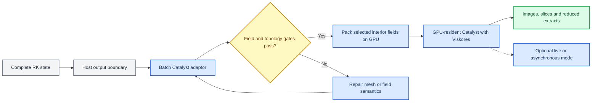

# ASTR GPU Current Status and Next Targets

更新日期：2026-09-22。当前代码基线：`feature/gpu_dev` 当前工作树。

## 1. 总体结论

ASTR 已从单卡 TGV CUDA 验证程序推进为支持规则网格、静态曲线网格、
多 MPI rank、显式激波格式和多类物理边界的非反应流 GPU 求解框架。
当前最成熟的是 CPU/GPU 数值等价性、固定 halo 的多 rank 正确性、静态
单块曲线网格以及主计算循环变量常驻。P1 TGV、P2 激波路径和 P3
HaloTransport 本机性能阶段已经收口，OpenSBLI 参考边界和 restart 已接通，
GPU 常驻动态时序入口已完成 D0 至 D2 数值接入和阶段一致性闭环。紧凑 GPU
在线生产统计 D4 已完成软件与数值验收。五组分双温空气化学已完成 C0 固定模型、
C1 CPU FP64 零维 ROS-2 oracle、C2 GPU 批量瞬时源项/Jacobian 和 C3 GPU
单元局部 ROS-2。C4 已完成运行时 `lcomb` 激活、`numq=11` 权威状态、无反应
五组分/振动能对流扩散以及固定 halo 的 GPU 常驻接入。C5 第 1 至 5 项已完成：
周期均匀反应器、冻结化学准一维组分平移/扩散层/振动能脉冲、Cartesian 正常
激波后有限速率松弛、三维多 rank 挤出和高温周期反应 TGV 均已通过。
A800 单节点 `512^3` TGV 五轮强扩展已完成：4 张 A800 相对单卡达到
`3.777x` 加速和 `94.43%` 并行效率，CUDA-aware MPI 已在记录的 HPC-X/UCX
软件栈上完成正确性、内存安全和周期 TGV 性能准入。C5 第 6 项
已接入 HTR Mach 6 五组分剖面、完整 air5 边界模块和 `air5hbl` CPU/GPU 路由，
首次 A0 运行发现的痕量组分负值已经通过离散非催化壁面通量闭合修复。NP=1、
NP=2 三种 slab 和 NP=8 `2x2x2` 的短时 CPU/GPU、边界合同及内存安全门槛均
通过。`q(1:11)` 的选择性局部 Lax--Friedrichs/MP7 数值核心及周期 NP=1、
NP=2 x-slab 激波管短步门槛已经通过。捕获型 Mach 8 反应正常激波已接入完整
上游状态入口、下游 ghost 外推和 y/z 周期边界，耦合化学的 NP=1 与 NP=2
`2x1x1` 一个完整时间步门槛通过。独立有限速率双温平板推进器的正性、流向
步长、17/33/65 点法向网格及累计推进门槛已通过；ASTR CPU/GPU 同站位平板
物理对比仍因限制器耗散保持未关闭。正常激波稳态松弛、扩散、长时收敛、
内存安全和有限速率空气 SBLI 尚未完成。

当前交付范围应表述为“ASTR 单组分非反应显式格式 GPU 求解器，加固定五组分
双温空气的 GPU 常驻输运、单元局部 ROS-2、Cartesian 激波后松弛和高温周期
三维 Strang 反应耦合”。
该能力尚不能称为通用反应流求解器。生产级
SBLI 物理验证、A800 非周期算例与多节点性能、真实湍流入口和通用曲线
特征边界尚未闭合。
在暂缓能力重新打开并通过独立验收前，不使用“整个 ASTR 已完成 GPU 移植”
的结论。

性能测量归属于各专项报告记录的冻结二进制。不得把本状态文档的提交哈希
重新标注为历史性能结果的执行版本。

## 2. Git 与架构基线

按项目此前约定，以 `df1961bc` 的父提交作为纯 CPU 基线。到当前提交共形成
65 个后续提交，tracked 变更覆盖 660 个文件。该文件数包含源码、验证工具、
参考数据和文档，不表示 660 个独立 GPU 功能。

主要提交阶段如下。

| 提交范围 | 主要进展 |
|---|---|
| `df1961b` 至 `451fe0e` | TGV 多 rank、2dvort、HIT、Channel 和墙面边界 |
| `a684edb` 至 `aecb18f` | LDC、RTI、显式激波格式、HBL、选择性 Roe 和 NSCBC |
| `63fe7a8` 至 `5a800c7` | 静态三维曲线网格 CURVE-C0 至 C21 收口 |
| `30a5f4d` 至 `547a398` | SBLI 路径和 P1/P2/P3 性能优化 |
| `c31840e` | OpenSBLI checkpoint restart 工作流 |
| `9fad55b` 至 `e73bcd9` | 混合马赫数入口、常驻动态入口和 A800 TGV campaign |

当前架构保持以下边界。

- 顶层 `CMakeLists.txt` 是统一 CPU/GPU 构建入口。
- `ASTR_WITH_CUDA` 决定 binary 是否包含 CUDA backend，`use_gpu` 仍由输入文件
  在运行时选择 CPU 或 GPU 路径。
- CPU 负责输入、分区、网格和初场、外层 step、controller 及文件生命周期。
- `src/` 通过窄 facade 调用 `src_gpu/`，CUDA kernel 和 device 数据所有权集中在
  GPU backend。
- HDF5、checkpoint 和完整场输出保持 CPU-owned；输出边界的完整 D2H 不属于
  计算循环常驻失败。
- 当前 backend 是 CUDA Fortran。HIP/DCU 仍是目标架构，不是已实现能力。
- 固定 air5 化学后端由默认关闭的 `ASTR_WITH_AIR5_CHEMISTRY` 控制，与旧
  Cantera `CHEMISTRY/COMB` 路径互斥；C2 瞬时源项和 C3 ROS-2 已在 GPU 独立
  执行；C4 已把 `numq=11` 权威状态、转换、无反应对流扩散和 halo 接入设备
  常驻 CFD 主循环。

## 3. 已完成的 GPU 能力

### 3.1 数值方法

| 类别 | 已验证 GPU 能力 |
|---|---|
| 时间推进 | 三阶段三阶 Runge-Kutta |
| 中心格式 | 六阶显式中心差分及黏性扩散 |
| 滤波 | 十阶显式中心滤波及物理边界闭合 |
| 迎风格式 | 一阶 Steger-Warming、WENO7、MP7 |
| 激波处理 | Ducros 传感器、激波区域选择性 Roe 特征空间 MP7 |
| 物性 | 单组分理想气体、Sutherland 变黏性 |
| 源项 | Channel 固定驱动力、RTI 重力及独立 air5 批量瞬时化学源项/ROS-2 |
| Sponge | 受限 x-max `layer` sponge |
| 网格 | Cartesian 网格和静态单块三维结构化曲线网格 |

不支持紧致差分、紧致滤波、三对角或五对角矩阵求解。GPU 当前只准入 RK3；
CPU 已有的 RK4 不属于当前 GPU 合同。

### 3.2 已验证算例

| 算例类别 | 当前状态 |
|---|---|
| Taylor-Green Vortex | 周期、扩散、滤波、统计量和多 rank 已验证 |
| 三维挤出 Vortex Transport | 显式周期路径已验证 |
| HIT | 确定性随机初场、周期路径和多 rank 已验证 |
| Channel flow | 固定驱动力、壁面、扩散和 100-step 多 rank 统计量已验证 |
| Lid-Driven Cavity | 强制三维显式版本及多轴物理边界滤波已验证 |
| Rayleigh-Taylor Instability | 显式三维版本、重力源项和多 rank 已验证 |
| Sod、Shu-Osher | WENO7、MP7、Ducros 和选择性 Roe 路径已验证 |
| OpenShock | 受限开放边界、NSCBC 和 sponge 路径已验证 |
| 平板边界层和高速边界层 | Mach 3/5、Sutherland、相似解入口和曲线网格已验证 |
| 受控 SBLI | 人工压缩入口、激波传感器和选择性 Roe 耦合已验证 |
| OpenSBLI Katzer 层流 SBLI | `609x255x9` 输入、专用边界、NP=2 长跑和 step 60000 restart 已接通；外部物理验证未完成 |
| 动态入口 BL | 四切片三次插值、D2 restart 组合及逐 RK 级 NP=1/4 数值对比已通过；真实湍流入口尚未建立 |

这里的“已验证”主要指 CPU/GPU 数值等价、边界不变量和内存安全通过，
不等同于每个算例都已完成实验或 DNS 数据库级物理验证。

### 3.3 MPI 和变量常驻

- 已覆盖 NP=1、NP=2 三种 slab、NP=4 三种 plane 和 NP=8 `2x2x2`。
- TGV 已进行 NP=16 和 NP=32 的双卡共享正确性 smoke test。
- 生产目标仍是一 MPI rank 对应一 GPU。双卡 rank oversubscription 不能作为
  四卡或八卡扩展性能证据。
- 无输出 RK 区间内，主流场、守恒变量、RHS、通量、滤波工作区、曲线度量和
  激波传感器常驻 GPU。
- solution `q` 的有效外 halo 是 `hm`，但 qswap-compatible packet 为 `hm+1`，
  用于重复接口面平均；滤波、扩散和传感器 raw field 固定交换 `hm`，不平均
  接口面。
- HaloTransport 默认采用 pageable host-staged blocking；保留可选 pinned blocking，
  pinned-overlap、pinned-pipeline，以及在已准入 A800 MPI/UCX 栈上的可选
  device-aware 后端。
- 早期 host-staged 独立 nonblocking 候选因端到端收益不足被拒绝。当前
  device-aware 后端使用配对非阻塞 device-buffer MPI，并已通过 A800 大消息、
  求解器统计量和 sanitizer 门槛；其他 MPI 栈仍需各自准入。
- 统计量在 GPU 完成归约，只向主机返回少量标量。
- HDF5、checkpoint 和完整场输出仍由 CPU 负责，不属于当前 GPU 化范围。
- 默认正确性路径保持每个 CUDA kernel 后显式同步。

### 3.4 动态时序入口

当前 `bctype=11,turbinf=intp` 路径已经实现：

- x-min 物理边界 rank 常驻四个五变量 y-z 切片；
- 每个 RK 子步在 GPU 上使用与 CPU 相同的均匀时间间隔三次插值；
- 跨时间窗时只读取并 H2D 上传被替换的一个二维切片；
- 静态 `turbinf=prof` 与动态 `turbinf=intp` 使用独立 kernel；
- NP=1、NP=2 x/y/z slab、NP=4 `4x1x1` 和 `2x2x1` 数值门槛通过；
- 最大 primitive 和 conservative 误差分别为约 `7.11e-15` 和 `1.78e-14`；
- NP=1 Compute Sanitizer 报告零错误。

动态入口 D2 已增加非多项式时间序列，覆盖切片节点、跨切片和单步跨多个切片，
并覆盖 NP=4 `2x2x1`、CURVE 和十阶显式滤波组合。CPU/GPU 连续路径及共享
CPU checkpoint 重启路径的 complete-RK 守恒量最大绝对误差约为 `2e-14`。
逐 RK 级验证比较 `pre_rhs` 和 `post_update`：NP=1 的 6 份快照以及 NP=4 的
24 份逐 rank 快照全部通过，最大绝对误差均为
`1.4210854715202004e-14`。

上游 checkpoint 保存 primitive 场和辅助时间状态，不序列化完整 `q`/halo
内存状态。无滤波路径的连续/重启严格等价达到约 `1e-14`；显式滤波路径不把
连续/重启差异作为 GPU 缺陷，而是用同一 CPU checkpoint 分别重启 CPU/GPU，
比较相同重建阶段。该门槛已经通过。GPU 前驱现可按 `lwslic/feqslice`
在切片时刻将完整 RK 原始量同步到主机，并写出绝对 `u1/u2/u3/p/t` 切片；
GPU 路径明确省略未同步的导数字段，CPU 原有完整切片格式不变。真实湍流入口
统计仍属于 D3，尚未完成。

### 3.5 固定 air5 化学、多组分输运与首个耦合门槛

- C0/C1 CPU 基线包含五组分十二反应双温模型、完整总能量闭合、解析 Jacobian、
  固定 `6x6` LU、KPP ROS-2 `2(1)` 和独立 SciPy Radau oracle；
- C2 增加四个独立 CUDA Fortran 模块，在一个线程内完成一个状态的 FP64
  热力学反演、化学/V-T 源项、十二反应进度率和解析 Jacobian；
- 批量 launcher 只接收 device 数组，输出独立 workspace，不更新输入状态，
  `q5` 与总能量化学源项保持为零；
- 单状态及十四状态批量矩阵的源项、反应速率、Jacobian 最大门槛比分别为
  `1.88e-2`、`1.40e-2`、`4.88e-4`，状态码无差异；
- `200/10000 K`、`1e2/1e7 Pa`、负组分和 NaN 均与 CPU 一致地 fail closed；
- Compute Sanitizer 为 `0 errors`、`0 bytes leaked`，组合测试为
  `52 passed, 18 subtests passed`；
- C3 增加 GPU 缩放部分主元固定 `6x6` LU 和一线程一状态的自适应 KPP ROS-2；
- 三种源项模式的 CPU/GPU 终态最大门槛比为 `2.76e-4`，所有接受/拒绝次数、
  RHS/Jacobian 次数和状态码一致，组合测试增至 `58 passed, 18 subtests passed`；
- 8192 状态画像的接受/拒绝范围为 `1..15/0..2`。本机 Nsight Compute 测得
  156 registers/thread、25% 理论 occupancy、12.4% 实测 occupancy，并确认
  大量 local-memory 访问，后续优化必须以该正确性基线为对照。
- C4 增加统一 air5 状态下标和运行时布局门禁。`lcomb=t` 只接受五组分、
  无湍流模型和关闭滤波的组合，并在校验后设置 `num_modequ=1,numq=11`；
  `lcomb` 在输入后向所有 MPI rank 广播；
- `q(1:11)`、原始量和输运物性在 GPU 常驻，对流、六阶显式黏性/热/组分扩散
  以及 `hm` halo 均覆盖五个组分和振动能；
- 均匀组分 TGV 在 NP=1、NP=2 三种 slab 和 NP=8 `2x2x2` 下通过逐 RK
  CPU/GPU 场比较，最大绝对差为 `4.44e-15/3.55e-15`。NP=1 十步全局质量、
  总能量和 N/O 元素最大相对漂移为 `7.37e-14`；
- 非均匀 `air5wave` 使用零速度、恒温恒压和三向 N2/O2 正弦扰动。一个 RK
  步后密度加权 N2 方差相对下降 `3.3721e-6`，组分均值相对变化不超过
  `1.46e-16`。该门槛在 NP=1、NP=2 三种 slab 和 NP=8 `2x2x2` 上均通过；
- 该独立门槛发现并修正了组分扩散 RHS 的共享符号错误：物理通量
  `Js=-rho*Ds*grad(Ys)` 的散度应以负号装入组分守恒方程。仅依赖 CPU/GPU
  等价和全局守恒无法发现这类共享实现错误；
- NP=2/3 的 pageable、pinned 和 pinned-overlap 生产 halo 合约精确通过；
  Compute Sanitizer 为 `0 errors` 和 `0 bytes leaked`；组合测试为
  `80 passed, 18 subtests passed`。
- C5 新增 `air5reactor`，只对该 flowtype 启用
  `chemistry(dt/2) -> transport(dt) -> chemistry(dt/2)`，因此 C4 的 TGV 和
  `air5wave` 继续保持冻结化学；
- 化学 kernel 只更新 `is:ie,js:je,ks:ke`。第一半步后交换 `q(1:11)` 并重建
  halo primitive，第二半步只更新活动域并延迟 halo 交换；
- NP=1 和 NP=2 x/y/z slab 均通过。最大 CPU/GPU 同相位场差为 `1.36e-12`，
  空间输运漂移为 `2.27e-13`，`q(1:5)` 在化学半步中精确不变，N/O 元素相对
  变化不超过 `7.77e-16`；
- C5 coupling kernel 从 C4 传输文件独立出来，避免 512 线程方向 kernel 的
  128-register 上限限制 ROS-2 调用链。NP=1 Compute Sanitizer 为
  `0 errors` 和 `0 bytes leaked`。
- C5 第 2 项新增三个冻结化学准一维合同。周期组分波与 Fourier 平移解比较；
  固定 N/O/NO 背景上的 N2/O2 扩散层检查五组分 RHS 和非零修正速度；振动能
  脉冲检查 `q5-Ev` 不变量和方差衰减。NP=1 与 NP=2 x/y/z slab 全部通过，
  最大 CPU/GPU 场差为 `1.1642e-10`，最大守恒相对漂移为 `1.8176e-13`；
  扩散层修正速度峰值为 `3.5471e-3`，五个组分 RHS 均非零；
- C5 第 2 项扩散层的隔离 Compute Sanitizer 为 `0 errors`。该次未启用完整泄漏
  检查，因此不对泄漏字节数作结论；
- C0 至 C5 第 2 项的 chemistry 单元、probe 和静态合约矩阵为
  `92 passed, 18 subtests passed`；C4 `air5wave` 冻结化学回归继续通过。

当前已完成 C5 第 1 至 5 项。C5 第 3、4 项以独立稳态一维参考验证
`T1=500 K`、`p1=5 kPa`、`M1=8` 的冻结跳跃及其后 `0.02 m` 化学/V-T 松弛，
同时保持质量、动量和总焓通量。含扩散的 NP=1 和 NP=2 x/y/z slab 均通过，
coupled 模式 CPU/GPU 同相位最大绝对差为 `1.804437488e-9`。C5 第 5 项高温
反应 TGV 的 NP=1、三种 NP=2 slab 和 NP=8 `2x2x2` 也已通过，最大同相位差为
`4.3201e-12`，并确认无输出循环保持 `q(1:11)` 常驻。

C5-6A0 已采用第一内点正组分构造非催化等温壁面，并在 Cartesian y 法向扩散
算子中显式令 `J_s,n=0`。NP=1、NP=2 三种 slab 和 NP=8 `2x2x2` 短时门槛的
CPU/GPU 最大绝对差为 `1.7462e-10` 至 `4.6566e-10`；最大组分质量闭合误差为
`4.4409e-16`，最大元素相对变化为 `4.1534e-16`。Compute Sanitizer 为
`0 errors`、`0 bytes leaked`。该结果只关闭 A0 短时 Cartesian 边界、数值等价、
MPI 和内存安全门槛，不代表 A1 双温物理验证、长时收敛、restart 或 SBLI 已完成。

## 4. 边界条件支持范围

| `bctype` | 当前 GPU 支持范围 |
|---:|---|
| `1` | x/y/z 周期边界 |
| `11` | x-min 给定入口，完整更新 `rho/u/v/w/p/T/q`；支持静态和受控动态入口 |
| `12` | 受限 x-min 特征入口，仅用于已验证组合 |
| `21` | 当前主要支持轴对齐 x-max 出口；非轴对齐曲面主动拒绝 |
| `22` | 受限 Cartesian NSCBC 出口；非正交曲线网格主动拒绝 |
| `31` | RTI 使用的固定边界 |
| `41` | 曲线六面零吹吸静温无滑移壁面；另支持 y-min 物理法向吹吸 |
| `42` | 曲线 x/y 绝热无滑移壁面；z 向因 CPU 无分支而拒绝 |
| `411/421` | y 向滑移/无滑移组合，速度按局部几何法向投影 |
| `50` | 曲线六面零外推 |
| `51` | 受限轴对齐远场组合 |
| `52` | 受限 upper-y NSCBC 远场组合、五方程常数目标模式，以及静态曲面无黏源项平衡非反射模式 |
| `60` | 曲线六面对称，速度投影到局部切平面 |

当前不能宣称任意曲线 NSCBC、任意方向开放边界或缺失 CPU 分支的 GPU 支持。
受支持组合和拒绝条件记录在
`documents/ASTR_CURVILINEAR_GPU_COMPLETENESS_PLAN.md`。

## 5. 静态曲线网格状态

CURVE-C0 至 C21 已完成以下能力：

1. 周期曲线度量、自由流保持和解析度量收敛。
2. 曲线网格显式对流、扩散、滤波及统计量。
3. 曲线物理壁面的几何投影和 y-min 法向吹吸。
4. Ducros、选择性 Roe、Sutherland、NSCBC 和 x-max sponge 的受控组合。
5. 三网格、两时间步 Mach 5 层流边界层物理一致性验证。
6. 开放边界能力盘点以及未支持组合的 CUDA 启动前拒绝。
7. 使用同一组 CPU/GPU 二进制完成支持矩阵、拒绝项、三方向内存检查和
   大网格常驻审计。

CURVE-C21 共执行 23 个聚合阶段，全部通过。136 份逐场报告中的最大误差为
`q5=6.2527760746888816e-13`，128 份统计量报告中的最大误差为
`massflux=2.5093260802577788e-11`，必需边界不变量的最大残差为
`7.6170181273482740e-12`。70 项有限场检查全部通过，最小数值 Jacobian 为
`2.5296638468231652e-7`。x/y/z Compute Sanitizer 均报告零错误。

该结论限定为静态、单块、三维结构化曲线网格。多块网格、非共形接口、
动网格、ALE/GCL 和浸入边界不在当前完成范围。

CURVE-C22 新增 `ASTR_NSCBC_FARFIELD_MODE=nonreflecting`。该模式在曲面
upper-y `bctype=52` 上采用局部 eta 法向，并在特征空间令传入波抵消度量项和
横向通量源项。它不使用远场目标状态、经验松弛长度、边界 Mach 归约或旧式
x/z 边界面滤波。三网格声波反射系数随加密由 `0.01620` 降至 `0.00394`，
且小于匹配 compatibility 对照的四分之一。NP=1/2/4/8 八种拓扑全部通过，
最大 CPU/GPU 最终场差为 `2.21e-13`；NP=1/2 memcheck 为零错误。当前结论仍
限于无黏、五方程、静态单块曲面上边界，不代表完整 Navier-Stokes GCBC。

CURVE-C23 在相同 upper-y `bctype=52` 合同上加入六阶显式黏性残差的传入
特征源项修正。CPU 仅保存扩散前的五分量边界 RHS，GPU 使用常驻设备端面
缓冲区；扩散后由 RHS 差值得到离散黏性贡献，并沿 CURVE-C22 的局部 eta
特征基只扣除传入分量。十步均匀流最大 CPU/GPU 场差为 `7.99e-15`，Mach 5
曲线 HBL 二十步最大场差为 `T=5.06262e-14`，八种 NP=1/2/4/8 拓扑均通过。
NP=1/2 内存检查为零错误；两步 profile 中 capture/correction 各执行六次，
计算循环内无大于或等于 64 KiB 的场传输。该结论仍只覆盖静态单块、单组分、
五方程和 upper-y 面，不代表通用完整黏性开放边界。
黏性声学三网格 `64x48x64`、`80x60x80` 和 `96x72x96` 的 CPU 反射系数为
`0.01499173359`、`0.005955882611` 和 `0.003584736637`，随网格加密单调下降；
最大 CPU/GPU 反射差和最终场差分别为 `3.24e-13` 和 `2.13e-13`。

## 6. 性能证据

### 6.1 TGV 单 GPU P1

RTX 4000 Ada 上的 `256^3` FP64 TGV，NP=1、六阶显式中心、十阶显式滤波、
扩散和 RK3 条件下，完整 RK 中位时间从 `0.762855769 s` 降至
`0.580044424 s`，对应时间减少 `23.964%` 和 GPU 内部实现加速 `1.31517x`。
该结果不是相对 CPU 的整体加速比，也不能外推到 A800。

保留优化包括方向遍历、primitive 局部复用、冗余刷新消除和使用
`constdef::num1d60` 的编译期常量乘法。选择性同步把一个 profile 区间的同步
次数从 275 降至 15，但完整 RK 没有收益，因此显式同步仍为默认。

### 6.2 历史 Channel CPU/GPU 对比

`128^3` channel、`maxstep=100`、无场输出测试，以 NP=1 CPU 为统一基线，
历史 GPU 整体加速比约为 `28.7x` 至 `43.1x`。该结果来自早期工作站测试，
应作为历史性能证据，而不是当前最终基准。

### 6.3 CURVE-C21 双 GPU 扩展复测

| 配置 | 中位 wall time |
|---|---:|
| NP=1，单 GPU | `58.490 s` |
| NP=2，双 GPU x-slab | `38.989 s` |

- 双 GPU相对单 GPU加速比为 `1.5002x`，并行效率为 `75.01%`。
- GPU 利用率达到 100%。
- 无输出 RK 区间没有大于或等于 64 KiB 的完整场传输。
- NP=1/NP=2 峰值设备内存约为 `9876/5573 MiB`。

该测试证明当前曲线高速边界层路径实现了变量常驻和有效双卡扩展，
但不是相对 CPU 的统一性能基准，也不能外推到四卡或八卡。

### 6.4 P2 激波和 SBLI 专项优化

在 RTX 4000 Ada 本机冻结基线上，最终保留的 P2-1B 物理通量复用使
Shu-Osher `256x64x32` 和受控 SBLI `256x192x32` 的完整 RK 中位时间相对
P2-0 分别减少 `27.234%` 和 `48.910%`。这些结果是 GPU 内部实现优化，
不是相对 CPU 的整体加速比，也不代表 OpenSBLI 的物理验证。

### 6.5 P3 HaloTransport 本机收口

- NP=2 双物理 GPU 的九个正式组合中，pinned 相对 pageable 的完整 RK 时间
  减少 `2.829%` 至 `23.728%`。
- TGV x/y/z slab 的 pinned-overlap 相对配对 pinned 增量分别为
  `2.616%/3.085%/2.944%`。
- pageable blocking 保持默认可移植基线；pinned 和周期 diffusion overlap
  为可选后端。
- 该结论仅覆盖本机双 GPU host-staged 路径，不外推到 A800、多节点或
  CUDA-aware MPI。

### 6.6 A800 campaign

TGV-only campaign 于 2026-09-08 提交为 Slurm job `451398`。该作业随后在
`gpu01` 的首个计算节点预检中因缺少 `libsz.so.2` 失败，没有产生 A800 runtime
evidence。任务仍包含 A800 CFL/显存预检、`256^3` CPU/GPU 基线、`512^3`
NP=1/2/4 强扩展、pageable 对照、NP=4 NSYS 和分段推进到约 `t=20` 的生产计算。
作业脚本已新增计算节点 `ldd` 门槛和 host-staged MPI 固定配置；重新提交前仍需
提供自包含的 HDF5/SZIP 运行时依赖。

## 7. 显式滤波工作区策略

### 7.1 当前默认：完整五变量 ping-pong

当前已验证实现分配
`qwork_d(-hm:im+hm,-hm:jm+hm,-hm:km+hm,1:numq)`。对 `numq=5`，每次
完整滤波按以下顺序执行：

```text
q_d     --x filter--> qwork_d
qwork_d --y filter--> q_d
q_d     --z filter--> qwork_d
qwork_d --copy------> q_d
```

每个方向之间执行对应 raw halo 更新并显式同步。该实现一次处理五个守恒变量，
kernel 和 MPI 启动次数较少，已覆盖 TGV、Channel、LDC、RTI、物理边界和 CURVE
回归，因此继续作为默认和发布基线。

设本 rank 含 halo 的三维点数为

```text
Nlocal = (im + 2*hm + 1) * (jm + 2*hm + 1) * (km + 2*hm + 1)
```

则 FP64 完整 `qwork_d` 占用约为 `5*8*Nlocal` 字节。

### 7.2 已实现候选：单分量三维工作数组

已新增一个可选低显存实现，保留现有完整 `qwork_d` 路径，不直接替换。候选只
分配 `filter_work_d(-hm:im+hm,-hm:jm+hm,-hm:km+hm)`，依次处理
`m=1,...,5`：

```text
exchange all q_d components x-filter halo once
for m = 1, 5
  q_d(:,:,:,m)  --x filter--> filter_work_d
  exchange filter_work_d y halo
  filter_work_d --y filter--> q_d(:,:,:,m)
  exchange q_d(:,:,:,m) z halo
  q_d(:,:,:,m)  --z filter--> filter_work_d
  filter_work_d --copy------> q_d(:,:,:,m)
end for
```

十阶中心系数、`0-6-6-6-8-10` 物理边界闭合、x/y/z 顺序、`hm` raw halo
语义和每个 kernel 后显式同步均不得改变。不同守恒变量之间没有 stencil 数据
依赖，因此按变量串行处理在数学上可保持当前分离滤波算子。运行时通过
`ASTR_GPU_FILTER_WORKSPACE=scalar` 启用；缺省值 `full` 保持原路径。

单分量工作区占用约为 `8*Nlocal` 字节，即当前 `qwork_d` 的 20%，工作区显存
减少 80%。对 NP=1、`512^3`、`hm=5` 的近似分配，完整工作区约为 `5.3 GiB`，
单分量工作区约为 `1.1 GiB`，可减少约 `4.2 GiB`。

主要代价是五个变量分别启动 kernel 和 halo 通信。在保持显式同步的条件下，
kernel 次数和 MPI 消息数最多接近当前的五倍，虽然传输总字节数近似不变。
因此该方案首先定位为显存不足时的可选模式，不预设其完整 RK 性能优于当前路径。

### 7.3 备选与拒绝方案

| 方案 | 工作区显存 | 主要判断 |
|---|---:|---|
| 完整五变量 `qwork_d` | 100% | 当前默认，验证最完整，启动和通信次数较少 |
| 单分量 `filter_work_d` | 20% | 新增推荐候选，优先保证低显存和数值等价 |
| 2 或 3 分量 chunk | 40% 或 60% | 单分量性能不足时的折中，需要额外 chunk 和尾块验证 |
| 复用完整 `qrhs_d` | 接近零新增体数据 | 生命周期和 NSCBC 边界 RHS 耦合风险高，不作为第一实现 |
| 直接原位或滚动覆盖 | 很低 | CUDA block 间缺少全局同步，会产生新旧 stencil 混读，拒绝 |

单分量实现已输出实际工作区分配字节数。完整 device 内存构成仍需单独审计，
大型 SBLI 的显存瓶颈可能来自通量、梯度或边界辅助数组，不能预设滤波工作区
是唯一主导项。

### 7.4 单分量模式验收门槛

1. 保留完整 `qwork_d` 默认路径和全部现有回归入口。
2. 采用 GPU backend 内部运行时选项选择 `full` 或 `scalar`，默认必须为 `full`。
3. 比较 CPU/full-GPU/scalar-GPU 三方同相位场，不能只比较统计量。
4. 覆盖 TGV NP=1、三种 NP=2 slab、至少一个 NP=4 plane 和 NP=8 `2x2x2`。
5. 覆盖 `41/42` 物理边界、LDC 多轴边界、Channel 和代表性 CURVE 滤波路径。
6. 验证 physical closure、MPI raw halo、有限性、Compute Sanitizer 和无输出常驻。
7. 实测工作区字节数至少减少 75%，并分别报告 kernel/MPI 次数和完整 RK 时间。
8. 即使数值门槛通过，只有完整 RK 性能达到单独定义的生产门槛后，才允许将
   scalar 模式用于常规生产；不得据低显存结果替换默认 full 模式。

### 7.5 2026-09-10 单分量实现证据

- NVHPC 26.1 CUDA 编译通过。
- NP=1 TGV 1/10 step 的 CPU/GPU 统计量和逐场比较通过；10 step 守恒量
  最大绝对差为 `2.84e-13`。
- NP=1 full-GPU/scalar-GPU 在 1 step 后逐场按零容差完全一致。
- NP=2 x/y/z slab、NP=4 `2x2x1` 和 NP=8 `2x2x2` 统计比较通过。
- x/y/z 三方向 `bctype=41` 的 `32^3` 一步逐场比较通过。
- `32^3` TGV Compute Sanitizer memcheck 报告零错误。
- LDC 五步、Channel 五步、曲线 `bctype=42` x 壁面 NP=1 和 y 壁面 NP=2
  的滤波加黏性逐场与统计量比较通过。Channel 验证脚本改为使用 CPU 完整 RK
  快照后，scalar 的 `q5 L_inf=4.6185277824406512e-14`。
- `128^3`、`hm=5`、NP=1 的 full/scalar 实测工作区分别为
  `107,424,760/21,484,952` bytes，减少 `80%`。
- 本地 `128^3`、NP=1、显式同步五轮完整 RK 中位时间为 full
  `0.081408774 s`、scalar `0.078219996 s`，scalar 在 RTX 4000 Ada 上快
  `3.916%`；采样进程峰值显存从 `1686 MiB` 降至 `1604 MiB`。
- `64^3` 两个推进步的 NSYS 进程级计数为 full/scalar kernel
  `188/332`、MPI `262/262`。这说明 scalar 增加 kernel 启动数；NP=1 的总 MPI
  调用数未增加，不能据此外推多 rank halo 消息成本。

当前结论是 scalar 已完成本机正确性、显存、性能和代表性物理边界准入。
`full` 继续作为默认和生产基线；A800 的 full/scalar 实测、`512^3` 显存余量和
分段重启尚未完成，因此不能把本机收益写成 A800 或生产结论。

## 8. 后续目标

### 8.1 A800 四卡真实性能与扩展

周期 TGV 单节点性能矩阵已完成。作业 `460455` 在同一冻结输入和软件栈下完成
19/19 个配置，包括 NP=1、NP=2 三种 slab、NP=4 六种 slab/plane 拓扑和 9 组
pinned-pipeline/device-aware 配对。每个配置包含 5 次独立启动和每次 20 个
保留 RK 样本。NP=1/2/4 最优完整 RK 时间为
`1.755797618/0.903949536/0.464824389 s`，4 卡强扩展加速为 `3.77734x`，
并行效率为 `94.43%`。

该矩阵已满足周期 TGV 的单节点强扩展性能终止条件。尚未完成的部分必须
分开表述：

- 常规 Nsight Systems 分相仍受平台权限影响，当前主要使用求解器内部计时；
- 约 `t=20` 的长时 TGV 及与 DLR Re=1600 历史的物理统计对比不属于这一短时性能矩阵；
- 多节点通信、非周期算例和完整场 I/O 的端到端时间尚未建立权威包络。

### 8.2 OpenSBLI 层流 SBLI 物理验证

当前采用 OpenSBLI Katzer Mach 2 层流 SBLI 作为公开外部参考。参考输入、
保守边界、度量一致 eps、GPU 主循环和 checkpoint restart 已接通。已有
`609x255x9`、NP=2 续算到 `nstep=325000, t=13000.000000098078`。按局部物理
y 节点重算壁面导数后，ASTR 与公开参考的摩阻峰值尺度误差为 `0.7413%`，
壁压峰值尺度误差为 `0.1511%`，分离长度误差为 `0.0603%`，最大壁压梯度
给出的激波位置同为 `x=130.26315789473685`。

该长跑仍未通过完整物理门槛。`t=12800` 至 `13000` 的摩阻、壁压和分离长度
相对变化分别为 `0.0760%`、`0.00886%` 和 `0.0365%`，均通过原合同冻结的
`1%` 时间门槛。壁面热流同期变化 `2.488%`，相对公开场重构结果的峰值尺度
误差为 `60.6%`；原合同未为热流冻结时间阈值，因此该结果作为明确的 G6
未闭合项，不能事后套用 `1%` 判据。展向周期接缝为零，但去除重复端点后的
最大 z 向非均匀度为 `4.397e-4`，其验收容差也尚未冻结。因此当前只支持
“壁压、摩阻、激波位置和分离区一致”，不支持“热学统计、二维长期保持或
OpenSBLI 物理验证完整通过”。下一步需要：

- 完成至少三套网格和两种时间步验证；
- CPU/GPU 同相位场和统计量满足既定误差阈值；
- 比较激波位置、壁面压力、摩阻、热流和分离长度；
- 输出激波传感器和选择性 Roe 区域的可追溯诊断；
- 检查 restart 接缝、长期 z 向均匀度和传感器 mask；
- 分开陈述数值等价、时间/网格收敛和外部物理一致性。

### 8.3 动态入口 D3 至 D4

D2 已完成。验收脚本分别保留 complete-RK 组合矩阵和逐 RK 级二进制快照矩阵，
并将上游 checkpoint 语义与 GPU 同相位数值门槛分开记录。

1. D3：建立独立 Mach 5 湍流平板前驱，验收 `Re_theta`、`Re_tau`、平均剖面、
   Reynolds 应力、时间相关和周期连续性。
2. D4：在 GPU 常驻累积壁压、摩阻、热流、Favre 平均和 Reynolds 应力，减少
   高频完整三维输出。该项的软件、数值、安全和本机性能门槛已完成。
3. 入口统计通过后，才启动生产级湍流 SBLI；静态平均入口不能承担该物理结论。

D4 采用紧凑 GPU 在线统计作为生产架构。设计合同见
`docs/superpowers/specs/2026-09-10-gpu-compact-production-statistics-design.md`。
CPU 独立参考与 GPU sidecar 在静态/动态 NP=1、z-slab NP=2、过滤曲线网格
NP=4、三维分解 NP=8 和同拓扑 restart 上均通过 `atol=rtol=1e-10`，实际最大
绝对差为 `1.02e-14`。Compute Sanitizer 报告零泄漏、零内存错误和零竞争。
Nsight Systems 在统计核之后未发现超过 64 KiB 的完整场 H2D/D2H 传输。
RTX 4000 Ada 的五轮配对完整步中位时间为关闭统计 `0.075387564 s`、开启统计
`0.075807734 s`，开销 `0.557%`。这些结果完成 D4 本机软件验收，不替代 D3
湍流统计收敛，也不代表 A800 生产性能。

前驱到入口之间新增了显式转换与拒绝层。ASTR `writeslice` 输出绝对
`u1/u2/u3/p/t`，而 `turbinf=intp` 读取相对平均剖面的
`ro/u1/u2/u3/t` 脉动，两者不能直接互用。新工具从 `p,T` 按 EOS 重构密度，
生成时间/展向平均 `inlet.prof` 和五变量脉动切片，并报告 `Re_theta`、
`Re_tau`、质量流量漂移、Favre 应力、时间相关及周期接缝。制造数据的可逆性
和拒绝测试已通过。新增 GPU 输出接线后，本机 `80x48x40`、NP=2 `2x1x1`
五步闭环实际生成 5 个切片，周期接缝误差为零；转换后的四切片窗口又被
`turbinf=intp` GPU 路径读取并完成双卡推进。该结果关闭“前驱输出、转换和入口
消费无法串联”的工程缺口。它只有 5 个时间样本，报告状态为
`diagnostic_only`，不能替代 `Re_theta/Re_tau`、应力剖面和相关衰减的 D3
物理门槛。

### 8.4 性能边界、通信与运行时选项

当前可对外引用的权威性能基线为单节点 `512^3` 周期 TGV。该基线使用
FP64、六阶显式中心差分、十阶显式中心滤波、完整五分量 `qwork_d`、RK3 和
逐 kernel 显式同步。每个配置独立启动 5 次，每次保留 20 个完整 RK 样本；
保留 GPU 紧凑统计量，关闭完整场 HDF5 和 checkpoint 输出。

| GPU 数 | 最优拓扑 | HaloTransport | 完整 RK 时间 | 强扩展加速比 | 并行效率 |
|---:|---|---|---:|---:|---:|
| 1 | `1x1x1` | pinned | `1.755797618 s` | `1.000x` | `100.00%` |
| 2 | `1x1x2` | device-aware | `0.903949536 s` | `1.942x` | `97.12%` |
| 4 | `1x2x2` | device-aware | `0.464824389 s` | `3.777x` | `94.43%` |

同拓扑下，device-aware 相对 pinned-pipeline 将 NP=2 完整 RK 时间降低
`26.395%--26.631%`，将 NP=4 时间降低 `42.798%--44.243%`。这些数字是相对单张
A800 的 GPU 强扩展结果，不是 CPU/GPU 加速比，也不包含完整场文件 I/O。

当前运行时性能选项的准确定位如下。

| 功能 | 运行时选项 | 状态与边界 |
|---|---|---|
| Halo 通信 | `pageable` | 代码默认，兼容性基线 |
| Halo 通信 | `pinned` | 固定注册 host 缓冲，host-staged blocking 基线 |
| Halo 通信 | `pinned-overlap` | 仅已实现的周期存储式扩散内部区重叠，本地增益约 `2.6%--3.1%` |
| Halo 通信 | `pinned-pipeline` | 本地双卡较 pinned 快约 `4%--6%`，A800 上明显慢于 device-aware |
| Halo 通信 | `device-aware` | 记录的 A800 MPI/UCX 栈上的最优路径；其他软件栈必须独立准入 |
| 滤波工作区 | `full` | 五分量 FP64 ping-pong，生产默认 |
| 滤波工作区 | `scalar` | 单个 FP64 三维工作数组逐分量处理；本地完整 RK 快 `3.917%`，采样内存少 `4.864%`，A800 未晋级 |
| 同步 | `explicit` | 逐 kernel 同步，权威正确性和生产基线 |
| 同步 | `selective` | 仅周期 TGV；同步次数显著下降，但未获得整步收益 |
| 同步 | `dependency` | 只能与 pinned-pipeline 配合；局部结果不稳定，未晋级 |
| 上风通量 | `split` | 默认 |
| 上风通量 | `fused` | 周期物理空间 WENO7/MP7 本地整步快约 `30%`，A800、长时和 restart 尚未晋级 |
| 精度 | `fp64` | 唯一生产默认 |
| 精度 | `mixed_workspace` | 只降低一组临时工作区精度；当前仅是受限显存选项 |

因此，当前正式性能报告必须保留 `FP64 + full filter + explicit sync` 的基线语义。
在已准入的 A800 软件栈上可显式选择 `device-aware`，但它不会在未知 MPI 环境中
静默取代代码默认后端。曲线网格、物理边界、激波、动态入口和化学路径的
正确性成果不能直接外推为与周期 TGV 相同的性能包络。

### 8.5 曲线开放边界与 HIP/DCU

- 已完成第一条基于局部物理法向的曲线 upper-y 非反射远场切片。
- 已完成该 upper-y 切片的首个黏性特征源项耦合，保留原六阶显式扩散实现。
- 只有具体算例给出物理法向合同后，才扩展到其他开放面或更一般黏性项。
- 不得把 Cartesian `12/22/51/52` 分支按编号直接推广到任意曲面。
- 先用 backend-neutral facade 和 `ISO_C_BINDING` 验证导数、滤波、halo pack/unpack
  的小型 HIP/DCU 原型，再决定是否建设完整第二 backend。

### 8.6 混合精度 Phase MP

当前生产默认仍为全 FP64。MP1 至 MP3 已实现四个相互排斥的实验候选：周期、物理
空间 `543e` WENO7/MP7 的标量 `flux_work`，显式 `643e` 的诊断导数
`dvel/dtmp`，显式黏性通量 `sigma/qflux`，以及特征界面通量工作区。运行时通过
`ASTR_GPU_MIXED_CANDIDATE=flux|derivative|viscous_flux|characteristic_flux`
选择一组 FP32 工作区；
未设置时保持兼容默认 `flux`。所有 MPI rank 必须选择同一候选。

新增方向采用“FP64 权威状态加可选 FP32 临时工作区”，详细设计见
`docs/superpowers/specs/2026-09-12-gpu-mixed-precision-workspace-design.md`：

- `q_d/qrhs_d/qsave_d`、RK 更新、原始变量、`jacob/dxi`、物理法向始终保持 FP64；
- MPI halo、checkpoint、Roe 特征系、NSCBC/GCBC、CURVE-C23 黏性源项和统计归约
  首阶段保持 FP64；
- 运行时默认 `ASTR_GPU_PRECISION_MODE=fp64`，实验模式为
  `ASTR_GPU_PRECISION_MODE=mixed_workspace`；
- 已实现候选为 `flux_work_d`、`dvel_d/dtmp_d`、`sigma_d/qflux_d` 和
  `flux_characteristic_work_d`，每次只能选择一组；
- `shock_sensor_d`、十阶滤波工作区和化学权威状态保持 FP64。FP32 滤波方案已取消，
  不是当前运行时选项；
- FP16、BF16、TF32 和 Tensor Core 算法重构不属于本阶段。

2026-09-12 本机 MP1 证据如下：

- `32^3`、20 步 WENO7/MP7 的 CPU 与 GPU FP64 最大守恒场差均为
  `2.84e-13`；GPU FP64 与 mixed 的最大 `q5` 差分别为 `8.87e-7` 和
  `1.20e-6`，统计量最大差小于 `3e-11`。
- WENO7 的 NP=2 `2x1x1` 和 NP=4 `2x2x1` 通过，通信仍交换 FP64 halo。
- mixed 路径 Compute Sanitizer 非法访存为零。完整 leak-check 发现统计模块已有
  6 个 `512 B` 退出期未释放临时量，与新工作区调用栈无关，需单独修复。
- `128^3` 每 rank 工作区由 `21,484,952` 降至 `10,742,476` bytes，采样峰值显存
  由 `1578` 降至 `1568 MiB`。
- 五轮配对完整 RK 中位时间为 FP64 `1.219752923 s`、mixed
  `1.224175191 s`。mixed 慢 `0.363%`，没有本地加速证据。

首个候选结论为“可行但不晋级”：保留实验模式用于显存受限场景和 A800 复测，
不替换 FP64 默认。当前证据只覆盖短时光滑周期 TGV，不代表声学、曲线网格、
物理边界、激波、长期统计或生产算例已经通过混合精度验证。

2026-09-12 本机 MP2 证据如下：

- `derivative` 将诊断导数工作区从 FP64 改为 FP32。求解器扩散项不读取该存储，
  而是从 FP64 `vel/tmp` 独立重算梯度；统计核在读取时显式提升到 FP64。
- `viscous_flux` 在 FP64 中计算应力和热流，只将最终 `sigma/qflux` 写入 FP32；
  扩散 RHS 读取时提升到 FP64。FP32 场打包到现有 FP64 MPI 缓冲，接收后再收窄，
  MPI tag、计数、邻居顺序和 halo 载荷语义未改变。
- `derivative` 的 TGV NP=1/2/4 场量无差异，Cartesian/CURVE HBL 的运行时壁面
  统计最大差约 `3.91e-13`，后处理最大差约 `3.70e-15`。Compute Sanitizer
  报告零错误。
- `viscous_flux` 的 10-step TGV 最大守恒场差为 `3.70e-13`，统计量最大差为
  `6.11e-16`；NP=2 `2x1x1` 和 NP=4 `2x2x1` 通过。Cartesian HBL 最大场差
  `4.26e-12`、后处理差 `1.97e-12`；CURVE-C23 均匀场、声学扰动和黏性 HBL
  均通过。Compute Sanitizer 报告零错误。
- `64^3` 五轮交错计时中，`derivative` 的 FP64/候选中位完整 RK 时间为
  `8.706775/8.891394 ms`，候选慢 `2.120%`；工作区字节为
  `26,364,000/13,182,000`。`viscous_flux` 为 `8.736809/9.417326 ms`，候选慢
  `7.789%`；工作区字节为 `30,375,000/15,187,500`。两者均精确节省 50% 的
  对应工作区存储，但当前本地 GPU 没有整步加速证据。

MP2 两个候选均分类为 `local-pass-not-promoted`：保留作显存受限和 A800 复测的
实验选项，不改变 FP64 生产默认，也不允许组合启用。现有短时 HBL 是同相位一致性
检查，不应表述为稳态边界层物理验证。

2026-09-12 本机 MP3-A 数值门槛进展如下：

- `characteristic_flux` 在全周期路径以及严格限定的 S0-B0 x 物理零外推路径准入；
  两者均为无黏、无滤波、五方程单组分 RK3 的 `543e` MP7 特征重构。Roe 平均、特征矩阵、重构代数、Ducros 原始
  传感器、整数 mask、`qrhs_d` 和 RK 状态保持 FP64；仅五分量界面通量最终存储为
  FP32，RHS 读取时提升回 FP64。
- S0-A6 的 NP=1 pilot 按十倍观测误差和 `1-2-5` 上取整冻结场与统计量绝对门槛
  均为 `2e-6`，相对门槛为零。正式 A6 最大场误差为 `1.5973888878306752e-7`，
  最大统计量误差为 `1.0126266403176487e-7`。
- S0-A7/A8/A9 的 x/y/z slab 与 S0-A10 `2x2x2` 均通过同一冻结门槛。四个 MPI
  门槛的 GPU FP64 与候选原始传感器逐点相同，mask mismatch 均为零；最大场误差
  为 `1.8279774849361274e-7`，最大统计量误差为 `1.0126264982091016e-7`。
- A10 的八个 MPI rank 在本地共享两张 GPU，只证明三方向 halo 与分解路径的短时
  正确性，不构成一 rank 一 GPU 的扩展性能证据。
- MP3-XP1 和 MP3-XP2 的 `400x8x8` 三步 S0-B0 门槛保留完整 x 物理面。NP=1 与 NP=2
  `2x1x1` 的最大场误差均为 `1.5973888878306752e-7`，最大统计量误差均为
  `1.0126266403176487e-7`；GPU FP64 与候选 sensor 逐点相同，mask mismatch 为零。
  双 rank memcheck 给出两份 `ERROR SUMMARY: 0 errors`。
- MP3-HBL1 将相同的 FP32 五分量界面通量存储严格扩展到 Cartesian S2-C3 黏性
  HBL 能力：`192x192x8`、两步、`543e/643e`、MP7 特征重构、`diffterm=t`、
  `lfilter=f` 和 `bctype=11/21/41/51/1/1`。冻结门槛为
  `CANDIDATE_FIELD_ATOL=5.0e-07`，统计量和 sensor 绝对门槛为 `1.0e-12`，相对门槛
  均为零。NP=1 与 NP=2 x/y/z slab 的最大场误差为
  `2.0437756598212786e-08`，最大统计量误差为 `1.6875389974302379e-14`；sensor 差为
  零，所有 mask mismatch 计数为零。x/y slab sanitizer 每个均给出两份零错误摘要，
  各拓扑的该工作区存储均精确减少 50%。

MP3-A 的 Compute Sanitizer 报告 `ERROR SUMMARY: 0 errors`。`400x16x16` 五轮
交错计时得到 FP64/候选完整 RK 中位时间 `0.023973636/0.025151473 s`，候选慢
`4.913%`。对应工作区由 `11,984,760` 降至 `5,992,380` bytes，精确节省 50%；
采样峰值显存由 `656` 降至 `650 MiB`，峰值利用率为 `95%/88%`。

据此，MP3-A 的周期路径分类为 `local-pass-not-promoted`，S0-B0 扩展分类为
`x-physical-local-pass-not-promoted`，精确 Cartesian 黏性 HBL 扩展分类为
`hbl-cartesian-local-pass-not-promoted`：本地短时数值、三方向 MPI halo、
非法访存和交错计时流程已经闭合，且具有可核算的工作区显存收益，但没有本地整步
加速证据。精确 HBL 配置之外的物理边界和扩散路径、NSCBC/52、sponge、滤波、
CURVE、OpenSBLI 生产路径、长期 HBL/SBLI 物理统计和化学仍未通过该候选验收，
因此不改变 FP64 生产默认。

周期物理空间上风通量还新增了一个与精度正交的 P2 性能候选。运行时
`ASTR_GPU_FLUX_PAIR_MODE=fused` 将正负 Steger-Warming 重构合并为单个方向核，
共享八个唯一模板点的状态计算；默认 `split` 和原六个分裂核完整保留。该候选不
改变权威 FP64 状态、MPI halo、边界、特征重构、激波、滤波或扩散路径，并继续在
每个 kernel 后显式同步。

2026-09-12 本机 `128^3` WENO7 五轮交错测试中，FP64 完整 RK 中位时间由
`1.219539164 s` 降至 `0.845358029 s`，降低 `30.682%`，对应 `1.44263x`。
WENO7/MP7 最大场差为 `5.68e-14`，NP=2/4 与 memcheck 通过。该路径当前为本地
通过但未晋级的可选优化，仍需 A800 NP=1/2/4、长时 TGV 和 restart 验收。

补充的 `256^3` 五轮交错测试得到 split/fused 中位时间
`8.678503483/6.052904717 s/RK`，离散度 `1.223%/1.136%`，整步降低
`30.254%`，对应 `1.43378x`。FP64 最大 `q5` 差为 `1.14e-13`，统计量一致。
mixed split/fused 的稀疏 FP32 舍入差最大为 `4.20e-9`，两条 mixed 路径各自相对
FP64 的最大 `q5` 差均为 `8.72e-7`，继续满足 MP1 的 `2e-6` 门槛。

性能候选采用宽松保留政策。发现阶段不设固定加速比或显存下降百分比。数值门槛
通过后，只要存在超出测量噪声的可重复正收益、可核算的显存下降、更大可运行网格，
或对未来 HIP/DCU 后端有实际价值，即可保留为实验候选。小幅收益记为“可行但不晋级”，
不直接淘汰。进入生产默认仍需在 A800 NP=1/2/4 上证明整步不退化，并在速度、显存、
问题容量、能耗或可移植性中至少提供一项实测价值。

Phase MP 的当前结论是：MP1 至 MP3 已完成本地受限数值、内存安全和交错计时
门槛；四个候选均精确节省 50% 的对应工作区，但分别慢 `0.363%`、`2.120%`、
`7.789%` 和 `4.913%`，没有整步加速证据。MP4 FP32 滤波不再推进。MP5 仅在明确的
A800 显存容量需求下复测这些候选，不以当前本地结果宣称加速。OpenSBLI 的
FP64 外部物理验证仍是特征通量混合精度进入生产物理算例的前置条件。

### 8.7 固定 air5 化学 C3 至 C6

1. C3：已完成单元局部 GPU ROS-2、解析 Jacobian、固定 `6x6` 线性求解及
   寄存器、local-memory 和子步长尾画像；
2. C4：已完成 `numq=11` 权威状态、设备常驻转换、组分/`Ev` 无反应对流扩散、
   固定 `hm` halo 及非均匀组分波独立扩散门槛；
3. C5：第 1 至 5 项已完成。周期均匀反应器、冻结化学准一维输运、Cartesian
   正常激波后松弛、三维多 rank 挤出和高温反应 TGV 均已通过；高温 TGV
   `12^3` 的 NP=1、三种 NP=2 slab 和 NP=8 `2x2x2` 最大 CPU/GPU 同相位差为
   `4.3201e-12`，Compute Sanitizer 为 `0 errors`，无输出循环无大块场传输；
4. C5 第 6 项：A0 已接入 HTR Mach 6 相似解、非催化等温壁、完整入口/远场/出口
   和 CPU/GPU `air5hbl` 路由；壁面痕量组分的离散零通量问题已修复，NP=1、
   NP=2 三种 slab、NP=8 `2x2x2` 及 Compute Sanitizer 短时门槛通过。B0 已实现
   `q(1:11)` 的 Ducros 选择性分量式 MP7/局部 Lax--Friedrichs 通量，并通过
   周期 NP=1、NP=2 x-slab 激波管短步与内存安全门槛。下一步完成 A1 独立双温
   物理验证，再补正常激波、y/z 分解、物理边界和有限速率空气 SBLI；
5. C6：C5 第 6 项物理门槛通过后，才进入本地与 A800 性能和生产验收。

2026-09-14 的 C5 第 6 项审计已排除两种直接复用：现有五方程固定 `gamma` 的
Roe/MP7 不能处理 `q(1:11)`，HTR 公开 `LaminarSBLI` 的定比热单组分结果也不能
作为固定 air5 oracle。HTR `MultispeciesTBL` 另提供 Mach 6、`450 K`、
`101325 Pa`、`Tw/Tinf=6.5`、`Re_delta*=4000` 的机器可读五组分相似解，可作为
可追溯入口和单温极限，但不能验证独立 `Tv` 方程。NASA Mach 10 平板公开了
`350 K`、`3751 m/s`、`3.55 kPa`、`6.6e6 1/m` 和非催化壁面，但缺少机器可读
双温基流及唯一壁温。HTR 文件已用于完成 C5-6A0 短时门槛；下一步建立独立
FP64 固定 air5 双温平板参考完成 C5-6A1。Ducros 区域内分量式 MP7 加局部
Lax--Friedrichs 的 11 方程数值核心和周期激波管短步门槛已完成，尚需正常激波
松弛、物理边界、多 rank 和有限速率空气 SBLI 验证。

NASA NPARC/WIND Mach 7、15 度高超声速斜坡 Run E 已固定为后续 C5-6B 外部
代码间基准。官方输入、表面温度/压力和出口速度剖面已按 SHA-256 归档，并有
独立读取测试。该官方页面没有解析解或实验对照，且报告认为本工况的高温模型
差异较小，因此它只用于检查激波响应和整体剖面，不作为实验真值，也不替代
C5-6A1 双温平板参考。

A0 已固定 HTR 提交和原始剖面，完成摩尔分数到质量分数重排、ASTR EOS 密度
重建、Fortran 插值、完整 `q(1:11)` 边界及 CPU/GPU 主循环接入。首次
`31x31x7` NP=1 CPU smoke 发现 `Yw=(4Y1-Y2)/3` 对反应后的痕量组分不保持正性，
程序按门禁以 `status=3` 停止。修复采用第一内点正组分作为壁面组成，并在
Cartesian y 法向扩散算子中显式强制 `J_s,n=0`；组分焓和 `Ev` 的物种扩散法向
通量随之为零，温度和 `Tv` 梯度产生的导热通量继续保留。修复后聚焦测试为
`12 passed`，NP=1、NP=2 三种 slab 和 NP=8 `2x2x2` 短时运行全部通过。未来
CURVE 非催化壁面仍需用几何法向投影实现同一物理合同。
该修复没有加入组分裁剪、归一化、限制器或一阶回退。A0 只按上述短时门槛通过，
不能替代 A1 独立双温平板物理验证。

2026-09-19 已建立 A1 的独立 FP64 壁面与剖面诊断基础：从完整 `q(1:11)` 恢复
`u/T/Tv/Ys`，输出 `Cf`、平动与振动导热、组分焓扩散和指定流向站位剖面；快照
支持 `ASTR_VALIDATION_RHS_STEP` 精确步号，并在 GPU 回传前完成门控。默认第 0 步
A0 回归继续通过，CPU/GPU 最大同相位差为 `1.7462298274040222e-10`。

A1 先后暴露两个独立的痕量负值阻塞。`31x31x7` 在第 1 步 RK 运输后，由中心组分
扩散在出口邻近内点产生约 `-2.8925e-21 kg/m3` 的 NO 分密度；共享面扩散限制器
已精确保留原六阶及物理边界闭合，并以一个单元标量系数一致限制全部耦合扩散
通量。扩散修复后，第 185 步 RK1 的六阶中心对流又使近零 NO 的无扩散基线为负。
经人工确认，CPU/GPU 已加入组分专用守恒 FCT：同一高阶密度面通量生成闭合的迎风
组分基线，只限制五组分的反扩散修正；密度、动量、总能和振动能保持原六阶 RHS。
两条路径均不裁剪、不归一化，也不加入人工痕量底数。该段描述的是第一版实现，
现已由下述完整状态 FCT 替代。

NP=1 与 NP=2 `1x2x1` 门槛均通过，对流和扩散限制器的受限点数及最小系数在
CPU/GPU 间逐 stage 一致。原失效算例已通过第 185 步；真实 RK 活动区间最大
CPU/GPU 绝对差为 `3.5763e-7`，最小组分分密度为 `8.4485e-20 kg/m3`，组分
闭合相对误差约 `1e-14`。Compute Sanitizer 为零错误、零泄漏，air5 自动测试为
`112 passed, 9 subtests passed`。当前观察到的正性阻塞已经解除；长时稳定性、
网格/时间步收敛、`Cf`、热流、组分和 `T/Tv` 的独立物理比较仍未完成。

2026-09-20 新增双层验收而不放宽默认判据。`31x31x7`、`dt=1e-9 s`、NP=1
的 20 步短程回归继续使用逐元素 `atol=1e-9, rtol=1e-10` 和 `2e-10` 挤出
阈值，CPU/GPU 挤出误差为 `6.7096e-12/7.1109e-12`，五个同相位快照全部
通过。第 150 步只在显式长期配置下使用
`max(abs(q_gpu-q_cpu)/max(abs(q_cpu),1)) <= 1e-7` 和 `z` 挤出误差
`<=1e-7`；观测值分别为 `8.8715e-8` 和
`4.4148e-8/5.7158e-8`。正性、组分闭合、元素守恒、化学活动和入口/远场/
壁面/出口合同仍独立执行且通过。相同第 150 步快照在默认逐元素门槛下保持失败，
证明两类门槛未混用。该结果属于 150 步有界稳定性证据，误差裕量约 `11%`，不
替代网格/时间步收敛、restart 或独立双温物理验证。

2026-09-21 关闭了第 214 步出现的第三个数值阻塞。旧组分专用 FCT 虽保持五组分
非负，却不能阻止总能更新使平动温度降至 `299.073 K`。当前 CPU/GPU 实现改为
完整 `q(1:11)` 的共享面守恒 FCT：低阶基线采用度量投影 LLF 通量，同一面系数
同时限制 11 个守恒分量；六面凸分解同时约束正密度、非负组分、组分闭合、非负
平移后振动能和 `T >= 300 K`。扩散修正以对流后的完整状态为基线施加相同约束。

同日确认采用无经验参数的正性比例：删除固定 `1-1e-8` 安全系数和
`1024*epsilon` 滤波阈值，线性可行比例只向零方向退一个 FP64 相邻数，完整状态
二分次数由 FP64 有效位数决定。滤波后的组分闭合由基线最大组分承担代数余量，
负候选通过与未滤波正状态作凸组合处理，不使用痕量下限、逐点截零或按组分总和
缩放。GNU CPU、NVHPC CUDA 顶层构建和 air5 聚焦测试通过；`lfilter=f` 两步 HBL
的 CPU/GPU 挤出误差约为 `5.90e-14/5.87e-14`。

2026-09-21 已定位并修复反应流 `lfilter=t` 的短步挤出不变量缺陷。CPU 路径在
`filterq` 和完整状态限制之后只更新了守恒量 `q`，但在进入边界、梯度和 RHS 计算
前没有重建 `rho/vel/prs/tmp/spc/tve`；过期原始变量首先在对流 RHS 中引入 z 向
差异。当前只在 AIR5 组合气体滤波路径中立即调用 `updatefvar`，非反应流滤波语义
不变，GPU 原有的滤波后状态准备流程不变。

修复后的 `31x31x7`、`dt=1e-10 s`、matched 初场严格门槛通过。第 0 步 CPU/GPU
`z` 挤出缩放误差为 `2.88e-15/2.65e-15`，完整 q11 同相位快照最大缩放差为
`1.07e-14`；第 2 步对应值为 `4.58e-14/7.83e-14` 和 `3.64e-13`，均低于
`2e-10` 挤出阈值并满足逐元素 CPU/GPU 门槛。该结果关闭短步时序缺陷，但不替代
反应流滤波的长步、restart、网格/时间步收敛和性能验收。

同一 `31x31x7`、`dt=1e-10 s` matched 初场已在 CPU/GPU 推进至第 220 步。
两端最小温度均为 `441.661 K`，最小组分分密度均为 `7.80938e-61 kg/m3`，组分
闭合相对误差约 `1e-14`。九个同相位快照最大绝对差为 `5.01518e-7`，对应总能量
相对差 `1.72e-13`；最大物理缩放误差为 `9.57e-12`。首步有 480 个近壁点受限，
最小面系数约 `8.07e-4`，因此后续必须量化限制器耗散和性能成本。该结果只关闭
完整状态数值可接受性阻塞，C5-6A1 仍需网格/时间步收敛、长距离平板推进、
`Cf`/热流/剖面、restart 和生产性能验收。

2026-09-22 已修订长时展向门槛而不改变短步严格门槛。长时检查对主变量保留逐点
挤出判据，对 `rho*w` 改用 `max_xy |<rho*w>_z|/(rho_inf*u_inf)`；局部最大值和
RMS 继续作为诊断量。第 9000/12000 步主变量挤出误差为
`9.62e-9/7.35e-9`，展向平均动量比为 `3.95e-18/1.98e-18`，该门槛通过。

物理门槛仍失败。第 12000 步相对独立有限速率参考的 `u/T/Tv/Cf/qw` 误差为
`1.15%/4.41%/5.35%/4.64%/11.24%`。半时间步和 `31x255x7` 壁法向加密均
显示离散变化小于参考偏差；关闭滤波则使 `Cf/qw` 误差扩大到
`21.75%/83.40%`。因此不再把时间步、壁法向网格或滤波作为首要原因。

CPU/GPU 从同一第 12000 步 checkpoint 进行的约束分解逐项一致。三个 RK stage
的 `3384/2816/3192` 个受限点全部由组分正性触发，密度、振动能和温度约束均未
激活。NO 占大多数受限点，原子 N 决定最小系数约 `0.0411`。当前最可能的问题是
痕量组分正性通过统一系数过度限制全部 11 个守恒量。该解释仍需分层限制器的匹配
实验验证；C5-6A1 不晋级，第三网格和更长生产积分暂停。

2026-09-20 已关闭独立参考的 A1-R0 方程合同：Python FP64 参考固定质量、流向
动量、O2/N/O/NO 四个独立组分、总能量和振动能八个抛物化方程，以主组分 N2
闭合质量，避免由大数相减恢复痕量 NO。参考独立计算状态、流向通量、
壁法向物理通量及有限速率/V-T 源项，并通过质量、N/O 元素、总能量和组分扩散
闭合测试。A1-R0 只固定方程合同，不能写成已完成双温平板物理验证。

同日完成 A1-R1 路线决策并关闭单温 frozen-air5 基线。独立
`air5_hbl_similarity.py` 的 Dorodnitsyn BVP 被确认为权威 R1 参考；其最大边界残差
为 `2.5871e-26`，最大 RMS 方程残差为 `9.9969e-9`，质量、流向动量和完整能量
离散残差通过三网格单调收敛，壁面剪切与导热通量满足 `x^-1/2` 缩放。两种逐站
后向 Euler 候选在非均匀平板上停滞于约 `3.6e-6`，已降级为失败诊断，不再作为
R2/R3 参考。

R2 的 frozen V-T 阶段采用全局 `x-y` 质量流函数配点路线；有限速率阶段采用经批准
的守恒正性隐式逐站路线。无源单温框架采用流向三点、法向五点局部显式差分，并
严格消元入口、壁面和外边界的已知 Dirichlet 自由度。均匀流残差
低于 `1e-12`；冻结组分单温数组通量在 `2e-15` 相对容差内匹配逐点 FP64 oracle。
`3x13`、`3x17` 和 `3x25` 三套非均匀网格均将最大缩放残差收敛至
`2.20e-14` 以下。相对 Dorodnitsyn BVP，流向速度 L2 误差从 `5.149%`、
`4.999%` 降至 `0.880%`，温度误差从 `7.086%`、`3.729%` 降至 `0.996%`。
据此关闭 R2 前的无源单温全局离散门槛。

V-T-only 已完成首个非均匀单网格数值门槛。冻结组分双温三列通量和直接 V-T 源
分别在 `4e-15` 和 `2e-15` 相对容差内匹配通用 FP64 oracle。`3x13` 通过
振动能预测器与 `0/0.1/0.3/0.6/1.0` 源强同伦，在总计 396 次评估后达到
`2.6058e-14` 残差，最大 `|T-Tv|=178.52 K`。`3x17` 也达到
`5.2607e-14`，但需要 1017 次评估且最大温差变为 `262.11 K`，尚未形成三网格
剖面和壁面量收敛证据。

经人工确认改用守恒正性隐式流向推进器后，十二反应有限速率独立参考的数值阻塞
已经解除。四个独立组分使用 `rs=Ys/Y_N2` 非负比值坐标，壁面/外边界自由度精确
消元，五点耦合残差采用 40 色块带状 Jacobian、稀疏 Newton 步和可行域线搜索。
该路径不裁剪、不重归一化，也不设置痕量下限；精确零独立组分仍可表示。非催化
壁面改为与三点单边导数一致的离散零梯度闭合，并新增 `Cf`、平动/振动导热、组分
焓扩散和总热流诊断。

独立有限速率参考现已通过流向 1/2/4 步细化、17/33/65 点壁面加密网格和 33 点
累计 10 个 `1e-5 m` 站的门槛。33/65 点 `Cf` 与总热流相对差为
`1.08e-4/9.48e-4`；累计推进最大残差 `7.42e-11`、组分闭合误差
`2.22e-16`、最大 `|T-Tv|=170.5 K`。A1-R2 独立参考数值基线据此关闭，但
A1-R3 的 ASTR CPU/GPU 同站位剖面、壁面量、restart、长时间和常驻门槛仍未完成，
因此 C5-6A1 整体尚未关闭。

C3 保留一线程一单元的 FP64 正确性基线。当前 profile 已证明存在寄存器和
local-memory 压力，但在 A800 与真实反应状态分布复测前不引入 warp 同步拒绝或分桶。

### 8.8 P4 多 GPU 通信流水线

2026-09-15 已完成周期 TGV x/y/z 单轴及双轴、三轴 `pinned-pipeline` 候选。
默认 `explicit` 和既有三种 halo 后端不变，`dependency` 仍需显式选择。每个活动
轴现拥有独立 stream、event、四个 MPI request、邻居、计数和私有固定 tag。
solution halo 会在等待任一轴前发布所有活动轴的通信，再按 x/y/z 顺序 unpack，
以保持 CPU 的共享面和边棱覆盖语义。

完整五变量 filter 因三方向 ping-pong 数据依赖仍按轴顺序执行。融合 diffusion
已遍历所有活动轴，并将 `sigma(1:6)` 与 `qflux(1:3)` 合成九变量 halo；当前只在
首个轴的通信期间执行一次内部 RHS，其他轴仍串行完成。普通后端保持六分量缓冲，
pipeline 只为活动 MPI 轴分配九分量容量。

Nsight Systems 的 `256^3`、NP=2、`2x1x1` 三步 trace 显示，D2H/H2D 调用由
`168/506` 降至 `132/470`。原 diffusion 部分的 `72` 次阻塞 `MPI_Sendrecv`
变为 `36` 次非阻塞成对事务。首个事务中约 `16.4 ms` 内点 kernel 完整位于
通信活跃窗口。五轮完整 RK 中位时间为 `0.509744836 s`，相对 pinned 基线
`0.529989956 s` 降低 `3.820%`，相对 P4-0 pageable x-slab 降低 `16.944%`；
五轮相对极差为 `0.815%`。相对 P4-0 NP=1 GPU，当前本地加速比为 `1.1692x`，
并行效率为 `58.46%`，尚未达到 A800 `70%` 验收目标。

`128^3`、NP=2 的 x/y/z 1/10/100 步，以及 NP=4 `2x2x1`、NP=8 `2x2x2`
的 1/10/100 步 CPU/GPU 门槛全部通过。多轴 100 步最大守恒场差分别为
`7.1054e-13` 和 `7.6739e-13`。NP=2/3 生产 halo 合约精确覆盖三轴周期邻居和
物理端点；双 context 合约确认多个轴的 MPI 已同时处于 active 状态。
NP=4 完整求解器的四 rank full leak-check 均为 `0 errors`、`0 bytes leaked`，
racecheck 均为 `0 errors, 0 warnings`。该结果属于周期 TGV 数值正确性与并发安全
证据，不覆盖物理边界、CURVE、激波和 chemistry 的异步化。

系统重启后的同一时段 `256^3` 五轮配对中，y-slab 的 pinned/pipeline 中位时间
为 `0.510051923/0.479824547 s/RK`，降低 `5.926%`；z-slab 为
`0.508967702/0.478513546 s/RK`，降低 `5.984%`。四组相对极差均不超过
`1.057%`，候选显存仅增加 `32--33 MiB`。y/z pipeline 因此保留为本地和不支持
CUDA-aware MPI 环境的 opt-in 候选。A800 五轮配对已确认 device-aware 在 NP=2/4
上明显优于 pinned-pipeline，因此不再将 host-staged pipeline 作为该软件栈的首选路径。

2026-09-15 的同步审计为 pipeline 增加默认流 source-ready event，并让通信流和
独立计算流显式等待；solution halo 内的 RHS 清零也等待该 event，避免与上一
RK stage 读取 `qrhs_d` 的更新 kernel 形成潜在跨流竞争。`dependency` 模式的
三步 trace 将 `cudaDeviceSynchronize` 从 `492` 次降至 `36` 次，减少
`92.683%`，kernel 和 memcpy 次数保持不变。10 步最大守恒场差仍为
`3.1264e-13`，双 rank memcheck 和 racecheck 均为零错误。

同机同时段五轮 A/B 中，`explicit + pinned-pipeline` 为
`0.628957548 s/RK`，`dependency + pinned-pipeline` 为
`0.641986121 s/RK`，后者慢 `2.071%`。当前 explicit 基线相对历史
`0.509744836 s/RK` 漂移 `23.387%`，所以不使用跨时段绝对值判断同步收益。
全局取消非强制同步目前保留为未晋级 opt-in 候选，生产默认继续使用
`explicit`。将 diffusion 内点计算提前到 D2H wait 前的实验进一步慢
`7.773%`；其 MPI 区间由 `26.685 ms` 增至 `52.080 ms`，该调度已回退。

现有 host halo 缓冲已经一次分配、一次 `cudaHostRegister`、循环复用并在退出时
统一注销，循环中没有 pinned 分配/释放。`MPI_Send_init/MPI_Recv_init` 暂缓，
因为 trace 中非阻塞请求创建不足 `1 ms`，当前 host-staged 瓶颈仍是大消息传输及其
尾部。A800 结果证明直接去除 host staging 的收益远大于进一步减少 MPI 请求创建成本，
因此 `MPI_Send_init/MPI_Recv_init` 不是当前优先项。

每轴 context 重构后，本地双卡 x-slab `256^3` 五轮配对的 pinned explicit、
pipeline explicit 和 pipeline dependency 中位时间分别为 `0.529076911`、
`0.506394356` 和 `0.504894878 s/RK`，相对极差分别为 `0.820%`、`0.763%` 和
`0.336%`。pipeline explicit 相对 pinned 降低 `4.287%`，峰值 GPU 利用率由
`83%` 增至 `92%`。dependency 只比 pipeline explicit 再低 `0.296%`，不足以
晋升默认。本机只有两张 GPU，NP=4/8 共享双卡结果不能用于多轴扩展效率。

### 8.9 A800 CUDA-aware MPI 正确性与性能准入

2026-09-16 完成了可选 `device-aware` HaloTransport。运行时在 `MPI_Init`
前依据节点内 rank 绑定 CUDA 设备，随后用 `MPIX_Query_cuda_support` 做集体
能力检查。能力检查失败会直接终止，不允许通信开始后静默回退。pageable、
pinned、pinned-overlap 和 pinned-pipeline 后端均保留。

当前 solution、完整和单分量 filter、FP64 diffusion、混合存储 diffusion、
shock sensor、sponge、species 和 generic field 均复用已有打包缓冲，直接发送
FP64 device buffer。halo 宽度、变量顺序、tag `21001:21006`、物理端点和 unpack
语义未改变。扩散内部计算回调仍在四个非阻塞 MPI request 存活期间执行。

A800 payload 作业 `460370` 在 HPC-X 2.22.1、Open MPI 4.1.7rc1、UCX 1.18.0
上通过 `nvar=1/3/5/6/9`、宽度 5/6、periodic/`MPI_PROC_NULL`、阻塞/非阻塞
和 Compute Sanitizer 门槛。UCX 协议日志明确记录 `cuda_ipc/cuda`。

求解器作业 `460439` 和 `460441` 使用 `128^3` 周期 TGV、完整十阶滤波、
六阶显式黏性项和显式 kernel 同步，覆盖 NP=2 三种 slab 与 NP=4 三种 plane
分解。每项均推进 5 步，pinned 与 device-aware 的时间、动能、拟涡能和耗散率
逐位一致。两项作业分别以 `0:0` 在 27 s 和 32 s 完成；所有拓扑均记录
`cuda_ipc/cuda`，NP=2/4 sanitizer 为零错误，且未生成 grid/flowfield HDF5。

性能作业 `460455` 完成了 `512^3` 周期 TGV 的 19/19 个配置和 9/9 组同拓扑
pinned-pipeline/device-aware 配对。它使用 FP64、完整十阶滤波、显式同步和
紧凑统计量，关闭完整场 HDF5。NP=1 为 `1.755797618 s/RK`；NP=2 最优为
`0.903949536 s/RK`，加速 `1.94236x`，效率 `97.12%`；NP=4 最优为
`0.464824389 s/RK`，加速 `3.77734x`，效率 `94.43%`。同拓扑下 device-aware 比
pinned-pipeline 快 `1.36x--1.79x`。

因此该后端已通过 A800 单节点周期 TGV 的正确性、内存安全和强扩展性能准入，
是同一 MPI/UCX 软件栈上的首选性能路径。代码默认仍为 pageable，因为 device-aware
必须在每个新 MPI 软件栈上重新准入，且能力检查失败时应直接终止而不是通信中途回退。
非周期物理算例、多节点通信和 HIP/DCU 适配仍在该性能结论之外。

2026-09-19 补充了非反应流非周期正确性矩阵。该矩阵使用 NP=2 x/y/z slab，覆盖
3 个 Cartesian 零外推物理面、3 个 CURVE `bctype=41` 曲线壁面、3 个启用
Ducros 传感器和选择性 Roe 特征重构的 HBL 激波项，以及 11 个
`41/42/411/421` wall-family 项。通信后端只注入 GPU 子进程，CPU 路径继续作为
权威参照；每项同时检查统计量、完整 RK 同相位场、后端选择和异常日志，激波项
还检查原始传感器与字节 mask。

本地 RTX/HPC-X 仅准入 `UCX_TLS=self,sm,cuda_copy`，因此 20/20 通过只能证明
无 IPC 的 device-buffer 数值语义。最大统计量、`q5` 和原始传感器差分别为
`7.8159700933611020e-13`、`2.8421709430404007e-13` 和
`1.1102230246251565e-15`，三个 mask 均无错位。A800 包装器
`run_zhongke_a800_device_aware_nonreacting_admission.sbatch` 已建立，要求已有
payload 资格、每项 `cuda_ipc/cuda`、20 份统计量和逐场报告全部通过；尚未提交，
所以 A800 非周期生产准入仍为 pending。

### 8.10 ParaView Catalyst 原位后处理

状态：规划，尚未实现。该方向的近期目标是减少生产算例的完整三维场文件，
不是把现有 CPU-owned HDF5/checkpoint 路径改写为 GPU I/O。Catalyst 必须作为
默认关闭的可选后端接入。规划选项 `ASTR_WITH_CATALYST=OFF` 时不增加链接依赖，
启用后只链接 Catalyst API/stub，并在运行时加载 ParaView implementation。该后端
不得改变无 Catalyst 构建、计算循环常驻状态或 restart 语义。Catalyst 2 使用
Conduit Blueprint 描述运行中网格和场，并允许 Fortran
求解器通过稳定 C API 接入；ParaView-Catalyst 负责执行 Python 分析流水线。[^catalyst-api]

当前 ASTR 已有明确的完整 RK 输出边界。`gpu_sync_flow_to_host()` 在 checkpoint
到期时下载 `q/rho/vel/prs/tmp`，随后由 CPU-owned `writechkpt()` 写出。因此首个
Catalyst 路径应复用该相位语义，不应在任意 kernel 或 RK 子步中读取未闭合状态。



分阶段实施如下。

| 阶段 | 实施范围 | 终止条件 |
|---|---|---|
| I0 依赖准入 | 冻结 Catalyst、ParaView-Catalyst、Conduit、MPI 和 NVHPC 组合；确认目标 ParaView build 是否包含 Viskores CUDA | 关闭选项时不增加链接依赖；启用后仅链接 Catalyst API/stub；ABI、动态库、MPI communicator 和 implementation 运行时加载检查通过 |
| I1 主机镜像批处理 | 在完整 RK 输出边界构造 Cartesian/曲线结构网格，先提供 `density/velocity/pressure/temperature`；由 Catalyst pipeline 生成图片、切片、等值面或降采样场 | NP=1/2/4 的 Catalyst 字段与同相位 HDF5/CPU 数组一致；关闭 HDF5 后仍可生成可重放结果 |
| I2 GPU 常驻批处理 | 通过 `ISO_C_BINDING` 调用窄 C++ adaptor；用 `c_devloc()` 传递设备地址，并由 Conduit `set_external()` 交给 Viskores CUDA 后端 | 调用区间无全场 D2H；设备字段与 I1 结果一致；Compute Sanitizer 和附加显存门槛通过 |
| I3 多 rank 与曲线网格 | 每个 rank 提交一个局部 domain，记录全局偏移、`domain_id`、物理区和 ghost 区；覆盖静态曲线坐标 | Cartesian、CURVE、物理边界和 NP=1/2/4 拼接无重复面、裂缝或错误 ghost 显示 |
| I4 交互与异步 | 评估 ParaView Live 和异步执行，不作为生产首版前置条件 | 计算节点网络策略允许；暂停、断连和 finalize 不破坏求解器；独立报告深拷贝、延迟和内存开销 |

I1 是近期推荐路径。它仍包含输出步的完整 D2H，但省去完整 HDF5 写出、离线重读和
二次派生场文件，因此可先验证网格关联、变量命名和 MPI domain 语义。I2 才允许称为
GPU-resident 原位处理。官方 GPU 路径要求在 `catalyst_execute()` 前完成设备写入同步，
并使用 Viskores/VTKm 过滤器保持设备端处理；普通 ParaView 过滤器可能触发隐式
D2H。[^catalyst-gpu]

ASTR 的 `q_d/rho_d/vel_d/prs_d/tmp_d/x_d` 各维均包含固定 halo。去除 halo 后的
三维内点在展平内存中存在行、面间隔，不能默认视为单个连续外部数组。I2 的首选实现
是把选定内点和必要坐标打包到可循环复用的连续 device visualization buffer，再交给
Catalyst。把完整 halo 数组零拷贝暴露并通过 ghost 标记隐藏重叠区可作为后续候选，
但必须先证明多 rank 拼接与物理边界 halo 语义正确。

以下约束在所有阶段保持：

- 首版采用同步批处理，不依赖计算节点到桌面 ParaView 的实时网络连接；
- Catalyst 只读取完整 RK 状态，不得写回求解器权威场；
- 坐标、字段关联、无量纲定义和变量命名必须与现有 HDF5 输出一致；
- 只传递 pipeline 实际需要的字段，不默认复制全部守恒量、primitive、导数和工作数组；
- Cartesian 网格优先使用隐式/规则坐标描述，曲线网格才传递显式 `x/y/z`；
- 原位分析开销必须分为同步、打包或 D2H、Catalyst 执行和提取输出，不并入纯 RK 性能；
- Catalyst 异步模式会为外部数组建立独立副本，GPU 指针可能被复制到主机，因此不能
  自动视为零拷贝性能路径。[^catalyst-async]

[^catalyst-api]: Kitware. "Catalyst and ParaView-Catalyst Blueprint." https://docs.paraview.org/en/latest/Catalyst/index.html

[^catalyst-gpu]: Kitware. "GPU-Resident Workflows." https://catalyst-in-situ.readthedocs.io/en/latest/gpu_workflows.html

[^catalyst-async]: Kitware. "Asynchronous Execution." https://catalyst-in-situ.readthedocs.io/en/latest/async_execution.html

## 9. 暂缓范围

以下能力不进入近期目标：

- compact 差分和 compact 滤波；
- RANS/LES 及壁面模型；
- 燃烧模型、燃料机理、离子与电子化学；
- GPU HDF5 和 checkpoint 写场；
- 多块非共形网格；
- ALE/GCL 动网格；
- 浸入边界法。

## 10. 当前推荐顺序

1. 将本地已通过的 20 项非反应流非周期 device-buffer 矩阵带到已准入的 A800
   MPI/UCX 栈，完成逐项 `cuda_ipc/cuda` 生产门槛；随后另行补 chemistry smoke。
   在 A800 非周期门槛通过前，不把周期 TGV 的性能结论外推到全部算例。
2. 如果权限和截止时间允许，在不重复已有强扩展矩阵的前提下，对 A800 周期 TGV
   做一次常规 Nsight Systems 分相，定量区分计算、halo 和 MPI 尾部。
3. 将 scalar 滤波和 `ASTR_GPU_FLUX_PAIR_MODE=fused` 分别带到 A800 NP=1/2/4，不叠加候选，
   分别完成长时、restart、显存和完整 RK 验收。
4. 混合精度仅在显存容量需求明确时进入 A800 复测。保持 FP64 为权威默认，不恢复
   FP32 十阶滤波，不组合启用多个混合精度候选。
5. 冻结 C5-6A0 已通过的 NP=1、NP=2 三种 slab、NP=8 `2x2x2`、边界合同、
   守恒和 Compute Sanitizer 证据，并同步所有化学状态文档。
6. 固定 air5 已分别实现共享面扩散正性限制和组分专用对流 FCT。后者保持密度、
   动量、总能和振动能的原六阶中心 RHS，只限制五组分的守恒反扩散修正。NP=1、
   NP=2 `1x2x1`、第 185 步原失效点和 memcheck 已通过。独立 FP64 双温有限速率
   推进器已完成正性、流向步长、17/33/65 点法向网格和累计推进门槛。下一步执行
   ASTR CPU/GPU 同站位 `Cf`、壁面热流、组分、`T/Tv` 剖面、restart、长时间和
   常驻验收仍保持未关闭。按人工决定暂停该限制器改造，不把 C5-6A1 误记为通过。
7. 按 `HTR 单温入口门槛 -> 独立双温平板参考 -> C5-6A 高焓平板 -> q(1:11)` 正常激波、物理边界与多 rank 门槛
   `-> C5-6B 有限速率空气 SBLI -> NASA Mach 7 斜坡代码间基准` 继续验证；
   五方程边界与 Roe 特征系统不复用。
8. C5-6B 已按人工确认实现 Ducros 区域内分量式 MP7 加局部 Lax--Friedrichs，
   平滑区保留 `643e`。周期 NP=1、NP=2 x/y/z slab 激波管已通过；静止初始间断首个 RK 子步的
   Ducros 掩码为零。C5-6B1 已采用具有压缩速度的稳态冻结跃迁初场，避免启动
   压力预标记，并接入完整上游状态入口和下游 ghost 外推。
   周期/MPI 共享平面格式选择已改为配对决策。NP=1 和 NP=2 `2x1x1` 的 100 步
   CPU/GPU 最大缩放差为 `8.01e-13/9.04e-13`，守恒漂移不超过
   `2.80e-13`。Mach 8 耦合反应正常激波 NP=1/NP=2 x-slab 一个完整时间步
   CPU/GPU 最大绝对差为 `2.3283e-10`，冻结跃迁通量相对离散为 `1.2849e-16`，
   首阶段激波掩码非空。下一门槛是正常激波长时松弛、扩散、内存安全、其余 MPI
   分解和有限速率 SBLI。
9. 完成 OpenSBLI 三网格、两时间步和外部物理比较，为激波敏感混合精度建立 FP64 物理基线。
10. 完成动态入口 D3 前驱统计收敛，并在 A800 上复核已完成的 D4 常驻统计性能，
    再进入生产级湍流 SBLI。
11. 将 Catalyst I0/I1 作为独立工程支线，先完成默认关闭的依赖准入和完整 RK
    主机镜像批处理；字段与多 rank 拓扑语义通过后，再启动 I2 GPU 常驻路径。
12. 以 A800 profile 决定非周期/SBLI overlap 和选择性同步是否继续；在有整步收益前
    保持 `explicit` 为默认。
13. 建立 CUDA/HIP 后端边界原型，验证未来 DCU 路径。
14. 由具体算例需求决定是否扩展曲线特征边界。
