# PF Independent Fixed Product Clocks

Local acceptance record, 2026-10-06. Base commit
`fe41f55c0219d8e21e1aa3bbb45bb1687d19ec85`, with local PF changes tested in
`feature/gpu_dev` before the implementation commit. Scope: plan section 5.2,
PF0-PF3 only.

## Outcome And Scope

PF0-PF3 are complete within periodic Cartesian nonreacting TGV. Each requested
scene has independent fixed steps/time clocks for its JPEG/EPS pair and, only
in compatible rendering, its VTK geometry. Native scheduling precedes field
capture; scripts execute due products and return publication outcomes.
The existing common-clock configuration is preserved.

The native flow/cache/statistics gate uses 16 cubed, dt=1e-3, CPU/GPU NP=1/2
x-slab, continuous 12 complete steps versus 5+7 restart. Actual products reuse
the existing 32-cubed GPU admission, NP=1/2 x, three rendering entries and both
private face transports. This does not admit CPU rendering, independent wall/
CURVE/AIR5 products, render repartition, new hardware or production capacity.
The already approved 256-cubed two-image preset remains separate; no large
demonstration was run for PF.

## Configuration And Ownership

Inside an otherwise complete `&insitu_run`, for example:

```fortran
 products='all', statistics=f, rendering_pipeline='compatible',
 step_interval=0, time_interval=0.d0, initial_frame=f, final_frame=f,
 product_ids='q_surface.image','q_surface.geometry','instantaneous_streamlines.image',
 product_modes='steps','steps','time', product_steps=6,12,0,
 product_times=0.d0,0.d0,0.008d0,
```

The explicit list defines the output set, subject to the existing preset.
Entries are contiguous and canonicalized by stable ID; duplicates, invalid
clocks, conflicting common intervals and unsupported products reject.
JPEG/EPS form one image product. Geometry is a separate product and remains
forbidden by standard-device/direct-device. Shared initial/final flags apply
to all listed products. Omitting the list preserves the common clock.

At a due complete step, capture uses the demand union. Q derivation, contour,
each instantaneous/diagnostic/mean trace and geometry writers are gated by that
union. Device mean packing and halo supply select three or six requested mean
components. Host means download, exchange and bridge only requested kinds;
inactive mean fields and stale Q are removed from the mesh description.
Existing streamline point fields still require instantaneous u/v/w as well as
their integrating mean velocity. Fixed reserved arrays are not claimed to be
allocation-free or the minimum possible storage.

```mermaid
flowchart LR
    accTitle: Native fixed product scheduling
    accDescr: Native clocks select the complete-step demand union, which drives extraction and publication. Outcomes and next targets are saved in the existing checkpoint control resource.
    complete_step[Complete step] --> native_clocks[Native product clocks]
    native_clocks --> due_union[Due field union]
    due_union --> extract[Requested extraction]
    extract --> publication[Image pair or geometry]
    publication --> results[Native outcomes]
    results --> checkpoint[Existing checkpoint control]
    checkpoint --> native_clocks
```



| Responsibility | Source |
|---|---|
| Parse, validate, sort and compare product identities | `src/insitu_run_config.F90`, `src/insitu_config_collective.F90` |
| Native due decisions, publication ledger and serialization | `src/insitu_product_schedule.F90`, `src/insitu_schedule.F90`, `src/insitu_session.F90` |
| Device Q, mean supply and due extraction | `src_gpu/insitu_sample_gpu.cuf`, `insitu_statistics_gpu.cuf`, `insitu_products_gpu.cuf`, `insitu_device_products.cu` |
| Read-only decisions and result reporting in scripts | `scripts/insitu/product_dispatch.py`, `tgv_pipeline.py`, `device_render_pipeline.py` |

## Restart And Failure Semantics

Explicit products use `ASTRIR04` in the existing `insitu_control.bin`, embedding
`ASTRPF01`: canonical config, origin, each normal schedule, latest attempt/
success/missing identities and times, current outcome, retained missing errno/
phase, and independently checked next target. No extra restart sidecar is added.
Missing-history reason persists after a later successful image.

Same configuration/topology resumes exactly. An explicitly approved transport-
only override preserves clocks and statistics. Other admitted explicit changes
reset product clocks relative to the checkpoint complete step/time; missing
override rejects. Cross-entry restore and render repartition remain rejected.
An explicit disable override can consume the saved ledger without rendering.

Only the previously approved JPEG/EPS file-publication EIO/EACCES/ENOSPC errors
may mark an entire missing pair and continue. PF retains fixed ticks; adaptive
attempt anchoring belongs to AP and is not implemented here. Uncovered means
have a distinct outcome, not an instantaneous substitute or a missing JPEG.
Geometry, encoding, numerical and MPI failures remain fatal. Every due product
must report exactly once before the native call can complete.

## Checks And Results

Receipts below are relative to `tests/gpu_validation/out/`; raw artifacts are
local ignored evidence, not committed render output. Counts overlap where an
affected gate was repeated; they must not be summed as unique coverage.

| Gate | Receipt | Result |
|---|---|---|
| Configuration, collective equality, pure clocks and publication contracts | `insitu_pf_config_20261006.xml` | 130 passed, zero skipped; includes canonical reorder, invalid/duplicate IDs, next-target corruption and exact synthetic restart |
| Real products, restart, isolation, overrides, missing pairs and safety | `insitu_pf_final_20261006.xml` | 34 passed, zero skipped; 12 route combinations, six exact render continuations, 16-cubed native checks, transport/config override, EIO history, means, geometry and four memcheck cases |
| Due-only transfer attribution | `insitu_pf_trace_v2_20261006.xml` | Two passed, four rank traces; standard/pinned and direct/device-aware; only one Q extraction in two frames, two Reynolds traces, no Favre trace or geometry readback |
| Host means supplied independently | `insitu_pf_host_mean_20261006.xml` | One passed; alternating Reynolds-only/Favre-only/both frames expose exactly the requested fields |
| Final affected build revision | `insitu_pf_affected_final_20261006.xml` | 27 passed, 12 deselected; repeats routing, exact products, native CPU/GPU state/statistics, means, geometry, host fields and old common-clock continuation |
| Common-clock exact continuation | `insitu_pf_common_clock_20261006.xml` | Two passed, steps NP=1 and time NP=2; also repeated in the final affected set |
| Strict entry absent from optional build | `insitu_pf_optional_20261006.xml` | Six explicit/default refusals; no compatible fallback |

For the 16-cubed matched CPU/GPU complete state, q maximum absolute difference
is 2.5579538487363607e-13, cache maximum 1.1368683772161603e-13, rank extras
2.8421709430404007e-13 and statistics 2.220446049250313e-15, all below 2e-10.
Same-backend state/cache/statistics are value-exact on restart and with output
disabled. Same-entry image/geometry/control continuation is exact.

Compatible CPU-diagnostic and GPU-extracted geometry fields are checked against
each case's own complete-step checkpoint interpolation, not vertex order.
Maximum errors are 2.7200464103316335e-15 / 2.220446049250313e-15. CPU contour
and GPU flying-edges ordering is not treated as a field discrepancy.

The four memory cases produce eight rank memcheck reports, all zero errors.
Device-aware cases retain the existing narrowly scoped UCX suppression file;
host staging uses the declared non-aware MPI setup. No tolerance was relaxed.

## Transfer And Resource Boundaries

The two-frame transfer probe requests Reynolds every step, Q every second step
and Favre every third step. Each rank/each direction communicates 998064 bytes
of declared face payload: two 34848-byte instantaneous ownership faces, two
26136-byte Reynolds ownership faces and eight 109512-byte halo faces. Pinned
uses matched DTOH/HTOD; device-aware traces show matching PTOP on this hardware.
Rendering ranges contain only DTOD display copies, no geometry DTOH or unified-
memory DTOH. Display DTOD totals are 177248/89216 bytes for ranks 0/1.
Image/color/depth, host composition and bounded particle-control transfers
remain allowed; this is not zero total D2H.

Controlled new native/test buffers and each case directory are bounded by
64 MiB. Largest final affected case is 57403771 bytes; the instrumented
trace cases are 64448843/64880947 bytes, still below 67108864. Renderer budgets
remain 2 GiB per physical GPU and 4 GiB per node, with at least 1 GiB free.
Across the base/final affected/host-mean native resource records, added host
peak is 1608740864 bytes, added device peak 435294208 bytes and minimum device
free memory 18209570816 bytes. These are stage-boundary observations, not a
claim to capture all third-party transient peaks. No budget or resolution was
silently changed, and no new production-scale performance claim is made.

## Builds, Packaging And Provenance

All builds use the root CMake and runtime `usegpu`. Optional dependencies remain
off by default. Verified CPU/GPU Catalyst-OFF builds, CPU Catalyst-ON without
device processing, GPU Catalyst/device ON with resident rendering OFF, and GPU
resident rendering ON. The dispatch
module is linked into native builds; Catalyst builds export its C entry points.
The `InsituTools` install component includes both official pipelines and their
helper dependencies, checked in `insitu_pf_install_20261006/`.

| Build directory | CUDA | Catalyst | Device processing | Resident rendering | Result |
|---|---|---|---|---|---|
| `build_release_restart_cpu` | OFF | OFF | OFF | OFF | Pass, BUILD_TESTING=OFF |
| `build_release_restart` | ON | OFF | OFF | OFF | Pass, BUILD_TESTING=OFF |
| `build_insitu_check` | OFF | ON | OFF | OFF | Pass; no CPU rendering claim |
| `build_insitu_gpu` | ON | ON | ON | OFF | Pass; unavailable strict entries reject |
| `build_insitu_device_render` | ON | ON | ON | ON | Pass; final real-product tests |

Local environment: two RTX 4000 Ada GPUs, driver 595.91.07, Linux 7.0.0-34,
identity IOMMU domains, NVHPC 26.1/CUDA 13.1, HPC-X 2.25.1/Open MPI,
HDF5 1.14.6, Catalyst 2.1.0 and the already patched ParaView 6.1.1 CUDA/EGL
dependencies. Strict tests use the private ParaView build tree; compatible-only
build refusal checks use its separately retained installation.

Final resident executable SHA256, corresponding to the 27 affected checks:
`07a736e4da4a3e89383a511cbee41e7b261e76425d8feea28d03b206766880ac`.
Earlier trace/memcheck receipts precede the host mean-download/bridge refinement;
their unchanged strict device extraction/transport code is reused, not presented
as a new trace of this executable. No remote task or Git write was performed.

During test development, an old 32-cubed statistics-index helper was corrected
for the approved 16-cubed gate, a false vertex-order comparison was replaced
by the existing physical-field oracle, and the trace expectation was corrected
from four-component to three-component mean faces. Failed receipts remain
local; final gates pass without changing physical definitions or tolerances.

## Next Stage

Proceed separately to AP0.1-AP3.2: shared lightweight event monitoring,
important time windows and two output-frequency levels, with event/history
restart and native/visual products consuming the same event. Fixed statistics
and checkpoint schedules remain independent. AP and the X candidates were not
implemented by this goal.
