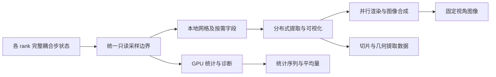
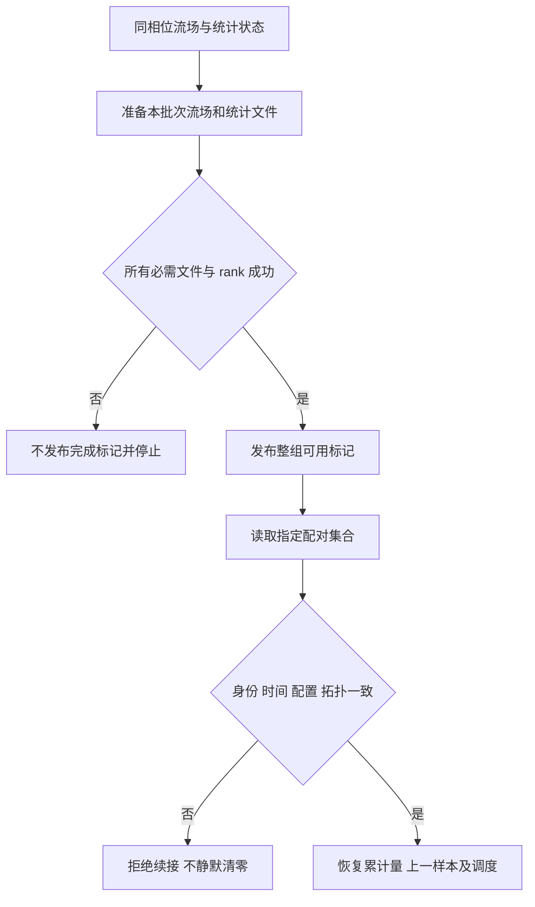

# ASTR 原位分析与批量可视化实施计划

状态：顶层需求访谈已收口，分阶段实施方案待审阅；尚未授权修改求解器或运行测试。
更新：2026-09-28。

目标：在不改变权威流场与既有重启语义的前提下，由 ASTR 累计可信统计，
由可选 ParaView Catalyst 后端输出预设图片和选定空间提取数据，减少常规
完整三维场文件。只采用当前会话推进，不创建 worktree 或子代理，不自动提交 Git。

第 1、4 节保留用户逐项确认的需求；第 2、3 节说明源码依据和职责边界；
第 5 节给出建议实施顺序；第 6 节是不得跳过的前置决策；第 7、8 节定义
最小验证与停止条件。分期、建议文件名和测试组织是本次审阅稿，不代表已实现。

第一里程碑是独立三维 TGV 的统计、图片、提取数据端到端闭环；首版完整
验收还包括多 rank、重启、壁面、AIR5 和静态 CURVE，不能在 TGV 出图后
将后续范围标为完成。全 GPU 可视化、异步、在线交互和跨拓扑统计恢复均为后续项。

首轮以 FP64 路径为基线，不能盲用混合精度模式留下的导数缓存；其他精度
配置须另列支持证据。若后续获准上中科算联云，所有远程工作仍限定在
`/data/user/hd56000/weiph`，不因本计划而获得修改外部任务的权限。

## 1. 已确认目标

用户选择方案 A：定量统计与批量可视化并重。首版不追求在线交互，
不要求计算节点在运行过程中连接桌面 ParaView。

可视化必须支持预先定义视角的流场图、流线图和 Q 准则等值面图。
其它常见湍流图像保留扩展能力，不把“常见”解释为首版全部实现。
统计与可视化共享一致的数据语义，但定量统计不以渲染器可用为前提。

用户进一步选择产物方案 B：保存图片，以及预设切片、流线和等值面的
提取数据。统计数值单独保存，不常规输出完整三维场。
Checkpoint 仍按求解器重启需求独立管理，不因本选择而停用或改变格式。

提取数据只支持对已保存对象的离线查看。例如，可以旋转已保存的等值面，
或用其附带字段重新着色；不能仅凭该等值面重选 Q 阈值，也不能仅凭
流线几何重新选择种子积分。哪些字段随几何保存尚待确定。
提取结果的大小仍取决于几何复杂度，输出预算和限额策略尚未批准。

### 1.1 首版定量统计范围

用户选择统计方案 A：通用统计与壁面流动诊断并重，包含 AIR5 扩展。

| 类别 | 首版目标 |
|---|---|
| 通用统计 | 探针时间序列、均值、RMS、Reynolds/Favre 速度统计和应力 |
| 壁面诊断 | 壁面压力、摩擦和热流分布，以及分离/再附位置时间序列 |
| AIR5 扩展 | 五组分与平动/振动温度统计 |
| 统计发展监测 | 比较连续时间块的统计漂移，不自动判定统计定常 |

完整湍流预算、能谱与相关函数不进入首版必交范围。空间平均方向、各算例
具体统计起止时间、壁面量定义、分离识别方法及数值验收阈值仍待确认。
不把固定平面结果自动解释为展向平均，也不将短窗瞬态变化命名为湍流强度。

### 1.2 统计累计的空间范围

用户选择空间方案 A：按需配置两种模式。

- 默认模式：只对指定探针、剖面、壁面或区域累计统计量。
- 可选模式：显式开启三维平均与二阶统计，启用前检查内存预算。

“不常规保存完整三维场”是文件输出约束，不禁止内存中的三维统计累计。
统计累计的 CPU/GPU 职责按第 1.12 节；三维统计的具体字段、内存上限
数值仍待确认，预算方式与超额处理按第 1.13 节。
空间归约方向的统计均匀性须按算例确认，不能默认为任意展向均可平均。

### 1.2.1 逐点时间统计与可选物理空间平均

用户选择空间归约方案 A：首版保留各位置的时间均值、RMS 和应力，
同时支持显式指定方向或区域的空间平均。选择剖面、壁面或三维统计
区域本身不触发归约，未配置空间平均时保留各点结果。

线、面和体区域的归约分别按物理长度、面积和体积加权。曲线或拉伸
网格不能默认用节点等权平均替代物理测度平均。几何权重须与坐标及
统计区域一致，独立于时间积分权重；Favre 统计所需的密度权重也不能
被几何权重替代。

MPI 共享节点、重叠单元与数值 halo 不得重复贡献物理测度。
具体空间求积、权重构造及分区所有权须在 Cartesian/CURVE 对照中验证。
若将某个方向的空间样本用于均匀湍流统计，须确认统计均匀性及比较位置；
对非均匀区域的几何平均本身不构成该区域统计均匀的证据。

局部方差或应力的空间归约，与先归约瞬时信号再求时间方差，是不同的
诊断量。两类均按第 1.2.2 节支持，不能共用一个含义不明的
“空间平均 RMS”字段。

### 1.2.2 两类脉动指标独立命名和启用

用户选择脉动指标方案 A：首版同时支持局部脉动强度的空间汇总和区域
平均信号的 RMS，独立命名、按需开启，不默认同时分配全部累计数组。

以普通时间统计为例，令上横线表示选定窗口的时间平均，
$\langle\cdot\rangle_\Omega$ 表示选定区域的物理测度平均，
$\phi'=\phi-\overline\phi$ 表示相对各位置自身时间均值的脉动。
局部脉动强度的空间汇总定义为

$$
\sqrt{\left\langle\overline{(\phi')^2}\right\rangle_\Omega}.
$$

须先平均局部方差再开方，不能用各点 RMS 的算术平均代替。
另一类先构造瞬时区域平均信号
$m_\Omega(t)=\langle\phi(t)\rangle_\Omega$，再计算

$$
\sqrt{\overline{\left(m_\Omega-\overline{m_\Omega}\right)^2}}.
$$

不同位置的反向脉动可能在第二类指标中抵消，但仍对第一类有贡献。
应力的空间归约同样须区分局部协方差平均与区域平均速度信号的协方差。
非均匀时间平均场的空间差别不能混作局部脉动。涉及 Favre 量时须明确
密度权重及各次归约的顺序，不能将上述普通平均公式直接改名为 Favre 统计。

输出元数据须标明指标类别、统计区域、时间窗口及平均类型。字段名和
完整 Favre 组合公式在统计规格中冻结，两类累计及重启数据均纳入预算。
短窗或启动阶段的 RMS 不因此自动获得湍流或统计定常的物理含义。

### 1.3 时间平均口径

原 `statistic::meanflowcal` 按样本直接累加矩并增加 `nsamples`。
用户选择时间口径方案 A：新原位统计支持变时间步，按实际采样时间间隔
加权。均值、RMS 和应力使用一致的时间权重，Favre 统计同时考虑密度权重。
采样时间采用求解器一致的时间单位和归一化约定，不能将无量纲时间误标为秒。

用户进一步选择梯形积分。对完全位于统计窗口内的有效相邻采样区间，
各被积量采用同一规则：

$$
\Delta I_g = \frac{t_n-t_{n-1}}{2}\left(g_{n-1}+g_n\right),
\qquad \Delta W = t_n-t_{n-1}.
$$

这里的 $g$ 分别是所需的一阶矩、二阶矩或密度加权矩，例如
$u_i$、$u_i u_j$、$\rho$、$\rho u_i$ 和 $\rho u_i u_j$。
须对这些被积量分别积分，不能先平均速度再用其乘积替代二阶矩。
Reynolds 均值按有效时长归一化，Favre 均值按密度的时间积分归一化。

所选统计空间需保留上一份采样数据及其模拟时刻，或足以重建相应被积量
的等价数据，并纳入重启续接状态与内存预算。不要求保存上一份完整求解器场。
梯形规则对平滑时间变化具有二阶积分精度，但不提升求解器本身的时间阶数，
也不能恢复低频采样漏掉的快速脉动。

该选择不改变求解器时间推进方法，也不默默改变旧统计路径及文件的解释。
统计窗口端点按第 1.3.1 节处理；启动和结束时的补采样安排、缺失采样
处理尚未冻结。
低频采样间隔不等于单个推进步的 `deltat`；重启时也不能把未观测的停算或
历史区间当成已采样数据。

### 1.3.1 保留指定窗口并裁剪积分区间

用户选择端点方案 A：保留用户指定的平均窗口，不将端点移动到邻近的
采样时刻。对每个有效采样区间与平均窗口的交集 $[a,b]$，以两端实际
采样值构造被积量的线性插值：

$$
\widetilde g(t)=g_{n-1}
+\frac{t-t_{n-1}}{t_n-t_{n-1}}(g_n-g_{n-1}),
\qquad t\in[t_{n-1},t_n].
$$

当 $b>a$ 时，仅累计
$\Delta I_g=(b-a)[\widetilde g(a)+\widetilde g(b)]/2$ 和
$\Delta W=b-a$；没有交集则不累计。
各一阶矩、二阶矩及密度加权矩分别插值，不通过插值速度或守恒场后
重新构造非线性矩来替代这一规则。

窗口外的相邻样本可以用于端点插值，但窗口外的时间不计入平均权重。
这只近似统计被积量的时间变化，不修改权威流场、边界条件或求解器时间步。
必须由有效样本覆盖所积分区间，不向缺少样本的一侧外推，也不把尚未
覆盖的窗口时长计入分母。实际积分覆盖区间须记录，不能将未完成的
窗口报告为已完成。

### 1.4 重启与统计续接

用户选择重启方案 A：默认续接原统计，允许显式新开统计窗口。

- 续接须恢复与流场检查点同相位的累计量、时间权重和窗口信息。
- 梯形积分还须恢复上一份有效采样数据及其时刻，保持跨重启积分连续。
- 避免重复计入检查点处样本，或遗漏重启前后应计入的采样区间。
- 统计配置不兼容或记录缺失时，不自动拼接或静默清零。
  若需继续采集，必须显式选择新窗口，并标明新的统计起点。
- 对未启用该统计功能的旧检查点，首次启用时新建统计窗口，
  不将旧流场已推进的历史时间冒充有效累计时长。

统计采用第 1.4.1 节的独立配对保存，不改变现有流场 checkpoint 格式。
首版统计续接按第 1.4.2 节限定同拓扑；具体文件布局、发布与回滚实现
仍待设计和独立验证。
统计续接失败按第 1.8 节停止，不得自动改成新窗口继续；预先显式选择
新窗口仍是允许的独立操作。

### 1.4.1 独立统计文件与配对保存

用户选择保存方案 A：统计重启状态写入独立文件，与同相位的流场
checkpoint 严格配对，不将新统计字段直接并入原流场文件。
统计文件保存累计量、有效时间权重、窗口及配置、上一份有效采样数据
和采样时刻，并记录用于识别配对流场检查点的信息。

只有流场和全部必需统计文件写出成功，且参与 rank 一致确认后，才发布
整组可续接的完成标记。一个 rank 的文件写完或单个文件重命名成功，
不能替代整组完成。中断留下的半组文件不得被当作完整统计续接点。
重启须核对同一保存批次、步数、模拟时间及统计配置，拒绝错配；仅凭
文件名相似或步数相同不能证明它们来自同一算例状态。

现有 `production_statistics_gpu` 已有独立附属文件及恢复检查，可借鉴
其组织方式，但不假定它已满足新统计的完整配对契约。
保存批次标识、文件格式、完成标记的发布方式及回滚仍需细化。
统计文件读写错误按第 1.8 节停止，不能降级为丢弃统计。

### 1.4.2 首版限定同拓扑统计续接

用户选择拓扑方案 A：首版在全局网格、MPI rank 数和域分解一致的条件下
续接统计，先验证累计量、上一份样本及跨重启积分的连续性。
这不要求重启使用原来的物理 GPU，也不是对原有流场重启能力新增限制。

统计文件须保留全局位置和局部分区信息，为后续跨拓扑重分配准备，
不能仅以保存时的 rank 编号作为数据的空间身份。
首版若请求在不同拓扑下续接原统计，应明确报错，不能静默重置累计量。
显式选择新统计窗口仍按第 1.4 节处理，且须另行满足流场重启准入条件。

改变 rank 数或域分解后恢复统计的能力留作后续扩展，不属于首版通过项。
届时需重分配累计量及上一份样本，并独立检查所有权、共享节点处理和
有效积分区间，不能将流场跨拓扑重启成功当作统计续接已通过。

### 1.5 发展监测与正式平均分开

用户选择窗口方案 A：发展监测和预设出图可以从启动时开始，正式均值、
RMS 和应力只在用户指定的模拟时间窗口内累计，结束时间可选。
窗口身份及已累计区间须随统计续接恢复，不能因重启而悄悄改变统计起点。

这种分离使启动发展过程可观测，同时允许将其排除在选定平均窗口外。
正式窗口可以从零时刻开始，例如用于非定常 TGV；不要求所有算例先达到
定常。开始累计不是统计收敛或物理验收的自动通过标志。
窗口端点与采样时刻不重合时，按第 1.3.1 节对统计被积量插值并裁剪积分，
保持指定窗口不变。

### 1.5.1 模拟时间与步数两种调度模式

用户明确要求两种模式均可选，统计采样和可视化输出分别配置，不能只
实现其中一种，也不能强制两者采用相同模式或间隔。

- 模拟时间模式：按指定的模拟时间间隔调度，在首次达到或越过目标时刻
  的完整步状态上执行，记录实际采样或出图时间，不为后处理修改推进步长。
  时间单位沿用算例约定，无量纲时间不能直接标为秒。
- 步数模式：按指定的完整推进步数间隔调度，不将 RK 子步或化学内部
  子步计为一次完整推进步。即使按步数触发，统计仍以实际模拟时间间隔
  做梯形积分，不退回等样本权重。

每项调度显式选择一种模式，避免同时配置时间与步数时出现隐含的
AND/OR 触发语义。两种模式的具体输入字段和默认值尚未冻结，原有
`feqavg` 等输入的含义不静默改变。

续接须保存调度模式、间隔、起算基准与已处理位置等必要状态，恢复后
不能重置周期或重复计入同一采样。请求目标时间与实际执行时间须区分，
不能把同一完整步状态复制为多个不同物理时刻的样本或图片。
单步跨过多个时间触发点、启动/结束补采样以及调度配置变更的具体处理
仍需冻结，并与第 1.8 节的故障策略一致。

### 1.6 首版可视化数据传输边界

用户选择传输方案 A：允许在配置的输出时刻，将可视化流水线实际需要的
三维字段从 GPU 下载到主机。不因此复制全部求解器数组，也不在非输出步
为可视化建立全场主机镜像。

首版先验证字段、网格、多 rank 拼接及图像的正确性，单独记录同步、打包、
下载、分析、渲染和提取文件写出耗时。该路径称为受控主机镜像原位处理，
不得称为全 GPU 常驻或端到端零拷贝可视化。

后续 GPU 常驻可视化优化保留为独立阶段。统计执行位置按第 1.12 节，
统计采样频率不与可视化出图频率绑定。镜像内存计入第 1.13 节的显式预算；
时间开销按第 1.10 节实测记录，首版不设百分比门槛。

### 1.7 首版同步批处理

用户选择执行方案 A：到达配置的输出时刻，求解器等待本次分析、渲染与
提取完成，再继续推进。首版不实现后台任务队列、异步快照流水线或异步
双缓冲。快照及必要缓冲在本次调用结束前必须保持有效，不允许后处理
写回或改变求解器权威场。

这里的同步是求解器与后处理之间的执行边界，不改变求解器内部的 kernel
同步策略。后处理增加的耗时须单独统计，不混入纯时间推进性能指标。
异步方案留作后续性能阶段，不能在未验证缓冲生命周期、资源竞争和
跨 rank 行为前作为默认路径。

### 1.7.1 多 rank 分布式可视化

用户选择并行方案 A：各 MPI rank 提供本地网格与所需字段，由分布式
流水线协同提取、渲染及合成图片，不先将完整三维场汇集到单个 rank。
第 1.6 节允许的主机镜像按本地分区构造，不解释为全局流场集中复制。
图片合成所需通信与完整流场汇集是不同操作，须分别记录其开销。

各 rank 的采样相位、触发决策、字段含义及显示配置须一致，并遵守
可视化流水线的 MPI 集合调用要求。不能仅让输出 rank 进入需要所有
参与 rank 协作的操作，也不能在某个 rank 失败后让其他 rank 独自继续。

验收须覆盖子域接缝、共享或重复节点、空提取分区，以及跨 MPI 子域
的流线连续性。MPI 分区面不是物理边界，不能把流线在分区面截断视为
正确终止；真实边界和周期边界的具体积分规则另行冻结。
ASTR 数值 halo 与可视化重叠数据的语义须明确映射，不能直接作为额外
物理单元重复计入统计或生成重复几何。所有权、重叠标记和跨域提取
接口仍需按目标工具链验证。

分布式处理不等于全部提取和渲染算子均在 GPU 上执行，也不改变首版
同步批处理、按需下载和分类故障策略。

### 1.7.2 GPU 优先的无显示渲染与显式软件选项

用户选择渲染方案 A：优先验证 EGL 硬件渲染，同时保留显式可选的
OSMesa 软件渲染。计算节点不依赖桌面会话或 X 显示服务。
具体工具链须具备所选后端的构建与运行依赖；不能只因指定 EGL 就
认定实际使用了 GPU，须记录实际渲染后端、设备及运行库信息。

所选后端在计算开始前进行准入检查，并核对各 rank 的设备映射和
运行配置。EGL 不可用时可以显式选择并验证软件路径，但不得在运行中
静默切换后端或把软件渲染的耗时报告为 GPU 渲染性能。
后端或依赖准入失败不能按可跳过的单帧图片故障处理。

GPU 渲染的附加显存、软件渲染的主机内存与 CPU 资源均须纳入预算和
实测记录。两条路径保持相同字段定义、视角及显示范围，并分别核对
图像与提取结果。渲染后端选择不改变 ASTR 的数值计算后端，也不表明
流线积分、等值面提取等全部操作都在 GPU 上执行。

### 1.7.3 可编辑的可视化脚本模板

用户选择配置方案 A：提供可编辑的 ParaView/Catalyst 脚本模板，包含
预设视角、色标、切片、流线种子及等值面提取规则。既可以直接修改
模板参数，也可以在本地 ParaView 中使用代表性数据配置后导出脚本。
离线使用桌面工具不意味着计算节点需要桌面环境或在线交互连接。

ASTR 负责字段提供、统计定义、累计窗口和调用调度，脚本负责预设
提取与显示。脚本不能替代 ASTR 的权威统计或已冻结的 Q 等物理量定义，
不能修改求解器权威状态，也不能引入未记录的第二套采样或出图周期。

每个模板须列明所需字段、数据关联位置与单位约定，并在运行前检查
与适配器的字段契约是否一致。字段缺失不能靠静默改名、替换变量或
下载全部求解器数组来绕过。导出的桌面脚本须去除离线文件读取等不适用
环节并通过批处理检查，不能假定导出后即可直接用于 ASTR 的 MPI 流水线。
保留实际使用的脚本及参数记录，以便追溯图片和提取数据。

具体模板文件名、算例预设数值与配置输入语法仍待细化。本决定不增加
在线修改视角、运行中热加载脚本或计算控制功能。

### 1.8 分类故障策略

用户选择故障方案 A：仅允许安全隔离的单帧图片输出故障降级。

- 数值非有限、字段错位、统计累计或重启不一致、代码逻辑错误，均明确
  报错并停止。不能以“后处理可选”为由绕过这些错误。
- 仅当故障确定局限于单帧图片输出，且求解状态、统计和 MPI 均正常时，
  才允许跳过该帧。须记录帧标识、模拟时刻、故障原因及缺帧状态。
- 不能确定安全恢复的错误必须停止。不能在部分 rank 已失败或仍困于
  集合操作时，让其余 rank 自行返回求解循环。
- 允许跳过图片不等于允许丢弃统计数值或空间提取数据，也不允许生成
  假成功标志、替代旧图片或隐瞒数据缺失。

哪些图片错误可恢复及跨 rank 通知机制须在实现前枚举，并通过注入错误
测试验证。此策略不授权吞掉未知异常或进行无限重试。

### 1.9 导数量由 ASTR 计算

用户选择导数方案 A：Q、涡量等依赖空间导数的物理量由 ASTR 计算，
可视化工具负责使用这些字段提取几何、着色和显示，不重新定义一套
生产统计所依赖的梯度。

优先复用适用的 ASTR 差分、网格度量及边界算子，但须验证导数与采样场
同相位。最后一个 RK 子步遗留的梯度不能未经核查就配上完整耦合步的新场。
必要时在只读诊断路径中重新计算，不能因后处理重算而修改权威流场。
统计累计按第 1.12 节执行；诊断导数的具体计算调度、已有算子的可复用
边界及新增计算开销仍待确定。

### 1.10 性能记录而非首版性能门槛

用户选择性能方案 C：首版记录后处理耗时，暂不设额外耗时的百分比验收
门槛。此前提出的 5% 和 10% 均未获批准，不得作为隐含默认门槛。

记录统计累计、诊断导数计算、同步、打包、下载、分析、渲染和提取写出
等开销，并保留整体推进窗口的墙钟时间。比较开启/关闭新后处理的运行时，
使用相同算例、推进区间与求解器 checkpoint 设置，明确测量是否包含初始化。
多 MPI rank 的整体墙钟耗时不能用各 rank 耗时求和代替。

性能记录用于后续确定预算，不替代数值、数据一致性、图像和重启验收。
不能为得到较低开销而静默降低统计采样频率、丢弃数据或改变已批准的
物理量定义。内存预算和资源不足时的准入检查并未因本选择而取消。

### 1.11 首个端到端验收采用三维 TGV

用户选择以独立的三维 TGV 短测试打通统计、预设出图和空间提取链路，
不直接将当前 AIR5 平板前驱长任务作为首个接入试验。
复用现有 TGV 同相位场比较和多 MPI rank 测试基础，分别检查后处理
开启/关闭的流场一致性、统计数值、图像与提取数据；已有求解器测试通过
不等于新增原位后处理通过。

TGV 通过后再扩展壁面、AIR5 和 CURVE 的独立验收，不能由周期单组分
算例推断壁面热流、双温组分统计或曲线网格导数量已可信。
具体网格、步数、采样设置和误差门槛在实施前另行冻结。

### 1.12 GPU 优先统计累计与 CPU 同定义参考

用户选择统计执行方案 A：GPU 生产路径在设备端采样并累计已开启的
统计量，CPU 保留同物理定义、时间权重和采样相位的参考路径。
这一决定覆盖所选均值、二阶矩等统计累计，不要求每次统计采样都下载
完整流场，也不将统计频率绑定到图片输出频率。

按需传回统计结果；统计输出及续接保存所需的数据传输单独计入开销。
可视化仍按第 1.6 节允许下载所需字段。小规模结果的整理与文件写出
可以由 CPU 承担，不把 GPU 优先解释为禁止任何主机计算。
所选三维统计的显存和输出体量须单独预算，不能假定统计结果总是小数组。

优先复用适用的原 CPU 定义和已有 GPU 统计基础；
`src_gpu/production_statistics_gpu.cuf` 当前受单组分 `bl/swbli`、
壁面及均匀方向等条件限制，不是本设计的通用统计实现。
新时间加权、AIR5 扩展与完整耦合步采样仍须分别实现和验证。

### 1.13 显式内存预算

用户选择预算方案 A：分别显式配置每张物理 GPU 的后处理附加显存上限
和每个计算节点的后处理附加主机内存上限，不按启动时空闲内存自动
决定预算。具体数值留到小算例实测后确定，本次不预设统一百分比或容量。

预算包括统计累计、上一份采样数据、诊断工作区、主机镜像、提取与
渲染缓冲及配对保存的暂存数据。多 rank 共享一张 GPU 时须合计显存
需求，同节点各 rank 的主机内存也须合计，不能让每个 rank 都将同一
份可用资源当成独占容量。准入还须检查求解器与后处理的总资源需求，
不能仅验证后处理自身未超过附加预算。

启动前估算并报告需求，预计超额则拒绝该配置，不自动减少统计字段、
缩小统计区域、降低图像要求或切换渲染后端。
运行中记录资源峰值，对可控分配进行预算检查；提取几何复杂度及
第三方库分配可能随流场变化，启动估算通过不构成不会超限的保证。
运行中超限或分配失败按第 1.8 节处理，不承诺能从任意内存不足错误
安全恢复。可控分配边界、第三方内存观测方式与检查频率仍待实现设计。

## 2. 现有基础与范围

本轮只读核对基于 `feature/gpu_dev`，HEAD 为
`33c4ec2486cee1e4ce549054f247a4093b139392`，同时包含当前未提交的监测改动。
因此下表描述的是本地工作区，不把未跟踪的监测文件当作该提交已包含的能力。
这里只核对接入所需入口，不重新认证整个求解器。

- 原 `src/statistic.F90` 已有瞬时统计、矩累计与平均统计，优先复用适用部分。
- 原 `src/readwrite.F90` 已有探针配置和输出；AIR5 CPU/GPU 监测已补接该入口。
- `src/comsolver.F90::gradcal` 已有使用 `dxi` 的物理空间梯度，
  `src_gpu/gradcal_gpu.cuf` 已有对应 GPU 梯度路径。它们是导数量计算的
  可复用基础，但不能由“数组已存在”推断其对应完整耦合步的采样相位。
- AIR5 当前已有固定平面剖面和壁面诊断，不能视为完整的三维湍流统计体系。
- 现有 VTK 文件输出不是已实现的 Catalyst 原位接口。
- 顶层状态文件第 8.10 节已有 Catalyst I0-I4 规划，但依赖、适配器和
  GPU 常驻可视化尚未实现。本次访谈细化该规划，不直接启动实施。

反应流的采样基准是完整输运、化学与阶段收尾处理完成的状态。
只有输运 RK 完成而化学尚未闭合的状态不等同于该基准。
具体所有权、halo、导数和重启契约仍需在设计阶段逐项落定。

| 已核对文件和入口 | 可复用内容 | 不能据此声称 |
|---|---|---|
| `CMakeLists.txt`、`src/CMakeLists.txt` | 根构建及集中维护的 CPU/GPU 源文件列表 | 已有 Catalyst 选项；当前根工程仅声明 Fortran，C++ 桥接需条件启用语言 |
| `src/mainloop.F90::steploop` | `time_integration_rk` 返回后的完整步位置；保存的 `completed_step_dt` | 循环中的任意 `time/nstep` 都对应同一输出状态 |
| `src/mainloop.F90::time_integration_rk`、`rkfirst` 与 `src_gpu/gpu_runtime.cuf` | GPU 分支正式推进前的统计/输出准备，以及 CPU 首阶段统计路径 | 旧统计已采用新原位完整步采样契约 |
| `src/statistic.F90::meanflowcal` | 原均值与矩定义、已有等样本累计 | 已支持新梯形时间积分和新窗口语义 |
| `src_gpu/production_statistics_gpu.cuf` | 局部矩、物理线段权重、独立统计附属文件 | 通用 AIR5/CURVE 统计或跨拓扑统计重启已完成 |
| `src/readwrite.F90::writemon`、`src/chemistry_monitor.F90::write_air5_flow_monitor` | 原探针入口与 AIR5 完整步监测衔接 | 已有所有探针插值、任意壁面及完整三维统计 |
| `src_gpu/chemistry_monitor_gpu.cuf::collect_air5_monitor_gpu` | 选定节点的 GPU 紧凑采集 | 有无条件可复用的全三维统计内核 |
| `src/comsolver.F90::gradcal`、`src_gpu/gradcal_gpu.cuf` | 物理空间导数和已有物理边界算子 | 已缓存梯度与新采样时刻一致，或原函数可直接作为只读诊断调用 |
| `src/parallel.F90`、`src_gpu/commarray_gpu.cuf` | 分区偏移、共享节点与含 halo 数组布局 | 内点切片天然连续，或数值 halo 可以直接显示为物理单元 |
| `src/validation_io.F90`、`src/readwrite.F90` | 已有同相位验证快照和 HDF5/重启接口 | 任意旧 HDF 输出与新样本同相位 |
| `src/vtkio.F90::WriteVTK` | 既有离线 VTK 输出基础 | 已有 Catalyst adaptor 或分布式原位流水线 |

## 3. 目标结构草图

下图仅表达目标职责，不代表已完成的软件模块。

### 3.1 模块职责与拟议文件

以下新增路径均为计划，当前不可作为已存在接口调用。不按每个统计量、
每种图片各建一个源码文件；复用既有监测与定义，避免形成第二套相同功能。

| 路径 | 计划动作及职责 |
|---|---|
| `src/insitu_runtime.F90` | 新增统一入口，管理配置、两种调度、完整步样本身份、资源准入及后端调用；默认关闭 |
| `src/insitu_statistics.F90` | 新增原生统计核心与 CPU 参考，管理时间/空间矩、窗口及配对统计状态；不依赖 ParaView |
| `src_gpu/insitu_gpu.cuf` | 新增所选字段采集、同相位诊断与 GPU 累计；控制镜像和工作区生命周期，不改时间推进核 |
| `src/catalyst_adapter.cpp` | 新增窄 C ABI 桥接，用 `ISO_C_BINDING` 接收描述和缓冲；封装网格、字段及 Catalyst 生命周期，不计算权威物理定义 |
| `CMakeLists.txt`、`src/CMakeLists.txt` | 条件加入源文件、C++ 语言与轻量 Catalyst API 依赖；建议选项仍为 `ASTR_WITH_CATALYST=OFF`，不是现有选项 |
| `src/mainloop.F90`、`src/readwrite.F90`、`src_gpu/gpu_runtime.cuf` | 仅补经相位验证的调用、输出/续接衔接和必要包装；不全局移动旧统计、checkpoint 或边界处理 |
| `src/statistic.F90`、`src/chemistry_monitor.F90`、`src_gpu/production_statistics_gpu.cuf`、`src_gpu/chemistry_monitor_gpu.cuf` | 审核和复用适用定义及采集逻辑；保留旧路径含义，不直接把新时间权重写进旧累计数组 |
| `scripts/insitu/tgv_pipeline.py`、`scripts/insitu/wall_air5_pipeline.py` | 拟新增可编辑的场图、流线、Q 等值面模板；只处理提取与显示 |
| `tests/gpu_validation/insitu_statistics_probe.F90`、`tests/gpu_validation/insitu_statistics_probe_gpu.cuf` | 拟新增小型 CPU/GPU 统计与调度探针，不另写流体推进器 |
| `tests/gpu_validation/run_insitu_validation.sh`、`tests/gpu_validation/check_insitu_outputs.py` | 拟新增统一验证驱动及产物检查；复用现有算例准备和场比较，不为每个排列复制脚本 |
| `tests/gpu_validation/README.md`、本文件 | 实施时记录真实可执行命令、参数、证据路径和阶段状态；本轮不新增虚假的已通过条目 |

在写入实现前冻结具体接口与输入语法。调用边界至少分为初始化、完整步
采样、统计保存/恢复、结束清理；不得让桥接层反向进入求解器推进函数。
新运行时未开启时，不分配统计/可视化大数组、不初始化 Catalyst、不新增
后处理 GPU 同步。仅开启原生统计时，仍不得要求渲染器或 Python/ParaView 可用。

### 3.2 必须传递的数据契约

| 契约 | 必需信息及边界 |
|---|---|
| 样本身份 | 算例/运行身份、完成步标识、实际模拟时间、时间单位、所代表完整状态；不从出图序号反推物理时间 |
| 网格分区 | 全局与局部范围、物理坐标、节点/单元关联、共享节点所有权、重叠标记、周期方向；均匀 Cartesian、拉伸 Cartesian、CURVE 分别验证 |
| 字段描述 | 名称、分量、FP64 基线、单位/归一化、关联位置、内存布局、有效区域与导数相位；均值字段另带窗口与覆盖区域 |
| 生命周期 | 本次同步分析返回前缓冲有效；只读权威场，禁止让后处理保留下一步会被覆盖的悬空地址 |
| 统计状态 | 原始累计状态、权重、上一份样本、有效积分区间、平均类型及两类 RMS 的区分；不能只保存最终均值而丢掉续接必需数据 |
| 调度状态 | 模式、间隔、起算基准、最后已处理位置及下一触发位置；统计和出图分别保存 |
| 产物记录 | 实际时刻、脚本和配置、后端、字段/单位、图片与提取文件对应关系、有效空结果或缺帧原因 |

首版主机镜像必须识别 Fortran 含 halo 数组的行/面间隔；需要时按字段
打包局部物理区，而不是把去 halo 的视图当作连续数组。
曲线网格的导数使用物理坐标；拉伸 Cartesian 也不能只凭一个网格间距
描述全部坐标。诊断 halo 的更新不能通过共享节点平均等副作用改变权威场。

### 3.3 重启生命周期

这是保存契约，不是现有文件轮转已具备的事务保证。旧流场文件命名可能
轮转，不能仅增加一个标记就声称多文件原子提交；保存批次、旧集合保护、
发布和显式回滚方案须在 IS2 前确认。

## 4. 已确认图像与待冻结定义

| 图像类别 | 已确认要求 | 仍需确认 |
|---|---|---|
| 流场图 | 按预设视角批量输出，同一序列固定着色变量和色标范围 | 具体显示变量、切片位置、色标数值与分辨率 |
| 流线图 | 默认瞬时速度，可选明确标注类型及窗口的平均速度 | 种子位置、积分方向与长度、精度与终止条件 |
| Q 准则等值面 | ASTR 计算 Q 和散度；同一序列固定阈值、着色变量及色标 | 归一化与各算例的具体预设值 |
| 其它湍流后处理图 | 保留扩展能力 | 涡量、数值纹影、壁面分布、谱或其它量的优先级 |

图像是否出现涡面不是湍流验收标准；当前近二维前驱也不因新增图像而
成为三维湍流验证算例。

### 4.1 已确认的 Q 定义

令 A 为物理空间速度梯度，S=(A+A^T)/2，Omega=(A-A^T)/2。
旋转与应变比较量为 Q_rs=(||Omega||_F^2-||S||_F^2)/2=-tr(A^2)/2，
其中 S 是完整对称梯度，不先去除迹。VTK 当前 Q 计算使用这一表达式。
速度梯度的第二主不变量则是 Q_inv=((tr A)^2-tr(A^2))/2，
因此 Q_inv=Q_rs+(div u)^2/2。两者仅在散度为零时重合。

用户选择 Q 方案 A：首版以 Q_rs 生成涡结构图，并提供速度散度辅助诊断。
后文及图像中的 Q 指 Q_rs，不先去除 S 的迹，不在首版另增 Q_inv 输出。
上面的 Q_inv 关系仅用于说明可压缩流下的定义区别，不是第二个已批准字段。
这一选择与 VTK Q 的代数定义一致，不意味着采用 VTK 梯度离散或已验证
ASTR 与 VTK 的逐点结果相同。

Q 的量纲为时间的负二次方，散度为时间的负一次方；输出需沿用并注明
算例的量纲或无量纲约定。具体归一化及各算例的阈值、色标数值尚未冻结，
不预设适用于全部算例的通用数值阈值。Q 等值面本身不是湍流物理验收证据。

### 4.2 固定时序显示口径

用户选择显示方案 A：按算例配置预设，同一时间序列保持 Q 等值面阈值、
着色变量及色标范围固定。不同算例允许不同配置，但须记录量纲或无量纲
定义，使图像和提取数据可以追溯到实际使用的参数。

不逐帧自动调整 Q 阈值或色标来增强视觉效果。若数据有限且有效，但没有
满足预设阈值的等值面，应将空等值面作为有效结果记录，不自动降低阈值。
这不同于非有限数据、计算异常或输出失败，不能用空等值面掩盖后者。
显示范围限制不得改变保存的统计数值或提取字段的实际值。

### 4.3 流线的数据来源

用户选择流线方案 A：默认从所选输出时刻的瞬时速度场生成流线，同时
支持对已累计的平均速度场生成流线。平均流线须明确标识 Reynolds 平均
或 Favre 平均，并记录实际统计窗口，不能仅以“平均速度”代替定义。

平均流线仅在相应区域已有所需平均速度数据时启用；不能用瞬时数据冒充
平均值，也不能为了出图而未经配置就分配全域三维统计数组。统计空间不足
以覆盖请求的流线积分区域时，应报告配置不满足，而不是静默外推补齐。

瞬时流线不是随时间追踪的粒子轨迹。平均场流线也不是瞬时流线几何的
时间平均。首版不增加含时粒子轨迹积分；种子、跨域积分及停止准则在
具体可视化预设和验收中另行明确。

## 5. 分阶段实施

本次采用新编号 IS0-IS8，避免与旧文档的 Catalyst I0-I4 混用。
旧 I0 的依赖准入对应 IS0，旧 I1 的镜像批处理拆入 IS1/IS3，旧 I3 的
多 rank/CURVE 工作对应 IS4/IS6；旧 I2 全设备流水线和旧 I4 在线/异步
统一列为 IS8 后续候选，不再阻挡首版交付。

所有实现阶段当前均未启动。阶段只能依据各自证据由“待执行”变为
“通过”，不得以本文完成、已有求解器测试通过或一张有效图片代替验收。

| 阶段 | 依赖 | 可独立验收的交付物 | 最小检查与完成条件 | 当前状态 |
|---|---|---|---|---|
| IS0 接口与依赖准入 | 审阅本计划；D0、D7、D8 | 默认关闭的构建/运行入口、依赖清单与能力表 | CPU/GPU 构建不受关闭选项影响；启用时桥接、MPI、动态库和所选无显示后端通过短探针 | 待执行 |
| IS1 只读同相位采样 | IS0；D3 | 样本描述、局部字段与物理导数量 | NP=1/2 小 TGV 的相位、索引、导数正确；开/关后处理不改变权威场 | 待执行 |
| IS2 原生统计与续接 | IS1；D1、D2、D4 | 不依赖渲染器的 CPU/GPU 统计、两种调度及配对重启 | 小型解析/离散样本、两类 RMS、同拓扑续接和错配拒绝均通过 | 待执行 |
| IS3 TGV 批处理闭环 | IS2；D6 | 预设场图、流线、Q 涡面及选定空间数据 | 独立三维 TGV NP=1 和一种 NP=2 分解出图并能离线读取提取数据；与同相位参考一致 | 待执行 |
| IS4 多 rank 与故障路径 | IS3；D3、D4、D6 | 拼接、跨域流线与故障收敛证据 | NP=2 三个 slab 加一个 NP=4 双轴分解；共享节点、空分区及中断恢复检查通过 | 待执行 |
| IS5 壁面与 AIR5 | IS4；D1、D5 | 壁面诊断、T/Tv/五组分统计及模板 | 一个已有壁面基准和一个 AIR5 小算例/冻结检查点副本，CPU/GPU 同相位及续接通过 | 待执行 |
| IS6 静态 CURVE | IS5；D3、D5 | 曲线坐标、几何权重和物理梯度适配 | 静态曲线 TGV 与一个现有曲线壁面基准，字段、导数、积分及几何接缝通过 | 待执行 |
| IS7 首版生产准入 | IS0-IS6；D7、D8 | 汇总能力矩阵、资源报告、独立启动说明 | 按已通过配置完成一次匹配的开/关计时、内存安全和重启闭环；无未解释失败 | 待执行 |
| IS8 可选优化与扩展 | IS7；另行设计和授权 | 全 GPU 可视化、异步、跨拓扑统计等独立候选 | 不设为本次首版门槛，不继承为已支持能力 | 暂缓 |

### IS0 接口与依赖准入

涉及根及 `src/` 的 CMake、拟议 `insitu_runtime.F90`、`catalyst_adapter.cpp`。

- [ ] 冻结 D0、D7、D8 中本阶段适用项，记录实际编译器、MPI、HDF5、Catalyst API、ParaView implementation、Conduit 及渲染库组合；不只看版本号，还检查 ABI 和运行时加载。
- [ ] 先建立默认关闭且无额外渲染依赖的路径；开启原生统计与开启 Catalyst 可分别控制，运行时 `usegpu` 的含义不变。
- [ ] 用独立短探针验证初始化、执行、结束和 MPI 参与方式；EGL 与显式软件路径分别记录实际后端，结合 `ldd/readelf` 检查库加载，缺库或后端不符立即拒绝。
- [ ] 将真正可用的构建和探针命令写入测试 README；核对 LF/CRLF 配置解析及各 rank 配置一致性。

停止条件：关闭功能仍引入新依赖、混用不兼容 MPI/动态库、不能确定设备映射，
或计划使用的后端未通过准入。本阶段不运行生产算例，也不安装或修改超算环境。

### IS1 只读同相位采样与诊断

涉及 `src/mainloop.F90` 的最小调用点、拟议 CPU/GPU 采样层，以及已核对的
`gradcal`、网格和验证快照入口。

- [ ] 冻结 D3：明确完整步标识、结束时间和 CPU/GPU 采样位置，审计 `completed_step_dt` 与循环 `time/nstep` 的关系，不移动旧输出以凑齐相位。
- [ ] 实现按需本地区域采集与字段契约；先提供同相位的密度、速度、压力、温度，再提供经验证的 Q、涡量及散度。数值 halo 不直接作为可见物理区。
- [ ] 复用或隔离现有导数算子，检查是否会改写求解器缓存；需要刷新 halo 时使用不改变权威场的诊断路径。验证后处理前后权威状态不变。
- [ ] 先做无渲染 NP=1，再做一种 NP=2 小 TGV 对照，导数量用制造场/独立公式核查，不把“CPU/GPU 同错”当作定义正确。

停止条件：时间错位、非有限字段、布局/单位不一致、过期梯度或权威场发生变化。
不得继续靠渲染图片寻找这些问题。

### IS2 原生统计、调度与配对续接

涉及拟议 `insitu_statistics.F90`、`insitu_gpu.cuf`、运行时调度及现有读写衔接。

- [ ] 冻结 D1、D2、D4 后，实现 FP64 时间/几何加权、窗口裁剪、两类脉动指标和分别可选的模拟时间/steps 调度；保持旧累计路径原义。
- [ ] 用同一小型样本集检查 CPU/GPU、一次性积分/分段积分、两种触发模式的实际采样时刻。对大均值小脉动检查数值稳定性，不能静默截断异常负方差。
- [ ] 保存累计状态、上一份样本、覆盖区间与调度进度，不借用旧 `nsamples` 混记新样本；明确流场实际写出时刻，不能拿更晚的累计量配更早的流场。检测文件缺失、配置/批次错配和未发布的半组文件。
- [ ] 比较连续运行与同拓扑重启的统计和权威场；检查边界样本不重计、窗口不重置、旧 checkpoint 显式新开窗口。此阶段不需要渲染器。

停止条件：指标定义未批准、同相位续接失败、累计时长不一致、错误被自动清零掩盖。
跨拓扑请求必须按首版边界拒绝，不能拿换拓扑后的新统计冒充原窗口续接。

### IS3 独立三维 TGV 批处理闭环

涉及桥接、TGV 模板和统一验证驱动，复用 `prepare_tgv_case.py`、
`run_tgv_field_compare.sh` 与 `run_tgv_mpirank2_field_compare.sh` 的算例/比较基础。

- [ ] 冻结 D6 和本阶段 D7：准备足以形成多个统计区间与至少两帧的独立短算例，明确实际更新次数；不使用当前 AIR5 长任务，也不默认调用 512^3 生产网格。
- [ ] 将已经通过 IS1/IS2 的字段送入分布式 Catalyst，完成预设场图、跨子域流线和固定阈值 Q 等值面。图片、统计和空间提取分别记录结果。
- [ ] 重新读取提取对象，检查变量、坐标、关联位置、时间和元数据；离线回放只使用已保存几何及附带字段，不声称可以任意改变原阈值和种子。
- [ ] 关闭常规三维场写出后仍能产出约定结果；仅在小验证副本中保留必要同相位参考，checkpoint 设置保持独立。按项目要求交付 JPEG/EPS，记录三维渲染 EPS 是否为栅格嵌入，不冒充纯矢量图。

完成此阶段只可报告“TGV 端到端链路通过”。图像有效不能替代统计准确，
空等值面也不能自动算失败；须区分真实空结果与字段/管线错误。

### IS4 多 rank、共享节点与故障路径

- [ ] 复用统一驱动，先补齐 NP=2 的 x/y/z slab，再测 NP=4 的一个双轴分解；本地共享两张 GPU 只作为正确性测试，不作为扩展性证据。
- [ ] 核对物理测度总和、常数场积分、唯一节点/单元覆盖、周期接缝、空提取分区和流线跨 rank 连续性；需要时再扩大拓扑，不盲目枚举更大 rank。
- [ ] 注入已枚举的单帧输出失败，验证各 rank 一致记录缺帧并安全返回；数值错误、字段缺失、统计文件失败和未知 MPI 错误必须停止。
- [ ] 在不同保存阶段中断独立测试，验证半组不能恢复、旧完整集合不会被误配，显式选择备份时恢复同一统计窗口。

停止条件：重复计数、裂缝、错误截断、死锁、不同 rank 分别继续/停止，
或任何错配状态获得完成标记。后续壁面与反应流扩展不能绕过本阶段。

### IS5 壁面与 AIR5 扩展

优先复用 `run_channel_phased_compare.sh`、`run_channel_phased_mpirank_matrix.sh`、
`run_air5_c5_reacting_tgv_compare.sh` 及现有 AIR5 监测验证入口。

- [ ] 冻结 D5：明确壁面切向/法向、摩擦符号、热流组成与归一化、分离/再附识别及零剪切处处理；不把现有简化诊断自动称为完整双温壁面热流。
- [ ] 先做现有单组分壁面小算例，再接入 AIR5 的五组分、T/Tv 和壁面量；复用已有监测入口，不重复输出两套含义相同的统计。
- [ ] 比较 CPU/GPU 完整耦合步字段、统计及同拓扑重启，必要时对照补偿余量等续接状态，不能仅比较输运 RK 结束的五个流体分量。
- [ ] 用独立冻结检查点副本验证采样与模板，原长任务保持原状；块统计漂移只作监测，不自动宣布统计定常或真实 SBLI 验收通过。

停止条件：壁面定义有歧义、误将非均匀方向当作均匀方向、采集额外改变
化学/补偿状态，或 CPU 既有诊断疑似有科学缺陷。发现原 CPU 问题须先报用户决策。

### IS6 静态 CURVE 可信化

复用 `generate_curvilinear_tgv_grid.py`、`run_curvilinear_tgv_compare.sh`，
再选择一个已有可信曲线壁面小基准，不另建流体推进器。

- [ ] 固定同一物理场，核对曲线坐标、字段关联、物理梯度及 Q/散度；不直接用计算坐标差分充当物理导数。
- [ ] 对照物理长度/面积/体积积分，检查 MPI 分区前后测度和统计一致；曲线显示正确不替代几何权重验证。
- [ ] 检查壁面法向、切向与诊断量的几何投影，曲面提取接缝及跨域流线；旧均匀方向归约的适用条件不能外推到所有曲线网格。

停止条件：坐标映射或几何投影错误、负/无效测度、导数相位不一致、
视觉拼接通过但物理积分失败。移动网格、AMR 和新 IBM 能力不在本次首版内。

### IS7 首版鲁棒性、资源与性能记录

- [ ] 汇总 IS0-IS6 的实际能力组合和证据，记录尚不支持的配置并在运行前拒绝；未变更的昂贵历史算例不重跑。
- [ ] 在最小已通过 GPU 场景做针对新增内核和缓冲的内存安全检查，记录每 GPU/节点峰值；按 D8 检查超预算路径，不声称能恢复任意第三方 OOM。
- [ ] 做一次匹配的开/关后处理计时：只改变新原位功能开关，物理设置、实际推进区间、旧统计和 checkpoint 设置保持相同；开启组执行约定的全部采样及产物，分别记录推进、导数、累计、同步/打包/D2H、提取、渲染、写出及整体墙钟时间。
- [ ] 明确计时是否含初始化，使用跨 rank 整体耗时而非累加进程时间；不设额外耗时百分比门槛，不通过稀释采样、缺图或丢提取数据获取性能数字。
- [ ] 交付独立启动配置、模板、支持矩阵与报告。开始新生产任务、替换正在运行的任务或转移到 A800，仍须单独获得授权。

首版完成条件：全部必交需求在支持矩阵中有对应证据，数值、重启、MPI、
图像、依赖和资源检查分别通过，无未解释的科学错误。运行完成不等于统计定常。

### IS8 后续候选

只在首版通过并另行批准后研究：Viskores 等全设备处理、异步/独立分析资源、
在线交互、跨拓扑统计续接、完整预算/谱/相关函数及新增后端。
GPU 地址接入不等于所有过滤器和渲染均常驻；新增阶段仍须独立验证
精度、生命周期、资源及实测收益，不因软件提供接口就自动列为 ASTR 已支持。

## 6. 实施前置决策

下表是明确的审批位置，不是可由实现者随意填入的默认值。进入相关阶段前
提交候选、依据和最小对照，由用户确认涉及物理定义、数值方法或验收含义的项。
工程内部命名可在确认职责范围内收敛，不为每个局部实现细节重复发起访谈。

| 编号 | 必须冻结的内容 | 最迟确认位置 | 未确认时允许的工作 |
|---|---|---|---|
| D0 工具链与接口 | 本地依赖组合、条件构建、配置入口、字段契约及桥接方式 | IS0 | 只读检查和提出候选；不安装依赖或提交远程任务 |
| D1 统计定义 | 完整 Favre 组合公式、空间/时间归约次序、协方差及密度权重，空间求积与单位 | IS2，AIR5 扩展前再核对 | 实现已明确的基础探针；不输出未定义量的物理结论 |
| D2 调度端点 | 初始/最终样本、窗口前包围样本、单步越过多个触发点、缺失采样及配置变更 | IS2 | 不给未观测区间加权，不伪造精确目标时刻样本 |
| D3 相位与网格 | 步/时间身份、采样钩子、诊断 halo、副作用隔离、共享节点、周期接口及 CURVE 度量 | IS1；IS4/IS6 按新范围补齐 | 小型描述/索引探针，不能套用旧 HDF 相位假设 |
| D4 续接发布 | 文件格式、批次身份、旧集合保护、完成标记、回滚、输出文件续写及防覆盖策略 | IS2 | 不改变流场文件含义，不宣称简单重命名已提供整组原子性 |
| D5 壁面物理 | 摩擦/热流定义、参考量、几何投影、分离识别、AIR5 各热流贡献 | IS5，CURVE 前补几何范围 | 保留原监测，不把其有限范围推广为完整壁面量 |
| D6 图像预设 | 相机、切片、字段、Q 阈值与归一化、种子、积分精度/长度、真实及周期边界终止、文件格式与命名 | IS3；IS5/IS6 补算例预设 | 检查脚本依赖，不自动选择“看起来好看”的阈值 |
| D7 验收数值 | 各字段/统计量的误差范数、绝对/相对容差、几何与图像判据、采样收敛要求 | 各阶段首次运行前 | 提出最小试验，不从旧脚本的默认容差直接推定新量已获批准 |
| D8 资源预算 | 小探针的保守候选上限、实测后冻结的每 GPU/节点预算、求解器余量、动态几何/第三方观测 | IS0 探针前审阅候选上限；IS3 前据实测冻结 | 估算和方案审阅；不无上限运行，不自动裁剪数据 |

## 7. 最小验证与证据

### 7.1 验证矩阵

| 类别 | 最小样本或场景 | 必须区分的判据 |
|---|---|---|
| 关闭功能 | 原 CPU/GPU 小算例，功能关闭和未链接 Catalyst | 输出/推进语义不变；无新大缓冲、渲染依赖或后处理同步 |
| 时间积分 | 常数与线性被积量、不等时间间隔、窗口裁剪 | 以批准的离散梯形规则为基准；非线性矩另检查采样细化，不把梯形结果当成精确连续积分 |
| 两类 RMS | 两个等权位置的反向脉动；空间非均匀但时间不变的场 | 反向脉动可有局部强度而区域平均信号 RMS 为零；静止平均剪切不算局部脉动 |
| 空间测度 | 非等距线/面/体、常数场、同域不同分区 | 正确权重、同一物理测度、无 halo/共享单元重复计数 |
| 相位与导数 | 制造速度场、小 TGV、同一完整步 CPU/GPU | 梯度和 Q 的定义/单位及离散误差单独核查；开/关不改变权威场 |
| 调度/续接 | steps/时间分别触发、窗口端点跨采样、连续/分段重启 | 实际采样时刻、累计权重、上一份样本及调度连续；半组/错配拒绝 |
| 分布式图像 | NP=1、NP=2 三 slab、一个 NP=4 双轴；空提取分区 | 拼接和跨域流线正确、图片与提取数据同源，不用本地共享卡结果宣称扩展效率 |
| 壁面/AIR5/CURVE | 各复用一个已具备前置求解器证据的小基准 | 每类独立通过，不把三维周期 TGV 外推为复杂物理验证 |
| 故障/资源 | 缺库、缺字段、损坏配对文件、单帧写出失败、超预算候选 | 只允许既定安全单帧故障跳过；数值/契约/未知 MPI 失败停止 |
| 内存安全/性能 | 一个最小已通过场景与匹配开/关窗口 | 内存安全不是物理验证；耗时仅实测记录，无百分比放行条件 |

时间积分探针的具体可复现例子：采样时刻为 `0,1,3`，被积量为
`g(t)=2t+1`，完整区间积分应为 `12`、有效时长为 `3`；窗口
`[0.5,2]` 的积分为 `5.25`、有效时长为 `1.5`。
此例用于验证插值裁剪，不是给生产算例设定时间步或采样间隔。

RMS 探针使用两个等权位置、两个采样时刻，离散信号分别为 `(-1,1)`
和 `(1,-1)`。按同一离散规则，局部脉动空间汇总为 `1`，区域平均
信号 RMS 为 `0`。空间测度探针可用权重 `1,3`、数值 `2,4`，
物理加权均值应为 `3.5`，而非节点等权值 `3`。

CPU/GPU、相同后端开/关、连续/重启是不同对照。对仅只读的后处理，
同一后端和推进配置的开/关应保留权威数组；CPU/GPU 差异按独立冻结的
字段容差检查。图像不强求不同渲染后端逐像素一致，但几何、字段、视角、
阈值与色标必须满足同一契约，不接受以图像相似代替数值比较。

### 7.2 复用范围与记录

现有 TGV、channel、CURVE、AIR5 脚本只是准备算例和比较字段的基础，
当前均未被认定为新原位路径测试。实施时向统一驱动补充相位、元数据、
重启和产物检查，不因 shell 返回零就标记新功能通过。

建议测试结果统一进入 `tests/gpu_validation/out/insitu_*`，记录源码提交与
工作区差异、可执行文件身份、构建/运行依赖、输入、NP/拓扑、实际推进
区间、采样序列、容差、资源与产物路径。目录名只是建议，正式命名在
D4/D6 冻结，不覆盖现有长任务目录或历史结果。

对已核对源文件只列必要复用；不为文档修改运行编译、数值仿真、GPU
profile 或生产任务。实施后先运行受改动影响的最小集合，通过后才扩范围。

## 8. 停止与交付边界

- 科学定义、CPU 既有数值逻辑或边界模型出现矛盾时，报告证据并等待决策，不带错移植。
- 任何同相位、权威场不变、统计/重启或 MPI 所有权检查失败，停止下游图像和性能结论。
- 单帧错误仅按第 1.8 节的受控条件跳过，不把缺依赖、缺数据、未知异常或整个后端失效变成“缺一帧”。
- 首版验收是 IS0-IS7 的组合证据，不包含统计定常、真实 SBLI 物理结论或全设备零拷贝保证。
- 旧 CPU/GPU、checkpoint、数值格式、同步策略和正在运行的任务保持不变；若实施需要改变既有科学语义，重新提交具体决策。
- 本轮交付仅为计划及文档入口同步。阶段实施、依赖安装、Git 操作、远程任务和生产接入均不因本文生成而获得授权。

## 9. 技术参考

ParaView 的 Extractors 区分数据提取和图像提取，可用于声明批处理输出。
这支持将“图像”和“可离线查看的数据”作为两种独立产物设计，但不保证
特定 ASTR 字段、GPU 后端或过滤器已经适配。

- [ParaView Extractors](https://docs.paraview.org/en/v5.9.1/UsersGuide/savingResults.html#extractors)
- [Catalyst Python pipeline and extractors](https://www.paraview.org/paraview-docs/v5.13.2/cxx/CatalystPythonScriptsV2.html)
- [Catalyst introduction and distributed MPI scripts](https://docs.paraview.org/en/latest/Catalyst/introduction.html)
- [ParaView headless rendering with EGL and OSMesa](https://www.paraview.org/paraview-docs/latest/cxx/Offscreen.html)
- [Catalyst GPU-resident workflows](https://catalyst-in-situ.readthedocs.io/en/latest/gpu_workflows.html)
- [VTK Q-criterion source: ComputeQCriterionFromGradient](https://github.com/Kitware/VTK/blob/master/Filters/General/vtkGradientFilter.cxx)
- [现有顶层状态与 Catalyst 分期规划](ASTR_GPU_CURRENT_STATUS_AND_NEXT_TARGETS.md#810-paraview-catalyst-原位后处理)

工具链具体版本未冻结；后续依赖准入应重新核对目标版本的接口和构建条件。
GPU 地址接入不等于完整流水线 GPU 常驻。官方 GPU 文档要求使用相应执行
后端与过滤器，普通过滤器可能触发主机复制。因此全场下载是否允许仍需
逐路径明确；本次已批准输出时刻按需下载所需字段，不承诺所有流线、
等值面和渲染操作零拷贝。
