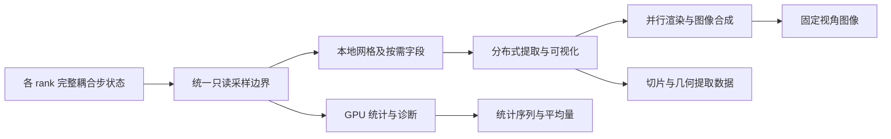
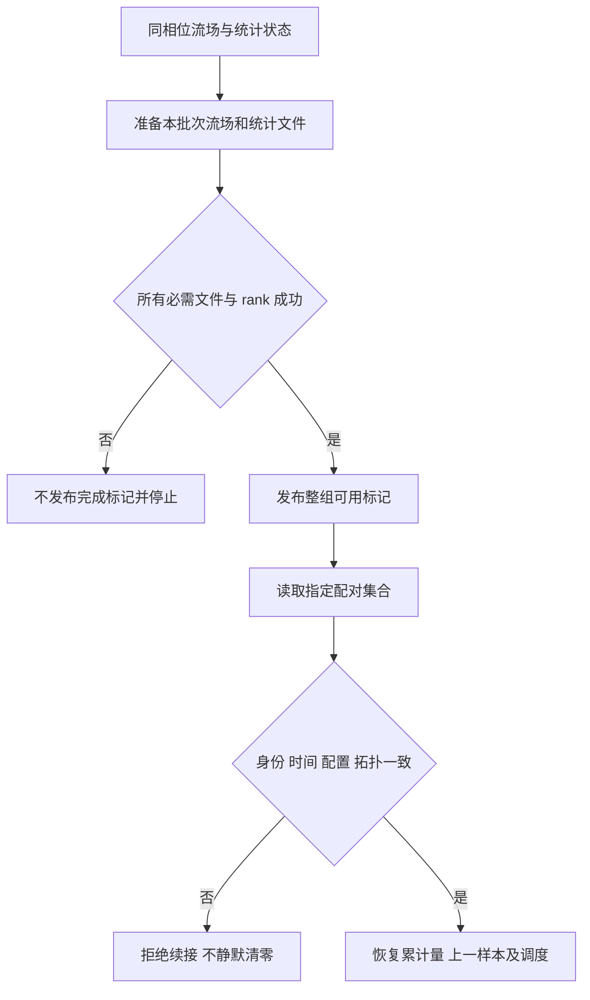

# ASTR 原位分析与批量可视化实施计划

状态（2026-09-30）：IS3 TGV 批处理闭环及所需 IS0-IS2 有界门槛完成，含 CPU/GPU 精确配对续接。逐项验收见 [IS3 验收记录](ASTR_INSITU_IS3_ACCEPTANCE.md)。不外推为 IS4 全矩阵或生产认证。下文实施记录按时间保留，早期未完成项以最新记录和阶段表为准。
更新：2026-09-30。

输出与重启的后续设计见 [重设计总稿](ASTR_OUTPUT_RESTART_REDESIGN_PLAN.md)。
用户已确认新路径统一完整步语义、目录式 checkpoint 及同后端跨分解恢复目标，
但尚未实施。本文保留旧格式及独立配对文件的既有实现记录，不将目标格式视为
已支持，也不取消下述长序列资源诊断。

后续规模展示更新：256^3 每步渲染在完成 48 帧后因主机增量超预算停止，
100 步展示未通过。先执行第 5.1 节的生命周期与耗时诊断，暂不推进
IS4 新拓扑；保留原 32^3 短窗结论，不宣称长序列资源稳定。

目标：在不改变权威流场与既有重启语义的前提下，由 ASTR 累计可信统计，
由可选 ParaView Catalyst 后端输出预设图片和选定空间提取数据，减少常规
完整三维场文件。只采用当前会话推进，不创建 worktree 或子代理，不自动提交 Git。

第 1、4 节保留用户逐项确认的需求；第 2、3 节说明源码依据和职责边界；
第 5 节给出实施顺序及当前进度；第 6 节是不得跳过的前置决策；第 7、8 节定义
最小验证与停止条件。建议文件名和测试组织不代表已实现。

第一里程碑是独立三维 TGV 的统计、图片、提取数据端到端闭环；首版完整
验收还包括多 rank、重启、壁面、AIR5 和静态 CURVE，不能在 TGV 出图后
将后续范围标为完成。全 GPU 可视化、异步、在线交互和跨拓扑统计恢复均为后续项。

首轮以 FP64 路径为基线，不能盲用混合精度模式留下的导数缓存；其他精度
配置须另列支持证据。若后续获准上中科算联云，所有远程工作仍限定在
`/data/user/hd56000/weiph`，不因本计划而获得修改外部任务的权限。

## 1. 已确认目标

用户选择方案 A：定量统计与批量可视化并重。首版不追求在线交互，
不要求计算节点在运行过程中连接桌面 ParaView。

可视化必须支持预先定义视角的流场图、流线图和 Q 准则等值面图。
其它常见湍流图像保留扩展能力，不把“常见”解释为首版全部实现。
统计与可视化共享一致的数据语义，但定量统计不以渲染器可用为前提。

用户进一步选择产物方案 B：保存图片，以及预设切片、流线和等值面的
提取数据。统计数值单独保存，不常规输出完整三维场。
Checkpoint 仍按求解器重启需求独立管理，不因本选择而停用或改变格式。

提取数据只支持对已保存对象的离线查看。例如，可以旋转已保存的等值面，
或用其附带字段重新着色；不能仅凭该等值面重选 Q 阈值，也不能仅凭
流线几何重新选择种子积分。哪些字段随几何保存尚待确定。
提取结果的大小仍取决于几何复杂度，输出预算和限额策略尚未批准。

### 1.1 首版定量统计范围

用户选择统计方案 A：通用统计与壁面流动诊断并重，包含 AIR5 扩展。

| 类别 | 首版目标 |
|---|---|
| 通用统计 | 探针时间序列、均值、RMS、Reynolds/Favre 速度统计和应力 |
| 壁面诊断 | 壁面压力、摩擦和热流分布，以及分离/再附位置时间序列 |
| AIR5 扩展 | 五组分与平动/振动温度统计 |
| 统计发展监测 | 比较连续时间块的统计漂移，不自动判定统计定常 |

完整湍流预算、能谱与相关函数不进入首版必交范围。空间平均方向、各算例
具体统计起止时间、壁面量定义、分离识别方法及数值验收阈值仍待确认。
不把固定平面结果自动解释为展向平均，也不将短窗瞬态变化命名为湍流强度。

### 1.2 统计累计的空间范围

用户选择空间方案 A：按需配置两种模式。

- 默认模式：只对指定探针、剖面、壁面或区域累计统计量。
- 可选模式：显式开启三维平均与二阶统计，启用前检查内存预算。

“不常规保存完整三维场”是文件输出约束，不禁止内存中的三维统计累计。
统计累计的 CPU/GPU 职责按第 1.12 节；三维统计的具体字段、内存上限
数值仍待确认，预算方式与超额处理按第 1.13 节。
空间归约方向的统计均匀性须按算例确认，不能默认为任意展向均可平均。

### 1.2.1 逐点时间统计与可选物理空间平均

用户选择空间归约方案 A：首版保留各位置的时间均值、RMS 和应力，
同时支持显式指定方向或区域的空间平均。选择剖面、壁面或三维统计
区域本身不触发归约，未配置空间平均时保留各点结果。

线、面和体区域的归约分别按物理长度、面积和体积加权。曲线或拉伸
网格不能默认用节点等权平均替代物理测度平均。几何权重须与坐标及
统计区域一致，独立于时间积分权重；Favre 统计所需的密度权重也不能
被几何权重替代。

MPI 共享节点、重叠单元与数值 halo 不得重复贡献物理测度。
具体空间求积、权重构造及分区所有权须在 Cartesian/CURVE 对照中验证。
若将某个方向的空间样本用于均匀湍流统计，须确认统计均匀性及比较位置；
对非均匀区域的几何平均本身不构成该区域统计均匀的证据。

局部方差或应力的空间归约，与先归约瞬时信号再求时间方差，是不同的
诊断量。两类均按第 1.2.2 节支持，不能共用一个含义不明的
“空间平均 RMS”字段。

### 1.2.2 两类脉动指标独立命名和启用

用户选择脉动指标方案 A：首版同时支持局部脉动强度的空间汇总和区域
平均信号的 RMS，独立命名、按需开启，不默认同时分配全部累计数组。

以普通时间统计为例，令上横线表示选定窗口的时间平均，
$\langle\cdot\rangle_\Omega$ 表示选定区域的物理测度平均，
$\phi'=\phi-\overline\phi$ 表示相对各位置自身时间均值的脉动。
局部脉动强度的空间汇总定义为

$$
\sqrt{\left\langle\overline{(\phi')^2}\right\rangle_\Omega}.
$$

须先平均局部方差再开方，不能用各点 RMS 的算术平均代替。
另一类先构造瞬时区域平均信号
$m_\Omega(t)=\langle\phi(t)\rangle_\Omega$，再计算

$$
\sqrt{\overline{\left(m_\Omega-\overline{m_\Omega}\right)^2}}.
$$

不同位置的反向脉动可能在第二类指标中抵消，但仍对第一类有贡献。
应力的空间归约同样须区分局部协方差平均与区域平均速度信号的协方差。
非均匀时间平均场的空间差别不能混作局部脉动。涉及 Favre 量时须明确
密度权重及各次归约的顺序，不能将上述普通平均公式直接改名为 Favre 统计。

输出元数据须标明指标类别、统计区域、时间窗口及平均类型。字段名和
完整 Favre 组合公式在统计规格中冻结，两类累计及重启数据均纳入预算。
短窗或启动阶段的 RMS 不因此自动获得湍流或统计定常的物理含义。

### 1.3 时间平均口径

原 `statistic::meanflowcal` 按样本直接累加矩并增加 `nsamples`。
用户选择时间口径方案 A：新原位统计支持变时间步，按实际采样时间间隔
加权。均值、RMS 和应力使用一致的时间权重，Favre 统计同时考虑密度权重。
采样时间采用求解器一致的时间单位和归一化约定，不能将无量纲时间误标为秒。

用户进一步选择梯形积分。对完全位于统计窗口内的有效相邻采样区间，
各被积量采用同一规则：

$$
\Delta I_g = \frac{t_n-t_{n-1}}{2}\left(g_{n-1}+g_n\right),
\qquad \Delta W = t_n-t_{n-1}.
$$

这里的 $g$ 分别是所需的一阶矩、二阶矩或密度加权矩，例如
$u_i$、$u_i u_j$、$\rho$、$\rho u_i$ 和 $\rho u_i u_j$。
须对这些被积量分别积分，不能先平均速度再用其乘积替代二阶矩。
Reynolds 均值按有效时长归一化，Favre 均值按密度的时间积分归一化。

所选统计空间需保留上一份采样数据及其模拟时刻，或足以重建相应被积量
的等价数据，并纳入重启续接状态与内存预算。不要求保存上一份完整求解器场。
梯形规则对平滑时间变化具有二阶积分精度，但不提升求解器本身的时间阶数，
也不能恢复低频采样漏掉的快速脉动。

该选择不改变求解器时间推进方法，也不默默改变旧统计路径及文件的解释。
统计窗口端点按第 1.3.1 节处理；启动和结束时的补采样安排、缺失采样
处理尚未冻结。
低频采样间隔不等于单个推进步的 `deltat`；重启时也不能把未观测的停算或
历史区间当成已采样数据。

### 1.3.1 保留指定窗口并裁剪积分区间

用户选择端点方案 A：保留用户指定的平均窗口，不将端点移动到邻近的
采样时刻。对每个有效采样区间与平均窗口的交集 $[a,b]$，以两端实际
采样值构造被积量的线性插值：

$$
\widetilde g(t)=g_{n-1}
+\frac{t-t_{n-1}}{t_n-t_{n-1}}(g_n-g_{n-1}),
\qquad t\in[t_{n-1},t_n].
$$

当 $b>a$ 时，仅累计
$\Delta I_g=(b-a)[\widetilde g(a)+\widetilde g(b)]/2$ 和
$\Delta W=b-a$；没有交集则不累计。
各一阶矩、二阶矩及密度加权矩分别插值，不通过插值速度或守恒场后
重新构造非线性矩来替代这一规则。

窗口外的相邻样本可以用于端点插值，但窗口外的时间不计入平均权重。
这只近似统计被积量的时间变化，不修改权威流场、边界条件或求解器时间步。
必须由有效样本覆盖所积分区间，不向缺少样本的一侧外推，也不把尚未
覆盖的窗口时长计入分母。实际积分覆盖区间须记录，不能将未完成的
窗口报告为已完成。

### 1.4 重启与统计续接

用户选择重启方案 A：默认续接原统计，允许显式新开统计窗口。

- 续接须恢复与流场检查点同相位的累计量、时间权重和窗口信息。
- 梯形积分还须恢复上一份有效采样数据及其时刻，保持跨重启积分连续。
- 避免重复计入检查点处样本，或遗漏重启前后应计入的采样区间。
- 统计配置不兼容或记录缺失时，不自动拼接或静默清零。
  若需继续采集，必须显式选择新窗口，并标明新的统计起点。
- 对未启用该统计功能的旧检查点，首次启用时新建统计窗口，
  不将旧流场已推进的历史时间冒充有效累计时长。

统计采用第 1.4.1 节的独立配对保存，不改变现有流场 checkpoint 格式。
首版统计续接按第 1.4.2 节限定同拓扑；具体文件布局、发布与回滚实现
仍待设计和独立验证。
统计续接失败按第 1.8 节停止，不得自动改成新窗口继续；预先显式选择
新窗口仍是允许的独立操作。

### 1.4.1 独立统计文件与配对保存

用户选择保存方案 A：统计重启状态写入独立文件，与同相位的流场
checkpoint 严格配对，不将新统计字段直接并入原流场文件。
统计文件保存累计量、有效时间权重、窗口及配置、上一份有效采样数据
和采样时刻，并记录用于识别配对流场检查点的信息。

只有流场和全部必需统计文件写出成功，且参与 rank 一致确认后，才发布
整组可续接的完成标记。一个 rank 的文件写完或单个文件重命名成功，
不能替代整组完成。中断留下的半组文件不得被当作完整统计续接点。
重启须核对同一保存批次、步数、模拟时间及统计配置，拒绝错配；仅凭
文件名相似或步数相同不能证明它们来自同一算例状态。

现有 `production_statistics_gpu` 已有独立附属文件及恢复检查，可借鉴
其组织方式，但不假定它已满足新统计的完整配对契约。
保存批次标识、文件格式、完成标记的发布方式及回滚仍需细化。
统计文件读写错误按第 1.8 节停止，不能降级为丢弃统计。

### 1.4.2 首版限定同拓扑统计续接

用户选择拓扑方案 A：首版在全局网格、MPI rank 数和域分解一致的条件下
续接统计，先验证累计量、上一份样本及跨重启积分的连续性。
这不要求重启使用原来的物理 GPU，也不是对原有流场重启能力新增限制。

统计文件须保留全局位置和局部分区信息，为后续跨拓扑重分配准备，
不能仅以保存时的 rank 编号作为数据的空间身份。
首版若请求在不同拓扑下续接原统计，应明确报错，不能静默重置累计量。
显式选择新统计窗口仍按第 1.4 节处理，且须另行满足流场重启准入条件。

改变 rank 数或域分解后恢复统计的能力留作后续扩展，不属于首版通过项。
届时需重分配累计量及上一份样本，并独立检查所有权、共享节点处理和
有效积分区间，不能将流场跨拓扑重启成功当作统计续接已通过。

### 1.5 发展监测与正式平均分开

用户选择窗口方案 A：发展监测和预设出图可以从启动时开始，正式均值、
RMS 和应力只在用户指定的模拟时间窗口内累计，结束时间可选。
窗口身份及已累计区间须随统计续接恢复，不能因重启而悄悄改变统计起点。

这种分离使启动发展过程可观测，同时允许将其排除在选定平均窗口外。
正式窗口可以从零时刻开始，例如用于非定常 TGV；不要求所有算例先达到
定常。开始累计不是统计收敛或物理验收的自动通过标志。
窗口端点与采样时刻不重合时，按第 1.3.1 节对统计被积量插值并裁剪积分，
保持指定窗口不变。

### 1.5.1 模拟时间与步数两种调度模式

用户明确要求两种模式均可选，统计采样和可视化输出分别配置，不能只
实现其中一种，也不能强制两者采用相同模式或间隔。

- 模拟时间模式：按指定的模拟时间间隔调度，在首次达到或越过目标时刻
  的完整步状态上执行，记录实际采样或出图时间，不为后处理修改推进步长。
  时间单位沿用算例约定，无量纲时间不能直接标为秒。
- 步数模式：按指定的完整推进步数间隔调度，不将 RK 子步或化学内部
  子步计为一次完整推进步。即使按步数触发，统计仍以实际模拟时间间隔
  做梯形积分，不退回等样本权重。

每项调度显式选择一种模式，避免同时配置时间与步数时出现隐含的
AND/OR 触发语义。两种模式的具体输入字段和默认值尚未冻结，原有
`feqavg` 等输入的含义不静默改变。

续接须保存调度模式、间隔、起算基准与已处理位置等必要状态，恢复后
不能重置周期或重复计入同一采样。请求目标时间与实际执行时间须区分，
不能把同一完整步状态复制为多个不同物理时刻的样本或图片。
用户已确认：单步跨过多个时间目标时，仅输出当前实际完整步状态的一帧，
记录跨越目标数量，不构造位于过去目标时刻的虚假样本。初始/最终状态
默认不补采，可分别显式开启；与常规调度重合时只采一次。未覆盖的统计
时段不外推、不计入累计权重。调度配置变更和重启恢复规则仍待细化，
不得据此静默重置周期，并须遵守第 1.8 节故障策略。

### 1.6 首版可视化数据传输边界

用户选择传输方案 A：允许在配置的输出时刻，将可视化流水线实际需要的
三维字段从 GPU 下载到主机。不因此复制全部求解器数组，也不在非输出步
为可视化建立全场主机镜像。

首版先验证字段、网格、多 rank 拼接及图像的正确性，单独记录同步、打包、
下载、分析、渲染和提取文件写出耗时。该路径称为受控主机镜像原位处理，
不得称为全 GPU 常驻或端到端零拷贝可视化。

后续 GPU 常驻可视化优化保留为独立阶段。统计执行位置按第 1.12 节，
统计采样频率不与可视化出图频率绑定。镜像内存计入第 1.13 节的显式预算；
时间开销按第 1.10 节实测记录，首版不设百分比门槛。

### 1.7 首版同步批处理

用户选择执行方案 A：到达配置的输出时刻，求解器等待本次分析、渲染与
提取完成，再继续推进。首版不实现后台任务队列、异步快照流水线或异步
双缓冲。快照及必要缓冲在本次调用结束前必须保持有效，不允许后处理
写回或改变求解器权威场。

这里的同步是求解器与后处理之间的执行边界，不改变求解器内部的 kernel
同步策略。后处理增加的耗时须单独统计，不混入纯时间推进性能指标。
异步方案留作后续性能阶段，不能在未验证缓冲生命周期、资源竞争和
跨 rank 行为前作为默认路径。

### 1.7.1 多 rank 分布式可视化

用户选择并行方案 A：各 MPI rank 提供本地网格与所需字段，由分布式
流水线协同提取、渲染及合成图片，不先将完整三维场汇集到单个 rank。
第 1.6 节允许的主机镜像按本地分区构造，不解释为全局流场集中复制。
图片合成所需通信与完整流场汇集是不同操作，须分别记录其开销。

各 rank 的采样相位、触发决策、字段含义及显示配置须一致，并遵守
可视化流水线的 MPI 集合调用要求。不能仅让输出 rank 进入需要所有
参与 rank 协作的操作，也不能在某个 rank 失败后让其他 rank 独自继续。

验收须覆盖子域接缝、共享或重复节点、空提取分区，以及跨 MPI 子域
的流线连续性。MPI 分区面不是物理边界，不能把流线在分区面截断视为
正确终止；真实边界和周期边界的具体积分规则另行冻结。
ASTR 数值 halo 与可视化重叠数据的语义须明确映射，不能直接作为额外
物理单元重复计入统计或生成重复几何。所有权、重叠标记和跨域提取
接口仍需按目标工具链验证。

分布式处理不等于全部提取和渲染算子均在 GPU 上执行，也不改变首版
同步批处理、按需下载和分类故障策略。

### 1.7.2 GPU 优先的无显示渲染与显式软件选项

用户选择渲染方案 A：优先验证 EGL 硬件渲染，同时保留显式可选的
OSMesa 软件渲染。计算节点不依赖桌面会话或 X 显示服务。
具体工具链须具备所选后端的构建与运行依赖；不能只因指定 EGL 就
认定实际使用了 GPU，须记录实际渲染后端、设备及运行库信息。

所选后端在计算开始前进行准入检查，并核对各 rank 的设备映射和
运行配置。EGL 不可用时可以显式选择并验证软件路径，但不得在运行中
静默切换后端或把软件渲染的耗时报告为 GPU 渲染性能。
后端或依赖准入失败不能按可跳过的单帧图片故障处理。

GPU 渲染的附加显存、软件渲染的主机内存与 CPU 资源均须纳入预算和
实测记录。两条路径保持相同字段定义、视角及显示范围，并分别核对
图像与提取结果。渲染后端选择不改变 ASTR 的数值计算后端，也不表明
流线积分、等值面提取等全部操作都在 GPU 上执行。

### 1.7.3 可编辑的可视化脚本模板

用户选择配置方案 A：提供可编辑的 ParaView/Catalyst 脚本模板，包含
预设视角、色标、切片、流线种子及等值面提取规则。既可以直接修改
模板参数，也可以在本地 ParaView 中使用代表性数据配置后导出脚本。
离线使用桌面工具不意味着计算节点需要桌面环境或在线交互连接。

ASTR 负责字段提供、统计定义、累计窗口和调用调度，脚本负责预设
提取与显示。脚本不能替代 ASTR 的权威统计或已冻结的 Q 等物理量定义，
不能修改求解器权威状态，也不能引入未记录的第二套采样或出图周期。

每个模板须列明所需字段、数据关联位置与单位约定，并在运行前检查
与适配器的字段契约是否一致。字段缺失不能靠静默改名、替换变量或
下载全部求解器数组来绕过。导出的桌面脚本须去除离线文件读取等不适用
环节并通过批处理检查，不能假定导出后即可直接用于 ASTR 的 MPI 流水线。
保留实际使用的脚本及参数记录，以便追溯图片和提取数据。

具体模板文件名、算例预设数值与配置输入语法仍待细化。本决定不增加
在线修改视角、运行中热加载脚本或计算控制功能。

### 1.8 分类故障策略

用户选择故障方案 A：仅允许安全隔离的单帧图片输出故障降级。

- 数值非有限、字段错位、统计累计或重启不一致、代码逻辑错误，均明确
  报错并停止。不能以“后处理可选”为由绕过这些错误。
- 仅当故障确定局限于单帧图片输出，且求解状态、统计和 MPI 均正常时，
  才允许跳过该帧。须记录帧标识、模拟时刻、故障原因及缺帧状态。
- 不能确定安全恢复的错误必须停止。不能在部分 rank 已失败或仍困于
  集合操作时，让其余 rank 自行返回求解循环。
- 允许跳过图片不等于允许丢弃统计数值或空间提取数据，也不允许生成
  假成功标志、替代旧图片或隐瞒数据缺失。

哪些图片错误可恢复及跨 rank 通知机制须在实现前枚举，并通过注入错误
测试验证。此策略不授权吞掉未知异常或进行无限重试。

### 1.9 导数量由 ASTR 计算

用户选择导数方案 A：Q、涡量等依赖空间导数的物理量由 ASTR 计算，
可视化工具负责使用这些字段提取几何、着色和显示，不重新定义一套
生产统计所依赖的梯度。

优先复用适用的 ASTR 差分、网格度量及边界算子，但须验证导数与采样场
同相位。最后一个 RK 子步遗留的梯度不能未经核查就配上完整耦合步的新场。
必要时在只读诊断路径中重新计算，不能因后处理重算而修改权威流场。
统计累计按第 1.12 节执行；诊断导数的具体计算调度、已有算子的可复用
边界及新增计算开销仍待确定。

### 1.10 性能记录而非首版性能门槛

用户选择性能方案 C：首版记录后处理耗时，暂不设额外耗时的百分比验收
门槛。此前提出的 5% 和 10% 均未获批准，不得作为隐含默认门槛。

记录统计累计、诊断导数计算、同步、打包、下载、分析、渲染和提取写出
等开销，并保留整体推进窗口的墙钟时间。比较开启/关闭新后处理的运行时，
使用相同算例、推进区间与求解器 checkpoint 设置，明确测量是否包含初始化。
多 MPI rank 的整体墙钟耗时不能用各 rank 耗时求和代替。

性能记录用于后续确定预算，不替代数值、数据一致性、图像和重启验收。
不能为得到较低开销而静默降低统计采样频率、丢弃数据或改变已批准的
物理量定义。内存预算和资源不足时的准入检查并未因本选择而取消。

### 1.11 首个端到端验收采用三维 TGV

用户选择以独立的三维 TGV 短测试打通统计、预设出图和空间提取链路，
不直接将当前 AIR5 平板前驱长任务作为首个接入试验。
复用现有 TGV 同相位场比较和多 MPI rank 测试基础，分别检查后处理
开启/关闭的流场一致性、统计数值、图像与提取数据；已有求解器测试通过
不等于新增原位后处理通过。

TGV 通过后再扩展壁面、AIR5 和 CURVE 的独立验收，不能由周期单组分
算例推断壁面热流、双温组分统计或曲线网格导数量已可信。
具体网格、步数、采样设置和误差门槛在实施前另行冻结。

### 1.12 GPU 优先统计累计与 CPU 同定义参考

用户选择统计执行方案 A：GPU 生产路径在设备端采样并累计已开启的
统计量，CPU 保留同物理定义、时间权重和采样相位的参考路径。
这一决定覆盖所选均值、二阶矩等统计累计，不要求每次统计采样都下载
完整流场，也不将统计频率绑定到图片输出频率。

按需传回统计结果；统计输出及续接保存所需的数据传输单独计入开销。
可视化仍按第 1.6 节允许下载所需字段。小规模结果的整理与文件写出
可以由 CPU 承担，不把 GPU 优先解释为禁止任何主机计算。
所选三维统计的显存和输出体量须单独预算，不能假定统计结果总是小数组。

优先复用适用的原 CPU 定义和已有 GPU 统计基础；
`src_gpu/production_statistics_gpu.cuf` 当前受单组分 `bl/swbli`、
壁面及均匀方向等条件限制，不是本设计的通用统计实现。
新时间加权、AIR5 扩展与完整耦合步采样仍须分别实现和验证。

### 1.13 显式内存预算

用户选择预算方案 A：分别显式配置每张物理 GPU 的后处理附加显存上限
和每个计算节点的后处理附加主机内存上限，不按启动时空闲内存自动
决定预算。具体数值留到小算例实测后确定，本次不预设统一百分比或容量。

预算包括统计累计、上一份采样数据、诊断工作区、主机镜像、提取与
渲染缓冲及配对保存的暂存数据。多 rank 共享一张 GPU 时须合计显存
需求，同节点各 rank 的主机内存也须合计，不能让每个 rank 都将同一
份可用资源当成独占容量。准入还须检查求解器与后处理的总资源需求，
不能仅验证后处理自身未超过附加预算。

启动前估算并报告需求，预计超额则拒绝该配置，不自动减少统计字段、
缩小统计区域、降低图像要求或切换渲染后端。
运行中记录资源峰值，对可控分配进行预算检查；提取几何复杂度及
第三方库分配可能随流场变化，启动估算通过不构成不会超限的保证。
运行中超限或分配失败按第 1.8 节处理，不承诺能从任意内存不足错误
安全恢复。可控分配边界、第三方内存观测方式与检查频率仍待实现设计。

## 2. 现有基础与范围

原计划的只读核对基于 `feature/gpu_dev`，HEAD 为
`33c4ec2486cee1e4ce549054f247a4093b139392`，同时包含当前未提交的监测改动。
因此下表描述的是本地工作区，不把未跟踪的监测文件当作该提交已包含的能力。
这里只核对接入所需入口，不重新认证整个求解器。

- 原 `src/statistic.F90` 已有瞬时统计、矩累计与平均统计，优先复用适用部分。
- 原 `src/readwrite.F90` 已有探针配置和输出；AIR5 CPU/GPU 监测已补接该入口。
- `src/comsolver.F90::gradcal` 已有使用 `dxi` 的物理空间梯度，
  `src_gpu/gradcal_gpu.cuf` 已有对应 GPU 梯度路径。它们是导数量计算的
  可复用基础，但不能由“数组已存在”推断其对应完整耦合步的采样相位。
- AIR5 当前已有固定平面剖面和壁面诊断，不能视为完整的三维湍流统计体系。
- 现有 VTK 文件输出不是已实现的 Catalyst 原位接口。
- 顶层状态文件第 8.10 节已有 Catalyst I0-I4 规划。本计划细化该规划，
  2026-09-29 开始 IS0；已实现后端生命周期适配器，场采样与 GPU 常驻可视化仍未实现。

反应流的采样基准是完整输运、化学与阶段收尾处理完成的状态。
只有输运 RK 完成而化学尚未闭合的状态不等同于该基准。
具体所有权、halo、导数和重启契约仍需在设计阶段逐项落定。

| 已核对文件和入口 | 可复用内容 | 不能据此声称 |
|---|---|---|
| `CMakeLists.txt`、`src/CMakeLists.txt` | 根构建及集中维护的 CPU/GPU 源文件列表 | 已有 Catalyst 选项；当前根工程仅声明 Fortran，C++ 桥接需条件启用语言 |
| `src/mainloop.F90::steploop` | `time_integration_rk` 返回后的完整步位置；保存的 `completed_step_dt` | 循环中的任意 `time/nstep` 都对应同一输出状态 |
| `src/mainloop.F90::time_integration_rk`、`rkfirst` 与 `src_gpu/gpu_runtime.cuf` | GPU 分支正式推进前的统计/输出准备，以及 CPU 首阶段统计路径 | 旧统计已采用新原位完整步采样契约 |
| `src/statistic.F90::meanflowcal` | 原均值与矩定义、已有等样本累计 | 已支持新梯形时间积分和新窗口语义 |
| `src_gpu/production_statistics_gpu.cuf` | 局部矩、物理线段权重、独立统计附属文件 | 通用 AIR5/CURVE 统计或跨拓扑统计重启已完成 |
| `src/readwrite.F90::writemon`、`src/chemistry_monitor.F90::write_air5_flow_monitor` | 原探针入口与 AIR5 完整步监测衔接 | 已有所有探针插值、任意壁面及完整三维统计 |
| `src_gpu/chemistry_monitor_gpu.cuf::collect_air5_monitor_gpu` | 选定节点的 GPU 紧凑采集 | 有无条件可复用的全三维统计内核 |
| `src/comsolver.F90::gradcal`、`src_gpu/gradcal_gpu.cuf` | 物理空间导数和已有物理边界算子 | 已缓存梯度与新采样时刻一致，或原函数可直接作为只读诊断调用 |
| `src/parallel.F90`、`src_gpu/commarray_gpu.cuf` | 分区偏移、共享节点与含 halo 数组布局 | 内点切片天然连续，或数值 halo 可以直接显示为物理单元 |
| `src/validation_io.F90`、`src/readwrite.F90` | 已有同相位验证快照和 HDF5/重启接口 | 任意旧 HDF 输出与新样本同相位 |
| `src/vtkio.F90::WriteVTK` | 既有离线 VTK 输出基础 | 已有 Catalyst adaptor 或分布式原位流水线 |

## 3. 目标结构草图

下图仅表达目标职责，不代表已完成的软件模块。




### 3.1 模块职责与拟议文件

以下新增路径均为计划，当前不可作为已存在接口调用。不按每个统计量、
每种图片各建一个源码文件；复用既有监测与定义，避免形成第二套相同功能。

| 路径 | 计划动作及职责 |
|---|---|
| `src/insitu_runtime.F90` | 新增统一入口，管理配置、两种调度、完整步样本身份、资源准入及后端调用；默认关闭 |
| `src/insitu_statistics.F90` | 新增原生统计核心与 CPU 参考，管理时间/空间矩、窗口及配对统计状态；不依赖 ParaView |
| `src_gpu/insitu_gpu.cuf` | 新增所选字段采集、同相位诊断与 GPU 累计；控制镜像和工作区生命周期，不改时间推进核 |
| `src/catalyst_adapter.cpp` | 新增窄 C ABI 桥接，用 `ISO_C_BINDING` 接收描述和缓冲；封装网格、字段及 Catalyst 生命周期，不计算权威物理定义 |
| `CMakeLists.txt`、`src/CMakeLists.txt` | 条件加入源文件、C++ 语言与轻量 Catalyst API 依赖；建议选项仍为 `ASTR_WITH_CATALYST=OFF`，不是现有选项 |
| `src/mainloop.F90`、`src/readwrite.F90`、`src_gpu/gpu_runtime.cuf` | 仅补经相位验证的调用、输出/续接衔接和必要包装；不全局移动旧统计、checkpoint 或边界处理 |
| `src/statistic.F90`、`src/chemistry_monitor.F90`、`src_gpu/production_statistics_gpu.cuf`、`src_gpu/chemistry_monitor_gpu.cuf` | 审核和复用适用定义及采集逻辑；保留旧路径含义，不直接把新时间权重写进旧累计数组 |
| `scripts/insitu/tgv_pipeline.py`、`scripts/insitu/wall_air5_pipeline.py` | 拟新增可编辑的场图、流线、Q 等值面模板；只处理提取与显示 |
| `tests/gpu_validation/insitu_statistics_probe.F90`、`tests/gpu_validation/insitu_statistics_probe_gpu.cuf` | 拟新增小型 CPU/GPU 统计与调度探针，不另写流体推进器 |
| `tests/gpu_validation/run_insitu_validation.sh`、`tests/gpu_validation/check_insitu_outputs.py` | 拟新增统一验证驱动及产物检查；复用现有算例准备和场比较，不为每个排列复制脚本 |
| `tests/gpu_validation/README.md`、本文件 | 实施时记录真实可执行命令、参数、证据路径和阶段状态；本轮不新增虚假的已通过条目 |

在写入实现前冻结具体接口与输入语法。调用边界至少分为初始化、完整步
采样、统计保存/恢复、结束清理；不得让桥接层反向进入求解器推进函数。
新运行时未开启时，不分配统计/可视化大数组、不初始化 Catalyst、不新增
后处理 GPU 同步。仅开启原生统计时，仍不得要求渲染器或 Python/ParaView 可用。

### 3.2 必须传递的数据契约

| 契约 | 必需信息及边界 |
|---|---|
| 样本身份 | 算例/运行身份、完成步标识、实际模拟时间、时间单位、所代表完整状态；不从出图序号反推物理时间 |
| 网格分区 | 全局与局部范围、物理坐标、节点/单元关联、共享节点所有权、重叠标记、周期方向；均匀 Cartesian、拉伸 Cartesian、CURVE 分别验证 |
| 字段描述 | 名称、分量、FP64 基线、单位/归一化、关联位置、内存布局、有效区域与导数相位；均值字段另带窗口与覆盖区域 |
| 生命周期 | 本次同步分析返回前缓冲有效；只读权威场，禁止让后处理保留下一步会被覆盖的悬空地址 |
| 统计状态 | 原始累计状态、权重、上一份样本、有效积分区间、平均类型及两类 RMS 的区分；不能只保存最终均值而丢掉续接必需数据 |
| 调度状态 | 模式、间隔、起算基准、最后已处理位置及下一触发位置；统计和出图分别保存 |
| 产物记录 | 实际时刻、脚本和配置、后端、字段/单位、图片与提取文件对应关系、有效空结果或缺帧原因 |

首版主机镜像必须识别 Fortran 含 halo 数组的行/面间隔；需要时按字段
打包局部物理区，而不是把去 halo 的视图当作连续数组。
曲线网格的导数使用物理坐标；拉伸 Cartesian 也不能只凭一个网格间距
描述全部坐标。诊断 halo 的更新不能通过共享节点平均等副作用改变权威场。

### 3.3 重启生命周期



这是保存契约，不是现有文件轮转已具备的事务保证。旧流场文件命名可能
轮转，不能仅增加一个标记就声称多文件原子提交；保存批次、旧集合保护、
发布和显式回滚方案须在 IS2 前确认。

## 4. 已确认图像与待冻结定义

| 图像类别 | 已确认要求 | 仍需确认 |
|---|---|---|
| 流场图 | 按预设视角批量输出，同一序列固定着色变量和色标范围 | 具体显示变量、切片位置、色标数值与分辨率 |
| 流线图 | 默认瞬时速度，可选明确标注类型及窗口的平均速度 | 种子位置、积分方向与长度、精度与终止条件 |
| Q 准则等值面 | ASTR 计算 Q 和散度；同一序列固定阈值、着色变量及色标 | 归一化与各算例的具体预设值 |
| 其它湍流后处理图 | 保留扩展能力 | 涡量、数值纹影、壁面分布、谱或其它量的优先级 |

图像是否出现涡面不是湍流验收标准；当前近二维前驱也不因新增图像而
成为三维湍流验证算例。

### 4.1 已确认的 Q 定义

令 A 为物理空间速度梯度，S=(A+A^T)/2，Omega=(A-A^T)/2。
旋转与应变比较量为 Q_rs=(||Omega||_F^2-||S||_F^2)/2=-tr(A^2)/2，
其中 S 是完整对称梯度，不先去除迹。VTK 当前 Q 计算使用这一表达式。
速度梯度的第二主不变量则是 Q_inv=((tr A)^2-tr(A^2))/2，
因此 Q_inv=Q_rs+(div u)^2/2。两者仅在散度为零时重合。

用户选择 Q 方案 A：首版以 Q_rs 生成涡结构图，并提供速度散度辅助诊断。
后文及图像中的 Q 指 Q_rs，不先去除 S 的迹，不在首版另增 Q_inv 输出。
上面的 Q_inv 关系仅用于说明可压缩流下的定义区别，不是第二个已批准字段。
这一选择与 VTK Q 的代数定义一致，不意味着采用 VTK 梯度离散或已验证
ASTR 与 VTK 的逐点结果相同。

Q 的量纲为时间的负二次方，散度为时间的负一次方；输出需沿用并注明
算例的量纲或无量纲约定。具体归一化及各算例的阈值、色标数值尚未冻结，
不预设适用于全部算例的通用数值阈值。Q 等值面本身不是湍流物理验收证据。

### 4.2 固定时序显示口径

用户选择显示方案 A：按算例配置预设，同一时间序列保持 Q 等值面阈值、
着色变量及色标范围固定。不同算例允许不同配置，但须记录量纲或无量纲
定义，使图像和提取数据可以追溯到实际使用的参数。

不逐帧自动调整 Q 阈值或色标来增强视觉效果。若数据有限且有效，但没有
满足预设阈值的等值面，应将空等值面作为有效结果记录，不自动降低阈值。
这不同于非有限数据、计算异常或输出失败，不能用空等值面掩盖后者。
显示范围限制不得改变保存的统计数值或提取字段的实际值。

### 4.3 流线的数据来源

用户选择流线方案 A：默认从所选输出时刻的瞬时速度场生成流线，同时
支持对已累计的平均速度场生成流线。平均流线须明确标识 Reynolds 平均
或 Favre 平均，并记录实际统计窗口，不能仅以“平均速度”代替定义。

平均流线仅在相应区域已有所需平均速度数据时启用；不能用瞬时数据冒充
平均值，也不能为了出图而未经配置就分配全域三维统计数组。统计空间不足
以覆盖请求的流线积分区域时，应报告配置不满足，而不是静默外推补齐。

瞬时流线不是随时间追踪的粒子轨迹。平均场流线也不是瞬时流线几何的
时间平均。首版不增加含时粒子轨迹积分；种子、跨域积分及停止准则在
具体可视化预设和验收中另行明确。

## 5. 分阶段实施

本次采用新编号 IS0-IS8，避免与旧文档的 Catalyst I0-I4 混用。
旧 I0 的依赖准入对应 IS0，旧 I1 的镜像批处理拆入 IS1/IS3，旧 I3 的
多 rank/CURVE 工作对应 IS4/IS6；旧 I2 全设备流水线和旧 I4 在线/异步
统一列为 IS8 后续候选，不再阻挡首版交付。

IS0-IS3 在本目标指定的本地 TGV NP=1/2 范围内已完成逐项核对，
包括统计、CPU/GPU 精确续接、原生渲染、离线回读与资源门槛。
阶段只能依据各自完整证据由“待执行”变为
“通过”，不得以本文完成、已有求解器测试通过或一张有效图片代替验收。

| 阶段 | 依赖 | 可独立验收的交付物 | 最小检查与完成条件 | 当前状态 |
|---|---|---|---|---|
| IS0 接口与依赖准入 | 审阅本计划；D0、D7、D8 | 默认关闭的构建/运行入口、依赖清单与能力表 | CPU/GPU 构建不受关闭选项影响；启用时桥接、MPI、动态库和所选无显示后端通过短探针 | 本地有界门槛通过：默认关闭、构建解耦、设备身份、可控分配预算、原生阶段资源监测与超额拒绝已有证据；不外推生产规模 |
| IS1 只读同相位采样 | IS0；D3 | 样本描述、局部字段与物理导数量 | NP=1/2 小 TGV 的相位、索引、导数正确；开/关后处理不改变权威场 | 有界验证通过：正式采样接口已接通，无测试构建 NP=1/2 运行通过；资源准入见 IS0 当前证据 |
| IS2 原生统计与续接 | IS1；D1、D2、D4 | 不依赖渲染器的 CPU/GPU 统计、两种调度及配对重启 | 小型解析/离散样本、两类 RMS、同拓扑续接和错配拒绝均通过 | 正式 GPU 逐点累计设备常驻；CPU/GPU NP=1/2 各自精确配对续接和拒绝门槛通过，测试保留独立主机对照 |
| IS3 TGV 批处理闭环 | IS2；D6 | 预设场图、流线、Q 涡面及选定空间数据 | 独立三维 TGV NP=1 和一种 NP=2 分解出图并能离线读取提取数据；与同相位参考一致 | 通过本地有界验收：CPU/GPU 续接前置项、正式 GPU 闭环、两种调度、按需传输、44 份几何回读及资源准入已核对，见独立验收记录 |
| IS4 多 rank 与故障路径 | IS3；D3、D4、D6 | 拼接、跨域流线与故障收敛证据 | NP=2 三个 slab 加一个 NP=4 双轴分解；共享节点、空分区及中断恢复检查通过 | 待执行 |
| IS5 壁面与 AIR5 | IS4；D1、D5 | 壁面诊断、T/Tv/五组分统计及模板 | 一个已有壁面基准和一个 AIR5 小算例/冻结检查点副本，CPU/GPU 同相位及续接通过 | 待执行 |
| IS6 静态 CURVE | IS5；D3、D5 | 曲线坐标、几何权重和物理梯度适配 | 静态曲线 TGV 与一个现有曲线壁面基准，字段、导数、积分及几何接缝通过 | 待执行 |
| IS7 首版生产准入 | IS0-IS6；D7、D8 | 汇总能力矩阵、资源报告、独立启动说明 | 按已通过配置完成一次匹配的开/关计时、内存安全和重启闭环；无未解释失败 | 待执行 |
| IS8 可选优化与扩展 | IS7；另行设计和授权 | 全 GPU 可视化、异步、跨拓扑统计等独立候选 | 不设为本次首版门槛，不继承为已支持能力 | 暂缓 |

### 5.1 256^3 展示失败后的优先整改

本节先于 IS4 扩围。资源生命周期与阻塞问题属于现有路径可靠性问题，
不推迟到 IS8；全 GPU 可视化和异步仍属另行设计的候选。本次仅更新
计划，尚未执行整改、提高预算或重启任务。

#### 事实与待查原因

证据：`tests/gpu_validation/out/tgv256_render100_20260930` 的 `run.log`、
`outdat/demo_rank*.json`、`outdat/resources.rank*.csv` 及用户服务日志。
配置为 256^3、双卡 NP=2、2,1,1、dt=1e-4，每步两幅 1280x960 图，
Q_rs=0 和瞬时流线，速度模长着色，无时间累计统计。

| 项目 | 实测结果 |
|---|---|
| 完成情况 | 约 19 分 57 秒后失败，48/100 步，t=0.0048；两组 JPEG/EPS 各 48 帧，无 MP4 和成功 summary |
| 停止原因 | 原生观察器检测节点主机增量 16.052 GiB，超过批准的 16 GiB 后 MPI_Abort |
| 主机增量 | 首帧后 9.140 GiB → 末次 frame_after 16.052 GiB；为节点合计，不能再按 rank 相加 |
| GPU 增量 | GPU0 为 0.144 → 5.703 GiB，GPU1 为 0.126 → 4.584 GiB；每卡上限 6 GiB |
| 场文件 | 正式 100 步目录无 HDF/checkpoint；前次预检 feqchkpt=1 曾触发写场，现以 feqchkpt=1000 避开，未修复通用 no-field-I/O 语义 |

两步通过不能证明长序列稳定。预算保护正确停止，也不能作为整个任务
成功的证据。内存增长原因尚未确定：需区分代理/视图/色标引用残留、
VTK 管线和时间缓存、EGL/OpenGL 资源、分配器保留及动态几何规模变化。
不得未经诊断把全部增长归因于某一种对象泄漏。

此前 `ColorBy` 自动缩放的停顿已有调试栈：两 rank 分别进入色标
Allreduce 和视图 Broadcast。显式固定色标后可推进 48 帧，但仍需
空提取分区针对性回归。栈中出现 UCC 不等于已证明 MPI 库缺陷。

#### 执行顺序与验收

| 顺序 | 工作范围 | 完成条件 |
|---|---|---|
| R1 生命周期 | 审计 `tgv256_demo.py`、`tgv_pipeline.py`、`insitu_mesh_adapter.cpp`；逐帧记录代理、视图、representation、色标/LUT 数量和几何大小，关联 RSS/NVML。分别隔离 Q、流线和写图，用冻结后处理场排除物理演变 | 查明增长来源与所有权；优先初始化一次并复用管线/视图，或补齐明确释放。固定输入重复帧应进入可解释的稳定状态，不靠逐帧重启进程、降分辨率、减少帧数或扩大预算掩盖增长 |
| R2 分段计时 | 对 D2H、端点/halo、梯度/Q、主机桥接复制、几何提取、流线、渲染、截图与 JPEG/EPS 编码分别计时 | 分清首次初始化与稳定帧，记录各 rank 和整步关键路径，避免嵌套时间重复相加；先出瓶颈证据，再选择优化 |
| R3 写出与故障契约 | 审查 `benchmark_runtime.F90`、`mainloop.F90`、GPU checkpoint 和展示 runner 的 no-field-I/O 优先级；分离检查点频率与图像频率 | 显式关闭场输出时，到期检查点也不能偷偷写场；正常/配对检查点回归。若需改变既定输出或重启语义，先人工确认。失败记录完成帧数和原因，不产生成功标志或冒充完整视频 |
| R4 有条件减少传输 | R1 修复并完成 R2 后，评估仅传速度和 Q、GPU 梯度/Q、静态坐标复用与桥接复制消除 | 保留 Q_rs、六阶模板、halo 与所有权定义，同相位和跨 rank 几何门槛通过。GPU Q 为待设计候选，不视为已批准实施；生命周期未厘清前不贸然引入借用指针 |
| R5 重做完整展示 | 从初态在新目录运行 256^3、NP=2、100 步，保留两种图每步输出；当前任务无检查点，不能从图像恢复 | 不提高原预算：6 GiB/卡、16 GiB/节点、设备空闲至少 2 GiB。两个 rank 正常 finalize，两组 1..100 帧齐全，无场文件，两个视频各 100 帧、20 fps、5 秒，解码及首末帧检查通过 |

R1 先用小网格定位，再用 256^3 冻结场重复帧检查规模相关行为，避免
盲目重跑昂贵完整任务。短探针不替代 R5。应检查预热后的内存趋势、
对象数量和 finalize 后释放，不能只检查末帧低于上限。若新增内存
增长斜率数值门槛，先提交候选和依据，不在此擅自冻结容差。

当前每帧双 rank 合计 D2H 约 1.397 GiB（11 个 FP64 分量，含共享
端点），桥接主机复制约 3.555 GiB（坐标3、流场11、派生量14），
尚不含 ParaView 临时数组、缓存和图形上传。计算段约 0.6--0.7 s，
计算加后处理约 28 s；缺少分段计时，不能以字节数断言 PCIe 是主因。
GPU 常驻统计不等于全 GPU 可视化或零拷贝。

R5 通过后恢复 IS4 原顺序。32^3 短窗验收保留，256^3 长序列资源稳定性
标为未通过。现有 48 帧保留作诊断证据，未经另行要求不将其包装为
完整 100 步成果。实现与重跑另行推进，此次不操作 Git 或任务。


### IS0 接口与依赖准入

涉及根及 `src/` 的 CMake、拟议 `insitu_runtime.F90`、`catalyst_adapter.cpp`。

2026-09-29 已批准的工程边界：默认关闭 `ASTR_WITH_CATALYST`，原生统计
与可视化分别控制；采用 `ISO_C_BINDING` 与窄 C++ 桥接、Catalyst 2 API。
依赖独立安装在用户目录，不替换系统 ParaView，不修改求解器 MPI 环境。
首个运行探针限定 NP=1/2、16^3、单帧，不运行生产算例。
该批准不替代 D1-D8 中尚未明确的物理定义、资源上限和数值门槛。

本地依赖根目录为仓库外的 `../astr_dependencies`，下载和构建产物不加入
ASTR Git。已取得官方 Catalyst v2.1.0 源码与 ParaView v6.1.1 正式版源码。
系统 ParaView 6.0.1 使用系统 MPI，不能直接认定与 ASTR 的 HPC-X 兼容。
Catalyst API 与实际 ParaView implementation 分别准入，stub 成功不代表可出图。

首次 Catalyst NVHPC 26.1 构建发生链接失败：生成的 `CATALYST_EXPORT`
为空，但编译使用 `-fvisibility=hidden`；`nm` 显示生命周期 API 为局部符号，
`nm -D` 中不存在。保留失败构建作诊断记录，改用 GCC/G++ 对照构建，
继续使用 ASTR 的 HPC-X 2.25.1 MPI，不修改第三方源码或 ASTR 编译器。

GCC 15 对照可生成动态库，但 NVHPC 示例链接时报
`__cxa_call_terminate@CXXABI_1.3.15` 未定义。因此当前候选固定为
GCC/G++ 13.4 + HPC-X 2.25.1，安装前缀为依赖目录下
`install/catalyst-2.1.0-gcc13`，不使用前两次试验的库。

已完成的依赖检查：

- Catalyst 2.1.0 内置 Conduit、共享库、MPI 支持构建及安装通过。
- 上游 CTest 已生成的 33 项全部通过，耗时 134.58 s；其中示例继承
  NVHPC 编译器，覆盖与 GCC 13 构建库的混合编译器链接。
  未安装 GTest，故额外 Conduit 单元测试未生成，不能称全部上游测试覆盖。
- `nm -D` 确认 initialize/execute/finalize/about 已导出；`ldd`
  确认 MPI、open-rte、open-pal 使用同一套 HPC-X，没有缺失动态库。
- 仓库外 `probes/catalyst_iso_c_probe.F90` 使用 NVHPC `mpifort`，经
  `ISO_C_BINDING` 完成 stub 初始化、执行和结束，NP=1/2 通过。
  本机无 HCA，NP=2 首次出现 HCOLL 初始化警告；仅在探针命令加
  `--mca coll_hcoll_enable 0` 后无该警告，不修改全局 MPI 配置。
- ParaView 6.1.1 的 GCC 13/HPC-X 构建及安装通过：`CATALYST_RENDERING`、
  Python、Catalyst、EGL 开启，Qt、X、Viskores 关闭；使用上述 Catalyst
  安装包。实际 ParaView implementation 的 NP=1/2 EGL 探针通过，
  详见下方依赖探针记录；不替代 ASTR 网格/流场适配验收。

复现 API 构建时，先设置 `DEPS` 为本地依赖根目录、`MPI_C` 为 ASTR
所用的 `mpicc` 绝对路径。以下命令不修改 ASTR 根构建：

```bash
cmake -S "$DEPS/catalyst-v2.1.0" -B "$DEPS/build/catalyst-2.1.0-gcc13" \
  -DCMAKE_C_COMPILER=/usr/bin/gcc-13 -DCMAKE_CXX_COMPILER=/usr/bin/g++-13 \
  -DCMAKE_BUILD_TYPE=Release \
  -DCMAKE_INSTALL_PREFIX="$DEPS/install/catalyst-2.1.0-gcc13" \
  -DCATALYST_USE_MPI=ON -DMPI_C_COMPILER="$MPI_C" \
  -DCATALYST_BUILD_TESTING=ON -DCATALYST_WRAP_FORTRAN=OFF \
  -DCATALYST_WRAP_PYTHON=OFF
cmake --build "$DEPS/build/catalyst-2.1.0-gcc13" --parallel 4
ctest --test-dir "$DEPS/build/catalyst-2.1.0-gcc13" \
  --output-on-failure --stop-on-failure --timeout 120 -j 1
cmake --install "$DEPS/build/catalyst-2.1.0-gcc13"
```

测试记录保存在该构建目录的 `Testing/Temporary/LastTest.log`。
后端构建目录为 `build/paraview-6.1.1-hpcx-gcc13`，完整配置在
`CMakeCache.txt`，编译与安装日志分别为 `build.log`、`install.log`。
安装前缀为 `install/paraview-6.1.1-hpcx-gcc13`，未替换系统 ParaView。

#### 2026-09-29 实际后端探针

探针源码位于依赖目录下 `probes/catalyst_backend_probe.cpp` 与
`probes/backend_pipeline.py`，不链接 ASTR，不执行流体推进。
采用 16^3 个节点的单位立方体，节点标量为
`radius2=(x-0.5)^2+(y-0.5)^2+(z-0.5)^2`，固定等值面值为 0.1225，
以 x 坐标着色、固定色标 [0,1] 和相机。它是依赖检查，不是 Q 涡面或物理算例。
NP=2 按 x 单元分区，分区面共享一层节点，不提供求解器 halo。

| 检查 | NP=1 | NP=2 |
|---|---|---|
| 完成实际后端初始化、执行、结束 | 通过 | 通过 |
| 全域网格单元数 | 3375 | 两分区之和 3375 |
| 等值面三角形数 | 1052 | 两分区之和 1052 |
| EGL 设备索引 | 0 | rank 0/1 分别为 0/1 |
| 实际上下文类型 | vtkEGLRenderWindow | 两 rank 均为 vtkEGLRenderWindow |
| EGL/OpenGL 厂商 | NVIDIA | 两 rank 均为 NVIDIA |
| OpenGL renderer | RTX 4000 Ada Generation | 两 rank 均报告 RTX 4000 Ada Generation |
| JPEG | 640 x 480，非空 | 640 x 480，非空，未见分区裂缝 |
| 实际进程加载的 MPI | HPC-X 2.25.1 | 两 rank 均为 HPC-X 2.25.1 |

实际运行时使用 EGL 1.5、NVIDIA 595.91.07；未设置 `DISPLAY`。
首次探针只记录 EGL 索引；后续 UUID 映射验证见下文，不把两类设备索引直接等同。
NP=1/2 图片每通道最大差为 12/255，平均绝对差为 0.0847385/255；
该像素差只作诊断记录，不作为求解器数值误差或新物理验收容差。
JPEG 经人工查看，EPS 为同一栅格图片嵌入，不是矢量等值面。

调试中修正了探针的三个接口假设，未修改 ParaView 或 ASTR 源码：

- VTK Python 模块使用 `vtkmodules.vtkParallelCore`，而非
  `paraview.modules.vtkParallelCore`。
- ParaView 批处理视图暴露的是 `vtkOffscreenOpenGLRenderWindow` 包装器；
  使用 `vtkPVProcessWindow.GetRenderWindow()` 检查底层 EGL 上下文。
  按 VTK 源码，在 Catalyst 初始化前设置 `VTK_EGL_DEVICE_INDEX`。
- Catalyst 回调中的数据元信息是各 rank 的本地结果；逐分区核对后再汇总，
  不能将局部 bounds 或单元数直接视为全域值。

结果目录为 `probes/out/egl_np1`、`probes/out/egl_np2`，保留失败与最终
日志。各 `rank*.json` 记录字段范围、单元数、实际 OpenGL 能力及
`/proc/self/maps` 中加载的相关库。`probes/check_backend_outputs.py`
复核产物并生成 `probes/out/summary.json` 和 EPS。

复现时设置 `DEPS` 和 `MPIEXEC` 为本地依赖根目录与 ASTR 的 MPI 启动器，
且使用新的输出目录，避免旧图片或 JSON 被误认作本次成功：

```bash
NP=2
OUT="$DEPS/probes/out/egl_np${NP}_rerun"
test ! -e "$OUT" || exit 1
mkdir -p "$OUT"
PV="$DEPS/install/paraview-6.1.1-hpcx-gcc13"
env -u DISPLAY -u PYTHONPATH ASTR_PROBE_OUTPUT="$OUT" \
  CATALYST_IMPLEMENTATION_NAME=paraview \
  CATALYST_IMPLEMENTATION_PATHS="$PV/lib/catalyst" \
  timeout 120 "$MPIEXEC" --mca coll_hcoll_enable 0 -np "$NP" \
  python tests/gpu_validation/insitu_device_identity.py -- \
  "$DEPS/build/backend-probe/catalyst_backend_probe" \
  "$DEPS/probes/backend_pipeline.py" "$PV/lib/catalyst"
```

上述独立渲染探针不构成 ASTR 场采样的验收。IS0 尚未整体完成：
资源预算及求解器中的设备映射接入仍待验证；OSMesa 的后续准入见下文。
下一步完成这些准入检查，再按 D3 冻结完整步采样相位。

#### 2026-09-29：ASTR 独立后端检查入口

根 CMake 新增 `ASTR_WITH_CATALYST=OFF` 默认选项。开启后编译
`src/catalyst_adapter.cpp`，由 `src/insitu_runtime.F90` 通过 ISO C Binding
调用。`astr insitu-check insitu.nml` 仅检查配置、实际 ParaView implementation
加载、初始化、身份与结束过程，随后退出。普通 `astr run` 不调用该适配器。
它不执行 `catalyst_execute`、不传网格、不选择 EGL 设备、不产生图像。

配置采用独立 `&insitu` namelist，当前仅含 `implementation_path`。
每个 rank 读取并核对相同文件名和参数；规范化 CRLF，拒绝超长记录、缺库、
未知参数、配置不一致及 `CATALYST_IMPLEMENTATION_PREFER_ENV` 覆盖。
初始化前逐 rank 预加载实现库，先检查动态依赖再进入后端 MPI 生命周期。
失败共同终止，不回退 stub，也不继续推进流场。

CPU/CUDA、Catalyst ON/OFF 四种组合均完成根 CMake 编译。CPU 和 CUDA
真实 `astr` 入口各通过 14 项测试，覆盖 NP=1/2、LF/CRLF、非法配置、超长输入、
缺库、环境覆盖、rank 配置差异及关闭选项的拒绝行为。
源码剥离测试目录后的构建解耦检查为 7 passed、2 skipped；两个跳过项为
额外 build/install 测试，不计为通过。关闭选项时不发现 Catalyst、不启用
本功能的 C++ 编译器、不生成适配器目标；Catalyst OFF 的 CUDA 可执行文件
经动态库检查不含 Catalyst。

复现命令和接口限制见
[`tests/gpu_validation/INSITU_ADMISSION.md`](../tests/gpu_validation/INSITU_ADMISSION.md)。
本轮测试报告位于 `tests/gpu_validation/out/insitu_admission_20260929/`。
未改变 `src_gpu/`、数值算法、RK/边界/checkpoint 顺序、发布分支或生产任务，
未执行 Git 提交。尚未通过匹配 TGV 开/关场比较，不将编译与接口测试当作数值验收。

#### 2026-09-29：CUDA/EGL 物理设备映射探针

新增 `tests/gpu_validation/insitu_device_identity.py`，通过 CUDA Driver API
读取可见设备 UUID/PCI 地址，通过 EGL 扩展查询 CUDA-capable 驱动对应的
设备 UUID。仅接受唯一匹配；缺匹配或多个匹配都拒绝，不按编号猜测。
本机 EGL 枚举 5 个设备而 CUDA 可见显卡为 2 张，因此两类编号不能直接通用。
显式选择 EGL 后，在实际渲染回调内查询当前 EGL display 的设备 UUID，
核对其与选择的 CUDA UUID 相同，而非仅检查环境变量或 VTK 索引。

独立探针仍为 NP=1/2、16^3 单帧，不运行流体求解器。结果如下：

| 配置 | CUDA 逻辑设备到 EGL 索引 | 实际上下文 UUID | 回调时历史峰值 RSS / rank |
|---|---|---|---|
| NP=1，默认可见顺序 | 0 -> 0 | 匹配 | 404464 KiB |
| NP=2，`CUDA_VISIBLE_DEVICES=1,0` | 0 -> 1，1 -> 0 | 两 rank 均匹配 | 432160 / 425228 KiB |
| NP=1，`CUDA_VISIBLE_DEVICES=1` | 0 -> 1 | 匹配 | 404840 KiB |

三组全域网格单元数均为 3375，等值面三角形数均为 1052。
640 x 480 JPEG 的非空检查通过，双 rank 图像查看未见明显拼接裂缝；
同时生成栅格嵌入 EPS。4 项纯逻辑单元测试覆盖重排、缺失和歧义映射。
结果、逐 rank 映射、上下文身份和日志位于
`tests/gpu_validation/out/insitu_identity_20260929/`。
复现入口为 `run_insitu_identity_probe.py`，每组进程超时限制 120 s。

这些结果只验证本机 NVIDIA 非 MIG 设备的依赖层机制。未验证跨节点、
MIG、其他厂商、实际 ASTR 已绑定 CUDA 上下文与渲染的联合执行。
探针 rank 分配不能直接替代求解器绑定策略；生产接入应使用求解器实际
已绑定设备的 UUID，不能再次独立分配。新增 Python 仅用于依赖探针，
不在 RK 主循环运行。当前 `insitu-check` 仍只做无渲染后端检查。

RSS 是记录时该进程的历史峰值，不是相对求解器的附加内存，也不是
完整 finalize 后的总峰值；尚未测得后处理附加显存峰值。
不得据此冻结 D8 生产预算。软件路径的后续独立验证见下文，不自动回退。

设备查询依据：
[Khronos EGL_EXT_device_persistent_id](https://registry.khronos.org/EGL/extensions/EXT/EGL_EXT_device_persistent_id.txt)
规定 UUID 用于跨进程/API 的物理设备识别，但多个驱动可能给出同一设备的
多个句柄，因此还需筛选驱动并检查唯一性。
[CUDA_VISIBLE_DEVICES](https://docs.nvidia.com/deploy/topics/topic_5_2_1.html)
会限制并重新排列 CUDA 可见设备，不能把逻辑编号作为物理身份。

#### 2026-09-29：显式软件渲染及资源快照

通过当前 Ubuntu APT 仓库下载 `libosmesa6=25.1.7-1ubuntu3` 与
`libllvm20=1:20.1.8-2ubuntu8`，仅用 `dpkg-deb -x` 解包到依赖根目录的
`install/osmesa-25.1.7`。未安装系统包、未使用 sudo、未修改全局动态库路径。
ParaView 通过运行时加载使用 OSMesa，无需重新编译。
两个包的 SHA256 与 APT 元数据一致，分别为：

```text
libosmesa6: 2853a6cd861145b4068e5a258036c59519217fbce309ecda6cb2e75e91bd90af
libllvm20:  dafe20bf014c02764f72dd8b8188624d8c080dcfef8998202bf0f949843b6c0a
```

相同解析场的 NP=1/2 显式 OSMesa 探针通过。每组清除 `DISPLAY`，设置
`CUDA_VISIBLE_DEVICES=''`、`GALLIUM_DRIVER=llvmpipe`、`LP_NUM_THREADS=2`，
实际上下文为 `vtkOSOpenGLRenderWindow`。逐 rank 记录确认 llvmpipe 和
指定用户目录内的 `libOSMesa`，没有用 EGL 图片冒充软件渲染。
全域单元数、等值面三角形数仍为 3375/1052，JPEG/EPS 非空，双 rank
图像查看未见明显拼接裂缝。该测试仍在有 NVIDIA 驱动的工作站执行，
资源监测使用 NVML，不代表无 NVIDIA 运行库主机的完整部署验收。

NVML 按当前进程 PID 查询 compute/graphics 记录，同一 GPU 同一 PID
只计一次，不把桌面与其他进程的占用加到探针上。新增监测曾因 `pynvml`
不存在通用不可用值常量而失败；修正为 uint64 无效值检查后全部通过，
原失败日志保留，不记作渲染失败或成功结果。

| 路径/配置 | 回调时主机历史峰值 RSS / rank (MiB) | 截图后进程显存快照 / rank (MiB) |
|---|---|---|
| EGL NP=1 | 397.64 | 35.94 |
| EGL NP=2，可见设备反转 | 427.20 / 419.90 | 35.94 / 31.94 |
| EGL NP=1，仅第二张卡可见 | 397.43 | 35.94 |
| OSMesa NP=1 | 415.47 | 查询时无该 PID 的 GPU 分配记录 |
| OSMesa NP=2 | 433.12 / 423.88 | 两 PID 均无 GPU 分配记录 |

结果分别位于 `tests/gpu_validation/out/insitu_egl_resources_retry_20260929/`
和 `tests/gpu_validation/out/insitu_osmesa_resources_20260929/`。
显存是在渲染前与截图后查询的瞬时值，不能声称是连续监测峰值；主机
数值包含后端依赖加载，但不含未观测到的后续 finalize 峰值。
未建立与真实求解器匹配的开/关对照，不据此冻结 D8 生产预算或宣称性能收益。
本轮未改变求解器源码、生产任务或 Git 提交状态。

- [ ] 冻结 D0、D7、D8 中本阶段适用项，记录实际编译器、MPI、HDF5、Catalyst API、ParaView implementation、Conduit 及渲染库组合；不只看版本号，还检查 ABI 和运行时加载。
- [x] 建立默认关闭且无额外 Catalyst 依赖的构建路径和独立后端检查命令；原有统计不依赖 Catalyst，运行时 `usegpu` 的含义不变。新的采样调度尚未接入。
- [x] 本机独立短探针验证初始化、执行、结束和 MPI 参与方式；EGL/显式 OSMesa 分别记录实际后端，核对动态依赖和运行时库加载。不外推到未测部署环境。
- [x] 将已验证的构建和后端检查命令写入测试说明；核对 LF/CRLF 配置解析及各 rank 配置一致性。

停止条件：关闭功能仍引入新依赖、混用不兼容 MPI/动态库、不能确定设备映射，
或计划使用的后端未通过准入。本阶段不运行生产算例，也不安装或修改超算环境。

### IS1 只读同相位采样与诊断

#### 派生量：周期端点策略已批准并通过有界验证

已在测试采样模块内新增独立速度 halo 和 FP64 梯度、Q_rs、散度、涡量。
没有调用会覆盖 `dvel/dtmp` 的 `gradcal`；使用 `dataswap` 刷新私有 halo，
复用 `derivative::diff6ec(...,ntype=3)`，通过现有 `dxi` 投影为物理梯度。
诊断量暂在主机端执行，包括从 GPU 采集的场；不是 GPU 诊断加速实现。
该候选仍仅编译到测试构建，并限定周期边界、643e、小型五变量 TGV。
`dataswap` 会推进既有 MPI tag 计数，但不改写求解器的场或梯度数组。

首个 NP=1 CPU 检查失败后停止完整矩阵，没有继续 GPU 验收或渲染。
失败记录：`tests/gpu_validation/out/insitu_derived_20260929/summary.json`。
原因是独立参考使用唯一周期节点重建，而完整步原始快照保留两个端点：

| step=1 的定位项 | 最大绝对差 |
|---|---|
| x/y/z 周期端点速度差 | 1.005e-10 / 1.002e-10 / 2.296e-10 |
| 导数量与统一周期节点参考 | 1.109e-9，未通过 2e-10 门槛 |
| 远离端点的导数量差 | 4.885e-15 |
| 保留实际端点值的独立 stencil 对照 | 5.440e-15 |
| 非零散度周期制造场的解析离散响应对照 | 7.105e-15 |

制造场为 `u=sin(x)+sin(y), v=-sin(x)+sin(y), w=sin(z)`。
参考使用六阶中心差分的解析 Fourier 响应，不以连续导数的截断误差当作
实现错误；同时核查 9 个梯度分量、Q_rs、散度与三个涡量分量。
保留实际端点的步骤 2/3 对照误差分别为 5.331e-15 / 5.440e-15。
这些诊断说明端点取值策略足以解释当前参考差异，不代表完整步端点差异
在原求解器中的形成原因已完成审计，也不据此自动判定或修复 CPU BUG。

用户已批准并实现仅在后处理副本中统一周期端点和共享面。每个分区拥有
各方向的半开区间节点，正向共享面复制正向邻居的低端面，周期末端映射到
全局起点。使用独立 MPI 通信器按 x、y、z 顺序复制五个守恒量，传播一致的
棱边和角点值，不做平均；随后重建原始量和诊断量。求解器数组、RK、边界
与 checkpoint 顺序不改，未进行 CPU 数值修复，也未放宽验收门槛。

原始 `.step*.rank*.bin` 使用 `ASTRIS01` 标识，统一后的
`.canonical.step*.rank*.bin` 使用 `ASTRIC01`，导数量文件使用 `ASTRID01`。
原始样本和诊断副本不能宣称逐位相同；读取器拒绝混用两种样本标识。

最终验证记录位于 `tests/gpu_validation/out/` 下的
`insitu_canonical_final_x_20260929/`、`insitu_canonical_final_y_20260929/`
和 `insitu_canonical_final_z_20260929/summary.json`（各目录均有 summary）。
NP=1 及 NP=2 的 x/y/z slab 均通过制造场解析离散响应、唯一节点全局
stencil 对照和 CPU/GPU 对照。11 个采样字段最大绝对差为 `2.274e-13`，
14 个导数量最大绝对差为 `1.387e-14`，低于 `2e-10` 门槛。
各后端采样开/关的原有场输出逐位相同。另有三个单元测试覆盖文件标识
隔离和非零散度下 Q_rs 的定义。尚未覆盖多轴 MPI 分解、CURVE、AIR5，
也未接入正式 Catalyst 网格、ghost 标记、调度或渲染。

#### 2026-09-29 最小 TGV 字段采样

新增 `src/insitu_sample_validation.F90` 和
`src_gpu/insitu_sample_gpu.cuf`，仅在 `BUILD_TESTING=ON` 时编译。
这是独立的同相位验证入口，不是生产 Catalyst 接口。通过测试专用
`ASTR_INSITU_SAMPLE_PREFIX` 启用，未设置时不分配/下载/写出采样场。
不要求 Catalyst 开启，不改变原生统计和旧 HDF5 输出。

接入点在 `steploop` 中 `time_integration_rk` 返回、完整步计时结束之后，
且在 `readcont` 可能更新步长之前。记录 `completed_step=nstep+1`、
`sample_time=time+completed_step_dt` 和该步实际使用的 `completed_step_dt`。
旧 `nstep`、`time`、HDF5/checkpoint 相位不改。这里只验证固定步长 TGV，
不宣称已验证自适应步长、回滚、续算或 AIR5 完整耦合步。

CPU 直接只读复制物理节点；GPU 先完成设备同步，再从设备权威数组
下载到独立主机缓冲，不调用 `copy_flow_from_gpu`，不覆盖求解器主机镜像。
采样包含物理节点 `0:im,0:jm,0:km` 上的坐标、5 个守恒量和
`rho,u,v,w,p,T`，不包含数值 halo。输出头含版本、rank、局部节点数、
全局节点起点和完成步时刻，按 Fortran 顺序、little-endian 存储。
MPI 分区共享节点仍存在于各自局部快照，不将其视为独占统计节点；
分布式数据集的单元所有权和 ghost 标记仍需后续实现。

测试入口：`tests/gpu_validation/run_insitu_sample_validation.py`。
采用 `32^3`、FP64、643e、显式十阶滤波、黏性、固定 `dt=1e-3`，
NP=1 和 NP=2 的 `2,1,1` 分解，各做 CPU/GPU 与采样开/关四组。
按原循环的闭区间语义，`maxstep=2` 执行三个完整更新，采样时刻为
0.001、0.002、0.003，不把最后一次更新误标为 0.002。

| 检查 | NP=1 | NP=2 |
|---|---|---|
| 采样计数、完成步标识、时刻和步长 | 通过 | 通过 |
| 解析笛卡尔坐标、全局起点与局部索引 | 通过 | 通过 |
| rho/动量/压力/温度与守恒量的代数相容性 | 通过 | 通过 |
| CPU/GPU 11 个字段最大绝对差 | 1.990e-13 | 1.990e-13 |
| CPU/GPU 压力最大绝对差 | 8.527e-14 | 8.527e-14 |
| 同后端采样开/关的原有六个原始场输出及时间/步数 | 逐位相同 | 逐位相同 |

CPU/GPU 同相位门槛为最大绝对差 `2e-10`，无相对容差；没有屏蔽物理
边界或共享面节点。记录位于 `tests/gpu_validation/out/insitu_sample_20260929/`。
只读代码审查与原有输出逐位对照是本轮证据，不等于对全部内部缓存逐位
证明不变。后续物理梯度、Q 和涡量的测试验证见上节；采样调度、资源准入
和正式渲染输出仍待实现。
后续已完成测试级单帧数据通道，见下节；正式生命周期和调度仍待实现。

#### 2026-09-29 真实 TGV 单帧 Catalyst 数据通道

在 `BUILD_TESTING=ON` 且 `ASTR_WITH_CATALYST=ON` 时，测试采样入口可通过
`ASTR_INSITU_TEST_PIPELINE` 和 `ASTR_INSITU_TEST_BACKEND` 启用首次完整步
同步调用。`tests/gpu_validation/insitu_mesh_adapter.cpp` 将独立副本的
显式坐标、11 个场分量和 14 个导数量交给 Catalyst；数组在执行和 finalize
返回前保持有效。不从 HDF5 回读，不将数值 halo 传作可见单元。
每个分区提交结构网格单元及其必要共享节点，单元互不重叠。本次尚未
实现供全局节点统计使用的 ghost 标记，不能据节点条目数直接求全局均值。

`insitu_tgv_pipeline.py` 对 Catalyst 实际接收的坐标和全部字段，与同一步
独立验证文件逐值核对。文件读取仅用于测试 oracle，不是数据通道。
测试预设为 `t=0.001`、`Q_rs=0.25` 等值面和 `z=pi/4` 切片，均以 u 着色，
固定范围 `[-1,1]`，分辨率 800x600，无标题。相机位置 `(13,11,12)`，
焦点 `(pi,pi,pi)`，向上 `(0,0,1)`，正交尺度 5。这些是接口测试预设，
不是生产图像预设 D6 的冻结，也不是充分发展的湍流验证。

验证：`tests/gpu_validation/out/insitu_mesh_v2_20260929/summary.json`。
NP=1 和 NP=2 x-slab 的 GPU 实际时间循环均完成单帧渲染，随后正常续算。
坐标和 25 个标量字段与副本逐值一致，单元总数均为 32768；Q 等值面
三角形总数均为 8768，切片三角形总数均为 2048。实际 EGL 上下文 UUID
与启动器所选设备一致，两 rank 使用不同 GPU；当前设备顺序下与求解器
日志绑定序号一致。尚未通过求解器 C ABI 直接传递绑定设备 UUID，不能
推广为所有绑定模式均已验证。开/关该路径的原有场输出逐位相同，原先的
CPU/GPU 字段和导数量门槛仍通过。JPEG 与栅格嵌入 EPS 位于各 GPU-on
算例的 `outdat/`，已检查画面非空和可见几何。

本次仅实现测试级同步 initialize/execute/finalize 单帧闭环。IS2 统计、
时间/步数调度和配对续接仍待执行，IS3 不能据此关闭。下一步补正式
只读采样契约和资源生命周期，再推进调度与统计；跨分区流线、空间提取
文件、连续多帧、资源上限、AIR5 和 CURVE 尚未验收。

涉及 `src/mainloop.F90` 的最小调用点、拟议 CPU/GPU 采样层，以及已核对的
`gradcal`、网格和验证快照入口。

- [ ] 冻结 D3：明确完整步标识、结束时间和 CPU/GPU 采样位置，审计 `completed_step_dt` 与循环 `time/nstep` 的关系，不移动旧输出以凑齐相位。
- [ ] 实现按需本地区域采集与字段契约；先提供同相位的密度、速度、压力、温度，再提供经验证的 Q、涡量及散度。数值 halo 不直接作为可见物理区。
- [ ] 复用或隔离现有导数算子，检查是否会改写求解器缓存；需要刷新 halo 时使用不改变权威场的诊断路径。验证后处理前后权威状态不变。
- [ ] 先做无渲染 NP=1，再做一种 NP=2 小 TGV 对照，导数量用制造场/独立公式核查，不把“CPU/GPU 同错”当作定义正确。

停止条件：时间错位、非有限字段、布局/单位不一致、过期梯度或权威场发生变化。
不得继续靠渲染图片寻找这些问题。

#### 2026-09-29 连续三帧生命周期验证

单帧桥接已扩展为测试级持久生命周期：首次使用时初始化 Catalyst 和独立
MPI 通信器，三个完整步分别执行，`steploop` 正常结束后统一 finalize。
桥接层持有坐标、场和导数量的独立固定尺寸缓冲，在同步执行间保持地址
有效，不借用随后释放的 Fortran 临时数组。网格尺寸变化直接报错，不在
运行中静默重分配。最终释放 Conduit 节点、缓冲和通信器；异常路径仍
停止任务，不承诺在 MPI_Abort 后执行正常 finalize。

管线逐帧检查递增的完成步与实际时刻，每帧的 25 个字段和坐标均对照
当前步文件，不复用首帧 oracle。图片和验收记录以完成步命名，避免覆盖；
每帧销毁临时切片、等值面及视图代理。后端 finalize 回调额外记录完整
帧序列 `[1,2,3]`，缺帧或每帧重建后端均不能通过本测试。

CPU/GPU 两版重新构建通过。NP=1 及 NP=2 x-slab 在 `t=0.001,0.002,0.003`
通过字段、导数、非空图像及正常退出检查，渲染开/关后的原有 HDF 场与
时间标签仍逐位相同。记录：
`tests/gpu_validation/out/insitu_multiframe_20260929/summary.json`。
图片为各 GPU-on 目录的 `outdat/{q_surface,velocity_slice}.step*.jpeg/.eps`。
三个既有样本格式/Q 定义单元测试通过。当前仅验证短序列，不宣称长期
无泄漏、资源峰值达标、生产调度或重启已完成。

新增持有缓冲量为 `28 * nx * ny * nz * 8` 字节，另有原测试采样/halo
缓冲及 ParaView/EGL 资源；该公式不是进程总内存或显存预算。待有连续
采样资源测量后，再设置并验收总预算，不根据三帧结果推断长任务上限。

用户随后确认上述 D2 规则，调度核心及测试接入见下节。不改变旧统计的
触发语义，也未修改任何生产算例的输入或推进步长。

#### 2026-09-29 步数/时间调度核心

新增 `src/insitu_schedule.F90`，当前仅随测试构建编译。该模块独立于 MPI、
求解器和渲染器，可分别为统计和可视化创建不同实例；目前只接入测试渲染。
配置包含模式、间隔、起算步与时刻，以及独立的初始/最终补采开关。
每次输入实际完整步标识及时间，返回是否采样和新跨越目标数。
重复提交同一状态不重复采样，结束后再推进、时间倒退、非有限输入、
非正间隔或同时配置两种模式均报错。时间目标按起点加整数倍间隔计算，
不递推累加周期，也不使用 epsilon 提前触发。不可分辨的时间间隔或
超出 FP64 可准确表示的目标索引范围直接拒绝。

根 CMake 的 `insitu_schedule_probe` 验证了两种模式、非均匀时刻、多目标
合并、初始/最终开关、端点去重和非法时钟拒绝。测试渲染入口通过
`ASTR_INSITU_TEST_STEP_INTERVAL` 或 `ASTR_INSITU_TEST_TIME_INTERVAL`
选择一种模式，默认每完整步一帧；测试起点固定为 step=0、time=0，
不是重启或生产配置 API。未启用测试管线时不配置渲染调度。

真实 TGV 验收记录：

| 测试 | 预期行为 | 证据目录（位于 tests/gpu_validation/out） |
|---|---|---|
| NP=1/2，steps=2 | 仅 step=2 出图，step=3 不强制补采 | insitu_schedule_steps_20260929 |
| NP=2，时间间隔 0.0004 | 在实际 0.001/0.002/0.003 出图，跨越目标数为 2/3/2 | insitu_schedule_time_20260929 |

每帧均写出实际步数、实际时间和跨越数，管线检查不把目标时刻当作场时间。
测试仍每步生成独立字段 oracle，调度只决定是否进入渲染；这不是按需
采样开销或性能验收。初始/最终补采的调度核心已验证，但真实求解器的
初始状态、终止状态采集与资源准入尚未接入。统计权重、覆盖区间和配对
续接也未实现，不能将出图调度通过等同于统计正确性通过。

#### 2026-09-29 真实端点采集 goal 验收

本轮 goal 限定测试级初始/最终状态采集、调度去重和短序列生命周期。
不包含统计累计、配对重启、生产 API、AIR5/CURVE 或远程任务。

初始采样位于 `udf_setup_before_comp` 之后、首次 RK 推进之前，仅接受
本测试的 step=0、time=0。元数据为 step=0、time=0、dt=0，不代表已完成
时间推进。仍使用私有副本和已验证的节点归属/导数路径。
`ASTR_INSITU_TEST_INITIAL=1` 显式启用，默认关闭。

`ASTR_INSITU_TEST_FINAL=1` 单独启用最终补采。完整步采样时保留坐标、
规范化字段和导数量的独立副本，正常循环结束时提交最后一个副本及其
原始完成步/时间。不在退出后按新的循环时钟重新读取状态，因为此前
可能运行过 `readcont` 或用户钩子。已输出的最终状态不重复生成文件；
未输出则补一帧，跨越目标数可为零。随后正常退出 Catalyst 并释放持有
缓冲和通信器。未启用最终补采时不分配最终快照。

根 CMake 的 CPU/CUDA 构建、调度探针和三个样本格式/Q 定义测试通过。
真实 32^3 TGV 的验收结果如下，证据目录均位于 `tests/gpu_validation/out/`：

| 配置 | MPI | 实际帧序列 | 证据目录 |
|---|---|---|---|
| steps=2，初始/最终均开启 | NP=1/2 | 0,2,3 | insitu_endpoints_steps_20260929 |
| 时间间隔 0.0004，初始/最终均开启 | NP=2 | 0,1,2,3，最终去重 | insitu_endpoints_time_20260929 |
| steps=10，仅最终开启 | NP=2 | 3，后端在最终补采时首次初始化 | insitu_final_only_20260929 |

每帧坐标及 25 个字段与同相位副本逐值一致，原有场输出开/关后逐位相同。
steps 端点矩阵 CPU/GPU 字段最大绝对差为 `1.990e-13`，低于 `2e-10`。
独立全局 stencil 对照覆盖初始状态，不省略周期/共享节点。每 rank 的
后端 finalize 回调确认实际帧序列，最终补采与常规调度重合不重复输出。

每帧记录当前 VmRSS、回调时历史峰值 RSS、桥接持有字节数和最终快照
字节数。单份持有数组为 `28*nx*ny*nz*8` 字节，最终快照另占同等大小。
steps 矩阵当前 RSS 为 807804--908848 KiB，包含求解器、CUDA 运行库、
测试 oracle 和渲染器，不是后处理净增量或显存预算。两类 RSS 读取时刻
不同，不能当作同一时刻的内存快照。短序列不证明长期无泄漏。

本轮目标通过；生产调度、按需采样开销、资源限额、统计累计和配对续接
仍未完成。异常退出不承诺执行正常 finalize，不宣称支持检查点恢复。

#### 2026-09-29 测试级按需采样

新增显式测试选项 `ASTR_INSITU_TEST_ON_DEMAND=1`，由验证驱动的
`--on-demand` 设置。仅在已配置测试渲染管线时允许启用。调度预检查
发生在物理字段分配、GPU 下载、节点归属交换、诊断 halo 和导数计算
之前；非触发步直接返回。预检查使用调度状态副本，不提前消费事件：
触发步由后续实际采集/渲染提交，跳过步只提交其时钟进度。

未开启最终补采时，不再每步生成整场验证样本。开启最终补采时仍逐步
保留快照，以满足最后完整步相位契约；不为省去快照而改为退出后重读
求解器。该兼容路径不是完整的按需下载，后续优化须另行验证终止检测。
CPU 参考仍每步采集，GPU 选中时刻与之比较，不把缺少参考的帧视为通过。

记录位于 `tests/gpu_validation/out/`：

| 配置 | MPI | GPU 采集/渲染行为 | 目录 |
|---|---|---|---|
| steps=2，无最终补采 | NP=1/2 | 只采集并渲染 step=2 | insitu_on_demand_steps_20260929 |
| 时间间隔 0.0015，无最终补采 | NP=2 | 只采集并渲染 step=2,3，实际时间 0.002,0.003 | insitu_on_demand_time_20260929 |
| steps=10，最终补采开启 | NP=2 | 保留三步样本，仅最终 step=3 渲染 | insitu_on_demand_final_20260929 |

三组均通过同相位场/导数量对照和原有场输出逐位不变检查。CPU/CUDA
构建、调度探针及三个样本单元测试通过。准入检查在调度跳过之前执行，
无效元数据或不支持的算例不因非采样步而被隐藏；调整检查顺序后的
NP=2 steps=2 回归位于 `insitu_on_demand_guard_20260929/`，亦通过。

按需路径仍受测试构建、周期五变量 TGV、局部尺寸不超过 32 的限制，
没有增加生产环境变量。固定和按需路径使用同一调度核心与样本格式。
本轮不设置未经批准的每节点/GPU 生产限额，不将采集次数下降直接写成
性能加速比；下一步需分离可控数组预算和第三方渲染资源观测。

### IS2 原生统计、调度与配对续接

#### D7 已批准的 TGV 统计验收门槛

用户已确认：CPU/GPU 均值、协方差及独立密度加权应力的逐点最大绝对差
均不超过 `2e-10`。RMS 比较平方值，采用同一绝对容差，同时报告未平方
RMS 差，不利用开方在零附近的放大来混淆方差误差。相同后端连续运行
与重启统计要求逐值一致，覆盖时长和采样序列完全一致。此处仅冻结
小型 TGV 统计比较，不替代图像、几何、资源或物理统计收敛门槛。

2026-09-29：已把逐点核心接到测试构建的真实 TGV 完整步样本，累计
初始状态及每个完整步的规范化守恒量所重建物性。测试开关
`ASTR_INSITU_TEST_STATISTICS_WINDOW` 显式给出时间窗口；未启用时无统计
数组分配。统计存在时，渲染调度不能跳过统计采集。当前在 CPU/GPU
求解器中均调用主机参考统计核心，尚不是 GPU 常驻累计或正式生产配置。

根 CMake 的 CPU/CUDA 构建通过。`32^3`、NP=1/2、窗口
`[0.0005,0.0025]`、样本时刻 `0,0.001,0.002,0.003` 检查通过。
`insitu_statistics_reference.py` 从规范化真实样本独立构造端点积分权重，
用两遍加权中心矩计算参考，不调用 Fortran 累计公式实现。逐点参考最大差
为 `4.16334e-16`，CPU/GPU 统计最大差 `8.88178e-16`，RMS 原值最大差
`4.54728e-16`。同时核对唯一节点归属、总体积、两类区域 RMS，原流场
开关对照逐位不变。证据目录为
`tests/gpu_validation/out/insitu_statistics_fields_20260929/`。
独立状态文件探针通过不代表实际流场配对重启通过；此项仍未完成。
NP=2 另启用 EGL 渲染、steps=2 和按需模式，出图步为 0、2；统计仍保留
四个样本，六个逐 rank/时刻统计文件与无渲染组逐字节一致。证据目录为
`tests/gpu_validation/out/insitu_statistics_sparse_render_20260929/`。

#### 已批准的速度统计字段与逐点核心

2026-09-29 GPU 逐点累计候选已接入测试路径：
`src_gpu/insitu_statistics_gpu.cuf` 直接读取 `q_d` 的半开唯一归属节点，
用 FP64 保存上一样本、时间/质量权重、两类均值与中心矩，状态持续驻留
设备。只传入标量窗口积分权重，不上传主机规范化流场。测试逐帧下载
41 个结果分量，和主机核心及独立两遍参考比较；区域归约及区域时间信号
仍由主机参考提供，不能称为全 GPU 统计。生产按需下载尚未实现。

NP=1/2 `32^3` 验证通过，设备结果与同样本主机结果逐值一致；相对独立
参考的最大差 `4.16334e-16`，RMS 原值最大差 `5.69750e-17`。原流场
开关对照逐位不变。证据：
`tests/gpu_validation/out/insitu_device_statistics_fixed_20260929/`。
首次启动因寄存器资源需求超过 512 线程块限制失败，已添加
`launch_bounds(512)` 后复测通过；未改变 FP64 公式、线程尺寸或同步规则。

NP=2 Compute Sanitizer memcheck 在 pinned halo、host-only MPI 配置
`pml=ob1,osc=pt2pt,btl=self,vader,tcp,coll_hcoll_enable=0,coll_ucc_enable=0,opal_cuda_support=0`
下两 rank 均为零错误，且产物通过独立统计参考。目录为
`tests/gpu_validation/out/insitu_device_statistics_memcheck_hostmpi_20260929/`。
默认 HPCX/UCX 及仅切换 ob1 的早期检查因 MPI CUDA context/指针探测
API 报错失败，日志保留，不列为通过。此内存检查不覆盖 CUDA-aware MPI。
尚未实现设备累计状态的配对恢复、生产资源预算和渲染字段衔接。

随后完成设备统计状态记录读写：`write_statistics_gpu_state` /
`restore_statistics_gpu_state` 保存全局尺寸、MPI 拓扑、rank 坐标/偏移、
局部尺寸、批次、步号、检查点时间、上一采样时间、窗口及全部 30 个
逐点状态分量。恢复先验证完整记录及有限值、密度、权重和矩阵对称性，
再替换设备状态；格式不匹配不重置为新窗口。记录本身尚无文件 checksum，
其批次全集校验属于待实现的外层发布协议。

`--statistics --statistics-roundtrip` 在第 1 步后写文件、释放设备累计数组、
重新分配恢复并继续到第 3 步。NP=1/2 的 9 个设备统计结果文件与不中断
基线逐字节一致，覆盖时长也包含在对照内。批次、步号、时间、窗口错配
被拒绝；补测含拓扑错配和截断拒绝，NP=2 host-only MPI memcheck 两 rank
均为零错误，6 个结果文件仍与基线逐字节一致。证据目录：
`tests/gpu_validation/out/insitu_device_state_roundtrip_20260929/` 和
`tests/gpu_validation/out/insitu_device_state_memcheck_20260929/`。
这是同进程设备状态释放/文件恢复测试，不是新进程从流场检查点启动，
也不覆盖整批清单、统计调度与流场的原子配对；D4 尚未关闭。

2026-09-29 批次外层基础：`src/insitu_checkpoint_batch.F90` 提供
`create_batch`、`publish_batch`、`validate_batch`。输入显式批次身份、
步/时间、拓扑、配置身份及完整的平面文件名清单，各 rank 一致确认。
按清单分担文件大小及 CRC-64/ECMA-182 校验，任何缺失/读取失败均拒绝。
只有全部 rank 就绪且文件校验完成后，rank 0 才关闭暂存清单并用同目录
硬链接无覆盖发布 `manifest.bin`；不存在该完成清单的目录不能恢复。
已存在的批次目录不可重新创建，已有完成清单不能被重复发布覆盖。
恢复逐项核对明确提供的契约、文件大小和校验码，拒绝任意路径文件名
及重复文件项，不扫描目录自动猜测所需文件，不回退到旧批次。

根 CMake 目标 `insitu_checkpoint_batch_probe` 的 NP=1/2 测试通过，包括
CRC 标准向量、半组、缺完成清单、单 rank 未就绪、配置错配、重复发布
及等长度内容篡改。证据目录 `insitu_batch_np1_20260929`、
`insitu_batch_np2_20260929`、补充 MPI 错误检查后的
`insitu_batch_np2_final_20260929`，均位于 `tests/gpu_validation/out/`。
这些测试有意保留篡改后的目录，不能当成有效续接点。
CRC 用于非恶意数据完整性检查，不提供身份认证；当前保证正常进程与
进程中断场景下的清单可见性，不声称已验证掉电持久性或跨文件系统发布。
该模块目前仅链接独立探针，实际文件全集、同相位保存及新进程恢复仍待
接入求解器，不能仅因协议测试通过就关闭 D4。

外层还提供 `copy_batch_file`：以新文件方式复制旧检查点的原始字节，
核对复制前源文件大小/CRC 与复制后目标，不覆盖目标。NP=2 的成功复制、
重复复制拒绝及原有批次故障测试通过，目录为
`tests/gpu_validation/out/insitu_batch_copy_np2_20260929/`。

真实续接接入审查发现 CPU/GPU 的精确状态基础不同：
`readwrite::readcheckpoint` 读取 rho/u/p/T，`initialisation::flowinit`
随后调用 `updateq` 重建守恒量；GPU 还调用 `restore_exact_checkpoint_gpu`
覆盖为原始 q，CPU 没有该步骤。旧 CPU 路径不是本轮确认的程序缺陷，
但不能据原始变量读写推导出守恒量及后续统计的逐值一致。
另有启动时 `writeflfed` 重写输出的行为，必须在该写出前验证选定批次，
不能事后仅凭当前 outdat 的文件身份推断其来源。

已提交待确认决策：为显式选择的新原位配对批次增加 CPU 精确守恒量
附属文件，保留旧 HDF5 格式和默认重启行为；或先只接 GPU 精确续接。
确认前不修改 CPU 重启语义、不放宽 D7，也不宣布实际整批重启通过。

#### 已批准并验证的 GPU 配对重启

用户随后选择先只验证 GPU 配对重启，不新增 CPU 精确状态附属文件。
测试构建新增两个显式入口：`ASTR_INSITU_TEST_BATCH_PREFIX` 在既有 GPU
精确检查点提交后复制整组文件到新的 `.stepXXXXXXXX` 批次；
`ASTR_INSITU_TEST_RESTORE_BATCH` 在 `flowinit` 读取旧检查点及启动写出
之前校验该批次，并无覆盖复制流场文件到新算例的空输出目录。
两入口均默认关闭。当前明确限制为 `32^3`、自动生成周期 Cartesian
TGV、五变量、643e/RK3、非序列 HDF5、无旧均值累计；不支持 CPU 配对恢复。

批次包括 `flowfield.h5`、`auxiliary.txt`、每 rank 的精确 q 文件和统计
状态文件。q 文件保留原 generation；独立统计文件包含逐点与区域主机
累计、设备累计和已存在的渲染调度状态。发布前验证统计步/时刻与检查点
一致，流场与统计文件均受清单大小/CRC 校验。重启通过旧精确 q 恢复路径
初始化设备后再读统计状态，不重复推入检查点处样本。未改变旧 HDF5
格式、RK 顺序或默认 CPU 重启。

`run_insitu_paired_restart.py` 的真实独立 MPI 进程验证通过：NP=1/2
从第 2 步批次恢复，第 3、4 完整步流场逐值一致，主机和设备统计文件
逐字节一致，采样序列不含重复第 2 步。NP=2 缺少 rank 1 统计文件和
单字节篡改均在恢复采样前拒绝，源批次 SHA-256 逐文件前后不变（SHA
仅由测试驱动记录，不是程序启动输出）。证据目录：
`tests/gpu_validation/out/insitu_paired_restart_guarded_20260929/`。
非配对 CPU/GPU NP=1/2 采样开关回归通过，原流场输出逐位不变，证据
`tests/gpu_validation/out/insitu_pair_default_off_20260929/`。CPU/CUDA 构建通过。

随后启用实际 EGL 渲染器的独立进程续接也通过 NP=1/2：连续帧为第
0、2、4 步，恢复后仅输出第 4 步，切片与 Q 图像像素逐值一致。
`insitu_paired_extracts_retry_20260929` 还验证了切片与 Q 的 `.pvtp`/`.vtp`
分块几何写出和文件回读，检查非空几何、25 个有限字段、步号与物理时间，
切片位置及等值面 Q 值误差不超过 2e-10。随后由独立 `pvpython` 进程
执行 `check_insitu_extracts.py`，16 份切片/Q 文件离线回读通过，检查全部
25 个字段、坐标范围、步号/时间和几何条件，报告为该目录中的
`offline_readback.json`。流线、资源预算执行、正式输入 API 及 GPU 空间归约
仍待完成，不关闭 IS2/IS3 总门槛。

#### D8 本地资源开关实测

`insitu_resource_observation_retry_20260929` 使用同一 CPU/GPU 可执行文件、
32^3 TGV 输入和 NP=1/2 x 分解，GPU 开启统计与第 0/2/3 步切片/Q EGL
渲染，对照关闭后处理。CPU/GPU 场差及开/关原场不变检查同时通过。
`insitu_resource_monitor.py` 采样 MPI 进程树 RSS 总和，按 GPU UUID
合并进程显存，同 PID 的 NVML compute/graphics 记录不重复计数。

| MPI ranks | 节点附加 RSS 峰值差 | 每 GPU 附加显存峰值差 |
|---|---|---|
| 1 | 439 MiB | 135.9 MiB |
| 2 | 936.1 MiB | 152.3 / 132.3 MiB |

全部观测设备空闲量超过 17 GiB。峰值差为两次运行各自采样峰值之差，
不是同一时刻的精确分配账本。主机 RSS 累加可能重复计算共享页；NVML
和进程枚举耗时叠加在 20 ms 轮询休眠上，不保证捕获短暂峰值。该测试
尚无流线/几何文件提取，也未证明生产分配前准入或超额拒绝故障路径，
因此 D8 未关闭。首轮因 pynvml 不导出 unavailable 常量而失败，修正为
其 uint64 哨兵值后重跑；保留 `insitu_resource_observation_20260929` 失败记录。

资源准入基础模块 `src/insitu_resource_budget.F90` 已增加：显式配置容量
和空闲余量，用固定槽位记录预留/释放，拒绝超额、重复预留、重复释放
以及存在活跃预留时重设预算。字节数乘法和容量相加之前检查 int64 溢出，
失败不改变账本。该模块无 Catalyst/CUDA 依赖，也不内置本地预算为默认值。
CPU/CUDA 构建及 `insitu_resource_budget_probe` 通过。当前尚未连接真实
分配路径；调用方仍须按节点/物理 GPU 汇总所有 rank 的需求、提供实际
可用内存，并在分配失败时释放预留。不能把各 rank 独立账本当作物理
GPU 总预算，也不能用该单元测试宣称 D8 已通过。

随后已接入 GPU 统计的首次分配与配对恢复分配：显式测试配置
`ASTR_INSITU_TEST_DEVICE_BUDGET='<limit bytes> <headroom bytes>'` 默认不设置。
节点内通过共享内存 communicator 汇集 CUDA PCI 标识及需求，按相同
设备合计 30 分量状态、41 分量输出和整数非法值标记的字节数；使用各
进程所见最小空闲量检查分配后余量，拒绝后不执行统计设备 allocate。
该身份聚合适用于当前非 MIG 本地设备，不代表 MIG/多后端身份准入。

`insitu_device_budget_20260929` 四项实际求解器测试通过：NP=1 按批准
预算放行；NP=2 两卡各自需求小于 12 MiB 时放行；相同两 rank 改为
共享一卡后总需求超过 12 MiB，在分配前拒绝；人为设置 1 TiB 空闲
余量也拒绝。12 MiB/1 TiB 仅用于故障注入，不更改批准的本地预算。
`insitu_paired_budget_20260929` 在 2 GiB/1 GiB 配置下通过 NP=1/2
新进程配对重启，流场逐值、统计逐字节一致，并继续拒绝缺件/篡改。
CPU/CUDA 构建通过。该入口当前只约束统计设备缓冲，尚未汇总主机
镜像、其他诊断设备缓冲或第三方渲染占用，不能当作全后处理总配额。

主机统计数组随后增加显式节点配额入口
`ASTR_INSITU_TEST_HOST_BUDGET='<bytes>'`，默认关闭。按实际派生类型
storage_size 和数组维数计算逐点统计、weights/values/output、设备结果
下载、检查点暂存及非法值标记的保守总包络，并汇总同节点所有 rank。
`insitu_host_device_budget_20260929` 通过正常分卡/设备超额/设备余量
检查及新增节点超额故障注入：NP=2 每 rank 请求 21071864 bytes，小于
32 MiB，但节点合计 42143728 bytes 超额，在统计数组分配前拒绝。
该包络不含采样/诊断/桥接数组、编译器隐式临时量和第三方分配，不是
整进程 RSS 限额。实际 RAM 分配失败仍停止，不作后端回退。

用户另已确认周期均匀 TGV 的空间归约：使用唯一节点归属，每个有效
节点的几何权重为 dx*dy*dz，共享/周期重复节点不重复计数。先平均各点
时间方差再开方，与先构造区域平均速度信号再计算其时间 RMS 分别输出，
不混用。几何归约本身不意味着统计均匀性，也不默认加入第二次密度权重。

`insitu_spatial_statistics::spatial_mean` 提供独立 MPI 物理权重归约。
`insitu_spatial_statistics_probe` 在 NP=1/2 下通过精确值测试：周期单位
立方体总测度为 1；反相脉动的局部方差汇总 RMS=1，而区域平均信号
RMS=0；无局部贡献的 rank 可参与，单 rank 非法权重及全局零测度集体
拒绝。探针仍未接入真实流场或 GPU 统计，不替代曲线几何权重验收。

用户已确认分别输出 Reynolds/Favre 速度协方差，密度加权应力单独命名。
令 I(g) 为按已批准梯形/窗口裁剪规则得到的时间积分，W 为实际覆盖时长，
M=I(rho)。输出定义为：

- Reynolds 均值：`mean_r(i)=I(u_i)/W`。
- Favre 均值：`mean_f(i)=I(rho*u_i)/M`。
- Reynolds 协方差：`covariance_r(i,j)=I(u_i*u_j)/W-mean_r(i)*mean_r(j)`。
- Favre 协方差：`covariance_f(i,j)=I(rho*u_i*u_j)/M-mean_f(i)*mean_f(j)`。
- 平均密度：`mean_density=M/W`。
- 密度加权应力：`density_stress=mean_density*covariance_f`，采用正协方差乘密度定义，不隐含负号。
- 两类逐点 RMS 分别为对应协方差对角元的平方根。

协方差单位为速度平方，密度加权应力单位为密度乘速度平方；无量纲算例
沿用求解器尺度，不将这些字段自动标为 SI 单位。只有实际覆盖权重大于
零才可读取统计结果，不以尚未覆盖的整个请求窗口作分母。

`src/insitu_velocity_statistics.F90` 实现独立逐点参考核心。窗口积分等价地
转为两个原始端点的非负贡献权重，分别给 Reynolds 和密度加权中心矩
累计器。这样保持对 rho*u、rho*u*u 等被积量独立插值的既定含义，不改成
先插值 rho/u 再相乘。实现使用加权中心矩避免直接相减两个大二阶矩，
并显式保持协方差矩阵对称；不截断负方差来掩盖异常。输入或候选结果
非法时不提交部分状态。

根 CMake 的 `insitu_velocity_statistics_probe` 已编译运行通过。可精确表示
的测试覆盖密度变化、窗口裁剪、交叉协方差、密度加权应力、零覆盖、
重复时间/非正密度拒绝，以及均值 2^40 下方差 1 的保留。该核心随后接入
上述真实流场测试，GPU 常驻累计仍待实现；独立空间归约结果见上文。
D7 真实场容差已确认，整批续接仍待验证。

2026-09-29：在 D1 应力字段定义等待确认期间，先实现已批准规则下的
`insitu_time_integral::clipped_trapezoid`。它只计算两个有效相邻样本与
指定窗口交集上的积分增量及覆盖时长，各分量是已构造的被积量，不在
内部决定物理量或重建二阶矩。没有交集时返回零权重；相同/倒退时刻、
非有限输入、无效窗口或不可表示的积分返回失败。重复样本应由上层
调度去重，不在积分器中悄悄接受为正常区间。

根 CMake 目标 `insitu_time_integral_probe` 已编译并运行通过，采用可精确
表示的测试数值，检查非均匀采样下的常数/线性解析积分、窗口裁剪、
二阶被积量独立插值、无覆盖不外推，以及大数中间运算和非法输入。
该源文件目前只被独立测试目标使用，未接入求解器累计，不依赖 Catalyst。
这不是方差稳定性、统计收敛或配对重启验收。D1、D4、D6、D7、D8 的
未批准项仍按第 6 节处理；IS3 goal 保持进行中。

涉及拟议 `insitu_statistics.F90`、`insitu_gpu.cuf`、运行时调度及现有读写衔接。

D4 已获用户确认：每次保存建立独立不可覆盖批次，保留旧流场 checkpoint
格式，将该批次的流场文件与每 rank 统计状态、调度/配置/拓扑及文件校验
信息绑定。所有参与 rank 完成写出并集体确认后才发布完成清单；重启
只接受明确选择且校验完整的批次，半组或错配报错，不自动回退旧批次。
现有 `writechkpt` 调用 `writeflfed`，GPU 另有精确 q 附属文件和 generation。
不能只复制单个 HDF5 文件或用相同步号推断配对；同相位保存钩子及所需
文件全集须在接入时逐项验证。未修改原检查点实现。

2026-09-29 状态记录基础已通过：`write_velocity_state` /
`restore_velocity_state` 保存窗口、上一样本、覆盖时长、密度权重和中心矩，
绑定批次名、步号与时间；错误记录不覆盖已有状态。文件恢复后继续积分
与未中断结果逐值一致，错批次/步号/时间/窗口及截断文件被拒绝。
`write_schedule_state` / `restore_schedule_state` 保存配置、原点、已观察
时刻、已跨目标序号和已输出步号；恢复时从配置和时刻重新校验目标序号。
两种调度均通过重启点去重、后续触发一致、错配及截断拒绝测试，已终止
调度保持终止，不被静默重开。这些是流记录探针，不是整批发布或真实
求解器 restart 验收；清单校验、MPI 一致发布、真实场统计接入仍待完成。

相位审查：完整步采样发生于 `time_integration_rk` 返回后，以
`nstep+1,time+completed_step_dt` 标记；GPU 精确 q 检查点在下一次 RK
入口保存，常规主机流场还可能经过边界处理。后续批次应校验实际状态
与 generation，不能只按文件名或步号配对，也不移动旧检查点调用。

- [ ] 冻结 D1、D2、D4 后，实现 FP64 时间/几何加权、窗口裁剪、两类脉动指标和分别可选的模拟时间/steps 调度；保持旧累计路径原义。
- [ ] 用同一小型样本集检查 CPU/GPU、一次性积分/分段积分、两种触发模式的实际采样时刻。对大均值小脉动检查数值稳定性，不能静默截断异常负方差。
- [ ] 保存累计状态、上一份样本、覆盖区间与调度进度，不借用旧 `nsamples` 混记新样本；明确流场实际写出时刻，不能拿更晚的累计量配更早的流场。检测文件缺失、配置/批次错配和未发布的半组文件。
- [ ] 比较连续运行与同拓扑重启的统计和权威场；检查边界样本不重计、窗口不重置、旧 checkpoint 显式新开窗口。此阶段不需要渲染器。

停止条件：指标定义未批准、同相位续接失败、累计时长不一致、错误被自动清零掩盖。
跨拓扑请求必须按首版边界拒绝，不能拿换拓扑后的新统计冒充原窗口续接。

### IS3 独立三维 TGV 批处理闭环

涉及桥接、TGV 模板和统一验证驱动，复用 `prepare_tgv_case.py`、
`run_tgv_field_compare.sh` 与 `run_tgv_mpirank2_field_compare.sh` 的算例/比较基础。

- [ ] 冻结 D6 和本阶段 D7：准备足以形成多个统计区间与至少两帧的独立短算例，明确实际更新次数；不使用当前 AIR5 长任务，也不默认调用 512^3 生产网格。
- [ ] 将已经通过 IS1/IS2 的字段送入分布式 Catalyst，完成预设场图、跨子域流线和固定阈值 Q 等值面。图片、统计和空间提取分别记录结果。
- [ ] 重新读取提取对象，检查变量、坐标、关联位置、时间和元数据；离线回放只使用已保存几何及附带字段，不声称可以任意改变原阈值和种子。
- [ ] 关闭常规三维场写出后仍能产出约定结果；仅在小验证副本中保留必要同相位参考，checkpoint 设置保持独立。按项目要求交付 JPEG/EPS，记录三维渲染 EPS 是否为栅格嵌入，不冒充纯矢量图。

完成此阶段只可报告“TGV 端到端链路通过”。图像有效不能替代统计准确，
空等值面也不能自动算失败；须区分真实空结果与字段/管线错误。

### IS4 多 rank、共享节点与故障路径

- [ ] 复用统一驱动，先补齐 NP=2 的 x/y/z slab，再测 NP=4 的一个双轴分解；本地共享两张 GPU 只作为正确性测试，不作为扩展性证据。
- [ ] 核对物理测度总和、常数场积分、唯一节点/单元覆盖、周期接缝、空提取分区和流线跨 rank 连续性；需要时再扩大拓扑，不盲目枚举更大 rank。
- [ ] 注入已枚举的单帧输出失败，验证各 rank 一致记录缺帧并安全返回；数值错误、字段缺失、统计文件失败和未知 MPI 错误必须停止。
- [ ] 在不同保存阶段中断独立测试，验证半组不能恢复、旧完整集合不会被误配，显式选择备份时恢复同一统计窗口。

停止条件：重复计数、裂缝、错误截断、死锁、不同 rank 分别继续/停止，
或任何错配状态获得完成标记。后续壁面与反应流扩展不能绕过本阶段。

### IS5 壁面与 AIR5 扩展

优先复用 `run_channel_phased_compare.sh`、`run_channel_phased_mpirank_matrix.sh`、
`run_air5_c5_reacting_tgv_compare.sh` 及现有 AIR5 监测验证入口。

- [ ] 冻结 D5：明确壁面切向/法向、摩擦符号、热流组成与归一化、分离/再附识别及零剪切处处理；不把现有简化诊断自动称为完整双温壁面热流。
- [ ] 先做现有单组分壁面小算例，再接入 AIR5 的五组分、T/Tv 和壁面量；复用已有监测入口，不重复输出两套含义相同的统计。
- [ ] 比较 CPU/GPU 完整耦合步字段、统计及同拓扑重启，必要时对照补偿余量等续接状态，不能仅比较输运 RK 结束的五个流体分量。
- [ ] 用独立冻结检查点副本验证采样与模板，原长任务保持原状；块统计漂移只作监测，不自动宣布统计定常或真实 SBLI 验收通过。

停止条件：壁面定义有歧义、误将非均匀方向当作均匀方向、采集额外改变
化学/补偿状态，或 CPU 既有诊断疑似有科学缺陷。发现原 CPU 问题须先报用户决策。

### IS6 静态 CURVE 可信化

复用 `generate_curvilinear_tgv_grid.py`、`run_curvilinear_tgv_compare.sh`，
再选择一个已有可信曲线壁面小基准，不另建流体推进器。

- [ ] 固定同一物理场，核对曲线坐标、字段关联、物理梯度及 Q/散度；不直接用计算坐标差分充当物理导数。
- [ ] 对照物理长度/面积/体积积分，检查 MPI 分区前后测度和统计一致；曲线显示正确不替代几何权重验证。
- [ ] 检查壁面法向、切向与诊断量的几何投影，曲面提取接缝及跨域流线；旧均匀方向归约的适用条件不能外推到所有曲线网格。

停止条件：坐标映射或几何投影错误、负/无效测度、导数相位不一致、
视觉拼接通过但物理积分失败。移动网格、AMR 和新 IBM 能力不在本次首版内。

### IS7 首版鲁棒性、资源与性能记录

- [ ] 汇总 IS0-IS6 的实际能力组合和证据，记录尚不支持的配置并在运行前拒绝；未变更的昂贵历史算例不重跑。
- [ ] 在最小已通过 GPU 场景做针对新增内核和缓冲的内存安全检查，记录每 GPU/节点峰值；按 D8 检查超预算路径，不声称能恢复任意第三方 OOM。
- [ ] 做一次匹配的开/关后处理计时：只改变新原位功能开关，物理设置、实际推进区间、旧统计和 checkpoint 设置保持相同；开启组执行约定的全部采样及产物，分别记录推进、导数、累计、同步/打包/D2H、提取、渲染、写出及整体墙钟时间。
- [ ] 明确计时是否含初始化，使用跨 rank 整体耗时而非累加进程时间；不设额外耗时百分比门槛，不通过稀释采样、缺图或丢提取数据获取性能数字。
- [ ] 交付独立启动配置、模板、支持矩阵与报告。开始新生产任务、替换正在运行的任务或转移到 A800，仍须单独获得授权。

首版完成条件：全部必交需求在支持矩阵中有对应证据，数值、重启、MPI、
图像、依赖和资源检查分别通过，无未解释的科学错误。运行完成不等于统计定常。

### IS8 后续候选

只在首版通过并另行批准后研究：Viskores 等全设备处理、异步/独立分析资源、
在线交互、跨拓扑统计续接、完整预算/谱/相关函数及新增后端。
GPU 地址接入不等于所有过滤器和渲染均常驻；新增阶段仍须独立验证
精度、生命周期、资源及实测收益，不因软件提供接口就自动列为 ASTR 已支持。

## 6. 实施前置决策

### 6.0 当前决策（2026-09-29）

用户已分别回复下列选择；此前自动 goal 续行未作为批准依据。

1. 用户最初选择先只验证 GPU 配对重启。2026-09-30 后续明确批准
   补齐 CPU 精确配对续接，仅新增显式批次的守恒量附属文件，不修改
   CPU 默认重启和旧 HDF5 格式，不放宽 D7。原因及调用位置见 IS2 续接审查。
2. D6 TGV 图像已批准：保留 `z=pi/4` 切片、`Q_rs=0.25` 等值面及
   `u in [-1,1]` 色标，相机位置 `[13,11,12]`、焦点 `[pi,pi,pi]`、
   view-up `[0,0,1]`、平行投影 scale=5、图像 `800x600`。瞬时/平均
   流线采用 16 个种子，固定 `x=pi/2,z=pi/4`，y 在 `[pi/8,7pi/8]`
   均布。双向积分，两方向弧长合计上限 `2*pi`，跨 MPI 分区继续，
   到计算盒外表面终止；首版不实现周期回绕。JPEG/EPS 与带时间/字段
   元数据的 VTK 提取几何分别输出。随后已批准 RK45、长度单位步长，
   初始/最小/最大步长为 0.1h/0.01h/0.5h（h=2*pi/32），局部误差控制
   1e-8。以同一分区网格后处理副本上的恒定速度 (1,0,0) 检查跨 x=pi
   连续性及端点/直线误差 <=2e-10，不修改求解器。TGV 实际图与该解析
   对照分开记录，不能用 TGV 图像外观代替跨分区验收。
3. D8 本地验收预算已批准：仅针对 `32^3`、NP=1/2，后处理附加显存每物理 GPU
   2 GiB，附加主机内存每节点 4 GiB，设备另留至少 1 GiB 空闲量。
   先做匹配开/关测量，再验收可控分配准入及第三方资源观测；超额停止，
   不自动降分辨率或更换后端。独立 EGL 探针的 RSS 约 400--430 MiB/rank，
   截图前后显存快照约 32--36 MiB/rank，仅作为候选量级参考，不等于
   实际求解器的后处理净增量或连续峰值。须区分配额检查、瞬时观测与
   未可控第三方分配，不能声称采样监测提供绝对硬上限。此预算不是生产默认值。

### 6.1 决策责任表

2026-09-29 流线首测失败并停止下游：
`tests/gpu_validation/out/insitu_streamlines_20260929/np1_continuous/run.log`
记录恒定场端点/直线误差 `1.0192611599180168e-7`，提取文件坐标类型
实测为 float。依赖源码 `vtkStreamTracer.cxx` 的线程 OutputPoints 与
最终 outPoints 以默认 vtkPoints 创建，未指定双精度；
`vtkPStreamTracer.cxx` 的 Tail 创建/反序列化也有默认 float 点存储。
因此更严格 RK45 容差不能修复已发生的坐标量化，写出后转 double 同样
不能恢复精度。已向用户提出最小依赖双精度补丁与可复现构建方案，确认
前不修改依赖、不放宽 2e-10 门槛、不将该测试记为通过。

当前测试实现实际 TGV 双向流线（每方向最大弧长 pi）；解析诊断单独
使用向前积分，从 x=pi/2 到 3*pi/2，以隔离跨分区问题而不混入外边界
停止定位误差。外表面停止及平均流线仍须独立检查。失败发生于 NP=1
首帧，尚未取得该实现的 NP=2 跨分区成功证据。

用户随后批准依赖最小双精度补丁。已修补并重编 FlowPaths 和
ParallelFlowPaths 两模块，补丁与复现命令位于
`scripts/insitu/patches/`。除四处 vtkPoints 存储外，并行每段积分的
种子 vtkFloatArray 也改为 vtkDoubleArray；仅改坐标存储，不改积分器。
测试还发现空分区的 ColorBy 自动范围计算与其他 rank 的渲染更新产生
集体调用错序。管线改为直接设置固定色标，不进行自动数据范围归约；
每帧从原始颜色预设重建范围，避免继承先前帧范围影响配对图像。

`insitu_streamlines_double_seeds_20260929` NP=1/2 全部通过：TGV 瞬时
流线、恒定场诊断、切片/Q 的 0/2/4 帧及恢复第 4 帧，图像像素一致，
流场逐值与统计逐字节一致，缺件/篡改拒绝仍通过。跨 rank 输出按 SeedIds
分段，检查同一种子的段间端点连接、整体端点与直线偏差，不错误要求
一条逻辑流线只有一个 VTK cell。恒定场误差最大 1.7763568394002505e-15。
独立离线回读 32 份几何文件通过。固定相机的瞬时流线图已目视检查，
预设种子集中在局部涡旋，未为放大图形而更改相机。平均流线、外表面
停止的独立验证、完整资源统计和正式运行接口仍待完成，不关闭 IS3。

平均流线随后在 `insitu_mean_streamlines_20260929` 通过 NP=1/2：
通过原生统计接口读取逐点 Reynolds/Favre 三分量速度和实际覆盖时长，
经只读桥接传入 Catalyst，而不是在渲染器内重新做时间平均。桥接各点
字段与原生统计文件逐值一致；平均字段的文件读取仅用于测试 oracle，
不用于生成流线。第 0 步无统计覆盖时不输出平均流线，第 2、4 步各输出
两种平均流线，以对应平均 u 着色，沿用已批准的固定范围与种子/积分器。
当前桥接使用已验证的主机累计，设备累计仍并行作为数值对照；不据此
宣称已完成设备统计直接桥接或设备空间归约。

新进程恢复第 4 步的全部六种图像像素一致，流场逐值、统计逐字节一致。
44 份几何独立离线回读通过，包括平均字段的有限性与覆盖时长校验；
Favre 流线 JPEG 已目视检查。CPU/CUDA 构建通过。新增平均桥接/临时
数组尚待纳入总资源准入与整管线资源重测，不沿用此前无流线的峰值
报告作为完成证据。依然保留外表面停止、默认关闭正式接口及不写常规
整场文件的闭环门槛。

2026-09-29 后续短窗检查：

- `insitu_exterior_np1_assertions_20260929` 与
  `insitu_exterior_np2_assertions_20260929` 使用批准的恒定 (1,0,0) 场、
  相同种子/网格及 RK45 参数向后积分。16 条轨迹均以 OUT_OF_DOMAIN
  停止于 x=0，端点误差最大 5.551115123125783e-16，坐标有限、无周期
  回绕，直线偏差满足 2e-10。独立 MPI 探针必须以 `pvbatch --symmetric`
  启动，使所有 rank 执行相同脚本。本结论限于该恒定场预设，不推广为
  任意非线性轨迹的边界事件定位精度。
- `insitu_no_field_io_fixed_20260929` NP=1/2 在既有无场 I/O 模式下，
  将检查点周期设为 1000（测试仅到完整第 4 步）。未生成常规 HDF5
  或 restart 文件，仍输出六种 JPEG/EPS 及空间几何，原场/统计相对
  有场 I/O 参考逐字节一致，图像像素一致。首轮周期仍为 2，因此
  按配置生成检查点并被测试拒绝；仅修正测试输入，没有修改检查点
  或 CPU/GPU 数值代码。该模式不代表关闭一切 I/O：测试 oracle 的
  私有整场快照仍存在，正式接口需将其从正常渲染路径移除。

测试路径随后新增 `ASTR_INSITU_TEST_ORACLE_IO=0`，只关闭验证快照
写出与对应文件 oracle，不关闭原生累计或只读内存桥接。当前默认仍为
测试输出开启，此开关不是正式运行配置。`insitu_no_oracle_io_20260929`
NP=1/2 无常规 HDF5/restart、无 sample*.bin，全部六种产品的空间
几何文件和参考逐字节一致、图像像素一致，证明出图不依赖整场回读。
每帧小型调度记录仍保留，正式接口中还需去除该测试依赖。

`insitu_full_pipeline_resources_20260929` 对相同配置做匹配开/关观测，
覆盖三帧切片/Q、瞬时/恒定诊断流线及两帧 Reynolds/Favre 平均流线、
提取写出与回读。附加主机 RSS 峰值差约 NP=1 533 MiB、NP=2 1299 MiB；
附加显存峰值差分别约 336 MiB、356/288 MiB，全部观测设备空闲量 >17 GiB。
均低于本地 D8 预算。此处依旧是采样差值，不保证捕获所有瞬时峰值，
也不取代采样/桥接/诊断缓冲的统一分配前检查。CPU/CUDA 构建及三项
样本解析测试通过。正式默认关闭接口、资源全覆盖和设备空间归约仍未完成。

正式配置基础已增加 `src/insitu_run_config.F90`，使用独立
`&insitu_run` namelist，所有功能默认关闭、资源上限默认未指定。它包含
统计/渲染开关、统计窗口、steps/time 互斥间隔、初末帧选项、后端/脚本/
输出路径，以及主机/设备配额和设备余量。解析失败不覆盖已有 options。
这是独立于 Catalyst 的数据结构与解析器，目前尚未接入求解器调用，
不能以该文件存在宣称正式入口已交付；现有 `insitu-check` 后端准入
命令和测试环境变量保持原行为。

`test_insitu_run_config.py` 调用实际 Fortran 探针的 12 项测试通过：
默认关闭、steps/time 有效配置及 CRLF 通过，冲突间隔、倒置/NaN 窗口、
无主机预算、负余量、空脚本、超长路径、未知字段拒绝。CPU 根 CMake
构建通过。

`src/insitu_config_collective.F90` 随后补齐配置的 MPI 一致性接口。
每个 rank 独立解析，先集体汇总解析失败，再按逻辑值、int64 预算/间隔、
real64 时间与字符串逐项比较，避免广播派生类型的填充字节。任一 rank
失败时返回相同的首个失败消息；值不一致时全部拒绝，原配置对象不变。
文件注释和 LF/CRLF 的差异不作为配置不一致。12 项解析和 10 项 NP=2
检查共 22 项通过，包括单 rank 缺件、非法间隔，以及逻辑值、整数、
时间、脚本路径差异。CPU 根 CMake 构建通过。

下一步仍是正式生命周期接入、取消测试构建依赖；配置接口尚未接入
求解器，不把配置字段转写为测试环境变量来伪装正式接口。

只读字段实现随后提取为 `src/insitu_fields.F90`，提供私有缓冲采样、
周期共享节点归属统一、六阶速度梯度及 Q_rs/散度/涡量计算。GPU 下载
仍使用 `src_gpu/insitu_sample_gpu.cuf`，不覆盖求解器主机镜像。两模块
不再依赖 BUILD_TESTING 或 Catalyst；测试入口调用这份共同实现，测试
文件输出与制造解仍留在验证模块。当前归属和派生量接口仅接收周期、
显式六阶路径，不据此宣称非周期/CURVE 可信化完成。

`insitu_fields_extraction_20260929` 的 32^3 NP=1/2 CPU/GPU 检查通过：
采样开启/关闭的权威场输出逐位一致，CPU/GPU 原始字段最大差
1.9895196601282805e-13，派生量最大差 1.3575073068777237e-14；
统计离散参考、制造解和全局差分对照通过。CPU/CUDA 构建及无 tests/
源码配置的 5 项解耦检查通过。提取过程中 NVHPC 对嵌套检查辅助函数
产生外部符号链接错误，将相同检查直接置于各接口后构建通过，未修改
数值公式或降低检查条件。正式采样生命周期、全资源准入仍待接入。

正式统计生命周期现已接入，采样协调模块由
`insitu_sample_validation.F90` 整理为 `insitu_session.F90`，主循环调用
`begin_insitu`、`sample_insitu_step`、`finish_insitu`。初始化调用
`prepare_insitu_pair` 读取 `ASTR_INSITU_CONFIG` 指定的 namelist，未指定
时正式路径默认关闭。统计/调度/配对状态核心和 GPU 累计模块不再依赖
BUILD_TESTING。配置直接设置累计状态与预算，不转写测试环境变量。
正式配置优先且隔离旧测试变量；非测试构建忽略所有测试原位入口。

首个接通路径为小型周期 TGV 的统计：完整 RK 后逐步累计，结束时写出
最后一份 ASTRST01 统计文件，不生成测试原始场、派生量或制造解文件。
CPU 与 GPU 均使用已验证的统计核心，GPU 设备累计仍与主机累计共存，
尚未完成设备空间归约。主机预算增加了采样与最后结果保留的数组额度。
正式渲染与正式配对重启尚未接通，当前显式拒绝，不静默忽略请求。
这些暂时限制不是缩小 IS3 最终验收范围。

`insitu_native_statistics_20260929`：NP=1/2、CPU/GPU、配置开启/关闭
共 8 组通过，与此前独立参考验证过的基线比较，最终统计文件逐字节
一致，权威流场逐位一致；人为设置错误测试路径/窗口不影响正式配置。
`insitu_session_legacy_20260929` 的旧采样及统计对照也通过，
`insitu_session_pair_20260929` 的 NP=1/2 测试配对恢复、损坏/缺件拒绝
通过。以上不替代正式渲染、GPU 身份映射、完整资源门槛或最终总回归。

独立 `build_insitu_native_check` / `build_insitu_native_gpu` 采用
BUILD_TESTING=OFF、ASTR_WITH_CATALYST=OFF 完成根 CMake 构建。
`insitu_native_no_testing_20260929` 的 CPU/GPU NP=1/2 未配置、显式关闭、
开启统计共 12 组通过；不开启时不生成原位产物，开启时最后统计快照
与独立参考基线逐字节一致，所有权威场逐位一致。另 3 个 NP=2 GPU
拒绝测试通过：主机预算不足、缺失设备预算、请求尚未接通的正式渲染。
此结果证明统计路径已脱离测试构建，不证明正式渲染或配对重启已完成。

正式 GPU 配对重启随后接入 `&insitu_run` 的 `batch_prefix` 与
`restore_batch`，两者均默认空；非空时必须显式开启统计。恢复还要求
输入文件 `lrestart=t`，两者不一致时拒绝。CPU 精确续算不在本次接入
范围，仍按已批准决定暂缓。批次构建和恢复沿用现有 GPU 32^3 周期
TGV/643e/RK3/HDF5 非序列门槛，不更改旧 HDF5 或默认重启行为。

`insitu_native_pair_complete_20260929` 在 BUILD_TESTING=OFF、Catalyst=OFF
可执行文件上通过 NP=1/2。连续运行和从第 2 步新进程恢复后，第 4 步
配对统计记录（含主机与设备状态）逐字节一致，第 5 步最终统计输出
逐字节一致，HDF5 数值字段逐位一致，精确 q 检查点的数值载荷逐字节
一致。墙钟生成的 generation 标识不是数值状态，仅此字段不要求一致。
源批次前后哈希未变化，缺件和损坏批次均在采样前拒绝。

本次首轮检查脚本错误地预期 maxstep=3 会产生第 4 步检查点，实际旧
检查点在下一轮 RK 之前写出。验收改为 maxstep=4，使第 4 步配对批次
实际写出并推进到第 5 步；没有修改求解器时序。解析/MPI 配置检查
扩展至 27 项并通过，包含新增批次路径的一致性。正式渲染和完整资源
门槛尚待完成，不关闭 IS3。

`insitu_native_pair_faults_20260929` 重复正式 NP=1/2 一致性门槛并通过，
新增统计窗口错配、MPI 拓扑错配均在采样前明确拒绝。正式统计开启时
重启必须显式选取配对批次；原位功能未开启时，旧默认重启行为不变。

原生 CUDA/EGL 身份接口已增加 `src/insitu_device_map.cpp`，从当前
CUDA 上下文读取设备 UUID，再匹配具备 CUDA 与 persistent-id 扩展的
EGL 设备，不按本地 rank 猜测 EGL 序号，不创建或切换 CUDA 上下文。
缺少上下文/API、无法唯一匹配时返回错误，不回退渲染后端。该模块只
在 CUDA+Catalyst 构建启用，使用 EGL 开发头文件并动态加载驱动/EGL
库；Catalyst 关闭和 CPU-only 构建不新增 EGL 依赖。

`insitu_native_device_map_20260929` 通过默认 NP=1/2、可见设备顺序反转、
单卡屏蔽下 NP=2 四组映射，与独立 Python 驱动/EGL 枚举一致，CUDA
绑定未变；无上下文拒绝通过。根 CMake 构建及 5 项配置解耦测试通过。
这些证据仅证明身份选择接口，尚未接入正式渲染或验证实际 VTK EGL
上下文。首版限定本地 Linux NVIDIA 完整设备，不承诺 MIG/其他后端。

正式渲染桥接已整理到 `src/insitu_mesh_adapter.cpp`，不依赖测试目录。
`insitu_session` 使用 namelist 配置调度，首次渲染由原生接口选择当前
CUDA 设备的 EGL 映射，以 Catalyst 脚本参数传递输出目录和期望 UUID。
`scripts/insitu/tgv_pipeline.py` 从内存场生成已批准的全部 TGV 产品，
不读取测试快照、调度文本或预设步号列表。每个实际 EGL 上下文均核对
UUID。JPEG 和图片嵌入型 EPS 在回调内写出，空间字段/时间通过 VTK
几何文件保存；固定相机、色标、积分器与原已批准门槛不变。

`insitu_native_render_20260929` 的 NP=1/2 连续运行通过，关闭常规 HDF5/
checkpoint 输出与测试文件输入后，0/2/4 步各产品图像逐像素、几何
逐字节匹配原预设。当前桥接仍同步持有私有主机缓冲，并未宣称零拷贝
或设备端全管线。后续须验证关闭测试构建运行、时间调度、正式配对
渲染恢复以及完整资源拒绝，不据此关闭 IS3。共享流线/EGL 身份辅助
脚本以 `scripts/insitu/` 为唯一实现，测试文件仅导入这些接口。

BUILD_TESTING=OFF、Catalyst=ON 的独立 CUDA 构建随后通过。
`insitu_native_render_no_testing_20260929` 与
`insitu_native_render_time_20260929` 分别通过 steps/time 两种正式调度，
均在 NP=1/2 输出实际 0/2/4 步、0/0.002/0.004 时间帧，JPEG 像素和
几何字节与此前预设相同，无重复末帧，无测试快照和调度文本。
独立 pvpython 回读 32 份正式管线几何通过，包含字段有限性、切片/Q
约束、统计覆盖时长和跨 rank 流线；平均流线 JPEG 已目视检查。
7 项身份/采样单测与 5 项无测试目录配置检查通过。CMake 安装规则已
加入三个正式 Python 文件，运行说明见 `scripts/insitu/README.md`。
这些连续运行证据仍不替代正式渲染配对重启、设备空间归约或完整资源准入。

2026-09-30 补充正式渲染配对重启验收：
`insitu_native_render_pair_20260929` 在关闭测试构建的 GPU 程序上通过
NP=1/2。连续帧为 0/2/4，恢复第 2 步后仅输出第 4 步帧，无重复初始帧。
第 4 步图像像素、几何文件、守恒量有效载荷、主机/设备统计状态及
最终第 5 步统计完全一致。检查点的墙钟生成标识不参与数值状态比较。
缺失、损坏、统计窗口错配和拓扑错配均在采样前拒绝，源批次未被修改。
独立 pvpython 进程回读全部 44 份几何，字段、坐标、时间、切片、Q
及恒定诊断流线跨分区约束均通过既定门槛。证据为同目录
`summary.json` 和 `offline.json`。本项不覆盖 CPU 精确续接、设备空间
归约或完整资源准入，不据此关闭 IS3。

同日补齐配对配置一致性：正式恢复要求批次中调度状态的有无与当前
`render` 开关双向一致，禁止静默关闭已有渲染或为纯统计批次新建调度。
原有调度恢复仍校验间隔、起点及首尾帧选项。重新构建后，
`insitu_native_render_pair_guards_20260930` 通过 NP=1/2 连续/重启一致性、
关闭渲染与修改间隔拒绝；`insitu_native_statistics_pair_guards_20260930`
通过 NP=1/2 统计续接与反向开启渲染拒绝。两组也复查了窗口、拓扑、
缺失和损坏批次拒绝。此修复仅约束配对恢复契约，不修改统计或流场公式。

2026-09-30 设备空间归约接入：半开区间唯一节点上的当前速度、三项
Reynolds 方差采用固定 FP64 树形归约，下载 6 个和后与体积一同 MPI
汇总。新增 48 字节设备缓冲已纳入预算及恢复/释放生命周期。CPU 路径
不变。`insitu_device_spatial_checked_20260930` 通过 NP=1/2 独立离散参考、
CPU/GPU 和两类 RMS、设备状态往返及求解器开关对照；体积因求和次序
不同出现 6.37e-12 差异，按原独立参考的 2e-10 门槛比较，时间/窗口
仍精确比较。`insitu_device_spatial_pair_20260930` 通过原生 NP=1/2
同后端精确续接。`insitu_device_spatial_memcheck_20260930` 两个 rank
均为零错误。仍保留主机逐点对照与完整结果下载；变更后的渲染总回归
和完整资源准入尚未关闭。

2026-09-30 归约变更后正式渲染回归通过：
`insitu_native_spatial_render_resources_20260930`（steps）与
`insitu_native_spatial_time_resources_20260930`（time）均用无测试构建程序
完成 NP=1/2，无常规场文件与测试快照，图像逐像素、几何逐字节与原
预设一致。监测器先运行相同输入的关闭基线，再按进程树 RSS 和物理
GPU UUID 聚合 NVML 进程显存。两组中附加主机峰值差不超过约
548 MiB（NP=1）、1323 MiB（NP=2），设备差约 336 MiB 和 356/288 MiB，
观测设备空闲量均超过 17 GiB。监测器超额会终止本地测试进程组。
这些是匹配运行的采样峰值差，不是全部瞬时分配的保证，也不是原生
运行时第三方预算执行已完成。桥接 C ABI 已捕获 C++ 异常并报告阶段后
MPI_Abort，避免异常越界及其他 rank 等待；尚未注入真实分配失败。

随后补充可控故障注入：仅测试构建生成 `insitu_allocation_fault` 动态库，
不链接或安装到 ASTR。测试进程预加载后，在指定 rank 的桥接坐标向量
分配处抛出 `std::bad_alloc`，不耗尽真实内存。
`insitu_bridge_allocation_fault_checked_20260930` 中 NP=1 的 rank 0、
NP=2 的 rank 1 均进入桥接异常处理，明确报告并 MPI 终止，未超时或
生成帧产品。首次测试漏设无场输出模式要求的 RK 计时选项，已修正驱动，
保留失败证据，不计为异常路径通过。本测试不代表任意第三方 OOM 可恢复。

原生第三方资源监测口径（用户已确认，2026-09-30）：首次后处理分配前记录各 rank
RSS 与按物理 GPU 汇总的作业进程显存基线；在初始化后、每帧前后和
finalize 前后核对附加预算与设备余量，超额报告并 MPI 终止。外部
20 ms 采样继续作为独立补充，不将阶段边界观测称为全时段瞬时峰值。

关闭功能回归（2026-09-30）：CUDA/Catalyst/BUILD_TESTING 全关闭的 CPU
程序重新构建成功，`insitu_disabled_cpu_20260930` 的 NP=1 TGV 完成，
8 个 HDF 数据集与 `insitu_device_spatial_checked_20260930/np1_cpu_off`
完全一致，无原位输出。移除 tests 目录后的 7 项构建配置检查通过，
覆盖 Catalyst OFF 的 CUDA/AIR5 四组合、测试专用 trace 拒绝以及
Catalyst ON、BUILD_TESTING OFF 的 CPU/GPU 两组合。正式桥接无测试
源码依赖，注入库与探针目标不进入正式配置。新增两项只证明配置与
安装规则正确，不称为全组合重新编译/安装验收。原生资源监测口径仍待确认。

当前集成程序的配对渲染总回归已补：
`insitu_spatial_render_pair_final_20260930` 包含设备空间归约及桥接异常
处理，NP=1/2 的 q、统计状态、最终统计、HDF 字段完全一致，恢复第 4
步图像逐像素及几何逐字节一致。缺失、损坏、窗口、拓扑、渲染开关及
间隔错配均拒绝，独立回读 44 份几何通过。以此替代归约变更前的集成
续接证据。原生资源监测口径确认、实现与超额测试尚未完成，IS3 不关闭。

2026-09-30 经用户确认后，原生监测已在正式 GPU/Catalyst 渲染路径实现。
`src/insitu_resource_observer.cpp` 在采样/累计数组分配前记录基线；
按节点汇总 rank RSS，按 CUDA UUID 查询 NVML 的本作业 PID 显存，
计算/图形 PID 记录取最大值去重。同卡 rank 共享基线，其他作业只通过
设备可用量影响余量检查。初始化后、每帧前后、finalize 前后及会话释放后
写 `resources.rankNNNNNNNN.csv`，超预算或余量不足时明确报错并 MPI
终止，不降级。NVML 不可用或内存数据不可查询时不按零值放行。

验收证据：`insitu_native_observer_20260930` NP=1/2 分卡正常运行，
`insitu_native_observer_shared_time_20260930` 时间调度及双 rank 同卡正常
运行，均保留外部独立采样，图像/几何与基准一致。
`insitu_native_observer_limits_20260930` 四项运行时拒绝通过：主机增量
超过 128 MiB、单卡增量超过 64 MiB、双 rank 同卡合计增量超过 160 MiB，
以及测试所设 1 TiB 余量无法满足。预算降低仅用于触发测试，不改已批准
本地正常预算。`insitu_observer_render_pair_20260930` NP=1/2 精确配对
续接及错配拒绝通过，四次进程生命周期的资源阶段齐全，44 份几何独立
回读通过。关闭功能 CPU 构建和 7 项配置解耦回归通过。

阶段观测仍不等于连续分配拦截，无法保证捕获所有瞬时峰值；RSS 求和
包含共享页重复计数，是保守观测。当前 D8 的有界运行与拒绝门槛已补齐，
不由此宣布整个 goal 完成。GPU 统计逐步完整下载/主机重复累计的收口，
以及用户暂缓的 CPU 精确续接边界仍须在最终范围核对中明确。

GPU 统计传输收口第一步（2026-09-30）：正式路径此前每次下载的 41
分量设备统计结果未被使用，现仅在独立测试对照显式传入输出参数时下载。
`ASTR_INSITU_GPU_STATS` 记录累计次数与这类完整下载次数。
`insitu_no_unused_stats_copy_20260930` NP=1/2 各累计 5 次、完整结果下载
均为零，渲染与资源检查通过。32^3 每次采样合计减少 10.25 MiB D2H，
不据此声称运行时间加速。`insitu_optional_stats_oracle_20260930` NP=2
独立参考、CPU/GPU、开关及设备状态往返通过；
`insitu_optional_stats_pair_20260930` NP=1/2 精确续接和拒绝路径通过，
连续/恢复各 6/3 次采样，完整结果下载仍为零。检查点状态传输不属于
该计数，仍保留。每步 11 分量流场采样及主机逐点累计尚未移除，下一步
需将渲染均值提取和续接状态从主机重复累计中分离，不宣称已全面常驻。

GPU 统计传输收口第二步（2026-09-30）：正式 GPU 路径直接累计设备
逐点状态，不再每步下载 11 分量流场并在主机重复累计。主机只累计区域
信号，渲染到期才采集流场和均值；最终有覆盖的统计结果一次性下载 41
分量并补齐周期重复端点。每步仍下载非法值整数标记和区域归约结果，
检查点仍传输 30 分量累计状态，因此不宣称零拷贝或已取得性能加速。
正式配对统计使用 `ASTRPS02`，省略重复主机逐点记录；恢复后从设备
累计状态重建派生结果。`ASTRPS01` 旧记录继续可读，求解器 q/HDF 格式不变。

当前证据位于 `tests/gpu_validation/out/`：
- `insitu_device_owned_statistics_20260930`：正式 CPU/GPU 统计按已批准
  D7 门槛比较，CPU 参考逐字节一致，求解器场保持原对照结果。
- `insitu_device_owned_render_20260930`：NP=1/2 正式渲染、资源与图像/
  几何回归通过；每 rank 五次采样只下载三次流场及一次最终统计结果。
- `insitu_device_owned_pair_20260930`：NP=1/2 新进程精确续接和错配拒绝
  通过，44 份几何在独立进程回读通过。
- `insitu_device_owned_legacy_pair_20260930`：NP=1/2 旧 `ASTRPS01` 批次
  续接与新格式续接的最终统计、HDF 场、图像和几何一致，旧批次校验和不变。
- `insitu_restore_memcheck_20260930`：NP=2 设备状态保存/释放/恢复及
  统计累计路径 memcheck 两个进程均为 `ERROR SUMMARY: 0 errors`。

当前实现收尾复核（2026-09-30）：

| 门槛 | 当前证据及结论 |
|---|---|
| 正式统计、关闭功能及求解器无副作用 | `insitu_device_owned_final_statistics_20260930`：NP=1/2、CPU/GPU、未配置/显式关闭/启用共 12 个运行通过；求解器 HDF 场与既有参考逐位一致，GPU 统计相对独立测试输出差为零；预算缺失及未配对重启拒绝通过 |
| 物理时间调度、无整场文件及输出端点 | `insitu_device_owned_time_20260930`：NP=1/2 输出 0/2/4 步，最终步无重复，JPEG/EPS 和几何与步数调度基准一致，未生成常规 HDF/restart 或测试快照 |
| 本地附加资源 | 上述时间调度匹配开/关 20 ms 采样：NP=1/2 节点 RSS 峰值差约 0.501/1.247 GiB，单 GPU 增量峰值差不超过 0.348 GiB；原生阶段观测亦通过预算，采样不保证捕获全部瞬时峰值 |
| 默认关闭与构建配置解耦 | 当前源码副本去除 tests 后，4 种 CUDA/AIR5 配置、测试专属 trace 拒绝、2 种 Catalyst 原生配置共 7 项通过；这是配置检查，不冒充 7 次完整编译 |
| 精确续接范围 | GPU 新旧配对批次均有证据；CPU 精确续接经后续批准已完成，证据见下，未放宽逐值一致门槛 |

CPU 精确配对续接（2026-09-30 用户批准后实施）：CPU 在下一步首次
滤波前捕获完整 `q`，包含 halo 和共享节点，在旧 HDF 检查点写出后
与统计状态一起发布不可变批次。新增 `ASTRCQ01` 附属记录校验网格、
拓扑、rank、步/时间、时间步、数值格式和物理参数。显式选择该批次时，
HDF 重建后恢复精确 `q` 并重建原始变量。默认 CPU 重启与 HDF 格式不变。
快照内存纳入节点主机预算，CPU/GPU 批次身份分离，不能互换。

`insitu_cpu_pair_final_20260930`（纯 CPU 构建）与
`insitu_cpu_pair_cuda_build_20260930`（CUDA 构建、运行时 `usegpu=f`）
均通过 NP=1/2 连续/重启对照：step 4 精确 q 和累计状态、step 5 统计
输出逐字节一致，8 个 HDF 字段逐位一致。缺失、损坏、拓扑、统计窗口
及时间步参数错配拒绝通过，源批次未改动。
`insitu_cpu_extension_gpu_pair_20260930` 的 GPU NP=1/2 精确续接回归，
以及 `insitu_cpu_extension_statistics_20260930` 的 12 个 CPU/GPU
正式开关运行均通过。本次不新增 CPU EGL 渲染或跨后端检查点转换。

这些证据限定于本地小型周期 TGV，不外推为 CURVE、AIR5 或生产规模
后处理验收。CPU 续接不再是待审批阻塞项，整体目标仍须按门槛总表核对。

下表是明确的审批位置，不是可由实现者随意填入的默认值。进入相关阶段前
提交候选、依据和最小对照，由用户确认涉及物理定义、数值方法或验收含义的项。
工程内部命名可在确认职责范围内收敛，不为每个局部实现细节重复发起访谈。

| 编号 | 必须冻结的内容 | 最迟确认位置 | 未确认时允许的工作 |
|---|---|---|---|
| D0 工具链与接口 | 本地依赖组合、条件构建、配置入口、字段契约及桥接方式 | IS0 | 只读检查和提出候选；不安装依赖或提交远程任务 |
| D1 统计定义 | 完整 Favre 组合公式、空间/时间归约次序、协方差及密度权重，空间求积与单位 | IS2，AIR5 扩展前再核对 | 实现已明确的基础探针；不输出未定义量的物理结论 |
| D2 调度端点 | 初始/最终样本、窗口前包围样本、单步越过多个触发点、缺失采样及配置变更 | IS2 | 不给未观测区间加权，不伪造精确目标时刻样本 |
| D3 相位与网格 | 步/时间身份、采样钩子、诊断 halo、副作用隔离、共享节点、周期接口及 CURVE 度量 | IS1；IS4/IS6 按新范围补齐 | 小型描述/索引探针，不能套用旧 HDF 相位假设 |
| D4 续接发布 | 文件格式、批次身份、旧集合保护、完成标记、回滚、输出文件续写及防覆盖策略 | IS2 | 不改变流场文件含义，不宣称简单重命名已提供整组原子性 |
| D5 壁面物理 | 摩擦/热流定义、参考量、几何投影、分离识别、AIR5 各热流贡献 | IS5，CURVE 前补几何范围 | 保留原监测，不把其有限范围推广为完整壁面量 |
| D6 图像预设 | 相机、切片、字段、Q 阈值与归一化、种子、积分精度/长度、真实及周期边界终止、文件格式与命名 | IS3；IS5/IS6 补算例预设 | 检查脚本依赖，不自动选择“看起来好看”的阈值 |
| D7 验收数值 | 各字段/统计量的误差范数、绝对/相对容差、几何与图像判据、采样收敛要求 | 各阶段首次运行前 | 提出最小试验，不从旧脚本的默认容差直接推定新量已获批准 |
| D8 资源预算 | 小探针的保守候选上限、实测后冻结的每 GPU/节点预算、求解器余量、动态几何/第三方观测 | IS0 探针前审阅候选上限；IS3 前据实测冻结 | 估算和方案审阅；不无上限运行，不自动裁剪数据 |

## 7. 最小验证与证据

### 7.1 验证矩阵

| 类别 | 最小样本或场景 | 必须区分的判据 |
|---|---|---|
| 关闭功能 | 原 CPU/GPU 小算例，功能关闭和未链接 Catalyst | 输出/推进语义不变；无新大缓冲、渲染依赖或后处理同步 |
| 时间积分 | 常数与线性被积量、不等时间间隔、窗口裁剪 | 以批准的离散梯形规则为基准；非线性矩另检查采样细化，不把梯形结果当成精确连续积分 |
| 两类 RMS | 两个等权位置的反向脉动；空间非均匀但时间不变的场 | 反向脉动可有局部强度而区域平均信号 RMS 为零；静止平均剪切不算局部脉动 |
| 空间测度 | 非等距线/面/体、常数场、同域不同分区 | 正确权重、同一物理测度、无 halo/共享单元重复计数 |
| 相位与导数 | 制造速度场、小 TGV、同一完整步 CPU/GPU | 梯度和 Q 的定义/单位及离散误差单独核查；开/关不改变权威场 |
| 调度/续接 | steps/时间分别触发、窗口端点跨采样、连续/分段重启 | 实际采样时刻、累计权重、上一份样本及调度连续；半组/错配拒绝 |
| 分布式图像 | NP=1、NP=2 三 slab、一个 NP=4 双轴；空提取分区 | 拼接和跨域流线正确、图片与提取数据同源，不用本地共享卡结果宣称扩展效率 |
| 壁面/AIR5/CURVE | 各复用一个已具备前置求解器证据的小基准 | 每类独立通过，不把三维周期 TGV 外推为复杂物理验证 |
| 故障/资源 | 缺库、缺字段、损坏配对文件、单帧写出失败、超预算候选 | 只允许既定安全单帧故障跳过；数值/契约/未知 MPI 失败停止 |
| 内存安全/性能 | 一个最小已通过场景与匹配开/关窗口 | 内存安全不是物理验证；耗时仅实测记录，无百分比放行条件 |

时间积分探针的具体可复现例子：采样时刻为 `0,1,3`，被积量为
`g(t)=2t+1`，完整区间积分应为 `12`、有效时长为 `3`；窗口
`[0.5,2]` 的积分为 `5.25`、有效时长为 `1.5`。
此例用于验证插值裁剪，不是给生产算例设定时间步或采样间隔。

RMS 探针使用两个等权位置、两个采样时刻，离散信号分别为 `(-1,1)`
和 `(1,-1)`。按同一离散规则，局部脉动空间汇总为 `1`，区域平均
信号 RMS 为 `0`。空间测度探针可用权重 `1,3`、数值 `2,4`，
物理加权均值应为 `3.5`，而非节点等权值 `3`。

CPU/GPU、相同后端开/关、连续/重启是不同对照。对仅只读的后处理，
同一后端和推进配置的开/关应保留权威数组；CPU/GPU 差异按独立冻结的
字段容差检查。图像不强求不同渲染后端逐像素一致，但几何、字段、视角、
阈值与色标必须满足同一契约，不接受以图像相似代替数值比较。

### 7.2 复用范围与记录

现有 TGV、channel、CURVE、AIR5 脚本只是准备算例和比较字段的基础，
当前均未被认定为新原位路径测试。实施时向统一驱动补充相位、元数据、
重启和产物检查，不因 shell 返回零就标记新功能通过。

建议测试结果统一进入 `tests/gpu_validation/out/insitu_*`，记录源码提交与
工作区差异、可执行文件身份、构建/运行依赖、输入、NP/拓扑、实际推进
区间、采样序列、容差、资源与产物路径。目录名只是建议，正式命名在
D4/D6 冻结，不覆盖现有长任务目录或历史结果。

对已核对源文件只列必要复用；不为文档修改运行编译、数值仿真、GPU
profile 或生产任务。实施后先运行受改动影响的最小集合，通过后才扩范围。

## 8. 停止与交付边界

- 科学定义、CPU 既有数值逻辑或边界模型出现矛盾时，报告证据并等待决策，不带错移植。
- 任何同相位、权威场不变、统计/重启或 MPI 所有权检查失败，停止下游图像和性能结论。
- 单帧错误仅按第 1.8 节的受控条件跳过，不把缺依赖、缺数据、未知异常或整个后端失效变成“缺一帧”。
- 首版验收是 IS0-IS7 的组合证据，不包含统计定常、真实 SBLI 物理结论或全设备零拷贝保证。
- 旧 CPU/GPU、checkpoint、数值格式、同步策略和正在运行的任务保持不变；若实施需要改变既有科学语义，重新提交具体决策。
- 用户已单独批准本地 IS0 依赖准备和按计划推进；未冻结的阶段决策仍按第 6 节执行。Git 操作、远程任务和生产接入仍须单独授权。

## 9. 技术参考

ParaView 的 Extractors 区分数据提取和图像提取，可用于声明批处理输出。
这支持将“图像”和“可离线查看的数据”作为两种独立产物设计，但不保证
特定 ASTR 字段、GPU 后端或过滤器已经适配。

- [ParaView Extractors](https://docs.paraview.org/en/v5.9.1/UsersGuide/savingResults.html#extractors)
- [Catalyst Python pipeline and extractors](https://www.paraview.org/paraview-docs/v5.13.2/cxx/CatalystPythonScriptsV2.html)
- [Catalyst introduction and distributed MPI scripts](https://docs.paraview.org/en/latest/Catalyst/introduction.html)
- [ParaView headless rendering with EGL and OSMesa](https://www.paraview.org/paraview-docs/latest/cxx/Offscreen.html)
- [Catalyst GPU-resident workflows](https://catalyst-in-situ.readthedocs.io/en/latest/gpu_workflows.html)
- [VTK Q-criterion source: ComputeQCriterionFromGradient](https://github.com/Kitware/VTK/blob/master/Filters/General/vtkGradientFilter.cxx)
- [现有顶层状态与 Catalyst 分期规划](ASTR_GPU_CURRENT_STATUS_AND_NEXT_TARGETS.md#810-paraview-catalyst-原位后处理)

工具链具体版本未冻结；后续依赖准入应重新核对目标版本的接口和构建条件。
GPU 地址接入不等于完整流水线 GPU 常驻。官方 GPU 文档要求使用相应执行
后端与过滤器，普通过滤器可能触发主机复制。因此全场下载是否允许仍需
逐路径明确；本次已批准输出时刻按需下载所需字段，不承诺所有流线、
等值面和渲染操作零拷贝。
