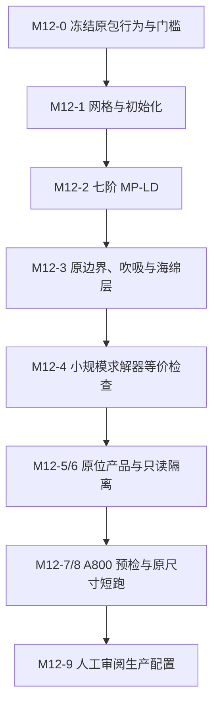

# M12_C13 原方法保留的 GPU 求解与原位可视化接入计划

创建：2026-10-08。源码检查基线：`478ced11e1f20975c8e7093d0dde85bbad596709`。

状态：已完成只读盘点，用户已确认采用原随机吹吸及共用主机供给方案；
本地 goal 已恢复，D1/D1a/D2 已确认；UDF 构建入口与原随机供给已接线。
非零种子映射、MP-LD 重构/通量、原边界与 x/y 海绵层已接线；八种本地拓扑的
十步逐阶段场、统计、内存安全及完整步私有梯度/Q 检查通过。
额外原始传感器值检查的数值放大原因已定位，D6 已批准并通过十步全阶段、八拓扑捕获输入重算及逐值一致激波标记；
M12-6 三类设备场景已构建；此前正面相机下 Q 面投影不足0.2像素的失败证据保留。
D7 仅 Q 面改用斜视后，NP=1 和 NP=2 的 x/y/z 三种拓扑实际出图及十步渲染 OFF/ON 隔离检查通过。
NP=4 共享本地两卡时的历史准入失败保留；已完成 D8 原子共享预算和分配生命周期扩展。
四种 NP=4 分解实际出图、十步 OFF/ON 数值/RNG 隔离及图形 memcheck 已通过。
八种拓扑的几何接缝已通过，NP=1/2 的关闭诊断独立传输已通过。
NP=4 的 Nsight 外部主机增量首次超过4 GiB，失败记录保留；D9提高采集预算后的四拓扑复测通过。
八拓扑干净短窗计时及六项受影响图形回归通过，最新无测试图形构建及八拓扑数值/出图复测通过。
M12-0至M12-6在获批本地范围完成，部署审核材料已准备；M12-7至M12-9及平台验收未开始。
用户要求保留原数值格式、边界条件和算例设置，在 A800 平台从头运行并开启原位可视化。
本文不授权修改外部算例包、执行 Git 写入、提交或干扰平台任务。

## 1. 目标与范围

目标是将外部 `M12_C13` 算例按原方法接入当前 ASTR GPU 求解器，
从二维初始场启动三维计算，在完整 RK 步结束后生成流线、Q 等值面和截面图片。
求解器状态、三维产品字段及最终几何保持设备驻留；图片读回、必要的小量控制信息
和明确记录的辅助通信不与三维流场或几何回读混称。

本轮不改为五阶迎风，不将 `bc50` 换成 `bc51/52`，不开启原先关闭的滤波，
不加入 AIR5、RANS/LES 或混合精度，也不重新生成不同分辨率的生产网格。
本计划不开展 NSCBC 边界改进或新的物理模型评估。
局部短测夹具与生产算例分开：夹具用于算子和接口验证，不代表生产工况物理收敛。

关联计划：
[GPU 顶层架构](ASTR_FULL_GPU_ARCHITECTURE_PLAN.md)、
[原位后处理](ASTR_INSITU_POSTPROCESSING_PLAN.md)、
[输出与续算](ASTR_OUTPUT_RESTART_REDESIGN_PLAN.md)。
既有门槛只作为实现参考，不自动授予本算例或 A800 生产规模准入。

## 2. 原算例基线

`CASE_ROOT` 表示外部只读 `M12_C13` 目录，不绑定个人账户或平台绝对路径。
原包的旧可执行文件、构建产物、网格和流场不随本计划加入源码 Git。

| 项目 | 保留值及实际含义 |
|---|---|
| 流动类型 | `bl`，单组分非反应流；原代码使用理想气体、`gamma=1.4` 和 Sutherland 黏度 |
| 参考参数 | `ref_tem=594.3`、`Re=1e4`、`Ma=12`，保留原无量纲定义 |
| 网格 | `2250×260×480` 个区间，全域含端点 `2251×261×481` 个节点 |
| 几何 | 非均匀正交笛卡尔网格，平直底壁；域范围 `1100×150×90`，不是压缩拐角 |
| 对流 | `743e`、`recon_schem=5` 即 MP-LD、`lchardecomp=t` |
| 对流附加参数 | `bfacmpld=0.5`、`shkcrt=0.01`，保留原传感器及重构选择逻辑 |
| 黏性与时间推进 | `diffterm=t`、`difschm=643e`、`rkscheme=rk3` |
| 滤波 | `lfilter=f`；不能因 GPU 准入而改成开启 |
| 边界顺序 | `11/prof, 21, 41/Tw=10, 50, 1, 1`，分别对应 x 下/上、y 下/上、z 下/上 |
| 吹吸 | 幅值 `0.12`、`beta=0`、`xa/xb/xc=20/40/60`、`nmod_t/nmod_z=1/3`；实际为原随机吹吸路径 |
| 海绵区 | `0,50,0,20,0,0`，同时保留 x 出口和 y 顶部的处理 |
| 初始化 | `lrestart=f`、`ninit=2`，读二维原始变量后沿展向复制，初始展向速度为零 |
| 网格入口 | `lreadgrid=f`；原 UDF 读取 `datin/grid.2d`，沿 z 挤出，`Lz=90` |
| 时间步 | 原 `deltat=0.02`；旧三维日志首步 CFL 为约 `0.5895`，不是新程序全时段稳定性证明 |
| 原步数上限 | `maxstep=1000000`，只是原文件设置，不是本计划批准的生产执行步数 |

配置依据为 `CASE_ROOT/datin/input.3d`、`controller`、`wallbs.dat` 和
`CASE_ROOT/user_define_module/userdefine_hbl.F90::udf_grid`。
物性依据为原包 `astr/src/solver.F90`、`fludyna.F90`，不能仅按目录名称推断工况。

现有 `datin/flowini2d.h5` 与 `outdat/flowfield.h5` 的六个原始字段逐值一致，
后者保存二维 `step=244000, time≈6100`；不是旧三维日志的续算检查点。
三维日志记录到 `step=1743, time=34.86`，本地未发现对应三维快照。
这些事实不阻碍从二维状态开始三维发展，但不能将展向复制的初态称为三维湍流场。

## 3. 起始能力与补齐内容

下表记录本轮实施前的缺口，当前完成状态以第4及11节为准。

| 接入项 | 当前事实 | 必须完成的工作 |
|---|---|---|
| 七阶迎风与 MP-LD | CPU 有 MP7LD；GPU 尚未准入该格式组合 | 实际移植重构、通量分裂、传感器耦合、特征分解和边界闭合，不仅修改白名单 |
| 顶面 `bc50` | 单组分 CPU 顶面与当前 `bc51` 顶面的有效外推处理相同；GPU 已有该外推算法 | 复用算法但保留 `bc50` 标识，补齐分派、ghost/halo、RHS 与组合检查 |
| 顶部海绵层 | 五变量 GPU 海绵模块目前只有 x 出口方向 | 增加 y 顶部，并匹配原执行顺序、交叠区及变量刷新时序 |
| 原随机吹吸 | 原包调用 `wallbs_rand`；当前 `nmod_t>0` 会进入时间模态并要求相位文件 | 单独接入原随机路径，不能把原参数改译为现有时间模态或静态空间哈希扰动 |
| 定制网格 | 原包使用 `userdefine_hbl.F90`；当前通用 `udf_grid` 为空 | 根 CMake 接入原挤出逻辑，保证坐标、展向长度和端点完全保留 |
| 初始化与入口 | 现有 `readflowini2d`、`prof` 读取可复用 | 核对 HDF5 维序、资源路径、剖面格式和状态方程；原七开关输入还需显式启用运行时 `usegpu` |
| 新输出资源契约 | 当前 `bl` 的资源引导预期已有三维 `grid.h5`，能力检查要求 `lreadgrid=t`、顶面 `bc51`；原 UDF 则读取 `grid.2d` | 注册二维挤出网格的资源身份与原 `bc50` 组合；关闭场输出也不能绕过初始化及能力检查；不伪造已有三维网格 |
| 原位准入 | 现有设备产品仍受 TGV、限定壁面及网格规模约束 | 为本 `bl` 组合建立独立能力检查，不能冒用 TGV 场景或全局删除拒绝条件 |
| 大规模运行 | 既有 256³ 展示不是本 2.83 亿节点工况的资源证据 | 实测求解器、Q、流线、几何、渲染及通信的总资源峰值 |

`bc51` 顶面虽然名为 farfield，但其远场混合公式在当前 CPU 中被注释，
有效代码仍为内部状态外推。复用该 GPU 外推核不等于把原物理边界改成自由来流目标。
本轮不接入 `bc52`，也不附加其特征松弛或顶面专用滤波。

吹吸的随机种子依赖 MPI rank，序列还依赖本地节点循环及调用次数。
将旧 2560-rank 配置改为少量 GPU rank 后，保留算法也不保证复现旧随机实现。
当前 GPU 的静态哈希扰动缺少原逐次调用的随机变化，不能作为无差别替代。
CPU/GPU 短窗对照需要同拓扑、同扰动输入；已冻结的供给方式见第3.1节。

### 3.1 已确认的原随机吹吸供给

2026-10-08，用户确认采用原随机吹吸，不将原 `nmod_t=1` 解释为当前时间模态。
沿用原算法：主机使用 Fortran `random_number`，采用已批准的非零种子映射，
按原 `k` 外层、`i` 内层的节点顺序，在每次实际壁面调用时为吹吸区抽样。
保留原 `20～40`、`40～60` 两段空间形状、第二段展向相位偏移 π/2，
以及幅值乘子 `1+0.1*(2*r-1)`；原随机路径的时间模态因子为 1。

CPU/GPU 共用主机供给接口。GPU 仅接收本地二维壁面速度数组，
不为此回读三维状态；现有时间模态及静态哈希路径作为原有可选功能保留，
不改变其默认分派，新增原随机路径须明确选择。
主机采样仅由真正的壁面更新驱动，初始化、RK 子步和最终边界调用的对应关系须核对；
后处理、能力检查和资源探针不得额外消费随机序列。

数值对照使用同编译器、同拓扑、同调用顺序及同一供给算法。
保留原随机算法不保证不同 Fortran 运行时、不同 MPI 分解或旧 2560-rank
配置的随机轨迹相同。需要精确重启时，随机序列及首次调用状态必须纳入权威状态；
完成其保存恢复验证前，不将本路径标记为精确重启已准入。

### 3.2 本地实施记录与当前阻碍

- 根 CMake 新增 `ASTR_USERDEFINE_SOURCE` 可选源文件入口，默认仍使用原通用模块。
  已用原包只读 `userdefine_hbl.F90` 完成 NVHPC 26.1 CUDA 构建；
  这只证明接口与链接可用，尚未证明原网格及初始场读取、度量和完整步等价。
- 新增显式 `ASTR_WALL_BLOWING_MODE=legacy_random`；未设置或选择 `current`
  时仍按原有时间模态/哈希分派。共用生成器位于 `src/wall_blowing_random.F90`，
  CPU 由 `bc` 调用，GPU 在底壁更新前上传二维数组。
- `legacy_wall_random_probe` 连续三次调用的数值检查在首次初始化失败：
  `random_seed: input seed must have at least one nonzero value`，进程退出码 127。
  原算法先使用全零种子生成未参与输出的相位，再使用 `seed=mpirank`；
  后一步对 rank 0 同样是全零，因此只删除临时相位初始化并不能解决问题。
- 候选兼容修订是临时种子改为 1、rank 种子统一映射为 `rank+1`。
  原抽样顺序、空间形状和 ±10% 扰动不变，但具体随机序列改变。
  用户已批准此修订，并已用于共用生成器及独立参考探针。
- 非零映射后，NVHPC 26.1 的 `legacy_wall_random_probe 0/1` 均通过：
  连续三次调用的吹吸值及最终 RNG 状态与独立原抽样顺序参考逐值一致。
  `legacy_wall_upload_probe 0/1` 均通过，主机二维供给与设备消费逐值一致；
  两卡 Compute Sanitizer memcheck 均为 `ERROR SUMMARY: 0 errors`。
  这是供给和上传门槛，不是完整 RK 调用顺序或整场 CPU/GPU 等价验收。
  实际种子为临时 `1`、各 rank `rank+1`；不宣称与旧全零/原 rank 种子序列相同。
- 原位和新输出的精确重启均须保存随机生命周期。当前可选路径明确拒绝
  旧 `lrestart` 和新 `restore_directory` 续算，避免恢复 q 后重置随机驱动。
- 本地夹具选点必须在两个吹吸区保留非零包络节点。
  按原网格索引等间距抽取 65 个 x 节点会漏掉全部 `20～60` 区域，不能用来验收吹吸。
  夹具需要显式登记选点规则；不得修改生产网格以满足短测。
- `src_gpu/solver_gpu.cuf` 已加入 `mp5ld_gpu`、`mp7ld_gpu` 与
  `reconstruct_mp_ld_stencil`，保留 CPU 的十进制系数、八点模板、
  MP7-LD 激波开关及近物理边界的中央/SUW3/MP5-LD 闭合。
  `mp_ld_reconstruction_probe` 直接以现有 CPU `recons_exp` 作参考，
  覆盖 12 个正反平滑/阶跃/交替/局部极值模板、3 个耗散权重、2 个激波状态、
  4 类边界归属及接口位置 -1:16，共 5184 个对照值。
  两卡最大绝对差均为 `4.4409e-16`，低于已批准的 `2e-10`；
  两卡 memcheck 均为零错误。根 CMake 的 `astr` 及探针构建通过。
  随后已接入生产物理/特征界面通量，包含八点正反采样、同阶段缓存、Roe
  分解、传感器标记及原边界闭合；`bfacmpld` 经设备常量供给，不固定为某一算例值。
  完整通量探针以 CPU `convrsduwd` 为参考，两卡四种边界布局、
  全平滑/全激波/混合标记对照最大绝对差 `6.9528e-15`，两卡 memcheck 零错误。
  首次探针差异来自夹具漏设 `ndims=3`，CPU 未计算 z 通量；仅修正探针。
- 新增限定的 `gpu_profile_mp_ld_flatplate_supported` 入口，保留 `743e/643e`、
  `recon_schem=5`、特征分解及 `11/21/41/50/1/1`，不准入滤波、多组分、其他
  顶面或圆形海绵。`bc50` 保留原标识，复用单组分顶面有效外推核。
- GPU 增加 y 顶部海绵，并保持每个 RK 更新后的 x 再 y 顺序。
  CPU 每个海绵方向调用 `dataswap(q)`，仅更新 `hm` 层 halo；此前 GPU 入口
  还平均共享节点，属于移植语义偏差。GPU 已改为 `exchange_field_halo_gpu`，
  正常推进的共享节点平均不变。本地 NP=1、NP=2 的 x/y/z、NP=4 的
  `4x1x1/2x2x1/2x1x2/1x2x2` 算子对照覆盖 x、y、交叠区及无本地海绵的
  通信参与者，最大绝对差 `1.7764e-15`。NP=2 x 分解 memcheck 零错误。
- 新输出入口注册原 UDF 的 `datin/grid.2d` 资源身份，不要求启动前存在三维
  `grid.h5`。当前挤出 UDF 的资源重绑定与 RNG 生命周期尚未验收，仍拒绝恢复。
- `prepare_m12_local_case.py` 从原文件选取 65 个 x、33 个 y 节点，原值不插值：
  x 为均匀物理目标的最近原节点，y 为均匀原索引取整，z 沿原 UDF 挤出。
  原吹吸两段各保留非零点 `x=32.4/54`。输入文本转换为 LF，只改夹具尺寸、
  运行时 `usegpu`、十步上限和测试输出；为严格首错停止关闭 `lcracon`，
  不启用原先关闭的滤波。原包未修改，选择索引及源文件哈希保存在测试收据中。
- 首轮单 rank CPU/GPU 各完成十个完整步：首末步各阶段 q 最大绝对差
  `5.9952e-15`，原 `flowstate.dat` 统计最大差 `5.6399e-14`，每步 CFL 小于
  `0.062`。最终 q 对应第三 RK 更新及 x/y 海绵后状态；旧统计仍在第一 RK
  阶段列出，不能称为同一完整步结束相位。此轮不是所有步的逐阶段保正证明。
  后续 `run_m12_local_compare.py` 使用显式验证选步区间保存初态及全部十步
  三个 RK 阶段，并分别检查 q、统计、坐标/度量、正密度/正内能和 CFL。
  诊断快照允许场回读，仅供有界数值检查，不属于严格设备渲染或性能计时。
  初步结果位于忽略的 `tests/gpu_validation/out/m12_d2_20261008/`；
  全窗与多拓扑证据须另列通过记录，不能提前使用本轮结果放行原位产品。

## 4. 实施顺序



| 步骤 | 内容及交付 | 进入下一步的条件 | 当前状态 |
|---|---|---|---|
| M12-0 基线冻结 | 对照原包与当前 CPU 的有效代码，登记网格、物性、对流、边界、吹吸、海绵层及调用顺序；冻结第8节决策 | 未批准差异不进入等价移植；测试矩阵、门槛和预算明确 | D1/D1a/D2/D3/D4 已确认；平台 D5 待确认 |
| M12-1 网格及初始化 | 根 CMake 接入原 UDF 网格；保留二维场和入口剖面读取，调整输入接口而不改物理值 | 坐标、初始化字段和剖面匹配；几何度量有限，Jacobian 正；CPU/GPU 初始权威状态匹配 | 八种本地拓扑初态、坐标及十组度量检查通过，Jacobian 正 |
| M12-2 数值核 | GPU 七阶迎风、MP-LD、物理/特征分支、所需 halo 与原闭合；保留六阶黏性和 RK3 | 平滑区、传感器激活区、边界及 MPI 接口分别对照；内存安全通过 | 重构、通量、完整 RHS 及八种拓扑 memcheck 通过；原始传感器差的诊断见第11节，组合准入不提前放行 |
| M12-3 边界与驱动 | `bc50` 分派、原随机吹吸、x/y 海绵层，复核各阶段状态和 RHS | 同拓扑同扰动下逐项及联合作用匹配；海绵交叠区无遗漏；缓存与 q 同阶段 | 原随机、bc50、x/y 海绵及八种拓扑逐阶段十步场检查通过；海绵保留 CPU dataswap 的仅 halo 交换语义 |
| M12-4 求解器组合 | 专用能力检查及短窗 CPU/GPU 对照，含 NP=1/2/4 与生产候选拓扑 | 场、统计、严格有限性及共享接口通过；明确随机样本与数值误差的区分 | D2 与已批准 D6 联合通过八种本地拓扑、十步三阶段矩阵；仅为限定短窗组合准入，不覆盖生产网格或长时物理验证 |
| M12-5 设备诊断 | 完整步私有梯度/Q、非均匀坐标、壁面/开放边界闭合和速度产品供给 | 仿射场及同状态 CPU/GPU 导数对照；不复用上一 RK 子步的过期梯度 | 八种拓扑完整步私有诊断及仿射场检查通过，测试观察器不改变 q 或 RNG；尚不是严格设备渲染传输验收 |
| M12-6 场景及隔离 | 流线、Q 面、物理截面；设备处理/渲染、跨 rank 接缝、资源计量与开关对照 | 原位开关不改变权威场或随机序列；实际出图、跨 rank 连续性和传输检查通过 | 本地完成：D8保护、出图、隔离、memcheck、接缝、八拓扑严格传输、干净短窗成本、六项图形回归及最新无测试图形构建/复测通过；不授予平台或原尺寸准入 |
| M12-7 平台依赖 | A800 编译、HDF5/MPI/Catalyst/ParaView/VTK/Viskores/EGL 及设备绑定预检 | 登录节点构建/依赖检查与计算节点 GPU/渲染探针分别通过 | 未开始 |
| M12-8 原尺寸短跑 | 原网格与 `dt=0.02` 的分段扩展；先初始化和少量计算，再分别开启产品，最后组合 | CFL、状态、内存、图像与逐阶段成本满足批准值；无三维场及最终几何回读 | 未开始 |
| M12-9 生产审阅 | 提交完整配置、短跑证据、资源估算、出图与文件策略、监测和退出条件 | 用户审阅并明确授权后才能提交；长时统计收敛另行验收 | 未开始 |

M12-4 的局部小网格仅是验证夹具；M12-8 必须回到原网格和原输入。
任一步科学或数值门槛失败，应停止后续阶段，不继续生成性能结论或物理验收图。

## 5. 原位产品与传输要求

| 产品或环节 | 接入要求 |
|---|---|
| Q 等值面 | 沿用现有 Q 定义，使用同完整步速度及私有物理梯度；覆盖非均匀度量、底壁、入口、出口、顶面和 MPI 接口；不得套用周期 TGV 闭合 |
| 流线 | 接入边界层种子，使用物理坐标和已验证的 FP64 积分实现；重新确定有量纲或无量纲长度/步长设置，不直接复制 TGV 参数；检查跨 rank 轨迹 |
| 流线终止 | x/y 开放面、底壁及 z 周期面的图形处理分别明确；若不做周期回绕，应标识几何截断，不能称为真实开放边界 |
| 截面 | 使用本域的物理平面或索引面；验证非立方尺寸、位置、绕序、退化及 MPI 接缝，字段与完整步状态一致 |
| 图形配置 | 冻结相机、色标、Q 阈值、种子和输出间隔；初态不作为已发展三维湍流展示；不默认采用 Q=0 或逐步输出 |
| 设备管线 | 保留 `standard-device` 与 `direct-device` 可选入口；首轮已批准 `standard-device`，私有 halo 使用 pinned 主机缓冲；不将一路通过外推为另一条生产准入 |
| 严格图片路径 | 不下载三维流场或最终几何，不通过主机兼容路径静默兜底；记录字段、halo、产品、图像、控制信息的实际传输 |
| 采样隔离 | 完整 RK 步后只读采样；私有 halo/导数不能回写主推进，不额外调用会改变状态或消耗随机数的边界处理 |
| 调度及输出 | 首轮明确固定 steps/time 出图方式，JPEG/EPS 成对；整场、切片数据和检查点开关另列；PF/AP 的 TGV 门槛不自动扩展到本工况 |

后处理私有梯度属于诊断离散，不替换原求解器的空间格式。
需要先与 CPU 诊断参考核对闭合、度量和相位，不能用“图像看起来连续”替代数值验证。
如需展示已有壁面统计产品或时间平均流线，应另列覆盖与累积门槛，
不以本轮瞬时产品通过自动认证长期统计功能。

## 6. 最小验收矩阵

下表规定验证对象；本地网格、步数、D2 指定量的误差和资源上限已冻结。
`≤2e-10` 不自动成为所有派生量的通用阈值；原始传感器采用已批准 D6 的捕获输入重算及逐值一致激波标记。

| 验证组 | 至少覆盖的内容 | 必须区分的结论 |
|---|---|---|
| 初始化 | 原二维网格/场、展向端点、入口剖面、状态方程 | 资源正确读入，不等于三维湍流已经形成 |
| 七阶算子 | 平滑/激波标记区、正反通量、物理/特征分支、原边界闭合 | 分支对照与 MPI 接口对照，不只测试内点 |
| 边界驱动 | 11/21/41/50/周期组合；给定吹吸样本；x/y 海绵及交叠区 | 边界等价与扰动样本相同，不将样本差异归咎于 GPU 舍入 |
| 求解短窗 | CPU/GPU NP=1/2/4，至少覆盖生产候选拓扑 | 同拓扑同扰动逐场误差、守恒/统计误差、有限性、内存安全分别报告 |
| 诊断 | 仿射速度场、实际完整步场、壁面/开放面/接口梯度与 Q | 求解器导数与诊断导数分开，Q 定义与提取阈值分开 |
| 实际产品 | 流线跨分区，Q 面与切片接缝、绕序和退化处理，图像时间/字段身份 | 合成解析验证与真实场展示分开 |
| 原位隔离 | 同一求解器配置和扰动下，可视化 OFF/ON | 权威 q 与吹吸随机状态不被观察器改变；检查实际场/几何传输 |
| 资源及性能 | 各产品单独开启和组合；首次初始化、稳定推进、梯度、提取、积分、渲染、合成、编码 | 不把启动时间当 RK 时间，不重复相加嵌套计时，不承诺预设加速比 |
| 回归 | 原位关闭构建、现有五阶/中心 GPU 算例、原位既有受影响范围 | 新工况不改变已有默认格式、边界或准入 |

长时湍流轨迹可能因微小误差分离，不能把所有长期轨迹要求为逐值一致。
短窗同状态对照与长窗统计验收应采用不同判据，判据不能在看到结果后临时放宽。

## 7. A800 运行与资源预检

采用根 `CMakeLists.txt` 构建，`usegpu` 仍为输入文件的运行时选择。
平台操作遵守仓库 `AGENTS.md` 的远程目录限制，不在本文件保存账户或主机信息。
平台提交必须另获明确授权。

| 检查项 | 要求 |
|---|---|
| 构建及依赖 | 核对 NVHPC、CUDA、MPI 与并行 HDF5；Catalyst/ParaView 设备管线需要可复现的依赖及已有补丁，不能假定普通 ParaView 包可直接替代 |
| 登录/计算节点职责 | 登录节点编译和检查动态链接；只有计算节点 GPU 探针能证明 CUDA 及 EGL 渲染可用；无 GPU 的登录节点不能替代该检查 |
| MPI 与设备 | 一 rank 一 GPU，核对 rank 到设备绑定；host-staged 与 CUDA-aware MPI 明确选择，不因名称认为设备直连已生效 |
| 图形依赖 | 核对每 rank 的 EGL 设备、FP64 设备产品、所选通信/互操作能力；不依赖桌面显示或静默切换 CPU 渲染 |
| 候选分解 | 如采用四卡，`NP=4, topology=4×1×1` 是待验证候选；检查 x 非整除分块、halo、共享节点和吹吸，不直接沿用旧 `64×5×8` |
| 内存 | 一个全域五分量 FP64 数组名义约 `10.53 GiB`，坐标约 `6.32 GiB`，均未计 halo、rank 重复节点和其他工作区；不得当作实际总显存 |
| 后处理规模 | Q=0 可能产生大量几何；种子数、每粒子点数、临时几何、VTK/渲染缓冲和图像合成都纳入峰值预算，不照搬本地 256³ 预算 |
| 原时间步 | 保留 `dt=0.02` 作为原配置检查；超过批准 CFL/有限性门槛即停止并报告，不自动降低步长后继续宣称原配置通过 |
| 文件策略 | 正式任务明确图片频率、磁盘预算和场/检查点开关；不默认导出每步整场或几何；原位图片不替代精确续算状态 |

首次从头运行不需要旧 checkpoint。若正式批次要求新格式精确重启，
还须验证原随机吹吸状态、输入资源、原位时钟与求解器状态的完整保存恢复；
现有 TGV 的精确续算结果不能替代本算例验证。

## 8. 实施前需冻结的决策

| 编号 | 待确认内容 | 不可静默采用的替代 |
|---|---|---|
| D1 已确认 | 原随机算法、共用主机二维壁面供给接口；同编译器同拓扑同调用顺序作 CPU/GPU 对照。具体短测拓扑随 D2 冻结，精确重启另验 | 时间模态、固定空间哈希，或承诺四 rank 复现旧 2560-rank 随机轨迹 |
| D1a 已确认 | NVHPC 不接受全零种子；临时种子取 1、rank 种子采用 rank+1，保留其余算法并明确新的随机序列 | 静默更换随机数算法，或仍宣称复现旧随机轨迹 |
| D2 已确认 | 64×32×24 区间、dt=0.02、10 个完整步；NP=1，NP=2 x/y/z，NP=4 的 4×1×1、2×2×1、2×1×2、1×2×2；同拓扑权威场、统计量、同状态诊断梯度/Q 最大绝对差≤2e-10，物理节点有限、rho/T>0、CFL≤1；每卡附加显存≤2 GiB、节点附加主机内存≤4 GiB、每卡空闲≥1 GiB、每运行目录≤4 GiB，首个失败即停 | 将小网格接口验证称为生产网格或物理收敛验收；看到误差后改容差 |
| D3 已确认 | 首轮 `standard-device`，私有 halo 使用 pinned 主机缓冲；物理截面 z=45，Q_rs=0.001，速度模长色标 [0,1.1]；x=54，y=0.5/1/2/5 四层，每层16点沿 z 在 [90/32,90-90/32] 均布；双向 RK45，物理长度初始/最小/最大步长 0.5/0.01/5，误差控制 1e-8，每方向弧长上限1200、积分上限4096步，到盒外表面终止，不做 z 周期回绕；相机 (550,75,900)，焦点 (550,75,45)，view-up +y，平行投影尺度150；1536×384 JPEG/EPS | 冒用 TGV 场景、种子或积分长度；将几何截断称为物理开放边界；将短窗展示称为充分发展湍流验收 |
| D4 已确认 | 第5、10个完整步结束后出图，无初始帧，不累计时间平均；不写三维场、切片数值数据或 checkpoint，仅 JPEG/EPS；每运行目录≤4 GiB；本轮不扩展自适应频率或精确重启 | 默认每步出图、默认开启整场序列，或顺带开启未准入的自适应频率 |
| D5 | A800 卡数/显存、拓扑、原尺寸短跑窗口、CFL 门槛、预算和生产总步数/机时 | 从原 `maxstep=1000000` 推定已获提交和机时授权 |
| D6 已确认 A | 保留算法，以各端捕获输入的 FP64 重算核对原始传感器计算，残差≤2e-10；捕获梯度及实际使用压力的 CPU/GPU 差≤2e-10，激波标记逐值一致。不同推进轨迹的原始传感器差另行报告，D2 及 RHS/梯度门槛不变 | 删除重算或标记检查；调整 1e-30 或 shkcrt；把有限短窗的标记一致性推广为长时保证 |
| D7 已确认 A | 仅 Q 面相机改为 (550,375,900)，焦点 (550,75,45)，view-up +y，平行尺度150；截面与流线仍用 D3 相机，Q_rs=0.001 及全部数值/资源门槛不变。先重新通过 NP=1 出图，再扩大拓扑 | 将只有色标的图当作实际 Q 图验收；顺带调整其他相机、Q 阈值或数值场 |
| D8 已确认 A | 仅为64×32×24、NP=4本地夹具扩展共享 GPU 分配保护；同卡总预算2 GiB、主机4 GiB及设备空闲1 GiB门槛不变，分配请求原子计入预算、释放后归还；先通过并发超额拒绝测试，再恢复四 rank 图形矩阵 | 直接取消单 rank 保护；将每卡2 GiB误算为每 rank 2 GiB；扩大通用 CURVE 或生产规模准入 |
| D9 已确认 | 仅 NP=4 的 Nsight 采集，外部20 ms进程树附加RSS预算提高为8 GiB；原生后处理主机4 GiB、每物理GPU附加显存2 GiB、空闲显存1 GiB及每目录4 GiB不变；仍限于D2十步夹具 | 将分析工具预算作为普通运行或生产默认；放宽原生分配保护、显存或磁盘预算 |

发现原包或当前 CPU 的明确数值缺陷时，应提供可达代码及对照证据，
由用户决定是否修复或改变本轮等价性目标。不得直接复制缺陷到 GPU，
也不得擅自修正后声称保持了原方法。

## 9. 完成条件与暂停条件

接入完成要求：

1. 原输入、网格、初始化、物性、七阶 MP-LD、边界、吹吸和海绵处理均有明确映射及对照证据。
2. 同拓扑同扰动短窗数值、MPI 接口、有限性、内存安全和受影响回归分别通过。
3. 三类原位产品在完整步相位正确出图，可视化开关不改变权威场或随机序列。
4. 所选严格设备管线无三维场及最终几何回读；其他传输及峰值资源有记录。
5. 完整接入还要求 A800 原尺寸短跑通过、提交配置和成本估算经人工审阅；
   本地 goal 仅包含 M12-0 至 M12-6 及部署准备，不把未授权的 M12-7 至 M12-9
   列为本地执行项，平台条件尚未满足时不得宣称生产接入完成。

出现未批准的方法变化、CPU 缺陷、未冻结验收含义、资源超限、
数值门槛失败或需要操作平台任务时，暂停相应后续动作并报告。
本轮接入通过不等于边界层统计定常或 DNS 分辨率物理验收。

## 10. 源码定位

| 模块 | 当前文件及核查重点 |
|---|---|
| 原包有效配置 | `CASE_ROOT/datin/input.3d`、`controller`、`wallbs.dat`、`inlet.prof`、`grid.2d`、`flowini2d.h5` |
| 原包专用行为 | `CASE_ROOT/Makefile.astr` 的 UDF 选择；`user_define_module/userdefine_hbl.F90::udf_grid`；`astr/src/bc.F90::noslip, wallbs_rand` |
| CPU 重构参考 | [src/flux.F90](../src/flux.F90)，`MP7LD` 及 `recon_schem=5` 分派；原包与当前版本差异由 M12-0 核对 |
| GPU 准入与推进 | [src_gpu/case_capability_gpu.cuf](../src_gpu/case_capability_gpu.cuf)、[src_gpu/mainloop_gpu.cuf](../src_gpu/mainloop_gpu.cuf) |
| 边界与吹吸 | [src/bc.F90](../src/bc.F90)、[src_gpu/boundary_gpu.cuf](../src_gpu/boundary_gpu.cuf)，特别是原随机行为和上侧外推 |
| 海绵层 | [src/sponge_layer.F90](../src/sponge_layer.F90)、[src_gpu/sponge_gpu.cuf](../src_gpu/sponge_gpu.cuf) |
| 网格与初始化 | [src/CMakeLists.txt](../src/CMakeLists.txt)、[src/gridgeneration.F90](../src/gridgeneration.F90)、[src/initialisation.F90](../src/initialisation.F90)、[src/readwrite.F90](../src/readwrite.F90) |
| 原位会话与字段 | [src/insitu_session.F90](../src/insitu_session.F90)、[src/insitu_run_config.F90](../src/insitu_run_config.F90)、[src/insitu_fields.F90](../src/insitu_fields.F90) |
| 设备诊断与产品 | [src_gpu/insitu_sample_gpu.cuf](../src_gpu/insitu_sample_gpu.cuf)、[src_gpu/insitu_products_gpu.cuf](../src_gpu/insitu_products_gpu.cuf)、[src_gpu/insitu_device_products.cu](../src_gpu/insitu_device_products.cu) |
| 几何与流线 | [src_gpu/insitu_plane_products.cu](../src_gpu/insitu_plane_products.cu)、[src_gpu/insitu_device_curve_trace.h](../src_gpu/insitu_device_curve_trace.h)、[src_gpu/insitu_streamline_seeds.h](../src_gpu/insitu_streamline_seeds.h) |
| 渲染与预算 | [src/insitu_mesh_adapter.cpp](../src/insitu_mesh_adapter.cpp)、[src/insitu_resource_budget.F90](../src/insitu_resource_budget.F90)、[scripts/insitu/device_render_pipeline.py](../scripts/insitu/device_render_pipeline.py)、[scripts/insitu/patches/README.md](../scripts/insitu/patches/README.md) |

这里只登记已存在的参考文件和入口，不预设必须新建的模块数量。
GPU 新实现优先位于 `src_gpu/`；`src/` 修改限于共享接口或另获批准的 CPU 修复。

## 11. 本地证据及传感器审查（2026-10-08）

### 11.1 已通过的有界检查

证据目录均位于 `tests/gpu_validation/out/`，不加入 Git：

- `m12_d2_full_window_20261008/`：八种 D2 拓扑、十个完整步及全部三阶段。权威场最大差 `5.9952e-15`，统计最大差 `5.9730e-14`，CFL 最大 `0.06215`，密度与内能严格正；生成坐标及十组度量 CPU/GPU 逐值一致。
- `m12_diagnostics_np1_20261008/` 与 `m12_diagnostics_matrix_20261008/`：八种拓扑、第1和10完整步共46对私有14分量文件，CPU/GPU 最大差 `3.7748e-15`；仿射场解析最大差 `1.9049e-13`，同状态 GPU/CPU 诊断最大差 `1.1102e-16`。观察器不改变 q 的位模式或 RNG 状态。
- `m12_diagnostics_memcheck_20261008/`：八种拓扑、23份 rank 级 memcheck 日志零错误；采样进程树 RSS 峰值约 `2143.53 MiB`，每物理 GPU 本作业显存峰值 `716 MiB`，设备最小空闲约 `17.47 GiB`，各目录低于4 GiB。
- 对上述诊断目录复查全部轴向对流、完成对流和完整 RHS：轴向 CPU 快照取自 `qrhs=-qrhs` 之前，比较时正确统一符号；最大差 `4.4388e-11`。690对原始传感器文件的激波标记逐值一致。

私有诊断测试为验收显式下载小网格字段，不能作为正式图片通道无场/几何回读的证据。
已有门槛的通过不覆盖尚未完成的 M12-6 渲染或生产网格。

### 11.2 原始传感器差的原因

CPU `commcal::ducrossensor` 与 GPU `raw_shock_sensor_kernel` 的传感器均为

$$
\mathrm{ssf}=\frac{(\nabla\cdot\mathbf{u})^2}{(\nabla\cdot\mathbf{u})^2+|\nabla\times\mathbf{u}|^2+10^{-30}}
\max(C_{p,x},C_{p,y},C_{p,z}),
$$

其中 $C_p$ 是对应方向的归一化压力二阶差分。
两端使用相同差分闭合和物理边界索引规则。未修改传感器、阈值或 CPU/GPU 差分。

`m12_sensor_detail_first_last_np1_20261008/sensor_root_cause.json` 保存首步和末步全部三阶段的真实生产梯度/压力捕获及分解结果。
最大差出现在第10完整步第二 RK 阶段、节点 `(64,32,18)`：

| 量 | CPU | GPU |
|---|---|---|
| 速度散度 | `-3.2139e-17` | `1.7383e-20` |
| 散度平方 | `1.0329e-33` | `3.0216e-40` |
| Ducros 比值 | `1.0318e-3` | `3.0155e-10` |
| 最大归一化压力曲率 | `2.0761e-3` | `2.0761e-3` |
| 原始 ssf | `2.1421881e-6` | `6.2606803e-13` |

该阶段全物理域梯度最大差 `3.4417e-15`，传感器实际使用的压力最大差 `1.2794e-15`。
原始传感器最大差 `2.1421874e-6`，梯度比值的贡献为 `-2.1421874e-6`，压力曲率贡献仅 `2.9527e-24`。
分别用捕获的各端输入重算，其传感器输出残差均不超过 `1.3878e-17`；差值分解残差不超过 `1.4834e-17`。
因此该点差异由近零梯度的舍入量级差经非线性比值放大解释，而不是压力曲率错位。
首步的最大差点 `(64,32,17)` 也显示同一机制。现有证据未发现阶段状态混用或不同边界闭合。
尚未单独隔离编译器 FMA 与其他浮点求值顺序的贡献，不把 FMA 指定为唯一来源。

诊断脚本 `tests/gpu_validation/analyze_m12_sensor_diagnostics.py` 只读取传感器真正使用的压力位置；
未使用的外部 halo 棱角不作为有限性或压力差比较对象。
探针经阶段参数修正后，使用 GPU 局部阶段号，不读错 CPU 全局阶段号；
首轮显式 `ASTR_M12_SENSOR_DETAIL=1` 仅在批准的64×32×24夹具捕获第1、10步三个阶段。
批准 D6 后，该探针扩展为捕获请求范围内所有 RK 阶段，并写入各方向物理边界/内部接口标识，避免多 rank 重算时错误裁剪 MPI halo。
与启用探针前的 NP=1 证据比较，CPU/GPU 各61份权威场物理节点位模式完全不变。
`m12_sensor_detail_memcheck_np1_20261008/` 对新增探针复跑十步，GPU memcheck 零错误；
节点采样 RSS 峰值约569 MiB、作业设备显存峰值388 MiB，各运行目录低于0.7 GiB。
根 CMake 构建及13项 M12 源码/诊断算术测试通过，原始传感器严格检查仍按预期报错，不能写成整组验收通过。

该诊断不意味着长时所有工况的激波标记都不会变化，也未证明传感器正则项的普适合理性。
此前新增的原始 ssf 全域 `≤2e-10` 检查失败记录保留；它不属于 D2 已批准量的独立门槛。
本次用户选择 D6 方案 A，正式脚本改为全阶段捕获输入重算、输入精度与逐值一致标记的联合验收。
原始 ssf 的跨轨迹差仍完整报告，不再设通用绝对门槛。全阶段矩阵通过后才放行 M12-6。

`m12_d6_full_stage_20261008/` 已完成八种拓扑的十步三阶段矩阵，共690对传感器输入文件。
各端独立 FP64 重算最大残差 `1.3878e-17`，捕获梯度 CPU/GPU 最大差 `3.6082e-15`，实际使用压力最大差 `1.2984e-15`。
激波标记零不一致；含共享节点重复计数的约1336万节点样本中，约451万标记激活，不是仅比较全零掩码。
跨轨迹原始 ssf 最大差仍为 `2.1421874e-6`，按已批准口径报告。q、统计、完整 RHS 与私有完整步诊断仍通过原严格门槛。
该结果关闭本地 D6，允许继续 M12-6，不改变传感器或物理边界。

### 11.3 可重复的诊断命令

在本仓库根目录运行：

```bash
python3 tests/gpu_validation/analyze_m12_sensor_diagnostics.py \
  --cpu tests/gpu_validation/out/m12_sensor_detail_first_last_np1_20261008/cpu_np1_1x1x1 \
  --gpu tests/gpu_validation/out/m12_sensor_detail_first_last_np1_20261008/gpu_np1_1x1x1 \
  --output /tmp/m12_sensor_diagnosis.json
```

输出文件必须尚不存在，避免覆盖已有证据。此命令生成原因分解及 D6 捕获输入检查；旧目录只有六阶段，不替代十步全阶段矩阵。

### 11.4 M12-6 首轮图形接入及历史阻碍

根 CMake 的 `build_m12_device_render` 已构建求解器、私有设备产品及 Catalyst/ParaView/EGL 路径。
新增的 `boundary_layer`/`bl-layered64` 预设只准入 D2 的64×32×24本地夹具，
不因此准入原始生产尺寸或其他场景。

首轮检查已修正四个本地接入问题，未改变 CPU 数值算法或原算例输入：

1. 物理平面解析同时允许已冻结的边界层组合预设，仍拒绝未批准的参数组合。
2. 原 `userdefine` 在 `lreadgrid=f` 时也生成并读入物理网格。边界层产品显式供给实际坐标，
   不根据该输入开关错误套用周期 TGV 坐标。
3. 物理截面显示只依赖速度或其设备端模长，不要求未供给的 Q 字段；原单独截面的 u 标量路径保留。
4. GPU-OFF/GPU-ON 中间 RHS 使用同号比较；CPU/GPU 的三个按轴中间量仍保留已核实的反号关系。
   相机裁剪范围改为实际物理域 `[0,1100]×[0,150]×[0,90]`，不沿用 TGV 的 `[0,2π]`。

不可变证据目录：
`tests/gpu_validation/out/m12_render_np1_bounds_diagnostic_20261008/`。
两个运行均完成十步；各61份权威 q 快照、180份 RHS/传感器快照及原统计量的 OFF/ON 差均为0。
两次实际渲染调用前后还比较全 q 位模式及 RNG 状态，均未改变。
Q 面与流线的设备字段/显示核查通过；截面平面残差为0，无反绕序或零面积三角形。
20 ms 外部采样报告附加主机峰值差约505 MiB、附加设备峰值差329.125 MiB，设备最少空闲约17.61 GiB，
未越过 D2 预算。此运行含显式验证下载，不构成严格设备图片路径的无三维场/几何回读证据。

人工图像检查及排除右侧色标的像素检查未通过 Q 图。
第10步 Q 面实际有123点、114个三角形，GPU 归约包围盒为
`x∈[0,80.3389]，y∈[0,0.126653]，z∈[0,90]`；第5步 y 厚度约0.115277。
D3 相机沿 -z 正视、平行尺度150、图高384，投影高度分别约0.162与0.148像素。
因此不能用“几何非空”或“色标有像素”宣称实际 Q 出图通过。
截面和流线实际可见；本次用户已批准 D7，仅将 Q 相机改为斜视。
上述正面图失败证据保留，不将批准本身记作验收通过。

D7 复测证据：
`tests/gpu_validation/out/m12_render_np1_d7_20261008/`，以及
`tests/gpu_validation/out/m12_render_matrix_d7_20261008/` 中的
`graphics_2x1x1.json`、`graphics_1x2x1.json`、`graphics_1x1x2.json`。
NP=1及NP=2三种slab均完成十步；第5、10步三类 JPEG/EPS 通过实际几何像素与身份检查。
渲染 OFF/ON 的权威 q、RHS和统计最大差为0，实际调用前后全 q 位模式和 RNG 状态不变，
资源未超过 D2 门槛。斜视 Q 图只是该短窗实际场展示，不代表已发展湍流。
这些运行仍含显式数值诊断下载，不代替关闭诊断后的严格设备传输验收。

矩阵随后在 `on_np4_4x1x1/run.log` 首次渲染前停止：
`CURVE device allocations require an active resource guard`。
原因是 `src/insitu_resource_observer.cpp` 的 `astr_insitu_allocation_guard_active`
明确要求每张物理 GPU 只有一个本作业 rank；NP=4 共享两卡不满足此条件。
原生观察器已启动，但共享设备的并发分配保护尚未准入；不是已证实的预算超额或数值失败。
其余三种 NP=4 图形运行未启动，不能记为通过。现有大规模 CURVE 单 rank/卡限制不变。
恢复四 rank 图形检查前须确认并完成 D8，不通过删除该保护绕过失败。

首轮后续顺序为：解决共享设备分配准入，再完成批准的 NP=4 图形及接缝检查、
图形内存安全、关闭所有诊断下载后的独立传输检查、受影响原位回归和无测试构建。
此处为当时未完成记录；最终结果见11.6至11.10节，不删除历史失败。

### 11.5 已准入 NP=1/2 的图形内存安全

D8 批准前，独立完成已准入单 rank 及双 rank x/y/z 的图形内存安全检查，
不绕过 NP=4 保护。`run_m12_insitu_acceptance.py` 新增显式 `--memcheck --sanitizer PATH`，
复用已有数值驱动的逐 rank 检查、首错停止、十步长度和 D2 资源限制。
缺失 sanitizer 参数时先报错，不创建测试目录或启动求解器。

证据目录：`tests/gpu_validation/out/m12_render_memcheck_d7_20261008/`。
四种拓扑分别完成 OFF/ON 两个运行，14份 rank 级 Compute Sanitizer 日志全部
`ERROR SUMMARY: 0 errors`，无屏蔽规则。三类图像、第5/10步身份和28项设备字段/显示审计通过；
OFF/ON 权威 q、RHS及统计最大绝对差为0，渲染调用前后 q 位模式及 RNG 不变。
20 ms 外部监测的最大附加主机峰值差为2390913024 B，最大每卡附加峰值差435294208 B，
最少设备空闲18714132480 B，均满足 D2。检查工具运行时间不作为性能数据。
这仍是带验证下载的有界测试，不证明严格设备路径无三维场或最终几何回读，
也不覆盖 NP=4、生产尺寸或完整跨分区几何接缝验收。
入口与既有比较器的6项测试及7个子测试通过。

### 11.6 D8 共享双卡的有界准入

用户批准 D8 后，增加每物理 GPU 的跨进程原子预算账本。
仅准入64×32×24、NP=4、standard-device/pinned 的本地夹具，要求同节点两张卡、
每卡两个 rank；附加设备预算不超过2 GiB、主机不超过4 GiB、空闲设备至少1 GiB。
通用大规模 CURVE 的单 rank/卡限制仍保留。账本由 MPI 共享内存窗口及进程共享
robust mutex 实现，请求先预留，实际分配成功后登记，实际释放后归还。
延迟释放仅入队时不归还，失败分配取消预留。整数溢出、重复释放及并发超额均拒绝。
观察到的设备增量与未释放预留同时计入，属于保守准入，不承诺拦截任意第三方 OOM。

依赖补丁 `scripts/insitu/patches/paraview-6.1.1-shared-allocation-lifecycle.patch`
只扩展 Viskores CUDA/OpenGL 分配生命周期通知，不改提取、插值或 RK45 数学。
两个版本符号均须为1；未补丁的依赖不允许共享卡保护静默失效。
补丁逆向无 fuzz 干跑及相关模块重建通过，复现说明见同目录 README。

不可变证据：

- `m12_d8_allocation_20261008/results_v2.xml`：5项通过、1项未选择的旧实际场测试跳过。
  纯主机32轮双进程同时申请600 B/1000 B预算，每轮仅放行一份，释放后恢复为0；
  实际 NP=4 CUDA 即时及延迟释放检查每卡6次准入/6次释放，最终 held=0。
  两 rank 同卡同时申请12 MiB/16 MiB预算时，在实际大分配前拒绝超额。
  首次 pytest 的显式临时目录父路径错误保留，不将其归咎于 CUDA 或 MPI。
- `m12_render_np4_d8_20261008/`：四种 NP=4 分解，十完整步 OFF/ON，
  第5/10步三类实际 JPEG/EPS、场及显示审计通过；q、RHS、原统计最大差0，
  每次渲染前后 q 位模式与 RNG 不变。
- `m12_render_np4_memcheck_d8_20261008/`：同四种分解各 OFF/ON，32份 rank 级
  memcheck 日志全部零错误；同样通过实际出图与数值/RNG隔离。
  20 ms外部采样最大附加主机峰值差4089094144 B、最大每物理卡附加峰值差809771008 B，
  最少设备空闲17982685184 B，均在原D2预算内，不按每 rank 重复预算。

上述图形运行的共享账本最终归还为0，分配和释放计数一致。
它们仍含数值诊断下载，不能代替严格设备传输验收。
新增 `run_m12_device_observation.py` 将有界几何下载与干净 Nsight 记录分开，
分别检查接缝/轨迹交接及实际 CUPTI/NVTX 传输；通过结果见11.7/11.8节。
共享卡测试仅是正确性与资源门槛，不作为四卡扩展性能证据。

### 11.7 独立几何接缝及轨迹交接

最新图形二进制完成八种拓扑的有界几何检查，证据为
`m12_geometry_d8_20261008/` 的NP=1/2回执及
`m12_geometry_np4_d8_matched_20261008/` 的四种NP=4回执。
物理截面每帧共4096个三角形，Q面共114个三角形；位置、场值、
共享边绕序、无零面积三角形及非流形检查通过，接缝最大差为0。
截面面积以实际输入坐标积分，不把输入小数舍入差误判成几何错误。

每帧实际轨迹交接数为NP=2 x分解64次、NP=4纯x分解192次、
NP=4 xy/xz分解各64次。接受弧长、粒子身份、交接端点及速度一致，
没有重复或遗漏轨迹段。其余分解在该实际短窗没有跨越切面，
不据此宣称这些方向已完成解析轨迹跨界验证。

首次NP=4几何驱动错误地将总RSS与附加内存预算比较，停止记录保留。
修正为先运行同拓扑干净OFF基线再比较峰值增量，不改变预算。
四种NP=4最大附加主机峰值差2624929792 B、每卡附加显存648290304 B，
均满足D2。此项明确下载几何用于验证，不属于无几何回读证据。

### 11.8 关闭验证下载的传输检查及D9

`m12_clean_trace_d8_20261008/` 的NP=1及NP=2 x/y/z四份回执通过，
共7份rank采集。仅在完整步5/10生成三类图片，关闭三维诊断、
几何及渲染隔离快照下载。NVTX/CUPTI逐帧归属检查未发现三维场、
最终几何或统一内存向主机迁移；设备显示拷贝按实际点/颜色/连接数核对。
小量控制拷贝不超过8192 B，归属查询不超过1024 B；pinned私有面和
1536×384的RGB/颜色/深度读回独立核对，不能将图片路径表述为零传输。

首次NP=4采集的外部进程树RSS为6367129600 B，OFF基线1987022848 B，
附加差4380106752 B（约4.08 GiB）超过原4 GiB门槛，按预算终止。
GPU预算未超，不能把SIGTERM记录称为数值或GPU核崩溃。
用户批准D9后，驱动新增显式`--np4-profiler-host-budget-8gib`，
仅trace模式的四rank外部监测采用8 GiB，NP=1/2和普通运行仍采用4 GiB。
原生后处理4 GiB、每物理卡2 GiB、空闲1 GiB、每目录4 GiB均不变。
新采集`m12_clean_trace_np4_d9_20261008/`的四种NP=4回执全部通过，
补齐16份rank采集；与此前7份NP=1/2记录合计23份。
第5/10步三类实际图片、设备显示拷贝、私有面、控制及像素归属检查通过，
未发现三维场或最终几何回读。外部附加主机峰值差最大6175903744 B，
每卡附加显存最大707010560 B，最少空闲18157993984 B，最大目录36337813 B，
满足D9及未放宽的D2设备/磁盘预算。
Nsight运行时间不作为性能数据，性能成本另用无profiling的OFF/ON短窗比较。

### 11.9 干净短窗成本及受影响回归

`m12_clean_timing_d9_20261008/`完成八种拓扑各一对十完整步OFF/ON运行。
仅在完整步5/10生成三类JPEG/EPS，无诊断、三维场、几何文件或检查点输出，
不加载Nsight。原有统计的序列及逐值完全一致，图片身份和实际可见性通过。
计时取各rank完整步窗口的最大值，排除求解器/原位初始化和finalize，
含RK、边界/海绵以及两次后处理；嵌套inclusive阶段不相加。

| 拓扑 | OFF十步窗口/s | ON十步窗口/s |
|---|---:|---:|
| 1×1×1 | 0.1647 | 5.4004 |
| 2×1×1 | 0.1943 | 5.2793 |
| 1×2×1 | 0.1934 | 5.3371 |
| 1×1×2 | 0.2316 | 4.9621 |
| 4×1×1 | 0.4510 | 7.2890 |
| 2×2×1 | 0.5208 | 8.1143 |
| 2×1×2 | 0.5419 | 9.4813 |
| 1×2×2 | 0.5051 | 9.5030 |

这些单次小网格短窗说明当前出图成本，不能据此推导生产加速比或四卡扩展效率。
最大附加节点RSS2821955584 B、每卡附加显存648290304 B，
最少空闲18212454400 B，满足未放宽的D2普通运行预算。

`m12_affected_render_regression_d9_20261008.xml`的六项真实图形检查通过：
NP=2周期TGV全产品的standard-device/direct-device两入口、
NP=2 y-wavy壁面图片的OFF/ON隔离及精确续接、
恰好落于MPI界面的物理截面，以及原生主机/设备超额拒绝。
依赖生命周期补丁未导致这些既有路径回退或资源保护失效。
这不是重新执行全部历史矩阵；最新源码的无测试图形构建另行收口。

### 11.10 最新无测试图形构建及本地完成范围

根CMake全新构建`build_m12_device_render_no_tests`成功，BUILD_TESTING OFF，
NVHPC 26.1、CUDA 13.1、GCC/G++ 13，仍使用只读原UDF及同一图形依赖。
编译flags、目标源清单及符号检查确认不含M12测试模块、完整步测试调用或
设备产品测试宏；通用显式诊断接口仍存在，不声称删除了所有验证功能。

`m12_no_tests_graphics_d9_20261008/`完成全部八种拓扑。
复用未改变的CPU数值参考，与新图形版本GPU-OFF逐阶段比较：
权威q最大差`5.995204332975845e-15`、原统计最大差`5.972999872483342e-14`、
RHS最大差`4.438716061372361e-11`，D6捕获输入与激波标记、正性、CFL和度量通过。
同拓扑GPU-OFF/ON的权威q、RHS、传感器及原统计最大差均为0，
完整步5/10三类实际JPEG/EPS和身份检查通过。
生产构建不包含独立RNG位快照钩子，不据此重复宣称该钩子已执行；
RNG位隔离的独立证据仍为11.4/11.6节的有测试构建。

本轮显式下载有界场数据用于比较，不是传输或性能证据。
最大附加主机峰值差2702389248 B、每卡附加显存665067520 B、
最少空闲18200133632 B、最大运行目录1011127297 B，均满足普通D2预算，
未使用D9的分析工具例外。

本地M12-0至M12-6据此完成。完整原网格、A800四卡、长期物理统计及
原随机模式重启未获本轮准入；M12-7至M12-9继续等待D5及独立验收。

## 12. 部署审阅材料（仅本地准备，不授权提交）

### 12.1 两套构建职责

| 构建 | 目的 | 必须明确的选项 | 当前证据 |
|---|---|---|---|
| 求解器及数值诊断 | 不加载第三方图形库，验证原数值路径和初始化资源 | CUDA ON、Catalyst OFF、AIR5 OFF、旧 Cantera OFF；通过 `ASTR_USERDEFINE_SOURCE` 选择原 HBL UDF，`usegpu` 仍由输入决定 | `build_m12_gpu` 已构建并完成全阶段八拓扑 D2/D6；BUILD_TESTING ON；仅为本地短窗数值组合准入 |
| 设备原位渲染 | 求解器及 standard-device 产品、ParaView/EGL 渲染 | CUDA/Catalyst/INSITU_DEVICE/INSITU_DEVICE_RENDERING ON；AIR5/旧 Cantera OFF；同一套 ParaView/VTK/Viskores 和匹配 MPI | 有测试构建完成独立图形/传输门槛，`build_m12_device_render_no_tests`最新无测试图形构建及八拓扑数值/出图复测通过；只覆盖本地短窗，不覆盖A800 |

部署构建使用新目录，不复用其他算例缓存。正式构建关闭 BUILD_TESTING，
不能从带测试钩子的本地二进制推定生产构建已验收。
`build_m12_no_tests` 的既有求解器证据早于本轮图形接入修正，BUILD_TESTING OFF；当时构建 flags 及二进制符号确认未包含
`m12_insitu_diagnostic_check` 或其完整步调用。通用显式验证快照接口仍存在，不将它们称为已删除。
`tests/gpu_validation/out/m12_no_tests_np1_20261008/non_testing_build_evidence.json` 保存二进制校验值及 NP=1 十步证据：
CPU/GPU 场最大差 `5.9952e-15`、统计最大差 `5.6399e-14`；分别与有测试构建的各61份权威场比较，物理节点位模式完全一致。
两端严格正性/CFL检查通过；当时原始传感器额外检查仍失败，后续经 D6 批准改用捕获输入重算及标记一致性门槛。
该历史证据不覆盖最新源码的无测试构建、完整无测试多拓扑矩阵、设备渲染或 A800 生产准入。

最新无测试求解器已通过根 CMake 重建：`build_m12_no_tests`，Catalyst OFF、
BUILD_TESTING OFF，仍使用原只读 UDF。二进制符号与编译 flags 确认不含
`m12_insitu_diagnostic_check` 或完整步测试调用；通用显式验证接口仍保留。
`m12_no_tests_matrix_d8_20261008/` 重新完成全部八种拓扑 CPU/GPU 十步三阶段：
q最大差`5.9952e-15`、统计最大差`5.9730e-14`、RHS最大差`4.4388e-11`，
D6捕获输入/标记联合门槛、正性、CFL及几何度量均通过。
二进制SHA256为`7b3d1dd4b30210b694ae0625c3202698ea782d5e9388bc0a7ffee8fcdd06e595`。
上述矩阵只覆盖无图形求解器构建；最新本地图形构建见11.10节。
平台仍须以BUILD_TESTING OFF重建所需图形配置，
不得直接把本地带测试钩子的图形二进制作为A800生产版本。

### 12.2 资源清单与只读原包

从头运行必须保留：

- ASTR 源代码、根 `CMakeLists.txt` 及其构建依赖，不使用原包 Makefile 作为新 GPU 构建入口。
- 原包 `user_define_module/userdefine_hbl.F90`，通过构建参数显式选择，不覆盖仓库默认 UDF。
- 原始 `datin/grid.2d`、`flowini2d.h5`、`inlet.prof`、`wallbs.dat`、`slice.dat`、`input.3d` 和 `controller`。
- 单独准备的运行目录和输入输出配置；图片、统计与 checkpoint 开关应登记，不继承其他算例环境。
- 所选 Catalyst 实现和设备图形依赖、匹配的 Python 环境、项目图形补丁及补丁复现记录。

原始算例目录只读。对运行副本转换 CRLF 为 LF 不改变输入数值；转换应记录，
不得直接改原包。完整原网格运行不使用 `prepare_m12_local_case.py` 生成的小网格资源。
本轮仍禁止原随机吹吸模式的重启，因为 RNG 状态未纳入其精确续算生命周期。
图片输出也不能代替重启状态；不能通过删除拒绝检查绕过该限制。

### 12.3 库依赖必须在实际运行环境检查

2026-10-08 本地 `ldd build_m12_gpu/bin/astr` 未发现缺失依赖；其解析结果包括：

| 类别 | 本地解析到的库族 | 平台检查要求 |
|---|---|---|
| HDF5 | `libhdf5_fortran`、`libhdf5`、`libhdf5_hl_fortran` 及对应 C stub/HL 库 | 主库与 Fortran/HL 库来自同一安装，所需 SONAME 在运行环境可解析 |
| MPI | Open MPI 的 `libmpi`、Fortran 接口、`libopen-rte`、`libopen-pal` | 启动器、求解器、HDF5（若链接 MPI）及图形依赖使用兼容 MPI；不能只检查 mpirun 的名称 |
| CUDA Fortran | `libcudafor_130`、`libcudafor`、`libcudart.so.13` 等 | 匹配实际构建的 NVHPC/CUDA 安装，不把本地 CUDA 13 库名当作平台必需版本 |
| 数学及编译器运行库 | `libcublas.so.13`、`libcublasLt.so.13`、`libcurand`、NVHPC `libnvf/libnvomp/libnvcpumath` 等 | 即使算例未直接调用这些接口，当前二进制的动态链接依赖仍必须满足 |
| 设备渲染（另检） | Catalyst、ParaView、VTK、Viskores、Python、EGL/OpenGL、NVML | 求解器无图形构建的 ldd 不覆盖这些依赖；动态加载的 Catalyst 实现还需专门检查及实际探针 |

登录节点只能证明构建和该环境的库解析。计算节点必须在实际模块、作业环境和设备可见性下
重复依赖检查并运行获批探针，才能证明 CUDA/EGL 和所选设备管线可用。
以上本地库解析不是平台运行证据，不提交或修改平台任务。

本地设备渲染构建另有独立静态依赖记录：
`tests/gpu_validation/out/m12_local_deployment_dependencies_20261008/dependencies.json`。
对 `build_m12_device_render/bin/astr` 和实际加载的 `libcatalyst-paraview.so` 分别执行
`ldd -r`，解析到157及180项库，均无缺失库或未解析符号；两端的
`libmpi`、`libopen-rte`、`libopen-pal` 解析到同一 HPC-X Open MPI 安装。
记录保存完整加载器输出、二进制校验值、实际生成的 Fortran/CUDA flags，
以及第12.2节八项原始资源的只读校验值。
此检查未启动求解器或 GPU 探针，不覆盖 EGL 驱动的动态加载、运行时设备绑定、
Python 扩展的全部动态导入或平台计算节点环境，也不替代 M12-6 的图像验收。

最新独立依赖检查为`m12_deployment_d8_selfcontained_20261008/dependencies.json`。
求解器及Catalyst实现仍分别解析157/180项库，无缺失或未解析符号，MPI路径一致。
八项原包资源SHA256与只读基线一致。最新图形求解器SHA256为
`faf9e1ca3e119603bd97cf353246c5c752d458acfeafe97e690bc312b51affd1`。
独立检查Catalyst动态库时，必须在运行库搜索路径加入本地CUDA运行库目录；
只依赖求解器自身RPATH的简短环境会报`libcudart.so.13`未找到。
该失败保存于`m12_deployment_d8_20261008/`，完整环境保存在新回执中。
这是部署依赖条件，不改变计算结果，也不替代计算节点运行检查。

最新无测试图形版本的完整记录为
`m12_local_delivery_d9_20261008/build_and_dependencies.json`。
其二进制SHA256为`4bddf770253e9b881e9d9d3a66d4775151c5caa62be045ac1b6225c952601299`。
再次独立核查求解器及Catalyst实现的157/180项库，未发现缺失或未解析符号，
MPI路径一致。记录包含实际flags、测试符号缺席、35项修改源码/补丁的校验值、
设备镜像及八项未改变的原资源。源码仍是未提交工作区，不将该快照称为已发布Git版本。

### 12.4 A800 架构构建阻碍

当前根 CMake 的 NVHPC 分支会重设基础 Fortran flags；不能提供
`-DCMAKE_Fortran_FLAGS=...` 然后未经检查声称架构标志已生效。
设备原位产品、私有 Flying Edges 和若干探针在 `src/CMakeLists.txt` 中显式设定
`CUDA_ARCHITECTURES native`，目标属性不会因设置普通全局缓存变量而自动改成80。
无 GPU 登录节点的设备构建和本地二进制直接搬到 A800 都不能视为已支持的部署方式。

后续平台接入须选择并验证统一的目标架构接口，或在有 GPU 的受控构建环境中完成架构审查。
审查同时覆盖 CUDA Fortran、项目 CUDA C++ 和私有图形依赖生成的设备代码；
只修改其中一层不构成可部署证明。本轮仅记录该阻碍，不擅自增加或修改架构选项。

上述本地依赖记录同时保存 `cuobjdump --list-elf/--list-ptx` 的实际输出。
当前可执行文件列出四个 `sm_89` 设备镜像；默认 PTX 列举未发现 PTX。
项目设备产品实际编译 flags 为 `-arch=native`，Fortran 为 `-cuda -gpu=rdc`，未显式指定 A800 目标。
这不是 A800 的目标架构构建证据，不直接搬运该本地二进制作为平台发布包；
共享图形库的全部设备目标仍须在后续平台构建中单独检查。

### 12.5 后续人工审阅交付

M12-6本地完成，以下材料已按第11/12节准备，供D5审阅，不直接开始生产：

1. 源码版本及未提交补丁清单、原资源校验值、UDF 选择和 LF 转换记录。
2. 最新无测试求解器与设备渲染构建的配置、实际命令、编译器/MPI/HDF5/图形版本和目标架构证据。
3. M12-4/5/6 的独立数值、memcheck、实际出图、OFF/ON 隔离、传输和资源结果；D6 决策单独登记。
4. 候选四卡拓扑、原网格初始化与少量推进的预算、CFL/有限性退出条件，不预先批准原 maxstep。
5. 计算节点依赖探针、图形设备绑定、保留与禁用的文件输出、预计机时及任务失败处理。

后续需人工冻结D5：实际A800卡数/显存与节点环境、目标架构构建方式、
四卡拓扑、原尺寸初始化/短跑窗口及CFL、显存/主机/磁盘预算。
优先考虑x-slab四卡候选，但原x区间2250会分为562/563，不等同于本地
64区间的等宽四块，须核查非整除分块及共享接口。
本地0.02时间步和图片阈值/种子/频率不自动成为生产准入值；
本轮未授权计算节点探针、任务提交、原网格运行或原随机模式重启。


