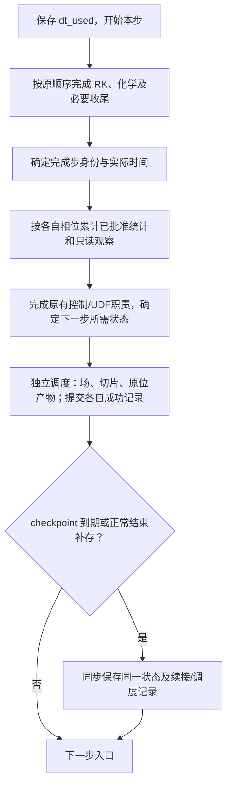
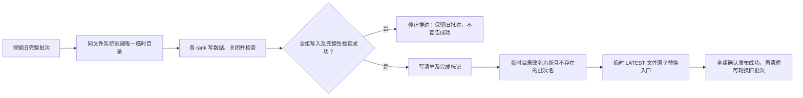

# ASTR 输出与重启语义重设计

状态：用户确认方案A的首期 OR0–OR6 本地有界实现及验收已完成，完整收口依据见第10.78节。OR2 TGV 统计续接、OR3 槽道、静态 CURVE、固定 AIR5 HBL/SBLI 及其累计统计、GPU 守恒诊断基线、非反应动态入口和外部初始场资源代表短测通过；OR4 周期 TGV 的 NP=1/2 x/y/z 双向重新分区及 NP=2 六种分解方向互换门槛通过，16³ 固定驱动 bc41 槽道及静态 CURVE 剖面平板的 x/z、固定 AIR5 HBL 的周期 z 有界重新分区也通过。OR5 基础场/多切片独立调度、同拓扑续接、发布、共享坐标及单段时间索引已覆盖 TGV、bc41 槽道、静态/动态 CURVE 平板、固定 AIR5 HBL/SBLI，新段/坐标复用、离线修复及显式父链总索引代表检查通过；GPU TGV 的 Catalyst 新批次同拓扑续接通过。
16³ 周期 TGV、bc41 槽道、静态/动态 CURVE 平板的完整步梯度、涡量、
Q_rs/散度文件输出及代表拓扑精确续接通过。
周期 TGV 的变步长物理时间输出检查通过；目录整体搬移、轮换/索引修复
联合检查已覆盖槽道、动态入口 CURVE 及固定 AIR5 HBL/SBLI。离线工具与
配置示例已补入根 CMake 安装规则。
固定 AIR5 HBL/SBLI 的有量纲完整步派生量门槛也已通过，见第 10.64 节。
固定AIR5 SBLI x及其累计历史迁移已通过；已登记TGV的checkpoint/场/切片/
正式统计/GPU渲染联合门槛也已通过，见第10.73–10.74节。
用户已选择方案A：首期原位渲染限定GPU TGV同拓扑；CPU/CURVE/AIR5渲染
及渲染重新分区列为独立后续目标，不扩展当前准入。
2026-10-04用户批准默认切换：自动读取必需的 `datin/input.output`，旧场输出
与旧checkpoint恢复关闭；环境变量仅可选覆盖路径。实施增量见第10.79节。
日期：2026-10-04。
第10.75节交付范围阻塞已由用户选择A解除；不将本地验收解释为任意生产规模放行。
核对基线：`dad665b`，当前分支 `feature/gpu_dev`；第 10.45–10.79 节为后续工作记录。

阅读顺序：第 4 节记录已确认决定，第 5 节为已批准的验收范围，
第 6 节是源码状态清单，第 7–10 节为建议实现与实施顺序。
第 8.1 节说明显式启用的候选配置接口，第 10.9 节记录真实 TGV 验收范围。
槽道与静态 CURVE 的新增有界证据见第 10.13–10.14 节；AIR5 与独立基础
归档的后续证据见第 10.16–10.46 节，AIR5 文件派生量和自动父链见第 10.64–10.65 节。未批准的重新分区与其他
渲染组合仍是后续目标。第 10.36 节仅关闭 GPU TGV 的有界同拓扑新格式原位续接；
第 10.38 节关闭周期 TGV 的两-rank 分解方向互换；第 10.49 节关闭已批准的
bc41 槽道 x/z 短测并记录通用滤波后缓存修正，两节均不放行渲染重新分区。
第 10.44 节关闭第 10.39 节已批准的有界真实派生场门槛。
第 10.50 节补齐槽道搬移、轮换、索引修复及两项代表性保存失败恢复。
第 10.51 节已获批准，静态 CURVE 周期 z 短测通过，结果见第 10.52 节。
第 10.53 节已获批准，静态 CURVE x 分区及 x/z 互换通过，见第 10.54 节。
第 10.55 节获批的 AIR5 周期 z 重新分区通过，见第 10.56 节。
静态/动态入口 CURVE 的累计统计 x/z 迁移分别通过第 10.67/10.69 节有界门槛。
AIR5 HBL 累计统计与守恒历史迁移通过已批准的第10.70节门槛，见第10.71节。
SBLI x 分区及累计历史迁移通过第10.72节门槛，结果见第10.73节。
第 10.57 节基础归档设备空闲保留量的可选配置已获用户确认，有界验收通过，见第 10.58 节。
不带渲染的周期 TGV 统计续接已通过第 10.11 节短测。
第 6.2 节的时钟问题已单独获批修复并通过短测。

## 1. 用户目标与工作边界

- 重新设计 checkpoint 等输出的状态语义，方便后处理和重启。
- 减少重启依赖的额外文件，并评估能否减少重复数据存储。
- 与当前完整步原位采样、统计续接和可视化接口协调。
- 访谈阶段仅记录设计；后续用户已批准时钟修复并要求继续重设计。
  当前只推进有界本地实现与验证，不操作外部任务，不自动提交 Git。

减少文件数量、减少总字节数、减少设备到主机传输是三个不同目标。
合并文件不自动减少数据量；删去补偿余量、边界历史或统计累计状态可能改变续算结果。
已选择每个保存时刻一个 checkpoint 目录作为恢复入口，内部按用途组织
少量并行 HDF5 文件。第4–9节保留访谈与早期方案依据；当前实际数据角色、
小型控制文件布局以第10.77节和源码为准；默认入口切换由第10.79节覆盖。

## 2. 重设计前实现依据

| 路径 | 当前行为 | 核对入口 |
| --- | --- | --- |
| 普通 CPU 输出 | 第一 RK 子步滤波、边界和梯度处理之后，第一次 RK 更新之前写出；反应流 checkpoint 有单独路径 | `src/mainloop.F90::time_integration_rk/rkfirst` |
| GPU 普通输出 | 推进前下载流场；部分边界在主机副本上处理后写出 | `src/mainloop.F90::time_integration_rk` |
| GPU 精确流场续算 | 五变量非反应路径另存主机边界处理之前的守恒量，包括重复节点和 halo | `src_gpu/checkpoint_gpu.cuf` |
| CPU 原位配对续算 | 显式配对批次另存首次滤波之前的守恒量 | `src/insitu_session.F90::capture_insitu_cpu_checkpoint` |
| AIR5 补偿续算 | HDF5 含守恒量、补偿余量及相关顶面状态 | `src/readwrite.F90::write_io_tree` |
| 原位采样 | 完整推进函数返回后采样；当前有界验收不代表全算例支持 | `src/mainloop.F90::steploop` |
| GPU 传统切片 | 先整场下载，再在主机抽取平面；当前 GPU 切片不写梯度 | `src_gpu/commarray_gpu.cuf::copy_flow_from_gpu`、`src/readwrite.F90::writeslice` |
| 旧恢复点与场文件耦合 | `writechkpt` 调用 `writeflfed`；`lwsequ` 控制编号场文件或覆盖式名称，不能据此当作已经独立的三类输出 | `src/readwrite.F90::writechkpt/writeflfed` |

旧 CPU 输出位置不是两次 RK 更新之间，但已经执行了下一步的部分预处理。
不能仅凭相同 `nstep/time` 就把所有输出视为同相位状态。

## 3. 与已有设计的关系

[原位后处理计划](ASTR_INSITU_POSTPROCESSING_PLAN.md) 的既有实现保留旧流场格式，
采用独立统计文件和配对批次。本次已确认的新设计将改变未来新输出路径的这些限制，
新文件格式已按下文有界门槛实施，不撤销旧版本的验收结论，旧文件仍不能由新入口读取。
[ADR 0017](../docs/adr/0017-keep-file-output-as-cpu-owned-boundary.md)
允许 CPU 负责文件 I/O，不要求整场下载；本次不默认引入 GPU 直接文件写入。
已确认的术语沿用 [CONTEXT.md](../CONTEXT.md)，新的有取舍决定经用户确认后再写 ADR。

## 4. 已确认决定与设计落点

| 编号 | 决策 | 状态 |
| --- | --- | --- |
| O1 | 同后端、同拓扑续算是否要求逐值一致，以及精确续算的适用条件 | 已确认：保留精确续算目标 |
| O2 | CPU/GPU 互换、改变 rank 数或拓扑的重启需求与误差要求 | 已确认 A：同后端跨分解，跨后端暂缓 |
| O3 | 完整耦合步状态的统一输出时刻及步号、时间、步长定义 | 已确认 A：统一完整步输出 |
| O4 | 初期覆盖的非反应流、AIR5、边界、网格和可选功能 | 已确认 A：两类流动均纳入首期，代表矩阵见第 5 节 |
| O5a | 每个 checkpoint 的文件组织 | 已确认 B：目录入口，内部多文件及清单 |
| O5l | checkpoint 目录内部的文件布局 | 已确认 A：按用途组织少量并行 HDF5 文件 |
| O5v | 其他后处理软件的首期直接读取范围 | 已确认 A：ParaView 与 Python，Tecplot 暂缓 |
| O5b | checkpoint 是否必须附带直接可视化场；存储与传输取舍 | 已确认 A：按需输出，支持离线导出 |
| O6a | 静态网格、配置及入口源数据的依赖管理 | 已确认 A：运行级共享不变资源 |
| O6 | 流场续算、统计续接、边界及动态入口状态的保存和恢复契约 | 沿用既定统计规则；源码清单和未闭合项见第 6 节 |
| O7 | 可视化字段与重启字段的关系；切片、梯度、坐标与单位 | 已确认 A：基础字段默认，派生量按需 |
| O7s | checkpoint、三维流场序列、二维切片序列的职责与独立保留 | 已确认：三类独立，场与切片开启后默认全部保留 |
| O7g | 首期切片的几何定义与位置选择 | 已确认 A：多位置固定全局 i/j/k 索引截面 |
| O8 | 旧文件读取、新格式默认值、版本识别及迁移 | 已确认 B：新入口只接受新格式 |
| O9 | 步数和物理时间调度、初末帧、去重及停机保存 | 已确认最终 checkpoint 和两种独立调度；实际初末帧规则见10.77 |
| O10 | 写入完整性、损坏拒绝、保留策略、同步或异步写盘 | 已确认同步、安全保留1/2份、写入失败停止；事务及默认keep=2已实现 |
| O11 | 验收范围、资源预算、实施顺序及旧文档同步 | 已确认首期本地有界范围；预算与实施建议见第 8、10 节 |
| O12 | 新输出配置入口与旧 controller 的职责分离 | 已确认 A：独立 Fortran namelist |
| O12r | 重启时调整文件输出开关及频率 | 已确认 A：允许显式修改，不改变统计采样 |

### O1 已确认：保留精确续算目标

用户确认：依旧保留精确续算目标。
在同可执行程序、同后端、同 MPI 拓扑、相同数值配置和确定性运行条件下，
要求连续运行与分段重启逐值一致。除流场外，统计续接和有记忆的边界状态
也要有明确恢复要求。该决定是新设计目标，不宣称当前所有算例均已满足。
跨后端、跨拓扑的数值等价是另一个验收问题，不默认要求逐位一致。
先合并和去除可证明冗余的记录，不以丢弃必要状态换取文件简化。

逐值一致针对影响续算的数值状态及约定的比较输出，不要求 HDF5 容器、
生成时间、日志或批次标识逐字节一致。改变格式或恢复流程后须重新验收。
拒绝以容差一致替代此目标。见 [ADR 0039](../docs/adr/0039-preserve-exact-continuation-in-output-redesign.md)。

### O2 已确认：同后端跨分解，跨后端暂缓

用户选择方案 A。首期目标包含同后端改变 MPI rank 数和拓扑的重启，
CPU 到 CPU、GPU 到 GPU 分别验收。网格和物理问题不因重新分区而改变。
CPU/GPU 互换暂缓，但格式设计应预留兼容空间，不声称首期已支持。

原配置连续/重启仍执行 O1 精确门槛。改变分解可能改变归约和浮点运算
顺序，采用单独的数值等价验收，不默认要求后续轨迹逐值一致。
具体误差容差、比较时长、拓扑组合及统计/边界状态的重新分区规则待定，
不能凭流场能读入就宣布迁移成功，也不能静默清空原统计窗口。
已选目录入口及按用途组织的 HDF5 文件；不能只记录原 rank 的本地位置而缺少可重新分区的信息。
见 [ADR 0040](../docs/adr/0040-support-same-backend-repartitioned-restart.md)。

### O3 已确认：完整耦合步统一输出

用户选择方案 A。新 checkpoint、三维流场、切片和原位采样统一观察完整推进步结束的状态，
位于下一步首次滤波、边界预处理或化学更新之前。反应流必须包含该步的
全部化学和输运更新。该选择不移动既有数值算子，不额外施加一次滤波或边界更新。
各类输出独立调度，不要求每步均输出或所有产品同时输出。
以已完成步数和该状态实际物理时间标识输出，区分刚完成步的步长与下一步步长。
恢复后从下一步入口继续，不重复执行已完成步的更新。

派生量必须由同一采样状态生成，不能未经核对使用最后一次 RHS 留下的梯度。
采样、辅助 halo 整理和派生量计算不得修改权威推进状态，开启输出与关闭输出
的连续推进结果须一致。checkpoint 必须保留续算所需状态，不能用可视化副本
替换权威状态，也不能因只保存物理域而直接假定 halo 可无差异重建。
旧 checkpoint 不在新入口兼容范围，见 O8。旧统计相位的兼容约束见第 6.3 节，
初末帧默认值见第 8 节建议，不因本项决定而改变旧统计定义。
见 [ADR 0041](../docs/adr/0041-unify-new-output-at-completed-step-boundary.md)。

### O4 已确认：非反应流与 AIR5 同属首期

用户选择方案 A。现有非反应流与 AIR5 反应流同时纳入文件设计和首期交付目标，
按非反应流到 AIR5 的顺序实现验收。AIR5 所需的双温守恒状态、化学补偿余量
和有记忆的边界状态必须纳入数据清单，不能因为非反应流门槛已过就宣布首期完成。
这不增加新物理模型，也不表示当前原位渲染已支持 AIR5 或静态 CURVE。
具体边界、网格、统计和可选功能组合仍需单独列出支持矩阵。

### O5a 已确认：目录入口与成组管理

用户选择方案 B。每个保存时刻生成一个目录，内部包含必要的数据文件和清单，
重启只指定目录，由程序核对同批次成员，不要求用户手工配对附属文件。
内部采用 O5l 的少量并行 HDF5 文件及清单，不采用每 rank 独立文件的默认布局。
具体文件数量、数据集分组和分块粒度仍待设计。

目录内必须保留 O1 所需的精确状态与 O2 所需的重新分区信息，不能因文件
分工而丢弃或错配化学补偿、边界历史和统计状态。写入与完整发布协议在 O10
决定；静态网格、输入配置和入口源数据按 O6a 的共享资源规则管理。

用户希望便于其他软件读取后处理。目录组织便于区分职责，但不自动提供软件
兼容性；仍需定义字段含义、物理坐标、节点或单元归属、分区接口和时间描述。
不假定任意 HDF5 文件均能被后处理软件直接识别。
见 [ADR 0042](../docs/adr/0042-use-directory-entry-for-checkpoint-bundles.md)。

### O5v 已确认：ParaView 与 Python

用户选择方案 A。首期要求 ParaView 及 Python 读取所声明的后处理字段，
包括网格、字段及时间序列；Tecplot 适配暂缓，不作为首期验收条件。
HDF5 数组配合 XDMF 网格和字段描述是待评估候选，不是已选定格式。
ParaView 官方 [XDMFReader 说明](https://www.paraview.org/paraview-docs/v5.13.0/python/paraview.simple.XDMFReader.html)
明确区分 XML 元数据和 HDF5 大数组；目标安装版本及实际布局仍须验证读取。

后处理场不要求随每次 checkpoint 生成。字段直接引用已有数据还是另存原始变量，
以及额外存储开销，仍待确定。后处理软件不应被要求理解化学补偿余量
或内部统计累计记录才能打开一份已声明可视化的流场。

### O5b 已确认：按需输出与离线导出

用户选择方案 A。checkpoint 负责完整续算，三维后处理场通过独立开关和
频率输出；支持需要时从 checkpoint 离线导出可视化场，不推进流动。
仅为精确续算而保存的 checkpoint 不强制重复保存全部原始变量或派生量。
这意味着并非每份 checkpoint 都能直接在 ParaView 中打开全部常用物理量，
可能先需要一次离线导出；静态网格和物性配置等依赖须随恢复契约明确。

离线导出不修改源 checkpoint，不推进 RK 或化学子步，也不累计新的统计样本。
导出的物性和派生量须使用与保存状态相容的定义；不能重新初始化边界后把
改变了的流场冒充 checkpoint 原状态。工具入口及资源要求待实施设计确定。
优先复用已有数据，不能把“可直接读取”直接等同于必须复制一份整场。
具体字段集合、是否导出梯度和存储量预算在后续问题中冻结。

### O6a 已确认：运行级共享不变资源

用户选择方案 A。一次运行的静态网格、固定入口剖面或已冻结的入口序列等
不变资源集中保存一份，各 checkpoint 通过相对位置和内容身份引用。
移动算例时须携带所选 checkpoint 及其引用的资源，不能只复制 checkpoint
子目录。小型恢复元数据随各 checkpoint 保留；各保存时刻的边界历史、
入口时间索引、补偿余量和统计状态不属于可共享的静态资源。

必须列明资源清单，不依赖原机器的未声明绝对路径。变化中的入口
数据不能当作不可变资源处理，其版本和所需范围需单独定义。
此选择只涉及数据依赖，不承诺任意计算环境下逐值一致，也不等同于打包编译器
或可执行程序。依赖缺失或内容不匹配的处理规则将在恢复契约中明确。
见 [ADR 0043](../docs/adr/0043-share-immutable-restart-resources-per-run.md)。

### O6 继承的统计续接规则

沿用原位计划第 1.4 节已确认要求：默认续接原统计，允许显式新开窗口。
恢复同相位累计量、时间权重、上一有效样本和窗口身份，不重复累计 checkpoint
样本，也不把停机墙钟时间计入物理积分。缺失或不兼容的统计记录不得静默清零。
首次从未启用该统计的合法新格式 checkpoint 开启统计时，新建窗口，不补造
历史样本。原位旧计划中的旧 checkpoint 条款不构成新入口的旧格式兼容承诺。
这些规则不冻结新文件布局；跨拓扑统计重新分布及各边界的必存状态仍需审计。

### O8 已确认：新入口只接受新格式

用户选择方案 B。首期新重启入口只接受新格式，明确拒绝旧格式，不自动调用
旧恢复流程，也不靠目录改名或重新标记时间相位把旧状态认作新 checkpoint。
新格式验收通过后，新输出路径采用新格式。

现有旧 checkpoint 及其算例继续由匹配的旧版本程序处理。旧到新的迁移工具
不属于首期交付；若以后需要，须单独审查状态完整性和相位，不能通过格式转换
补回原本未保存的精确状态。新离线导出工具的输入同样限定为新格式。
本轮不删除历史源码或文件，不更改正在运行的任务；具体源码清理在实施范围中确定。
见 [ADR 0044](../docs/adr/0044-limit-redesigned-restart-to-new-format.md)。

### O7 已确认：基础字段默认，派生量按需

用户选择方案 A。基础字段组包含密度、三分量速度、压力、平动温度；AIR5 增加振动温度
和五种组分质量分数。它们是可视化或离线分析字段，不替代 checkpoint 中的
权威守恒量、补偿余量或有记忆状态。

默认只输出基础字段组，速度梯度、涡量、Q 等按需启用，适用于三维后处理场
和切片。基础字段默认值不意味着必须开启文件输出。
派生量须依据同一完整步状态和声明的离散定义生成，并记录单位与归一化。
软件默认梯度与 ASTR 离散梯度不自动视为数值等价。

保存或引用物理坐标、时间及字段归属信息；具体字段标识和布局
待接口设计冻结，不假设当前 AIR5/CURVE 已具备全部派生量输出实现。

### O7s 已确认：三类保存产品独立管理

用户指出恢复点与流场序列容易混淆，并询问完整流场和切片序列如何保存。
用户随后确认三类输出独立管理，三维场和切片一旦开启，默认全部保留。
用户另行选择 checkpoint 可保留最近两份或仅保留一份，见 O10b。
用户已允许单份模式先写新批次再清理旧批次，具体发布实现仍待设计，本次访谈不实际删除文件。

采用以下职责划分，作为 O3/O5b 的具体化：

| 产品 | 保存内容和用途 | 生命周期 |
| --- | --- | --- |
| checkpoint | 精确续算所需的完整数值状态、统计和边界记忆及依赖引用；通常包含全域守恒场 | 可选最近两份或仅一份；新批次完整发布后才清理旧批次 |
| 三维流场序列 | 多个实际时刻的全物理域后处理字段，供离线切片、等值面、流线等分析；不承诺包含全部重启状态 | 独立输出、默认累积保留，不随恢复点轮换删除 |
| 二维切片序列 | 多个实际时刻指定切面上的字段；不能恢复未保存的三维域 | 独立输出、默认累积保留，不随恢复点轮换删除 |

三者共享完整步采样语义，但分别配置开关、频率、字段和输出位置；可同时开启，
也可只启用其中一类。这里的全域表示空间覆盖完整，不要求保存所有派生量。
checkpoint 的必存状态不能由后处理字段选择删减。“全部保留”指保留按配置
实际输出的全部时刻，不意味着每个计算步都必须输出。三维场与切片默认不轮换、
不覆盖已有时刻，不能在空间不足时静默删除旧帧或降低输出频率。
原位图片、流线几何和涡面几何仍是另外的提取产品，不代替三维场序列。

仅作需求示例：每 1000 步保存恢复点、每 100 步保存三维场、每 10 步保存
切片。示例不是默认频率，也不是性能承诺。完整场与切片记录其实际时间，
按选定的读取格式提供时间序列入口。

三者同时到期时可复用同相位采样、打包或传输结果，但必须保证各自的数据
生命周期。长期流场序列不能仅引用随后会被清理的 checkpoint 文件；如存在
共享数据，清理必须保留仍被其他产品引用的数据。只开二维切片时，目标是
仅打包和传输切片所需数据，而不借此强制写出完整三维场或 checkpoint。
见 [ADR 0045](../docs/adr/0045-retain-postprocessing-series-independently-of-checkpoints.md)。

### O9 已确认部分：正常结束补存最终 checkpoint

用户选择方案 A。在 checkpoint 功能已开启且程序正常结束时，如果最后一个
已完成步尚无完整可用的 checkpoint，补存一次最终状态；若已经保存同一状态，
不重复写出。该保存使用 O3 的完整步语义，不额外推进一步，不强制生成三维
后处理场或图片。显式关闭 checkpoint 时不因退出而写入大文件。

该问题仅涉及正常结束。数值异常、MPI/CUDA 故障、强制终止或半个推进步
不能自动视为合法最终状态；受控停机和信号响应另行设计。步数/物理时间
调度与初始帧规则仍需在配置契约中明确，不由本项选择自动确定。

### O10 已确认部分：首期同步保存

用户选择方案 A。首期采用同步 checkpoint。在完整步边界冻结本次保存状态，
完成所需传输、并行文件写入和整组成功确认后，才允许下一步推进。
可以采用有界的分块传输或写入，不要求额外复制整份设备状态以供后台使用。
同步指保存与推进的先后关系，不改变计算核函数现有的同步策略。

首期不实现后台快照队列或计算与 checkpoint 写盘重叠。未来若引入异步，
必须另行核对独立快照、内存预算、并发契约和错误传播，不能直接让后台读取
持续更新的求解器数组。保存成功指整组完成，而非仅发起写出。
保留方式见 O10b，写入失败策略见 O10c；具体发布协议仍需按文件系统约束设计。

### O10b 已确认部分：可选保留一份或两份

O7s 已确认。本项只决定 checkpoint 的保留方式，不影响完整流场和切片序列。
用户要求提供两种选项：保留最近两份，或仅保存一份并替换旧恢复点。
选项的默认值尚未确定，配置字段名也未冻结。本轮仅记录设计，不执行删除。

“保留一份”规定成功保存后的常规恢复点数量，不自动等同于逐文件覆盖
唯一有效恢复点。多文件直接覆盖若中途失败，可能混合两个保存时刻的状态，
导致新旧恢复点都不可用，与可恢复性目标冲突。

用户确认允许安全替换及临时空间：新批次先写临时目录，所有必需成员写入并核对成功后发布，
最后清理超出保留数量的旧批次。单份模式更新期间暂时需要两份容量，
双份模式更新期间暂时需要三份容量；共享资源和受保护副本另计。
写出失败时不破坏旧恢复点。固定恢复入口如何切换、完成标记与持久化保证
需按目标文件系统设计，不能假设能用一次重命名直接替换一个非空目录。

两种模式下，独立后处理输出不因 checkpoint 轮换而删除；共享资源、
用于此次恢复的源 checkpoint、外部目录和不属于当前运行的文件不得被顺带清理。
具体保存身份、保护标记、受保护副本的计数和目录所有权规则需在实现前冻结。
见 [ADR 0046](../docs/adr/0046-publish-checkpoints-before-retiring-old-generations.md)。

### O10c 已确认：checkpoint 写入失败停止推进

用户选择方案 A。checkpoint 写入失败时明确报错，停止后续推进并以失败状态
退出；保留仍完整的旧恢复点，不发布不完整新批次，不通过降低字段或跳过必需
状态继续宣称保存成功。错误报告包含失败批次和已知的最后完整恢复点。

该选择仅涉及 checkpoint，不修改既有原位渲染的单帧故障策略。进程丢失或
通信环境损坏时不能承诺正常收尾；所有情况下都不能把半组文件作为成功恢复点。

### O9b 已确认：统一的步数或物理时间调度规则

用户确认将原位计划第 1.5.1 节的调度规则扩展到 checkpoint、三维场和切片：

- 每类输出独立选择步数或物理时间模式，独立设置间隔，不隐含组合触发。
- 步数指完整推进步，不计 RK 或化学内部子步。
- 物理时间模式在首次达到或越过目标的完整步输出，记录实际状态时间；
  不为输出调整推进步长，不把插值状态用作精确 checkpoint。
- 单步跨越多个目标时，该产品只输出一次当前状态，记录跨越情况，
  不复制同一份数据来假装存在多个历史时刻。
- 恢复必要的调度进度和起算基准，避免重启后重置周期或重复输出。
- 时间单位沿用算例定义，无量纲时间不得标为秒。

最终 checkpoint 另执行已批准的 O9 补存规则，并与周期输出去重。
重启时主动修改输出周期按 O12r 执行。初始状态、三维场与切片的末帧选项及
具体配置字段见第 8 节建议；不自动修改统计时间权重或旧输入字段含义。

### O7g 已确认：固定全局索引截面

用户选择方案 A。首期支持固定全局 i/j/k 索引的网格截面，每个方向可指定
多个位置。保持原网格节点上的采样，不引入空间插值。静态 CURVE 上截面
可能是曲面，必须输出或引用实际三维坐标，不把固定 j 等同于物理 y 常数。
索引和节点归属不能随 MPI 分解变化，具体重复节点所有权在接口中定义。

首期不增加求解器输出侧的任意物理平面定位和插值。
这不限制从已保存三维场在 ParaView 中离线截取任意平面；仅保存固定
索引切片时，不能恢复未保存位置的数据。原位渲染流水线的已有切面功能与
新的求解器直接切片输出是不同接口，不据此推断后者已具备任意平面提取能力。

### O5l 已确认：按用途组织少量并行 HDF5 文件

仍保留已选定的目录入口，不重新讨论单文件入口与目录入口的取舍。

用户选择方案 A。按用途组织少量 HDF5 文件及清单，文件数量不随 MPI rank 数
线性增加。各 rank 通过并行 I/O 写各自负责的数据区域，不先汇集全部流场到
单个根进程。保存全局索引、分区信息及必要的分区专属精确状态，具体分组和
数据集布局须同时满足原拓扑精确恢复与跨拓扑读取。

不采用每 rank 一个分片文件的首期方案，但不据此声称该备选不能跨拓扑恢复。
本选择不等于减少保存字节数或已获得更高 I/O 性能；集体操作顺序、元数据
开销和分块内存仍需实测，也不能省略整组一致发布和完整性检查。
文件命名、数量、HDF5 数据集布局和后处理描述格式均未因此冻结。
见 [ADR 0047](../docs/adr/0047-use-role-based-parallel-hdf5-checkpoint-files.md)。

### O12 已确认：独立 Fortran namelist 输出配置

用户选择方案 A。增加独立的 Fortran namelist 输出配置文件，以有名称的参数
分别配置 checkpoint、三维场和切片，不继续扩展旧 controller 的位置式字段。
新配置是新输出的唯一控制入口，不允许旧频率字段同时驱动同一输出路径。
文件名、缺省行为、必填项、配置冲突拒绝及重启时改配置的规则待配置表冻结。

原位模块已有 namelist 配置读取模式可参考。当前 `readcont` 的控制文件位于
`datin/controller`；`feqchkpt` 在 `steploop` 还触发控制重载和 CFL 检查，
不能因为拆分输出就直接删除这些非输出职责。采用独立入口不等于移除 controller。
本问题不自动授权运行中热重载新配置，也不把旧 checkpoint 兼容选择扩大成
删除全部旧输入控制功能。

### O12r 已确认：续算时允许显式调整文件输出

用户选择方案 A。允许重启时显式调整 checkpoint、三维场和切片的文件输出
开关及间隔。未修改的调度恢复原进度；修改的调度显式记录新的起算基准，
不补造停算前未保存的帧，不覆盖既有归档。具体冲突拒绝、输出目录和编号
规则在配置表中定义，不能仅因文件名相同就覆盖原运行结果。

该调整只影响文件输出，不重置统计窗口、不改变统计采样周期或累计权重，
也不改变数值推进配置。需验证调整文件输出不会改变同配置的权威流场。
统计采样配置变更属于单独的统计续接问题，不随文件输出修改隐式生效。

该选择不自动包含运行中热重载新输出配置，首期是否热重载在配置能力边界
中明确；不能借用 controller 重新读取路径绕过全 rank 配置一致性检查。

## 5. 已确认的首期验收范围（O11）

用户确认：首先在本地用小网格和短推进窗口完成语义与数据完整性验收，不启动新的
长时生产算例或 A800 作业。改变代码后不能直接沿用旧格式的重启通过结论。

### 5.1 代表性流动

| 类别 | 主要覆盖面 | 已有测试入口，仅作为改造参考 |
| --- | --- | --- |
| 周期 TGV | 五变量完整步、CPU/GPU 各自精确续算、原位统计配对和同相位输出 | `run_insitu_cpu_paired_restart.py`、`run_insitu_paired_restart.py` |
| 槽道流 | 非周期壁面、驱动及已有统计、标量/全变量滤波工作区 | `run_release_boundary_filter_restart.py --case channel` |
| 静态 CURVE 平板 | 共享曲线网格、物理坐标、索引切片、边界及几何相关派生量 | `run_release_boundary_filter_restart.py --case curve` |
| AIR5 平板及特征顶面短测试 | 双温、组分、非零化学补偿、有记忆边界及完整耦合步 | `run_air5_c5_hbl_restart.sh`、`run_air5_characteristic_restart_gate.py` |

这里不重新验证全部物理模型。状态清单若发现时序入口等额外持久状态，补
对应的针对性短测试，不把四类基础算例扩展成所有参数的笛卡尔积。
现有脚本依赖旧格式，不能直接调用后就宣称新格式通过；需要相应新格式对照。

### 5.2 独立验收条件

1. 同后端、同拓扑连续运行与分段续算逐值一致，包括必需的化学、边界与
   统计状态；比较数值内容，不要求容器元数据逐字节一致。
2. CPU、GPU 各自覆盖 NP=1/2，跨分解覆盖 1 到 2、2 到 1，以及两个不同
   两-rank 分解方向；检查全局索引、共享节点和切面所有权。具体支持组合
   依算例边界选择，不做无意义的全组合。
3. 跨分解误差沿用对应算例已批准的有量纲/归一化规则并在运行前冻结，
   不以一个绝对容差统管所有 AIR5 变量，也不把可读文件当作数值等价证明。
4. 新文件输出开关、频率及恢复时显式调整不改变权威流场和既定统计采样。
   checkpoint、三维场、切片和原位观察对应相同完整步身份。
5. ParaView 与 Python 读取坐标、基础字段、选定派生量及时间序列；切片
   与同相位三维场的对应节点一致。离线导出不推进计算、不改变源批次。
6. 覆盖步数/时间触发、越过目标、重启去重、最终补存、关闭输出及单份/双份
   安全替换；缺件、错配、损坏、旧格式及注入写入失败均不得被报告为成功。
7. 移动目录并携带共享资源后可以恢复和导出；缺失或错误资源明确拒绝。
   checkpoint 轮换不破坏长期保留的场和切片序列或本次恢复源。
8. 记录实际文件数量、字节数、附加主机/设备内存及必要传输量，证明切片
   专用路径不强制整场下载或整场落盘。先给出实测，不预先承诺 I/O 加速比。

新进程恢复是必测路径，不能以同进程内存还原代替。首先运行最小受影响门槛，
任何数值或状态一致性失败就停止后续性能结论。小规模通过不外推为多节点
文件系统吞吐认证，也不解决此前 256^3 长序列原位渲染内存增长问题。

### 5.3 设计收口与实施授权

本总稿已补充以下状态清单、布局、配置、流程及阶段建议，统一提交审阅，
不继续逐项询问文件名。验收范围获批不等于已经完成验收，也不等于自动授权
修改 CPU 数值行为、运行长任务或提交 Git。

## 6. 源码状态清单与阻塞项

本节核对当前维护路径，不是对所有历史 UDF、湍流模型或外部化学后端的完整审计。
判定标准不是数组是否带 `save`，而是下一步是否会在重新赋值前读取其内容。

### 6.1 必存、可重建与待证明状态

| 状态 | 当前源码依据 | 新格式要求 |
| --- | --- | --- |
| 完整步身份及后续控制 | `src/mainloop.F90::steploop`、`src/readwrite.F90::readcont` | 保存完成步数、实际时间、本步步长、下一步步长、控制重载进度及兼容性配置；不能只保存一个含糊的 `deltat` |
| 权威守恒量 | `src/commarray.F90`、`src_gpu/checkpoint_gpu.cuf` | 保存 FP64 `q`，不是 `qsave=q*jacob`；保留恢复原 rank 副本所需的重复节点与 halo，不先假设可重算 |
| AIR5 分量定义 | `src/chemistry_core.F90::chemistry_state_layout` | 当前存储为 11 分量，含密度、三动量、总能量、五组分密度及振动能；显式记录组分顺序、闭合方式和能量约定，不由变量数猜含义 |
| AIR5 补偿 | `src/chemistry_compensation.F90`、`src_gpu/chemistry_compensation_gpu.cuf` | 开启时必存 `air5_carry`；当前表示值为 `q-carry`，不可先合并成一个 FP64 数再保存 |
| 边界目标与模式 | `src/chemistry_boundary.F90::air5_top_contract/write_air5_top_checkpoint` | 现有记录为顶面模式、版本和 38 个契约值，主要是固定目标及参数；不是额外边界时间历史。演化边界节点仍属于守恒状态 |
| 槽道驱动状态 | `src/statistic.F90::statcal/chanfoce` | `force`、`massflux_target`、冻结驱动力及其初始化标记影响后续 RHS，纳入续算状态；不能当作可丢弃的日志 |
| 动态入口 | `src/bc.F90::inflowintp`、`src_gpu/inflow_timeseries_gpu.cuf` | 保存 `ninflowslice`、有效时间窗及去重进度；四帧缓存仅在能由已冻结源数据精确重建时省略。越过读帧阈值前后均测试 |
| CPU 传统均值 | `src/statistic.F90::meanflowcal` | 保存已启用累计数组、`nsamples`、起始时间/步号及最后累计步号，保留原有采样定义 |
| GPU 紧凑统计 | `src_gpu/production_statistics_gpu.cuf` | 保存平面/壁面累计量、测度、采样计数、起始时间及最后采样步。不能只保存最终均值；现有文件按原分区保存，跨分解需新映射 |
| 原位速度统计 | `src/insitu_velocity_statistics.F90`、`src_gpu/insitu_statistics_gpu.cuf` | 保存均值、中心矩、时间/密度权重、上一有效样本及时间、窗口身份；RMS 等展示结果不是充分恢复状态 |
| 调度状态 | `src/insitu_schedule.F90`、`src/insitu_session.F90` | 各产品保留周期、起点、已见/已输出身份、目标序号及终止标记的明确恢复规则；作业结束不自动表示未来续算也应结束 |
| 几何及模型资源 | `src/initialisation.F90`、网格/物性初始化及输入读取路径 | 静态坐标、配置和外部表共享引用。度量和物性缓存只有经过重建一致性检查才可省略，不凭数学等价推断浮点结果相同 |
| RK/化学工作区 | `src/mainloop.F90`、`src/chemistry_kinetics.F90::air5_ros2_advance` | `qsave`、`air5_origin*` 等在下一步先重写的工作区不存；ROS2 内部为调用局部状态，但调用方是否跨步复用 `suggested_step` 仍需逐路径核查 |
| 可扩展用户状态 | `user_define_module/userdefine.F90::udf_eom_set` 等 | 当前默认结束钩子为空，不推断所有自定义模块无状态。新增有记忆 UDF 必须声明序列化接口或明确拒绝精确续算 |

原始变量 `rho/vel/prs/tmp/spc/tve` 与物性缓存不统一归为“都必存”或“都能重算”。
先审计下一步实际读取顺序；若与连续运行相同的重建流程不能保持逐值一致，
则保存必要缓存，或在获得数值行为变更批准后统一连续/恢复路径。
通信请求、文件句柄、设备地址不写盘，恢复时重新建立。

当前恢复路径在 `src/initialisation.F90` 先读原始变量并 `updateq`，再覆盖精确
守恒量；新格式不能把这一流程原样搬走后就认为缓存已相容。
完整步仅是更清楚的存档边界，并不自动使所有未保存状态变为无关状态。

### 6.2 已获批修复：步长重载后的时钟推进

修复前基线 `5c54920` 的静态源码证据：

1. `src/mainloop.F90:115` 在推进前保存 `completed_step_dt=deltat`。
2. 推进后原位采样使用 `time+completed_step_dt`。
3. 同一循环稍后调用 `readcont`，而 `src/readwrite.F90:802` 会重新读入全局 `deltat`。
4. `src/mainloop.F90:228` 最后执行 `time=time+deltat`，而不是本步实际步长。

当重载值与本步步长不同，循环时钟与刚完成状态的物理时间不一致。
`cflcal` 的步长参数为 `intent(in)`，本处问题来自 controller 重载，不是 CFL
自动改步长。固定步长且文件未变时没有这一差异。

用户确认修复后，仅将循环末尾改为 `time=time+completed_step_dt`，新增一行说明。
原位采样和 CFL 已使用该步长。全局 `deltat` 保持重载后的值供下一步使用，
控制读取、UDF、滤波、边界和化学调用顺序没有改动。

回归脚本：`tests/gpu_validation/run_complete_step_clock.py`，使用真实 16^3 TGV、
显式格式、开启滤波和黏性，旧 `maxstep=11` 循环实际执行 12 次完整推进。
脚本在看到 CFL 记录后原子替换独立测试目录内的 controller，使步长经历
`0.001 -> 0.002 -> 0.0005`，并要求日志确实出现三种已用步长。
每条状态时间对照累计已用步长；不能以修改文件成功代替重载生效。

- 修复前 CPU NP=1 复现：步标签 2 报告 `0.005`，应为 `0.004`，相差 `0.001`。
- 修复后 CPU/GPU、NP=1/2、恒定/变步长共 8 组通过，96 条 CFL 时钟记录的
  累计误差为 0，144 份原位采样头部的步号、时间和步长逐值对上。
- 修复前后 CPU/GPU NP=1 恒定步长的 24 份完整采样文件逐字节一致。
- 构建入口仍为根 CMake；该结果不是新格式重启、AIR5 完整耦合或跨拓扑验收。

证据目录（均在 `tests/gpu_validation/out/`，不加入 Git）：
`complete_step_clock_20260930_before/`、`complete_step_clock_20260930_fixed_before/`、
`complete_step_clock_20260930_after/`。前者保留预期失败记录，后者有完整 `summary.json`。

另须核对 `do while(nstep<=maxstep)` 与旧输入“终止步号”的对应关系，
新元数据不能把旧循环标签直接当成已完成步数；本项目不顺带修改旧终止条件。

### 6.3 不能整体搬移 rkfirst

`rkfirst` 不只有写文件，还调用 `statcal`、`meanflowcal` 和 UDF。
其中槽道 `statcal` 会更新驱动力，移动到完整步末可能改变实际推进。
建议只抽离文件输出调用，保持这些数值更新的位置及调用次数。
保留影响数值行为的首次调用/恢复分支状态，不能重启后再次走一次初始化逻辑。

checkpoint 保存的是完整步边界时已经存在的统计累计状态；传统统计的最后
采样相位可能仍是第一 RK 子步。分别记录采样相位、实际最后样本时间和窗口，
不将旧累计值改名成完整步时间平均。新的流场、切片及原位观察采用 O3。
未来若统一旧统计采样相位，另列数值与统计语义变更，不混入本次格式重构。

## 7. 建议的数据组织与恢复接口

以下为候选 schema v1，不是已经存在的文件或命令。首版建议使用两个必需
HDF5 文件及一个按需统计文件；一个文件内可有多个用途明确的数据集。

```text
run/
  resources/
    <resource-id>/mesh.h5
    <resource-id>/model.nml
    <resource-id>/inlet/...
  checkpoints/
    LATEST
    <generation>/
      manifest.nml
      state.h5
      continuation.h5
      statistics.h5          # only when statistics are enabled
      COMPLETE
  fields/<segment-id>/...
  slices/<segment-id>/...
  insitu/<segment-id>/...
```

相对资源引用应可随整个 run 搬移，不允许解析到未声明的外部目录。
保存 schema、运行身份、生成批次、父 checkpoint 身份、相位、后端、完整网格、
原 MPI 分解、数值/物理配置、组件版本、必需文件/数据集及资源内容身份。
清单必须区分“不启用所以不存在”和“本应存在但丢失”。
整数步号采用 64 位；浮点类型、字节序、分量名、坐标轴顺序和单位明示。

### 7.1 全局状态与原分区精确记录

| 文件 | 建议内容 | 所有权 |
| --- | --- | --- |
| `state.h5` | 全局物理节点的 `q`、必要时的补偿；原分区重复节点和 halo 的精确记录；经审计确需保存的缓存 | 每个全局节点一个确定的写入者；非所有者副本及 halo 另有原 rank/索引描述 |
| `continuation.h5` | 时钟、控制进度、驱动/边界状态、入口游标、三类输出调度、原分区映射 | 全局标量只写一次；局部状态按全局位置或带原分区描述的扁平数组保存 |
| `statistics.h5` | 实际启用的传统统计、紧凑统计和原位统计，分别标记定义、相位及版本 | 既保留原分区精确累计状态，也提供经定义审核的跨分区恢复规则 |
| `manifest.nml`、`COMPLETE` | 文件和资源清单、必需组件、完整发布身份及完整性检查信息 | 协调进程写少量元数据，不收集全场 |

首选用“全局所属节点 + 原分区额外副本”恢复本地数组，避免全域 `q` 写两遍。
额外副本应保存原始值，不采用相减再相加的浮点残差压缩来承诺逐值恢复。
所有权规则覆盖周期重复端点及多轴分区交线；对不一致副本不能为输出再做平均。
具体去重布局须先通过装配/拆分逐值测试，再用于推进器。

并行 HDF5 由 rank 写所负责 hyperslab，元数据创建和集体调用顺序全 rank 一致。
无所属数据的 rank 使用空选择参加约定操作，不提前跳过集体写入。
复用 `src/hdf5io.F90` 的 MPI-HDF5 基础，但不照搬 `write_io_tree` 的 k 方向
先汇集再写出路径。首版不要求压缩，不以文件数减少宣称吞吐提升。
完整性校验的摘要算法和分块覆盖范围在 schema 冻结时确定，读回必须能检出
受测的数值块损坏；只检查文件存在或长度相同不够。

### 7.2 两条恢复路径

**同后端、同拓扑：** 验证配置后，把原数值状态无算术变换地放回原位置，
恢复必要缓存、补偿、边界及累计状态。初始化通信和 I/O 资源后从下一步正常入口
继续，不额外调用一次会平均节点或覆盖边界的例程来“清理”保存状态。

**同后端、不同拓扑：** 按全局索引读取新子域，重建新邻接和 halo，再执行该路径
已批准的必要准备；原拓扑专属记录不能按新 rank 编号硬套。物理节点、几何、
补偿、边界/入口和统计分别有迁移规则，整个组合完成门槛后才列为支持。
跨后端先明确拒绝，不能因 HDF5 可读就自动放行。

紧凑统计是一个实际难点：原 rank 的展向部分和不能任意分摊成新子域历史。
建议保留原分区记录供精确恢复；跨分区时将已累计的定义明确的全局量作为历史
基线，新增样本继续按新分区累计，读取结果时按原统计定义合并。
中心矩必须使用带权合并公式，不平均各 rank 的 RMS。相位、样本数、覆盖时长
和上一样本须一致。未证明正确的统计组件应阻止该组合跨分解恢复，不静默重置。

### 7.3 后处理文件与离线导出

建议三维场和切片采用独立 HDF5 + XDMF 描述，配套 Python 读取示例。
场文件持有自己的数据，只共享不变网格，不依赖可能被轮换删除的 checkpoint。
字段默认组按 O7；记录实际保存时间、完成步、网格节点归属、量纲和归一化。
用不对称小网格及坐标编码字段检查 Fortran/HDF5/XDMF 轴序，避免 TGV 对称性
掩盖轴交换。实际 ParaView 读取验收前不称作已兼容。

离线导出器复用状态读取和物性接口，不调用 `steploop`，不借“零步运行”间接
执行初始化边界、滤波或统计。默认导出同相位基础字段，派生量从私有副本计算。
仅切片时由 GPU 打包该截面及所需的小范围数据；可选梯度若需邻域，传输范围
须另行记录，不伪称导数只依赖单层节点。完整派生场可分块，不能修改求解器 `q`。

## 8. 配置建议与缺省行为

建议入口为 `datin/input.output`，分为 `output`、`checkpoint`、`volume`、
`slices` 四个 namelist。所有字段在启动时统一读取、全 rank 校验，首版不热重载。
旧 controller 保留非输出职责，旧输出字段不再驱动新写出，也不自动映射成新配置。
建议缺少新文件时拒绝启动并给出最小关闭输出示例，防止用户误以为已有恢复保障。

| 项目 | 建议默认或合法值 | 精确含义 |
| --- | --- | --- |
| 格式 | `format_version=1` | 不识别的必需版本或字段报错；不回退旧格式 |
| 三类 `enabled` | 均为 `.false.`，示例算例显式选择 | 缺省不产生大型文件；不是悄悄继承 controller 的旧开关 |
| 各类 `mode` | `steps` 或 `time` | 启用时只允许一种有效正间隔，时间使用算例单位 |
| 步数间隔 | `interval_steps` | 完成步数量，不包含 RK/化学子步 |
| 时间间隔 | `interval_time` | 到达/越过目标时输出一次，记录实际时间及跨越数量 |
| `checkpoint.keep` | 建议 `2`，合法值仅 `1/2` | 发布后保留的未受保护恢复点数，临时及保护副本另计 |
| 初始 checkpoint | 建议关闭 | 开启时保存合法初始化状态，标记已完成步数为零 |
| 最终 checkpoint | 开启 checkpoint 时正常结束必补存并去重 | 已确认规则，不提供暗中丢失最终状态的默认行为 |
| 场/切片初始帧、末帧 | 建议均关闭，可独立开启 | 不影响周期输出；所有实际写出的帧默认保留 |
| 默认字段 | `basic` | 五变量流动 6 个标量分量：rho、三速度、p、T；AIR5 另加 Tv 和五个 Y |
| 派生量 | 默认不启用 | 显式选择物理速度梯度、涡量或已定义的 Q；分别核对边界/几何支持 |
| 切片位置 | `i_indices/j_indices/k_indices` | 全局节点索引；合法范围由网格给定，去重且越界报错 |
| 重启输出配置 | 默认使用保存配置；显式 `override` 才替换 | 未变的产品恢复调度；改变者以恢复状态为新起点，不补写历史 |
| 三维场/切片归档 | 每次恢复生成新的 `segment-id` | 不覆盖旧帧；未变调度不重复保存恢复点，序列索引关联父段 |
| 缓冲与总预算 | 分开配置，实施前核定本地验收值 | 有界块传输不等于总内存有界；预算包含选中统计及派生临时数组 |

间隔的数值不设通用生产默认。建议仅将单块传输容量 `64 MiB` 作为首轮本地
试验候选，实际附加主机/设备峰值和总预算在运行前核定；不直接套用原位渲染
32^3 的验收预算，也不因空间不足自动减字段或改频率。

恢复时物理模型、网格、数值格式等兼容性校验独立于输出 `override`。
初末帧是否主动输出恢复点需显式选择，不能被当作重复的统计样本。
正常结束保存的调度状态要能够续算：产品的作业终止标记与统计窗口确已结束
分开恢复，避免重启后所有后续帧都被旧 `ended` 标记抑制。

### 8.1 已实现的候选配置模块，显式启用

`src/output_config.F90` 包含本地解析与 MPI 分发两个模块。独立 probe 检查已通过；
随后在主程序接入 `ASTR_OUTPUT_CONFIG=<配置文件>`。
未设置该环境变量时仍走旧输出，不要求新增输入文件。新入口当前仅接纳第 10.9 节
的周期 TGV 配置。旧 controller 仍负责推进控制，新配置负责 checkpoint 调度。
`format_version=1` 在此是配置版本，不代表新 checkpoint schema 已交付。

各组按 `output/checkpoint/volume/slices` 顺序各出现一次；组名和结束符 `/`
分别独占一行，可带注释。数值及逻辑值仍由 Fortran namelist 读取，不用字符串
替换模拟解析。这个记录布局限制用于拒绝被普通 namelist 搜索跳过的未知组、
重复组和结束符后的非注释内容。支持 LF/CRLF。

下例仅用于配置测试，预算数字不是生产建议，所有产品保持关闭：

```fortran
&output
  format_version=1, directory='outdat/output', restart_output='saved',
  buffer_bytes=67108864, host_budget_bytes=134217728, device_budget_bytes=67108864
/
&checkpoint
  enabled=f, mode='steps', interval_steps=100, keep=2, initial_frame=f
/
&volume
  enabled=f, mode='time', interval_time=0.01, fields='basic',
  initial_frame=f, final_frame=f, velocity_gradient=f, vorticity=f, qcriterion=f
/
&slices
  enabled=f, mode='steps', interval_steps=10, fields='basic',
  i_indices=0,8,16, j_indices=12, k_indices=16
/
```

模块拒绝未知字段、非有限/冲突间隔、保留份数不为 1/2、负预算、过长路径，
以及开启产品但主机预算不足一个缓冲块的配置。checkpoint 的最终补存不提供
关闭参数；未来调用者必须先检查 checkpoint 是否启用。切片每轴最多 256 个
输入位置，`-1` 为未使用槽位，重复索引去重，几何创建后单独检查全局上界。
初期容量限制不是最多 256 个网格节点，也不改变实际网格。

MPI 入口先确认各 rank 的配置文件名一致，再由 rank 0 读取并按明确类型广播
各字段。不是逐字节广播带编译器填充的派生类型。读取失败时全 rank 拒绝且
保留传入配置不变。切片的跨 rank 所有权、统计内存和实际设备工作区仍须在
后续运行准入中校验，当前参数检查不替代这些门槛。

## 9. 目标执行流程与故障边界

### 9.1 完整步观察和状态提交



这是职责图，不是逐行源码调用图。当前 `steploop` 已在RK返回后原位采样，
保留控制重载及默认UDF职责，再用dt_used更新完成步时钟，调用
`completed_output_runtime`完成末帧渲染、独立场/切片及检查点发布。
传统RK内统计仍留在原位置，不在D重复累计；D只代表本步末采样。
当前默认 UDF 不改变场，若用户钩子
会在观察后改变权威场，必须先明确其属于本步还是下步，不能给两种场同一身份。
有记忆或改变权威场的用户钩子不由当前默认钩子验收自动覆盖。

checkpoint 要保存自身本次成功写出后的逻辑调度进度。写入时用候选状态，
成功发布后才更新活动调度，避免恢复后同一步再次写出；失败直接停止。
归档中可能已有比恢复点更新的帧，重启用新段身份保存，不覆盖、不倒改旧段。

### 9.2 多文件同步发布



`LATEST` 建议是指向批次名的小型文本入口，恢复仍可直接指定批次目录。
不能直接覆盖唯一有效批次内部的 HDF5，也不能假设能重命名覆盖非空目录。
发布前失败不清理旧批次；新目录完成但入口更新失败时，不进行旧批次清理，
报告可人工检查的新目录和仍有效的旧入口。未完成的 `.tmp` 不成为自动恢复候选。

保护规则建议：本次恢复源默认受保护，不计入 `keep`；只轮换当前运行拥有、
未标记保护且没有被归档引用的生成批次。不自动清理共享资源、外部目录或失败
临时目录，不在启动时猜测哪些历史数据“无用”。这些额外空间须计入容量估算。

HDF5 关闭、所有 rank 成功、目录可见和断电持久化是不同保证。
首版应测试目标文件系统的重命名和恢复可见性；刷新文件/目录的实现另核对平台，
不能把 `MPI_Barrier` 当作断电保障。MPI 进程丢失时不保证集体错误处理能完成，
但读端仍必须拒绝未完整发布的批次。

## 10. 实施阶段与停止条件

当前时钟/配置、存储/发布基础已接入真实运行。OR2 同拓扑 TGV 精确续算
与 OR3 已登记算例的有记忆状态代表短测通过；OR5 基础归档、新段复用及
显式离线单段索引修复已有证据。OR4 周期 TGV 1↔2 及两-rank 六种方向互换通过，OR5 原位
续接仅 GPU TGV 同拓扑短测通过。第 10.44 节补齐 16³ 周期 TGV 文件
派生量门槛，槽道和静态/动态 CURVE 的新增证据见第 10.60 节，AIR5 派生量
和自动父链见第 10.64–10.65 节。第10.78节关闭用户确认方案A的首期总验收，
包括已批准的CURVE、AIR5累计历史迁移，不开放未登记配置。
最新依据见第 10.33–10.78 节，早期实施记录保留当时范围及失败证据。
不一次重写整个 `readwrite.F90` 或给每个字段创建新模块。

| 阶段 | 最小改动及交付物 | 通过条件 |
| --- | --- | --- |
| OR0 状态和配置冻结（首期通过） | 时钟修复、独立配置和 MPI 分发、版本化schema及状态注册；实际布局见10.77 | 必存/可重建有依据；未支持组件启动即拒绝；旧 controller 的非输出职责不遗漏 |
| OR1 存储与发布（首期通过） | 专用 HDF5 数据集、全局所有权/原分区补充记录、目录事务、版本及资源检查 | NP=1/2装配拆分逐值检查；缺件、损坏、空选择及失败替换测试通过 |
| OR2 五变量完整步续算 | CPU/GPU 数据提供接口；从 RK 内拆出文件 I/O；新恢复入口与 TGV 配对统计 | 两后端分别同拓扑精确续算；输出开关不改变流场；CPU-only 不依赖 CUDA/Catalyst |
| OR3 有记忆状态及 AIR5 | 槽道驱动/统计、入口窗、双温 q/carry、顶面契约；CURVE 必要几何状态 | 第 5 节对应短测试通过，包含非零补偿和入口换帧边界；不宣称新的物理模型验证 |
| OR4 重新分区恢复 | 全局读取、新 halo、边界/入口重分布及统计历史迁移 | 同后端 1↔2 和两个两-rank 方向的批准矩阵通过；无统计丢失/重复，案例专用容差已冻结 |
| OR5 后处理与原位统一 | HDF5/XDMF 场和索引切片、GPU 有界打包、只读离线导出、统一完整步身份 | ParaView/Python 真读回；切片与体场逐节点对上；基础切片不整场下载；原位统计不重复累计 |
| OR6 发布收口 | 步数/时间、初末帧、保留 1/2、移动目录、配置改变及资源峰值矩阵；更新使用说明和示例 | 各独立门槛完整记录，没有把文件可读、数值一致、物理正确和 I/O 性能混成一个通过结论 |

建议模块边界：在 `src/` 内用输出配置/调度、checkpoint 存储与恢复、后处理写出
三个职责组织少量文件，复用现有 HDF5 和原位组件；`src_gpu/` 仅提供设备状态
读取/恢复及截面打包接口。`src/mainloop.F90` 负责调用边界，
`src/initialisation.F90` 负责新恢复生命周期。统计、入口、化学模块各自说明必存
状态，不把所有内部数组暴露给一个通用写盘大子程序。

根 `CMakeLists.txt` 仍是构建入口，`examples/` 继续参与现有构建。
新输出需要一致的并行 HDF5/MPI 依赖，构建时检查能力；不强制引入 ParaView、
Catalyst、Cantera 或 GPU-aware MPI 来运行普通 CPU 输出。Python 读取示例属于
后处理工具，不成为求解器运行时依赖。通过验收后才更新正式用户指南的能力声明。

任何精确续算、有限性、化学补偿、统计定义或资源完整性失败，都停止该路径的
后续性能或生产声明。跨分解失败不能用同拓扑通过代替；新状态注册表未完成时
不能称“所有 ASTR 可选功能均支持新重启”。本阶段不启动长时算例或远程任务。

### 总稿审阅点

- 已批准需求不再重问；第 7–10 节的命名、默认关闭/保留两份、归档新段、缺少
  新配置时拒绝启动以及不热重载，作为一组实现建议提交审阅。
- 第 6.2 节 CPU/GPU 共用时钟修复已获批；第 10.43 节补齐周期 TGV 同拓扑
  变步长的新格式精确续算，不由此扩展其他算例或重新分区。
- 小网格验收资源预算和跨分解变量门槛在对应测试启动前列出，不擅自设定生产
  预算，不以旧格式或旧可执行文件的结果替代新路径验收。
- 256^3 原位渲染资源增长仍由原位计划第 5.1 节处理；本方案不声称已经解决。

### 10.1 2026-09-30 实施记录及下一步

已完成：时钟修复和第 8.1 节配置基础。根 CMake 的 CUDA 构建及关闭
CUDA/Catalyst、`BUILD_TESTING=OFF` 的 CPU 构建成功。新增的两个配置 probe
仅在开发构建提供，不成为生产包的测试源码依赖。

`test_output_config.py` 的 51 项（含 8 项 NP=2 集体读取检查），以及时钟判据/
既有完整步计时解析的 17 项检查共 68 项通过。配置测试执行 Fortran 实现，
Python 仅准备输入和核对结果。流动时钟的 8 组测试另见第 6.2 节。

OR1 首轮预算已由用户批准：纯 CPU/MPI、9x7x5 节点、5/11 分量、NP=1/2，
每 rank 新增测试数组/缓冲不超过 2 MiB，每个测试目录文件不超过 4 MiB。
该预算不是生产默认，不运行物理算例或使用 GPU。测试显式核算 q、额外副本
缓冲与元数据空间；第三方 HDF5/MPI 内部开销不因此被宣称完全受控。

`src/checkpoint_state_io.F90` 提供尚未接入求解器的状态文件原型。
每个分量一个全局三维 FP64 数据集，加上身份、原分区表和一维额外副本数据集。
所有 rank 集体调用 HDF5，流场不汇集到根进程。文件数固定为一份，非每 rank 一份。
全局内部共享节点采用半开区间所有权，最后分区包含域末端节点；周期两端仍是
各自的全局节点。原 rank 中非所属的重复节点和 halo 原值另存，不平均、不相减。

原拓扑读取恢复所属节点和所有额外副本。重新分区读取只恢复新分区物理节点，
不复制旧 halo，不代表已经完成真实跨分区续算。该原型只含 q 与步身份，不含
AIR5 carry、边界记忆、入口历史、驱动或统计状态，因此不能作为完整重启入口。
文件身份保存格式版本、完整步相位、全局维数、分量数、原 rank 数、64 位步号、
time、dt_used 和 dt_next。读端拒绝不匹配的版本、形状、数据类型、分区和无效时钟。
新建采用排他模式，不覆盖既有文件；读端只读。状态文件原语自身不代表已发布
批次，另由下述批次清单原型提供内容校验和 COMPLETE 校验。目录发布和 LATEST
更新见第 10.3 节；当前运行的保留轮换原型见第 10.4 节。

对应测试为 `checkpoint_state_probe.F90` / `test_checkpoint_state.py`。
合成数据故意使额外副本不同于全局所属节点，逐位比较包含负零的 FP64 值，
并覆盖空选择、1<->2 rank 与 x/y 分区读回、破坏元数据/字段及重复写入拒绝。
最终 22 项测试通过，耗时 94.18 s；证据为
`tests/gpu_validation/out/or1_state_20260930_v2.xml` 及同名目录内的 HDF5 文件。
本矩阵最大文件 87,680 字节，未启动 GPU 计算。根 CMake 的 CUDA 构建及
关闭 CUDA/Catalyst 的 CPU 构建均成功。第三方内存峰值未在此轮测量，未验证
大规模 I/O 性能；当前分区元数据合法性检查为两两比较，规模复杂度为 O(NP^2)。
后续先补完整发布/失败注入，再进入 OR2。启用真实新重启前须补齐第 6.1 节
缓存及有记忆状态审计，不能用存储原型通过代替新 checkpoint 可用。

### 10.2 OR1 批次完整性原型

`src/checkpoint_bundle.F90` 增加独立的封存/校验接口，复用现有
`insitu_checkpoint_batch::file_fingerprint` 的 CRC64/ECMA-182 与 64 KiB 缓冲。
所有 rank 必须同意目录和文件清单。数据文件必须由调用方先完成集体写入并关闭，
封存后不得再修改。根 rank 校验各数据文件并写入大小/CRC 清单，清单关闭后
再创建含清单大小/CRC 的 COMPLETE。两个文件均排他创建，不覆盖既有文件。

读端检查标记、清单版本/语法、文件名、重复条目、文件大小和内容 CRC，
并将校验结果分发给所有 rank。文件名只允许当前批次内的简单名称，不允许
路径跳转；共享资源引用及强制角色集合留待批次 schema 接入。CRC 只用于意外
损坏检测，不是加密认证；仍须由字段读取器检查类型、维数和状态身份。

这只是未接入真实重启的完整性原语。目录发布和 LATEST 更新由第 10.3 节
单独处理，保留轮换见第 10.4 节；资源依赖及断电持久化保证尚未实现。失败保留目录供诊断，
不自动清理。
当前由根 rank 串行读取计算 CRC，大文件成本尚未评估，不据此声称 I/O 性能优化。

`test_checkpoint_bundle.py` 的 9 项检查通过，耗时 38.62 s。使用已批准的
9x7x5、11 分量、NP=2 合成文件，并用 NP=1/2 检查封存读回和拒绝路径；
每目录仍低于 4 MiB，无物理/GPU 计算。证据：
`tests/gpu_validation/out/or1_bundle_20260930.xml` 及同名测试目录。
本次 CUDA 与关闭 CUDA/Catalyst 的 CPU 构建通过。

### 10.3 OR1 目录发布原型

`publish_checkpoint_bundle(root,name,comm,ok)` 先集体校验 `root/name.tmp`，
再将其重命名为 `root/name`。目标存在时拒绝，不覆盖目录或符号链接。
随后排他新建 `.LATEST.tmp`，关闭后原子替换 `LATEST` 小型文本入口。
不删除任何旧批次。如果目录发布成功但 LATEST 更新失败，新完整目录保留，
原有入口不变（除外部干预）；调用方必须停止该输出路径并报告错误。

不可覆盖的目录重命名使用 Linux `renameat2(RENAME_NOREPLACE)`；根 CMake
检查符号可链接性，仅在 Linux 启用。其他平台仍能构建旧求解器，新发布接口
返回失败，不用存在性检查加普通 rename 来模拟不可覆盖保证。文件系统不支持
该操作时也失败，不降级。此能力需在目标部署文件系统另行验收。

当前只保证受测文件系统上的命名空间发布行为，没有 fsync 文件/目录的断电
持久化承诺。当前运行归属与 keep=1/2 原型见第 10.4 节；真实恢复生命周期和
共享资源仍待接入。
该接口不自动接管旧格式输出或正在运行的算例。

本地 `test_checkpoint_bundle.py` 扩展后共 14 项通过（68.19 s），证据为
`tests/gpu_validation/out/or1_publish_20260930.xml`。新增矩阵覆盖正常发布、
未完整候选、正式目标已存在、`.LATEST.tmp` 残留以及 LATEST 被目录阻塞。
逐字节核对旧批次不变；入口更新失败时保留已发布的新完整批次。每测试目录仍
在批准的 4 MiB 内，仅 CPU/MPI 合成状态，无 GPU 或真实流动推进。
另补目标为悬空符号链接的拒绝测试，1 项通过（5.63 s），链接及临时批次均保留；
证据为 `tests/gpu_validation/out/or1_publish_symlink_20260930.xml`。合计 15 项，
没有用“目标存在性检查”代替不可覆盖的内核操作。
本次根 CMake CPU-only（关闭 Catalyst）和 CUDA 主程序构建均成功。

### 10.4 OR1 当前运行的安全轮换原型

`checkpoint_retention` 的私有内存账本仅登记经
`publish_retained_checkpoint` 成功发布的批次。外部目录、重启源、先前运行的
批次不会自动进入账本，不通过扫描时间戳或名称推断归属。keep 仅允许 1/2，
账本启动后不能更换根目录或 keep；错误后拒绝继续使用同一账本。

新完整目录和 LATEST 均成功发布后，才校验并回收超出 keep 的最旧自有批次。
`src/checkpoint_filesystem.c` 用目录描述符相对访问，拒绝跟随符号链接，先检查
目录内容与清单精确对应且所有条目为单链接普通文件，再删除 COMPLETE、载荷
及清单，最后删除空目录。不递归清理，不调用 shell 删除命令。未知文件、
子目录、符号链接或硬链接均导致拒绝；清理失败时保留最新完整批次并停止轮换。
删除过程中故障可能留下不完整旧目录，但其 COMPLETE 已先移除，不能当作恢复源。

旧批次带显式 PROTECT 标记时整批保留，并移出普通 keep 计数。该标记可由
将来的归档/恢复管理器设置；当前尚未实现自动引用关系维护。共享资源目录不在
清理范围内。重新启动新进程不会猜测并清理旧账本内容，因此先前批次和保护
批次的空间需要另行管理，不能把 keep 当作整个输出根目录的空间上限。

新增一个 C99 文件系统小模块，由根 CMake 构建并保持 Fortran 为求解器链接入口，
不依赖 Catalyst/CUDA。Linux 提供实际安全清理；其他平台拒绝新轮换，不执行
不安全的替代删除。仍要求同一输出根目录由一个运行负责，未提供敌对并发写入
隔离或断电持久化保证。本轮仅原型验收，不改变现有生产输出行为。

完整性/发布/轮换矩阵 25 项通过（117.07 s），证据为
`tests/gpu_validation/out/or1_retention_20260930.xml`。整理 C 失败路径的文件描述符
关闭及编译警告后，重编并复核全部 10 项轮换检查通过（41.47 s），证据为
`tests/gpu_validation/out/or1_retention_final_20260930.xml`。根 CMake CPU-only 与
CUDA 构建通过，C 模块的 `-Wall -Wextra -Werror -fsyntax-only` 检查通过。
测试仍在原批准的合成网格/内存/磁盘预算内，没有运行真实流动或远程任务。

### 10.5 完整步状态审计补充

核对 `src/mainloop.F90::time_integration_rk` 的 CPU 路径：`qsave` 仅存物理
节点，在每次推进的第一个 stage、任何更新读取之前，对全部 numq 分量赋值
为当前 q 乘 jacob。RK4 的 `rhsav` 同时清零，且本次调用结束即释放。
因此这两个 CPU stage 工作数组不应作为完整步 checkpoint 的持久状态。
该结论不覆盖 GPU 对应缓存，也不表示 q、原始物性、halo、边界历史和统计
状态已经审计完成。AIR5 的第二化学半步及边界/物性更新在 RK 循环之后，
新输出仍须放在整个 `time_integration_rk` 返回之后，不能只挂到末个 RK stage。

### 10.6 OR2 首轮真实续算验收（用户已批准）

采用 16^3 TGV，CPU/GPU 各自 NP=1/2。同一后端、拓扑、可执行文件和数值
配置下，对比连续 12 个完整步与完整第 5 步保存、重启后再推进 7 步。
这里的 12 与 5+7 是实际完成步数，不直接当作旧 inclusive maxstep 输入值。
最终完成步身份、物理时间、权威状态要求逐值一致；必要的持久状态按注册表
核对，不能只比较统计量或 q 的均值。另做新输出开启/关闭对照，证明文件输出
不改变数值推进。两个门槛分别记录，首次失败即停止该路径的下游验收。

批准预算：每 rank 新增可控主机缓冲不超过 64 MiB，每物理 GPU 新增设备
缓冲不超过 64 MiB，每测试目录文件不超过 64 MiB。只运行本地短测，不改变
生产默认、不提交远程任务。第三方内部内存仍须与可控缓冲分开报告。

该批准允许准备和执行上述真实短测，但不表示状态注册、恢复接口或任何测试
已经完成。当前需先完成完整步新恢复入口及五变量状态生命周期，再启动矩阵。
AIR5、有记忆边界、重新分区及其他物理算例仍按后续阶段分别验收。

### 10.7 OR1 共享资源引用校验

`write_checkpoint_resource_refs` 为已准备好的 `run/resources/` 普通文件生成
批次内 RESOURCES，列出相对名称、字节数和 CRC64 内容身份。首个原型只支持
资源目录下的直接文件，不接受绝对路径、子路径或路径跳转。引用表必须列入
批次 MANIFEST；存在引用表却未登记的封存请求被拒绝。引用表自身也由批次
完整性链保护，读端再校验资源内容，不能只验证表文件能打开。

Linux 文件系统检查拒绝资源目录/文件符号链接以及多链接文件，避免引用到
未声明的外部路径。允许整个 run 目录搬移，不在引用中保存原机器绝对路径。
清理旧批次只删除其引用表，不删除共享资源。CRC 仍仅为意外损坏检测，未提供
敌对并发修改防护或加密认证。

目前仅实现引用/读回拒绝层，自动快照、内容寻址命名、组件角色声明及动态入口
源数据冻结仍待实现，不能把任意正在写入的入口文件当作不可变资源。本阶段
测试的 mesh.h5/model.nml 是合成资源载荷，不代表真实几何或模型文件的语义验收。

真实状态审计另确认：`fludyna::updatefvar` 只更新物理节点，不更新所有 halo。
不能据此假设仅恢复 q 后调用它就完整重建了原始变量缓存。GPU 现有
`copy_flow_to_gpu` 还会上传几何并重置/重建边界法向缓存，不能不经检查就当作
新格式精确恢复专用接口。OR2 须明确保存或证明可重建的缓存范围，再启动已批准短测。

共享资源 5 项及受影响轮换 10 项检查均通过（73.42 s），证据为
`tests/gpu_validation/out/or1_resources_20260930.xml`；仍使用原批准的有界合成
数据，不是 OR2 真实流动验收。CPU-only/CUDA 主程序构建及 C 严格警告检查通过。

### 10.8 OR2 五变量状态提供接口

新增 CPU `checkpoint_perfect_gas_state` 和
`src_gpu/checkpoint_state_gpu.cuf::checkpoint_perfect_gas_gpu`。固定字段顺序为
q 的 5 个守恒分量、缓存 rho、缓存 u/v/w、缓存 p、缓存 T，共 11 个 FP64 字段。
包含完整本地 halo 与重复节点，读取后分别恢复数组，不调用物性转换、边界处理、
滤波或 halo 交换。非反应五变量路径 num_species=0，不要求存在设备 spc 数组。

状态文件 schema 升为 2，身份头新增 role：1 表示一般守恒分量载荷，2 表示
上述五变量加原始量缓存布局。分量数相同也必须核对 role，避免将 AIR5 的
11 个守恒量当作五变量缓存。先前开发探针生成的 schema 1 文件不迁移；这不
改变现有正式旧格式 checkpoint。输入配置、批次清单与状态文件的版本号各自独立。

CPU 接口使用一份有预算检查的主机打包缓冲。GPU 接口直接从设备数组读取到
同一布局的主机缓冲，恢复直接写回对应设备数组，不修改求解器的主机流场副本，
不调用会附带上传几何或重置法向缓存的 copy_flow_to_gpu。传输入口和设备恢复
结束有明确同步，不新增显式设备工作数组。主机缓冲与存储原语的额外副本缓冲共用
同一显式预算，不能分别占满预算后相加。

接口初次验收仅覆盖字段保存/恢复；随后完成周期 TGV 的初始化和完整步接入，
真实 16^3、12 对 5+7 步结果见第 10.9 节。这里的合成测试不替代真实流动验收。

状态原语与 CPU 缓存接口共 25 项检查通过（102.82 s），证据为
`tests/gpu_validation/out/or2_state_provider_20260930.xml`。其中新增 3 项缓存
接口检查覆盖 NP=1、NP=2 x/y 分区和角色错配拒绝；缓存值独立于 q 构造，
防止测试把“重新计算碰巧相同”当作恢复原值。CPU-only 与 CUDA 主程序构建通过。

### 10.9 OR2 周期 TGV 完整步续算

`src/output_runtime.F90` 在初始化读入 controller 后解析显式新输出配置，
并在完整 RK 步、控制重载、步号和实际时间更新后保存。新模式不再写初始化
旧 `flowfield.h5`，也不调用 RK 内旧 checkpoint/切片写入；未启用时旧路径保留。
运行根目录由调用者准备，新建 resources/checkpoints 拒绝复用已有目录。

当前仅允许周期、非反应、五守恒量 TGV、RK3、FP64 和显式同步，关闭旧场序列、
切片、传统平均统计、自动 crash-fix 与浸入边界。正式原位统计的首次接入见
第 10.11 节；带渲染调度的组合仍明确拒绝，不静默丢弃统计或渲染状态。
新 volume/slices 尚未接入。
新恢复通过 restore_directory 选择批次，原输入保持 lrestart=f，禁止混用旧恢复。

保存内容包括 q 与原始量缓存的完整本地状态、下一步步长、实际已用步长、完成步号、
时刻、循环计数、CPU 首次 RK 标记和 checkpoint 调度状态。共享资源包含初始网格、
Jacobian、九个度量分量和原输入副本。可执行文件/原输入内容、后端、控制频率与
滤波存储选择须匹配；其他可选运行模式的完整兼容性注册仍待后续收口。
小型 control.bin 目前是有完整性保护的临时控制载荷，尚未合入最终角色式 HDF5 schema。

几何资源只记录已有几何通信定义的物理节点与面 halo。源码 gridsendrecv 和
array3d/5d_sendrecv 不定义几何边/角 halo；这些位置在新输出副本中统一为零。
不修改求解器数组，不将未初始化内存当作精确恢复的物理状态。有效几何仍逐值检查。
流场 q/原始量的 halo 则原值保存和恢复，没有因此丢弃流场状态或放宽误差门槛。

真实验收脚本为 `tests/gpu_validation/run_output_restart_validation.py`。
16^3、dt=0.001、643e、显式滤波/扩散开启，CPU/GPU 各 NP=1/2，
12 个实际完整步对 5+7 步。检查最终 state.h5 所有数组的 FP64 位表示、
control.bin、共享几何，以及输出开启/关闭的逐步采样和重启后采样。
TGV 动能、拟涡能和耗散率文本输出也比较，文本一致不替代 FP64 场检查。
keep=2 的保留批次与最终保存另行检查。目录上限仍为 64 MiB，主机显式缓冲
受 64 MiB 预算约束，GPU 提供接口不显式新增设备工作数组；不据此声称测得第三方内存峰值。

按步数的首轮完整生命周期证据：
`tests/gpu_validation/out/or2_tgv_20260930_lifecycle/summary.json`。
已通过四个后端/拓扑组合，最终状态和控制信息逐值一致，共 72 份逐步采样比较。
物理时间调度证据为
`tests/gpu_validation/out/or2_tgv_20260930_lifecycle_time/summary.json`，四组合全部通过，
另覆盖原输入不匹配与共享资源损坏的实际恢复拒绝。interval_time=0.004，
恢复源是正常结束补存的第 5 步；恢复后保留原调度，最终常规保留第 8、12 步。
步数模式常规保留第 10、12 步，源运行的第 5 步不被新运行轮换删除。

关闭 CUDA、Catalyst、BUILD_TESTING 的独立 CPU 构建，在 NP=1/2 同样通过
状态/控制/几何及统计检查和 NP=2 两类拒绝检查，证据为
`tests/gpu_validation/out/or2_tgv_20260930_lifecycle_cpu_only/summary.json`。
该构建不生成测试用逐步样本，其输出开关场比较由上述测试构建承担，不能混称。
上述真实测试单目录最大 29,488,802 字节，低于批准的 64 MiB。

下一步仍须完成一般配置契约、统计/边界/驱动/入口状态注册、真实重新分区、
场与切片输出，以及 AIR5 等算例的独立门槛。当前结果不关闭 OR2 全范围或 OR0–OR6 总目标。

### 10.10 OR2 统计状态的显式布局与传输基础

CPU `insitu_velocity_statistics` 与 GPU `insitu_statistics_gpu` 新增显式
pack/unpack 接口，统计公式和采样顺序不变。使用 34 个 FP64 分量表示每个点的
续接状态，不输出编译器派生类型的内存布局，不以最终均值/RMS 代替累计状态。

| 分量 | 内容 |
| --- | --- |
| 1–2 | 统计窗口起止时刻 |
| 3 | 上一个样本的物理时刻 |
| 4–7 | 上一密度与三个速度分量 |
| 8–9 | 累计时间权重、累计密度时间权重 |
| 10–15 | Reynolds 与 Favre 的三个速度均值 |
| 16–24、25–33 | 两个中心矩矩阵，Fortran 列主序 |
| 34 | 是否存在上一有效样本，精确整数值 0/1 |

CPU 配置后尚未采样的状态可用标志 0 表示。GPU 当前接口要求已经采到至少一个
样本，与现有设备统计初始化行为一致；不能在新主循环接入时悄悄补造初始样本。
GPU 只保存半开所有权范围上的统计，CPU 原有逐点统计还包含重复端面。
统一分量布局不等于两后端的空间所有权或归约顺序相同，不支持跨后端恢复。

状态文件 schema 2 增加 role=3，固定对应 34 分量统计载荷；与守恒场/缓存角色
错配时拒绝读取。CPU/GPU 的既有流式恢复与新数组恢复复用各自的有效性校验，
检查有限性、窗口、样本时间、权重、矩阵对称性及非负对角元。恢复校验失败不替换
已有有效状态。本轮未修改任何统计离散公式或保正阈值。

验证证据：

- `insitu_velocity_statistics_probe`：显式打包逐位往返、继续累计逐位一致，
  六类无效状态的事务性拒绝；旧流式恢复与统计定义检查仍通过。
- `out/or2_statistics_storage_20260930.xml`：3 项 9×7×5 合成统计场的
  NP=1/2、x/y 分区 HDF5 往返/继续累计/角色错配检查，另复核 3 项五变量缓存。
  共 6 项通过，18.24 s。该新增 34 分量测试仍受每 rank 2 MiB 和每目录 4 MiB
  上限约束，不运行物理流动，也不宣称重新分区统计恢复。
- `out/or2_statistics_packed_gpu_20260930/summary.json`：复用已批准的 IS3
  32^3 TGV、NP=1/2、3 步 CPU/GPU 统计短测。GPU 第 1 步额外执行打包、
  释放、恢复及逐位回读，并拒绝非法标志；继续累计后设备/主机统计对照最大差 0。
  CPU/GPU 统计对照最大绝对差 8.881784197001252e-16；采样开关场输出逐位相同。
  新增测试主机缓冲显式限制 64 MiB，不新增统计设备工作数组。

上述 out 路径均位于 `tests/gpu_validation/`。CPU-only 与 CUDA 主程序均编译通过。
本小节完成的是统计状态接口和存储基础，后续真实新进程续接见第 10.11 节。

### 10.11 OR2 正式原位统计接入 checkpoint 事务

在新输出已启用时，允许同时选择正式 `ASTR_INSITU_CONFIG` 的 statistics=t、
render=f。旧 batch_prefix/restore_batch 必须为空，新流场与统计统一由
output 的 restore_directory 恢复。统计开关写入控制契约，不允许恢复时静默改变。
渲染调度、传统平均统计、槽道紧凑统计及跨拓扑统计恢复尚未放行。

每批新增一个并行 statistics.h5，与 state.h5 一起关闭、校验和发布，文件数不随
MPI rank 数增长。逐点状态沿用 34 分量布局，metadata 数据集保存统计格式版本、
后端标记、最后采样步号/时刻和区域统计的 34 个值。浮点 metadata 以 FP64 原始
位表示保存，不做字符串舍入；写入前要求各 rank 的全局 metadata 完全一致。
metadata 缺失、长度或类型错误均拒绝读取。

CPU role=3 保留含重复端面的逐点状态。GPU role=4 标记半开所有权统计，文件
沿用全局节点容器，但各方向全局末端的非统计平面填零，本地补充记录保留原分区
状态；设备恢复只取原有半开节点范围，不把零填充当作有效统计样本。
该布局只用于当前同拓扑精确续接，不是 OR4 重新分区或 OR5 后处理接口的放行证据。

GPU 首轮恢复因非连续主机切片直接接收设备下载而失败，保存的统计分量发生错位。
已改为连续主机缓冲下载/上传，再由主机赋值转换至文件布局。设备 pack/unpack
接口对非连续参数明确返回失败。未修改统计公式、阈值或验收容差。

恢复顺序为：校验整批、恢复流场、恢复逐点及区域统计、核对完成步身份；
begin_insitu 识别已经恢复的统计，不再重复累计恢复点。首次 checkpoint 的调用
移到 begin_insitu 之后，保证初始统计先建立；正常步仍在同一完整步边界封存。

已通过的证据：

- `out/or2_statistics_metadata_final_20260930.xml`：9 项元数据/统计存储及
  五变量缓存回归通过，23.70 s。
- `out/or2_stats_transaction_20260930_matrix/summary.json`：CPU NP=1/2 的
  流场/统计新进程续接通过；该文件同时保留随后 GPU 非连续下载的失败记录，
  不能将其整体状态称为 passed。
- `out/or2_stats_transaction_20260930_contiguous/summary.json`：修正后 GPU
  NP=1/2 的 16^3、12 对 5+7 步通过。state.h5、statistics.h5 全部数值载荷、
  control.bin 与最终统计文件逐值一致。

路径均位于 tests/gpu_validation。统计模式不生成测试专用逐步场 dump；为检查
checkpoint 频率不影响推进，比较定期保存与仅正常结束保存两种运行的最终流场和
累计状态。该检查不同于完全关闭所有 checkpoint，报告中明确标记
periodic_vs_final_only。窗口固定为 [0.0005,0.0115]，跨过第 5 步恢复点，
累计权重、上一样本、两个均值及中心矩均保留，不只比较最终 RMS。
纯 CPU、无 CUDA/Catalyst 构建的物理时间调度 NP=1/2 验证也通过，证据为
`out/or2_stats_transaction_20260930_cpu_only_time/summary.json`。
另补 `out/or2_stats_initial_20260930/summary.json`：CPU/GPU、NP=1/2 从第 0 步
恢复后推进至第 12 步，全部权威载荷、累计统计及最终统计文件与连续运行逐值一致。
初始统计未重复累计，首次 RK 初始化标志得到保留。测试目录最大 12,503,219 字节。
总目标保持 active，不以本小节关闭 OR0–OR6。

### 10.12 调度状态与槽道驱动接入进展

checkpoint 时间调度改用已有 insitu_schedule 的有界目标序号计算，避免逐次
累加极小间隔造成长循环或浮点不前进。保存调度原点与已见/已输出身份；显式
override 仅对改变的配置重设恢复点原点，未改变者继续旧调度。作业正常结束
不把保存的调度标为不可继续。控制记录版本递增为 ASTROC03，尚非发布格式。

- `out/or2_schedule_time_20260930/summary.json`：GPU NP=2、统计开启、时间
  调度续算通过；改变配置未声明 override 被拒绝，声明后按恢复原点输出，
  最终流场/统计不变；不可表示的极小间隔明确报错。
- `out/or2_schedule_steps_20260930/summary.json`：CPU-only NP=1 的步数调度及
  override 检查通过。
- `out/or2_schedule_initial_20260930/summary.json`：GPU NP=1 初始批次恢复通过。

随后接入 y 向 bc=41 槽道的驱动力、目标质量通量、冻结驱动力及初始化标志，
并核对驱动环境配置。冻结变量从函数局部 SAVE 移至模块私有状态以便序列化，
不改变驱动公式或调用顺序。传统累计均值仍拒绝，正式原位统计仍限 TGV。

首个 CPU 槽道短测的流场和控制状态逐值一致，几何资源却出现约 2.37e-322
的字节差。定位为 jacob(15,17,12)，位于 jm=16 外侧物理壁面 halo；geom 只
计算物理节点，dataswap 不填充非周期域外度量。这不是流场精度不合格，而是
新序列化代码把未定义存储误作有效几何。只在输出私有缓冲中将未定义区域写零，
保留物理节点和有效通信面 halo 原值，不修改求解数组或边界条件。

`out/or3_channel_defined_geometry_20260930/summary.json` 的 CPU-only NP=1、
16^3、反馈驱动、scalar 滤波、12 对 5+7 步针对性复验通过；定期与仅最终
checkpoint 的最终流场亦一致。GPU/多 rank、其他驱动模式和传统累计状态仍待验收。
上述路径均位于 tests/gpu_validation；调度证据先于槽道控制字段增量，不冒充
最终全部功能的总回归。

2026-10-01 补充几何填充区回归：`run_output_restart_validation.py` 根据各 rank
分区和周期方向，逐分量检查 `geometry.h5/rank_extras` 的无效位置为逐位正零。
不按数值大小截断，不把这一规则用于流场或有效几何。检查器能拒绝修复前
`or3_channel_cpu_20260930` 的真实文件，定位到第 4 分量 jacob；复用修复后
槽道、CURVE 和 TGV 的 11 份真实资源，均通过。检查器单元测试
`out/or3_geometry_padding_checker_20261001.xml` 的 7 项通过，覆盖无效位置的
极小非零值、负零、NaN、边角填充及有效位置小量的保留。
当前源码 CPU-only 重编后，`out/or3_geometry_padding_cpu_20261001/summary.json`
的槽道 NP=1/2 y 分解、16^3、12 对 5+7 步通过；流场、控制、几何和日志统计
一致，分别检查 108200 和 166700 个无效几何位置。仍沿用每测试目录和受控
主机缓冲各 64 MiB 的预算，不增加长时或远程测试。
CUDA 主程序亦重编通过，`out/or3_geometry_padding_gpu_20261001/summary.json`
的 GPU NP=1/2 y 分解同一短测矩阵通过，检查位置数相同。两后端各自的连续/
重启比较逐值一致，周期与仅末步保存的最终状态一致；本轮未比较 CPU/GPU
彼此逐位一致，也不宣称其他入口或跨拓扑恢复已完成。

本轮再次复核：原始错误几何资源仍被检查器拒绝并定位至第 4 分量，修复后
CPU/GPU NP=1/2 的既有资源全部通过。几何填充与 GPU 紧凑统计接口的 30 项
针对性检查通过；没有通过放宽容差或截断有效小量使验收通过。重编另发现
NVHPC 26.1 在带 `-g`、新增非 MPI 查询函数位于模块首个过程时，报告 MPI
COMMON 符号冲突。串行独立编译可复现，去掉 `-g` 时不出现；将查询函数
置于已有 MPI 过程之后，相同构建选项下独立编译通过，不改变统计计算逻辑。

### 10.13 OR3 槽道、静态 CURVE 和 GPU 紧凑累计统计

新格式允许已验证的五变量 RK3 周期 TGV、y 壁面 bc41 槽道，以及
flowtype=bl、固定 prof 入口、读取静态网格、bc=[11,21,41,51,1,1] 的平板。
其他边界/入口组合仍明确拒绝，不把这三类短测推广为全部流动支持。

静态平板在 gridgen 与 inletprofile 前校验恢复批次，通过共享资源位置读取
grid.h5 和 inlet.prof。初次运行冻结原输入、几何、网格和入口剖面；恢复时
不再依赖原始网格/剖面路径。程序仍要求命令行提供匹配的主输入文件，尚非
只给批次即可自动启动。profile 模式及槽道驱动环境配置也写入恢复契约。
控制记录为候选 ASTROC04，未经最终 schema 冻结，不宣称长期版本兼容。

证据路径均在 tests/gpu_validation 下：

- `out/or3_channel_feedback_20260930_matrix/summary.json`：CPU/GPU、NP=1/2，
  反馈驱动、scalar，16^3、12 对 5+7 步，流场/控制/有效几何及日志统计一致。
- `out/or3_channel_frozen_full_20260930/summary.json`：CPU/GPU NP=2，冻结驱动、
  full 滤波工作区，同拓扑精确续算通过。
- `out/or3_channel_fixed_20260930/summary.json`：CPU/GPU NP=1，固定 1.d-4 驱动力、
  scalar，同拓扑精确续算通过。
- `out/or3_curve_explicit_20260930/summary.json`：CPU/GPU NP=1/2，16^3 warped 网格，
  543e 对流、643e 黏性、十阶显式滤波，dt=1e-5。恢复前删除原网格和入口剖面，
  依赖冻结资源运行；全部权威载荷、控制、有效几何和日志统计一致。
  先前 `out/or3_curve_gpu_20260930` 因该 CURVE/filter 组合的 643e 对流未放行而
  启动拒绝，不能将该失败目录称为 passed，也未为此新增数值格式。

GPU 已有平板紧凑统计接入 statistics.h5，不改变统计公式和首 RK 采样相位。
role=5 固定 17 分量：平面度量、12 个平面累计量、壁面度量和 3 个壁面累计量。
第三存储维索引原 z 分区，不是物理 z 坐标；保留各分区部分和，避免把二维
统计重复扩展成全三维场。metadata 保存网格/拓扑、样本数、开始与末次采样身份。
仅同拓扑恢复，不直接作为 OR4 重新分区统计布局或 OR5 可视化字段使用。

- `out/or3_curve_compact_20260930/summary.json`：GPU NP=1/2，x 分解、scalar，
  统计累计状态、控制和最终场逐值一致；最大测试目录 8,236,276 字节。
- `out/or3_curve_compact_y_20260930/summary.json`：GPU NP=2 y 分解通过，覆盖
  没有下壁面的 rank。
- `out/or3_curve_compact_z_full_20260930/summary.json`：GPU NP=2 z 分解、full 通过，
  保留展向分区部分和。NP=2 统计文件 95,520 字节。
- `compact_statistics_probe` 仍输出 `COMPACT_STATISTICS_MEASURE_MOMENT_WALL_PASS`。
- `out/or3_tgv_regression_20260930/summary.json`：上述增量后 CPU/GPU NP=1 正式
  TGV 统计续接复核通过，不冒充全组合总回归。

统计模式检查定期保存与仅最终保存，不称为完全关闭 checkpoint 对照。
所有真实短测沿用每 rank 64 MiB 可控主机缓冲、每目录 64 MiB 上限，未新增
统计设备数组。该预算不作为生产规模缺省值。

### 10.14 CPU 传统累计统计修复与精确续接

源码发现 meanflowcal 初始化重复清零 sgmam13、遗漏 sgmam23，而随后累加 sgmam23。
用户已明确批准修复；仅将第二处 sgmam13=0 改为 sgmam23=0，不调整应力定义、
离散导数或采样时刻。末次采样步号从函数局部 SAVE 移到模块私有 SAVE，以便恢复。

`statistic::complete_mean_statistics_file` 保存全部 44 个原始累计字段，不只保存
归一化均值。role=6 同时保留原分区重复节点；metadata 保存样本数、开始步/时间、
最后采样步/时刻及有效标志。CPU metadata 当前为 v2、8 个 int64，其中两个
时间保留原 FP64 位，不以当前步长反推末次样本。零样本写规范零载荷，恢复后由原初始化路径建立统计，
不得把尚未初始化的数组当有效样本。恢复文件与流场的完整步时钟必须一致。
保留原第一 RK 预处理之后的统计相位，checkpoint 仅在完整步封存该累计状态。
正式原位统计与 CPU 传统统计首轮不同时开启；GPU 传统累计支持仍限平板紧凑路径。

- `out/or3_channel_cpu_means_20260930/summary.json`：CPU-only NP=1/2 槽道，
  12 对 5+7 步，44 分量、采样身份、控制、流场及定期/仅末次保存对照逐值一致。
- `out/or3_curve_cpu_means_20260930/summary.json`：CUDA 构建的 CPU NP=1 静态
  CURVE 平板传统统计同拓扑续接通过；未声称 CPU/GPU 两种统计定义相同。
- `out/or3_cpu_means_initial_20260930/summary.json`：CPU-only NP=2 TGV 从第 0 步
  零样本批次恢复通过，没有重复累计或遗留未初始化应力。
- `out/or3_channel_cpu_means_y_20260930/summary.json`：CPU-only NP=2 y 分解槽道通过。

补齐末次采样时刻后，最新构建及明确计数/时间检查通过：
`out/or3_cpu_means_clock_20261001/summary.json`（CPU-only 槽道 NP=1/2）、
`out/or3_curve_means_clock_20261001/summary.json`（CURVE CPU/GPU NP=2，分别为
传统/紧凑统计）、`out/or3_cpu_means_initial_clock_20261001/summary.json`
（CPU-only NP=2 TGV 第 0 步恢复）。均为 12 对 5+7 或 0+12 步，同拓扑精确，
保留前述预算。另补 CPU CURVE NP=2 早一版证据
`out/or3_curve_cpu_means_np2_20261001/summary.json`。早期 7 字段 metadata 的结果
不冒充最新 v2 格式通过。`out/or3_state_roles_regression_20261001.xml` 的 6 项
存储/cache/正式统计角色检查通过，无 GPU 物理推进。

CPU-only 无 CUDA/Catalyst 与 CUDA 主程序均重新构建通过。本轮结果不关闭
AIR5、动态入口、跨分区统计、独立场/切片或原位渲染生命周期。

### 10.15 OR5 五变量 checkpoint 的只读基础场导出

`scripts/output/export_checkpoint.py` 读取完整发布的 schema=2、role=2 状态及
共享几何，输出基础三维场和多位置索引切片的 HDF5/XDMF。直接使用保存的
rho/u/v/w/p/T 缓存，不通过重新初始化、EOS、边界处理、滤波或零步 RK 生成场。
AIR5、梯度、涡量和 Q 尚未接入，明确不作为本轮通过范围。

读前核对 COMPLETE 与 MANIFEST、全部成员和共享资源的 CRC-64/字节数，再核对
HDF5 版本、完整步相位、角色、FP64 类型和形状。符号/硬链接、HDF5 外部链接与
虚拟/外部存储拒绝。导出目录必须新建且在源运行树之外，所有源文件只读打开。
无量纲或 SI 声明显式给出，并与冻结输入的 nondimen 标志核对；不自动换算尺度，
SI 声明还要求原有量纲算例本身采用 SI。实际时间、完成步及两个步长写入元数据。

采用 XDMF3 的 XYZ 三分量坐标、Node 字段和时间集合。文件轴序 k,j,i，i 最快，
速度/坐标分量在末维；二维切片删除固定轴，保留其余轴的相对顺序和三维坐标。
速度标量及向量同时提供，额外向量占三个标量分量的磁盘字节，但复用同一块
下载值，不增加源字段读量。规范依据为 [XDMF 官方格式](https://www.xdmf.org/index.php/XDMF_Model_and_Format)。

首轮旧 XDMF2 读取器的二维向量路径报错；XDMF3 又不支持分离式 X_Y_Z 坐标。
已改为明确 XYZ/velocity 数组，并采用 Xdmf3ReaderS。本地 Catalyst-rendering-only
ParaView 6.1.1 构建未包含文件读取模块；没有更改其 edition 或重新安装依赖。
真实读回使用已有系统 ParaView 6.0.1 的 XDMF3 模块，不声称 6.1.1 读取通过。
时间集合由读取器识别实际物理时间，测试正确展开 MultiBlock/MultiPiece 容器。

- `out/or5_export_complete_20261001.xml`：19 项有界检查通过。合成网格 9×7×5，
  包括轴序、三轴切片、CRC 参考值、坏相位/角色/FP32/NaN、单位错配、源目录
  禁止写入、资源搬移、已有导出目录拒绝及完成标记写失败不发布。
- `out/or5_paraview_final_20261001/summary.json`：四份已有真实场通过 Python/
  ParaView 逐节点读回：CURVE CPU NP=1、GPU NP=2，TGV CPU/GPU NP=1。
  坐标、六个标量及速度向量、三张切片与时间身份一致，源批次及资源的字节/
  修改时间不变。只切片与同时导出体场的切片亦逐值一致。
- 每份导出主数据/XML 为 846,571 或 846,636 字节，测试目录最大 1,584,504 字节。
  4096 字节块容量下 FP64 数组及有限性 mask 的实测受控峰值为 2601 字节。
  三张 17×17 切片的基础字段/坐标读取 62,424 字节。读回参考数组限制 2 MiB，
  真实测试目录限制 64 MiB。

上述路径均在 tests/gpu_validation 下。块峰值不包含 HDF5/ParaView 内部分配。
CRC 校验另使用 64 KiB 缓冲扫描完整源文件；因此“仅切片字段提取”不等于完全
避免整文件读，不能用此离线工具证明 GPU 切片不整场下载。导出不使用 GPU。
完成记录先关闭临时 JSON 再发布；失败可能留下无 COMPLETE.json 的诊断文件。
该发布步骤另经故障测试，不宣称断电持久化保证。

工具由根 CMake 的普通安装路径部署，不要求启用 Catalyst。当前每个导出目录
为单时刻；跨段时间序列索引、独立运行时场/切片调度、GPU 截面打包、派生量、
AIR5 导出和原位渲染统一仍是剩余 OR5 目标。

### 10.16 OR3 AIR5 HBL 生命周期接入及短测

固定 AIR5 HBL 的新格式保存/恢复已接入。首轮仅允许自动生成的笛卡尔网格、
`air5hbl`、边界 `[11,50,41,51,1,1]`、11 个守恒分量、五组分及一个振动能方程，
不启用累计平均。AIR5 SBLI、动态入口和跨拓扑恢复仍未获此门槛放行。

1. AIR5 状态采用单独角色 7、34 个分量，明确 11 个 q 分量、原值 carry 与必要的
   rho/vel/prs/tmp/spc/tve 缓存。CPU/GPU carry 只有物理节点范围，不能将其
   当成含 hm 层的数组读写，也不能先计算 q-carry 再舍掉低位。
2. 审核下一步先读后写。air5_origin/origin_carry 和 qsave 在首 stage 重新建立；
   暂存物性、通量限制预算及 RHS 缓冲不凭名称认定可省略。仅在确认其先重写
   或可按相同顺序重建后排除，不能通过一次 EOS 重建替换保存的权威缓存。
3. 现有顶面模式、38 个契约值及参考声速/源项配置接入新批次，核对 profile、
   模型和外部资源。现有顶面契约主要是固定配置，演化顶面节点属于 q/carry；
   不虚构一份不存在的边界历史。化学诊断/监测句柄则在新目录重新建立。
4. 抑制 AIR5 旧的推进前 writechkpt 与初始化旧 HDF5，保持两半步化学、全部
   RK stage、滤波和边界调用顺序不变，在完整耦合步保存。恢复先校验全批次，
   再用 AIR5 专用提供接口赋值，不调用整流场上传去改几何缓存。
5. 复用第 5 节的已批准短测试及预算，同拓扑 CPU/GPU NP=1/2 已检查
   非零补偿、特征顶面、滤波和完整步身份。只有这些检查通过才扩大到动态入口
   和重新分区；跨拓扑规则须先冻结。不得由通用 11 分量合成数组推断 AIR5
   物理路径已经通过，不开长算例或外部作业。

34 分量顺序为 q(11)、carry(11)、rho、速度(3)、p、T、Tv、五个质量分数。
q 和物性缓存保持各自全 halo 原值，carry 只保存物理节点，其保存副本的 halo
槽位清零，不修改求解器 carry。角色 metadata `[1,补偿开关]` 不与其他 34 分量
统计布局混用。GPU carry 经连续主机暂存数组下载/恢复，避免对带 halo 的非连续
内区直接设备拷贝；全部受控暂存从显式主机预算中扣除，没有新增设备工作数组。

`air5_config.bin` 保存顶面 40 个 FP64 值的原始位、源项/限制器/补偿/物性复用/
化学归约/滤波验证模式及三个资源 CRC。启动恢复时先校验批次与配置，再恢复
q/carry/缓存，不用 EOS 重建替代缓存。固定 domain/profile/initial-field 三文件
必须显式提供，均复制进共享 resources；恢复时可删掉原源文件。原有不带新输出
配置的可选初始场和默认域长度语义不改。机制常数编译进程序，由可执行文件
身份检查覆盖，不生成运行时 SHA256 输出。守恒诊断的历史基线尚未接入，首轮
明确拒绝开启该诊断，不能静默将续算起点当作原始基线。

本轮不可变证据位于 `tests/gpu_validation/out/`：

- `or3_air5_provider_20261001.xml`：6 项角色/缓存提供接口检查通过，合成 CPU
  MPI NP=1/2 x/y；保留 signed zero、carry 与 halo，错补偿开关/统计角色拒绝。
- `or3_air5_boundary_interfaces_fixed_20261001.xml`：30 项边界/剖面接口检查通过。
  前一文件有 6 个源字符串断言失败，其中四项在基准提交已过期，另两项需同步
  新的资源路径与旧 checkpoint 门控。更新断言后重跑，不改数值门槛。
- `or3_air5_cpu_only_20261001/summary.json`：关闭 CUDA/Catalyst 的 CPU 构建，
  CPU NP=1/2 x 分解通过。
- `or3_air5_gpu_guard_20261001/summary.json`：CUDA 构建，GPU NP=1/2 x 分解、
  scalar 滤波工作区通过。
- `or3_air5_gpu_y_full_20261001/summary.json`：GPU NP=2 y 分解、full 工作区通过。

真实门槛均为 16^3、dt=1e-10 s，T=3000 K，入口边缘 Tv=1500 K，壁面 Tv=T，
显式对流/黏性、十阶滤波、耦合源项、特征顶面与补偿开启。12 步连续与 5+7 步
独立进程续算的完整 state.h5（含 rank_extras）、控制/调度及 AIR5 配置逐字节一致；
周期保存与仅末步保存的最终状态一致。恢复统计标量序列对应连续运行尾段。
每组均含非零补偿，种子非零 carry 节点分量数约 39,868–40,527；不是全零余量
往返。末态组分非负、闭合检查无违规，扩展精度测得相对闭合残差最大约 3.30e-16。
CPU/GPU 之间未在本门槛要求逐位一致；这些结论是各后端内部的精确续接。

x 矩阵分别拒绝改 tau、关闭补偿、改源模式及开启未注册的守恒诊断；失败恢复
不发布 COMPLETE。单测试目录最大约 18.34 MB，小于批准的 64 MiB。
NP=1 状态文件 5,372,208 字节，NP=2 为 7,553,376 字节，文件数不随 rank 增加。
原始 carry 仍在单个状态文件内，未另写化学余量附属流场。

按文件中的本地 cells/halo/extras 大小核算显式同时存活数组，CPU NP=1 的打包、
extras 及两份分区表上界为 9,371,344 字节；GPU NP=1 另有 432,344 字节连续
carry 暂存。NP=2 每 rank 的同类上界不超过 6,906,336+228,888 字节。新增设备
暂存为 0。这是显式数组核算，不是进程 RSS 或第三方 HDF5 内存峰值测量。

尚需补 AIR5 SBLI 入射状态资源、累计统计、动态入口状态、新格式迁移/重新分区、
独立场/切片与原位输出组合。当前仅短窗门槛，不声称长时物理验证或完整 OR3/OR6
完成；通用 11 分量合成状态检查不能替代上述真实耦合步验证。

### 10.17 OR3 非反应动态入口冻结与精确续接

静态 CURVE 平板的 `bl/turbinf=intp` 接入完整步事务。首轮沿用边界
`[11,21,41,51,1,1]`、五守恒量、用户定义初始化 `ninit=0`，不扩大物理模型。
下面是当前增量，前面各小节的历史限制保留为当时状态，不作为本轮能力说明。

入口状态单独保存在一个并行 `inflow.h5` 中，仅入口子通信器参与。角色 8
采用 26 个分量及 15 个整数元数据，保存读帧游标、四帧时间窗、缓存槽次序和
CPU 首次入口调用标志。CPU 同时保存四帧的五字段缓存和六个入口目标字段；
GPU 保存四帧缓存，未使用的目标位置置零，不假设 CPU/GPU 缓存布局等价。
入口平面使用两个节点的辅助第三维，未使用的平面规范为正零。该文件与
流场 `state.h5` 分离，文件数不随入口 rank 数增加。GPU 沿用已有设备缓存，
不新增设备工作数组；下载/恢复使用连续主机缓冲。

CPU 入口初次恢复暴露出新提供接口的生命周期错误：隐式分配的目标数组
下界为 1，旧的局部首次调用标志又导致下一次入口调用重复分配。已将该标志
纳入明确状态，恢复按原接口建立 0 下界数组。只修复新序列化路径，不改变
原来的插值公式、读帧条件、时间推进或边界算子顺序。

源帧必须是固定目录中的连续 `islice00000.h5` 至 `isliceNNNNN.h5`，至少四帧，
编号上限 99999。启动时登记每帧的字节数和 CRC64，首次保存将全部帧和索引
复制到共享 resources，并切换入口读取路径；恢复不再依赖原 grid/profile/inflow
位置。每份 checkpoint 引用同一套源帧，不逐批重复存储。冻结时再次检查
内容和目录范围；运行期间追加源帧及边写边读的持续入口源不在当前契约内。

资源引用由固定 64 项改为按实际数量分配，上限 100016；批次成员数的 64 项
上限未变。重复名称采用排序检查，复杂度 O(N log N)，不使用二次方扫描。
固定源帧必须为普通单链接文件，拒绝孔洞、畸形编号、软/硬链接和目录冒充。
HDF5 资源另拒绝软/外部链接、虚拟数据集和外置原始数据，防止复制一个 HDF5
文件后仍隐式依赖原位置。内部硬链接别名可以保留。该检查不读取全部字段，
不替代字段语义、有限性或物理验证。根 CMake 新增匹配 Fortran MPI 环境的
C MPI 头文件/链接依赖；CPU-only 和 CUDA 主程序重新构建通过，Catalyst 关闭。

不可变证据均位于 `tests/gpu_validation/out/`：

| 证据 | 已核对范围 |
| --- | --- |
| `or3_dynamic_source_scanner_20261001.xml` | 11 项源目录检查，包含 70 帧及异常文件拒绝 |
| `or3_dynamic_resources_regression_20261001.xml` | 15 项共享资源/保留检查通过，15 项非目标检查未运行 |
| `or3_dynamic_hdf5_dependencies_fixed_20261001.xml` | 5 项原生 HDF5 依赖检查通过 |
| `or3_dynamic_cpu_guarded_20261001/summary.json` | CPU NP=1/2 y 分解，换帧前第 3 步恢复 |
| `or3_dynamic_gpu_guarded_20261001/summary.json` | GPU NP=1/2 x 分解，换帧前第 3 步恢复 |
| `or3_dynamic_cpu_source70_final_20261001/summary.json` | CPU NP=2 x，70 帧，第 5 步恢复，传统 44 字段累计统计 |
| `or3_dynamic_gpu_full_final_20261001/summary.json` | GPU NP=2 y，第 5 步恢复，full 滤波工作区、17 字段紧凑统计 |
| `or3_dynamic_cpu_initial_final_20261001/summary.json` | CPU NP=1，第 0 步恢复 |
| `or3_dynamic_gpu_initial_final_20261001/summary.json` | GPU NP=1，第 0 步恢复 |
| `or3_dynamic_gpu_time_final_20261001/summary.json` | GPU NP=2 y，物理时间调度、第 5 步恢复 |
| `or3_dynamic_budget_report_20261001/summary.json` | 当前报告器 GPU NP=1 再验，包含实际文件字节及受控缓冲核算 |
| `or3_geometry_dynamic_final_units_20261001.xml` | 当前源码几何填充、源目录及 HDF5 依赖联合复核，23 项通过 |

真实门槛为 16^3、dt=6e-6、源帧间隔 1e-5，非多项式入口时间变化，
x/y 网格弯曲参数 0.08/0.04，显式对流 `543e`、黏性和十阶滤波开启。
12 步连续分别对 3+9、5+7 和 0+12 步续算，最终时间 7.2e-5。
入口游标从 3 或 4 推进到 8，确实越过缓存换帧边界。各后端自身的流场、
入口、几何、控制及选定统计逐值一致；周期与仅最终保存的状态一致。
恢复前删除原网格、剖面和整套原入口帧。CPU NP=2 另检查输入错配、共享
资源损坏、源帧孔洞、HDF5 隐式依赖、未登记初始场和冻结帧损坏六种拒绝，
失败不发布新 COMPLETE。没有要求 CPU 与 GPU 彼此逐位相同。

单测试目录最大 14,223,111 字节，小于批准的 64 MiB。NP=1 的 state/inflow
文件分别为 1,738,416/134,560 字节；NP=2 state 为 2,444,152 字节，
单/双入口 rank 的 inflow 分别为 134,560/141,632 字节。CPU 44 字段统计
文件为 1,853,632 字节，GPU 17 字段为 95,520 字节，两者统计布局不同。
12/70 帧的持久指纹数组分别为 192/1120 字节，资源元数据预留上界分别为
135,968/152,672 字节。按实际分区核算显式同时存活的提供接口打包、extras、
分区表、连续暂存及指纹缓冲，本矩阵每 rank 上界不超过 3,583,432 字节。
这些是受控数组核算，不是 RSS、HDF5/MPI 内部分配或编译器临时数组峰值。

当前新输出明确拒绝 `ninit=1/2/3`，对应原程序读取的 flowini1d/2d/3d 外部
初始场；这些资源尚未登记，不能让恢复在未校验旧路径上读取。此限制仅作用于
显式启用的新输出模式，旧默认行为不变，后续必须补齐而非将其移出总目标。
AIR5 SBLI/累计统计、真实同后端重新分区、动态入口只读导出、独立场/切片和
原位渲染生命周期仍待完成。OR0–OR6 总目标保持 active，不由本短测关闭。

### 10.18 非反应外部初始场资源登记

新输出的非反应准入算例开放 `ninit=1/2/3`，与原初始化方式保持一致：
1 读取 x 向一维 rho/u/T 剖面后沿 y/z 延拓；2 读取 xy 平面的 rho/u/v/T 后
沿 z 延拓并设 w=0；3 读取三维 rho/u/v/w/T。压力仍由原读取器调用原物性
接口建立，不改变字段定义、状态方程、插值或通信顺序。初始化文件不提供
完整时间步身份和累计状态，不能替代 checkpoint。

`src/output_input_resources.F90` 统一生成 `flowini1d.h5`、`flowini2d.h5`、
`flowini3d.h5` 的名称和路径。`src/readwrite.F90` 的三个原读取器仅替换文件
路径调用，未启用新输出时仍读原 datin 文件。新输出启动时在读取前检查
源文件字节/CRC64 和 HDF5 自包含性，首次发布复制到共享 resources，引用
加入 RESOURCES；恢复先校验批次，再从该共享位置进行原初始化，最后恢复
checkpoint 权威状态。资源冻结再次核对内容，不复制变化中的源文件冒充
原初始化。每份批次只增加一项资源引用，不重复保存初始场，不增加新设备数组。
CPU 二维读取器原来的全局二维暂存和广播保持不变，未将其描述成新的并行
checkpoint 读取优化。

AIR5 仍只允许 `ninit=0`。旧三维读取器中组分恢复未启用，也没有完整的
双温/补偿初始化契约，因此不能据非反应场检查开放 AIR5 外部初始化。
现有 AIR5 HBL 专用初始场资源仍按第 10.16 节登记，不受此限制扩展影响。

本轮 CPU-only 和 CUDA 主程序均由根 CMake 重新构建通过，Catalyst 关闭。
真实测试使用 16^3、12 对 5+7 步，同后端同拓扑逐值比较；合成初始场是
平滑非恒定的正密度/温度场，使用 TGV 的周期求解配置，不将其称作经典
TGV 物理验证。三维初始场另与 CURVE 动态入口组合。证据均在
`tests/gpu_validation/out/`：

| 证据 | 检查组合 |
| --- | --- |
| `or3_initial1_cpu_fixed_20261001/summary.json` | 一维初始场，CPU NP=1/2 x |
| `or3_initial2_cpu_20261001/summary.json` | 二维初始场，CPU NP=1/2 y |
| `or3_initial3_cpu_20261001/summary.json` | 三维初始场，CPU NP=1/2 z |
| `or3_initial1_gpu_20261001/summary.json` | 一维初始场，GPU NP=1/2 x |
| `or3_initial2_gpu_20261001/summary.json` | 二维初始场，GPU NP=1/2 y |
| `or3_initial3_gpu_20261001/summary.json` | 三维初始场，GPU NP=1/2 z |
| `or3_initial2_statistics_cpu_20261001/summary.json` | CPU NP=2 y，二维初始场及正式逐点/区域统计 |
| `or3_dynamic_initial3_cpu_20261001/summary.json` | CPU NP=2 y，三维初始场及动态入口 |
| `or3_dynamic_initial3_gpu_20261001/summary.json` | GPU NP=2 y，三维初始场、动态入口、full 滤波及紧凑统计 |
| `or3_initial3_initial_gpu_20261001/summary.json` | GPU NP=1，三维初始场、第 0 步恢复后继续 12 步 |

10 份报告、16 个真实正向组合通过。恢复前删除原初始场文件，仅冻结副本
参与续算；流场、原始量缓存、halo、几何、控制记录和已选累计状态逐值一致。
周期与仅末步保存的最终状态相同。所列 CPU-only/CUDA 构建未启用逐步测试
场导出，报告明确为 periodic_vs_final_only，不冒充完全关闭 writer 的逐步场
比较。原位渲染未启用；CPU/GPU 之间未要求逐位相同。

CPU NP=2 矩阵拒绝输入错配、共享资源损坏、初始场资源损坏及 HDF5 外部
依赖；动态组合再拒绝缺帧、入口隐式依赖、缺失初始场和冻结帧损坏。
失败不发布新 COMPLETE。首次一维测试在输入准备阶段因注释同时含说明文字
而停止，未启动求解器；改用现有 set_ninit 输入工具后原矩阵通过，没有降低门槛。

一维/二维/三维源文件分别为 2456、13344、200616 字节。单测试目录最大
12,529,994 字节，显式 flow 提供接口缓冲每 rank 不超过 3,031,992 字节；
动态组合包含指纹后不超过 2,234,768 字节，几何接口不超过 2,641,008 字节。
共享资源复制复用原有 64 KiB 缓冲，无新设备暂存；以上不包含原初始化读取器、
编译器、HDF5/MPI 的额外内部分配。动态资源元数据预算额外预留一个初始场
引用槽，12 帧时上界由 135,968 增至 136,256 字节，仍在批准的 64 MiB 内。

第 10.17 节的 ninit=0 限制为当时状态，非反应新输出现由本节覆盖。完整 OR3
尚待 AIR5 SBLI 入射资源和累计状态等组合；OR4 仍须事先冻结跨拓扑容差与
统计迁移规则，OR5 独立场/切片和 OR6 总验收继续推进，不切换生产默认。

### 10.19 OR3 AIR5 SBLI 入射资源与完整步精确续接

AIR5 HBL/SBLI 新输出共用角色 7，保持 q11、物理节点 carry11 与十二个
原始量/组分缓存独立保存，不由重建状态代替缓存原值。SBLI 另冻结
`air5_incident_shock.dat`；域、剖面、初始场及入射跳跃四个资源均按字节数和
CRC64 校验，恢复从共享资源读取。顶面两侧目标、入射位置及模式保留在原有
40 个边界契约值中。HBL 继续用 ASTRA501、三个资源 CRC、1632 字节配置；
SBLI 使用 ASTRA502、四个资源 CRC、1640 字节配置，不覆盖旧 HBL 布局。

首轮为 16^3、dt=1e-10 s、12 个完整耦合步，对照 5+7 步新进程续算。
域长为 (0.08,0.01,0.002) m；入口 Ma=4、rho=0.05 kg/m^3、T=3000 K、
Tv=1500 K，Y=(0.767,0.233,0,0,0)。壁温 3000 K，剖面在 y=0.001 m
达到外缘速度。入射角 25 度、顶面入射位置 x=0.035 m；冻结跳跃的压力比
为 3.1673156429，法向通量最大缩放残差为 3.71e-16。该合成入口和短时窗
用于检查持久状态，不是已充分发展的湍流入口或 SBLI 物理验证。
耦合源、补偿、黏性和十阶滤波均开启，未改变原数值算子。

准确的格式开关必须区分：

- `643e/recon_schem=5` 走 AIR5 高阶中心路径，不启用选择性激波捕获。
- `643e/recon_schem=3/lchardecomp=f` 才是已实现的 AIR5 选择性路径，调用
  Ducros 传感器与 LLF 分裂、MP7 内部重构，物理边界采用既有降阶闭合。
  这里的 3 是路径选择值，不能把整套算法称为三阶重构。本轮验证启用该路径，
  未统计实际激活的激波界面数量，不据此声明充分发展的激波门槛已完成。
- 先前试用的短字符串 `5e` 在输入检查阶段失败；通用 `543e` 可以进入 CPU
  路径，但 AIR5 GPU 明确拒绝。没有放宽 GPU 准入条件，也不把 CPU-only
  `543e` 报告当成配套 CPU/GPU 验收。

以下证据均在 `tests/gpu_validation/out/`，每份报告保持不可变：

| 证据 | 实际检查范围 |
| --- | --- |
| `or3_air5_sbli_cpu_x_20261001/summary.json`、`or3_air5_sbli_gpu_x_20261001/summary.json` | 中心路径，CPU/GPU 各 NP=1/2 x，scalar，特征顶面 |
| `or3_air5_sbli_cpu_y_20261001/summary.json`、`or3_air5_sbli_gpu_y_full_20261001/summary.json` | 中心路径，CPU/GPU 各 NP=2 y，GPU full |
| `or3_air5_sbli_cpu_z_prescribed_20261001/summary.json`、`or3_air5_sbli_gpu_z_prescribed_20261001/summary.json` | 中心路径，CPU/GPU 各 NP=2 z，规定顶面 |
| `or3_air5_hbl_resource_regression_cpu_20261001/summary.json`、`or3_air5_hbl_resource_regression_gpu_20261001/summary.json` | 三资源 HBL 回归，CPU NP=1、GPU NP=2 y/full |
| `or3_air5_sbli_resource_readback_20261001.json` | 上述 10 个组合的冻结资源及几何只读复核，没有重跑求解器 |
| `or3_air5_sbli_selective_cpu_x_20261001/summary.json`、`or3_air5_sbli_selective_gpu_x_20261001/summary.json` | 选择性路径，CPU/GPU 各 NP=1/2 x，scalar，特征顶面 |

所列组合各后端自身的 state.h5 全部载荷、rank_extras、control.bin 和
air5_config.bin 逐值一致。周期保存与仅最终保存的最终状态相同，恢复前删除
原始三/四份输入资源，冻结副本和几何仍准确读回。选择性 x 矩阵分别拒绝
修改 tau、关闭补偿、改变源模式、开启未登记守恒基线、改变顶面模式及损坏
入射资源六种情况，失败不发布 COMPLETE。组分严格非负、闭合无违规，
选择性矩阵的最大扩展相对闭合残差不超过 3.54e-16；未要求 CPU/GPU 彼此
逐位一致。非零补偿确实参与，选择性矩阵第 5 步非零 carry 数为 39762–39829。

状态文件 NP=1/2 分别为 5,372,208/7,553,376 字节。显式同时存活主机缓冲
上界 CPU NP=1 为 9,371,344 字节、GPU NP=1 为 9,803,688 字节，包含
GPU 连续 carry 暂存；NP=2 每 rank 不超过 7,135,224 字节，无新增设备工作
数组。按字段布局核算，GPU 每次保存或恢复的流场传输载荷 NP=1 为
4,054,016 字节，NP=2 每 rank 为 2,777,472 字节。这是声明载荷与可控数组
核算，不是 PCIe 实测、RSS 或 HDF5/MPI/编译器临时峰值。单目录最大约
18.34 MB，仍小于批准的 64 MiB。

本节覆盖第 10.16–10.18 节当时的 SBLI 入射资源限制。选择性路径的 y/z
拓扑及 full 组合、AIR5 累计统计、守恒诊断基线、重新分区、独立场/切片和
原位渲染组合仍待完成。总目标保持 active，不宣称完整 OR3 或 OR6 已关闭。

### 10.20 经批准修复 AIR5 累计统计的黏度来源

用户确认后，`statistic.F90::meanflowcal` 仅在编译启用 AIR5 且运行时 lcomb
开启的分支，使用已有 `air5_transport_properties(T,Tv,p,Y)` 的混合气黏度。
原来的 `miucal(T)` 是单组分 Sutherland 关系，与 AIR5 扩散算子采用的
混合气物性不一致。六个应力、应力输运及耗散的累计公式、梯度来源和采样
时序均保持不变；非反应有量纲/无量纲路径仍采用原来的 Sutherland 计算。
未开放 AIR5 无量纲物性模式。缺少五组分双温状态或物性返回失败时，明确
报告并 MPI_Abort，不裁剪组分、不替换温度、不继续写统计结果。

新增 `meanflow_air5_transport_probe.F90` 直接链接根 CMake 生产对象并调用
真实 meanflowcal。变化温度和组分的两次采样，与生产扩散接口返回的应力
及由其构成的应力输运、耗散比较；另外检查重复调用不重复累计和两条非反应
路径不变。修复前 AIR5 测试明确失败，最大偏差为 3.9635e-3；修复后按
1e-14*max(1,参考绝对最大值) 的差值门槛通过。非法组分及未支持的 AIR5
无量纲状态在 NP=2 下被拒绝。

`out/or3_air5_meanflow_transport_cpu_final_20261001.xml` 为 CPU-only 8 项检查，
`out/or3_air5_meanflow_transport_cuda_host_final_20261001.xml` 为 CUDA 构建中
同一主机统计模块的 8 项检查，均通过；后者不是设备统计 kernel 验收。
根 CMake 的 CPU+AIR5、CUDA+AIR5 和关闭 AIR5/CUDA 的 CPU 主程序构建通过。
几何填充检查复核 `out/or3_geometry_padding_recheck_20261001.xml` 的 7 项通过。

AIR5 新格式仍拒绝 lavg，尚不能据黏度修复开放累计统计 checkpoint 恢复。
没有为 GPU 新增统计 kernel，也没有改动积分状态。旧 AIR5 统计中的应力和
耗散不能与修复后样本合并声称采用同一物性定义；新统计验收应从零累计。
下一项需注册 AIR5 累计状态和采样身份，完成 CPU/GPU 各自同拓扑精确续接，
再开放准入；OR4 容差及迁移规则仍需用户事先确认，OR5/OR6 仍未完成。

### 10.21 AIR5 GPU 常驻累计统计与完整步续接

本节覆盖第 10.19–10.20 节当时的 AIR5 累计统计限制。显式选择新输出的
固定 AIR5 HBL/SBLI 现可启用 lavg，要求有量纲、黏性梯度开启、feqavg>0。
GPU 在 `chemistry_monitor_gpu.cuf::chemistry_mean_statistics_gpu` 保留一个
44 分量物理节点累计数组；沿用 CPU meanflowcal 的原始矩、应力、耗散和
应力输运定义，采用已批准的 AIR5 混合气黏度。不新增组分或 Tv 的统计定义。
未开放旧 GPU 输出的 lavg，也不以此变更生产默认。

采样仍在第一化学半步及首 RK stage 的滤波、边界、halo 和梯度准备之后，
采用原采样步号和时间。不是把旧统计改成完整步末采样。完整步 checkpoint
只是保存当时已累计的 44 个字段以及样本数量、首末步号/时间和有效标志。
角色 6 的八个元数据沿用 CPU 布局；不以平均值或 RMS 代替累计状态。
重复采样被抑制，零样本初始批次保存确定的全零状态；恢复检查采样身份、
时钟、有限性和配置契约。GPU 释放与恢复生命周期一并接入。

每次 GPU 采样只下载一个 4 字节失败标志，不下载整场；保存/恢复时传输
44 分量累计体场。16^3 的 NP=1 为 1,729,376 字节，NP=2 每 rank 为
915,552 字节。新增持久设备数组含失败标志，分别为 1,729,380 和
915,556 字节。统计文件为 1,751,904/1,853,632 字节；显式同时存活主机
缓冲上界 NP=1 为 1,729,512 字节，NP=2 每 rank 不超过 1,017,536 字节。
以上是字段载荷和可控数组核算，不是 PCIe 吞吐、RSS 或第三方峰值测量。

以下不可变证据均位于 `tests/gpu_validation/out/`。共 12 个实际组合通过，
网格 16^3、dt=1e-10 s、12 对 5+7 完整耦合步，另含 0+12 初始续接。
所有已启用统计的组合分别检查本后端连续/恢复/仅末步保存逐值一致，
并核对关闭统计不改变 q、carry 和原始量缓存。

| 证据前缀（均以 `_20261001/summary.json` 结尾） | 范围 |
| --- | --- |
| `or3_air5_mean_cpu_smoke`、`or3_air5_mean_gpu_smoke` | HBL，CPU/GPU 各 NP=1，scalar，间隔 2 |
| `or3_air5_sbli_mean_cpu_x`、`or3_air5_sbli_mean_gpu_x` | 选择性 SBLI，CPU/GPU 各 NP=1/2 x，scalar，特征顶面，间隔 2 |
| `or3_air5_sbli_mean_cpu_y_full`、`or3_air5_sbli_mean_gpu_y_full` | 选择性 SBLI，CPU/GPU 各 NP=2 y，full，间隔 3 |
| `or3_air5_mean_initial_cpu`、`or3_air5_mean_initial_gpu` | HBL 第 0 步恢复，CPU NP=1；GPU NP=2 y/full，物理时间触发 |
| `or3_air5_sbli_mean_cpu_z`、`or3_air5_sbli_mean_gpu_z` | 选择性 SBLI，CPU/GPU 各 NP=2 z，规定顶面，scalar，间隔 1，物理时间触发 |

采样间隔 1/2/3 对应最终 11/5/3 个样本，初始批次没有伪造样本。
组分严格非负、闭合违规数为零，最大扩展相对残差不超过 4.23e-16。
每个测试目录最大 22,047,958 字节，未超过批准的 64 MiB。
这些是各后端自身的精确续接，不要求 CPU/GPU 完整流场彼此逐位一致，
也不证明纳秒短窗内的 SBLI 统计收敛或湍流入口充分发展。

`or3_air5_mean_contract_rejections_20261001/summary.json` 复用不可变的
第 5 步 seed，另检查 CPU/GPU 各 NP=2 修改统计开关和采样间隔，以及
GPU 不足的统计设备预算，共五项拒绝通过。失败均未发布新 COMPLETE；
没有为拒绝检查重跑完整正向矩阵或改变数值门槛。

`or3_air5_mean_kernel_enabled_20261001.xml` 的 8 项生产对象检查通过：
同状态两次采样的 GPU 44 字段与 CPU 对照，逐字段差值不超过
1e-14*max(1,参考绝对最大值)，元数据逐值一致；覆盖 NP=1/2、重复抑制、
非反应 CPU 分支和非法状态拒绝。`or3_air5_mean_cpu_and_geometry_final_20261001.xml`
另复核 8 项 CPU 统计及 7 项几何填充检查。CPU+AIR5、CUDA+AIR5 以及关闭
AIR5/CUDA 的根 CMake 构建通过。

Compute Sanitizer 初次在默认 HPC-X 环境下报告 CUDA API 错误，定位于
UCX/OpenMPI 的设备指针/上下文探测，不能称该运行通过。随后仅对诊断运行
采用 host-only MPI 设置（ob1、pt2pt、self/vader/tcp、关闭 MPI CUDA 支持），
保持实际 GPU 统计 kernel 和数值门槛不变，NP=1 的 memcheck 返回 0，
`or3_air5_mean_memcheck_hostmpi_20261001.log` 为 `ERROR SUMMARY: 0 errors`。
这不是 CUDA-aware MPI 的内存安全验收，不修改生产通信默认值。

守恒诊断基线、AIR5 动态入口组合、重新分区、独立场/切片和原位渲染
组合仍未关闭。OR4 的算例专用容差和迁移规则待用户确认；总目标保持 active。

### 10.22 AIR5 checkpoint 只读后处理导出

`scripts/output/export_checkpoint.py` 现支持角色 7 的 34 分量布局，直接
选择十二个缓存字段：rho、u/v/w、p、T、Tv 及 Y_N2/Y_O2/Y_N/Y_O/Y_NO。
组分顺序与原 AIR5 模型一致；不导出 carry 为物理量，不重建状态方程、
归一化组分或裁剪痕量。角色 2 的五变量路径保持原字段和接口。
AIR5 仅允许有量纲 SI 输入；检查版本、补偿元数据、完整批次和共享资源。

输出包含 FP64 HDF5/XDMF3 体场或独立索引切片、坐标及速度向量，扩展
COMPLETE.json 的源角色/字段/组分顺序记录。每次仅使用预算内分块数组和
有限性掩码；切片字段抽取不读取整场，但 CRC 完整性验证仍扫描源文件。
不使用 GPU，也不推进求解器；运行时独立输出和 GPU plane pack 仍待完成。

`out/or5_air5_export_20261001.xml` 为 25 项通过：原 19 项非反应检查及
6 项 AIR5 体场/三方向切片、速度向量、元数据/分量/有限性/单位拒绝检查。
采用 9x7x5 非对称节点网格和小分块，源文件字节及修改时间保持不变。
合成 AIR5 字段只用于检查索引和原值复制，不作为合法热化学状态验收。

`out/or5_air5_paraview_20261001/summary.json` 另读取四份已通过续算的
16^3 实际 checkpoint：CPU NP=1 HBL、GPU NP=2 y HBL、CPU NP=2 z SBLI、
GPU NP=2 x SBLI。ParaView 6.0.1 Xdmf3ReaderS 逐节点读回体场和 i=8/j=0/k=8
切片的全部十二个标量、速度向量、坐标和真实完整步时间，逐值一致。
独立切片与组合导出的切片一致，源 checkpoint/resources 字节和修改时间不变。
每组参考数组为 833,588 字节，目录为 2,359,083 字节，分别低于 2 MiB/64 MiB
已批准预算；导出分块受控数组峰值 2,601 字节，配置预算 4,096 字节。
体场加三切片的字段抽取载荷为 693,600 字节，切片单独为 104,040 字节。
不把这些载荷认作包括 CRC 扫描的总磁盘读取，也不声称 ParaView 内存峰值。

`out/or5_export_nonreacting_regression_20261001/summary.json` 另复用 CPU CURVE
平板和 GPU TGV 两份角色 2 checkpoint，当前工具实际 ParaView 读回通过，
原字段、坐标、切片、速度向量和时间仍逐值一致，源文件保持不变。

该增量覆盖第 10.15 节的 AIR5 离线导出限制，不关闭独立运行时调度、
跨段索引、派生量、原位渲染恢复或 OR5/OR6 总阶段。

### 10.23 OR5 有界分块写出与 GPU 平面打包底层

新增 `src/output_fields.F90` 和 `src_gpu/output_fields_gpu.cuf`，均由根 CMake
构建。CPU 提供基础缓存的只读打包，GPU 以单个可复用工作区按块打包和下载。
支持六字段或 AIR5 十二字段、三维选择或单个全局 i/j/k 平面；静态物理坐标
使用已存在的主机 x，不为切片下载整个 GPU 场或 halo。GPU 每个有数据块
显式同步，再下载本块字段；不更新权威 q、缓存、边界或梯度。

写出复用 checkpoint 的节点所有权：局部上端重复节点由相邻正向子域拥有，
全局最上端保留。没有再次平均共享节点。全组统一集合 HDF5 写调用次数，
无数据 rank 使用空选择；时钟、字段数、全局尺寸、切片及单位声明先校验一致。
当前底层每个选择写一个 data.h5/data.xdmf，包含标量、物化速度向量、XYZ
坐标、完整步时钟和单位/Node/phase 声明，不包含重启状态或 rank_extras。
它不是最终多切片文件布局或完整发布事务。

`output_fields_probe.F90` 直接链接根 CMake 生产对象，不引入流动推进器。
采用 9x7x5 非对称节点和变形坐标，接口重复节点额外编码 rank 差异，以
检查所有权而非依赖接口值碰巧相等。十二字段的组分数值仅用于数组编码，
不代表合法 AIR5 热化学状态或物理门槛。

以下证据位于 `tests/gpu_validation/out/`：

| 证据 | 实际范围 |
| --- | --- |
| `or5_tiled_fields_cpu_metadata_20261001.xml` | 最终 CPU+AIR5 生产对象，17 项通过 |
| `or5_tiled_fields_gpu_metadata_20261001.xml` | 最终 CUDA+AIR5 生产对象，17 项通过 |
| `or5_tiled_fields_readback_20261001/summary.json` | CPU/GPU、NP=2 z、十二字段的体场及三平面共八份 ParaView 6.0.1 实际读回通过 |
| `or5_tiled_fields_memcheck_hostcollectives_20261001/summary.json` | NP=2 z、十二字段实际 GPU 打包和下载，两进程 memcheck 各为零错误 |

每构建的 12 个正向组合覆盖六/十二字段、NP=1/2、x/y/z 分解，逐组合写体场
和三方向中间平面，与独立坐标编码逐值比较。另五项拒绝覆盖预算不足、
越界索引、非有限字段以及跨 rank 单位/字段数不一致。每 rank 可控主机
values/xyz 数组上界 2,160 字节，每测试目录小于 4 MiB。GPU 工作区上界
六/十二字段为 1,440/1,728 字节，不计已有求解器数组和第三方内存。

十二字段全域下载计数为 30,240 字节；i/j/k 中间平面分别为
3,360/4,320/6,048 字节，无数据 rank 下载零字节。测试核对每 rank 的
累计 cudaMemcpy 元素计数等于该 rank 被选中的字段量；这不是 PCIe 实测。
坐标来自主机；速度向量复用已打包速度，不增加源字段下载。
八份读回参考数组分别不超过 46,472 字节，总目录 393,006 字节。
ParaView 验证的是所保存字段/坐标/向量/时钟，最终新增 HDF5 单位/phase
属性另由上述 metadata 单元矩阵检查。

开发中两处失败均保留原证据：首轮 NP=2 在无数据分支额外进入 MPI 集合
校验，已改为所有 rank 同序调用，原失败组合复测通过；首轮 GPU 将 CUDA
Fortran 带类型 cudaMemcpy 的元素数量误作字节数，已按 NVIDIA 编程指南
3.9.20 修正，完整 GPU 矩阵通过。未修改原数值方法或通信算子。
memcheck 首轮虽关闭 MPI CUDA 支持，UCC/HCOLL 仍在初始化阶段探测 CUDA；
该失败不能称通过。复测仅在诊断命令中使用 ob1、pt2pt、self/vader/tcp，
并排除 cuda/ucc/hcoll 集合插件，未屏蔽 API 错误或改变生产后端。
此门槛不是 CUDA-aware MPI 传输验收。GPU 核及传输代码在该复测后未变。

CPU+AIR5、CUDA+AIR5、关闭 AIR5/CUDA 的根 CMake 构建通过，均不依赖
Catalyst。`output_runtime` 仍明确拒绝 volume/slices，不以底层检查替代真实
算例生命周期。下一步将同一时刻多切片合并为少量 HDF5 文件，接入完整步
独立调度、保存调度历史/末帧身份、恢复新段及发布完整性；设备预算还须合计
已常驻的统计与打包工作区。随后运行批准预算内的同相位场检查和输出开关
不改变推进的短测，再开放已验证组合。OR4/OR5/OR6 均未关闭。

### 10.24 OR5 TGV 真实场/多切片调度与续接

`src/output_archive.F90` 接入 `output_runtime` 的初始和完整步观察入口。
体场及切片各自保存调度原点、已见/已写身份和输出配置；`archives.bin`
加入新 checkpoint 的 MANIFEST。未改变配置时继续原调度，恢复点不重复
输出；显式 override 只为改变的产品建立恢复点原点，不重置其他产品。
末帧另行判定，不把调度永久标记结束，因此可以延长停止步数继续计算。
恢复处的 dt_used 使用原 checkpoint 值，不错误写为零。

每个实际帧先在 step*.tmp 写 HDF5/XDMF/FRAME，再封存 MANIFEST/COMPLETE
并发布。体场每帧一份 HDF5；同一时刻全部索引切片合并成一份 HDF5 的
命名组，另生成空间集合 XDMF。checkpoint 按 keep=1/2 轮换，体场/切片
全部保留。只开切片不强制初始化、保存或下载三维场/checkpoint/全几何资源。
GPU 块容量同时受主机 tile、剩余设备预算、选中节点数和整数容量限制；
同一个 node 上限用于设备工作区及主机 HDF5 分块，避免两者容量不一致。

所有真实门槛使用原 ASTR 推进器，16^3 cells、17^3 物理节点、FP64、显式
同步、scalar 十阶滤波、六阶显式差分、dt=1e-3。目录和已批准的受控缓冲
仍各限 64 MiB；字段打包 tile 特意压到 4096 字节以覆盖多块集合 I/O。
以下证据均位于 tests/gpu_validation/out，不是大规模 I/O 性能数据：

| 报告目录 | 本轮覆盖 |
| --- | --- |
| `or5_archives_cpu_x_checked_20261001` | CPU NP=1/2 x，12 对 5+7，体场/三切片/仅切片 |
| `or5_archives_gpu_x_20261001` | GPU NP=1/2 x，同上，实际设备下载计数 |
| `or5_archives_cpu_y_time_stats_checked_20261001` | CPU NP=2 y，物理时间、正式累计统计、0+12 |
| `or5_archives_gpu_y_time_stats_20261001` | GPU NP=2 y，物理时间、正式累计统计、5+7 |
| `or5_archives_cpu_z_20261001` | CPU NP=2 z，5+7，改变调度拒绝及显式 override |
| `or5_archives_gpu_z_initial_20261001` | GPU NP=2 z，0+12 |
| `or5_archives_gpu_z_schedule_20261001` | GPU NP=2 z，5+7、override、零推进续接和拒绝路径 |
| `or5_archives_gpu_keep1_budget_20261001` | GPU NP=2 x，keep=1，512 字节设备分块及 47 字节拒绝 |

上述为 10 个主正向组合。各组合均检查输出开关不改变最终 state.h5，
自身连续/续算的全部权威字段与控制/调度逐值一致，选定统计累计值亦逐值
一致；相同步号的输出 HDF5 数据全部一致。时间触发另用实际累计时间和
独立目标序列检查，不用容差提前输出。override 测试把体场间隔从 2 改为
4，恢复点为 5，仅新体场在 9/12 输出，未变切片仍在 6/9/12 输出。
未声明 override、未接入派生量、不足一节点的打包预算均明确拒绝且没有
发布 COMPLETE。恢复至停止点但不再推进时，不重复生成帧或 checkpoint。
初始恢复用只推进一步的源算例保留第 0 步，避免 keep=2 正常轮换删除源。

CPU/GPU NP=1/2 x 的体场/分组切片共八份在 ParaView 6.0.1 的 XDMF3
实际读回。六个标量、速度向量、坐标和时间均与同相位 checkpoint/cache
对应；读回参考缓冲小于 2 MiB。最终读回工具将副本、参考及日志放在测试
目录的 reader 子目录，不写回封存流场。首轮时钟索引及分组比较检查器的
错误保留在 failed 证据目录，已经修正，未通过修改数值门槛使其通过。

完整体场基础字段下载为 17^3*6*8=235824 字节，三平面为
3*17^2*6*8=41616 字节每帧。仅切片五步测试在 0/3/5 输出，总共下载
124848 字节，没有隐藏全体场/halo 或第二份速度向量下载。通常设备打包
workspace 最大 2688 字节，主机 tile 最大 4032 字节；减少设备预算至
512 字节后仍逐值一致。这些是受控字段数组和实际下载计数，不包括 HDF5、
MPI、编译器内部内存峰值。每目录原测试载荷最大约 16.42 MB，读回副本
仍在 64 MiB 限额内。小型预算不是生产规模默认参数。

当前 CPU-only AIR5、CUDA AIR5、无 AIR5 CPU 三种根 CMake 构建通过，均
无 Catalyst 依赖。共享运行时增加 archives.bin 后，另跑
`or5_archives_off_air5_regression_20261001` 的 CPU/GPU NP=2 x AIR5 SBLI
12 对 5+7、滤波/补偿/特征顶面/raw44 累计统计代表组合，各自续算逐值
一致、周期与仅末步 checkpoint 的结果一致。它证明输出关闭的既有 AIR5
事务没有回归，不证明 AIR5 场输出已开放。55 项几何填充、离线导出及
紧凑统计接口检查也通过。

本轮新接口仍显式限制为 TGV 基础字段。每次恢复须新输出根目录，每种
产品当前只创建 segment00000000，并记录恢复源 MANIFEST 字节数/CRC，
尚无跨段序列索引或既有根目录复用；各帧当前仍自带坐标，不能称共享
坐标目标已完成。其他算例族、派生量、OR4 迁移门槛与实现、AIR5 守恒
诊断基线、原位渲染统一续接、目标文件系统失败/耐久性及 OR6 总验收仍
待完成。普通旧默认输出未切换，总目标保持 active。

### 10.25 OR5 静态坐标共享与真实资源校验

本轮关闭第 10.24 节的“各帧自带坐标”限制，不改变其他准入范围。
write_basic_output 新增可选 coordinates-only 及显式 geometry_file 路径：
原底层自包含默认保持不变；运行时先在各产品 resources/data.h5 中一次
保存坐标，随后帧文件只保存六个基础标量、速度向量和时钟，不重复写坐标。
geometry-only 不调用流场打包器，不写流场、度量、Jacobian 或 halo。
体场保存全域物理节点，切片只保存所选平面。每帧 RESOURCES 记录共享
坐标字节数/CRC-64，XDMF 显式使用 ../../resources/data.h5，不创建 HDF5
外部链接。不引入求解器更新、额外场下载或派生量计算。

当前仍要求新 output root，各产品共享坐标只在该运行范围内复用。
后续新段复用与跨段索引尚未实现，不能用本项冒充整个共享资源生命周期
完成。保留完整产品目录即可维持相对引用；只移动单独帧不足以携带资源。
当前资源登记/验证仍流式读取共享坐标文件，这是完整性 I/O，不是免读开销。

受影响验证均为批准的有界短测，证据在 tests/gpu_validation/out：

| 报告 | 覆盖与结果 |
| --- | --- |
| `or5_shared_geometry_cpu_checked_20261001/summary.json` | CPU NP=1/2 x；12 对 5+7；体场/多切片/仅切片；ParaView 6.0.1 真读回 |
| `or5_shared_geometry_gpu_x_20261001/summary.json` | GPU NP=1/2 x，同上；基础字段下载量不增加 |
| `or5_shared_geometry_y_time_stats_20261001/summary.json` | CPU/GPU NP=2 y，时间调度、累计统计、0+12 续接 |
| `or5_shared_geometry_gpu_z_budget_20261001/summary.json` | GPU NP=2 z；5+7、keep=1、override、零推进、512/47 字节设备预算 |
| `or5_shared_geometry_cpu_writer_20261001.xml` | 原六/十二字段、NP=1/2 x/y/z 自包含写入器全部 24 项通过 |
| `or5_shared_geometry_gpu_writer_20261001.xml` | 同一接口实际 GPU 模式 24 项通过 |
| `or5_shared_geometry_resource_checks_20261001.xml` | 实际体场/切片各完整搬移、缺失、损坏和符号链接，共 8 项通过 |

七个真实主组合保持自身连续/续算状态、控制和调度逐值一致，输出开关
不改变推进，选定统计累计亦一致。完整帧仍与同相位 checkpoint 缓存
对应；共享坐标与 checkpoint 几何物理节点对应，不重新计算或插值。
CPU/GPU NP=1/2 x 八份实际 XDMF 读回的字段、速度、坐标和时间一致。
第一个 CPU 证据目录保留检查器多算一层父目录的失败，实际发布没有失败；
修正检查器后重验，不放宽数值标准。

共享资源测试只复制一个真实封存帧及其坐标到新产品目录，用 production
checkpoint_bundle 的 MPI 验证器校验；8 项均使用两 rank，每目录小于
2 MiB。源文件 SHA-256 与修改时间保持不变。符号链接外目标亦保持不变。
缺失/损坏坐标会拒绝验证，不将有 COMPLETE 的帧误当作自包含有效文件。
BUILD_TESTING=OFF 的生产构建不提供该 probe；实际使用根 CMake 的
build_insitu_gpu 中 BUILD_TESTING=ON 目标重编，不改变生产构建选项。

同一 CPU NP=1、7 个体场帧和 5 个三平面帧的匹配 HDF5 文件总量比较：
体场从 3346840 减至 2625488 字节，切片从 498960 减至 426144 字节，
共减少 794168 字节，已经包含两份新增共享资源文件。此值只描述该小型
存储布局，没有计为加速比。实际 GPU 字段下载仍为体场 235824、三平面
41616 字节每帧，坐标来自原主机几何。HDF5/MPI 内部内存峰值和目标
生产文件系统耐久性尚未验收。

CPU-only AIR5、CUDA AIR5、无 AIR5 CPU 根构建通过。普通默认及底层
自包含接口不变，普通输出不需要 Catalyst。多段复用/时间索引、其他案例
族/派生量、OR4 和 OR6 余项保持未关闭，总目标仍为 active。

### 10.26 OR5 单段时间序列与逐帧实际读回

每个产品的 segment00000000 新增 series.frames 和 series.xdmf。帧完成
封存并发布后才登记实际完整步 step/time；索引按时间排列，不按请求的
调度阈值替换时间，不重复恢复点。体场每个时刻为一个 Uniform grid，
多切片为同一时刻的 Spatial collection。字段引用 step.../data.h5，
坐标引用 ../resources/data.h5；不增加流场读取、GPU 下载或坐标副本。
无新增帧的零推进恢复不创建空时间索引。

生成器逐行处理登记文件，受控内存不随帧数增长。每次仍重写已有索引，
单次元数据工作量随帧数增加；不能据此承诺长序列性能。拒绝截断记录、
重复/逆序 step/time、负时间和非有限时间。缺少最后一行的 time 曾可能
被 list-directed I/O 视作正常 EOF，已改为逐行读取后内部解析。

完整候选文件关闭后，使用同目录 rename 替换登记文件和 XML。每个文件
单独替换具有原子可见性，两个文件不是一个原子事务，也没有新增 fsync
耐久性保证。中途失败可能留下完整帧但旧索引，或新登记文件与旧 XML；
当前拒绝错误并停止，不声称已实现故障恢复。拒绝替换符号链接、硬链接、
目录和越级名称。旧单帧 data.xdmf 和底层自包含默认不变。

真实验证继续采用已批准 16^3、12 对 5+7/0+12 有界门槛：

| 报告（tests/gpu_validation/out） | 覆盖 |
| --- | --- |
| `or5_series_cpu1_20261001/summary.json` | CPU NP=1；步数调度、5+7、输出开关、单帧及整个序列读回 |
| `or5_series_gpu_x_20261001/summary.json` | GPU NP=1/2 x；同上 |
| `or5_series_cpu_y_time_stats_20261001/summary.json` | CPU NP=2 y；时间调度、0+12、累计统计、整个序列读回 |
| `or5_series_gpu_z_controls_20261001/summary.json` | GPU NP=2 z；keep=1、覆盖配置、零推进、512/47 字节预算 |

五个主组合的同后端状态、缓存、控制/调度逐值一致，输出开关不改变推进；
选定累计统计亦一致。四个组合的体场和多切片共八份序列，经 ParaView
6.0.1 Xdmf3ReaderS 对全部时间逐帧读回。每个组合分别读回 7 个体场时刻
和 5 个多切片时刻，检查 FP64 字段、速度向量、坐标和实际时间。各帧
读回参考来自其封存 HDF5；末帧另与权威 checkpoint 同相位缓存比较，
不把“读取自己的输出”冒充所有中间帧的独立数值验证。

test_output_fields.py 在 CPU/GPU 根生产对象上各通过 37 项，包括原 24 项
及 13 项序列布局/非法记录检查。test_output_series_filesystem.py 的 16 项
只检查生产文件替换函数，不运行物理算例。追加只读核验覆盖 24 个输出
用例，包括覆盖配置和零推进；索引只引用完整帧，成功输出不遗留索引
临时文件。含读回副本的最大单用例目录为 23693623 字节，小于 64 MiB；
每帧参考数组仍小于 2 MiB。三种根 CMake 构建通过，不需要 Catalyst。

本轮只关闭单段序列入口。仍要求新输出根目录，不复用既有根或坐标，
不自动合并首段与续算段。跨段索引/资源复用、其他运行时算例与派生量、
重新分区和 OR6 故障/耐久性验收仍未完成，总目标保持 active。

### 10.27 OR5 非周期、CURVE 与 AIR5 运行时基础场

移除 TGV-only 归档限制，复用既有 checkpoint 算例/边界/模型准入条件，
不开放任意算例。只在显式选择新输出配置时启用；派生量请求仍明确拒绝。
数值模型、边界算法、滤波、补偿和统计采样定义未改。AIR5 直接归档十二
个缓存 rho/u/v/w/p/T/Tv/N2/O2/N/O/NO，对应角色 7 的 q0023–q0034；
非反应六字段对应 q0006–q0011。不导出 carry，不求 EOS 或归一化/截断。

以下报告均在 tests/gpu_validation/out，沿用 16^3、12 对 5+7/0+12 门槛：

| 报告目录（均含 summary.json） | 覆盖 |
| --- | --- |
| `or5_channel_archives_cpu_checked_20261001` | CPU NP=1/2 y，反馈驱动和传统累计统计 |
| `or5_channel_archives_gpu_20261001` | GPU NP=1/2 y，反馈驱动；不开放 GPU 传统槽道统计 |
| `or5_curve_archives_cpu_time_20261001` | CPU NP=1/2 x，时间调度、0+12、传统统计 |
| `or5_curve_archives_gpu_20261001` | GPU NP=1/2 y，5+7、紧凑统计 |
| `or5_dynamic_archives_checked_20261001` | CPU/GPU NP=1/2 z，12 源帧、换帧续接和对应统计 |
| `or5_air5hbl_archives_cpu1_20261001` | CPU NP=1，补偿、特征顶面、滤波、mean44 |
| `or5_air5hbl_archives_cpu2_time_20261001` | CPU NP=2 y，时间调度、0+12，以上同开 |
| `or5_air5hbl_archives_gpu_20261001` | GPU NP=1/2 z，5+7，以上同开 |
| `or5_air5sbli_archives_cpu_20261001` | CPU NP=1/2 x，选择性激波、入射资源、mean44 |
| `or5_air5sbli_archives_gpu_20261001` | GPU NP=1/2 z，同上；full 滤波存储 |
| `or5_archive_families_tgv_regression_20261001` | CPU/GPU NP=2 y，时间调度、0+12、正式原位统计回归 |

共 22 个主组合通过同后端连续/续算 q、缓存、控制/调度逐值比较及归档
开关不改变推进；选定统计亦一致。动态入口另比较 inflow.h5，AIR5 另比较
air5_config.bin。恢复算例继续删除原始入口/网格/初始资源，仅用冻结资源。
体场、多切片和仅切片均参与；非 TGV 测试器仍写 checkpoint 提供权威对照，
不能称其配置为无 checkpoint。无 checkpoint 的仅切片证据仍为 TGV。

末帧与同完整步 checkpoint 的全部所选缓存、坐标逐值对应。22 个组合均
通过单帧及全序列 ParaView 6.0.1 读回，累计 264 个时间点。中间帧参考来自
其封存 HDF5，不作为各中间时刻的独立物理解验证。最大含读回副本的
单用例为 39650162 字节，每帧参考数组小于 2 MiB。GPU 17^3 体场每帧
下载六/十二字段 235824/471648 字节；三张 17x17 切片为 41616/83232。
额外存盘的速度向量不增加设备传输。主机 FP64 tile 峰值为 3672/4080
字节，不代表第三方总内存；AIR5 mean44 保持原首个 RK stage 采样。

重复索引调用暴露本地 NVHPC 26.1 缺陷：源 NEWUNIT=-99 时，为检查多余
字段故意触发的内部 list-directed EOF 使外部源提前结束，XML 只剩首帧。
50 次纯元数据生成在第 44 次复现，无流场推进。改为先检查两字段并拒绝
额外分隔符，再标准解析数值，避免内部 EOF；保留截断/重复/负值/非有限
值拒绝。输入/输出 unit 两种奇偶均检查，CPU/GPU 各 15 项序列检查通过，
证据为 `or5_series_eof_cpu_parities_20261001.xml` 和
`or5_series_eof_gpu_parities_20261001.xml`。原 24 项基础打包路径不变。

保留 `or5_channel_archives_cpu1_20261001` 失败和
`or5_channel_index_diagnostic_20261001` 的 unit/EOF 诊断，源码已移除临时
打印。首测 `or5_dynamic_archives_20261001` 因测试器只生成四源帧而报资源
耗尽，是正确拒绝；恢复既有 12:256 帧的有界测试范围后通过，不改 CPU
插值或生产耗尽处理规则。三种根 CMake 构建通过。

此增量仅关闭已登记算例的基础归档/同拓扑短测，不代表 AIR5/SBLI 长时
收敛或所有边界/模型。派生量、跨段复用、Catalyst 统一续接、OR4/OR6
仍未完成，旧默认未切换，总目标保持 active。

### 10.28 OR6 发布保护、故障诊断与真实恢复

发布前检查检查点根目录和 LATEST：拒绝已有 .LATEST.tmp，以及符号链接、
硬链接或目录形式的 LATEST。候选仍使用不可覆盖的目录改名；指针采用同
目录普通文件替换，并检查文件类型与链接数。预检查失败保留原候选 .tmp
和旧批次，不修改链接指向的外部文件。仅轮换当前运行成功发布账本内的
批次；恢复源、PROTECT、外部/未登记目录及共享资源不被顺带删除。

在候选建立前设置只用于错误报告的批次上下文。共用 checkpoint 状态
校验、打包/HDF5 校验、控制/资源记录、封存和发布路径可报告 batch 与
last_complete，成功保存后清除上下文。发布前失败报告此前完整点；旧批次
清理失败报告已经发布的新点。重启后尚未成功保存新批次时，最后完整点
为经校验的原恢复源，不误报为没有恢复点。该上下文不参与数值推进或存储
schema；MPI 进程丢失、运行时直接退出及其他独立错误处理路径不据此获得
正常诊断/收尾保证。

以下证据均位于 tests/gpu_validation/out：

| 证据 | 检查范围 |
| --- | --- |
| `or6_publication_retention_checked_20261001.xml` | 26 项：8 种发布状态、keep=1/2 的四位置 EIO 注入、10 种所有权/保护轮换组合 |
| `or6_publication_filesystem_checked_20261001.xml` | 26 项：生产 C 预检查和普通文件替换，含软硬链接、目录、遗留临时文件和非法名称 |
| `or6_context_probe_20261001.xml` | 4 项：NP=1/2 单 rank 状态拒绝时报告上下文，清除后不遗留上一批次 |
| `or6_runtime_context_cpu_checked_20261001.xml` | CPU-only 根构建，6 项真实 TGV 故障/恢复短测 |
| `or6_runtime_context_gpu_checked_20261001.xml` | CUDA 根构建，运行时 CPU/GPU 各 6 项，同上，共 12 项 |
| `or6_archive_context_cpu_20261001/summary.json` | CPU NP=2 x TGV，完整步归档、5+7、输出开关及实际单帧/序列读回 |
| `or6_archive_context_air5_20261001/summary.json` | GPU NP=2 z AIR5 HBL，补偿/特征顶面/滤波/mean44，同上及精确统计续接 |

真实故障测试沿用 16^3、NP=2 x、连续 12 步参考，故障针对第 10 步。
五个位置为候选 mkdir、目录改名、LATEST 改名、旧 COMPLETE 删除和旧
state.h5 删除。前三个保留第 5 步入口，后两个保留新发布的第 10 步入口；
实际新进程从各自完整点恢复至第 12 步，q 和缓存与同后端连续结果逐值一致。
第六项从第 5 步源恢复后注入首次保存失败，核对源文件不变和正确诊断。
底层 keep=1/2 合成检查另确认：旧 COMPLETE 已删除而载荷清理失败时，
该旧目录必须拒绝恢复，新完整点仍可逐值读取，外部恢复源不变。

注入器 checkpoint_fault_preload.c 仅由测试临时编译并显式 LD_PRELOAD，
匹配本测试根目录/批次返回 EIO，不链接生产程序或修改默认环境。它检查
返回错误后的协议，不模拟断电、磁盘耗尽、进程丢失或真实平台存储故障。
单次改名的原子可见性不等于多文件事务或断电持久性；未新增 fsync 保证。
预检查限根目录与目标文件，不宣称可防御恶意并发修改或整个父目录链。

保留 `or6_publication_failure_20261001.xml` 和
`or6_failure_diagnostic_20261001.xml` 的首次诊断打印断言失败，修正探针输出
为显式字符格式后通过。`or6_context_before_fix_20261001.xml` 能检出缺少
共用诊断上下文；`or6_runtime_context_cpu_20261001.xml` 保留测试器汇总目录
超限失败，多个用例共用目录累计约 78 MB。改为每个测试独立目录，不扩大
64 MiB 上限，修订后的 12 项检查最大测试目录为 13425020 字节。底层合成
目录仍小于 4 MiB，真实归档含读回副本最大为 39643892 字节，每帧参考数组
小于 2 MiB；不据此承诺第三方内存峰值或生产存储规模。

CPU-only AIR5、CUDA AIR5、无 AIR5 CPU 三种根构建通过，普通输出不需要
Catalyst。本节关闭本地代表性故障/恢复增量，不关闭 OR6 总阶段。跨段
资源/索引修复、重新分区、派生量、原位渲染统一续接、目标文件系统与
资源峰值总验收仍待完成，不切换旧默认，不操作 Git 或远程任务。

### 10.29 OR5 同根目录新段及共享坐标只读复用

新恢复可复用同一输出根目录，但恢复源必须是该目录 checkpoints 下已经
通过状态、控制和资源校验的批次。生产 C 辅助接口另以目录文件身份核对
归属，拒绝根目录别名、异地恢复源、不完整目录或链接文件。产品段按已有
segment######## 的最大编号加一建立，不覆盖旧段。新段仍独立保存输入、
恢复时钟和父 checkpoint MANIFEST 的字节数/CRC；尚无准确父段标识或跨段总索引。

共享坐标文件只读打开，校验 HDF5 自包含、单位/节点相位、FP64 数据类型、
全局形状、平面索引和全部当前坐标逐位相等。按既有节点所有权分块读取，
不调用流场打包，不下载 GPU 流场，不修改原坐标。更改切片位置但原共享
文件没有该平面时明确拒绝，须选择新输出根目录，不现场改写共享资源。

| tests/gpu_validation/out 下证据 | 范围 |
| --- | --- |
| `or5_segment_filesystem_20261001.xml` | 38 项：既有发布辅助接口及恢复源归属、段选择和错误拒绝 |
| `or5_geometry_reuse_cpu_20261001.xml`、`or5_geometry_reuse_gpu_20261001.xml` | 各 12 项主机几何检查，含 NP=2 x/y/z、6/12 字段布局及类型/形状/元数据/单位拒绝；后者为 CUDA 根构建，不是设备 kernel 验收 |
| `or5_segments_runtime_20261001.xml` | CPU/GPU TGV NP=2 x 新段续算及切片位置错配拒绝，共 4 项 |
| `or5_segments_boundary_20261001.xml` | CPU CURVE NP=2 y、GPU AIR5 HBL NP=2 z，新段续算，共 2 项 |
| `or5_fields_after_reuse_gpu_20261001.xml` | CUDA 根构建原 CPU/GPU 有界字段写出 12 项回归 |

四个正向物理组合沿用 16^3、连续 12 对 5+7 门槛，新段体场记录第
6/8/10/12 步、切片记录第 6/9/12 步。同后端 q/缓存和选择的统计状态逐值
一致，旧段、坐标和第 5 步恢复源的文件指纹不变。keep=1 仅删除当前运行
登记的旧新批次，不删除原恢复源。新段共 28 个产品时间点经 ParaView 6.0.1
实际读回；每帧参考数组小于 2 MiB，各测试目录小于 64 MiB。AIR5 组合含
化学补偿、特征顶面、滤波和 mean44；CPU CURVE 保持原累计相位。

CPU AIR5、CUDA AIR5 和无 AIR5 CPU 三种根构建通过。当前 checkpoint 名称
仍按步号生成，若从较旧批次恢复后撞上目录内已有的后续 checkpoint，明确
拒绝而不覆盖，不能声称已支持任意历史分支复用。后一个产品几何验证失败
时，前一个产品可能已经留下空新段元数据；不宣称自动回滚。跨段父链与
索引分支语义、OR4、派生量、原位渲染及 OR6 总验收仍未关闭。

### 10.30 OR5/OR6 已停止单段的离线索引修复

新增 scripts/output/repair_series.py，默认只读检查，显式传入
--publish-stopped-segment 才重建并替换 series.frames 与 series.xdmf。
使用者必须确认段没有运行中的写入者；工具不自动判断或停止求解器。
不跨段拼接，不重算流场，不更新 checkpoint、LATEST 或推进/统计状态。

完整帧目录按步号排列，必须具有绑定 MANIFEST 的 COMPLETE、四个已封存
成员及正确 CRC。共享坐标按原 RESOURCES 指纹校验。工具只读取 HDF5
小型身份数组、属性和数据集形状/类型，依据它们生成白名单引用，不从旧
XML 引入任意文件路径。检查 FRAME 与 HDF5 时钟、基础字段、单位、节点
归属、全局尺寸、索引截面、下载字节数，拒绝变布局、非单调时间、损坏、
外部/虚拟字段、软硬链接、超过帧目录预算和缺少 COMPLETE 的正式帧。
仅 *.tmp 候选目录可不纳入索引，并保留原文件供诊断。

CRC 流式扫描仍读取完整帧 HDF5 和坐标文件，不是低 I/O 检查；报告分开
记录 crc_scan_bytes 与 field_array_read_bytes=0。目录名称排序有显式
catalog_bytes 上限并核算名称/列表及排序指针空间；每次仅构造一个帧的 XML，
不读取体场数组。此核算不包含 Python/HDF5/ParaView 的全部进程内存峰值。

先以排他模式建立两个 .repair.tmp，全部帧通过检查并关闭输出后才顺序替换。
各替换原子可见，不保证双文件事务。第二次替换失败时，新的登记文件和旧
XML 可能并存，但已封存帧及资源不变；保留修复临时文件，下一次必须人工
检查残留后再试，不自动删除诊断文件。原求解器留下的索引临时文件同样
保留。没有正式帧的段不发布空 XML，没有新增 fsync 或断电持久性保证。

`or5_series_repair_final_20261001.xml` 为 44 项通过：40 项 9x7x5、六字段体场/
十二字段多切片合成检查，以及 4 项既有真实输出副本的修复/实际读回。
真实源为第 10.28 节 CPU NP=2 x TGV 和 GPU NP=2 z AIR5 HBL 的不可变已验收
输出，未重跑求解器。两类源各验证体场 7 个、切片 5 个时刻，累计 24 个
产品时间点经 ParaView 6.0.1 读回；源文件及副本内所有非索引文件的内容/
修改时间不变。合成目录小于 4 MiB，真实测试含读回副本小于 64 MiB，每帧
参考小于 2 MiB。34 项初稿证据和 4 项首次真实读回报告亦保留。

本增量只关闭显式离线单段修复，不是运行中自动恢复、跨段父链修复、
新物理验证或 I/O 性能证明。无需变更求解器/数值算子，复用第 10.29 节
三种根构建证据。OR4、派生量、Catalyst 统一续接、守恒诊断基线及 OR6
总验收仍未关闭，不切换旧默认，不操作 Git 或远程任务。

### 10.31 已批准 OR4 首轮门槛与跨段父链规则

用户确认两项待决策。首轮跨拓扑采用 16^3 周期 TGV，CPU/GPU 分别恢复，
不做跨后端恢复。NP=1 与 NP=2 的 x/y/z 分解双向检查。守恒量和物性缓存
最大绝对差 <=2e-10；重分布后的统计场和累计量最大绝对差 <=2e-10。
采样身份、采样序列、覆盖时长和调度状态必须一致，不能遗漏或重复。
其他算例须另定门槛，不能把此阈值直接用于所有有量纲反应流或壁面组合。

跨段总时间索引沿本次恢复父链组织：父段只纳入不晚于恢复点的帧，再接入
新段。旧分支保留且可单独读取，不按目录编号混入新分支总序列。实际父段
身份与恢复点须可追溯；不能仅凭时间相近推定亲缘关系。该规则已批准，
实现及实际分支读回尚未通过验收，本节不是 OR4/OR5 完成声明。

### 10.32 OR4 首轮失败门槛与滤波状态时序诊断

实现了候选 NP=1 <-> NP=2 物理节点重读、缓存分量独立恢复、私有打包数组
halo 重建和逐点统计重分布。几何先核对新分区的物理坐标/度量，不把旧 rank
的 halo 用于新 rank。区域统计保留已有全局累计状态，不平均 RMS。
halo 回调由 output_runtime 提供，底层 checkpoint_state_io 不依赖求解器的
parallel/commvar，独立 MPI/HDF5 probe 仍可构建。

首轮 CPU、16^3、NP=1 -> NP=2 x、643e、显式十阶滤波、连续 12 步与 5+7 步
对照失败。密度最大差 4.48216030957127e-9，总能量最大差
1.1485524282761617e-6，逐点统计累计状态最大差约 9.47826e-8。
完整步序列、控制/调度状态和统计覆盖时长一致，数值场门槛没有通过。
失败记录：tests/gpu_validation/out/or4_cpu_first_20261001.xml。
三个目录分别约 15.66/8.78/14.39 MB，均在批准的 64 MiB 上限内。

重启前的输出已定位独立分区差异：初始场完全相同，第 4 步 NP=1/2 的
压力差 1.5230267536026076e-7、速度差 1.150265265537076e-7，最大差邻近
新增的 x=pi 分区面。原输出未修改。关闭滤波、其余设置相同的四步对照
最大场差为 5.684341886080802e-14。对照保存在
tests/gpu_validation/out/or4_cpu_filteroff_probe_20261001，各算例仍在有界预算内。
关闭滤波仅用于定位，不替换已批准的滤波验收或放宽误差阈值。

源码时序证据：mainloop 的非反应滤波更新 q 后未全域 updatefvar；
parallel::qswap 仅在 halo/共享节点 q2fvar；comsolver::gradcal 读取 vel/tmp。
因此同一 RK 子步内，部分原始变量对应滤波后 q，其他点仍对应滤波前状态，
共享节点位置随分区变化。GPU 为兼容旧 CPU 也保留 prefilter 原始变量，
不能只改恢复器或 GPU，亦不能把这一级差异归为机器舍入误差。
滤波开关对照与空间位置支持该时序解释，修复前后对照尚未执行。

这涉及既有 CPU 数值语义，先由人工决定，不直接修改推进算子。
建议首轮仅修正显式周期五变量路径：每次滤波后、边界和梯度/RHS 之前
全域重建原始变量，CPU/GPU 以及 GPU 首子步准备路径保持同一时序。
批准后重新建立受影响基线，并按第 10.31 节原门槛验证，不扩大到 AIR5、
物理壁面、紧致格式或其他算例。

此失败检查时运行时以 periodic_tgv_repartition_validated=.false. 明确拒绝跨拓扑，
候选实现保留但不是发布能力。同拓扑逐值续算不改变。候选十二项矩阵需
显式 ASTR_OUTPUT_REPARTITION_CANDIDATE=1 才运行，不能把默认跳过算作通过。
跨段父链规则已批准，尚未实现。OR4 与总 goal 均未关闭，不进行 Git/远程操作。

保护性验证已完成：CPU AIR5 和 CUDA AIR5 根构建通过，独立
checkpoint_state_probe 重新编译/链接通过。MPI/HDF5 状态层的同拓扑、
合成重分布、统计角色和失败上下文 19 项通过，记录为
tests/gpu_validation/out/or4_state_primitive_20261001.xml；合成成功不是物理门槛。
CPU-only 根的一项同拓扑/跨拓扑拒绝检查通过（or4_cpu_guarded_20261001.xml），
CUDA 根 CPU/GPU 两项同拓扑/跨拓扑拒绝检查通过（or4_cuda_guarded_20261001.xml）。
这些检查使用 16^3、连续 12 步与 5+7 步，q/缓存和统计状态逐值一致、
控制和调度字节一致，改变拓扑在恢复阶段拒绝且不发布 checkpoint。
Python 语法检查和 git diff --check 通过；没有执行 Git 写操作。

### 10.33 已批准周期滤波状态修正与 OR4 首轮关闭

用户批准第 10.32 节建议。仅在五个守恒分量、零组分、非反应、六面周期且
conschm/difschm 均为显式格式时，CPU 在每次 filterq 后、边界/halo/梯度/RHS
之前对全部物理节点调用 updatefvar。GPU 在首子步准备和后续 RK 子步的
滤波后调用现有 resident q_to_primitive_kernel，并显式同步。
没有改滤波系数、差分/通量算子、RK 系数、EOS、时间步或容差，没有新增
主机流场下载。AIR5、非周期壁面/NSCBC、紧致格式路径保持旧时序。
CONTEXT.md 与 GPU 通量注释同步区分周期修正和物理边界保留行为。

首个 CPU x 分区四步对照最大场差从第 10.32 节的约 1e-7 降至
8.526512829121202e-14。CPU-only 根的 10 项检查包括三个方向的四步分区
对照、六项双向 5+7 恢复和一项同拓扑逐值恢复/未批准方向切换拒绝。
CUDA 根的 13 项检查包括单分量/全变量工作数组各三方向分区对照、六项
GPU 双向恢复，以及一项 GPU 同拓扑/未批准方向切换检查。
记录分别为 or4_cpu_repaired_matrix_20261001.xml 和
or4_gpu_repaired_matrix_20261001.xml。十二项真实重新分区组合的最大值：

| 后端 | q 与原始变量缓存最大绝对差 | 逐点/区域统计状态最大绝对差 |
| --- | --- | --- |
| CPU | 2.2737367544323206e-13 | 1.7763568394002505e-15 |
| GPU | 1.9895196601282805e-13 | 1.3322676295501878e-15 |

仍采用第 10.31 节的 2e-10 门槛，没有放宽。采样步序列、最后采样身份、
窗口和覆盖时长一致；control.bin/archives.bin 与目标拓扑连续参考逐字节
相同。三维场/切片的常规输出时序保持一致。两个后端最终同拓扑恢复的
q/原始变量/统计文件逐值一致，NP=2 x -> y 不在首轮准入范围，恢复时拒绝。

四项 CPU/GPU 完整步字段对照覆盖 NP=1、NP=2 x/y/z，z 使用全变量工作
数组，其他 GPU 组合使用单分量工作数组。流场最大差
2.5579538487363607e-13，统计场差 2.7755575615628914e-15，区域统计差
8.477982411428698e-18。GPU 统计全局高端平面是定义的填充，不与 CPU 的
实际端点统计相比；比较唯一周期节点，未排除流场中的物理高端平面。
记录：or4_filter_phase_backend_20261001.xml。
or4_filter_phase_exact_output_20261001/summary.json 的四项 CPU/GPU NP=1/2
周期/最终保存/输出开关对照也通过，同拓扑 12 与 5+7 的状态和统计逐值
一致，已有程序诊断序列不变。单目录最大约 15.67 MB，小于 64 MiB。

单卡 16^3 滤波短测 Compute Sanitizer memcheck 为零错误，记录于
or4_filter_phase_memcheck_20261001/memcheck.log。该诊断关闭 MPI CUDA
探测，不验证 CUDA-aware transport。CPU AIR5、CUDA AIR5 及无 AIR5 CPU
三种根构建通过。源代码语句变更后重新生成有界参考；旧失败输出保留，
不能冒充本次修正基线或与新可执行文件混用。原位旧配对文件和旧数值
基线不因本次批准自动升级为已验证状态。

运行时仅为周期 TGV、生成网格、ninit=0、643e/643e、滤波和黏性均开启、
不使用原 CPU mean/GPU compact 统计的路径准入 NP=1 <-> NP=2。正式
原位逐点/区域统计可随之恢复。其他格式、无滤波模式、物理边界、CURVE、
AIR5 和更大/变方向 rank 拓扑继续要求原分区，未借用本门槛放行。
test_output_repartition_runtime.py 的十二项矩阵不再默认跳过，原测试用
ASTR_OUTPUT_REPARTITION_CANDIDATE 不再有作用。普通旧输出默认仍不切换。
第 10.32 节的临时全关闭开关已移除，由精确算例/数值配置白名单控制。

本增量关闭周期 TGV 的首轮重新分区门槛，不是 OR4 全范围、长期物理或
性能验收。跨段父链总索引、其他算例重新分区门槛、派生量、Catalyst
新批次续接、AIR5 守恒诊断基线及 OR6 总验收仍待完成，不操作 Git/远程任务。

收窄准入白名单和同步通量注释后，最终构建再次验证：
or4_cpu_admission_final_20261001.xml 为 CPU-only 七项通过（六项跨拓扑与
无滤波拒绝）；or4_cuda_admission_final_20261001.xml 为二十项通过
（十二项 CPU/GPU 跨拓扑、四项同相位场、两项同拓扑/方向切换、两项无
滤波拒绝）。最大误差与上表及同相位字段对照相同，没有跳过项。
最终测试单算例目录最大 15,663,183 字节，仍在批准预算内。三种根构建
及 Python 语法/空白检查完成。仅首轮 TGV 准入关闭，未标记总 goal 完成。

### 10.34 OR5 明确父链记录与独立合并索引

按第 10.31 节批准规则实施，不按时间或目录编号猜测父段。archives.bin
升级为 ASTROA02，在原调度记录之后增加两个产品的当前段号、SEGMENT
字节数和 CRC，各为两个 int64，共 48 字节。写入检查点清单封存。
恢复时按保存的段号查找源产品段，并核对 SEGMENT 指纹，随后建立新段。
源产品未启用时明确登记无父段，不扫描更早目录补造历史。旧 ASTROA01
候选历史不被新入口读取，普通旧输出默认不变。

新的 SEGMENT-2 记录恢复步/时间、源检查点 MANIFEST 指纹、父段相对路径/
指纹和本段输入指纹。新帧 RESOURCES 同时绑定共享坐标和 SEGMENT，后者
间接绑定输入。父段元数据不得在已有检查点保存后被替换。路径辅助函数
逐目录拒绝符号链接后计算相对路径，检查普通单链接元数据；元数据缓冲
固定 1200 字节。不传输新增流场数组，不修改推进或统计量定义。

新增 scripts/output/combine_series.py。默认只读检查；显式指定一个不存在、
位于所有源产品目录之外的新目录时，生成 lineage.frames/lineage.xdmf。
它是停止写入后的独立后处理工具，不自动替换运行时每段 series 索引。
沿显式父链逐边应用恢复点：父帧步号不超过恢复步，时间不超过恢复时间，
再接入新段帧。其他分支不扫描、不混入、不删除。深层父链也逐边截取。
保留的父段强制最终帧即使不属于常规间隔也纳入，不重新推算调度。

工具验证已封存帧、输入与共享几何，拒绝重复/非单调时钟、变单位/字段/
切片布局、缺失或改变的父段、环、链接路径、预算超限和损坏的纳入帧。
SEGMENT-1 仍可单段修复，但因没有明确亲缘边不能拼接。CRC 流式扫描
完整 HDF5，field_array_read_bytes=0 不代表零文件 I/O。目录预算包含
保留父链元数据与一段帧目录，不是第三方库或进程 RSS 峰值。

合并读取不依赖仍保留源检查点文件；段记录保留其恢复来源指纹。移动
整个包含父链的共同目录树保持相对引用，单独移动新段或异地父根不自动
重写边。失败留下独立输出目录中的诊断临时文件，源段、帧、LATEST 和
检查点不变。两个索引顺序 rename，不是双文件事务，不增加 fsync 或
断电持久性保证，也不能判断或阻止并发求解器写入，使用者须保证源静止。

| tests/gpu_validation/out 下证据 | 范围 |
| --- | --- |
| `or5_parent_series_synthetic_final_20261001.xml` | 119 项合成检查：明确分支、逐边截取、搬移、环/链接/损坏/预算/布局拒绝、SEGMENT-1 单段兼容与 C 路径辅助接口 |
| `or5_parent_series_cpu_first_20261001.xml` | CPU-only TGV NP=2 x 两项：同根接续及历史恢复点截取/异根父路径，实际合并序列读回 |
| `or5_parent_series_native_cuda_20261001.xml` | 六项：GPU TGV 两项、CPU CURVE NP=2 y、GPU AIR5 HBL NP=2 z 接续，以及 CPU/GPU 改切片几何拒绝 |
| `or5_parent_series_chain_repartition_20261001.xml` | 六项：CPU/GPU 三段链、父段元数据被篡改时恢复拒绝，及 GPU 1->2 z/CPU 2->1 x 首轮 TGV 重新分区回归 |
| `or5_parent_series_bundle_current_20261001.xml` | 重建当前 bundle/state probe 后的五项共享资源及搬移/损坏/链接拒绝回归 |

真实场继续使用 16^3、最长 12 步；同后端原拓扑最终 q/缓存/统计逐值
一致。两项重新分区仍使用第 10.31 节 2e-10 门槛；完整采样时序及调度
未改变。新段身份必然不同，因此档案调度前缀仍逐字节比较，48 字节段
收据另按实际段号和指纹检查，不把两者混作同一“精确续算”要求。
本轮两项重新分区 q/缓存最大差 1.7053025658242404e-13，统计场最大差
1.7763568394002505e-15，没有放宽阈值。第 10.33 节的整份 archives.bin
相同是该历史版本尚未加入段收据时的结果，不是新版本的段身份要求。
合并序列累计 110 个产品时间点经 ParaView 6.0.1 实际读取，字段、速度
向量、坐标和时钟逐值对应；另有 28 个新段单段时间点回归。
可留存的本轮真实案例中单目录最大 15,749,414 字节，合并读回目录最大
5,730,889 字节，单帧参考数组最大 471,920 字节，均低于批准预算。
三种根构建通过，不依赖 Catalyst。旧检查点资源解析保持独立映射，不
增加 Catalyst/ParaView 到普通构建的依赖。

本增量关闭有界显式父链记录与离线合并读回，不关闭 OR5 全部派生量/
原位渲染续接，不放行其他算例重新分区，不声明长时/生产文件系统或
性能验收。AIR5 守恒诊断基线、其他 OR4 门槛和 OR6 总验收继续待做。
本轮没有 Git 写操作、远程任务或长时生产算例，总 goal 仍未完成。

### 10.35 OR3 GPU 守恒诊断基线与 OR6 二进制尾部完整性

固定 AIR5 GPU 原有守恒诊断已登记到新 checkpoint；CPU 没有同等诊断，
开启时明确拒绝，不新增 CPU 计算定义。每个 GPU AIR5 批次增加封存的
air5_conservation.bin，恰为 168 字节：版本、完整步时钟、启用/基线标志、
首次/最后采样步、样本数及 11 个 FP64 基线积分。关闭与第零步尚未设置的
历史均写确定的零。恢复校验配置、时钟、有限性和连续采样身份，不重新
生成已有基线，也不因恢复重置累计身份。

保留旧诊断定义及相位。它用每个单元八个角点 q*jacob 的平均积分存储的 q，
不是 q-carry。基线位于首次进入输运子步时，反应模式下已经执行首次化学
半步；phase=1 位于输运结束、第二次化学半步之前。不能把这些积分解释为
完整耦合步的物理守恒量，更不能由开放边界积分变化宣称守恒缺陷。
保存其历史的 checkpoint 仍属于完整耦合步，两类相位明确区分。

新入口启用诊断时使用确定顺序的局部 GPU 分块积分，再沿用 MPI_SUM。
首次严格 0+12 检查中，流场和 mean44 已逐值一致，但原 atomicAdd 归约使
相同基线出现最高约 2.43e-17 的绝对差。没有降低逐值门槛；仅新输出入口
选择固定归约顺序，保持积分公式、流场、化学和 MPI 全局归约不变。
没有 ASTR_OUTPUT_CONFIG 时仍使用旧 atomic 路径，不升级旧诊断历史为
新基线。没有跨拓扑诊断逐值一致承诺，也未做该候选的性能验收。

附加设备数组为 11*8*min(4096,ceil(local_cells/64)) 字节，在分配前检查
输出预算；归档打包先扣除它及所选统计常驻数组。本矩阵 NP=1 为 5632 字节，
NP=2 slab 每 rank 为 2816 字节，每次积分下载 88 字节，不下载完整流场。
续算诊断以 air5_conservation_from_step############.dat 排他新建，首行
phase=0 只复述持久化基线，随后仅保存新 phase=1 样本。已有同恢复步的
诊断文件拒绝覆盖；同根第零步重启等分支须改用新输出根。

损坏测试发现，按 8 字节读入探测 EOF 时，不足 8 字节的尾部垃圾也返回
文件结束，错误地放行尾部数据。新增 checkpoint_stream_at_end，直接检查
流当前位置等于文件字节数加一。新路径 control.bin、archives.bin、
AIR5 配置/诊断及冻结入口索引均采用该检查，诊断另验证精确 168 字节长度。
这属于 I/O 完整性修复，不改 CPU/GPU 数值方法或普通旧输出默认。

| tests/gpu_validation/out 下证据 | 范围 |
| --- | --- |
| `or3_air5_conservation_all_final_20261001.xml` | 29 项通过：HBL NP=1 scalar/SBLI NP=2 z full 的 12 对 5+7；HBL NP=1/NP=2 y full 的 0+12；全部诊断记录逐值一致、开关/CPU 拒绝、9 种损坏各两种参考、诊断/归档设备预算、联合场切片及 memcheck |
| `or6_stream_tail_final_20261001.xml` | 9 项 NP=2 二进制 probe，精确/截短及 1/4/7/8/17 字节尾部；仅完整无尾记录放行 |
| `or6_stream_runtime_regression_20261001.xml` | CPU/GPU 四项 TGV 同拓扑精确续算、未批准方向变更拒绝及既有 batch_rename 故障后精确恢复；测试保护钩子不破坏旧故障模式 |
| `or3_dynamic_stream_regression_20261001/summary.json` | CPU/GPU NP=1 动态 CURVE 入口，12 对 5+7、统计/缓存与冻结索引一致，删除原入口源后游标 4->8 正常推进 |
| `or3_air5_disabled_conservation_final_20261001/summary.json` | CPU/GPU NP=2 y/full HBL 的 12 对 5+7、mean44 及保存频率对照；GPU 关闭诊断时空历史文件逐字节一致，关闭 mean 不改变流场 |

完整矩阵的 memcheck 为零错误。首次默认 HPC-X 诊断的 11 个错误都在 UCX
MPI 初始化的 CUDA 上下文 API；记录原失败，不屏蔽错误。仅诊断测试明确
采用 ob1/pt2pt/self,vader,tcp 主机 MPI 组件并关闭其 CUDA 探测后重验，不
改变生产通信默认，不把它作为 CUDA-aware MPI 的准入证据。

已记录的 5+7 续算目录最大 21964055 字节；含多个算例/源副本的单测试根
最大 66073804 字节，仍小于 64 MiB。损坏源缺件测试复制的原模板网格
占 51522584 字节，也计入目录预算，不当作新流场输出。联合归档主机/设备
块最大 4080/3264 字节，每帧体场/三切片字段下载 471648/83232 字节。
受控数组与字节计数不是进程 RSS、MPI/HDF5 或第三方瞬时峰值。

本增量关闭已有 GPU 守恒诊断的有界同拓扑续接与上述二进制尾部缺陷。
剩余方向为选定派生量同相位输出、Catalyst 新批次续接、其他算例的独立
重新分区门槛及 OR6 汇总。三种根 CMake 构建通过，不依赖 Catalyst。
不做 Git 写操作、远程任务或长时生产测试，总 goal 保持 active。

### 10.36 OR5 新 checkpoint 与 GPU TGV 原位渲染统一续接

新输出入口允许同时配置 ASTR_INSITU_CONFIG，不再一概拒绝 render=t。
沿用既有准入：内部生成笛卡尔周期五变量 TGV、显式 643e、GPU 绑定 EGL、
相同可执行程序及依赖环境。CPU 统计不需要 Catalyst，CPU 渲染仍不准入。
CURVE/AIR5、其他场景及渲染重新分区不由本测试放行。旧 paired 批次保持
独立，禁止与新 checkpoint 混用；新路径不再需要 restart_q 或 insitu_cpu_q 附属文件。

每个新 checkpoint 必须封存 insitu_control.bin。未渲染时为确定的 144 字节
空历史，包含完整步时钟但不依赖 Catalyst；启用时为 313 字节 ASTRIR01，
另外包含开关、首末帧、步数/时间间隔、起算点、入口脚本/实现库内容指纹
及已有 ASTRSC01 调度状态。逐字节尾部检测拒绝短尾垃圾。早期候选批次
缺少此必需成员时明确拒绝，不承诺候选格式跨版本兼容。

未变配置恢复调度进度，只清除作业结束标志，不清除已经输出的步号。
正常结束的末帧在 checkpoint 封存之前完成；继续推进可以输出新末帧，
不推进则不重复渲染保存点。显式 restart_output='override' 才允许开启/
关闭渲染或修改周期、首末帧、入口脚本/实现库。改变的渲染调度从恢复点
重新起算；显式首帧只渲染恢复状态，不把它再次累计到统计。未改变的
渲染调度保留原进度，即使文件输出另有 override。统计窗口、采样状态和
物理/数值配置仍分别受原契约约束，不能借渲染 override 修改它们。

指纹只覆盖入口 Python 文件和 libcatalyst-paraview.so，不是传递依赖清单，
不能检测所有 Python 辅助模块、系统库或驱动变化。图像逐值验收以这些依赖
环境均未改变为条件；不据两个指纹声明任意环境下的图像精确再现。

原生资源基线在新输出恢复统计/后处理分配之前建立。沿用已批准 4 GiB
节点主机增量、2 GiB 每物理 GPU 增量、至少 1 GiB 设备空闲，不提高预算。
render-only 不保留上一帧完整流场快照，最终渲染直接读取仍合法的完整步
状态。只有到期渲染才下载 11 个物理域分量，16^3 NP=1 每帧每 rank 为
432344 字节；NP=2 x 每 rank 为 228888 字节，包含局部分区端点但不下载
求解器 halo。私有主机速度 halo/派生量、流线积分和几何提取仍有主机/MPI
工作，EGL GPU 绘图不代表全设备后处理或零拷贝。基础文件切片仅下载选中
平面的既有路径不受该渲染整局部体域传输影响。

| tests/gpu_validation/out 下证据 | 范围 |
| --- | --- |
| `or5_insitu_native_fixed_binary_20261001.xml` | 33 项通过：16^3 GPU TGV NP=1 步数/NP=2 x 物理时间，12 对 5+7、末点 12->13/12->12、显式启用/关闭/改频率/首帧、render-only、缺件及五种控制损坏拒绝 |
| `or5_insitu_shared_fixed_binary_20261001.xml` | 八项通过：普通 CPU/GPU TGV 精确续接与方向变更拒绝、batch_rename 失败后精确恢复、GPU AIR5 HBL scalar/SBLI NP=2 z full 的诊断/mean44、CPU CURVE y/GPU AIR5 z 基础场切片及实际父链读回 |
| `or5_insitu_render_only_corrected_20261001.xml` | 单项复验：关闭对照组无用 oracle 输出后，render-only 续算在原 64 MiB 目录预算内通过 |

连续与续算的 q/缓存/统计状态逐值一致，控制和渲染调度逐字节一致。
JPEG 解码像素与 VTK 分片逐字节一致，既有恒定速度跨分区流线偏差
不超过 2e-10，所有图片非空、尺寸 800x600、EPS 与 VTK 输出齐备。
原 TGV 可视化预设及 RK45/相机/阈值未改变；这不是新物理网格分辨率或
湍流结构收敛验收。33 项包含 47 份资源记录文件、211 条阶段记录，主机
增量最大 1072877568 字节、GPU 增量最大 279449600 字节、设备空闲最小
18812960768 字节。它们仅是本地短测的阶段采样峰值，不保证捕获任意瞬时峰值。
保留下来的单测试根最大 56937734 字节，包含图像/几何/参考及检查点，
不超过 64 MiB。首轮 26/27 通过后，render-only 对照组的额外诊断场使
聚合目录超限；关闭不需要的 oracle，不删除验收产品或扩大预算后复验。
更早 UUID 校验把 GPU- 前缀误当作 EGL UUID 内容，已统一格式后仍逐值
核对物理 GPU 身份；两项原失败证据保留。

增量构建时 NVHPC CUDA 链接依赖文件含已删除的 /tmp/pgcudafat*/pgcudareg*
临时对象，因而会再次链接；本轮重新链接改变了程序内容指纹，即使源对象
未重编译。保留原 33/8 项通过报告，另固定最终程序后重验本表矩阵，不
把原检查点冒充可直接由新程序恢复。最终渲染程序字节数/CRC64 为
22251544/5732753072069177293，全部测试控制记录与该阶段固定程序相符。
测试结束后不再重新链接，不放宽 executable 契约；构建工具的临时依赖
处理未在本次 I/O 增量中更改。

根 CMake 的 CUDA/Catalyst、CUDA/AIR5 无 Catalyst、CPU/AIR5 和纯 CPU
四种构建通过，调度 probe、Python 语法及空白检查通过。普通 checkpoint
新增的小型空控制记录不加载 Catalyst。未修改任何 CUDA 核、FP64 数值方法、
统计定义或显式同步，未执行 Git/远程/长时生产操作。
本增量只关闭上述原位续接；派生量文件输出、其他 OR4 准入与 OR6 总汇总
仍待完成，总 goal 保持 active，不能以本矩阵声明 OR0–OR6 全部完成。

### 10.37 已批准 OR4 NP=2 分解方向互换门槛

仅扩展现有 16^3 周期 TGV：同后端 NP=2 在 x/y/z slab 之间做六种
有向互换，CPU/GPU 各自比较连续 12 与 5+7 步，dt=1e-3，643e/643e、
黏性/滤波开启、无传统平均、FP64 和显式同步。q/必要缓存/原位统计字段
及区域累计绝对差不超过 2e-10，完整步时钟、采样身份、覆盖时长和调度
严格一致。每测试目录及受控主机/设备仍为原 64 MiB，设备另留 1 GiB。
不扩展到壁面、CURVE、AIR5、跨后端或渲染。2026-10-01 用户明确批准
该门槛与范围，实施和验收结果见第 10.38 节。不复用
TGV 容差去放行有量纲反应流。渲染的新配置或保存历史任一启用时，继续
拒绝重新分区，不能通过 override 关闭渲染来绕过源批次的未验收状态。

### 10.38 OR4 周期 TGV 两-rank 分解方向互换通过

按第 10.37 节批准范围，CPU/GPU 各完成 x->y、x->z、y->x、y->z、z->x、
z->y 六种互换。目标拓扑连续 12 步与源拓扑 5 步、目标拓扑再推进 7 步
比较；同拓扑仍要求逐值一致，重新分区采用已批准的 2e-10 门槛。

恢复从全局所有权数据读取 q、必要缓存和逐点统计；区域统计及采样历史
保留，halo 由目标拓扑的既有周期交换重建，不重放旧 rank 的 halo 补充记录。
底层允许原/新 rank 数均不超过 2，但运行时仍只准入内部生成网格、ninit=0、
643e/643e、黏性/滤波开启、无传统平均的周期五变量 TGV。没有开放其他
物理边界、CURVE/AIR5、跨后端或更大拓扑。保存历史或当前配置中任一
启用渲染，都拒绝重新分区，显式关闭渲染也不能绕过此限制。

| tests/gpu_validation/out 下证据 | 结果与范围 |
| --- | --- |
| `or4_direction_cuda_matrix_20261001.xml` | 21 项通过：CPU/GPU 十二种方向互换、两项同拓扑精确续接、四项 1↔2 代表回归、两项无滤波拒绝及 CPU NP=4 拒绝 |
| `or4_direction_cpu_fixed_20261001.xml` | 纯 CPU 构建八项通过：六种互换、同拓扑精确续接及 NP=4 拒绝；显式测试根保留原始文件 |
| `or4_direction_gpu_full_20261001.xml` | GPU z->y 全变量滤波工作区通过，含实际场/切片序列读回 |
| `or4_direction_render_guard_20261001.xml` | 八项通过：两项同拓扑精确渲染续接，六项保存/当前渲染配置的重新分区拒绝 |

最大 q/缓存差为 2.5579538487363607e-13，逐点及区域统计最大差为
1.7763568394002505e-15。完整步时钟、采样身份、覆盖时长、输出调度均严格
一致，恢复源未修改。全变量工作区代表检查的两类差分别为
1.9895196601282805e-13 和 1.3322676295501878e-15。每种方向的末帧字段、
速度向量、坐标和三平面切片与同相位 checkpoint 逐值对应；CPU x->z、
GPU z->y 的单分量及全变量代表序列通过 ParaView 6.0.1 实际读回。

所有测试根最大为 44572494 字节，包含连续、seed 和恢复对照；可控状态/
统计打包与设备缓冲均在原 64 MiB 内。这是显式数组和文件预算，不是第三方
HDF5/MPI 内部瞬时峰值认证。NP=4 拒绝使用 2x2x1，确保各局部方向不少于
hm=5，避免让无关的 halo 尺寸拒绝冒充新准入限制。

原始证据保留在 `or4_direction_cuda_files_20261001`、
`or4_direction_cpu_fixed_files_20261001`、`or4_direction_render_files_20261001`、
`or4_direction_full_files_20261001`。前三种程序字节数/CRC64 分别为：
CUDA/AIR5 39754488/8296403970920960685，纯 CPU
10810072/4534408883631520733，CUDA/Catalyst
22252152/16572594216287042010。封存控制记录与各自程序指纹逐一对应；
第 10.36 节指纹属于之前的固定构建，不将旧批次冒充当前程序恢复证据。

四种根 CMake 构建已通过。本次只改恢复准入和渲染历史保护，没有新增
CUDA 核、数值算子或同步策略；未重跑无关长算例，没有 Git/远程操作。
本增量关闭批准的周期 TGV 方向互换，不关闭其他算例的 OR4、文件派生量
或 OR6 总验收。下一阶段完成实现及受影响验收后，按用户授权仅对相关
源码、测试和文档执行 git add/commit，不自动 push。总 goal 保持 active。

### 10.39 已批准 OR5 周期 TGV 文件派生量门槛

状态：用户已批准上述 OR5 范围与门槛，实现及真实场验收已通过，结果见
第 10.44 节。不重复审阅已批准的 OR4。

首轮沿用 16^3 周期 TGV、dt=1e-3、FP64、643e/643e、黏性和滤波、显式
同步，CPU/GPU 各 NP=1 及 NP=2 x/y/z。不扩展壁面、CURVE、AIR5、渲染、
跨后端或生产规模。分别选择九分量物理速度梯度、三分量涡量，以及既有
旋转-应变 Q_rs 与散度。沿用 insitu_fields 的定义与六阶显式差分，不使用
ParaView 默认梯度替代，也不复用上一 RK 阶段留下的梯度/halo。

实现建议：完整步速度只读进入私有数组，完成其周期 halo，再计算所选块/
平面派生量；GPU 使用私有设备速度和已有通用 field halo 接口，选中节点
分块下载，不把整局部体域速度下载到主机。CPU 复用相同离散定义。私有
速度数组、halo send/recv、字段打包、必要 MPI 暂存均计入受控预算；不将
已有缓冲名称当作免计预算依据。切片仍需要邻点与 halo 通信，不能声称仅
单层节点即可求导。启用文件输出不得修改求解器 q、缓存或统计样本。

建议验收：保存时刻的九个梯度、涡量、Q_rs/散度与独立同相位六阶离散
参考、CPU/GPU 之间的绝对差均不超过 2e-10，时钟及字段定义/单位准确。
不是把六阶离散误差要求为 2e-10 的连续解析解误差。连续 12 与 5+7 步
同后端同拓扑的流场/必要缓存/统计仍逐值一致；开关输出不改变推进。
独立体场及 i/j/k 切片通过 ParaView/Python 实际读回，切片-only 证明没有
整场主机下载；基础字段无派生选项时兼容原路径。改变字段布局须遵循
显式 output override，并检查段/资源/索引一致性，不静默拼接不同布局。

继续使用每测试根及受控主机/设备 64 MiB、至少 1 GiB 设备空闲；先做
字段/拒绝探针，再做最小真实短测与新增核 memcheck，不启动长任务。
仅在本节获批准、实现和全部受影响门槛通过后，执行用户授权的下一阶段
git add/commit；不纳入 chem/、无关手册、图像或本地测试输出，不自动 push。

### 10.40 OR5 派生字段文件接口预备检查

本节保留批准前的实施记录；当前准入与验收以第 10.44 节为准。

第 10.39 节真实场门槛仍待确认。本增量只推进已批准 O7 的存储接口，
没有启动新的物理算例或开放生产准入。output_archive 仍明确拒绝派生量
请求，GPU 派生核、私有速度 halo、真实场参考/精确续接均未由本节实现
或验证，不能用下表接口证据替代它们。
后续私有求导器的实现与制造场检查另见第 10.41 节，运行时准入仍未开放。

output_fields 的原有写出器增加显式 derived_indices 选择。基本六/十二字段
不变；额外字段按 insitu_fields 的既有十四分量顺序组织：九个物理速度
梯度、Q_rs、散度、三个涡量。梯度名称第一轴表示速度分量，第二轴表示
物理求导方向，例如 velocity_gradient_yx 对应 du_y/dx。只接受递增、无
重复的 1–14 索引；各 MPI rank 必须一致。空选择不产生新声明或字段。

HDF5 文件级 derived_layout 记录十四槽位的选择及尾部零填充，组追加核对
同一布局。每个派生数据集含定义、physical 坐标空间、单位和时间量纲
指数：SI 梯度/涡量/散度为 s^-1、Q_rs 为 s^-2；无量纲输入保持原归一化，
不擅自转换。Q_rs 采用 -0.5*tr(A*A)，A(i,j)=du_i/dx_j，保留完整应变。
基础 metadata 的分量数仍表示六/十二基础字段，新增字段不冒充重启状态。
分块回调收到基础加派生的总标量数，预算及下载计数也使用总数。

候选派生帧的 FRAME 使用 ASTR_DERIVED_FRAME_1，在原四行记录后增加
十四槽位选择。原 ASTR_BASIC_FRAME_1 不变；当前运行时尚不发布新帧类型。
单段修复和父链工具识别新声明，校验字段库存、FP64 布局、定义/单位及
声明一致性，不读取全部字段数组。布局不同的帧或父链拒绝拼接，不重置
或伪造新字段。CRC 校验仍扫描完整文件，不是零整文件 I/O。

| tests/gpu_validation/out 下证据 | 范围 |
| --- | --- |
| `or5_derived_layout_cpu_20261001.xml` | 30 项合成布局/拒绝探针：9x7x5 节点、NP=1/2、三方向、全选/梯度/涡量/Q+散度/空选择、合成十二字段、SI/无量纲、分组和时间 XML |
| `or5_derived_basic_regression_20261001.xml` | 原基础字段 51 项回归通过，覆盖分块、空选择、分组、时间 XML、几何只读复用和拒绝路径 |
| `or5_derived_index_20261001.xml` | 96 项单段/父链检查通过，包括派生布局、定义/单位/类型损坏拒绝、有效但布局不同的帧及父链拒绝 |
| `or5_derived_writer_readback_20261001.xml` | 两项实际共享几何写出经离线索引校验后由 ParaView 6.0.1 读回：一份合成体场及三平面，二十标量、速度向量、坐标和时钟均逐值一致 |

派生值是编码的合成占位字段，并未从速度求导；即使名称和单位正确，
也不是梯度/Q 数值或 AIR5 能力验收。合成写出缓冲最大 2160 字节；实际
读回对照数组分别 67128/31508 字节，两测试根分别 344751/277004 字节，
低于既定 2 MiB 参考数组及 4 MiB 合成测试目录预算。未使用 GPU 或启动
渲染器，不声明第三方 ParaView/HDF5 内部峰值。

CPU/AIR5、纯 CPU 和 CUDA/AIR5 无 Catalyst 根构建通过，Python 语法及
空白检查通过。CUDA 构建只是共享接口编译检查，不是派生 GPU 核验收。
构建重新生成程序后，前两节报告仍属于各自固定程序，不读取旧批次来
冒充当前程序续接。未执行 Git 或远程操作；本阶段尚未完整验收，不能
触发用户授权的“下一阶段完成后”提交。总目标保持 active。

### 10.41 OR5 私有速度求导器与制造场检查

本节保留批准前的实施记录；真实 TGV 后续验收见第 10.44 节。

已实现 CPU/GPU 的 begin/pack/end 私有求导回调，尚未接入运行时。
第 10.39 节真实 TGV 门槛仍待确认，本节不运行流动推进、不开放派生选项，
不执行下一阶段的条件性 Git 提交。旧 checkpoint、统计定义及默认输出不变。

CPU 将当前缓存速度的物理节点复制至独立三分量数组，用现有 dataswap
只刷新该副本的 halo；按块计算六阶中心差分，使用 num1d60 常数和 dxi
变换到物理梯度。GPU 通过显式同步的设备核复制物理速度、清空私有 halo，
调用现有 exchange_field_halo_gpu，再复用 gradcal_gpu::deriv6 按选中节点
求导。没有复用 vel/vel_d 的旧 halo，也没有下载整个设备速度体场来求导。
Q_rs、散度和涡量定义与第 10.40 节一致。

两个回调只接受五变量、全周期、643e 路径，局部各方向至少 hm 个单元。
此限制来自通用交换器发送固定 hm 层，而不是把求导模板半宽误作通信
层数。GPU 入口检查通信上下文和 solution pipeline 已完成，不能仅用
cudaDeviceSynchronize 代替 MPI 完成。新增资源查询对通用 halo 已分配
或即将分配的四个 send/recv 缓冲完整计费，包含六/九分量备用容量及
主机和设备两份，不把复用缓冲当作零成本。查询不修改既有传输策略。

制造场为 11x11x11 节点、10 个周期单元，坐标长度分别 2π/3π/4π。
三个速度分量包含一/二阶正弦和余弦，并故意将求解器全部 halo 置为 NaN。
独立参考用六阶离散修正波数构造梯度，再组合 Q_rs/散度/涡量。
参考是离散算子的结果，不要求连续解析导数误差达到机器精度。
NP=1 和 NP=2 x/y/z，覆盖全选、梯度、涡量、Q+散度及三平面-only，
检查输出后的整个原速度数组含 NaN halo 逐位不变。

| tests/gpu_validation/out 下证据 | 结果 |
| --- | --- |
| `or5_private_snapshot_cpu_20261001.xml` | 13 项制造场/拒绝检查通过，4 项 GPU 专用拒绝检查跳过 |
| `or5_private_snapshot_gpu_20261001.xml` | 17 项检查通过，新增 GPU 预算、边界、格式及未完成通信拒绝覆盖 |
| `or5_private_snapshot_memcheck_20261001.xml` | NP=2 三方向检查通过，六份 memcheck 日志均为 0 errors |
| `or5_private_basic_gpu_20261001.xml` | 原六/十二基础字段的 12 项 NP=1/2 三方向 CPU/GPU 打包回归通过 |

制造场对独立离散参考的最大绝对差为 1.3322676295501879e-15，CPU/GPU
之间也通过 2e-10 检查。根 CMake 的 CPU/AIR5、纯 CPU 和 CUDA/AIR5
构建通过；这不是 AIR5 派生能力验证。memcheck 使用 host-only MPI
集合/缓冲探测隔离，未关闭 CUDA API 错误检查，不是 CUDA-aware 验收。

全部十四列时，体场字段量为 212960 字节，单平面为 19360 字节，三平面
为 58080 字节。GPU 打包计数逐 rank 等于选中字段量，无数据 rank 为零。
该计数不包含 host-staged halo 的面传输，也不包含探针为比较源数组而
额外执行的整速度测试观察下载；后者不在求导回调中。实际文件由 h5py
数值读回，本节没有新增 ParaView 或渲染验证。

写出器 values/xyz 最大 2112 字节，CPU 私有数组/通信暂存或 GPU 主机
halo 最大 227424 字节，GPU 私有数组/halo/选择/打包合计最大 287320
字节。探针连同源数组、度量和前后快照检查受控主机数组不超 2 MiB，
每测试目录不超 4 MiB；不将 CUDA/HDF5/MPI 的第三方内部峰值纳入此声明。
初轮 13³ 制造场报告保留为开发记录，以上证据使用缩小的 11³ 最终探针。

下一步须按获批准的第 10.39 节接入完整步发布/恢复，核对同相位真实场、
输出开关和连续/重启精确状态，再开放已验证的周期 TGV 组合。
不能用本节替代该门槛、其他物理边界/CURVE/AIR5 或 OR6 总验收。
阶段完整验收后执行用户已授权的相关文件 git add/commit，不自动 push。

### 10.42 OR5 完整步派生归档接线与基础路径回归

本节保留当时未开放派生量的接线记录；当前窄准入见第 10.44 节。

完整步 write_frame 已接入第 10.41 节的私有求导回调，但 configure_archives
仍拒绝派生请求，提示其等待已批准的 TGV 数值验收。没有启用环境变量
绕过、测试入口绕过或生产默认切换。以下新增派生分支尚未由真实算例执行，
不能由编译和基础字段回归宣布通过第 10.39 节。

三个命名开关经 output_product_derived_indices 得到统一十四槽位索引：
velocity_gradient 对应 1–9，qcriterion 对应 Q_rs 与伴随散度 10–11，
vorticity 对应 12–14，按递增顺序去重并尾部补零。关闭的产品不选择字段。
每帧只建立一次私有速度副本和 halo，所有选中平面使用同一快照；不在
每个平面重复下载或重新取状态。几何资源仍只包含原坐标与基础 metadata。

内存规划先扣除私有速度及通信缓冲，再按基础加派生的总字段数计算主机
和设备 tile 容量。主机写出器预算扣除私有/halo 工作区；GPU 预算先保留
已常驻统计，再扣除私有设备工作区。日志新增分支的 host/device peak
包括私有与 halo，而 field/download 字节数仍只指选中字段，不冒充全部
PCIe/MPI 流量。已有缓冲和备用分量完整计费，不改传输后端或同步策略。

候选派生分支写出 ASTR_DERIVED_FRAME_1 及十四槽位声明，单帧、多平面
XML 和时间索引转交相同选择。基本路径保留 ASTR_BASIC_FRAME_1。
archives.bin 仍为 ASTROA02，既有产品历史已经保存三个开关，不新增重复
重启字段；改变开关仍需显式 restart_output=override。不同布局的父链
继续由既有离线工具拒绝合并，不在本增量改变这一规则。

| tests/gpu_validation/out 下证据 | 已验证范围 |
| --- | --- |
| `or5_derived_switches_20261001.xml` | 67 项解析/集合检查通过，含开关八种组合的启用/关闭布局共 16 项新增检查 |
| `or5_derived_query_cpu_20261001.xml`、`or5_derived_query_gpu_20261001.xml` | 各一项 NP=2 z 制造场检查通过，验证抽出的资源查询与实际私有求导器一致 |
| `or5_derived_wiring_basic_cpu_20261001/summary.json` | CPU、NP=2 z、16³ 基础场归档：12 与 5+7 步精确状态/统计、开关不改推进、调度覆盖/拒绝、单帧和时间索引 ParaView 读回通过 |
| `or5_derived_wiring_basic_gpu_20261001/summary.json` | 同一既有基础路径的 GPU 回归通过，包含切片-only 计数和派生准入仍拒绝 |

两个真实回归均未设置派生开关。各有体场七帧、三平面五帧，恢复后分别
为 6/8/10/12 和 6/9/12 步；恢复点没有重复帧。每后端两个单帧读回和
两个时间索引读回通过。GPU 最后体场与三平面字段量为 235824/41616
字节；切片-only 三次输出累计下载 124848 字节。主机 tile 最大 3672、
GPU tile 最大 2688 字节，这些是无派生回归，不是新增私有数组资源实测。
各算例叶目录保持既定 64 MiB 上限；整轮目录含多个独立算例，不将该
叶目录预算声明为整个回归批次的总容量。

CPU/AIR5、纯 CPU 和 CUDA/AIR5 根 astr 构建通过。配置探针使用已启用
BUILD_TESTING 的现有根构建，不重编旧 Catalyst 验收程序。首次试图在
BUILD_TESTING=OFF 的 CPU 目录构建配置探针提示无此目标，随后在正确
目标中编译通过；这不是源码编译失败或数值失败。

新增核源代码未变，继续保留第 10.41 节的 memcheck 证据，不为配置/接线
改动重跑无关 profiling、远程或长算例。尚未执行真实派生分支、派生布局
override/父链读回及其同相位精确续接。第 10.39 节获批准后再验证这些
必要项并开放窄准入，随后执行已授权的阶段 git add/commit；当前不提交。

### 10.43 OR6 变步长新格式精确续算

沿用第 6.2 节已批准的三种步长，补齐真实 16³ 周期 TGV、FP64、643e、
滤波和黏性、显式同步下的同拓扑新格式验收。CPU-only 与 CUDA 根构建
分别使用固定可执行文件，CPU/GPU 各覆盖 NP=1 及 NP=2 x/y/z。
本增量只增加测试驱动，不修改求解器、数值算子、输入或调度默认值。

既有 PTY 测试证明实际控制重载和时钟修复，但由进程调度决定哪一步看到
外部文件替换，不适合要求连续/重启逐值一致。新增 Linux 测试重放器只
重定向测试拥有的 controller：第一次读保持输入步长 0.001，完成第 1
步后读到 0.002，完成第 6 步后读到 0.0005。原 readcont 调用时机和
MPI 广播不变。对应已用步长为 0.001 一步、0.002 五步、0.0005 六步。
每次读和实际 CFL 记录都逐项核对，不能用生成控制文件代替重载生效。

首测因重放未生效而停止。最小 Fortran 复现、strace 和 GDB 显示 NVHPC
对省略 status='old' 的 action='read' 使用 fopen("r+")，底层为 O_RDWR。
测试库原先只匹配只读打开，未匹配该调用。仅修正测试库的匹配，保留
原 src/readwrite.F90 语义；八种 C 打开组合和相同 Fortran 输入语句
验证路径隔离、正确重放和源文件不变。没有因此修改 CPU 科学实现。

每组检查连续 12 步、5 步种子、新进程续至 12 步、关闭场/切片输出
对照和切片-only 续算。种子保存 time=0.009、dt_used=dt_next=0.002；
重启 controller 的初始值仍为 0.001，验证精确状态中的 dt_next 为权威。
恢复后的第 6 步仍使用 0.002，随后按同一步重载切换到 0.0005。
最终 time=0.014000000000000004，两端的守恒量、全部已登记缓存及
逐点/区域统计逐值一致，完整步控制和统计控制文件逐字节一致。
累计统计窗口 [0.0005,0.0115] 的覆盖时长为 0.011，逐点/区域均核对，
最后采样时间与状态一致。关闭归档或切片-only 不改变上述数值状态。

体场/切片按物理时间独立触发，间隔分别为 0.002/0.003，开启初末帧。
体场步序列为 0/2/3/4/5/6/8/12，三平面为 0/2/4/5/8/12。
恢复后只输出 6/8/12 和 8/12，不重复第 5 步，保存的调度有效载荷
逐字节一致；新段的父链身份单独核对，不强求不同段的来源收据相同。
全部续算帧与连续同相位 HDF5 逐值比较，每组还用 ParaView 实际读回
两个时间序列，8 组累计读回 40 帧。末帧字段也对照 checkpoint 缓存。

| tests/gpu_validation/out 下证据 | 实际结果 |
| --- | --- |
| `or6_variable_clock_cpu_20261001.xml` 及同名目录 | CPU-only 四种拓扑通过，每组五次短运行 |
| `or6_variable_clock_gpu_20261001.xml` 及同名目录 | GPU 四种拓扑通过，每组五次短运行 |
| `or6_variable_clock_helpers_20261001.xml` | 17 项：已有时钟八项、输入重放九项 |
| `or6_variable_clock_fault_regression_20261001.xml` | 一项原发布失败/精确恢复检查，重放环境缺省关闭 |

单测试根含五次运行及读回副本，最大实际 53795884 字节，小于 64 MiB；
不是整个八组矩阵共用一个 64 MiB 目录预算。受控主机/设备预算沿用
64 MiB，checkpoint 和统计显式缓冲按已登记布局检查；主机字段 tile
最大 4032、设备字段 tile 最大 2688 字节。GPU 切片-only 两帧累计
下载 83232 字节，即 2×3×17²×6×8，不下载整局部体域用于该字段输出。
这些字段计数不包括精确 checkpoint、统计存档及 halo 的其他传输，
受控数组检查也不是 RSS、MPI/HDF5 第三方峰值或生产规模性能验收。

每组 result.json 记录输入步长、帧序列、资源计数和可执行文件 SHA256，
不在程序启动输出散列。验收期间不重链接固定二进制；既有根 CMake
构建及设备核 memcheck 证据继续复用。无远程、长时运行或新的 CUDA 核。
本节关闭 OR6 的变步长同拓扑 TGV 门槛，不关闭 OR6 总范围或第 10.39
节随后获批准的真实派生场阶段。用户授权的阶段 git add/commit 仍按第 10.39
节实现和验收完成后执行，不提前提交预备代码，不自动 push。

### 10.44 OR5 完整步周期 TGV 真实派生场通过

用户批准第 10.39 节后，开放内部生成的 16³ 周期笛卡尔 TGV、五变量、
无量纲、FP64、643e/643e、黏性与十阶显式滤波、CPU/GPU NP=1/2 的
文件派生量。保持显式同步；其他算例、物理边界、CURVE、AIR5 和更大
网格/拓扑仍明确拒绝。渲染准入独立，本节未扩展渲染或重新分区。

完整步物理速度复制到私有三分量数组，独立刷新周期 halo，再用六阶
显式中心差分及 dxi 计算物理梯度。CPU/GPU 使用同一定义，九个梯度、
三个涡量、Q_rs 和散度共十四个派生标量按需追加在六个基础字段之后。
GPU 按选定体块或平面打包、下载，不下载整速度体域到主机求导。
私有速度含整个局部邻域，halo 通信仍存在，不能把切片-only 称为零拷贝。
分配前保守计入私有/完整通信缓冲/打包空间，并保留至少 1 GiB 设备空闲。

独立参考直接读取同相位 checkpoint 中的速度缓存，用 NumPy 周期位移
构造 3/4、-3/20、1/60 的六阶离散导数，再组合其余派生量。它不是
ParaView 默认梯度，也不把连续解析导数的截断误差混入机器精度门槛。

| tests/gpu_validation/out 下证据 | 实际结果 |
| --- | --- |
| `or5_real_derived_runtime_20261001.xml` 及同名目录 | 21 项通过：八组 CPU/GPU NP=1/2 x/y/z 精确续接、四组 CPU/GPU 派生场对比、六组选列读回、布局 override/父链及两项非周期拒绝 |
| `or5_basic_cpu_regression_20261001/summary.json` | CPU-only NP=2 z 的基础场/切片、12 对 5+7、输出开关和 ParaView 时间索引回归通过 |
| `or5_basic_gpu_regression_20261001/summary.json` | 相同基础路径 GPU 回归通过，切片-only 字段累计下载 124848 字节 |
| `or5_config_examples_20261001.xml` | 69 项配置检查通过，含基本/派生 TGV 示例的解析与完整字段选择 |

八组真实续接测试均比较连续 12 步、5 步种子、再推进 7 步、归档关闭及
切片-only 续算，q/全部登记缓存/统计逐值一致。控制与调度有效载荷一致，
父段身份单独验证；源批次保持不变。末步记录的独立离散参考最大绝对差
为 3.9968028886505635e-15，全部四种拓扑所有发布帧的 CPU/GPU 派生量
最大差为 1.0069852937610868e-14，均低于批准的 2e-10。

体场和三方向平面的值、字段选择、单位、完整步时钟、速度向量、坐标
通过 HDF5 与 ParaView 6.0.1 XDMF3 实际读回。21 项矩阵累计读回 64 个
产品时间帧；两项基础回归另读回 24 个时间帧及四个单帧。
全选连续帧为 0/5/10/12，续算为 10/12，不重复恢复点；切片-only 不建
体场，GPU 两帧三平面累计字段下载 277440 字节，即 2×3×17²×20×8。
此计数不包含 checkpoint、统计及 host-staged halo 的其他数据传输。

改变派生布局不指定 restart_output='override' 时拒绝；显式 override
创建新布局段而不改变 q。相同布局父链可实际读回两段四个时间帧，布局
不同的父链拒绝合并，不静默丢列或填充假数据。仅梯度、仅涡量及 Q+散度
也分别在 CPU/GPU NP=2 z 验证，不要求下载未选中的列。

矩阵单测试根最大 58240301 字节，含五组运行、参考及读取材料，低于
64 MiB；记录的受控主机/设备最大为 475520/613440 字节。两项基础回归
根分别为 44674980/44686320 字节。这些是显式数组和文件的预算，不是
MPI/HDF5/ParaView 内部瞬时峰值或生产规模 I/O 性能声明。
首个参考脚本将 geometry 的 q0004 雅可比误作首个度量，测试立即停止；
核对正式写出布局后改为从 q0005 读取 dxi，未改求解器或放宽门槛。

根 CMake 的纯 CPU、CPU/AIR5、CUDA/AIR5 无 Catalyst 构建通过。
本轮设备核与第 10.41 节一致，复用该节三方向、六份零错误 memcheck
日志；仅加强主机侧设备空闲量检查，不据此声明 CUDA-aware 派生交换。
固定程序 SHA256 保存在每组 result.json，不在程序启动打印散列。
这些结果关闭本节批准范围，不关闭其他 OR4 或 OR6 总验收。
按用户“下一阶段完成后”授权提交相关源码、测试和文档，不包含 chem/、
无关材料或本地测试输出，不自动 push。

### 10.45 OR6 派生场、变步长及目录搬移联合门槛

沿用第 10.43–10.44 节已批准的 16³ 周期 TGV、FP64、完整步语义，
新增联合测试，不改变求解器、数值格式、CPU/GPU 核或生产默认。

| tests/gpu_validation/out 下证据 | 实际结果 |
| --- | --- |
| `or6_derived_variable_clock_fixed_20261001.xml` 及同名目录 | 四项通过：CPU NP=2 x/z scalar，GPU NP=2 x scalar、z full，Q_rs/散度、变步长及物理时间调度 |
| `or6_variable_clock_helper_regression_20261001.xml` | 原基础字段 CPU/GPU NP=2 z 两项回归通过 |
| `or6_derived_relocation_override_20261001.xml` 及同名目录 | CPU/GPU NP=2 z 两项通过，全部十四派生量、搬移、精确恢复、keep=1 轮换、索引修复及父链读回 |
| `or6_series_repair_affected_20261001.xml` | 原基础 TGV/AIR5 四项索引恢复回归通过 |

变步长测试沿用实际已用步长 0.001 一步、0.002 五步、0.0005 六步，
累计统计覆盖 0.011。连续 12 步与 5+7 续算、归档关闭及切片-only
续算的 q/登记缓存/统计逐值一致，控制与输出调度有效载荷一致。
体场步序为 0/2/3/4/5/6/8/12，切片为 0/2/4/5/8/12；恢复后分别
为 6/8/12 和 8/12，无重复恢复点。所有续算帧与连续同相位帧逐值
比较，四组由 ParaView XDMF3 实际读回二十个产品时间帧。
独立六阶离散参考最大差 3.4416913763379853e-15。GPU 切片-only 两帧
累计下载 110976 字节，即 2×3×17²×8×8，只计选定字段，不含 halo、
checkpoint 或统计传输。含报告的单测试根最大 55944616 字节；受控
主机/设备最大 475104/612864 字节。

搬移测试复用第 10.44 节固定二进制下已通过的 NP=2 z 连续/种子材料，
先核对程序 SHA256 与原报告完全相同。整体移动包含共享资源和父段的
树，再从第 5 步续算。将 checkpoint 间隔从 99 改为 5 而不声明 override
时必须拒绝；显式 override 后数值状态和场输出调度仍精确一致。
keep=1 保留第 12 步及受保护的恢复源第 5 步，第 10 步 checkpoint
已轮换删除，但第 10 步体场/切片仍保留。随后再次搬移完整算例树，
仅损坏新段索引并执行停止写入后的离线修复，不改流场、资源或源批次。
单段及父链由 ParaView 实际读回，两个后端累计二十四个产品时间帧。
十四派生量独立参考最大差 3.774758283725532e-15，低于 2e-10。
含报告的单测试根最大 45836162 字节，受控主机/设备最大
474272/613440 字节。两个矩阵均沿用 64 MiB 受控主机/设备和每根文件
预算，以及至少 1 GiB 设备空闲，不声称第三方瞬时内存峰值。

首轮变步长驱动误用基础字段的 4 KiB tile 检查器，漏计私有速度和通信
缓冲，立即停止；改为复用已批准的派生量总预算检查器。首轮搬移驱动
漏设 checkpoint 间隔变更的 override，被程序正确拒绝；保留负例并
补齐显式配置。失败记录分别为 `or6_derived_variable_clock_20261001.xml`
和 `or6_derived_relocation_20261001.xml`。没有放宽误差/资源门槛或改数值。
此节只关闭上述联合生命周期，不关闭其他算例派生量或 OR6 总范围。

### 10.46 OR6 离线工具安装与使用说明

发现根构建原安装规则只携带 export_checkpoint.py 和 README，遗漏其
已经公开的 repair_series.py、combine_series.py 及两份 TGV 配置示例。
仅修改 src/CMakeLists.txt 安装清单，将六项完整文件登记为 OutputTools
组件。正常安装仍包含它们；显式 `--component OutputTools` 可单独安装，
不安装求解器、算例、Catalyst 或第三方 Python 依赖。

`or6_output_install_export_20261001.xml` 记录 27 项通过，其中二项分别
从纯 CPU 和 CUDA 根配置安装到独立目录，核对完整六文件及源码内容，
从与源码无关的工作目录执行三脚本 --help，检查本地互相导入可用。
其余 25 项复用既有有界导出检查；文件总量上限 4 MiB。
缺少新组件的旧规则由 `or6_output_install_before_20261001.xml` 保留失败
证据，不以 cmake --install 的零返回码代替安装内容检查。

两个既有构建仅通过根 CMake 重新配置安装规则，未重链接；程序散列
与第 10.44–10.45 节一致，无需重新进行不受影响的数值或设备核验收。
USER_GUIDE 第 10.6 节与 scripts/output/README.md 区分旧默认接口、
完整步候选接口、目录配套、保存/覆盖调度和保留策略，不切换生产默认。
本次无 Git 写入、远程操作或长时生产任务。

### 10.47 OR4 槽道重新分区范围已批准

建议首轮为 16³、dt=1e-3、bc41、FP64、643e/643e、黏性/滤波、固定
驱动 1e-4；CPU/GPU 分别检查 NP=1↔2 x/z 及 NP=2 x↔z，比较连续
12 步与 5+7 续算。使用同一冻结全局初场，不修改 chanini 随 rank 改变的
随机种子语义。q/缓存/驱动及 CPU 已登记累计统计绝对差≤2e-10，
同拓扑仍逐值一致；采样身份、时钟和调度严格一致。沿用每测试根及
受控主机/设备 64 MiB、设备空闲≥1 GiB。
首轮不含 y 分解、反馈/冻结驱动、CURVE、AIR5 或渲染，不改边界算法。
用户已确认该范围与门槛。首项实际检查发现第 10.48 节的 CPU 缓存时序
缺陷，当时暂停准入；后续用户批准通用修正，结果见第 10.49 节。

### 10.48 OR4 槽道滤波后缓存缺陷的历史诊断

以下保留修复前的失败证据和当时的暂停决定；不描述当前准入状态。
用户后续批准不再限于 bc41 的 CPU/GPU 修正，第 10.49 节记录通过结果。

已接入可选重新分区方向约束，核对新旧分区表中的 y 方向均覆盖整个
物理域；同拓扑仍读取精确 rank_extras，异拓扑才读取全局物理节点并
重建通信 halo。CPU mean44 接口增加可选迁移参数，保存采样元数据不变。
GPU 状态接口同步增加方向参数，尚未进行本轮 CUDA 构建或数值验收。
这些是 I/O 接线，不修改原 CPU 边界公式、滤波系数或时间推进算法。

测试采用独立冻结的 17³ 节点 FP64 三维初场，由原 ninit=3 读取器加载。
数据为壁面速度为零、壁温为一、x/z 周期的抛物线基流和非零平滑扰动；
同一文件供所有 rank 数使用，续算只依赖批次冻结资源，不改变 chanini
原有含 rank 的随机种子。它是数值续接检查，不是槽道湍流物理验证。
已准备 CPU/GPU 各六种 x/z 跨拓扑、两项同拓扑、四项 y 分解拒绝，
以及四项一步分区独立性前置检查；未将准备完成写成矩阵通过。

首项 CPU NP=1→2 x 的连续 12 与 5+7 对照失败，末步密度最大差
7.112165145706228e-8，能量最大差 1.9847782759541133e-6。立即停止
后续矩阵，不放宽 2e-10 门槛。随后只执行针对该故障的短窗诊断：

| 证据：tests/gpu_validation/out/ | 观测 |
| --- | --- |
| `or4_channel_first_cpu_20261001.xml` 及同名目录 | 首项跨拓扑检查失败，记录连续/种子/续算文件 |
| `or4_channel_split_diagnosis_20261001` | 无重启的 NP=1/2 第5步对照，密度差 1.2866387222310038e-7，排除重启为唯一原因 |
| `or4_channel_initial_diagnosis_20261001` | 初始十一字段逐值一致；仅推进一步，最大差 5.092547584265717e-7 |
| `or4_channel_rhs_diagnosis_20261001` | 首个 stage 的 pre_rhs 物理 q 逐值一致，首个对流 RHS 已产生差异，stage 2/3 放大 |
| `or4_channel_primitive_diagnosis_20261001` | 首个 pre_rhs 压力缓存最大差 2.227622797335016e-8，温度差 2.707700286208592e-9；同一位置 q 完全相同 |
| `or4_channel_partition_regression_20261001.xml` | 保留两次实际推进的永久前置回归，未重启也能复现一步分区差异，当前为失败记录 |
| `or4_channel_admission_closed_20261001` | 当前 CPU 二进制明确拒绝槽道跨拓扑恢复，不发布失败续算批次 |

原 CPU mainloop 中 refresh_filtered_primitives 仅在 all(bctype==1) 时
开启。因此 bc41 槽道执行 filterq 后，内部 rho/u/v/w/p/T 缓存仍来自
滤波前；接着 qswap 对 halo 和共享接口节点调用 q2fvar，却不重算全部
物理节点。分区改变后，同一个全局节点会在新旧缓存间切换。
在首个 stage 的全局 x=8、j=3、k=8，两个分区的 q(1) 都是
1.0006093749026643；NP=1 的 rho 缓存仍为 1.000609375，NP=2 接口
rho 已与 q(1) 一致。NP=1 的 u 缓存与 q(2)/q(1) 差
6.110721928465068e-10，NP=2 同一位置差为零。由此确认滤波后状态
混用，而非不同初始随机场或 HDF5 丢数。GPU 首 stage 准备和常规
stage 的刷新条件有相同的周期限定，但本轮未运行 GPU 差值检查。

缓存诊断曾临时扩展已有 pre_rhs_primitives 快照至非反应槽道；采集
后已撤销该临时 CPU 源码改动。诊断目录约 35.7 MB，未运行长时算例，
未以诊断文件大小宣称生产 I/O 或第三方内存峰值。

按项目规则，现有 CPU 数值缺陷不能直接修复。建议仅对非反应、五变量、
bc41 槽道、643e/643e，在每个 RK stage 的十阶显式滤波后，从当前 q
重算全部物理节点的缓存，然后执行原壁面和 qswap 时序；GPU 首 stage
准备与常规 stage 同步。此修正不改滤波系数、壁面公式、驱动或容差，
但会更新滞后缓存路径的数值基线。当时将该修正提交用户，等待批准。

当时 channel_repartition_validated 保持 false，候选准入明确关闭。CPU 根
CMake 构建通过；受影响的 CPU TGV NP=1→2 x 重新分区及同拓扑精确
恢复检查共两项通过，耗时 9.75 秒，记录为
`tests/gpu_validation/out/or4_channel_tgv_affected_20261001.xml`。
这两项仅确认已有周期 TGV 接线未回归，不替代失败的槽道数值门槛。
批准修正后先通过一步分区独立性，再执行已批准的槽道同拓扑/跨拓扑
矩阵及受影响 CPU/GPU 回归；不以此缺陷关闭 OR4 或 OR6。

### 10.49 通用显式滤波缓存修正与槽道有界重新分区通过

用户确认“全部修复”，批准取消非反应五变量显式路径的全周期边界限定。
CPU time_integration_rk、GPU 首 stage 准备及常规 stage 在 filterq/设备
滤波修改 q 后，先从当前 q 重建全部物理节点的 rho/u/v/w/p/T，再进入
原边界、交换、梯度和 RHS 流程。条件为非反应、numq=5、num_species=0、
conschm/difschm 均为显式，不再按 bctype 选择是否刷新。
scalar/full 两种滤波存储共用此规则，设备转换后保留显式同步，未新增
整场主机下载。滤波系数、边界公式、驱动、容差、紧致格式均不变。
AIR5 原有滤波保正与专用物性刷新顺序不变，不重复进入五变量转换。

CPU 和 CUDA/AIR5 主程序均经根 CMake 构建通过。修正会改变原先使用
滞后缓存的非周期显式路径数值基线；所有本轮续算材料由新程序重新生成。
不重用旧程序指纹的批次来声称精确续接，也不把此修正用于恢复旧滞后轨迹。

| tests/gpu_validation/out 下证据 | 实际结果 |
| --- | --- |
| `or4_channel_refresh_matrix_20261001.xml` | 前八项通过：CPU/GPU 四项一步分区独立性和四组完整步 CPU/GPU 对照；随后首个 sanitizer 驱动失败，不能将整份 XML 写为通过 |
| `or4_channel_refresh_memcheck_per_rank_20261001.xml` | 修正诊断启动方式后两项通过：GPU NP=2 x/scalar、z/full，四份 rank 日志均为零错误 |
| `or4_channel_repartition_fixed_20261001.xml` | 十八项通过：CPU/GPU 各六种 x/z 跨拓扑、两项同拓扑精确续接及四项 y 重新分区拒绝 |
| `filter_refresh_physical_matrix_20261001.xml` | 静态契约及十一项笛卡尔物理边界通过；随后 CURVE 输入复制超出文件预算，整份 XML 含一项失败 |
| `filter_refresh_curved_matrix_20261001.xml` | 静态契约、两项 CURVE 壁面及两项 CURVE 剖面平板通过，测试仅携带实际使用的生成网格 |
| `or4_filter_refresh_tgv_affected_20261001.xml` | 九项周期 TGV 完整步对照、精确续接、滤波关闭拒绝及 full 存储方向互换回归通过 |
| `filter_refresh_capability_fixed_20261001.xml` | 静态刷新契约与非反应 Ma5 bc52 全局滤波配置的明确拒绝两项通过 |

槽道共二十八项检查通过，分布在上表前三个记录中，不重跑已通过材料来
隐藏首轮失败。无重启的一步分区差由 5.092547584265717e-7 降至
7.105427357601002e-15；完整步 CPU/GPU 及跨拓扑 q/缓存最大差为
5.3290705182007514e-14，CPU mean44 最大差为 1.4530598946294049e-12，
固定驱动差为零，均满足 2e-10。CPU/GPU 同拓扑 q/缓存逐值一致，CPU
mean44 逐值一致。采样身份、时钟、调度、资源不可变性均检查；GPU 未
启用旧 mean44，不据此声明其迁移通过。跨拓扑矩阵单测试根最大
38727327 字节，受控主机/设备仍沿用 64 MiB；不是第三方瞬时峰值声明。

十五项其他物理短测覆盖 bc41 x/y/z、bc42 x/y、bc411/421 y、对称/
零梯度边界、LDC、RTI、两类 CURVE 壁面及两种 CURVE 剖面平板。
CPU/GPU 六个原始变量及重建五个守恒量、或直接保存的十一状态字段均
有限，最大绝对差为 3.979039320256561e-13，不裁掉边界节点。
这些是数值一致性短测，不是全部方向组合或长时湍流物理验收。

最初在 MPI 启动器外套 sanitizer 触发可选 UCC/CUDA 上下文错误；改为
各 rank 内启动、单独日志，并仅在诊断运行禁用可选 CUDA/UCC 探测，
保留 pinned 传输。生产 MPI 配置不变。CURVE 初轮预算错误来自复制
未使用的大型旧网格，改为只携带生成网格的最小测试输入，不删除算例文件。

追加非反应 Ma5 bc52 与 lfilter=t 的粗网格 CPU 试验触发状态/度量检查，
加密后 GPU 被既有能力契约拒绝，失败记录保留为 filter_refresh_nscbc52*
三个 XML。本次非反应 Ma5 平板 bc52 配置不接受全局滤波，边界自身的横向滤波
不等同于 lfilter=t；该项现作为拒绝测试，不改准入或宣称物理通过。
拒绝测试初版误以为初始化前无 HDF5 写出，核对后检查已有初场仍处于
step=0/time=0，修正的是测试断言，不是求解器输出语义。

本节只开放生成网格 16³、ninit=3、bc=[1,1,41,41,1,1]、固定驱动 1e-4、
643e/643e、滤波/黏性开启的同后端 NP=1↔2 x/z、NP=2 x↔z 恢复。
y 重新分区、反馈/冻结驱动、其他壁面、CURVE/AIR5、跨后端和渲染仍拒绝。
通用缓存修正不扩展这些重启边界，也不关闭 OR4/OR6 总范围。
固定 CPU/GPU 程序 SHA256 分别为
`91302b2863b43c5e2ab8e6625ae620f370194da7e58ebecee75eb35cc0382fb0` 和
`8c2dcbef2a1793ec732fa64ef2418eb2759ca032f650ac2812b1587523f901ec`。
本轮未操作远程任务、Git 暂存、提交或推送。

### 10.50 OR6 槽道搬移、轮换、索引修复及发布失败恢复

按第 5 节已批准的代表算例和第 10.47 节固定驱动短测范围，继续同后端
同拓扑生命周期，不扩展重新分区准入或物理模型。复用第 10.49 节新程序
对应的不可变连续十二步与五步种子；启动前核对两份程序 SHA256，以及
源报告的 exact、q/缓存/驱动/mean44 零差。旧程序批次不能绕过该检查。
CPU 用 NP=2 x/scalar，GPU 用 NP=2 z/full，16³、dt=1e-3、643e/643e、
bc41、滤波/黏性和固定驱动 1e-4 均保持不变。CPU 登记 mean44，GPU
不启用旧 mean44，不将两者不同的统计能力混写。

将五步种子的整套目录复制到私有测试树，再搬到带空格的新路径。
恢复前无原 flowini3d.h5，使用随批次携带的共享资源。将 checkpoint
间隔从五步改为每步，未指定 override 必须拒绝；显式 override 后从
第六步推进到第十二步。keep=1 保护源第五步，轮换第六至十一批次；
最终只剩第五/十二步 checkpoint，已经发布的三维场和切片不受轮换影响。
完整算例再次搬移后，只破坏新段索引并调用停止写入后的离线修复。
修复不读取流场数组，源资源、旧段、完整帧、源 checkpoint 的指纹不变。

| tests/gpu_validation/out 下证据 | 通过结果 |
| --- | --- |
| `or6_channel_relocation_gpu_20261001.xml` | 包含 CPU 与 GPU 两项搬移/调度/轮换/索引联合检查，均通过；文件名不表示只运行 GPU |
| `or6_channel_relocation_cpu_fixed_20261001.xml` | CPU 单项先行检查通过，与随后矩阵重复，不另外增加独立用例数 |
| `or6_channel_publication_recovery_fixed_20261001.xml` | 两项发布失败恢复通过：CPU batch_rename、GPU latest_rename |

搬移续算的 q、全部登记缓存和 rank_extras 逐值一致，CPU mean44 也逐值
一致。完整步时钟、loop 状态、驱动及未修改的场/切片调度一致，明确
修改的 checkpoint 调度不要求二进制整文件相同。新段三维场步序为
6/8/10/12，切片为 6/9/12，每帧均与连续运行同相位数据逐值比较；
恢复点第五步不重复输出。单段和显式父链实际由 ParaView XDMF3 读回。
每后端读回七个新段产品时间帧、十四个父链产品时间帧；父链保留种子
正常结束时的第五步末帧，故不把父链帧数强行等同于未停算参考。
末帧全部六个原始变量、速度向量、坐标、三方向平面及真实时间均核对。

CPU/GPU 搬移测试根分别为 42544862/35131224 字节，低于 64 MiB。
检查器估算的 checkpoint 提供器受控缓冲最大为 2234576 字节；CPU
mean44 提供器另按分区核算，同样低于批准的 64 MiB。归档主机/设备
tile 分别不超过 4032/2688 字节。GPU 新段三维场和切片的字段下载
分别为 943296/124848 字节；这些计数不包含 checkpoint、MPI halo、
统计或第三方内存分配，不是总体传输量或生产资源峰值声明。

发布失败测试从第五步恢复，在第十步注入私有目录范围的 EIO。CPU
目录改名失败保留已封存 .tmp，不发布正式第十步；GPU 指针改名失败
保留完整第十步目录，但没有成功的 LATEST，不能报告保存成功。
两个路径均停止推进，不生成第十二步，诊断 last_complete 指向有效的
原第五步来源。去掉注入后用新进程从原来源恢复至十二步，q/缓存、CPU
mean44、驱动、时钟和调度与连续运行逐值一致，源种子完整树指纹不变。
两个测试根分别为 18374328/14668057 字节，低于 64 MiB。
注入器不链接生产程序，不模拟断电或真实平台文件系统认证。

保留两份首轮失败：or6_channel_relocation_cpu_20261001.xml 的负例误将
原五步频率仍设为五步，没有实际改变配置；已改为每步频率。
or6_channel_publication_recovery_20261001.xml 的驱动漏带源批次的场/切片
配置，在故障注入前被正确拒绝；补齐相同配置后重跑。修正的均是测试
配置，不是推进代码或容差。程序散列与第 10.49 节完全相同，没有重新
编译或重复长时数值检查。此次只增加有界验证和文档，不改求解器。

本节关闭槽道上述四项独立短测，不关闭 OR4/OR6 总验收。其他算例的
变步长联合生命周期、目标文件系统、外部资源峰值和其他原位组合仍需
独立证据；默认旧输出不切换。不进行 Git 写入或远程任务操作。

### 10.51 已批准：静态 CURVE 周期 z 重新分区

第 5.2 节要求跨分解门槛在运行前冻结；此前批准的 2e-10 数值门槛明确
用于周期 TGV 和有界槽道，不据此自动开放 CURVE 或 AIR5。
建议先选已登记的静态剖面平板，仅改变周期 z 的 rank 数，保留物理
x/y 边界方向完整，以隔离全局索引、曲线几何、halo 与缓存重建。

用户确认的首轮范围为：内部准备的 16³ 静态曲线网格、warp_x=0.08、
warp_y=0.04、无量纲、ninit=0、turbinf=prof、bc=[11,21,41,51,1,1]、
543e/643e、滤波/黏性开启、dt=1e-5；CPU/GPU 各 NP=1↔2 z，连续
十二步对第五步保存后续七步，同拓扑作逐值一致对照。scalar/full 选定
代表组合，不启用累计统计、动态入口、AIR5、文件派生量或渲染。

用户批准权威 q、必需缓存及共享几何的同全局节点最大绝对差均≤2e-10，
同时要求所有值有限、源批次/资源不变、完整步时钟和输出调度严格一致。
共享节点及外部 halo 单独按目标拓扑检查，不拿不同分区的 extras 硬比较。
沿用每测试根和新增受控主机/设备 64 MiB、设备空闲至少 1 GiB 的预算。
这不是长期物理验证或所有 CURVE 边界放行，也不解决统计重新分区。

状态：用户已批准上述范围与门槛，有界实现及验收已通过，见第 10.52 节。
不启动新生产任务，不扩大其他 CURVE 组合。

### 10.52 OR4 静态 CURVE 周期 z 有界重新分区通过

仅在共享输出运行时增加已批准剖面平板的重新分区登记，不改求解器、
滤波、边界公式、重构方法或容差。新入口要求 16³、ninit=0、无量纲、
bl/prof、bc=[11,21,41,51,1,1]、543e/643e、滤波/黏性开启、无湍流模型、
MP7 物理空间重构，且不启用任何累计统计或渲染。当前 x/y 两个方向
必须保持完整，文件中保存的旧分区也检查此约束；旧、新 rank 数均限 NP=1/2。
跨分区时只读取全局物理节点，重建目标分区的通信 halo，不重放旧 extras，
不额外平均共享节点或从状态方程重算已登记缓存。同拓扑仍恢复原 extras。

共享几何读取后与新分区初始化的 x/y/z、Jacobian、九个 dxi 分量核对，
全部有限且绝对差≤2e-10；仅此 CURVE 跨拓扑路径使用该门槛。
原 TGV/槽道跨拓扑几何及所有同拓扑几何仍执行原精确检查。
本次实际网格为 warp_x=0.08、warp_y=0.04 的三维挤出曲线平板，dt=1e-5。
曲率和入口剖面不沿 z 变化，结果不证明任意三维变化度量或其他 CURVE 工况。

| tests/gpu_validation/out 下证据 | 实际结果 |
| --- | --- |
| `or4_curve_matrix_20261001.xml` | 十六项通过：CPU/GPU 各一步 NP=1/2 分区独立性、双向 z 重新分区、同拓扑精确恢复及四种 x/y 拒绝 |
| `or4_curve_restore_memcheck_20261001.xml` | GPU NP=1→2 z 的 5+7 步恢复通过；两个 rank 内 sanitizer 日志均零错误 |
| `or4_curve_affected_20261001.xml` | 四项代表回归通过：CPU/GPU 各一项 TGV 重新分区及一项固定驱动槽道 x→z 互换 |

CPU 使用 scalar、GPU 使用 full 滤波工作区代表配置，FP64 和逐 kernel
显式同步不变。跨分区连续十二步与五步保存后续七步的 q/缓存最大差为
1.4857751988228479e-18；目标拓扑共享节点及已定义周期 z 面 halo 最大差
1.4570025483958034e-18。一步分区独立性最大差为 1.859184379663986e-18。
十三个几何分量差为零。同拓扑 q/全部缓存/rank_extras 和几何逐值一致。
外部 x/y 未定义 halo 与角点不作为物理比较对象，但保存的 extras 均检查有限。

源运行资源、批次及场序列保持不变。恢复前删除原网格和入口剖面，实际
使用批次配套资源续算。完整步时钟、控制状态、场/切片调度严格一致；
第五步来源不重复采样。每个正例逐帧比较六个原始变量、速度向量和真实
时间，末帧坐标及三方向截面与 checkpoint 核对；ParaView 6.0.1 XDMF3
实际读回四个新段三维场时间点和三个切片时间点。未启用累计统计或派生量。

主矩阵单测试根最大 32504436 字节，小于 64 MiB；估算的状态/几何提供器
受控主机缓冲分别不超过 3031992/3583240 字节。归档日志的主机/设备 tile
峰值为 3672/2688 字节。GPU 1→2 新段的三维场/
切片字段下载合计 943296/124848 字节，不包含 checkpoint、MPI halo、统计
或第三方分配；这些有界计数不是生产资源峰值或 I/O 加速比。

CPU-only 和 CUDA/AIR5 程序均经根 CMake 构建。最终程序 SHA256 分别为
`775c1880e0a68f6f15a236d3924e88769bc2fc20ae9d20d1edcd69fd14ff9079` 和
`170a5b9fa5f70c5543679ca8b4cfc62dcd5e6d6a43ebc47d5532e366b696576e`。
初轮 CPU/GPU 分区独立性及 CPU 1→2 探针也通过，但收紧准入后以最终程序
重新生成正式材料，初轮三个 XML 不增加正式用例数。sanitizer 仅诊断运行
关闭 MPI 可选 CUDA/UCC 探测，仍使用 pinned halo；生产 MPI 配置不变。

本节只关闭已批准的周期 z 短测，不关闭 OR4/OR6 总范围。x/y 物理边界
分区、动态入口、AIR5、累计统计、跨后端、派生量和渲染重新分区均未放行。
未修改远程任务，也未暂存、提交或推送 Git。

### 10.53 已批准：静态 CURVE x 分区及 x/z 互换

用户确认保持第 10.51 节网格、物理配置、dt、代表滤波存储和资源预算，
扩展 CPU/GPU 各自 NP=1↔2 x 及 NP=2 x↔z，仍令源/目标 y 方向完整。
连续十二步对五步保存后续七步，同拓扑 x 精确恢复作为对照；先检查无重启
的一步分区独立性，再执行恢复。新增对象是含入口/出口的非周期 x 分区，
不更改边界公式，也不新增物理工况。

用户批准沿用 q/缓存、物理几何、目标拓扑共享节点及已定义通信 halo 的绝对差
≤2e-10、全部有限门槛；同拓扑逐值一致，源资源不可变、时钟/调度严格一致。
物理面未定义 halo 不强行作权威状态比较。累计统计、y 分区、动态入口、
AIR5、派生量、渲染和生产任务仍排除。若发现 CPU 数值缺陷，按项目规则
报告并停止，不能因本项获批而自行改变 CPU 数值基线。

状态：用户已确认上述范围与门槛。有界实现及验收通过，见第 10.54 节。

### 10.54 OR4 静态 CURVE x 分区及 x/z 互换通过

保持第 10.53 节配置，只取消静态剖面平板准入的 x 完整域要求，y 仍完整。
CPU/GPU 各支持 NP=1↔2 x、NP=2 x↔z；既有 z 门槛不撤销。共享几何、
flow 全局节点、目标 halo 的读取和分工不变，不改文件格式、数值系数或边界公式。
目标拓扑检查增加内部 x 通信面及几何补充记录，仍排除未定义的物理面
外部区域和棱角；所有保存的状态 extras 都须有限，未放宽原门槛。

首轮矩阵在 GPU NP=1→2 x 停止：物理 q/缓存通过，但两个 rank 各有
1445 个外部 x halo 节点的 u/v/w/p/T 为 NaN，全部不在有效通信区域。
GPU 面缓存刷新无邻居判断，把 MPI_PROC_NULL 一侧的零 q/rho 做除法；
CPU qswap 的同一转换已有邻居条件，没有发现或修改 CPU 数值缺陷。
一步反例稳定复现后，在 GPU x/y/z 三个面转换入口传递周期/邻居标志，
只转换周期面或实际收到数据的面。无邻居物理面保留边界程序拥有的缓存。
不填补虚构状态、不截断、不修改 q、共享节点平均或显式同步。
全盒转换例程未改，本修正不是任意 GPU 路径或未测试组合的认证。

| tests/gpu_validation/out 下证据 | 实际结果 |
| --- | --- |
| `or4_curve_x_matrix_20261001.xml` | 首轮三项通过后 GPU extras 有限性失败，保留此失败，不作为完整通过记录 |
| `or4_curve_x_halo_red_20261001.xml` / `or4_curve_x_halo_green_20261001.xml` | 同一步 GPU x 用例修正前失败、修正后通过；green 是正式 GPU 分区独立性项 |
| `or4_curve_x_matrix_fixed_20261001.xml` | 十五项通过：CPU 一步分区独立性、八项 CPU/GPU x/x-z 跨拓扑、两项 x 同拓扑精确恢复及四项 y 拒绝 |
| `or4_curve_x_restore_memcheck_20261001.xml` | GPU NP=1→2 x 恢复通过，两个 rank 的日志均零错误 |
| `or4_curve_x_affected_20261001.xml` | 十项通过：两项既有 CURVE z、四项 TGV/槽道跨拓扑、GPU TGV 同拓扑精确恢复、x/z 壁面及 CURVE y 完整步 CPU/GPU 对照 |

正式 x/x-z 门槛共十七项，green 与十五项矩阵和一次 memcheck 合计，不把
预备探针或失败矩阵的重复用例再计数。记录名称沿用 20261001，整理日期为
2026-10-02。跨拓扑 q/缓存最大差 2.5457045834135963e-18，目标共享节点
及有效通信 halo 最大差 2.545281066939969e-18。十三个几何分量及其目标
有效补充记录差为零。x 同拓扑 q/缓存/extras、几何逐值一致；完整步时钟、
控制和调度严格一致。每个正例实际读回四个新段体场、三个切片时间点，
逐帧与连续参考核对，并检查源资源不变、恢复不依赖原网格/剖面文件。

最终矩阵单根最大 32504538 字节，状态/几何提供器受控主机估算最大
3031992/3583240 字节，归档主机/设备 tile 峰值 4032/2688 字节，均低于
64 MiB。启动前与全部测试结束后，两卡空闲为 18735/18379 MiB。
更正第 10.52 节早期资源说明：基础字段打包没有原生逐帧 1 GiB 空闲检查，
已有 cudaMemGetInfo 保留量检查只在派生量路径；不能将其当作 CURVE
基础归档的自动保护。上述空闲量是两次实测，不是运行内部最小值；受控
分配计数不涵盖第三方或外部作业峰值。原生基础归档保留量检查仍属于 OR6
资源收口，当前不声明该完整资源门槛关闭，不改变生产默认预算。

受影响三项物理 CPU/GPU 短测最大场差 2.5579538487363607e-13，全部有限；
CURVE y 原始缓存及完整 extras 也有限。y 算例正常计算通过不等于允许 y
重新分区，四个拒绝测试保持有效。TGV/槽道累计统计差仍满足其 2e-10 门槛。
CPU-only/CUDA 根构建通过，最终程序 SHA256 分别为
`db9e590f1a968826362bc9556ea1390b3f3a350127dde7ab64ff2a51735e5674` 和
`240d044d4ebd7e54c38a23235ad5ed1fd2d1a80c2d6e043d67430d96bf8debe4`。
不复用旧 GPU 程序的 NaN donor 来声明新程序精确恢复。未操作 Git 或远程任务。

### 10.55 已批准：固定 AIR5 HBL 周期 z 重新分区

建议先沿用 run_output_air5_restart_validation.py 的有界 HBL，而非生产 SBLI：
16³、域长 0.08/0.01/0.002 m、dt=1e-10 s、rho_ref=0.05 kg/m³、
T_ref=3000 K、N2/O2=0.767/0.233、原有初场/剖面和特征顶面配置。
保持 643e/643e、滤波/黏性开启、耦合化学和非零补偿，CPU scalar/GPU full，
CPU/GPU 各 NP=1↔2 z、连续十二步对 5+7，同拓扑为精确对照。
不启用累计统计、守恒历史归约、入射激波、派生量或渲染，x/y 始终完整。
同 backend、源资源不可变、控制/调度严格一致及 64 MiB 预算仍适用。

由于字段有量纲，建议不使用统一绝对差。冻结 a_ref 为初始 N2/O2 混合物
在 T_ref 的声速，p_ref=rho_ref*R_mix*T_ref；逐分量以固定物理尺度归一化，
最大差≤2e-10，并同时报告有量纲原差：

| 字段 | 固定尺度 |
| --- | --- |
| q/carry 的总密度和组分密度 | rho_ref |
| q/carry 的三分量动量 | rho_ref*a_ref |
| q/carry 的总能量及振动能量 | rho_ref*a_ref² |
| 缓存 rho、速度、p、T/Tv、质量分数 | rho_ref、a_ref、p_ref、T_ref、1 |
| 十三个几何字段及已定义通信 halo | 各字段在冻结初始共享几何上的最大绝对值；全零字段要求零差 |

尺度在推进前固定，不随最终参考或待比较结果调整。q、carry 及其扩展精度
表示值分别检查；源码中的表示值是 q-carry，不是 q+carry。纯恢复、首次
推进前的全局节点 q/carry 要求逐值保持，同拓扑
最终完整状态仍逐值一致。保正和组分闭合沿用既有 AIR5 检查，不降低门槛。
先通过无重启分区独立性，再运行恢复；遇到未通过的门槛停止诊断。
用户已确认该范围、尺度及阈值。先完成一步分区独立性，再实现并验证恢复；
仅由测试显式启用的恢复探针重新保存首次推进前的实际 q/carry，用于逐值
检查，不改变默认输出、检查点调度或推进。批准的有界门槛已通过，见下一节。

### 10.56 OR4 固定 AIR5 HBL 周期 z 重新分区通过

按第 10.55 节执行 CPU-only AIR5/scalar 与 CUDA AIR5/full，NP=1↔2 z，
连续十二步对 5+7，另做 NP=2 z 同拓扑精确对照。x/y 保持完整，累计统计、
守恒历史、入射激波、文件派生量和渲染不纳入此次重分区准入。
空气模型、ROS2、滤波、边界公式和显式同步均未改动。

角色 7 的 CPU/GPU 提供器复用 checkpoint_state_transfer 的全局节点读取，
仅在重分区时调用已有 dataswap 刷新目标 halo，不再次平均共享节点，不重算
物性，不合并或丢弃 carry。读取先清零未定义外部区域；同拓扑仍按原路径
恢复全部 extras。几何检查使用初始共享几何每分量的全域固定最大绝对值，
全零分量要求零差。流场与几何的精确/重分区身份必须一致。

本轮固定 rho_ref=0.05 kg/m³、T_ref=3000 K，a_ref=1100.3842893098433 m/s、
p_ref=43244.48514856889 Pa。q、carry 及 longdouble(q)-longdouble(carry) 分开
检查，未把相加误用为本程序的补偿表示。按批准尺度归一化后的最大状态差
为 2.5849394912654093e-25，有效目标 halo 最大差为
2.5849394142282115e-26；十三个物理几何分量及其有效 halo 差为零。
同拓扑最终 q/carry/缓存/extras 逐值一致。高位与补偿表示值均满足原有
非负组分及 128*epsilon 的闭合检查，未放宽数值门槛。

显式测试开关 ASTR_CHECKPOINT_TEST_RESTORE_PROBE=1 在读回后、首次推进前，
将实际 CPU/GPU 状态重新序列化到 outdat/restore_probe.h5；不开启时不产生
该文件。它只接受本项有界 HBL 配置，并校验各 rank 开关一致。该文件是
未发布的测试状态，不能作为完整恢复批次。独立的无推进恢复以及正常续算
两次探针均与源批次全部 34 个物理分量逐字节一致，不仅比较 q 的高位。
时钟、控制、AIR5 配置、归档/原位调度严格一致，源资源未改动；恢复前
删除三份原始 AIR5 输入，冻结共享资源仍足够。GPU 未启用的守恒历史标量
文件也保持一致，没有把启用历史迁移纳入本项。

| tests/gpu_validation/out 下证据 | 实际结果 |
| --- | --- |
| `or4_air5_matrix_20261002.xml` | 十六项通过：两项一步分区独立性、四项双向 z、两项 z 精确恢复、八项源/目标 x/y 拒绝 |
| `or4_air5_memcheck_20261002.xml` | GPU NP=1→2 z 续算通过，两个 rank 的 Compute Sanitizer 日志均零错误 |
| `or4_air5_provider_20261002.xml` | 六项角色 7/五变量提供器及其原有错配拒绝回归通过 |
| `or4_air5_geometry_padding_20261002.xml` | 七项几何 padding 规则回归通过 |
| `or4_air5_affected_20261002.xml` | 八项 TGV、槽道、CURVE 和 AIR5 HBL/SBLI 统计/守恒诊断原拓扑续接回归通过 |

本项十七项主验收及二十一项受影响/提供器回归通过，合计三十八项，不重复
计入准备记录。最初的准备失败来自选择了未启用 AIR5 的 CPU-only 构建，
在时间推进前拒绝，随后改用 build_cpu_probe；失败记录保留，不是 CPU
数值缺陷。两个 BUILD_TESTING=OFF 构建没有 checkpoint_state_probe 目标，
该独立提供器探针实际从既有 build_insitu_gpu 构建，不把缺失目标称为成功。

主矩阵与 memcheck 单测试根最大 65596431 字节，受控主机估算最大
9803688 字节，均小于 64 MiB。GPU 恢复新增的是主机打包与 carry 暂存，
未增加显式设备工作数组；不据此声明编译器临时空间或 MPI/HDF5 瞬时峰值。
本 AIR5 门槛未启用原生基础归档设备空闲保留量保护；其独立范围见第 10.57 节，
不由 AIR5 重新分区结果关闭 OR6 总门槛。

非 AIR5 CPU-only、CPU-only AIR5、CUDA AIR5 三个根构建均通过。最终 SHA256：
非 AIR5 CPU 为 `a0a78eb71480aac4e68b24cce27e2a66295126019ac549256363f784e928114b`；
AIR5 CPU 为 `ccfff630a125a463b58d8a4ab321399f880f7b51a5a1df16fc715ddeb2b24027`；
CUDA 为 `49b52dc5569c732617513b2f1099e9d3f51f844ab82475b47748ea2cdb067e79`。
这些短测不放行 AIR5 x/y 或 SBLI 重新分区、累计历史迁移、其他网格/工况、
跨后端恢复和生产性能，不关闭 OR0–OR6 总目标。未操作 Git 或远程任务。

### 10.57 已批准：基础归档的显式设备空闲保留量

用户已确认补齐第 10.54 节指出的基础字段 GPU 打包保护。新增可选
`&output device_reserve_bytes`，默认 `0` 不改变现有基础字段数值或输出行为；有界验收
显式设为 `1073741824` 字节。保持现有派生量路径的至少 1 GiB 保护不变。
在原生基础字段分配前及释放后检查 `cudaMemGetInfo`，失败或空闲量不足
即集体报告并终止，不降低分辨率、不切换后端、不放宽数值门槛。
检查量是当时设备的总空闲量，不是本作业独占显存或阶段内部瞬时峰值。

先限 16³ TGV、GPU NP=1/2 的基础体场与切片，沿用 64 MiB 预算及同拓扑
精确续算/输出开关不变性，包含不可能满足的保留量在分配及发布前被拒绝。
不增大物理算例、运行长窗或提交平台任务。该新配置的默认值及执行范围
已批准；完成记录另列，不以批准本身视为验收通过。

### 10.58 OR6 基础字段 GPU 显存保留量有界验收

第 10.57 节获批范围已实现并通过。`src/output_config.F90` 注册可选
int64 `device_reserve_bytes`，默认 `0`，拒绝负值并逐字段 MPI 广播。
它是当前启动的资源策略，不写入检查点格式或改变输出调度。
`src/output_archive.F90` 传递配置；`src_gpu/output_fields_gpu.cuf` 在
基础字段打包分配前检查计划分配后的空闲量，在释放后再次检查实际空闲量。
正值才启用这些 CUDA 查询；默认基础字段不新增查询。派生量分配保留
原有至少 1 GiB 的保护，更大显式配置只提高门槛。派生工作区释放在
末次可选查询之前完成，不改变场计算或 halo 算法。

原生查询失败或空闲量不足时通过已有集体失败入口中止，不降低分辨率、
切换后端或发布失败帧。各 rank 输出 `ASTR_OUTPUT_DEVICE_RESERVE`，
记录分配前/释放后空闲量、计划打包分配字节数和保留量。
判断采用 `free >= reserve` 且 `allocation <= free-reserve`，不做可能
溢出的 `allocation+reserve`；两-rank 的最大 int64 配置也能正确拒绝。
失败可能留下 `.tmp`、共享坐标和仅含表头的空索引账本，但没有 COMPLETE、
帧数据文件或引用失败帧的时间索引。它们不是可用输出或恢复批次。

正式门槛使用 16³ 周期 TGV、GPU NP=1/2 x 分区、FP64、显式同步、
643e/643e、黏性及十阶滤波开启、scalar 工作区，保留量为 1073741824 字节。
连续十二步、5+7 同拓扑续算、默认零保留量对照、关闭体场/切片对照的
权威 q、缓存、rank_extras 与累计统计逐值一致，文本统计序列也一致。
原源批次不变，输出调度及公共帧逐值相同。启用保护的连续场帧为
0/2/4/6/8/10/12，切片为 0/3/6/9/12；续算不重复第 5 步及之前的帧。
源和末点 checkpoint 足够完成对照，测试使用 interval_steps=99，只保存
各段末点，不通过降低体场/切片频率削减目录。默认基础字段不出现原生
保留量记录；不可能满足的保留量在首次打包分配和发布之前被拒绝。

最终证据均在 `tests/gpu_validation/out/`：

- `or6_output_reserve_config_20261002.xml`：76 项配置/默认/负值/int64/
  双-rank 广播检查通过。
- `or6_output_reserve_bounded_20261002.xml`：4 项真实场与拒绝门槛通过。
  两个 `reserve_validation.json` 保留逐 rank 空闲量、缓冲和目录计数。
- `or6_output_reserve_memcheck_20261002.xml`：1 项双-rank 基础输出检查通过，
  两份 Compute Sanitizer 日志均为零错误。
- `or6_output_reserve_affected_20261002.xml`：5 项回归通过，覆盖 GPU 两-rank
  派生场精确续算、CPU/GPU 派生场对照、静态 CURVE x 原拓扑续算及
  CPU/GPU AIR5 z 原拓扑续算。此回归未启用 CURVE/AIR5 的新增保留量，
  不作为它们的 reserve-enabled 认证。

总计 86 项通过。单测试目录包含全部对照的最大值为 53208457 字节，
单算例目录最大 11783989 字节；受控主机保守估计最大 3935984 字节。
基础打包主机/设备峰值为 4032/2688 字节，均低于 64 MiB。
受保护的正常主门槛观测到的最小计划分配后设备空闲量为 19046397312
字节，大于 1 GiB。没有新增显式设备工作数组。
目录及受控缓冲计数不是 RSS 或 MPI/HDF5/编译器瞬时峰值，CUDA 查询也
不是本作业独占显存统计，不承诺拦截任意第三方 OOM。

准备轮 `or6_output_reserve_runtime_20261002.xml` 使用了错误的文本统计
目录，`or6_output_reserve_checked_20261002.xml` 错将空账本表头视作发布；
均已修正测试夹具，未改求解器数值语义。`or6_output_reserve_final_20261002.xml`
为加入合计目录预算前的准备对照，不重复计入最终门槛。

三个根构建均通过。当前二进制 SHA256：
非 AIR5 CPU `8158b0fae0c4f3ab0ca8b685571945404276aba970623a5dd2501b28b1951100`；
AIR5 CPU `acd59b34ad28e92912ccf175bd9ec8f4a532a9041de33f780f615fce676929a7`；
CUDA AIR5 `518c47686b0f26fe258270373e2f980b2b81fa556db6f66b4298c5757e02f562`。
本增量只关闭已批准的基本字段本地保护门槛，不关闭 OR6 总验收、其他
算例的保留量门槛、checkpoint 全生命周期资源峰值或生产容量评估。
默认旧输出不切换，未做 Git 写入或远程任务操作。

### 10.59 OR6 已登记非周期算例的基础归档显存保护

沿用 1 GiB 设备空闲保留量与 64 MiB 单测试目录预算，将第 10.58 节的
基础字段保护短测扩展至已有 16³、GPU NP=2 算例：bc41 槽道 x、静态
CURVE x、动态入口 CURVE z、固定 AIR5 HBL z 及固定 AIR5 SBLI x。
只扩展测试配置，求解器二进制与第 10.58 节一致。

五组连续十二步、5+7 同拓扑续算和关闭归档对照的 state.h5 逐值一致。
动态入口 inflow.h5 也逐值一致；control.bin、AIR5 配置、调度与公共帧
一致，源检查点未改变，体场/切片与同相位缓存逐值对应。每帧每 rank
均出现成对分配前/释放后记录。另以 CURVE 与 AIR5 SBLI 检查最大 int64
保留量被拒绝，未发布 COMPLETE、数据帧或可引用失败帧的时间索引。

证据：`tests/gpu_validation/out/or6_registered_reserve_20261003.xml`，
`test_output_device_reserve.py -k registered` 共 7 项通过，用时 66.48 秒。
单测试目录最大 54211059 字节，基础打包主机/设备峰值为 4080/3264 字节。
正常门槛最小计划分配后设备空闲量为 18781303616 字节，大于 1 GiB。
JUnit 属性保存逐算例二进制指纹、目录计数、传输量及原生查询摘要。
不将设备空闲时点检查解释为瞬时峰值，不放行其他拓扑、生产容量或
checkpoint 全生命周期资源门槛，OR6 总验收仍未关闭。

### 10.60 OR5 非周期与 CURVE 私有派生字段

在完整步私有速度副本上扩展 643e 物理边界闭合，直接对应
`src/derivative.F90::diff6ec`：内部六阶中心，边界节点二阶单边，第一内点
二阶中心，第二内点四阶中心。`npdci/j/k` 区分本 rank 的物理边界与内部
通信接口。CPU/GPU 各自实现只读求导，统一用 dxi 映射为物理梯度。
既有十四派生字段的含义、单位、排列不变，不改求解器的 q、缓存、
边界处理、梯度缓存、物性或同步策略。

有界运行准入增加 16³ 非反应五变量、无量纲、FP64、643e 求导、黏性开启的
bc41 槽道及已登记静态/动态 CURVE 平板。保持 y 方向完整；槽道使用
643e 对流及滤波，平板使用 543e 对流。尚不放行 AIR5、其他尺寸或未登记
边界组合。重新分区和渲染仍有独立准入规则，不因派生输出而放宽。

真实场短测使用已有固定驱动槽道、warp_x=0.08/warp_y=0.04 的曲线平板
以及十二份冻结非多项式时序入口，不设计新物理模型。CPU-only 与 CUDA
各覆盖槽道/静态 CURVE 的 NP=1 和 NP=2 x/z，以及动态入口 NP=2 z。
连续十二步与 5+7 恢复的完整状态、动态入口历史、公共输出帧逐值一致；
关闭体场/切片不改变推进。独立参考从同相位保存的速度及几何重算离散
导数；几何存储按 dxi(计算轴,物理轴) 解释，包含非对角项，不将其转置。

已完成证据均位于 `tests/gpu_validation/out/`：

| 证据 | 结果 |
| --- | --- |
| `or5_boundary_derivatives_manufactured_cpu_20261003.xml` | 14 项通过；周期制造场和全物理边界的非仿射曲线网格，CPU NP=1/2 三方向 |
| `or5_boundary_derivatives_manufactured_gpu_20261003.xml` | 21 项通过；同一制造场 CPU/GPU 对照、预算/配置/在途 halo 拒绝 |
| `or5_boundary_derived_runtime_20261003.xml` | 18 项通过；十四项真实同拓扑续算/开关不变、三项 CPU/GPU 与 ParaView 时间序列读回、一项双-rank memcheck |
| `or5_boundary_derived_tgv_regression_20261003.xml` | 21 项通过；原周期 TGV 全部真实派生矩阵、选列/父链、精确续接及墙法向分区拒绝 |
| `or5_boundary_basic_regression_20261003.xml` | 当前程序三项基础归档回归通过：CURVE/AIR5 HBL reserve-enabled 精确续算与 CURVE 不可能保留量拒绝 |

真实同相位离散参考最大差为 1.2804861337922802e-14，CPU/GPU 最大差为
2.1193047317069613e-12，均小于 2e-10。这不是对连续解析解的截断误差
要求。两份 memcheck 日志均零错误。单测试目录最大 33899436 字节，
受控归档主机/设备工作区最大为 475520/613440 字节，低于 64 MiB。
下载量严格等于选中的体场/平面字段量；私有设备速度和 halo 仍覆盖邻域，
不声称切片派生只需要一层存储。原有派生分配的至少 1 GiB 空闲保护保持。

准备轮保留失败证据：新增求导函数后 CPU 的 reshape 张量展开出现前一行
梯度重复，而 Q/散度/涡量仍正确；改为在梯度计算循环中逐分量写入后，
周期及非周期制造场均通过。独立参考同时核正了 dxi 存储顺序。没有降低
误差门槛，也不据此推断此前求解器的梯度计算存在相同缺陷。

三个根 CMake 构建通过。本增量程序 SHA256：非 AIR5 CPU
`4f5fcc565417a565fceb046e474f8ca64710f8f64c741a6c6fe9f31bca7a7617`；
AIR5 CPU `5b5eb462476c40789bad864f4043b952c6d0f139c13b02b1435ea72e93834531`；
CUDA AIR5 `d04179be403b55f6d4576b70188a12809402425d6589150989f1bbe76e2dc779`。
周期 TGV 受影响回归通过，用时 210.01 秒。本项不关闭 OR4/OR5/OR6 总目标。

### 10.61 已批准：AIR5 派生字段的有量纲验收尺度

用户已确认本节门槛，实现及通过证据见第 10.64 节。基础量的
第 10.55 节尺度不直接涵盖速度梯度及其二次组合；先确定尺度，再修改
十一变量输出提供器，不把 SI 原差与无量纲 2e-10 混用。

复用已登记 16³ 固定 HBL 与 SBLI，不更改模型、边界、滤波、化学补偿
或初场。CPU/GPU 各做 HBL NP=1/2 z、SBLI NP=1/2 x，十二完整步与
5+7 同拓扑续算及关闭派生输出对照。dt=1e-10 s，域长 0.08/0.01/0.002 m，
其余设置继承 run_output_air5_restart_validation.py。沿用每测试目录及
受控主机/设备 64 MiB、至少 1 GiB 设备空闲，不启动长期或平台任务。

已批准在运行前固定 L_ref=0.01 m，a_ref 沿用初始 N2/O2=0.767/0.233、
T_ref=3000 K 的 1100.3842893098433 m/s：

| 派生量 | 固定比较尺度 | 已批准最大归一化差 |
| --- | --- | --- |
| 九分量物理速度梯度、三分量涡量、散度 | a_ref/L_ref = 110038.42893098433 s^-1 | 2e-10 |
| Q_rs | (a_ref/L_ref)^2 = 12108455841.599289 s^-2 | 2e-10 |

同时记录逐量 SI 原始绝对差。以上门槛分别用于同相位独立离散参考和
CPU/GPU 比较，不解释为连续解析解误差或物理模型精度。同后端同拓扑
完整状态和公共输出帧仍逐值一致，输出开关不得改变 q/carry、物性及
已登记历史。单位、选择、体场/切片与 ParaView/Python 读回另行检查。
批准门槛本身不构成测试通过证据。

### 10.62 OR6 动态入口及 AIR5 输出生命周期联合检查

本轮只补充测试及 AIR5 测试驱动的显式调度覆盖选项，没有修改求解器。
复用第 10.60 节三个可执行程序及既有 16³ 短算例：动态入口 CURVE z、
固定 AIR5 HBL z、固定 AIR5 SBLI x，CPU/GPU 均 NP=2。动态入口 CPU
累计 mean44，GPU 累计紧凑统计；AIR5 两后端累计 mean44，GPU 同时启用
守恒诊断。初场、边界、滤波、化学补偿、步长及误差定义均未改变。

六个正向检查分别运行连续十二步及五步种子，把种子的整个输出树搬入
含空格的新目录，再由该副本续算七步。续算显式覆盖 checkpoint 频率为
每步一次、keep=1；随后再次搬移完整运行目录，损坏已停止段的两个索引，
通过离线工具重建并由 ParaView 读取本段和显式父链。

- 权威状态及累计统计与各自连续运行逐值一致。动态入口历史、AIR5
  配置、GPU AIR5 守恒诊断基线和约定调度状态一致，化学补偿不清零。
- 恢复源第 5 步仍受保护，LATEST 指向第 12 步，第 6–11 步检查点已轮换。
  keep=1 不表示可删除本次恢复源，因此此时合法保留两份检查点。
- 原网格、剖面、时序入口或 AIR5 原输入文件不参与恢复。原种子输出树、
  搬移后的来源副本、历史场帧和共享资源的内容指纹保持不变。
- 续算段体场时刻为 6/8/10/12，切片为 6/9/12，均与连续运行公共帧逐值一致。
  本段及显式父链分别读回 4/8 个体场时刻、3/6 个切片时刻；父链包括
  五步种子的末帧，不将其误认为连续运行的周期输出帧。
- 索引修复只重建索引，不加载字段数组，但 CRC 仍扫描完整文件。
  另六个负向检查证明：未选择显式 override 时改变 checkpoint 调度会
  被拒绝，既有 COMPLETE 与原有效文件不被改写，不发布新完整批次。

证据为 `tests/gpu_validation/out/or6_boundary_lifecycle_20261003.xml`：
12 项通过，用时 184.15 秒。对应脚本
`tests/gpu_validation/test_output_boundary_lifecycle.py`，各正向结果保存为
`lifecycle.json`，各共享参考夹具保存版本与目录计数 `reference.json`。
单测试目录最大 56135486 字节，共享参考目录最大 33422858 字节，两类目录
分别低于 64 MiB；前者不包含共享参考目录，不把其相加后的总磁盘占用
描述为 64 MiB 以内。实际基础场主机/设备打包块最大 4080/3264 字节。
这些是文件与受控打包计数，不是 RSS、第三方峰值或生产容量认证。

本项关闭上述同拓扑生命周期增量；不新增 AIR5 派生量、跨分解统计迁移、
原位渲染、断电耐久性或远程文件系统保证，OR0–OR6 总目标仍未完成。

补充未支持组合的拒绝检查：同一脚本的
`test_unregistered_history_repartition_is_rejected` 使用上述六类带非零累计
历史的 NP=2 来源，分别尝试恢复为 NP=1 或更换 NP=2 的 x/z 分解方向。
十二项均以 `exact restore rank count` 或 `exact restore partition mismatch`
明确拒绝，没有发布新 COMPLETE，原来源文件指纹不变。
证据 `tests/gpu_validation/out/or6_history_repartition_refusal_20261003.xml`：
12 项通过，用时 94.64 秒，拒绝测试目录最大 135863 字节，共享参考夹具
另计且低于 64 MiB。程序指纹与第 10.60 节不变。本检查证明当前准入限制
确实生效，不替代尚待实现的边界历史及累计统计重新分区功能。

### 10.63 剩余实现与人工决策边界

| 余项 | 当前证据与下一步边界 |
| --- | --- |
| AIR5 同相位派生字段 | 第 10.61 节已批准尺度的代表矩阵通过，见第 10.64 节；不扩展长时物理或重新分区准入 |
| OR4 统计和边界历史重新分区 | 已通过 TGV、固定槽道及限定静态/动态 CURVE、AIR5 HBL z/SBLI x 累计历史矩阵；其他组合仍被拒绝，需要逐项冻结迁移规则与门槛 |
| GPU 紧凑统计的 z 分区变化 | 第 10.67/10.69 节限定静态/动态 CURVE 门槛通过；全域历史基线与新局部增量分开保存，不声称恢复旧逐 z 节点历史；仅开放 NP≤2 |
| 原位与新输出的更多组合 | 第10.74节补齐TGV检查点/体场/切片/统计/GPU渲染同时启用；用户现选A，其他算例渲染和渲染重新分区为独立后续目标，见10.77 |
| 自动跨段时间索引 | 原生自动发布及布局覆盖已通过代表检查，见第 10.65 节；不据此关闭其他原位或重新分区门槛 |
| OR6 总收口 | 用户方案A的首期状态注册、支持矩阵、资源及受影响构建/故障门槛已核对，最终证据见10.78；生产规模及其他渲染组合仍为独立后续目标 |

上述清单保留目标范围，不将未实现项改称首期之外以宣布完成。当前不更改
默认旧输出、不操作远程任务，也不因总 goal 自动触发 Git 写入。涉及新的
统计定义、物理尺度或验收意义时停下对应实现，先取得人工决定。

自动总索引已批准处理方式：第 10.31 节已批准父链截取规则，但显式 override 可合法
改变字段或切片布局，现有离线工具遇到不兼容布局会拒绝合并。若直接把该
行为置于每帧运行时发布流程，会使原本合法的配置覆盖导致整次求解终止。
兼容布局自动发布总索引；不兼容时保留完整父链和所有单段索引，明确
报告不能生成统一索引，不丢弃历史、不取字段交集或补造字段。用户已确认
采用此方案，允许合法配置覆盖继续。缺件、损坏、错配或无效父链仍按原
规则报错，不把数据完整性错误误认为合法布局变化。

### 10.64 OR5 AIR5 有量纲完整步派生量

按第 10.61 节门槛完成 CPU/GPU 提供器扩展。非反应输出的基础偏移仍为
六个标量；AIR5 为十二个标量，后接选择的十四个派生量。私有速度副本、
halo、边界闭合和几何映射复用同一数学路径，不修改 q/carry、模型或步长。
准入单独限定固定 HBL 的 NP=1/2 z 和固定 SBLI 的 NP=1/2 x；y 方向完整。

`tests/gpu_validation/test_output_air5_derived_runtime.py` 首轮十二项通过：
八项连续十二步、5+7 同拓扑恢复、输出关闭对照；两项 CPU/GPU NP=2
场差和实际 ParaView 体场/切片读回；两项双 rank Compute Sanitizer。
权威状态、完整物性、非零补偿、mean44 及 GPU 守恒基线精确续接，
公共输出帧逐值一致，关闭输出不改变推进。四份 MPI memcheck 日志均零错误。

独立离散参考最大归一化差 6.033629694137605e-14，CPU/GPU 最大归一化差
8.507693376939212e-12，均低于 2e-10。逐量 SI 原差另记在结果 JSON；例如
SBLI GPU NP=2 对离散参考的梯度最大原差为 6.639311322942376e-9 s^-1，
Q_rs 原差为 6.556510925292969e-6 s^-2，不能将其当作未归一化的 2e-10 门槛。
单测试目录最大 62573394 字节，受控主机/设备工作区最大 476336/613456
字节，分别低于 64 MiB。仅代表短窗输出可信化，不是独立物理模型验证。

证据：`out/or5_air5_derived_runtime_20261003.xml`，12 项通过，402.50 秒。
首轮矩阵后收紧 HBL/SBLI 分解方向准入，再以最终准入程序重跑四个 NP=2
精确续接检查，另含 TGV GPU 和 CURVE CPU 各一项回归：
`out/or5_air5_derived_final_admission_20261003.xml`，6 项通过，152.57 秒。
HBL x/SBLI z 两后端四项拒绝检查不发布 COMPLETE：
`out/or5_air5_derived_axis_refusal_20261003.xml`，4 项通过，4.52 秒。
此后原生索引元数据修改不改变已验证的派生算子；各旧证据保留自己的
可执行程序指纹，不将后续索引程序的散列追写为旧矩阵版本。

增加 `scripts/output/input.output.air5.derived.example`。该例只有输出配置，
必须配套已登记的 AIR5 物理输入；不开放其他尺寸、AIR5 重新分区或渲染。

### 10.65 OR5 原生自动父链索引

按用户已批准的兼容/不兼容处理规则新增 `src/output_lineage.F90`。
父链目录规范化、别名拒绝及有界帧目录由共享 C 文件系统接口处理；
HDF5 C 接口只读小元数据，核对分量、字段选择、单位、形状、FP64 类型、
完整步身份、派生定义与共享坐标。已完成标记、清单和内容 CRC 沿用
checkpoint_bundle 验证，不依赖 Python 或解析未验证 XML 内的任意路径。

新段启动时沿 SEGMENT_2 显式父链逐边核对来源及输入指纹，按各自恢复
点截断祖先帧，不扫描无关分支。祖先校验一次，引用存于本段
`lineage.parent`。之后发布当前帧时，只流式拼接已校验的祖先引用和当前
时钟表，不重扫历史流场 CRC。CRC 校验仍读文件字节，但不加载字段数组。
运行中的祖先源须保持不可变，不提供来源并发修改的锁或事务保证。

兼容布局发布 `lineage.frames` 与 `lineage.xdmf`；账本首行为
ASTR_NATIVE_LINEAGE_1，其后每帧三行：step/time、相对字段路径、相对
几何路径。XML 转义含 &、空格等的路径。原 `series.frames/xdmf` 仍只索引
本段。合法 override 改变字段或切片时，保留父链、历史及本段索引，并
明确输出 ASTR_OUTPUT_LINEAGE unavailable；不生成不能正确解释的总索引，
不删帧、不取字段交集、不补造字段，合法求解继续。损坏或错配仍拒绝。

原生目录上限为 128 段、每祖先段 8192 帧、路径 1200 字符，超限报错。
固定链表和帧编号表约 0.22 MiB，CRC 使用原有 64 KiB 缓冲；没有新增
场数组。HDF5/MPI 内部内存不包含在这些受控计数中。派生输出与本地
验证仍使用原有 64 MiB 及设备空闲门槛；此上限不是生产规模能力承诺。
两个索引各自使用原子文件替换，不声称双文件事务或断电耐久性。失败
临时文件留作检查，索引不成为重启权威。离线 repair/combine 工具识别
新增缓存文件，不将它们当作祖先帧身份依据。

| 证据，均位于 tests/gpu_validation/out | 结果 |
| --- | --- |
| or5_native_writer_final_20261003.xml | 原生引用/转义及旧时间索引受影响检查 24 项 |
| or5_native_lineage_integrity_final_20261003.xml | 24 项原生检查和 36 项离线父链回归全部通过，29.95 秒 |
| or5_native_lineage_runtime_20261003.xml | CPU/GPU TGV、CPU CURVE、GPU AIR5 的两/三段、历史截断及同根代表续接 8 项通过，105.86 秒 |
| or5_native_lineage_override_20261003.xml | CPU/GPU 改变平面或派生集合 4 项通过，18.74 秒；合法续接状态与统计逐值一致 |
| or6_native_lineage_lifecycle_final_20261003.xml | 动态 CURVE/AIR5 HBL/SBLI、CPU/GPU NP=2 搬移、轮换、修复及原生父链实际读回 6 项通过，173.23 秒 |

实际 ParaView 读取使用原生写出 XML，仅把路径重定位到独立读回目录。
停止源的离线父链工具另给出预期目录、时钟及字段路径，不以原生账本
验证自身。最后六项每个体场/切片总索引分别读回 8/6 个时刻；完整状态、
已登记统计及动态入口/补偿/守恒历史保持精确。单测试目录最大 56312943
字节，共享参考目录另计最大 33538398 字节，均低于各自 64 MiB。

准备阶段保留两类失败证据：故意注入别名时，旧测试快照先行拒绝别名，
修正快照工具后才检查原生拒绝；一次搬移矩阵期间重编译，导致连续和
恢复程序指纹不同，control.bin 的程序大小/CRC 比较失败。随后冻结三种
可执行程序，完整重跑六项，不跳过程序契约比较，也不降低场差门槛。

完整搬移矩阵所用根 CMake 的 CPU-only、AIR5 CPU、CUDA/AIR5 构建通过。
该矩阵对应 SHA256：

- CPU-only：`ae3234a8a48777513dd693aa65e037c32788204209b84a2b4879ec140e7b85dd`。
- AIR5 CPU：`71d05bf0b8fb5ac0a4970dad37bf4471d854320587c248cd6c76b16df83ef8d5`。
- CUDA/AIR5：`8cac3911a2bbb7d76fb975d62f9722d38558f155b067fdf3c3df1435a3d0a7bd`。

增加 AIR5 配置示例的 OutputTools 安装规则后，三个根构建再次通过，
安装组件包含三个脚本、三个配置示例及 README。CPU 指纹未变；CUDA
因重新链接变为 `1f2f7ace4dffd7fb2915fd93b739616d27fde831a733ee9da96046a47181d0cf`，
没有数值或输出算子源码变化。原矩阵保留上面的实际版本，另补当前 CUDA
版本的动态 CURVE 与 AIR5 HBL NP=2 搬移/精确续接/原生索引代表回归，
证据 `out/or6_native_lineage_install_gpu_regression_20261003.xml`，2 项通过，45.07 秒。

最后核对发现输入允许无序切片列表，而首次实现按 HDF5 名字排序后的
位置比较，误把相同切片集合判为不兼容。先新增无序列表测试复现，再
改为按轴和全局下标匹配集合，显示顺序仍由输入决定。
`out/or5_native_lineage_order_fixed_20261003.xml` 为修正后的 25 项原生及
36 项离线回归，61 项通过，28.55 秒；另以 CPU-only、AIR5 CPU、CUDA 三种最终程序补动态
CURVE/HBL 两后端代表联合检查，证据为
`out/or6_native_lineage_order_fixed_runtime_20261003.xml`，4 项通过，106.70 秒。
这次仅修改布局兼容判断，不修改求导、滤波或推进算子。三种最终 SHA256：

- CPU-only：`256b1bdfa061307e4457d17b94079e53c07e56a4656ec1c62bcace70f57b920a`。
- AIR5 CPU：`64cac1ef9917ea774e06b38a8d1686c82b2b242c47e23fa18539506c284bdf9f`。
- CUDA/AIR5：`62ebf985120e13000c324a809a35720ddc5447e50c99db9b066222f31b4207d6`。

本项关闭自动父链索引增量，不关闭其他 OR4/原位组合或 OR6 总目标。
未修改数值方法、同步策略、生产默认，未执行 Git 写入或远程操作。

### 10.66 已批准：GPU 紧凑统计的跨 z 分区迁移

当前角色 5 保存原 z 分区内已积分的历史。其索引不是物理 z 节点，
无法从现有数据反推各新子域过去的独立积分。平均分摊或复制旧子域累计
会虚构历史，不能作为精确迁移。全域已积分历史本身可以从旧分区求和取得。

建议保留同拓扑现有精确恢复路径；新增版本化迁移表示，在统计 HDF5 内
保存全域继承累计基线及新分区后新增的局部累计。采样次数、起点、末样本
身份和几何权重保留，输出将继承基线与新贡献相加，不清空历史、不伪造
旧子域贡献，不增加额外检查点文件。跨分区允许浮点归约顺序导致的既定
数值差，同拓扑仍要求逐值一致。

建议首轮只做已登记静态 CURVE 平板 16³，warp_x=0.08、warp_y=0.04、
dt=1e-5、543e/643e、FP64、显式滤波及同步；CPU mean44 和 GPU 紧凑统计
分别验证 NP=1↔2 x/z 及 NP=2 x↔z，十二步对5+7。
q/必要缓存/累计统计全局量最大绝对差≤2e-10，采样身份与覆盖时长完全
一致；同拓扑逐值一致；每测试目录及受控主机/设备≤64 MiB，设备空闲
≥1 GiB，保持源批次不可变。暂不同时扩大动态入口、AIR5 或渲染迁移。

用户已确认本节契约与门槛，实现及通过范围见第 10.67 节。原 OR0–OR6
目标范围不缩减，其他统计和边界历史组合仍按独立契约推进。

### 10.67 OR4 静态 CURVE 累计统计重新分区通过

第 10.66 节已批准的 CPU mean44/GPU 紧凑统计实现及有界矩阵通过。
保持 16³、warp_x=0.08、warp_y=0.04、dt=1e-5、543e/643e、FP64、
显式滤波、黏性及同步；y 方向完整。两后端分别覆盖 NP=1↔2 x/z、
NP=2 x↔z、x/z 同拓扑精确续算；连续十二步对5+7。GPU x/z 互换
另检查迁移后的第十步再次同拓扑恢复至第十二步，最终状态与累计量逐值一致。

GPU 角色 5 根数据集仍保留原拓扑局部积分增量和几何长度。限定配置使用
metadata v2，并在同一 `statistics.h5` 的 `inherited/` 中保存全域继承累计，
不新增文件。迁移时只将旧局部增量沿旧 z 分区求和并加入已有继承基线，
新局部累计从零开始；采样次数、起点时间/步号、末样本身份不重置。
同拓扑直接恢复局部增量及继承基线，保留逐值一致路径。

对累计矩 m，总历史为 `inherited/q_m` 第一平面加根 `q_m` 沿旧分区轴的和，
每份继承基线只加一次，不能对各 rank 的复制基线再次求和。
第 1/14 分量是几何长度，不是累计矩：取根数据集的分区和，继承组中的
长度用于核验，不再次相加；末平面是零填充。墙面三矩仅位于 j=0。
继承组采样 metadata/完整步时钟与根数据一致，表示当前总统计身份，
不是继承历史单独的样本数。第一次迁移前继承累计为零。

主机基线为每 rank 复制的有界全域二维数组，仅开放本节 16³ 配置，
不能据此声称适合任意生产网格规模。基线纳入检查点/归档主机预算；
首分配、临时旧布局读缓冲、原生 HDF5 类型/布局/时钟、几何长度和累计
有限性均检查。迁移历史非零时旧 binary sidecar 明确拒绝，避免丢失继承量；
旧未迁移流程不改。CPU mean44 原逐点累计与采样算法不变，仅开放限定迁移接口。

最终证据：

- `out/or4_curve_statistics_resource_matrix_20261003.xml`：18 项通过，118.51 s；
  CPU 八项为最终 CPU 程序证据，GPU 记录保留其当时程序指纹。
- 加强首分配预算、来源 rank 数一致性、累计有限性及零填充检查后，
  `out/or4_curve_statistics_gpu_final_20261003.xml`：GPU 十项全部通过，78.37 s，
  包括两方向双-rank memcheck；各检查日志均零错误。另补单项缓冲计数回归，
  见 `out/or4_curve_statistics_buffer_bound_20261003.xml`。
- `out/or4_inherited_state_contract_20261003.xml`：11 项通过，22.21 s；
  包含 NP=1/2 分组读写、根数据不被覆盖、缺字段/错形状/FP32 拒绝及原统计接口回归。
- `out/or6_compact_legacy_regression_20261003.xml`：GPU 动态入口旧版紧凑统计
  同拓扑搬移、保留、原生父链实际读回与精确续接通过，19.98 s；不开放其迁移。

CPU/GPU 统计累计最大绝对差分别为 2.2737367544323206e-13、
7.105427357601002e-15，低于 2e-10；状态/必要缓存最大差分别为
2.5457045834135963e-18、1.4857751988228479e-18。采样身份、覆盖时钟
及调度完全一致，同拓扑逐值一致；各源批次指纹不变。
测试目录最大 33871910 字节，保守受控主机缓冲最大 3114696 字节，
紧凑统计设备数组最大 30600 字节，另预留最多 4096 字节字段打包空间。
继承基线不增加设备数组。原生首尾输出检查的最小设备空闲减计划分配量
为 18826196352 字节，超过 1 GiB。以上不是阶段内部瞬时峰值或第三方 RSS 认证。

三个根构建通过，最终程序 SHA256：

| 构建 | SHA256 |
| --- | --- |
| CPU-only | `a7af3821b8070f92afac5792064412f727c3322833523df0f04d0ce39a0bea6e` |
| AIR5 CPU | `f29f5ebf88c272f7abbeb59067cef1885b6d425af5d16641a1a1c6dedbb21d35` |
| CUDA/AIR5 | `48263f14c3633e16f3b8b5c73478c813f8b0bf11a3df4815ea6c1b7b8d5c79e8` |

初轮脚本使用不同输出间隔而被保存调度拒绝，修正测试调度后重跑；
未绕过调度检查或放宽科学门槛。历史证据不重标为最新程序。
本项只关闭第 10.66 节范围，不关闭动态入口/AIR5 历史迁移、原位组合
或 OR6 总目标，没有 Git 写入和远程作业操作。

### 10.68 已批准：动态入口 CURVE 的历史与入口缓存迁移

建议下一项仍限 16³、相同挤出曲线映射和边界，改用已登记的非多项式
时序入口、四帧缓存、dt=6e-6、543e/643e、滤波/黏性/FP64/显式同步。
CPU/GPU 分别覆盖 NP=1↔2 x/z、NP=2 x↔z，连续十二步对5+7；
换帧跨越窗口须实际发生。入口四帧物理节点按新分区读取，不重插值或
替换源帧；时间戳、槽位排列和窗口身份严格保留。必要 halo 可按目标分区重建。
CPU mean44/GPU 紧凑统计沿用已批准的真实历史迁移，不清零或重新采样过去。

建议 q/必要缓存/入口物理缓存/全域累计矩最大绝对差均≤2e-10；
同拓扑逐值一致，入口窗口/采样身份、覆盖时间及调度严格一致。
每测试目录及受控主机/设备≤64 MiB，设备空闲≥1 GiB，来源指纹不变。
不同时开放 AIR5、y 分区或渲染迁移。用户已批准本节范围与门槛，
实现和检查已通过第 10.69 节；原 OR0–OR6 总目标保持未完成。

### 10.69 OR4 动态入口 CURVE 历史迁移通过

按第 10.68 节执行 CPU/GPU 各 NP=1↔2 x/z、NP=2 x↔z，连续十二步对5+7。
非多项式时序入口冻结十二份源数据，实际四帧缓存、窗口/槽位与换帧游标
随原 `inflow.h5` 保存。两后端直接按目标分区读取物理节点缓存，不重插值
过去帧；必要 halo 按目标拓扑重建。入口文件轴是 y/z/虚拟轴，仅允许文件
第二轴重新分区，不误用求解器 x/z 轴掩码。CPU mean44/GPU 紧凑统计保留
已批准的全域历史及采样身份。同拓扑精确；两后端 x/z 互换另从迁移后的
第十步再次精确恢复至第十二步。

移走原入口、网格及剖面目录后，检查点冻结资源仍可续算。换帧游标和
窗口时间确实前进，不以静态入口缓存代替动态验证。源批次指纹不变。
未登记 y 迁移在发布新 COMPLETE 前拒绝；不放行 AIR5 或渲染迁移。
最后将继承统计格式的准入严格限制为 NP≤2；更大未验证拓扑保留原
同拓扑统计格式，不让写入方生成读取契约不支持的来源表示。

证据均在 `tests/gpu_validation/out/`：

| 文件 | 结果 |
| --- | --- |
| or4_dynamic_cpu_exact_20261003.xml | 2 项，11.84 s |
| or4_dynamic_cpu_migration_20261003.xml | 7 项，43.67 s，含 y 拒绝 |
| or4_dynamic_gpu_exact_20261003.xml | 2 项，14.79 s |
| or4_dynamic_gpu_migration_20261003.xml | 7 项，54.30 s，含 y 拒绝 |
| or4_dynamic_memcheck_20261003.xml | 两方向双-rank memcheck 共2项，19.93 s，各进程日志零错误 |
| or4_dynamic_lifecycle_regression_20261003.xml | CPU/GPU 搬移、keep=1、原生父链读回与精确续算2项，35.12 s |
| or4_dynamic_final_admission_20261003.xml | 最终准入收紧后4项受影响回归，31.91 s，含 GPU 再次精确续接和反向 memcheck |

首五份矩阵共20项：4项精确对照、12项迁移、2项 memcheck、2项 y 拒绝。
CPU/GPU 累计统计最大绝对差为 2.2737367544323206e-13/
7.105427357601002e-15；q/必要缓存最大差为 1.2636672781850093e-18/
1.1049544796932348e-18；入口物理缓存最大差为零。各项低于2e-10，
窗口/槽位、采样身份、覆盖时间及调度完全一致。
测试目录最大47291325字节，保守受控主机/设备缓冲上限3174808/80936字节。
首轮原生首尾检查设备空闲减计划分配量最小19012646272字节，最终回归
最小19012056448字节，均高于1 GiB；不将这些离散测点作为第三方瞬时
显存峰值或 RSS 认证。

受影响回归 `or4_dynamic_affected_regression_20261003.xml` 保留静态 CPU/GPU
两项通过和其后测试辅助函数 NameError 的失败记录。新增 `inherited/`
组要求递归检查 HDF5 数据集，辅助函数调整时误移入旧测试记录代码；
修正测试后独立重跑两项动态生命周期通过。不称该失败文件为整套通过，
不改变求解器数值方法或降低门槛。

首20项矩阵及生命周期检查实际使用的程序 SHA256：

| 构建 | SHA256 |
| --- | --- |
| CPU-only | `4d3854b8c48abe10858f5e2c0ad3d0054de447fa71ebcb274e1dd25b2784d852` |
| AIR5 CPU | `139203b34c57ba573c0fbe5f4e817e327c2e2bc28351cf229214174b80ac8064` |
| CUDA/AIR5 | `7fad05f3f9d0a7c4344f268e42891eb14610d043790d1a0daf8439e10b7a91b5` |

NP≤2 准入收紧后三个根 CMake 构建再次通过，最终四项回归使用：

| 构建 | SHA256 |
| --- | --- |
| CPU-only | `4f861f34e22e143d4e7a3b41ad3597b910df67f86ad714417748ce7c7465a3c0` |
| AIR5 CPU | `045175a70d649033fda2a110f824649451f257a27ac7960ad0a95180eaf0b790` |
| CUDA/AIR5 | `6ef6a86f1662d7c8099996f10a38fbcfe468258dd70381d8d1a9b5c8d5cee1f9` |

最终修改只收紧未验证拓扑的格式准入；历史矩阵不改标为新程序。
本节关闭已批准的动态入口有界迁移，不关闭 AIR5 历史迁移、其他原位组合
或 OR6 总目标。未执行 Git 写入或远程操作。

### 10.70 已批准：AIR5 HBL 累计统计及守恒历史迁移

下一项建议复用第10.55节固定16³有量纲 HBL，dt=1e-10 s，域长
0.08/0.01/0.002 m，rho_ref=0.05 kg/m³，T_ref=Tv_ref=3000 K，
N2/O2=0.767/0.233，原初场、剖面与特征顶面。保持643e/643e、滤波/黏性、
FP64/显式同步、coupled 化学、非零补偿、symmetric_species 对流及 layered 扩散。
只覆盖同后端 CPU/GPU NP=1↔2 周期 z、连续12步对5+7及同拓扑精确对照。
x/y始终完整，不同时扩大动态入口、SBLI、派生场或渲染迁移。

场、carry、扩展精度表示值 q-carry、缓存与几何尺度沿用第10.55节，
纯恢复物理34分量逐值一致。新增 CPU/GPU mean44 实际累计矩迁移，
逐节点重新分区，不重置次数、不重新采样过去。GPU 全局守恒诊断基线
保存一次、按原值恢复，不对各 rank 复制值重复求和，也不重算初始基线。
守恒启用状态、起点、末样本与样本数严格保留。

mean44 有不同量纲，建议用推进前固定物理尺度检查，不用近零累计值
作相对误差分母。a_ref、p_ref 沿用第10.55节，L_ref=0.01 m，
tau_ref=rho_ref*a_ref²仅是应力量纲归一化尺度，不声称是实际壁面应力。
每分量累计量 M 的比较为 abs(M_test-M_ref)/(N*S)≤2e-10，N为严格
一致的实际采样次数，S见下表；零样本要求累计量为零。同拓扑仍逐值一致，
同时报告有量纲原差，不以此替代物理统计收敛验证。

| mean44 分量 | 单样本固定尺度 S |
| --- | --- |
| 1 | rho_ref |
| 2–4 | rho_ref*a_ref |
| 5 | p_ref |
| 6 | rho_ref*T_ref |
| 7–12 | rho_ref*a_ref² |
| 13 | p_ref² |
| 14 | rho_ref*T_ref² |
| 15–17 | rho_ref*a_ref*T_ref |
| 18–27 | rho_ref*a_ref³ |
| 28–30 | a_ref |
| 31–33 | p_ref*a_ref |
| 34–39 | tau_ref |
| 40 | tau_ref*a_ref/L_ref |
| 41 | p_ref*a_ref/L_ref |
| 42–44 | tau_ref*a_ref |

GPU 守恒初始基线及其时钟/计数在恢复前后逐值一致；推进后全域积分量
以第10.55节各守恒分量尺度乘固定域体积归一化，差≤2e-10，允许不同
分区的浮点归约顺序差，不虚构旧分区局部历史。先检查无重启分区独立性，
再做纯恢复、续算、再次同拓扑恢复及双-rank memcheck；首个门槛失败即停止。
每测试目录与受控主机/设备≤64 MiB、设备空闲≥1 GiB，源资源不可变。

用户已批准本节有量纲统计验收含义、范围与资源预算；限定迁移与检查
通过，结果见第10.71节。原 OR0–OR6 总目标保持未完成。

### 10.71 OR4 AIR5 HBL 累计统计及守恒历史迁移通过

按第10.70节执行固定16³ HBL 的 CPU/GPU NP=1↔2周期 z 迁移，
连续12步对5+7；CPU scalar/GPU full、643e/643e、FP64/显式同步、
滤波/黏性、耦合化学和非零补偿保持不变。只修改已有历史读取接口及
限定准入，不修改采样算法、物性、化学积分器、数值格式或边界模型。

CPU mean44 使用已有角色6的物理节点读取；GPU 同一角色的读取接口
新增可选迁移参数，仅开放 z 轴。直接迁移44个实际累计矩和原采样身份。
全域守恒基线原已是各 rank 相同的标量状态，其恢复代码无需新的通信
或归约，不按新 rank 数重复相加，也不从恢复场重建基线。
NP≤2、x/y完整、无原位累计统计与渲染迁移的限制保留。

仅显式启用的 `ASTR_CHECKPOINT_TEST_RESTORE_PROBE=1` 测试探针增加
`outdat/restore_statistics_probe.h5` 和 GPU 的
`outdat/restore_conservation_probe.bin`，用于首次RK推进前直接重保存实际
恢复历史。不是新检查点附属件，生产默认不生成。纯恢复34个场/余量/
缓存和44个累计分量均逐值一致，守恒基线与来源也逐值一致。
继续运行时的 phase=0 守恒行是来源基线回显，不是新增样本。

证据位于 `tests/gpu_validation/out/`：

| 文件 | 结果 |
| --- | --- |
| or4_air5_history_partition_20261003.xml | 修改迁移接口前的 CPU/GPU 无重启 NP=1/2检查，2项，19.24 s；推进3步，实际触发第2步统计样本 |
| or4_air5_history_cpu_final_20261003.xml | CPU 同拓扑及双向迁移3项，105.58 s；两种迁移均从第10步再次精确恢复至12步 |
| or4_air5_history_gpu_final_20261003.xml | GPU 对应3项及双-rank memcheck，共4项，63.39 s；各进程日志零错误 |
| or4_air5_history_guards_20261003.xml | CPU/GPU x/y迁移拒绝4项、各NP=1/2输出开关不变性4项，8项，131.98 s |
| or4_air5_history_affected_20261003.xml | CPU动态入口精确续算、GPU动态入口x→z迁移、GPU无累计历史HBL反向迁移及GPU SBLI同拓扑搬移/轮换/原生父链读回，共4项，56.62 s |

首轮分区独立性 mean44 差为零；CPU/GPU 场最大归一化差为
4.588133293488774e-31/3.7585987940260036e-28，GPU守恒积分/基线最大差
8.595927500600359e-16。该证据实际采用第10.69节最终程序指纹，不改标
为本节程序，接口修改不触及无重启的计算或采样算法。

最终恢复矩阵 CPU/GPU 场及表示值最大归一化差分别为
2.5849394912654093e-25/3.2311742677852644e-26；mean44最大归一化差为
5.7351666168609674e-33/0。GPU守恒基线相对于另一个连续分区参考的
差为8.595927500600359e-16，后续完整步全域积分差为
2.869859254937225e-34，均低于2e-10。来源基线在实际恢复及再次重启中
逐值不变；不能将跨分区初始化的归约差误称为恢复修改了基线。
同拓扑最终权威状态、累计统计和守恒历史逐值一致。采样次数、首末样本
身份、覆盖时钟和输出调度完全一致；第12步有5个mean44样本和12个
完整步守恒样本，无丢失、重复或历史重采样。保正及组分闭合检查通过。

恢复测试目录最大58035436字节，独立不可变参考夹具目录最大46791341字节，
分别低于64 MiB。保守受控主机/设备缓冲上限9808296/2165824字节。
原生首尾基础归档的设备空闲减计划分配量最小18711442240字节，高于1 GiB。
这些计数是明确数组/缓冲和离散原生测点，不是第三方 RSS/瞬时显存峰值认证。
源批次指纹不变，原始剖面/初场文件移除后仍由冻结资源恢复。

初轮 `or4_air5_history_cpu_restore_20261003.xml` 保留一次文件预算失败：
将连续参考、来源、纯恢复及恢复探针集中于一个目录，累计82109750字节。
数值和精确恢复检查已通过，但不据此放行超预算测试。改用独立不可变
参考夹具复用连续/来源数据，每份参考及每个恢复测试目录单独受64 MiB约束，
重新运行所有恢复门槛通过，没有提高预算或删除科学比较。

CPU-only、AIR5 CPU、CUDA/AIR5 三个根 CMake 构建通过。最终恢复和拒绝/
输出不变性矩阵实际程序 SHA256：

| 构建 | SHA256 |
| --- | --- |
| CPU-only | `2876bd7b22135a84a8755bb67339b93b082f1ade94566bc62f8d40c2e1331819` |
| AIR5 CPU | `2eb4d723890ebda6aff92af8480f6a1303d738045c91c38a186389e5da11cdab` |
| CUDA/AIR5 | `18d80a505954c1161e61de8574124ef99c9c51f5cfdd2ddc9cfe6adc8924676c` |

本项只关闭第10.70节有界HBL历史迁移，不放行 AIR5 SBLI、其他分区、
长时物理统计或性能。OR0–OR6 总目标仍未完成，未执行 Git 或远程操作。
17项本轮门槛及4项受影响回归通过；不把新范围的同拓扑SBLI回归作为
跨拓扑SBLI通过证据。`git diff --check` 和新增测试语法检查通过。

### 10.72 已批准：固定 AIR5 SBLI 的 x 分区与累计历史迁移

建议下一项复用已有第10.62节固定16³ SBLI，而非启动新的生产算例。
保持域长0.08/0.01/0.002 m、dt=1e-10 s、rho_ref=0.05 kg/m³、
T_ref=3000 K、原有Tv剖面与初场、N2/O2=0.767/0.233；入口外流速度
4*a_ref、入射激波角25°、顶面交点x=0.035 m，源资源与特征顶面配置冻结。
保持其643e/643e、recon_schem=3、物理空间重构、滤波/黏性、FP64/显式同步、
耦合化学、补偿与既定保正限制器，不改变现有物理模型或边界条件。

只扩大同后端 CPU/GPU NP=1↔2 x 的恢复，y/z保持完整；x方向含入口/
出口，须先检查无重启分区独立性及边界/接口缓存，再开放迁移。
连续12步对5+7，同拓扑为精确对照，迁移后第10步再次同拓扑恢复至12步。
携带mean44与GPU守恒历史，物理34分量纯恢复逐值一致，采样与调度严格一致。
场、carry及q-carry沿用第10.55节固定物理尺度，mean44及全域积分沿用
第10.70节固定尺度和2e-10归一化门槛；同拓扑仍逐值一致。
另做双-rank memcheck和未登记方向拒绝，不同时扩大动态入口、z迁移、
派生输出或渲染。源批次不变，每个测试和独立参考目录以及受控主机/
设备仍≤64 MiB，设备空闲≥1 GiB，首个门槛失败即停止诊断。

用户已批准该扩展范围与门槛。完整OR0–OR6 goal已启用，保留全部必需项
及原验收/资源边界，不缩减为单个阶段。当前先检查SBLI无重启分区独立性，
通过后才开放跨拓扑恢复，不把同拓扑生命周期通过推定为此项已通过。

### 10.73 OR4 固定 AIR5 SBLI x 分区及累计历史迁移通过

按第10.72节固定16³工况执行，不改物理模型、边界条件、采样或化学积分器。
CPU/GPU 流场、mean44 提供器统一接收已登记迁移轴：HBL 为周期 z，
SBLI 为非周期 x，另两轴完整，NP≤2。不新增检查点附属文件。

证据位于 `tests/gpu_validation/out/`：

| 文件 | 结果 |
| --- | --- |
| or4_air5_sbli_partition_20261003.xml | 修改接口前 CPU/GPU 无重启分区独立性，2项，18.85 s |
| or4_air5_sbli_cpu_restore_20261003.xml | CPU 同拓扑及双向 x 迁移，3项，103.68 s |
| or4_air5_sbli_gpu_restore_20261003.xml | GPU 同拓扑、双向迁移及双-rank memcheck，4项，65.77 s |
| or4_air5_sbli_guard_20261003.xml | CPU/GPU 未登记 y/z 方向拒绝，4项，35.54 s |
| or4_sbli_affected_hbl_20261003.xml | HBL CPU/GPU 2→1 z 累计历史迁移回归，2项，109.90 s |

CPU/GPU 迁移续算场最大归一化差为1.410172e-12/7.086480e-13，
mean44 为1.624450e-12/6.703181e-13，均小于2e-10。
GPU 守恒基线相对于独立连续参考的初始化归约差最大4.584495e-15，
后续全域积分差最大1.146124e-15；从来源实际恢复的基线逐值不变。
纯恢复34个物理场/余量/缓存及44个累计矩逐值一致。
同拓扑与迁移后第10步再次精确重启至12步均逐值一致。
采样身份、覆盖时钟和输出调度严格一致，来源资源未改变，未重采样过去。
两份 MPI memcheck 日志零错误，未登记方向在新 COMPLETE 发布前拒绝。

恢复测试目录最大58042952字节，独立参考目录最大46788990字节，
受控主机/设备缓冲上限9808296/2165824字节，均小于64 MiB。
原生归档检查设备空闲减计划分配量最小18706723648字节，超过1 GiB。
不将离散测点及受控数组核算解释为第三方瞬时峰值或生产容量认证。

三个根 CMake 构建通过；最终恢复、拒绝及受影响 HBL 回归采用：

| 构建 | SHA256 |
| --- | --- |
| CPU-only | `f2a834a7a9d29ee353f07cb619c3df8939b35a2c591299248c2dc1d98e150f69` |
| AIR5 CPU | `72d908df96e5f246c323691fd3e9767b25c0231f2a4fdb2d68c4e1c22781e57d` |
| CUDA/AIR5 | `202a60132f95d1de2f76a4e440e41d70233c3524f393931e329e6145d31a0f2f` |

首轮分区独立性采用第10.71节程序，接口修改不涉及该无重启计算路径。
本节只关闭批准的 SBLI x 短测，不扩大 y/z、渲染、跨后端或长时物理认证。
完整 OR0–OR6 goal 保持 active，继续联合输出及总收口，不执行 Git 写入。

### 10.74 OR6 检查点、场、切片、统计与渲染联合门槛

新增 `test_output_joint_products.py`，复用已批准16³周期TGV、dt=1e-3、
FP64、643e/643e、滤波/黏性、显式同步及既定EGL预设。
CPU-only NP=1/2不加载Catalyst；GPU NP=1/2实际渲染。
NP=1按步调度，NP=2按物理时间调度。完整12步对5+7，检查点每5步，
体场每2步，i=8/j=0/k=16三切片每3步，渲染第8/12步。
这些是相互独立的产品时钟，不令文件输出频率控制统计采样。

`out/or6_joint_products_final_20261003.xml` 八项通过，47.23 s：
四项精确续算、四项关闭体场/切片/渲染及改变checkpoint频率的对照。
权威场/缓存、正式原位统计、控制及调度一致；同一步体场与切片逐值一致，
末帧基础变量对上同相位checkpoint缓存，共享坐标对上冻结几何。
CPU/GPU每rank最终统计导出逐字节一致，GPU JPEG像素及VTP几何一致。
不是CPU/GPU之间逐值相等要求，而是每个后端各自连续/续算比较。
来源树不变，未生成旧精确q附属文件，未额外重采样恢复点。

独立参考目录最大60134056字节，恢复测试目录最大54980495字节，
均小于64 MiB。测试端分别核算流场打包、原位统计和ASTR渲染工作数组，
受控主机/设备仍小于64 MiB；第三方渲染内存另按已批准的
节点4 GiB/物理GPU 2 GiB附加预算和1 GiB设备空闲检查。
原生baseline、初始化、帧前后、finalize及释放记录通过。

同时复用外部NVML/进程树采样器，分别运行统计-only基线及联合连续/续算。
NP=1/2观测到的最大主机RSS峰值差为507080704/1179516928字节；
每物理GPU峰值差最大254283776/277352448字节。
设备空闲最小18813747200字节，全部满足上述预算。
采样器目标休眠间隔20 ms，查询开销另计，不承诺捕获测点间任意瞬时峰值。
峰值差是独立匹配运行的观测差，不是严格分配证明，也不外推长序列容量。

CPU-only程序采用第10.73节指纹；重新构建的CUDA/Catalyst程序SHA256为
`ba42f6ccd996baf18ba01fb3360b48c2351cb2dc2e93bb6787c4de54577a7a89`。
首次 `out/or6_joint_products_20261003.xml` 在测试辅助预算函数拒绝正式统计
角色时停止，未进入续算比较。修正为分别核算正式统计数组后重跑通过，
没有改变求解器、数值方法、容差或批准预算。

本增量补齐已登记TGV产品的同时启用检查，不放行其他算例渲染或渲染重分区。
计划中的其他原位组合与完整OR6收口仍须按实际交付范围明确判定，
不能由本次八项通过自动宣称OR0–OR6全部完成。

### 10.75 总收口核对与待明确的原位交付范围

本轮另用最终程序检查已存在的故障/拒绝路径：
`out/or6_final_affected_20261003.xml` 五项通过，26.75 s。
包括CPU批次改名失败、GPU LATEST替换失败之后从上一有效批次精确恢复，
NP=2不可能显存保留量拒绝、实际渲染历史重分区拒绝及渲染控制尾部损坏拒绝。
失败不会被报告为成功，未扩大故障处理、物理或数值模型。

当前首期基线按独立门槛整理如下，不以一行“通过”替代具体证据：

| 阶段 | 已有证据与收口状态 |
| --- | --- |
| OR0 | 时钟、独立配置、必存/重建状态及配置拒绝见6.1、10.5–10.15、10.17、10.48–10.49；最终实现使用版本化身份及可执行程序/输入契约 |
| OR1 | 合成MPI/HDF5装配、资源指纹、发布事务、损坏与故障拒绝见10.1–10.8、10.15、10.18–10.19、10.28、10.35 |
| OR2 | CPU/GPU TGV完整步精确续算、正式统计、变步长见10.9–10.12、10.43；CPU-only不依赖CUDA/Catalyst |
| OR3 | 槽道驱动/统计、静态和动态CURVE、AIR5补偿/物性/mean44/守恒基线、冻结初场/入口资源见10.13–10.17、10.20–10.23、10.32–10.35 |
| OR4 | TGV全三方向及两-rank方向互换、限定槽道/静态及动态CURVE x/z、AIR5 HBL z/SBLI x及历史迁移见10.33、10.38、10.49、10.52、10.54、10.56、10.67、10.69、10.71、10.73 |
| OR5 | 独立场/切片、同相位派生量、共享坐标、离线导出、ParaView/Python读回、跨段自动父链见10.24–10.31、10.34、10.44–10.46、10.60、10.64–10.65；TGV原位续接和联合产物见10.36、10.74 |
| OR6 | 步数/时间、保留1/2、搬移、配置覆盖、资源/故障门槛见10.28、10.35、10.43、10.45、10.50、10.58–10.59、10.62、10.74及本节；总关闭仍待明确下述范围 |

未变化的有界证据复用，不把旧二进制结果改标为新程序，也不重跑长任务。
三种普通根构建和CUDA/Catalyst根构建均通过，当前使用说明、输出工具说明
与测试入口已同步本轮新增SBLI及联合输出能力。`git diff --check`通过。

需人工明确的剩余范围只有原位组合交付边界：第4节O4明确AIR5纳入文件设计，
并不自动增加AIR5/CURVE渲染；第10.36节明确只登记GPU TGV同拓扑渲染。
另一方面，顶部和第10.63节仍把“其他原位组合”列为未关闭目标。
因此不能自行删除这一余项后将完整goal标为完成，也不能未经冻结新的
网格/组分字段、流线和跨拓扑几何门槛就扩大渲染准入。

提交人工选择：首期总验收是否以现有已批准矩阵为交付边界，将其他算例
渲染和渲染重分区留作独立后续目标；若首期要求增加这些能力，则先明确
具体组合及验收门槛再执行。等待这一决定期间完整goal保持active，
不标complete或自行缩减范围，不进行Git写入和远程操作。

### 10.76 OR6 安装清单及全部输出示例解析同步

等待第10.75节原位交付范围决定时，补齐现有交付件的受影响检查。
第10.64节已加入AIR5派生量示例的根CMake安装规则，但旧安装验收仍列
六个文件，且配置示例解析测试只覆盖TGV。这是验收清单与交付内容不同步，
不是运行时HDF5、化学或数值缺陷。

`out/or6_install_inventory_first_20261003.xml` 保留首轮CPU安装清单失败，
不将其报告为通过。测试清单增加 `input.output.air5.derived.example`，
仍逐文件比较安装副本和仓库源文件，并从仓库之外运行三份工具的CLI导入。
`out/or6_install_inventory_final_20261003.xml` CPU-only/CUDA两项通过，1.03 s。
实际交付为七份文件、单个安装目录，工具和示例合计小于4 MiB。

`out/or6_installed_examples_parser_20261003.xml` 三项通过，0.40 s：
实际Fortran解析器分别读取TGV基础、TGV派生及AIR5派生三份示例，
核对三方向切片数量和两种产品的十四个派生字段选择索引。
只使用已存在的根构建配置探针，不启动物理计算或改动可执行程序。
工具说明同步七文件清单，`git diff --check`通过；没有Git写入。

本节关闭安装验收遗漏，不解决第10.75节未明确的原位范围。
完整goal保持active，未将其他原位组合自行排除或改标完成。

### 10.77 用户确认方案A与首期实际接口

用户选择A，首期按既有批准矩阵收口。继续保留全部非反应/AIR5文件、
同拓扑精确续算、已登记历史重分区、派生量及资源/故障门槛。
原位累计统计覆盖TGV两后端；渲染仅GPU笛卡尔TGV同拓扑及已有预设。
CPU渲染、CURVE/AIR5渲染和任何渲染重新分区独立列为后续目标，
当前启动/恢复检查继续明确拒绝，不以此次范围决定开放未经验证的配置。
这解决第10.75节范围歧义，不抹除先前失败或替代首期实现/验收。

当前接口不使用第7节早期示意中的 `continuation.h5/manifest.nml`。
每个 `checkpoints/step############/` 保存 `state.h5`、`control.bin`、
`archives.bin`、`insitu_control.bin`、资源引用及 `MANIFEST/COMPLETE`；
按需增加 `statistics.h5`、动态入口 `inflow.h5`、AIR5配置和守恒控制记录。
静态几何、原输入及已冻结外部输入集中在运行级 `resources/`。
三维场和切片各有共享坐标与独立段/时间索引，不随checkpoint轮换删除。
不把所有控制记录改称并行HDF5，不要求旧精确q附属文件参与新批次恢复。

| 持久状态 | 当前序列化/恢复规则 |
| --- | --- |
| 几何 | HDF5角色1，13字段；定义域内原值保存，未定义物理外halo只在输出副本规范填充 |
| 非反应流 | 角色2，q5及6个必要原始变量缓存；所属节点及原分区重复节点/halo精确记录 |
| AIR5 | 角色7，q11、carry11及12个缓存；表示值为q-carry，补偿不可合并丢弃 |
| 原位速度统计 | 角色3，34分量、时间/密度权重、上一样本及窗口身份；恢复点不重复采样 |
| CPU平均 | 角色6，44个实际累计矩及采样身份，按已登记物理节点迁移 |
| GPU平板累计 | 角色5，17字段；全域继承历史与新局部增量分别保存，不虚构旧局部历史 |
| 动态入口 | 角色8，实际四帧缓存、游标/时间窗及冻结源身份；迁移不重插值旧帧 |
| 控制/边界 | 完成步/时间、dt_used/dt_next、控制进度、槽道驱动、AIR5契约、各产品调度及GPU守恒基线 |

HDF5状态schema=2，配置format_version=1；各控制文件另有版本魔数和严格
尾部校验。不同角色不能混读。新入口只接受匹配的完整新批次，并核对
实际可执行程序、输入及资源契约，不承诺任意重新编译后的程序精确续算。
新输出仍需显式设置 `ASTR_OUTPUT_CONFIG`，未设置时保留旧接口。

配置缺省：三类产品均关闭；`restart_output='saved'`、`keep=2`、
`fields='basic'`、派生量关闭、初始帧关闭。checkpoint一旦开启，正常
结束必补存/去重；体场和切片末帧默认关闭，可各自显式开启，开启后的
全部帧保留。主机/设备受控预算须按实际选择设置；基础打包的
`device_reserve_bytes=0`，本地验收显式保留1 GiB，派生量另有最低1 GiB保护。
这些缺省不是生产规模容量、输出频率或性能承诺。

最终根构建已执行；CPU程序指纹不变，两个CUDA程序发生重新链接，
旧矩阵继续保留原指纹，最终CUDA代表短回归见10.78。不重新运行长算例，
也不直接用旧程序批次作为新程序的精确恢复证据。

### 10.78 方案A首期OR0–OR6完整收口

2026-10-03，按用户确认方案A完成首期全部必需实现与本地有界验收。
第10.75–10.76节的人工范围阻塞已解除，不再是当前待决定事项。
第10.75节阶段证据表、第10.77节状态注册及下列最终程序补测共同构成
收口依据；不是仅凭一次构建、文件可读或此次文档更新宣布完成。

首期保留两类流动的原生文件与重启目标，不削减为TGV-only：

| 交付面 | 已关闭范围与准确限制 |
| --- | --- |
| OR0 配置/时钟 | 独立namelist、MPI一致分发、完整步身份、dt_used/dt_next、版本化组件契约及启动拒绝；默认旧接口不变 |
| OR1 存储/发布 | 角色化并行HDF5、物理节点所有权和原分区补充、共享冻结资源、完整批次验证、安全发布/轮换、代表损坏和失败恢复 |
| OR2 精确续算 | TGV CPU/GPU各自同拓扑12步对5+7步权威状态与正式统计逐值一致；恢复点不重复采样；输出开关不影响推进 |
| OR3 有记忆算例 | bc41驱动/统计、静态与动态CURVE平板、固定AIR5 HBL/SBLI的q/carry/缓存/mean44/守恒基线、实际四帧入口及冻结资源 |
| OR4 重新分区 | 同后端NP=1/2的TGV x/y/z及两-rank六方向互换；固定槽道与静态/动态CURVE x/z；固定AIR5 HBL z/SBLI x及已登记累计历史；其余明确拒绝 |
| OR5 后处理衔接 | 完整步独立体场/多索引切片、按需派生量、共享坐标、单段/自动父链索引、离线导出修复、实际ParaView/Python读回；TGV两后端正式统计，GPU同拓扑渲染 |
| OR6 联合生命周期 | 步数/物理时间、初末帧与去重、checkpoint保留1/2及恢复源保护、整体搬移、显式配置覆盖、输出开关、故障拒绝、资源预算、安装工具/示例与文档同步 |

已批准短矩阵及物理尺度仍以各实施小节为准。上述表不放行任意输入、
任意网格尺寸、多于两rank、跨后端精确重启或未登记物理边界。
CPU/CURVE/AIR5渲染及任何渲染重新分区列为独立后续目标，启动/恢复
检查仍拒绝。长期物理验证、生产I/O性能、目标文件系统断电耐久性和
任意第三方瞬时OOM保护不由本地正确性验收推出。

最终根CMake增量构建：CPU-only、AIR5 CPU、CUDA/AIR5、CUDA/Catalyst
均通过。两个CPU指纹未变化，两个CUDA程序重新链接，因此保存旧证据的
原指纹，并使用最终程序补代表性短回归，不将旧批次改标为新程序结果。

| 最终程序 | SHA256 |
| --- | --- |
| CPU-only | `f2a834a7a9d29ee353f07cb619c3df8939b35a2c591299248c2dc1d98e150f69` |
| AIR5 CPU | `72d908df96e5f246c323691fd3e9767b25c0231f2a4fdb2d68c4e1c22781e57d` |
| CUDA/AIR5 | `5348f91c03c9df90d0a5b0e75f5dc3c7054a7835b881da60434374c45d7b0f86` |
| CUDA/Catalyst | `fbc02832336131f59a3c0bc19a6121260cb77e125e88cc4fad0250c80f65a2ed` |

最终补测共33项，无失败、无跳过：

| 证据，均位于 `tests/gpu_validation/out/` | 结果 |
| --- | --- |
| `or6_a_final_cuda_migration_20261003.xml` | 11项通过，147.31 s：GPU TGV/槽道/CURVE x-z，动态CURVE含换帧历史，AIR5 HBL z反向及SBLI精确/双向x迁移；静态/动态CURVE和SBLI双-rank memcheck均零错误 |
| `or6_a_final_joint_derived_20261003.xml` | 12项通过，137.35 s：八项CPU/GPU TGV联合产品及关闭输出对照、GPU HBL/SBLI派生精确续算、两项实际CPU/GPU派生读回 |
| `or6_a_final_fault_20261003.xml` | 5项通过，26.55 s：CPU批次改名/GPU LATEST替换失败恢复、NP=2不可能空闲量拒绝、渲染重分区拒绝及控制尾部损坏拒绝 |
| `or6_a_final_install_20261003.xml` | 2项通过，0.96 s：CPU-only/CUDA七文件安装清单逐文件比较，仓库外CLI导入 |
| `or6_a_final_examples_20261003.xml` | 3项通过，0.36 s：基础TGV、派生TGV、派生AIR5示例经实际Fortran解析器核对 |

最新GPU TGV重分区状态/正式统计最大绝对差为1.99e-13/1.33e-15，
槽道状态4.98e-14；静态/动态CURVE统计均7.11e-15，入口缓存差为零。
AIR5 SBLI跨拓扑场/mean44最大固定尺度差为7.09e-13/6.71e-13，
守恒基线跨拓扑归约差最大4.59e-15；均低于2e-10。
AIR5派生量独立参考及CPU/GPU最大固定尺度差分别为6.04e-14、8.51e-12。
同拓扑权威状态与约定统计逐值一致，GPU联合渲染JPEG像素及VTP几何一致。
元数据、采样身份与调度严格比较，不对身份字段使用浮点容差。

迁移测试目录最大58042952字节，派生测试最大62848848字节，联合输出
独立参考/恢复目录最大60134055/54980495字节，各自低于64 MiB。
代表迁移受控主机/设备缓冲最大9808296/2165824字节；各组件工作数组
按原测试单独核算，未把第三方内存并入受控数组预算。
联合渲染的20 ms目标外部采样：NP=1/2相对匹配基线的主机RSS峰值差为
521326592/1113702400字节，单物理GPU差最大277352448字节，观测空闲
最低18813878272字节。满足节点4 GiB/GPU 2 GiB附加和1 GiB空闲门槛，
仍不承诺捕获采样间任意峰值。原生资源生命周期检查同时通过。

收口前核对计划所引182份XML与84份summary.json均存在且可解析。
其中历史失败记录仍保留，以后续对应的实际修复/通过记录覆盖，不抹除、
不重复相加成唯一测试数，也不替换原程序指纹。
使用说明、当前进度、工具说明、ADR0047和验证矩阵已同步，
`git diff --check`通过。保留FP64、显式同步、旧默认和全部批准预算；
没有Git写入、远程任务或长时生产重跑。本节完成的是已批准首期goal，
不是整个ASTR移植或所有后续原位能力的完成声明。

### 10.79 默认新输出、强制配置与旧恢复入口关闭

2026-10-04，用户要求关闭旧输出、默认采用新接口，并确认配置缺失采用
选项1：明确报错，不静默关闭输出，也不由旧controller自动生成新调度。
本节覆盖10.77–10.78及此前历史记录中的“旧输出默认不变/显式环境启用”，
不修改那些记录的原程序指纹、测试结果或当时适用条件。
决定见[ADR0048](../docs/adr/0048-default-to-completed-step-output.md)。

当前启动自动读取工作目录下的 `datin/input.output`。不需设置环境变量；
`ASTR_OUTPUT_CONFIG`只可选覆盖文件路径，未设置或空值均采用默认文件。
配置缺失、解析失败、覆盖值截断或MPI路径不一致明确终止，不回退旧输出。
仍须在配置中分别开启产品；默认接口不等于自动开启全部三维场或派生量。
需要关闭checkpoint/体场/切片时，提供合法文件及预算并分别设 `enabled=f`。

`bootstrap_output_resources/load_output_options`现在总是选择新运行时，
从而启用现有完整步写出，并抑制初始化及RK内部旧场/切片/checkpoint。
旧 `lwsequ/lwslic` 在读controller后忽略并提示，不再被当作启用新产品
或拒绝新接口的依据。`feqchkpt`保留controller重读和CFL检查功能，
不是新checkpoint间隔；`lavg/feqavg`统计相位及数值算子不变。

主输入必须 `lrestart=f`；旧值为真时在初始化流场、读取旧checkpoint之前
明确拒绝，提示改用新 `output.restore_directory`。旧场/auxiliary/q附属文件
及旧配对批次不自动转换，不回退读取。历史源码保留，不代表当前主程序
继续兼容；若需续算旧结果，应保留原程序而非改标文件。
原位 `configure_session`同步固定使用新接口，不再根据环境变量非空判定，
因此默认路径也能保存/恢复正式统计和渲染控制。

默认切换不扩大新接口现有算例/拓扑/字段/渲染准入。未登记配置仍拒绝，
旧启动脚本和依赖旧输出名的比较脚本必须迁移，不能把缺配置报错视为
新路径已完整支持所有CPU/GPU算例。前三套非反应Quickstart自动复制
新配置并准备输出根目录；两套AIR5历史Quickstart尚缺新格式启动配置或
冻结资源，已明确标记暂未迁移，没有通过删除准入检查强行运行。

四种根CMake增量构建通过：CPU-only、AIR5 CPU、CUDA/AIR5、CUDA/Catalyst。
最终程序SHA256如下，不把旧程序结果改标为本版证据：

| 程序 | SHA256 |
| --- | --- |
| CPU-only | `bcc895384510afd5c7e856d4361f59a2991dcc3882e69872ced2afd176782a6e` |
| AIR5 CPU | `158c5d28e5798ff58764577d0e5b2a86a2db394dd9b2d0afa740d257ee2855b0` |
| CUDA/AIR5 | `e0bbc57f7d7e7f7d81f393f5a89d156688c99185768d9093ef24ce9fb6e3359b` |
| CUDA/Catalyst | `255c50d5aaecce86c3ac3f777e8f8516342c0fa842f2de928539fbcd0cd184d0` |

`tests/gpu_validation/out/output_default_runtime_accepted_20261004.xml`：
19项通过，30.77 s。CPU/GPU NP=1/2默认路径4步对2+2精确续算，
权威场、正式统计及控制逐值一致；默认/显式覆盖文件缺失均拒绝；旧重启
拒绝；旧输出开关不改变推进；三类产品显式关闭后不回退旧输出；可选路径
和空值覆盖正常；三套Quickstart实际生成正确配置，生成目录各小于4 MiB。
物理运行仍用已批准16³有界配置，各运行目录由既有64 MiB检查保护。

`out/output_default_joint_air5_20261004.xml`：10项通过，112.01 s。
八项CPU/GPU TGV联合checkpoint/场/切片/正式统计及GPU EGL渲染门槛，
默认路径下连续/续算和关闭归档对照一致；另补AIR5 HBL CPU NP=2及
SBLI GPU NP=2派生输出、精确续算和输出开关不变性，保留固定物理尺度。
AIR5辅助脚本仍显式覆盖同一配置路径，此处不将其标为AIR5无环境启动测试。

首轮 `out/output_default_runtime_20261004.xml`定位到原位模块遗留的
环境启用判定；修正接口判定后恢复精确续算。中间
`out/output_default_runtime_final_20261004.xml`的旧重启负向测试在Python
模板注释查找处停止，改用已有 `set_restart` 后通过；不是新的数值缺陷。
失败记录保留，没有改变统计定义、物理模型或验收容差。
使用说明、工具说明、进度和验证矩阵已同步。
`out/output_default_install_20261004.xml`两项CPU-only/CUDA安装清单检查
通过，1.00 s；实际Fortran `output_config_probe`读取Quickstart新模板通过。
共31项受影响检查通过，无失败或跳过，另有一次模板CLI解析通过。
`git diff --check`通过。不执行Git写入或改动任何外部作业。

### 10.80 M12 原随机壁面驱动的原生精确续算（2026-10-09）

用户批准限定二维挤出非反应平板的新续算范围，见
[M12专项计划第13节](ASTR_M12_C13_GPU_INSITU_INTEGRATION_PLAN.md#13-m12-r-原随机吹吸精确续算及图片续接)。
保留743e MP7-LD、643e、RK3、Sutherland、11/21/41/50/1/1、
dt=0.02、滤波关闭及原随机调用顺序，不兼容旧checkpoint或跨拓扑随机轨迹。
这项扩展不改变OR0–OR6的完整步输出语义，不授予任意自定义UDF状态续算能力。

control.bin使用ASTROC06/ASTRWR01附加区，记录各rank分区、完整
random_seed状态及首次调用标记，保存固定种子非扰动探针和编译器版本/
编译选项身份。读取发生在初始化之后、续接RK之前。未参与底壁的rank
保存未初始化标记，不虚构其已经抽样；下一次真实调用仍按rank+1初始化。
原非随机/自适应路径的ASTROC04/05布局不变。旧lrestart入口仍关闭。

resources/新增wallbs.dat引用，沿用grid.2d、inlet.prof、flowini2d.h5
和已有geometry.h5/input.txt。读二维网格时由共享HDF5接口解析冻结资源，
不编辑外部UDF，不额外复制精确q或RNG散文件。源根与完整批次须配套保留。
随机模式/编译器及RNG算法身份/拓扑/资源错配明确拒绝；这些契约不能由
restart_output='override'绕过。其他挤出平板驱动模式精确恢复未准入。

64×32×24、CPU/GPU NP=1、NP=2 x/y/z及NP=4四种分解共16组合通过
连续10步与5+5的同后端同拓扑逐位状态/缓存/控制/RNG续接。删除续接目录
原资源后仍通过；GPU第5/10完整步的三个产品字段及解码像素连续且无重帧。
CPU/GPU场差最大5.9952e-15，旧第一RK阶段列表统计差最大5.9730e-14。
十项损坏/错配在推进前拒绝；NP=2 x分解八份memcheck日志零错误。
普通16³ TGV CPU/GPU NP=1/2的4步对2+2回归四项通过，状态、正式统计
及control/archives/insitu_control精确一致。

关闭诊断的NP=2续接帧Nsight捕获未发现产品/渲染范围内三维场或最终几何
D2H。checkpoint范围外每rank另有5,694,920 B D2H，实际五次载荷为
5分量q一次、3分量速度一次及rho/p/T各一次，含本地halo。
该数量来自CUPTI形状/次数检查，不称为原位产品传输或整个程序零回读。
物理节点严格有限、rho/T>0，最大CFL0.0621497。未填充非周期外侧的
q=0缓存原始位模式仍精确保留，不以本次续算修订其数值。

本轮磁盘每目录≤4 GiB、后处理显存增量≤2 GiB/物理GPU、主机增量≤4 GiB/节点
及至少1 GiB设备空闲门槛通过；NP=4使用同拓扑关闭渲染基线检查增量，
未提高预算。详细程序指纹、通过/历史失败和独立传输收据均在专项计划登记。
原尺寸、平台依赖及长时生产准入仍须另行审阅，不执行Git写入或远程作业。
