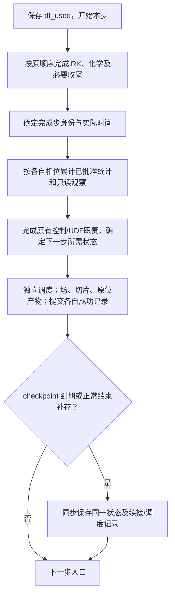
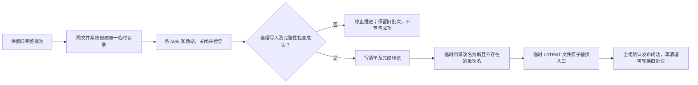

# ASTR 输出与重启语义重设计

状态：OR0/OR1 基础件已验证；OR2 周期五变量 TGV 完整步精确续算已接入并通过首轮短测。默认旧输出未切换。
日期：2026-09-30。
核对基线：`5c54920`，当前分支 `feature/gpu_dev`。

阅读顺序：第 4 节记录已确认决定，第 5 节为已批准的验收范围，
第 6 节是源码状态清单，第 7–10 节为建议实现与实施顺序。
第 8.1 节说明显式启用的候选配置接口，第 10.9 节记录真实 TGV 验收范围。
其余算例、重新分区、场/切片与统计续接仍是后续目标，不是已有发布能力。
第 6.2 节的时钟问题已单独获批修复并通过短测。

## 1. 用户目标与工作边界

- 重新设计 checkpoint 等输出的状态语义，方便后处理和重启。
- 减少重启依赖的额外文件，并评估能否减少重复数据存储。
- 与当前完整步原位采样、统计续接和可视化接口协调。
- 访谈阶段仅记录设计；后续用户已批准时钟修复并要求继续重设计。
  当前只推进有界本地实现与验证，不操作外部任务，不自动提交 Git。

减少文件数量、减少总字节数、减少设备到主机传输是三个不同目标。
合并文件不自动减少数据量；删去补偿余量、边界历史或统计累计状态可能改变续算结果。
已选择每个保存时刻一个 checkpoint 目录作为恢复入口，内部按用途组织
少量并行 HDF5 文件。具体数据集布局和默认配置由本总稿提出，待审阅冻结。

## 2. 当前实现依据

| 路径 | 当前行为 | 核对入口 |
| --- | --- | --- |
| 普通 CPU 输出 | 第一 RK 子步滤波、边界和梯度处理之后，第一次 RK 更新之前写出；反应流 checkpoint 有单独路径 | `src/mainloop.F90::time_integration_rk/rkfirst` |
| GPU 普通输出 | 推进前下载流场；部分边界在主机副本上处理后写出 | `src/mainloop.F90::time_integration_rk` |
| GPU 精确流场续算 | 五变量非反应路径另存主机边界处理之前的守恒量，包括重复节点和 halo | `src_gpu/checkpoint_gpu.cuf` |
| CPU 原位配对续算 | 显式配对批次另存首次滤波之前的守恒量 | `src/insitu_session.F90::capture_insitu_cpu_checkpoint` |
| AIR5 补偿续算 | HDF5 含守恒量、补偿余量及相关顶面状态 | `src/readwrite.F90::write_io_tree` |
| 原位采样 | 完整推进函数返回后采样；当前有界验收不代表全算例支持 | `src/mainloop.F90::steploop` |
| GPU 传统切片 | 先整场下载，再在主机抽取平面；当前 GPU 切片不写梯度 | `src_gpu/commarray_gpu.cuf::copy_flow_from_gpu`、`src/readwrite.F90::writeslice` |
| 旧恢复点与场文件耦合 | `writechkpt` 调用 `writeflfed`；`lwsequ` 控制编号场文件或覆盖式名称，不能据此当作已经独立的三类输出 | `src/readwrite.F90::writechkpt/writeflfed` |

旧 CPU 输出位置不是两次 RK 更新之间，但已经执行了下一步的部分预处理。
不能仅凭相同 `nstep/time` 就把所有输出视为同相位状态。

## 3. 与已有设计的关系

[原位后处理计划](ASTR_INSITU_POSTPROCESSING_PLAN.md) 的既有实现保留旧流场格式，
采用独立统计文件和配对批次。本次已确认的新设计将改变未来新输出路径的这些限制，
但新文件格式尚未实施，不撤销旧版本的有界验收结论，也不宣称已有文件可由新入口读取。
[ADR 0017](../docs/adr/0017-keep-file-output-as-cpu-owned-boundary.md)
允许 CPU 负责文件 I/O，不要求整场下载；本次不默认引入 GPU 直接文件写入。
已确认的术语沿用 [CONTEXT.md](../CONTEXT.md)，新的有取舍决定经用户确认后再写 ADR。

## 4. 已确认决定与设计落点

| 编号 | 决策 | 状态 |
| --- | --- | --- |
| O1 | 同后端、同拓扑续算是否要求逐值一致，以及精确续算的适用条件 | 已确认：保留精确续算目标 |
| O2 | CPU/GPU 互换、改变 rank 数或拓扑的重启需求与误差要求 | 已确认 A：同后端跨分解，跨后端暂缓 |
| O3 | 完整耦合步状态的统一输出时刻及步号、时间、步长定义 | 已确认 A：统一完整步输出 |
| O4 | 初期覆盖的非反应流、AIR5、边界、网格和可选功能 | 已确认 A：两类流动均纳入首期，代表矩阵见第 5 节 |
| O5a | 每个 checkpoint 的文件组织 | 已确认 B：目录入口，内部多文件及清单 |
| O5l | checkpoint 目录内部的文件布局 | 已确认 A：按用途组织少量并行 HDF5 文件 |
| O5v | 其他后处理软件的首期直接读取范围 | 已确认 A：ParaView 与 Python，Tecplot 暂缓 |
| O5b | checkpoint 是否必须附带直接可视化场；存储与传输取舍 | 已确认 A：按需输出，支持离线导出 |
| O6a | 静态网格、配置及入口源数据的依赖管理 | 已确认 A：运行级共享不变资源 |
| O6 | 流场续算、统计续接、边界及动态入口状态的保存和恢复契约 | 沿用既定统计规则；源码清单和未闭合项见第 6 节 |
| O7 | 可视化字段与重启字段的关系；切片、梯度、坐标与单位 | 已确认 A：基础字段默认，派生量按需 |
| O7s | checkpoint、三维流场序列、二维切片序列的职责与独立保留 | 已确认：三类独立，场与切片开启后默认全部保留 |
| O7g | 首期切片的几何定义与位置选择 | 已确认 A：多位置固定全局 i/j/k 索引截面 |
| O8 | 旧文件读取、新格式默认值、版本识别及迁移 | 已确认 B：新入口只接受新格式 |
| O9 | 步数和物理时间调度、初末帧、去重及停机保存 | 已确认最终 checkpoint 和两种独立调度；初始/末帧选项待配置冻结 |
| O10 | 写入完整性、损坏拒绝、保留策略、同步或异步写盘 | 已确认同步、安全保留 1/2 份、写入失败停止；默认值及发布实现待定 |
| O11 | 验收范围、资源预算、实施顺序及旧文档同步 | 已确认首期本地有界范围；预算与实施建议见第 8、10 节 |
| O12 | 新输出配置入口与旧 controller 的职责分离 | 已确认 A：独立 Fortran namelist |
| O12r | 重启时调整文件输出开关及频率 | 已确认 A：允许显式修改，不改变统计采样 |

### O1 已确认：保留精确续算目标

用户确认：依旧保留精确续算目标。
在同可执行程序、同后端、同 MPI 拓扑、相同数值配置和确定性运行条件下，
要求连续运行与分段重启逐值一致。除流场外，统计续接和有记忆的边界状态
也要有明确恢复要求。该决定是新设计目标，不宣称当前所有算例均已满足。
跨后端、跨拓扑的数值等价是另一个验收问题，不默认要求逐位一致。
先合并和去除可证明冗余的记录，不以丢弃必要状态换取文件简化。

逐值一致针对影响续算的数值状态及约定的比较输出，不要求 HDF5 容器、
生成时间、日志或批次标识逐字节一致。改变格式或恢复流程后须重新验收。
拒绝以容差一致替代此目标。见 [ADR 0039](../docs/adr/0039-preserve-exact-continuation-in-output-redesign.md)。

### O2 已确认：同后端跨分解，跨后端暂缓

用户选择方案 A。首期目标包含同后端改变 MPI rank 数和拓扑的重启，
CPU 到 CPU、GPU 到 GPU 分别验收。网格和物理问题不因重新分区而改变。
CPU/GPU 互换暂缓，但格式设计应预留兼容空间，不声称首期已支持。

原配置连续/重启仍执行 O1 精确门槛。改变分解可能改变归约和浮点运算
顺序，采用单独的数值等价验收，不默认要求后续轨迹逐值一致。
具体误差容差、比较时长、拓扑组合及统计/边界状态的重新分区规则待定，
不能凭流场能读入就宣布迁移成功，也不能静默清空原统计窗口。
已选目录入口及按用途组织的 HDF5 文件；不能只记录原 rank 的本地位置而缺少可重新分区的信息。
见 [ADR 0040](../docs/adr/0040-support-same-backend-repartitioned-restart.md)。

### O3 已确认：完整耦合步统一输出

用户选择方案 A。新 checkpoint、三维流场、切片和原位采样统一观察完整推进步结束的状态，
位于下一步首次滤波、边界预处理或化学更新之前。反应流必须包含该步的
全部化学和输运更新。该选择不移动既有数值算子，不额外施加一次滤波或边界更新。
各类输出独立调度，不要求每步均输出或所有产品同时输出。
以已完成步数和该状态实际物理时间标识输出，区分刚完成步的步长与下一步步长。
恢复后从下一步入口继续，不重复执行已完成步的更新。

派生量必须由同一采样状态生成，不能未经核对使用最后一次 RHS 留下的梯度。
采样、辅助 halo 整理和派生量计算不得修改权威推进状态，开启输出与关闭输出
的连续推进结果须一致。checkpoint 必须保留续算所需状态，不能用可视化副本
替换权威状态，也不能因只保存物理域而直接假定 halo 可无差异重建。
旧 checkpoint 不在新入口兼容范围，见 O8。旧统计相位的兼容约束见第 6.3 节，
初末帧默认值见第 8 节建议，不因本项决定而改变旧统计定义。
见 [ADR 0041](../docs/adr/0041-unify-new-output-at-completed-step-boundary.md)。

### O4 已确认：非反应流与 AIR5 同属首期

用户选择方案 A。现有非反应流与 AIR5 反应流同时纳入文件设计和首期交付目标，
按非反应流到 AIR5 的顺序实现验收。AIR5 所需的双温守恒状态、化学补偿余量
和有记忆的边界状态必须纳入数据清单，不能因为非反应流门槛已过就宣布首期完成。
这不增加新物理模型，也不表示当前原位渲染已支持 AIR5 或静态 CURVE。
具体边界、网格、统计和可选功能组合仍需单独列出支持矩阵。

### O5a 已确认：目录入口与成组管理

用户选择方案 B。每个保存时刻生成一个目录，内部包含必要的数据文件和清单，
重启只指定目录，由程序核对同批次成员，不要求用户手工配对附属文件。
内部采用 O5l 的少量并行 HDF5 文件及清单，不采用每 rank 独立文件的默认布局。
具体文件数量、数据集分组和分块粒度仍待设计。

目录内必须保留 O1 所需的精确状态与 O2 所需的重新分区信息，不能因文件
分工而丢弃或错配化学补偿、边界历史和统计状态。写入与完整发布协议在 O10
决定；静态网格、输入配置和入口源数据按 O6a 的共享资源规则管理。

用户希望便于其他软件读取后处理。目录组织便于区分职责，但不自动提供软件
兼容性；仍需定义字段含义、物理坐标、节点或单元归属、分区接口和时间描述。
不假定任意 HDF5 文件均能被后处理软件直接识别。
见 [ADR 0042](../docs/adr/0042-use-directory-entry-for-checkpoint-bundles.md)。

### O5v 已确认：ParaView 与 Python

用户选择方案 A。首期要求 ParaView 及 Python 读取所声明的后处理字段，
包括网格、字段及时间序列；Tecplot 适配暂缓，不作为首期验收条件。
HDF5 数组配合 XDMF 网格和字段描述是待评估候选，不是已选定格式。
ParaView 官方 [XDMFReader 说明](https://www.paraview.org/paraview-docs/v5.13.0/python/paraview.simple.XDMFReader.html)
明确区分 XML 元数据和 HDF5 大数组；目标安装版本及实际布局仍须验证读取。

后处理场不要求随每次 checkpoint 生成。字段直接引用已有数据还是另存原始变量，
以及额外存储开销，仍待确定。后处理软件不应被要求理解化学补偿余量
或内部统计累计记录才能打开一份已声明可视化的流场。

### O5b 已确认：按需输出与离线导出

用户选择方案 A。checkpoint 负责完整续算，三维后处理场通过独立开关和
频率输出；支持需要时从 checkpoint 离线导出可视化场，不推进流动。
仅为精确续算而保存的 checkpoint 不强制重复保存全部原始变量或派生量。
这意味着并非每份 checkpoint 都能直接在 ParaView 中打开全部常用物理量，
可能先需要一次离线导出；静态网格和物性配置等依赖须随恢复契约明确。

离线导出不修改源 checkpoint，不推进 RK 或化学子步，也不累计新的统计样本。
导出的物性和派生量须使用与保存状态相容的定义；不能重新初始化边界后把
改变了的流场冒充 checkpoint 原状态。工具入口及资源要求待实施设计确定。
优先复用已有数据，不能把“可直接读取”直接等同于必须复制一份整场。
具体字段集合、是否导出梯度和存储量预算在后续问题中冻结。

### O6a 已确认：运行级共享不变资源

用户选择方案 A。一次运行的静态网格、固定入口剖面或已冻结的入口序列等
不变资源集中保存一份，各 checkpoint 通过相对位置和内容身份引用。
移动算例时须携带所选 checkpoint 及其引用的资源，不能只复制 checkpoint
子目录。小型恢复元数据随各 checkpoint 保留；各保存时刻的边界历史、
入口时间索引、补偿余量和统计状态不属于可共享的静态资源。

必须列明资源清单，不依赖原机器的未声明绝对路径。变化中的入口
数据不能当作不可变资源处理，其版本和所需范围需单独定义。
此选择只涉及数据依赖，不承诺任意计算环境下逐值一致，也不等同于打包编译器
或可执行程序。依赖缺失或内容不匹配的处理规则将在恢复契约中明确。
见 [ADR 0043](../docs/adr/0043-share-immutable-restart-resources-per-run.md)。

### O6 继承的统计续接规则

沿用原位计划第 1.4 节已确认要求：默认续接原统计，允许显式新开窗口。
恢复同相位累计量、时间权重、上一有效样本和窗口身份，不重复累计 checkpoint
样本，也不把停机墙钟时间计入物理积分。缺失或不兼容的统计记录不得静默清零。
首次从未启用该统计的合法新格式 checkpoint 开启统计时，新建窗口，不补造
历史样本。原位旧计划中的旧 checkpoint 条款不构成新入口的旧格式兼容承诺。
这些规则不冻结新文件布局；跨拓扑统计重新分布及各边界的必存状态仍需审计。

### O8 已确认：新入口只接受新格式

用户选择方案 B。首期新重启入口只接受新格式，明确拒绝旧格式，不自动调用
旧恢复流程，也不靠目录改名或重新标记时间相位把旧状态认作新 checkpoint。
新格式验收通过后，新输出路径采用新格式。

现有旧 checkpoint 及其算例继续由匹配的旧版本程序处理。旧到新的迁移工具
不属于首期交付；若以后需要，须单独审查状态完整性和相位，不能通过格式转换
补回原本未保存的精确状态。新离线导出工具的输入同样限定为新格式。
本轮不删除历史源码或文件，不更改正在运行的任务；具体源码清理在实施范围中确定。
见 [ADR 0044](../docs/adr/0044-limit-redesigned-restart-to-new-format.md)。

### O7 已确认：基础字段默认，派生量按需

用户选择方案 A。基础字段组包含密度、三分量速度、压力、平动温度；AIR5 增加振动温度
和五种组分质量分数。它们是可视化或离线分析字段，不替代 checkpoint 中的
权威守恒量、补偿余量或有记忆状态。

默认只输出基础字段组，速度梯度、涡量、Q 等按需启用，适用于三维后处理场
和切片。基础字段默认值不意味着必须开启文件输出。
派生量须依据同一完整步状态和声明的离散定义生成，并记录单位与归一化。
软件默认梯度与 ASTR 离散梯度不自动视为数值等价。

保存或引用物理坐标、时间及字段归属信息；具体字段标识和布局
待接口设计冻结，不假设当前 AIR5/CURVE 已具备全部派生量输出实现。

### O7s 已确认：三类保存产品独立管理

用户指出恢复点与流场序列容易混淆，并询问完整流场和切片序列如何保存。
用户随后确认三类输出独立管理，三维场和切片一旦开启，默认全部保留。
用户另行选择 checkpoint 可保留最近两份或仅保留一份，见 O10b。
用户已允许单份模式先写新批次再清理旧批次，具体发布实现仍待设计，本次访谈不实际删除文件。

采用以下职责划分，作为 O3/O5b 的具体化：

| 产品 | 保存内容和用途 | 生命周期 |
| --- | --- | --- |
| checkpoint | 精确续算所需的完整数值状态、统计和边界记忆及依赖引用；通常包含全域守恒场 | 可选最近两份或仅一份；新批次完整发布后才清理旧批次 |
| 三维流场序列 | 多个实际时刻的全物理域后处理字段，供离线切片、等值面、流线等分析；不承诺包含全部重启状态 | 独立输出、默认累积保留，不随恢复点轮换删除 |
| 二维切片序列 | 多个实际时刻指定切面上的字段；不能恢复未保存的三维域 | 独立输出、默认累积保留，不随恢复点轮换删除 |

三者共享完整步采样语义，但分别配置开关、频率、字段和输出位置；可同时开启，
也可只启用其中一类。这里的全域表示空间覆盖完整，不要求保存所有派生量。
checkpoint 的必存状态不能由后处理字段选择删减。“全部保留”指保留按配置
实际输出的全部时刻，不意味着每个计算步都必须输出。三维场与切片默认不轮换、
不覆盖已有时刻，不能在空间不足时静默删除旧帧或降低输出频率。
原位图片、流线几何和涡面几何仍是另外的提取产品，不代替三维场序列。

仅作需求示例：每 1000 步保存恢复点、每 100 步保存三维场、每 10 步保存
切片。示例不是默认频率，也不是性能承诺。完整场与切片记录其实际时间，
按选定的读取格式提供时间序列入口。

三者同时到期时可复用同相位采样、打包或传输结果，但必须保证各自的数据
生命周期。长期流场序列不能仅引用随后会被清理的 checkpoint 文件；如存在
共享数据，清理必须保留仍被其他产品引用的数据。只开二维切片时，目标是
仅打包和传输切片所需数据，而不借此强制写出完整三维场或 checkpoint。
见 [ADR 0045](../docs/adr/0045-retain-postprocessing-series-independently-of-checkpoints.md)。

### O9 已确认部分：正常结束补存最终 checkpoint

用户选择方案 A。在 checkpoint 功能已开启且程序正常结束时，如果最后一个
已完成步尚无完整可用的 checkpoint，补存一次最终状态；若已经保存同一状态，
不重复写出。该保存使用 O3 的完整步语义，不额外推进一步，不强制生成三维
后处理场或图片。显式关闭 checkpoint 时不因退出而写入大文件。

该问题仅涉及正常结束。数值异常、MPI/CUDA 故障、强制终止或半个推进步
不能自动视为合法最终状态；受控停机和信号响应另行设计。步数/物理时间
调度与初始帧规则仍需在配置契约中明确，不由本项选择自动确定。

### O10 已确认部分：首期同步保存

用户选择方案 A。首期采用同步 checkpoint。在完整步边界冻结本次保存状态，
完成所需传输、并行文件写入和整组成功确认后，才允许下一步推进。
可以采用有界的分块传输或写入，不要求额外复制整份设备状态以供后台使用。
同步指保存与推进的先后关系，不改变计算核函数现有的同步策略。

首期不实现后台快照队列或计算与 checkpoint 写盘重叠。未来若引入异步，
必须另行核对独立快照、内存预算、并发契约和错误传播，不能直接让后台读取
持续更新的求解器数组。保存成功指整组完成，而非仅发起写出。
保留方式见 O10b，写入失败策略见 O10c；具体发布协议仍需按文件系统约束设计。

### O10b 已确认部分：可选保留一份或两份

O7s 已确认。本项只决定 checkpoint 的保留方式，不影响完整流场和切片序列。
用户要求提供两种选项：保留最近两份，或仅保存一份并替换旧恢复点。
选项的默认值尚未确定，配置字段名也未冻结。本轮仅记录设计，不执行删除。

“保留一份”规定成功保存后的常规恢复点数量，不自动等同于逐文件覆盖
唯一有效恢复点。多文件直接覆盖若中途失败，可能混合两个保存时刻的状态，
导致新旧恢复点都不可用，与可恢复性目标冲突。

用户确认允许安全替换及临时空间：新批次先写临时目录，所有必需成员写入并核对成功后发布，
最后清理超出保留数量的旧批次。单份模式更新期间暂时需要两份容量，
双份模式更新期间暂时需要三份容量；共享资源和受保护副本另计。
写出失败时不破坏旧恢复点。固定恢复入口如何切换、完成标记与持久化保证
需按目标文件系统设计，不能假设能用一次重命名直接替换一个非空目录。

两种模式下，独立后处理输出不因 checkpoint 轮换而删除；共享资源、
用于此次恢复的源 checkpoint、外部目录和不属于当前运行的文件不得被顺带清理。
具体保存身份、保护标记、受保护副本的计数和目录所有权规则需在实现前冻结。
见 [ADR 0046](../docs/adr/0046-publish-checkpoints-before-retiring-old-generations.md)。

### O10c 已确认：checkpoint 写入失败停止推进

用户选择方案 A。checkpoint 写入失败时明确报错，停止后续推进并以失败状态
退出；保留仍完整的旧恢复点，不发布不完整新批次，不通过降低字段或跳过必需
状态继续宣称保存成功。错误报告包含失败批次和已知的最后完整恢复点。

该选择仅涉及 checkpoint，不修改既有原位渲染的单帧故障策略。进程丢失或
通信环境损坏时不能承诺正常收尾；所有情况下都不能把半组文件作为成功恢复点。

### O9b 已确认：统一的步数或物理时间调度规则

用户确认将原位计划第 1.5.1 节的调度规则扩展到 checkpoint、三维场和切片：

- 每类输出独立选择步数或物理时间模式，独立设置间隔，不隐含组合触发。
- 步数指完整推进步，不计 RK 或化学内部子步。
- 物理时间模式在首次达到或越过目标的完整步输出，记录实际状态时间；
  不为输出调整推进步长，不把插值状态用作精确 checkpoint。
- 单步跨越多个目标时，该产品只输出一次当前状态，记录跨越情况，
  不复制同一份数据来假装存在多个历史时刻。
- 恢复必要的调度进度和起算基准，避免重启后重置周期或重复输出。
- 时间单位沿用算例定义，无量纲时间不得标为秒。

最终 checkpoint 另执行已批准的 O9 补存规则，并与周期输出去重。
重启时主动修改输出周期按 O12r 执行。初始状态、三维场与切片的末帧选项及
具体配置字段见第 8 节建议；不自动修改统计时间权重或旧输入字段含义。

### O7g 已确认：固定全局索引截面

用户选择方案 A。首期支持固定全局 i/j/k 索引的网格截面，每个方向可指定
多个位置。保持原网格节点上的采样，不引入空间插值。静态 CURVE 上截面
可能是曲面，必须输出或引用实际三维坐标，不把固定 j 等同于物理 y 常数。
索引和节点归属不能随 MPI 分解变化，具体重复节点所有权在接口中定义。

首期不增加求解器输出侧的任意物理平面定位和插值。
这不限制从已保存三维场在 ParaView 中离线截取任意平面；仅保存固定
索引切片时，不能恢复未保存位置的数据。原位渲染流水线的已有切面功能与
新的求解器直接切片输出是不同接口，不据此推断后者已具备任意平面提取能力。

### O5l 已确认：按用途组织少量并行 HDF5 文件

仍保留已选定的目录入口，不重新讨论单文件入口与目录入口的取舍。

用户选择方案 A。按用途组织少量 HDF5 文件及清单，文件数量不随 MPI rank 数
线性增加。各 rank 通过并行 I/O 写各自负责的数据区域，不先汇集全部流场到
单个根进程。保存全局索引、分区信息及必要的分区专属精确状态，具体分组和
数据集布局须同时满足原拓扑精确恢复与跨拓扑读取。

不采用每 rank 一个分片文件的首期方案，但不据此声称该备选不能跨拓扑恢复。
本选择不等于减少保存字节数或已获得更高 I/O 性能；集体操作顺序、元数据
开销和分块内存仍需实测，也不能省略整组一致发布和完整性检查。
文件命名、数量、HDF5 数据集布局和后处理描述格式均未因此冻结。
见 [ADR 0047](../docs/adr/0047-use-role-based-parallel-hdf5-checkpoint-files.md)。

### O12 已确认：独立 Fortran namelist 输出配置

用户选择方案 A。增加独立的 Fortran namelist 输出配置文件，以有名称的参数
分别配置 checkpoint、三维场和切片，不继续扩展旧 controller 的位置式字段。
新配置是新输出的唯一控制入口，不允许旧频率字段同时驱动同一输出路径。
文件名、缺省行为、必填项、配置冲突拒绝及重启时改配置的规则待配置表冻结。

原位模块已有 namelist 配置读取模式可参考。当前 `readcont` 的控制文件位于
`datin/controller`；`feqchkpt` 在 `steploop` 还触发控制重载和 CFL 检查，
不能因为拆分输出就直接删除这些非输出职责。采用独立入口不等于移除 controller。
本问题不自动授权运行中热重载新配置，也不把旧 checkpoint 兼容选择扩大成
删除全部旧输入控制功能。

### O12r 已确认：续算时允许显式调整文件输出

用户选择方案 A。允许重启时显式调整 checkpoint、三维场和切片的文件输出
开关及间隔。未修改的调度恢复原进度；修改的调度显式记录新的起算基准，
不补造停算前未保存的帧，不覆盖既有归档。具体冲突拒绝、输出目录和编号
规则在配置表中定义，不能仅因文件名相同就覆盖原运行结果。

该调整只影响文件输出，不重置统计窗口、不改变统计采样周期或累计权重，
也不改变数值推进配置。需验证调整文件输出不会改变同配置的权威流场。
统计采样配置变更属于单独的统计续接问题，不随文件输出修改隐式生效。

该选择不自动包含运行中热重载新输出配置，首期是否热重载在配置能力边界
中明确；不能借用 controller 重新读取路径绕过全 rank 配置一致性检查。

## 5. 已确认的首期验收范围（O11）

用户确认：首先在本地用小网格和短推进窗口完成语义与数据完整性验收，不启动新的
长时生产算例或 A800 作业。改变代码后不能直接沿用旧格式的重启通过结论。

### 5.1 代表性流动

| 类别 | 主要覆盖面 | 已有测试入口，仅作为改造参考 |
| --- | --- | --- |
| 周期 TGV | 五变量完整步、CPU/GPU 各自精确续算、原位统计配对和同相位输出 | `run_insitu_cpu_paired_restart.py`、`run_insitu_paired_restart.py` |
| 槽道流 | 非周期壁面、驱动及已有统计、标量/全变量滤波工作区 | `run_release_boundary_filter_restart.py --case channel` |
| 静态 CURVE 平板 | 共享曲线网格、物理坐标、索引切片、边界及几何相关派生量 | `run_release_boundary_filter_restart.py --case curve` |
| AIR5 平板及特征顶面短测试 | 双温、组分、非零化学补偿、有记忆边界及完整耦合步 | `run_air5_c5_hbl_restart.sh`、`run_air5_characteristic_restart_gate.py` |

这里不重新验证全部物理模型。状态清单若发现时序入口等额外持久状态，补
对应的针对性短测试，不把四类基础算例扩展成所有参数的笛卡尔积。
现有脚本依赖旧格式，不能直接调用后就宣称新格式通过；需要相应新格式对照。

### 5.2 独立验收条件

1. 同后端、同拓扑连续运行与分段续算逐值一致，包括必需的化学、边界与
   统计状态；比较数值内容，不要求容器元数据逐字节一致。
2. CPU、GPU 各自覆盖 NP=1/2，跨分解覆盖 1 到 2、2 到 1，以及两个不同
   两-rank 分解方向；检查全局索引、共享节点和切面所有权。具体支持组合
   依算例边界选择，不做无意义的全组合。
3. 跨分解误差沿用对应算例已批准的有量纲/归一化规则并在运行前冻结，
   不以一个绝对容差统管所有 AIR5 变量，也不把可读文件当作数值等价证明。
4. 新文件输出开关、频率及恢复时显式调整不改变权威流场和既定统计采样。
   checkpoint、三维场、切片和原位观察对应相同完整步身份。
5. ParaView 与 Python 读取坐标、基础字段、选定派生量及时间序列；切片
   与同相位三维场的对应节点一致。离线导出不推进计算、不改变源批次。
6. 覆盖步数/时间触发、越过目标、重启去重、最终补存、关闭输出及单份/双份
   安全替换；缺件、错配、损坏、旧格式及注入写入失败均不得被报告为成功。
7. 移动目录并携带共享资源后可以恢复和导出；缺失或错误资源明确拒绝。
   checkpoint 轮换不破坏长期保留的场和切片序列或本次恢复源。
8. 记录实际文件数量、字节数、附加主机/设备内存及必要传输量，证明切片
   专用路径不强制整场下载或整场落盘。先给出实测，不预先承诺 I/O 加速比。

新进程恢复是必测路径，不能以同进程内存还原代替。首先运行最小受影响门槛，
任何数值或状态一致性失败就停止后续性能结论。小规模通过不外推为多节点
文件系统吞吐认证，也不解决此前 256^3 长序列原位渲染内存增长问题。

### 5.3 设计收口与实施授权

本总稿已补充以下状态清单、布局、配置、流程及阶段建议，统一提交审阅，
不继续逐项询问文件名。验收范围获批不等于已经完成验收，也不等于自动授权
修改 CPU 数值行为、运行长任务或提交 Git。

## 6. 源码状态清单与阻塞项

本节核对当前维护路径，不是对所有历史 UDF、湍流模型或外部化学后端的完整审计。
判定标准不是数组是否带 `save`，而是下一步是否会在重新赋值前读取其内容。

### 6.1 必存、可重建与待证明状态

| 状态 | 当前源码依据 | 新格式要求 |
| --- | --- | --- |
| 完整步身份及后续控制 | `src/mainloop.F90::steploop`、`src/readwrite.F90::readcont` | 保存完成步数、实际时间、本步步长、下一步步长、控制重载进度及兼容性配置；不能只保存一个含糊的 `deltat` |
| 权威守恒量 | `src/commarray.F90`、`src_gpu/checkpoint_gpu.cuf` | 保存 FP64 `q`，不是 `qsave=q*jacob`；保留恢复原 rank 副本所需的重复节点与 halo，不先假设可重算 |
| AIR5 分量定义 | `src/chemistry_core.F90::chemistry_state_layout` | 当前存储为 11 分量，含密度、三动量、总能量、五组分密度及振动能；显式记录组分顺序、闭合方式和能量约定，不由变量数猜含义 |
| AIR5 补偿 | `src/chemistry_compensation.F90`、`src_gpu/chemistry_compensation_gpu.cuf` | 开启时必存 `air5_carry`；当前表示值为 `q-carry`，不可先合并成一个 FP64 数再保存 |
| 边界目标与模式 | `src/chemistry_boundary.F90::air5_top_contract/write_air5_top_checkpoint` | 现有记录为顶面模式、版本和 38 个契约值，主要是固定目标及参数；不是额外边界时间历史。演化边界节点仍属于守恒状态 |
| 槽道驱动状态 | `src/statistic.F90::statcal/chanfoce` | `force`、`massflux_target`、冻结驱动力及其初始化标记影响后续 RHS，纳入续算状态；不能当作可丢弃的日志 |
| 动态入口 | `src/bc.F90::inflowintp`、`src_gpu/inflow_timeseries_gpu.cuf` | 保存 `ninflowslice`、有效时间窗及去重进度；四帧缓存仅在能由已冻结源数据精确重建时省略。越过读帧阈值前后均测试 |
| CPU 传统均值 | `src/statistic.F90::meanflowcal` | 保存已启用累计数组、`nsamples`、起始时间/步号及最后累计步号，保留原有采样定义 |
| GPU 紧凑统计 | `src_gpu/production_statistics_gpu.cuf` | 保存平面/壁面累计量、测度、采样计数、起始时间及最后采样步。不能只保存最终均值；现有文件按原分区保存，跨分解需新映射 |
| 原位速度统计 | `src/insitu_velocity_statistics.F90`、`src_gpu/insitu_statistics_gpu.cuf` | 保存均值、中心矩、时间/密度权重、上一有效样本及时间、窗口身份；RMS 等展示结果不是充分恢复状态 |
| 调度状态 | `src/insitu_schedule.F90`、`src/insitu_session.F90` | 各产品保留周期、起点、已见/已输出身份、目标序号及终止标记的明确恢复规则；作业结束不自动表示未来续算也应结束 |
| 几何及模型资源 | `src/initialisation.F90`、网格/物性初始化及输入读取路径 | 静态坐标、配置和外部表共享引用。度量和物性缓存只有经过重建一致性检查才可省略，不凭数学等价推断浮点结果相同 |
| RK/化学工作区 | `src/mainloop.F90`、`src/chemistry_kinetics.F90::air5_ros2_advance` | `qsave`、`air5_origin*` 等在下一步先重写的工作区不存；ROS2 内部为调用局部状态，但调用方是否跨步复用 `suggested_step` 仍需逐路径核查 |
| 可扩展用户状态 | `user_define_module/userdefine.F90::udf_eom_set` 等 | 当前默认结束钩子为空，不推断所有自定义模块无状态。新增有记忆 UDF 必须声明序列化接口或明确拒绝精确续算 |

原始变量 `rho/vel/prs/tmp/spc/tve` 与物性缓存不统一归为“都必存”或“都能重算”。
先审计下一步实际读取顺序；若与连续运行相同的重建流程不能保持逐值一致，
则保存必要缓存，或在获得数值行为变更批准后统一连续/恢复路径。
通信请求、文件句柄、设备地址不写盘，恢复时重新建立。

当前恢复路径在 `src/initialisation.F90` 先读原始变量并 `updateq`，再覆盖精确
守恒量；新格式不能把这一流程原样搬走后就认为缓存已相容。
完整步仅是更清楚的存档边界，并不自动使所有未保存状态变为无关状态。

### 6.2 已获批修复：步长重载后的时钟推进

修复前基线 `5c54920` 的静态源码证据：

1. `src/mainloop.F90:115` 在推进前保存 `completed_step_dt=deltat`。
2. 推进后原位采样使用 `time+completed_step_dt`。
3. 同一循环稍后调用 `readcont`，而 `src/readwrite.F90:802` 会重新读入全局 `deltat`。
4. `src/mainloop.F90:228` 最后执行 `time=time+deltat`，而不是本步实际步长。

当重载值与本步步长不同，循环时钟与刚完成状态的物理时间不一致。
`cflcal` 的步长参数为 `intent(in)`，本处问题来自 controller 重载，不是 CFL
自动改步长。固定步长且文件未变时没有这一差异。

用户确认修复后，仅将循环末尾改为 `time=time+completed_step_dt`，新增一行说明。
原位采样和 CFL 已使用该步长。全局 `deltat` 保持重载后的值供下一步使用，
控制读取、UDF、滤波、边界和化学调用顺序没有改动。

回归脚本：`tests/gpu_validation/run_complete_step_clock.py`，使用真实 16^3 TGV、
显式格式、开启滤波和黏性，旧 `maxstep=11` 循环实际执行 12 次完整推进。
脚本在看到 CFL 记录后原子替换独立测试目录内的 controller，使步长经历
`0.001 -> 0.002 -> 0.0005`，并要求日志确实出现三种已用步长。
每条状态时间对照累计已用步长；不能以修改文件成功代替重载生效。

- 修复前 CPU NP=1 复现：步标签 2 报告 `0.005`，应为 `0.004`，相差 `0.001`。
- 修复后 CPU/GPU、NP=1/2、恒定/变步长共 8 组通过，96 条 CFL 时钟记录的
  累计误差为 0，144 份原位采样头部的步号、时间和步长逐值对上。
- 修复前后 CPU/GPU NP=1 恒定步长的 24 份完整采样文件逐字节一致。
- 构建入口仍为根 CMake；该结果不是新格式重启、AIR5 完整耦合或跨拓扑验收。

证据目录（均在 `tests/gpu_validation/out/`，不加入 Git）：
`complete_step_clock_20260930_before/`、`complete_step_clock_20260930_fixed_before/`、
`complete_step_clock_20260930_after/`。前者保留预期失败记录，后者有完整 `summary.json`。

另须核对 `do while(nstep<=maxstep)` 与旧输入“终止步号”的对应关系，
新元数据不能把旧循环标签直接当成已完成步数；本项目不顺带修改旧终止条件。

### 6.3 不能整体搬移 rkfirst

`rkfirst` 不只有写文件，还调用 `statcal`、`meanflowcal` 和 UDF。
其中槽道 `statcal` 会更新驱动力，移动到完整步末可能改变实际推进。
建议只抽离文件输出调用，保持这些数值更新的位置及调用次数。
保留影响数值行为的首次调用/恢复分支状态，不能重启后再次走一次初始化逻辑。

checkpoint 保存的是完整步边界时已经存在的统计累计状态；传统统计的最后
采样相位可能仍是第一 RK 子步。分别记录采样相位、实际最后样本时间和窗口，
不将旧累计值改名成完整步时间平均。新的流场、切片及原位观察采用 O3。
未来若统一旧统计采样相位，另列数值与统计语义变更，不混入本次格式重构。

## 7. 建议的数据组织与恢复接口

以下为候选 schema v1，不是已经存在的文件或命令。首版建议使用两个必需
HDF5 文件及一个按需统计文件；一个文件内可有多个用途明确的数据集。

```text
run/
  resources/
    <resource-id>/mesh.h5
    <resource-id>/model.nml
    <resource-id>/inlet/...
  checkpoints/
    LATEST
    <generation>/
      manifest.nml
      state.h5
      continuation.h5
      statistics.h5          # only when statistics are enabled
      COMPLETE
  fields/<segment-id>/...
  slices/<segment-id>/...
  insitu/<segment-id>/...
```

相对资源引用应可随整个 run 搬移，不允许解析到未声明的外部目录。
保存 schema、运行身份、生成批次、父 checkpoint 身份、相位、后端、完整网格、
原 MPI 分解、数值/物理配置、组件版本、必需文件/数据集及资源内容身份。
清单必须区分“不启用所以不存在”和“本应存在但丢失”。
整数步号采用 64 位；浮点类型、字节序、分量名、坐标轴顺序和单位明示。

### 7.1 全局状态与原分区精确记录

| 文件 | 建议内容 | 所有权 |
| --- | --- | --- |
| `state.h5` | 全局物理节点的 `q`、必要时的补偿；原分区重复节点和 halo 的精确记录；经审计确需保存的缓存 | 每个全局节点一个确定的写入者；非所有者副本及 halo 另有原 rank/索引描述 |
| `continuation.h5` | 时钟、控制进度、驱动/边界状态、入口游标、三类输出调度、原分区映射 | 全局标量只写一次；局部状态按全局位置或带原分区描述的扁平数组保存 |
| `statistics.h5` | 实际启用的传统统计、紧凑统计和原位统计，分别标记定义、相位及版本 | 既保留原分区精确累计状态，也提供经定义审核的跨分区恢复规则 |
| `manifest.nml`、`COMPLETE` | 文件和资源清单、必需组件、完整发布身份及完整性检查信息 | 协调进程写少量元数据，不收集全场 |

首选用“全局所属节点 + 原分区额外副本”恢复本地数组，避免全域 `q` 写两遍。
额外副本应保存原始值，不采用相减再相加的浮点残差压缩来承诺逐值恢复。
所有权规则覆盖周期重复端点及多轴分区交线；对不一致副本不能为输出再做平均。
具体去重布局须先通过装配/拆分逐值测试，再用于推进器。

并行 HDF5 由 rank 写所负责 hyperslab，元数据创建和集体调用顺序全 rank 一致。
无所属数据的 rank 使用空选择参加约定操作，不提前跳过集体写入。
复用 `src/hdf5io.F90` 的 MPI-HDF5 基础，但不照搬 `write_io_tree` 的 k 方向
先汇集再写出路径。首版不要求压缩，不以文件数减少宣称吞吐提升。
完整性校验的摘要算法和分块覆盖范围在 schema 冻结时确定，读回必须能检出
受测的数值块损坏；只检查文件存在或长度相同不够。

### 7.2 两条恢复路径

**同后端、同拓扑：** 验证配置后，把原数值状态无算术变换地放回原位置，
恢复必要缓存、补偿、边界及累计状态。初始化通信和 I/O 资源后从下一步正常入口
继续，不额外调用一次会平均节点或覆盖边界的例程来“清理”保存状态。

**同后端、不同拓扑：** 按全局索引读取新子域，重建新邻接和 halo，再执行该路径
已批准的必要准备；原拓扑专属记录不能按新 rank 编号硬套。物理节点、几何、
补偿、边界/入口和统计分别有迁移规则，整个组合完成门槛后才列为支持。
跨后端先明确拒绝，不能因 HDF5 可读就自动放行。

紧凑统计是一个实际难点：原 rank 的展向部分和不能任意分摊成新子域历史。
建议保留原分区记录供精确恢复；跨分区时将已累计的定义明确的全局量作为历史
基线，新增样本继续按新分区累计，读取结果时按原统计定义合并。
中心矩必须使用带权合并公式，不平均各 rank 的 RMS。相位、样本数、覆盖时长
和上一样本须一致。未证明正确的统计组件应阻止该组合跨分解恢复，不静默重置。

### 7.3 后处理文件与离线导出

建议三维场和切片采用独立 HDF5 + XDMF 描述，配套 Python 读取示例。
场文件持有自己的数据，只共享不变网格，不依赖可能被轮换删除的 checkpoint。
字段默认组按 O7；记录实际保存时间、完成步、网格节点归属、量纲和归一化。
用不对称小网格及坐标编码字段检查 Fortran/HDF5/XDMF 轴序，避免 TGV 对称性
掩盖轴交换。实际 ParaView 读取验收前不称作已兼容。

离线导出器复用状态读取和物性接口，不调用 `steploop`，不借“零步运行”间接
执行初始化边界、滤波或统计。默认导出同相位基础字段，派生量从私有副本计算。
仅切片时由 GPU 打包该截面及所需的小范围数据；可选梯度若需邻域，传输范围
须另行记录，不伪称导数只依赖单层节点。完整派生场可分块，不能修改求解器 `q`。

## 8. 配置建议与缺省行为

建议入口为 `datin/input.output`，分为 `output`、`checkpoint`、`volume`、
`slices` 四个 namelist。所有字段在启动时统一读取、全 rank 校验，首版不热重载。
旧 controller 保留非输出职责，旧输出字段不再驱动新写出，也不自动映射成新配置。
建议缺少新文件时拒绝启动并给出最小关闭输出示例，防止用户误以为已有恢复保障。

| 项目 | 建议默认或合法值 | 精确含义 |
| --- | --- | --- |
| 格式 | `format_version=1` | 不识别的必需版本或字段报错；不回退旧格式 |
| 三类 `enabled` | 均为 `.false.`，示例算例显式选择 | 缺省不产生大型文件；不是悄悄继承 controller 的旧开关 |
| 各类 `mode` | `steps` 或 `time` | 启用时只允许一种有效正间隔，时间使用算例单位 |
| 步数间隔 | `interval_steps` | 完成步数量，不包含 RK/化学子步 |
| 时间间隔 | `interval_time` | 到达/越过目标时输出一次，记录实际时间及跨越数量 |
| `checkpoint.keep` | 建议 `2`，合法值仅 `1/2` | 发布后保留的未受保护恢复点数，临时及保护副本另计 |
| 初始 checkpoint | 建议关闭 | 开启时保存合法初始化状态，标记已完成步数为零 |
| 最终 checkpoint | 开启 checkpoint 时正常结束必补存并去重 | 已确认规则，不提供暗中丢失最终状态的默认行为 |
| 场/切片初始帧、末帧 | 建议均关闭，可独立开启 | 不影响周期输出；所有实际写出的帧默认保留 |
| 默认字段 | `basic` | 五变量流动 6 个标量分量：rho、三速度、p、T；AIR5 另加 Tv 和五个 Y |
| 派生量 | 默认不启用 | 显式选择物理速度梯度、涡量或已定义的 Q；分别核对边界/几何支持 |
| 切片位置 | `i_indices/j_indices/k_indices` | 全局节点索引；合法范围由网格给定，去重且越界报错 |
| 重启输出配置 | 默认使用保存配置；显式 `override` 才替换 | 未变的产品恢复调度；改变者以恢复状态为新起点，不补写历史 |
| 三维场/切片归档 | 每次恢复生成新的 `segment-id` | 不覆盖旧帧；未变调度不重复保存恢复点，序列索引关联父段 |
| 缓冲与总预算 | 分开配置，实施前核定本地验收值 | 有界块传输不等于总内存有界；预算包含选中统计及派生临时数组 |

间隔的数值不设通用生产默认。建议仅将单块传输容量 `64 MiB` 作为首轮本地
试验候选，实际附加主机/设备峰值和总预算在运行前核定；不直接套用原位渲染
32^3 的验收预算，也不因空间不足自动减字段或改频率。

恢复时物理模型、网格、数值格式等兼容性校验独立于输出 `override`。
初末帧是否主动输出恢复点需显式选择，不能被当作重复的统计样本。
正常结束保存的调度状态要能够续算：产品的作业终止标记与统计窗口确已结束
分开恢复，避免重启后所有后续帧都被旧 `ended` 标记抑制。

### 8.1 已实现的候选配置模块，显式启用

`src/output_config.F90` 包含本地解析与 MPI 分发两个模块。独立 probe 检查已通过；
随后在主程序接入 `ASTR_OUTPUT_CONFIG=<配置文件>`。
未设置该环境变量时仍走旧输出，不要求新增输入文件。新入口当前仅接纳第 10.9 节
的周期 TGV 配置。旧 controller 仍负责推进控制，新配置负责 checkpoint 调度。
`format_version=1` 在此是配置版本，不代表新 checkpoint schema 已交付。

各组按 `output/checkpoint/volume/slices` 顺序各出现一次；组名和结束符 `/`
分别独占一行，可带注释。数值及逻辑值仍由 Fortran namelist 读取，不用字符串
替换模拟解析。这个记录布局限制用于拒绝被普通 namelist 搜索跳过的未知组、
重复组和结束符后的非注释内容。支持 LF/CRLF。

下例仅用于配置测试，预算数字不是生产建议，所有产品保持关闭：

```fortran
&output
  format_version=1, directory='outdat/output', restart_output='saved',
  buffer_bytes=67108864, host_budget_bytes=134217728, device_budget_bytes=67108864
/
&checkpoint
  enabled=f, mode='steps', interval_steps=100, keep=2, initial_frame=f
/
&volume
  enabled=f, mode='time', interval_time=0.01, fields='basic',
  initial_frame=f, final_frame=f, velocity_gradient=f, vorticity=f, qcriterion=f
/
&slices
  enabled=f, mode='steps', interval_steps=10, fields='basic',
  i_indices=0,8,16, j_indices=12, k_indices=16
/
```

模块拒绝未知字段、非有限/冲突间隔、保留份数不为 1/2、负预算、过长路径，
以及开启产品但主机预算不足一个缓冲块的配置。checkpoint 的最终补存不提供
关闭参数；未来调用者必须先检查 checkpoint 是否启用。切片每轴最多 256 个
输入位置，`-1` 为未使用槽位，重复索引去重，几何创建后单独检查全局上界。
初期容量限制不是最多 256 个网格节点，也不改变实际网格。

MPI 入口先确认各 rank 的配置文件名一致，再由 rank 0 读取并按明确类型广播
各字段。不是逐字节广播带编译器填充的派生类型。读取失败时全 rank 拒绝且
保留传入配置不变。切片的跨 rank 所有权、统计内存和实际设备工作区仍须在
后续运行准入中校验，当前参数检查不替代这些门槛。

## 9. 目标执行流程与故障边界

### 9.1 完整步观察和状态提交



这是目标流程，不是现在代码的调用图。传统 RK 内统计仍留在原位置，不在 D
重复累计；D 只代表本步末应发生的采样。当前默认 UDF 不改变场，若用户钩子
会在观察后改变权威场，必须先明确其属于本步还是下步，不能给两种场同一身份。
时钟修复已通过有界验证，但尚未按此目标图重排实际输出调用。

checkpoint 要保存自身本次成功写出后的逻辑调度进度。写入时用候选状态，
成功发布后才更新活动调度，避免恢复后同一步再次写出；失败直接停止。
归档中可能已有比恢复点更新的帧，重启用新段身份保存，不覆盖、不倒改旧段。

### 9.2 多文件同步发布



`LATEST` 建议是指向批次名的小型文本入口，恢复仍可直接指定批次目录。
不能直接覆盖唯一有效批次内部的 HDF5，也不能假设能重命名覆盖非空目录。
发布前失败不清理旧批次；新目录完成但入口更新失败时，不进行旧批次清理，
报告可人工检查的新目录和仍有效的旧入口。未完成的 `.tmp` 不成为自动恢复候选。

保护规则建议：本次恢复源默认受保护，不计入 `keep`；只轮换当前运行拥有、
未标记保护且没有被归档引用的生成批次。不自动清理共享资源、外部目录或失败
临时目录，不在启动时猜测哪些历史数据“无用”。这些额外空间须计入容量估算。

HDF5 关闭、所有 rank 成功、目录可见和断电持久化是不同保证。
首版应测试目标文件系统的重命名和恢复可见性；刷新文件/目录的实现另核对平台，
不能把 `MPI_Barrier` 当作断电保障。MPI 进程丢失时不保证集体错误处理能完成，
但读端仍必须拒绝未完整发布的批次。

## 10. 实施阶段与停止条件

当前 OR0 的时钟修复和配置基础已落地，OR1 已实现独立状态文件原型；
完整状态注册表、批次 schema 与发布协议尚未关闭。
后续按顺序推进，先验收最小状态恢复，再扩展格式，
不一次重写整个 `readwrite.F90` 或给每个字段创建一个新模块。

| 阶段 | 最小改动及交付物 | 通过条件 |
| --- | --- | --- |
| OR0 状态和配置冻结（进行中） | 时钟修复、独立配置和 MPI 分发已验证；继续冻结 schema、完整状态注册表及本地预算，审计缓存先读后写 | 必存/可重建有依据；未支持组件启动即拒绝；旧 controller 的非输出职责不遗漏 |
| OR1 存储与发布（进行中） | 专用 HDF5 数据集、全局所有权/原分区补充记录、目录事务、版本及资源检查 | 不运行流动也可完成 NP=1/2 装配拆分逐值检查；缺件、损坏、空选择及失败替换测试通过 |
| OR2 五变量完整步续算 | CPU/GPU 数据提供接口；从 RK 内拆出文件 I/O；新恢复入口与 TGV 配对统计 | 两后端分别同拓扑精确续算；输出开关不改变流场；CPU-only 不依赖 CUDA/Catalyst |
| OR3 有记忆状态及 AIR5 | 槽道驱动/统计、入口窗、双温 q/carry、顶面契约；CURVE 必要几何状态 | 第 5 节对应短测试通过，包含非零补偿和入口换帧边界；不宣称新的物理模型验证 |
| OR4 重新分区恢复 | 全局读取、新 halo、边界/入口重分布及统计历史迁移 | 同后端 1↔2 和两个两-rank 方向的批准矩阵通过；无统计丢失/重复，案例专用容差已冻结 |
| OR5 后处理与原位统一 | HDF5/XDMF 场和索引切片、GPU 有界打包、只读离线导出、统一完整步身份 | ParaView/Python 真读回；切片与体场逐节点对上；基础切片不整场下载；原位统计不重复累计 |
| OR6 发布收口 | 步数/时间、初末帧、保留 1/2、移动目录、配置改变及资源峰值矩阵；更新使用说明和示例 | 各独立门槛完整记录，没有把文件可读、数值一致、物理正确和 I/O 性能混成一个通过结论 |

建议模块边界：在 `src/` 内用输出配置/调度、checkpoint 存储与恢复、后处理写出
三个职责组织少量文件，复用现有 HDF5 和原位组件；`src_gpu/` 仅提供设备状态
读取/恢复及截面打包接口。`src/mainloop.F90` 负责调用边界，
`src/initialisation.F90` 负责新恢复生命周期。统计、入口、化学模块各自说明必存
状态，不把所有内部数组暴露给一个通用写盘大子程序。

根 `CMakeLists.txt` 仍是构建入口，`examples/` 继续参与现有构建。
新输出需要一致的并行 HDF5/MPI 依赖，构建时检查能力；不强制引入 ParaView、
Catalyst、Cantera 或 GPU-aware MPI 来运行普通 CPU 输出。Python 读取示例属于
后处理工具，不成为求解器运行时依赖。通过验收后才更新正式用户指南的能力声明。

任何精确续算、有限性、化学补偿、统计定义或资源完整性失败，都停止该路径的
后续性能或生产声明。跨分解失败不能用同拓扑通过代替；新状态注册表未完成时
不能称“所有 ASTR 可选功能均支持新重启”。本阶段不启动长时算例或远程任务。

### 总稿审阅点

- 已批准需求不再重问；第 7–10 节的命名、默认关闭/保留两份、归档新段、缺少
  新配置时拒绝启动以及不热重载，作为一组实现建议提交审阅。
- 第 6.2 节 CPU/GPU 共用时钟修复已获批并通过短测试；变步长新格式续算仍待实施验收。
- 小网格验收资源预算和跨分解变量门槛在对应测试启动前列出，不擅自设定生产
  预算，不以旧格式或旧可执行文件的结果替代新路径验收。
- 256^3 原位渲染资源增长仍由原位计划第 5.1 节处理；本方案不声称已经解决。

### 10.1 2026-09-30 实施记录及下一步

已完成：时钟修复和第 8.1 节配置基础。根 CMake 的 CUDA 构建及关闭
CUDA/Catalyst、`BUILD_TESTING=OFF` 的 CPU 构建成功。新增的两个配置 probe
仅在开发构建提供，不成为生产包的测试源码依赖。

`test_output_config.py` 的 51 项（含 8 项 NP=2 集体读取检查），以及时钟判据/
既有完整步计时解析的 17 项检查共 68 项通过。配置测试执行 Fortran 实现，
Python 仅准备输入和核对结果。流动时钟的 8 组测试另见第 6.2 节。

OR1 首轮预算已由用户批准：纯 CPU/MPI、9x7x5 节点、5/11 分量、NP=1/2，
每 rank 新增测试数组/缓冲不超过 2 MiB，每个测试目录文件不超过 4 MiB。
该预算不是生产默认，不运行物理算例或使用 GPU。测试显式核算 q、额外副本
缓冲与元数据空间；第三方 HDF5/MPI 内部开销不因此被宣称完全受控。

`src/checkpoint_state_io.F90` 提供尚未接入求解器的状态文件原型。
每个分量一个全局三维 FP64 数据集，加上身份、原分区表和一维额外副本数据集。
所有 rank 集体调用 HDF5，流场不汇集到根进程。文件数固定为一份，非每 rank 一份。
全局内部共享节点采用半开区间所有权，最后分区包含域末端节点；周期两端仍是
各自的全局节点。原 rank 中非所属的重复节点和 halo 原值另存，不平均、不相减。

原拓扑读取恢复所属节点和所有额外副本。重新分区读取只恢复新分区物理节点，
不复制旧 halo，不代表已经完成真实跨分区续算。该原型只含 q 与步身份，不含
AIR5 carry、边界记忆、入口历史、驱动或统计状态，因此不能作为完整重启入口。
文件身份保存格式版本、完整步相位、全局维数、分量数、原 rank 数、64 位步号、
time、dt_used 和 dt_next。读端拒绝不匹配的版本、形状、数据类型、分区和无效时钟。
新建采用排他模式，不覆盖既有文件；读端只读。状态文件原语自身不代表已发布
批次，另由下述批次清单原型提供内容校验和 COMPLETE 校验。目录发布和 LATEST
更新见第 10.3 节；当前运行的保留轮换原型见第 10.4 节。

对应测试为 `checkpoint_state_probe.F90` / `test_checkpoint_state.py`。
合成数据故意使额外副本不同于全局所属节点，逐位比较包含负零的 FP64 值，
并覆盖空选择、1<->2 rank 与 x/y 分区读回、破坏元数据/字段及重复写入拒绝。
最终 22 项测试通过，耗时 94.18 s；证据为
`tests/gpu_validation/out/or1_state_20260930_v2.xml` 及同名目录内的 HDF5 文件。
本矩阵最大文件 87,680 字节，未启动 GPU 计算。根 CMake 的 CUDA 构建及
关闭 CUDA/Catalyst 的 CPU 构建均成功。第三方内存峰值未在此轮测量，未验证
大规模 I/O 性能；当前分区元数据合法性检查为两两比较，规模复杂度为 O(NP^2)。
后续先补完整发布/失败注入，再进入 OR2。启用真实新重启前须补齐第 6.1 节
缓存及有记忆状态审计，不能用存储原型通过代替新 checkpoint 可用。

### 10.2 OR1 批次完整性原型

`src/checkpoint_bundle.F90` 增加独立的封存/校验接口，复用现有
`insitu_checkpoint_batch::file_fingerprint` 的 CRC64/ECMA-182 与 64 KiB 缓冲。
所有 rank 必须同意目录和文件清单。数据文件必须由调用方先完成集体写入并关闭，
封存后不得再修改。根 rank 校验各数据文件并写入大小/CRC 清单，清单关闭后
再创建含清单大小/CRC 的 COMPLETE。两个文件均排他创建，不覆盖既有文件。

读端检查标记、清单版本/语法、文件名、重复条目、文件大小和内容 CRC，
并将校验结果分发给所有 rank。文件名只允许当前批次内的简单名称，不允许
路径跳转；共享资源引用及强制角色集合留待批次 schema 接入。CRC 只用于意外
损坏检测，不是加密认证；仍须由字段读取器检查类型、维数和状态身份。

这只是未接入真实重启的完整性原语。目录发布和 LATEST 更新由第 10.3 节
单独处理，保留轮换见第 10.4 节；资源依赖及断电持久化保证尚未实现。失败保留目录供诊断，
不自动清理。
当前由根 rank 串行读取计算 CRC，大文件成本尚未评估，不据此声称 I/O 性能优化。

`test_checkpoint_bundle.py` 的 9 项检查通过，耗时 38.62 s。使用已批准的
9x7x5、11 分量、NP=2 合成文件，并用 NP=1/2 检查封存读回和拒绝路径；
每目录仍低于 4 MiB，无物理/GPU 计算。证据：
`tests/gpu_validation/out/or1_bundle_20260930.xml` 及同名测试目录。
本次 CUDA 与关闭 CUDA/Catalyst 的 CPU 构建通过。

### 10.3 OR1 目录发布原型

`publish_checkpoint_bundle(root,name,comm,ok)` 先集体校验 `root/name.tmp`，
再将其重命名为 `root/name`。目标存在时拒绝，不覆盖目录或符号链接。
随后排他新建 `.LATEST.tmp`，关闭后原子替换 `LATEST` 小型文本入口。
不删除任何旧批次。如果目录发布成功但 LATEST 更新失败，新完整目录保留，
原有入口不变（除外部干预）；调用方必须停止该输出路径并报告错误。

不可覆盖的目录重命名使用 Linux `renameat2(RENAME_NOREPLACE)`；根 CMake
检查符号可链接性，仅在 Linux 启用。其他平台仍能构建旧求解器，新发布接口
返回失败，不用存在性检查加普通 rename 来模拟不可覆盖保证。文件系统不支持
该操作时也失败，不降级。此能力需在目标部署文件系统另行验收。

当前只保证受测文件系统上的命名空间发布行为，没有 fsync 文件/目录的断电
持久化承诺。当前运行归属与 keep=1/2 原型见第 10.4 节；真实恢复生命周期和
共享资源仍待接入。
该接口不自动接管旧格式输出或正在运行的算例。

本地 `test_checkpoint_bundle.py` 扩展后共 14 项通过（68.19 s），证据为
`tests/gpu_validation/out/or1_publish_20260930.xml`。新增矩阵覆盖正常发布、
未完整候选、正式目标已存在、`.LATEST.tmp` 残留以及 LATEST 被目录阻塞。
逐字节核对旧批次不变；入口更新失败时保留已发布的新完整批次。每测试目录仍
在批准的 4 MiB 内，仅 CPU/MPI 合成状态，无 GPU 或真实流动推进。
另补目标为悬空符号链接的拒绝测试，1 项通过（5.63 s），链接及临时批次均保留；
证据为 `tests/gpu_validation/out/or1_publish_symlink_20260930.xml`。合计 15 项，
没有用“目标存在性检查”代替不可覆盖的内核操作。
本次根 CMake CPU-only（关闭 Catalyst）和 CUDA 主程序构建均成功。

### 10.4 OR1 当前运行的安全轮换原型

`checkpoint_retention` 的私有内存账本仅登记经
`publish_retained_checkpoint` 成功发布的批次。外部目录、重启源、先前运行的
批次不会自动进入账本，不通过扫描时间戳或名称推断归属。keep 仅允许 1/2，
账本启动后不能更换根目录或 keep；错误后拒绝继续使用同一账本。

新完整目录和 LATEST 均成功发布后，才校验并回收超出 keep 的最旧自有批次。
`src/checkpoint_filesystem.c` 用目录描述符相对访问，拒绝跟随符号链接，先检查
目录内容与清单精确对应且所有条目为单链接普通文件，再删除 COMPLETE、载荷
及清单，最后删除空目录。不递归清理，不调用 shell 删除命令。未知文件、
子目录、符号链接或硬链接均导致拒绝；清理失败时保留最新完整批次并停止轮换。
删除过程中故障可能留下不完整旧目录，但其 COMPLETE 已先移除，不能当作恢复源。

旧批次带显式 PROTECT 标记时整批保留，并移出普通 keep 计数。该标记可由
将来的归档/恢复管理器设置；当前尚未实现自动引用关系维护。共享资源目录不在
清理范围内。重新启动新进程不会猜测并清理旧账本内容，因此先前批次和保护
批次的空间需要另行管理，不能把 keep 当作整个输出根目录的空间上限。

新增一个 C99 文件系统小模块，由根 CMake 构建并保持 Fortran 为求解器链接入口，
不依赖 Catalyst/CUDA。Linux 提供实际安全清理；其他平台拒绝新轮换，不执行
不安全的替代删除。仍要求同一输出根目录由一个运行负责，未提供敌对并发写入
隔离或断电持久化保证。本轮仅原型验收，不改变现有生产输出行为。

完整性/发布/轮换矩阵 25 项通过（117.07 s），证据为
`tests/gpu_validation/out/or1_retention_20260930.xml`。整理 C 失败路径的文件描述符
关闭及编译警告后，重编并复核全部 10 项轮换检查通过（41.47 s），证据为
`tests/gpu_validation/out/or1_retention_final_20260930.xml`。根 CMake CPU-only 与
CUDA 构建通过，C 模块的 `-Wall -Wextra -Werror -fsyntax-only` 检查通过。
测试仍在原批准的合成网格/内存/磁盘预算内，没有运行真实流动或远程任务。

### 10.5 完整步状态审计补充

核对 `src/mainloop.F90::time_integration_rk` 的 CPU 路径：`qsave` 仅存物理
节点，在每次推进的第一个 stage、任何更新读取之前，对全部 numq 分量赋值
为当前 q 乘 jacob。RK4 的 `rhsav` 同时清零，且本次调用结束即释放。
因此这两个 CPU stage 工作数组不应作为完整步 checkpoint 的持久状态。
该结论不覆盖 GPU 对应缓存，也不表示 q、原始物性、halo、边界历史和统计
状态已经审计完成。AIR5 的第二化学半步及边界/物性更新在 RK 循环之后，
新输出仍须放在整个 `time_integration_rk` 返回之后，不能只挂到末个 RK stage。

### 10.6 OR2 首轮真实续算验收（用户已批准）

采用 16^3 TGV，CPU/GPU 各自 NP=1/2。同一后端、拓扑、可执行文件和数值
配置下，对比连续 12 个完整步与完整第 5 步保存、重启后再推进 7 步。
这里的 12 与 5+7 是实际完成步数，不直接当作旧 inclusive maxstep 输入值。
最终完成步身份、物理时间、权威状态要求逐值一致；必要的持久状态按注册表
核对，不能只比较统计量或 q 的均值。另做新输出开启/关闭对照，证明文件输出
不改变数值推进。两个门槛分别记录，首次失败即停止该路径的下游验收。

批准预算：每 rank 新增可控主机缓冲不超过 64 MiB，每物理 GPU 新增设备
缓冲不超过 64 MiB，每测试目录文件不超过 64 MiB。只运行本地短测，不改变
生产默认、不提交远程任务。第三方内部内存仍须与可控缓冲分开报告。

该批准允许准备和执行上述真实短测，但不表示状态注册、恢复接口或任何测试
已经完成。当前需先完成完整步新恢复入口及五变量状态生命周期，再启动矩阵。
AIR5、有记忆边界、重新分区及其他物理算例仍按后续阶段分别验收。

### 10.7 OR1 共享资源引用校验

`write_checkpoint_resource_refs` 为已准备好的 `run/resources/` 普通文件生成
批次内 RESOURCES，列出相对名称、字节数和 CRC64 内容身份。首个原型只支持
资源目录下的直接文件，不接受绝对路径、子路径或路径跳转。引用表必须列入
批次 MANIFEST；存在引用表却未登记的封存请求被拒绝。引用表自身也由批次
完整性链保护，读端再校验资源内容，不能只验证表文件能打开。

Linux 文件系统检查拒绝资源目录/文件符号链接以及多链接文件，避免引用到
未声明的外部路径。允许整个 run 目录搬移，不在引用中保存原机器绝对路径。
清理旧批次只删除其引用表，不删除共享资源。CRC 仍仅为意外损坏检测，未提供
敌对并发修改防护或加密认证。

目前仅实现引用/读回拒绝层，自动快照、内容寻址命名、组件角色声明及动态入口
源数据冻结仍待实现，不能把任意正在写入的入口文件当作不可变资源。本阶段
测试的 mesh.h5/model.nml 是合成资源载荷，不代表真实几何或模型文件的语义验收。

真实状态审计另确认：`fludyna::updatefvar` 只更新物理节点，不更新所有 halo。
不能据此假设仅恢复 q 后调用它就完整重建了原始变量缓存。GPU 现有
`copy_flow_to_gpu` 还会上传几何并重置/重建边界法向缓存，不能不经检查就当作
新格式精确恢复专用接口。OR2 须明确保存或证明可重建的缓存范围，再启动已批准短测。

共享资源 5 项及受影响轮换 10 项检查均通过（73.42 s），证据为
`tests/gpu_validation/out/or1_resources_20260930.xml`；仍使用原批准的有界合成
数据，不是 OR2 真实流动验收。CPU-only/CUDA 主程序构建及 C 严格警告检查通过。

### 10.8 OR2 五变量状态提供接口

新增 CPU `checkpoint_perfect_gas_state` 和
`src_gpu/checkpoint_state_gpu.cuf::checkpoint_perfect_gas_gpu`。固定字段顺序为
q 的 5 个守恒分量、缓存 rho、缓存 u/v/w、缓存 p、缓存 T，共 11 个 FP64 字段。
包含完整本地 halo 与重复节点，读取后分别恢复数组，不调用物性转换、边界处理、
滤波或 halo 交换。非反应五变量路径 num_species=0，不要求存在设备 spc 数组。

状态文件 schema 升为 2，身份头新增 role：1 表示一般守恒分量载荷，2 表示
上述五变量加原始量缓存布局。分量数相同也必须核对 role，避免将 AIR5 的
11 个守恒量当作五变量缓存。先前开发探针生成的 schema 1 文件不迁移；这不
改变现有正式旧格式 checkpoint。输入配置、批次清单与状态文件的版本号各自独立。

CPU 接口使用一份有预算检查的主机打包缓冲。GPU 接口直接从设备数组读取到
同一布局的主机缓冲，恢复直接写回对应设备数组，不修改求解器的主机流场副本，
不调用会附带上传几何或重置法向缓存的 copy_flow_to_gpu。传输入口和设备恢复
结束有明确同步，不新增显式设备工作数组。主机缓冲与存储原语的额外副本缓冲共用
同一显式预算，不能分别占满预算后相加。

接口初次验收仅覆盖字段保存/恢复；随后完成周期 TGV 的初始化和完整步接入，
真实 16^3、12 对 5+7 步结果见第 10.9 节。这里的合成测试不替代真实流动验收。

状态原语与 CPU 缓存接口共 25 项检查通过（102.82 s），证据为
`tests/gpu_validation/out/or2_state_provider_20260930.xml`。其中新增 3 项缓存
接口检查覆盖 NP=1、NP=2 x/y 分区和角色错配拒绝；缓存值独立于 q 构造，
防止测试把“重新计算碰巧相同”当作恢复原值。CPU-only 与 CUDA 主程序构建通过。

### 10.9 OR2 周期 TGV 完整步续算

`src/output_runtime.F90` 在初始化读入 controller 后解析显式新输出配置，
并在完整 RK 步、控制重载、步号和实际时间更新后保存。新模式不再写初始化
旧 `flowfield.h5`，也不调用 RK 内旧 checkpoint/切片写入；未启用时旧路径保留。
运行根目录由调用者准备，新建 resources/checkpoints 拒绝复用已有目录。

当前仅允许周期、非反应、五守恒量 TGV、RK3、FP64 和显式同步，关闭旧场序列、
切片、平均统计、自动 crash-fix 与浸入边界。正式原位统计尚未注册，若同时设置
`ASTR_INSITU_CONFIG` 则明确拒绝，不静默丢弃统计。新 volume/slices 尚未接入。
新恢复通过 restore_directory 选择批次，原输入保持 lrestart=f，禁止混用旧恢复。

保存内容包括 q 与原始量缓存的完整本地状态、下一步步长、实际已用步长、完成步号、
时刻、循环计数、CPU 首次 RK 标记和 checkpoint 调度状态。共享资源包含初始网格、
Jacobian、九个度量分量和原输入副本。可执行文件/原输入内容、后端、控制频率与
滤波存储选择须匹配；其他可选运行模式的完整兼容性注册仍待后续收口。
小型 control.bin 目前是有完整性保护的临时控制载荷，尚未合入最终角色式 HDF5 schema。

几何资源只记录已有几何通信定义的物理节点与面 halo。源码 gridsendrecv 和
array3d/5d_sendrecv 不定义几何边/角 halo；这些位置在新输出副本中统一为零。
不修改求解器数组，不将未初始化内存当作精确恢复的物理状态。有效几何仍逐值检查。
流场 q/原始量的 halo 则原值保存和恢复，没有因此丢弃流场状态或放宽误差门槛。

真实验收脚本为 `tests/gpu_validation/run_output_restart_validation.py`。
16^3、dt=0.001、643e、显式滤波/扩散开启，CPU/GPU 各 NP=1/2，
12 个实际完整步对 5+7 步。检查最终 state.h5 所有数组的 FP64 位表示、
control.bin、共享几何，以及输出开启/关闭的逐步采样和重启后采样。
TGV 动能、拟涡能和耗散率文本输出也比较，文本一致不替代 FP64 场检查。
keep=2 的保留批次与最终保存另行检查。目录上限仍为 64 MiB，主机显式缓冲
受 64 MiB 预算约束，GPU 提供接口不显式新增设备工作数组；不据此声称测得第三方内存峰值。

按步数的首轮完整生命周期证据：
`tests/gpu_validation/out/or2_tgv_20260930_lifecycle/summary.json`。
已通过四个后端/拓扑组合，最终状态和控制信息逐值一致，共 72 份逐步采样比较。
物理时间调度证据为
`tests/gpu_validation/out/or2_tgv_20260930_lifecycle_time/summary.json`，四组合全部通过，
另覆盖原输入不匹配与共享资源损坏的实际恢复拒绝。interval_time=0.004，
恢复源是正常结束补存的第 5 步；恢复后保留原调度，最终常规保留第 8、12 步。
步数模式常规保留第 10、12 步，源运行的第 5 步不被新运行轮换删除。

关闭 CUDA、Catalyst、BUILD_TESTING 的独立 CPU 构建，在 NP=1/2 同样通过
状态/控制/几何及统计检查和 NP=2 两类拒绝检查，证据为
`tests/gpu_validation/out/or2_tgv_20260930_lifecycle_cpu_only/summary.json`。
该构建不生成测试用逐步样本，其输出开关场比较由上述测试构建承担，不能混称。
上述真实测试单目录最大 29,488,802 字节，低于批准的 64 MiB。

下一步仍须完成一般配置契约、统计/边界/驱动/入口状态注册、真实重新分区、
场与切片输出，以及 AIR5 等算例的独立门槛。当前结果不关闭 OR2 全范围或 OR0–OR6 总目标。

### 10.10 OR2 统计状态的显式布局与传输基础

CPU `insitu_velocity_statistics` 与 GPU `insitu_statistics_gpu` 新增显式
pack/unpack 接口，统计公式和采样顺序不变。使用 34 个 FP64 分量表示每个点的
续接状态，不输出编译器派生类型的内存布局，不以最终均值/RMS 代替累计状态。

| 分量 | 内容 |
| --- | --- |
| 1–2 | 统计窗口起止时刻 |
| 3 | 上一个样本的物理时刻 |
| 4–7 | 上一密度与三个速度分量 |
| 8–9 | 累计时间权重、累计密度时间权重 |
| 10–15 | Reynolds 与 Favre 的三个速度均值 |
| 16–24、25–33 | 两个中心矩矩阵，Fortran 列主序 |
| 34 | 是否存在上一有效样本，精确整数值 0/1 |

CPU 配置后尚未采样的状态可用标志 0 表示。GPU 当前接口要求已经采到至少一个
样本，与现有设备统计初始化行为一致；不能在新主循环接入时悄悄补造初始样本。
GPU 只保存半开所有权范围上的统计，CPU 原有逐点统计还包含重复端面。
统一分量布局不等于两后端的空间所有权或归约顺序相同，不支持跨后端恢复。

状态文件 schema 2 增加 role=3，固定对应 34 分量统计载荷；与守恒场/缓存角色
错配时拒绝读取。CPU/GPU 的既有流式恢复与新数组恢复复用各自的有效性校验，
检查有限性、窗口、样本时间、权重、矩阵对称性及非负对角元。恢复校验失败不替换
已有有效状态。本轮未修改任何统计离散公式或保正阈值。

验证证据：

- `insitu_velocity_statistics_probe`：显式打包逐位往返、继续累计逐位一致，
  六类无效状态的事务性拒绝；旧流式恢复与统计定义检查仍通过。
- `out/or2_statistics_storage_20260930.xml`：3 项 9×7×5 合成统计场的
  NP=1/2、x/y 分区 HDF5 往返/继续累计/角色错配检查，另复核 3 项五变量缓存。
  共 6 项通过，18.24 s。该新增 34 分量测试仍受每 rank 2 MiB 和每目录 4 MiB
  上限约束，不运行物理流动，也不宣称重新分区统计恢复。
- `out/or2_statistics_packed_gpu_20260930/summary.json`：复用已批准的 IS3
  32^3 TGV、NP=1/2、3 步 CPU/GPU 统计短测。GPU 第 1 步额外执行打包、
  释放、恢复及逐位回读，并拒绝非法标志；继续累计后设备/主机统计对照最大差 0。
  CPU/GPU 统计对照最大绝对差 8.881784197001252e-16；采样开关场输出逐位相同。
  新增测试主机缓冲显式限制 64 MiB，不新增统计设备工作数组。

上述 out 路径均位于 `tests/gpu_validation/`。CPU-only 与 CUDA 主程序均编译通过。
这里完成的是统计状态接口和存储基础，不是新进程、新 checkpoint 批次的统计续接。
下一项要把逐点统计、区域统计、最后采样身份和调度一起纳入完整步发布事务，
处理恢复后首样本去重，再验证真实 12 对 5+7 步累计状态逐值一致。
在该门槛通过前，新输出入口仍拒绝正式原位统计配置，不提前解除保护。
