# ASTR 核心求解器维护文档

本目录面向两类读者：需要快速建立运行认知的新成员，以及需要评估源码改动影响的核心维护者。文档只描述 ASTR 主求解器，不将辅助程序、历史输出或规划中的后端写成当前能力。

## 阅读入口

```mermaid
flowchart LR
    accTitle: ASTR maintenance document navigation
    accDescr: New researchers enter through build and runtime guidance, while core maintainers enter through architecture and change-impact guidance. Both paths end at validation evidence.

    reader{"读者目标"}
    new_student["新成员：构建并理解一次计算"]
    core_maintainer["维护者：评估并实施源码改动"]
    build_run["构建、运行与重启"]
    runtime_flow["运行时与数据流"]
    repository_map["仓库结构与职责"]
    current_arch["当前架构"]
    parallel_gpu["MPI 与 GPU 架构"]
    numerical_contract["数值契约"]
    change_guide["变更影响指南"]
    target_arch["目标架构"]
    validation["验证与故障诊断"]

    reader --> new_student
    reader --> core_maintainer
    new_student --> build_run --> runtime_flow --> repository_map
    core_maintainer --> current_arch --> parallel_gpu --> numerical_contract
    numerical_contract --> change_guide --> target_arch
    repository_map --> validation
    target_arch --> validation

    classDef reader fill:#fef3c7,stroke:#d97706,stroke-width:2px,color:#78350f
    classDef newcomer fill:#dbeafe,stroke:#2563eb,stroke-width:2px,color:#1e3a5f
    classDef maintainer fill:#dcfce7,stroke:#16a34a,stroke-width:2px,color:#14532d
    classDef gate fill:#fee2e2,stroke:#dc2626,stroke-width:2px,color:#7f1d1d

    class reader reader
    class new_student,build_run,runtime_flow,repository_map newcomer
    class core_maintainer,current_arch,parallel_gpu,numerical_contract,change_guide,target_arch maintainer
    class validation gate
```



## 文档地图

| 文档 | 核心问题 | 首要读者 |
|---|---|---|
| [仓库结构与职责](repository-structure.md) | 哪个目录和模块负责什么 | 全部 |
| [当前架构](architecture-current.md) | 当前 CPU、GPU、MPI 与 I/O 如何协作 | 维护者 |
| [目标架构](architecture-target.md) | CUDA、HIP/DCU 与通信后端如何演进 | 维护者 |
| [运行时与数据流](runtime-and-dataflow.md) | 启动、RK、边界与字段所有权如何变化 | 全部 |
| [MPI 与 GPU 架构](parallel-gpu-architecture.md) | 分区、halo 与传输后端如何工作 | 维护者 |
| [数值契约](numerical-contracts.md) | 格式、顺序和边界依赖有哪些硬约束 | 维护者 |
| [构建、运行与重启](build-run-restart.md) | 如何构建、运行和恢复计算 | 新成员 |
| [变更影响指南](change-impact-guide.md) | 新增算例、边界或 kernel 要改哪里 | 维护者 |
| [验证与故障诊断](validation-and-troubleshooting.md) | 什么证据足以接受一次改动 | 全部 |
| [生成源码清单](generated/source-inventory.md) | 当前 tracked source 与词法关系是什么 | 维护者 |

## 证据与新鲜度

架构结论由维护者审阅，生成清单只提供 Git 已跟踪源码的词法事实。修改 `CMakeLists.txt`、`src/` 或 `src_gpu/` 后必须执行：

```bash
python3 scripts/maintenance/audit_source_inventory.py --write
python3 scripts/maintenance/audit_source_inventory.py --check
```

`--check` 通过只表示清单、CMake 成员关系和结构化 source anchor 与当前源码一致。它不证明数值等价、物理正确或性能提升。

## 范围边界

详细维护范围包含根目录及 `src/` 的 CMake 配置、`src/` CPU 主求解器、`src_gpu/` CUDA Fortran 后端，以及提供验收证据的验证脚本。`pastr/`、`miniapps/`、`chemMech/`、与维护流程无关的 examples、汇报材料、参考数据库和运行输出不在本套文档的详细范围内。

