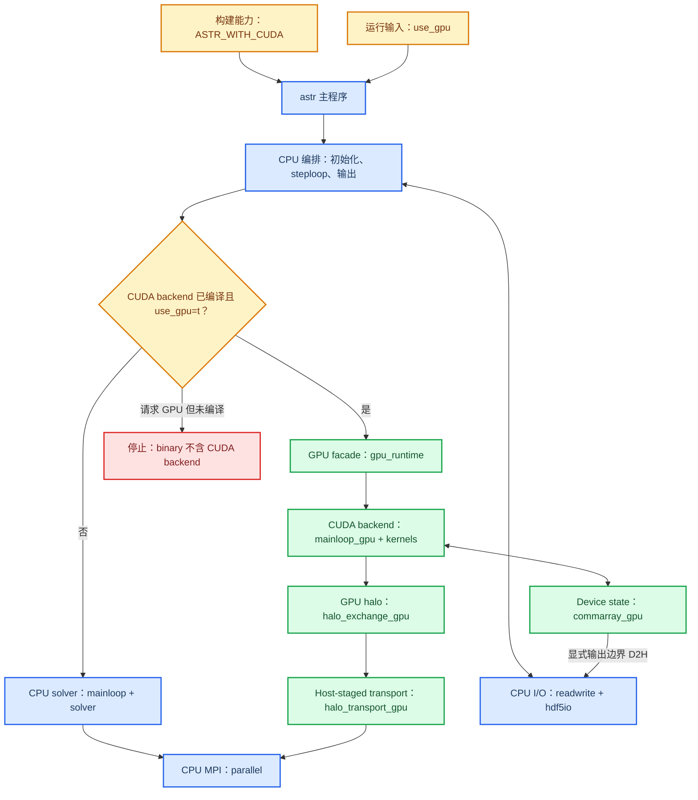
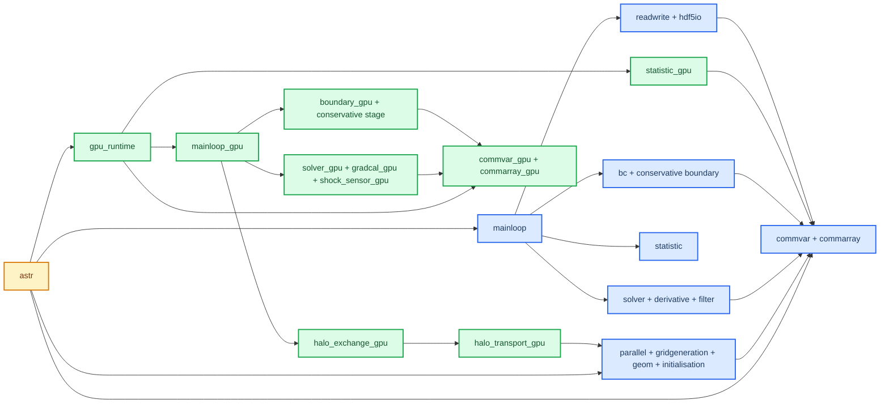

# ASTR 当前核心架构

本文描述当前 tracked source 已实现的执行结构。规划中的 HIP/DCU backend、CUDA-aware MPI、GPU HDF5 和 deferred physics 不属于本页的当前能力。

## 当前分层架构

`ASTR_WITH_CUDA` 决定 binary 是否包含 CUDA Fortran backend。`use_gpu` 由 `src/readwrite.F90::readinput` 读取并广播，决定一次运行是否走 GPU 路径。`src/astr.F90::astr` 只在 `_CUDA` 构建分支中导入 `gpu_runtime` facade。若没有编译 CUDA backend 而输入请求 `use_gpu=t`，`src/mainloop.F90::time_integration_rk` 明确停止计算。

### 分层证据

| 关系 | Source evidence | 当前结论 | 重新审计条件 |
|---|---|---|---|
| program 到 GPU facade | `src/astr.F90::astr`, `src_gpu/gpu_runtime.cuf::gpu_runtime` | `src/` 通过少量 facade hook 进入 backend | `src/` 新增直接导入 GPU implementation module |
| CPU 时间推进 | `src/mainloop.F90::steploop`, `src/mainloop.F90::time_integration_rk` | CPU 保持全局时间和输出编排 | `steploop` 或 RK ownership 转移到 backend |
| GPU 时间推进 | `src_gpu/gpu_runtime.cuf::gpu_time_integration_rk`, `src_gpu/mainloop_gpu.cuf::time_integration_rk_gpu` | GPU facade 调用 device-resident RK path | facade signature 或 RK stage 顺序变化 |
| GPU halo 到 MPI | `src_gpu/halo_exchange_gpu.cuf::exchange_solution_halo_gpu`, `src_gpu/halo_transport_gpu.cuf::exchange_host_pair` | pack/unpack 在 GPU，当前 MPI payload 经 host staging | transport backend 或 exchanged payload 改变 |
| CPU-owned file I/O | `src/readwrite.F90::writeflfed`, `src/readwrite.F90::writechkpt`, `src_gpu/gpu_runtime.cuf::gpu_sync_flow_to_host` | 文件输出允许在显式边界 D2H | 引入 device-side I/O 或异步输出 ownership |

## 核心模块依赖

该图只表达维护所需的主依赖，不是全部 procedure call graph。模块内部的 generic interface、procedure pointer 和 preprocessor branch 仍需人工审计。

### 依赖证据

| 模块组 | Source evidence | 关键共享契约 |
|---|---|---|
| shared state | `src/commvar.F90::commvar`, `src/commarray.F90::commarray` | scalar runtime state 与 host field array 被多个模块直接使用，更新顺序构成隐式接口 |
| setup | `src/parallel.F90::parallelini`, `src/geom.F90::geomcal`, `src/initialisation.F90::flowinit` | 分区、几何和初场必须在 compute loop 前闭合 |
| CPU compute | `src/solver.F90::rhscal`, `src/mainloop.F90::time_integration_rk` | RHS 符号、边界、halo、gradient 与 RK 顺序不可独立改写 |
| GPU compute | `src_gpu/mainloop_gpu.cuf::time_integration_rk_gpu`, `src_gpu/solver_gpu.cuf::solver_gpu` | kernel 调度依赖 device-resident state 与显式同步契约 |
| GPU communication | `src_gpu/halo_exchange_gpu.cuf::halo_exchange_gpu`, `src_gpu/halo_transport_gpu.cuf::halo_transport_gpu` | 数值层只依赖 halo 语义，transport policy 集中在独立 module |
| output and statistics | `src/statistic.F90::statistic`, `src_gpu/statistic_gpu.cuf::statistic_gpu`, `src/readwrite.F90::readwrite` | native GPU reduction 与 CPU-owned field output 是不同路径 |

## 当前所有权与维护后果

| 主题 | Confirmed behavior | Maintenance consequence |
|---|---|---|
| CPU orchestration | 输入、分区、网格、初始化、外层 step、controller 和文件生命周期由 CPU 控制 | backend 扩展应保持 facade 窄接口，不把 CUDA 类型扩散到 `src/` |
| GPU-authoritative loop | `q_d`、primitive device fields、RHS、gradient/filter work arrays 在 GPU RK 期间为计算权威状态 | RK 内不得加入逐 kernel 全场 H2D/D2H；小型 reduction 和显式输出边界除外 |
| Output boundary | HDF5、checkpoint 和完整 flowfield 仍由 CPU 路径写出 | 输出前必须明确复制哪一相位的字段，不能把 build 或 field diff 当作 GPU I/O 已移植 |
| Capability admission | GPU path 对 scheme、physics、boundary、geometry 和 topology 组合实施显式准入或拒绝 | 新功能先扩展 predicate 和负测试，再开放 kernel path |
| Backend identity | 当前 accelerator implementation 是 `src_gpu/` CUDA Fortran | HIP/DCU 只能出现在目标架构，不得写入当前能力列表 |

数值格式、边界闭合和验证层次分别见[数值契约](numerical-contracts.md)与[验证和故障诊断](validation-and-troubleshooting.md)。

