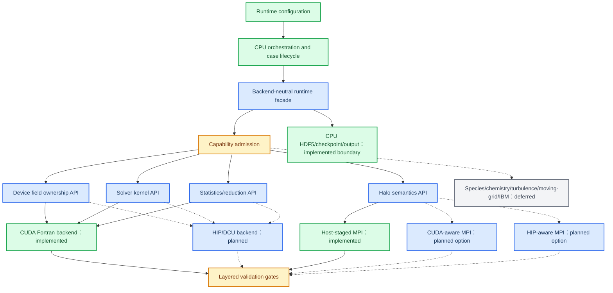

# ASTR 可扩展全 GPU 目标架构

本文定义后续迁移应保持的边界，不代表所有节点已实现。当前事实见[当前核心架构](architecture-current.md)，阶段状态见 [full-GPU architecture plan](../ASTR_FULL_GPU_ARCHITECTURE_PLAN.md)。

## Backend 目标视图

图中虚线表示尚未实现或尚未准入。HIP/DCU backend 不应通过翻译 CUDA module 名称来接入，而应复用 facade、field ownership、halo semantics 和 validation contracts。

## 稳定接口规则

| 边界 | 目标契约 | 当前锚点 | 禁止的耦合 |
|---|---|---|---|
| Runtime facade | `src/` 只调用 backend lifecycle、sync、advance、statistics facade | `src_gpu/gpu_runtime.cuf::gpu_runtime` | CPU orchestration 直接导入 CUDA kernel module |
| Capability admission | scheme、physics、BC、geometry、topology 组合必须显式接受或拒绝 | `src_gpu/mainloop_gpu.cuf::validate_first_stage_gpu` | 遇到未知组合后静默回退或继续运行 |
| Field ownership | 初始化 H2D 后 compute-loop field 由 device backend 持有 | `src_gpu/commarray_gpu.cuf::commarray_gpu` | 每模块或每 kernel 全场 round trip |
| Solver kernels | filter、gradient、flux/RHS、source、RK update 使用 backend-local implementation | `src_gpu/solver_gpu.cuf::solver_gpu`, `src_gpu/gradcal_gpu.cuf::gradcal_gpu` | 在共享 `src/` 中嵌入 CUDA/HIP launch 细节 |
| Halo semantics | solution qswap、raw field halo、physical ownership 与 endpoint 规则独立于 transport | `src_gpu/halo_exchange_gpu.cuf::halo_exchange_gpu` | solver kernel 直接选择 MPI transport policy |
| Transport | 至少保留 host-staged correctness backend；device-aware backend 可替换 | `src_gpu/halo_transport_gpu.cuf::halo_transport_gpu` | 把 CUDA-aware MPI 作为唯一可运行路径 |
| Reduction | local reduction 在 device，host/MPI 只接收 partial 或 scalar | `src_gpu/statistic_gpu.cuf::statistic_gpu` | 为一个统计量默认回传完整三维场 |
| Output | HDF5、checkpoint、controller 保持 CPU-owned 显式边界 | `src/readwrite.F90::readwrite` | 将 output D2H 误判为 compute residency 失败 |

## 迁移顺序

1. 保持当前 CUDA backend 和验证矩阵稳定，继续收敛 facade、ownership 和 HaloTransport 契约。
2. 新 backend 首先实现 device binding、五变量 field ownership、explicit central/RK3 和 host-staged halo correctness baseline。
3. 使用 TGV、非 TGV periodic、wall/physical boundary、CURVE 和 shock/SBLI 分层 gate 验证 backend，而不是一次开放所有算例。
4. 仅在第二 backend 的重复实现证明现有接口不足时调整目录和 public API。
5. Species、chemistry、turbulence、moving-grid 和 immersed boundary 由明确项目需求重新开放，不作为 shock/SBLI 或新 backend 的前置条件。

## 设计依据

| 决策 | 记录 |
|---|---|
| backend-neutral facade | [ADR 0013](../../docs/adr/0013-use-backend-neutral-facade-for-full-gpu-migration.md) |
| GPU-authoritative compute loop | [ADR 0014](../../docs/adr/0014-make-gpu-authoritative-inside-the-compute-loop.md) |
| pluggable HaloTransport | [ADR 0015](../../docs/adr/0015-use-pluggable-halotransport-backends.md) |
| ordered physics expansion | [ADR 0016](../../docs/adr/0016-expand-full-gpu-coverage-in-ordered-phases.md) |
| CPU-owned file output | [ADR 0017](../../docs/adr/0017-keep-file-output-as-cpu-owned-boundary.md) |
| layered validation | [ADR 0018](../../docs/adr/0018-use-layered-validation-for-full-gpu-migration.md) |
| retain `src_gpu/` near term | [ADR 0020](../../docs/adr/0020-keep-src-gpu-as-the-near-term-cuda-backend-directory.md) |

目标架构的接受条件不是“新 backend 能编译”，而是同一数值/边界契约在相同 topology 上通过 field、statistics、physics、residency 和 performance 的独立门槛。

