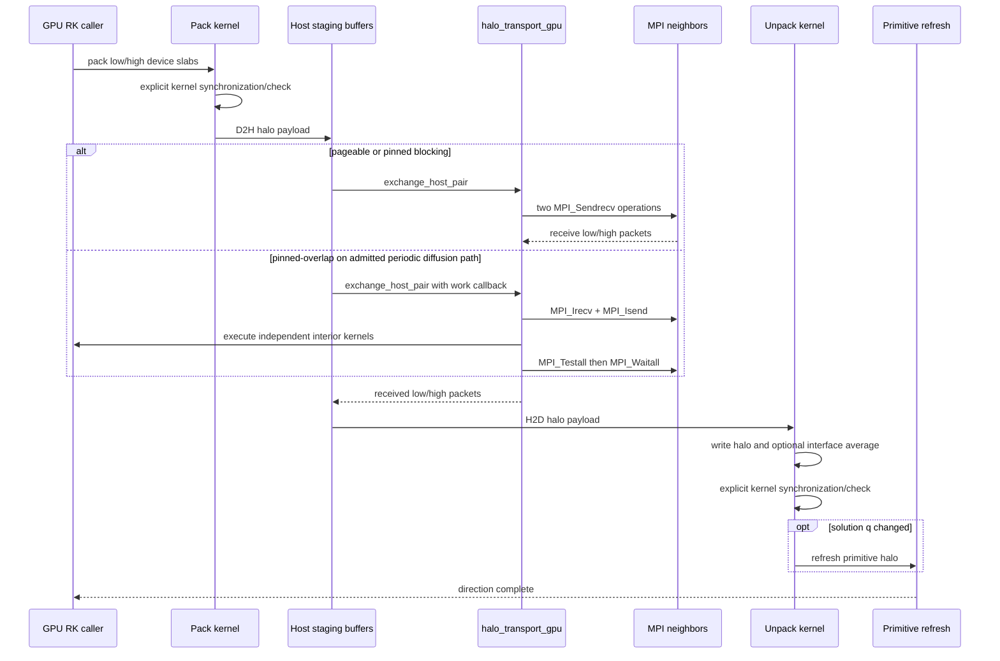

# ASTR MPI 与 GPU Halo 架构

ASTR 使用三维 Cartesian rank topology `isize x jsize x ksize`。数值 stencil 只读取对应方向的 face halo，因此当前显式格式可按 x、y、z 依次组合 face exchange，不要求额外传输 corner/edge packet。该结论不自动适用于未来的多维耦合 stencil。

## 分区与邻居契约

`src/parallel.F90::parallelini` 根据全局网格、rank topology 和 `lihomo/ljhomo/lkhomo` 建立 local active ranges `is:ie`、`js:je`、`ks:ke` 及六个邻居。一个方向可能处于三种状态：多 rank MPI interface、单 rank periodic/homogeneous interface、physical boundary。GPU 路径必须逐方向区分，不能把 physical boundary 当作缺失 halo。

| Payload | 交换深度 | 接口面 | 目的 |
|---|---:|---|---|
| Solution `q(1:numq)` / 当前 GPU `q_d(1:5)` | `hm+1` | 接收额外 interface plane，并与本地重复面平均 | 匹配 CPU `qswap` 的 conservative field 与 periodic endpoint 语义 |
| Filter intermediate `qwork_d` 或 filter input halo | `hm` | 不平均 | 匹配 centered stencil 的 raw halo / CPU `dataswap` 语义 |
| Diffusion fields `sigma_d(1:6)`, `qflux_d(1:3)` | `hm` | 不平均 | 让 directional derivative 读取邻 rank flux stencil |
| Generic scalar/vector field | `hm` | 不平均 | shock sensor 等 axis-local field halo |

CPU reference 为 `src/parallel.F90::qswap`。它在 MPI 方向打包 `0:hm`，用额外的第 0 层更新重复接口面，再将 `1:hm` 写入外 halo；单 rank homogeneous 方向还会平均两个周期 endpoint。GPU solution 路径由 `src_gpu/halo_exchange_gpu.cuf::exchange_solution_halo_gpu` 实现相同语义。不能把“固定交换 `hm` halo”误写成 solution packet 也只有 `hm`：其有效外 halo 是 `hm`，但 qswap-compatible packet 是 `hm+1`。

## GPU HaloTransport 时序

GPU exchange 的 x/y/z tag 固定为私有区间 `21001..21006`，由 `halo_exchange_gpu` 拥有，不读取或修改 CPU `parallel:mpitag`。`src_gpu/halo_transport_gpu.cuf::exchange_host_pair` 封装 blocking 与 callback-enabled nonblocking pair。`src_gpu/halo_transport_gpu.cuf::progress_host_pair_during_kernel` 只在 active pair 中轮询 default stream 和 MPI requests，调用者仍负责每个 kernel 的显式同步与错误检查。

## 每方向控制流

每个 Cartesian 方向依次判断 MPI、homogeneous 和 physical ownership。MPI 方向执行 pack、host-staged exchange 与 unpack；单 rank homogeneous 方向执行 local periodic qswap；physical 方向保留物理边界写入的状态。三种条件均不成立时立即停止。solution `q` 被更新后还要刷新对应 primitive halo，raw field exchange 则不执行这一转换。

上述入口见 `src_gpu/halo_exchange_gpu.cuf::exchange_solution_halo_gpu`。local periodic copy 与 primitive refresh 由 `src_gpu/qswap_gpu.cuf::qswap_single_rank_gpu` 等 helper 承担。generic field 路径使用 `src_gpu/halo_exchange_gpu.cuf::exchange_field_halo_gpu`，其 payload 与 solution qswap 不同。

## CPU 与 GPU 通信差异

| 方面 | CPU `parallel:qswap` | GPU halo backend |
|---|---|---|
| 计算权威存储 | Host `q/rho/vel/prs/tmp` | Device `q_d/rho_d/vel_d/prs_d/tmp_d` |
| Pack/unpack | Fortran host array section 和临时 allocatable buffer | Direction-specific CUDA kernel 和复用 device/host buffer |
| MPI API | 每方向两个 `MPI_Sendrecv`，使用可变 `mpitag` | 默认两个 `MPI_Sendrecv`，私有固定 tag；受限模式可用 nonblocking pair |
| Host staging | 不需要 device staging | 当前必须 D2H/MPI/H2D；不是全场 copy |
| Solution endpoint | `hm+1` packet，重复接口面平均 | `hm+1` packet，unpack kernel 平均同一接口面 |
| Raw field halo | 对应 CPU `dataswap` 类语义 | 固定 `hm`，不平均 interface plane |
| Primitive refresh | `qswap` 内调用 `q2fvar` | solution unpack/local swap 后由 GPU helper 刷新 |
| Transport portability | 标准 MPI | host-staged baseline 可跨非 CUDA-aware MPI 环境 |
| Error boundary | MPI return code 和 solver stop | MPI error 触发 `MPI_Abort`，kernel 由显式 sync/check 定位 |

GPU 版本保持的是数值通信语义，而不是 CPU buffer 分配和 tag 管理方式。未来 CUDA-aware MPI、HIP-aware MPI 或 topology-aware transport 应替换 transport 层，不应改变 solver kernel 的 halo 调用语义。

## Transport 模式

环境变量 `ASTR_GPU_HALO_TRANSPORT` 在所有 ranks 上必须一致：

| 值 | Host buffer | MPI | 当前适用范围 |
|---|---|---|---|
| `pageable` 或未设置 | pageable | blocking pair | 默认、可移植 correctness baseline |
| `pinned` | `cudaHostRegister` | blocking pair | 可选性能路径；任一 rank 注册失败则全体回退 pageable |
| `pinned-overlap` | pinned | nonblocking pair + work callback | 仅已准入的完全周期 stored-diffusion interior overlap |

`pinned-overlap` 的名称不构成 overlap 证据。只有 Nsight timeline 同时显示 MPI progress 与独立 interior kernel，且 same-topology field/statistics gate 通过，才能接受性能结论。物理边界、shock sensor 和 SBLI 不自动继承周期 diffusion 的 overlap 准入。

## 变更验收

1. 以相同 `NP` 和相同 `isize,jsize,ksize` 比较 CPU/GPU，不能用 NP=1 CPU 作为多 rank halo 的主要 oracle。
2. 分别验证 solution `hm+1` endpoint、filter/diffusion/generic field `hm` raw halo，不能只检查外层 halo 值。
3. 组合 topology 必须覆盖 x/y/z face exchange 顺序；两卡 oversubscription 只证明 correctness routing，不证明多卡 scaling。
4. Profile 必须区分 halo-sized transfer 与 full-field D2H/H2D。
5. 修改 tag、packet shape、active range、primitive refresh 或 transport fallback 后，重新执行对应 halo contract probe 和 same-topology matrix。

现有验证入口集中在 `tests/gpu_validation/run_tgv_mpirank_matrix.sh`、`tests/gpu_validation/run_2dvort_mpirank_matrix.sh`、CURVE matrices、shock/SBLI MPI matrices 和 HaloTransport probes。完成状态与适用范围见 [GPU validation matrix](../GPU_VALIDATION_MATRIX.md)及 [multi-rank porting plan](../ASTR_GPU_MULTI_RANK_PORTING_PLAN.md)。
