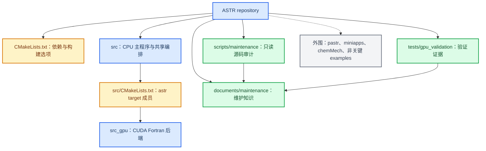

# ASTR 核心仓库结构与职责

本页给出维护边界和源码职责分组。逐文件声明、`use`、`call`、include 与 CMake 成员关系以[生成源码清单](generated/source-inventory.md)为准。

## 核心目录结构

根 `CMakeLists.txt` 负责 compiler、MPI、HDF5、chemistry 和 `ASTR_WITH_CUDA` 构建能力。`src/CMakeLists.txt` 将 CPU 文件纳入 `ASTR_SOURCES`，并在 `ASTR_WITH_CUDA=ON` 时将 CUDA Fortran 文件纳入 `ASTR_GPU_SOURCES`。程序是否进入 GPU 路径仍由输入中的 `use_gpu` 在运行时决定。

## CPU 源码职责分组

下表覆盖生成清单中的 48 个 `src/` production source。分组表达维护职责，不替代模块依赖审计。

| 职责组 | 文件 | 维护边界 |
|---|---|---|
| 入口与时间编排 | `src/astr.F90`, `src/mainloop.F90`, `src/test.F90` | 命令分派、初始化顺序、时间循环和内置测试入口 |
| 共享状态与通用支撑 | `src/cmdefne.F90`, `src/commarray.F90`, `src/commcal.F90`, `src/commfunc.F90`, `src/commtype.F90`, `src/commvar.F90`, `src/constdef.F90`, `src/singleton.F90`, `src/strings.F90`, `src/utility.F90` | 输入状态、主数组、常数、类型和通用函数 |
| MPI 与并行 I/O | `src/parallel.F90`, `src/mpiio.F90` | 拓扑、collective、halo 交换和 MPI 文件访问 |
| 网格与几何 | `src/geom.F90`, `src/gridgeneration.F90`, `src/ibmethod.F90`, `src/rectilinear_metric_halo.F90` | 网格生成、度量、几何 halo 与现有浸入边界 CPU 路径 |
| 初始化与模型选择 | `src/initialisation.F90`, `src/models.F90` | 算例初场、入口 profile 和模型入口 |
| 数值计算 | `src/comsolver.F90`, `src/derivative.F90`, `src/fdnn.F90`, `src/filter.F90`, `src/fludyna.F90`, `src/flux.F90`, `src/interp.F90`, `src/riemann.F90`, `src/solver.F90`, `src/thermchem.F90`, `src/perfect_gas_transport.F90` | 导数、滤波、通量、RHS、热化学和输运 |
| 物理边界与源区 | `src/bc.F90`, `src/conservative_boundary_config.F90`, `src/conservative_boundary_faces.F90`, `src/conservative_boundary_faces_body.inc`, `src/conservative_boundary_runtime.F90`, `src/perfect_gas_boundary.F90`, `src/perfect_gas_boundary_body.inc`, `src/sponge_layer.F90` | legacy 与 conservative boundary、perfect-gas 边界、sponge |
| 统计、输入输出与后处理 | `src/hdf5io.F90`, `src/pp.F90`, `src/readwrite.F90`, `src/statistic.F90`, `src/stlaio.F90`, `src/tecio.F90`, `src/validation_io.F90`, `src/vtkio.F90` | 输入、HDF5/checkpoint、统计、格式输出和验证快照 |

主入口证据为 `src/astr.F90::astr`。运行输入由 `src/readwrite.F90::readinput` 读取，时间推进由 `src/mainloop.F90::steploop` 进入。

## CUDA Fortran 源码职责分组

下表覆盖生成清单中的 19 个 `src_gpu/` production source。

| 职责组 | 文件 | 维护边界 |
|---|---|---|
| facade、设备与能力 | `src_gpu/gpu_runtime.cuf`, `src_gpu/device_runtime_gpu.cuf`, `src_gpu/gpu_check.cuf`, `src_gpu/case_capability_gpu.cuf` | CPU 可见 facade、设备绑定、同步/错误检查和能力准入 |
| device state | `src_gpu/commarray_gpu.cuf`, `src_gpu/commvar_gpu.cuf` | 常驻数组、host/device 显式复制和 device 常量 |
| GPU 数值与编排 | `src_gpu/gradcal_gpu.cuf`, `src_gpu/mainloop_gpu.cuf`, `src_gpu/solver_gpu.cuf`, `src_gpu/shock_sensor_gpu.cuf`, `src_gpu/statistic_gpu.cuf`, `src_gpu/sponge_gpu.cuf` | RK 编排、梯度、通量/RHS、sensor、统计和 sponge kernel |
| GPU 边界 | `src_gpu/boundary_gpu.cuf`, `src_gpu/conservative_boundary_faces_gpu.cuf`, `src_gpu/conservative_boundary_stage_gpu.cuf`, `src_gpu/perfect_gas_boundary_gpu.cuf` | 物理边界、conservative stage 和 perfect-gas device helper |
| GPU halo | `src_gpu/halo_exchange_gpu.cuf`, `src_gpu/halo_transport_gpu.cuf`, `src_gpu/qswap_gpu.cuf` | pack/unpack、host-staged MPI transport 和本地周期交换 |

CPU 对 GPU 的稳定入口是 `src_gpu/gpu_runtime.cuf::gpu_runtime`，而不是直接调用各数值 kernel。当前目录名 `src_gpu/` 表示已实现的 CUDA Fortran 后端，不代表 HIP/DCU 后端已经存在。

## 维护规则

1. 新 production source 必须进入对应 CMake source list，随后重新生成 inventory。
2. `src/` 对 backend-specific module 的依赖应集中在 facade 调用和 `_CUDA` 条件边界。
3. generated inventory 出现未归属文件时停止文档推进，先判断是 CMake 漏项、include owner 缺失还是范围定义错误。
4. CPU 与 GPU 同名物理过程不表示实现机械一致，必须在运行顺序、halo 深度和字段所有权层面核对契约。
