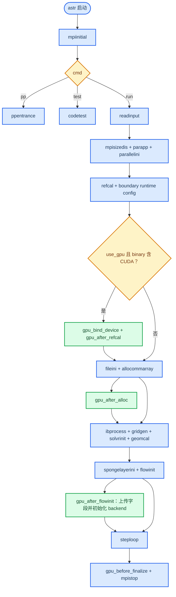
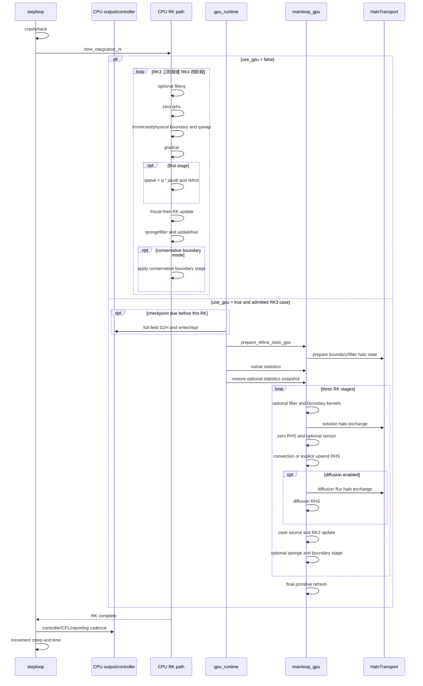
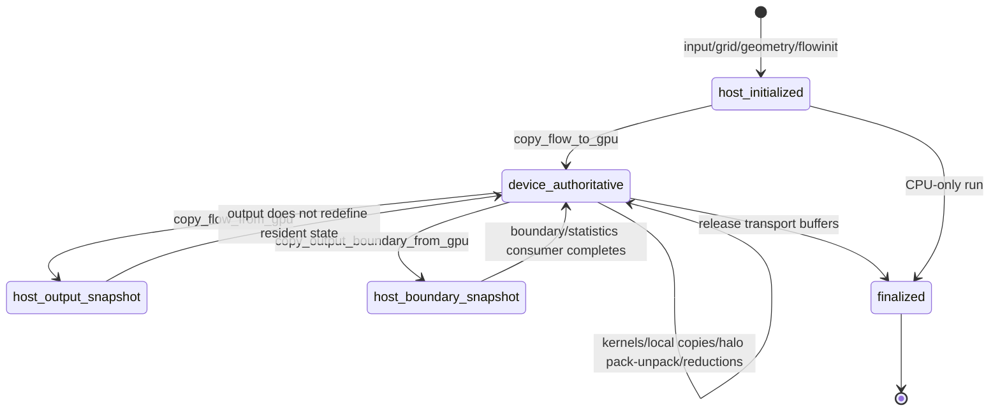

# ASTR 运行时与数据流

本文描述一次 `astr run` 从输入到时间推进的控制流，以及 CPU/GPU 字段在何时具有权威性。不同边界和数值格式会改变 RK stage 内部的局部顺序，因此图中保留条件分支，不把所有算例压成同一条 kernel 链。

## 启动流程

主顺序来自 `src/astr.F90::astr`。GPU hook 分别由 `src_gpu/gpu_runtime.cuf::gpu_bind_device`、`src_gpu/gpu_runtime.cuf::gpu_after_alloc` 和 `src_gpu/gpu_runtime.cuf::gpu_after_flowinit` 提供。`gpu_after_flowinit` 内部调用 device field 上传、HaloTransport 初始化、边界状态和 sponge 初始化，完成后 device fields 才能进入计算权威状态。

## 外层 step 与 RK 顺序

`src/mainloop.F90::steploop` 持有 `nstep`、controller reload、CFL 报告和 step 级输出节奏。它调用同一个 `src/mainloop.F90::time_integration_rk`，后者根据运行时 `use_gpu` 选择 CPU 或 GPU 分支。

### 顺序不变量

| 不变量 | CPU evidence | GPU evidence | 改动风险 |
|---|---|---|---|
| Filter 先于本 stage RHS | `src/mainloop.F90::time_integration_rk`, `src/comsolver.F90::filterq` | `src_gpu/mainloop_gpu.cuf::time_integration_rk_gpu` | 改变 filter/primitive 相位会破坏 CPU/GPU oracle |
| 边界与 halo 先于空间算子 | `src/bc.F90::boucon`, `src/parallel.F90::qswap` | `src_gpu/halo_exchange_gpu.cuf::exchange_solution_halo_gpu` | stencil 读取旧 halo 或错误物理边界 |
| Gradient 先于 viscous RHS | `src/comsolver.F90::gradcal`, `src/solver.F90::rhscal` | GPU diffusion flux 在 device primitive/metric 上构造 | 黏性通量读取不同 stage 的 primitive state |
| Convective sign 先取负，再加 diffusion/source | `src/solver.F90::rhscal` | GPU kernel sequence 在 update 前形成同义 `qrhs_d` | 单模块 field diff 可能通过，但完整 RK 方向错误 |
| 第一 stage 保存 RK base state | `src/mainloop.F90::time_integration_rk` | `src_gpu/solver_gpu.cuf::rk3_first_update_global_kernel` | 后续 stage 失去同一时间层基准 |
| Kernel 边界显式检查 | CPU 不适用 | `src_gpu/gpu_check.cuf::sync_after_kernel` | correctness 模式下异步错误定位延后 |

NSCBC transverse filter、conservative boundary stage、selective Roe、sponge 和 validation dump 各有附加顺序。修改这些路径时必须以对应 `mainloop_gpu` branch 为准，不能只依据上表的公共骨架。

## Host 与 device 字段所有权

`src_gpu/commarray_gpu.cuf::copy_flow_to_gpu` 上传 `q`、primitive fields、`jacob`、`x`、`dxi` 和已分配的 boundary normals。`src_gpu/commarray_gpu.cuf::copy_flow_from_gpu` 回传完整 `q/rho/vel/prs/tmp`，用于 checkpoint、field output 或显式验证。`src_gpu/commarray_gpu.cuf::copy_output_boundary_from_gpu` 只回传六个物理面的 primitive fields，不等价于完整 flow state。

### 数据边界

| 边界 | 权威状态 | 允许的数据移动 | 不允许的推断 |
|---|---|---|---|
| 初始化结束前 | Host | 一次完整 H2D，加上几何和 boundary auxiliary fields | 此时不能宣称 GPU compute loop 已开始 |
| GPU RK stage 内 | Device | halo pack/unpack、host-staged halo payload、小型 reduction、显式 validation hook | 不允许逐 kernel 全场 round trip |
| Checkpoint/flowfield 输出 | Device 在同步前，host snapshot 在同步后 | 显式完整 D2H | 不表示 HDF5 已 GPU 化 |
| Native statistics | Device partial/reduction，host scalar | 小型 scalar/partial result 回传和 MPI reduction | 不应按完整场复制计入 residency failure |
| Finalization | 最后完整 RK state | release pinned buffers 和 MPI finalize | 不改变 checkpoint 语义 |

GPU checkpoint 由 CPU 外层在进入下一次 RK 前请求 `src_gpu/gpu_runtime.cuf::gpu_sync_flow_to_host`，因此写出上一完整 RK 后的 state。统计路径可能通过 `src_gpu/gpu_runtime.cuf::gpu_prepare_rkfirst_stats` 保存边界相位快照，并在统计完成后由 `src_gpu/gpu_runtime.cuf::gpu_restore_stats_snapshot` 恢复 device state。新增输出或统计量时必须先定义它读取的相位，而不能只写“当前场”。

