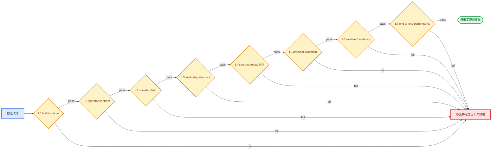

# ASTR 验证与故障诊断

ASTR GPU 改动必须分层验收。build、数值等价、物理有效性、robustness、residency 和 performance 回答不同问题，后层证据不能覆盖前层失败。

## 验证门槛

| Gate | 回答的问题 | 主要证据 |
|---|---|---|
| L0 | binary、依赖、输入和 capability 是否闭合 | configure/build log、negative reject、short smoke |
| L1 | 单个公式或模块是否匹配 reference | analytic/operator/manufactured contract |
| L2 | 同一 RK 相位的逐场结果是否等价 | `L_inf/L1/L2` field diff，包含每个 `q`/primitive field |
| L3 | 误差是否随时间积累且统计定义是否一致 | native `flowstate.dat`、长步趋势、restart continuity |
| L4 | decomposition 是否改变结果 | 相同 NP/topology 的 CPU/GPU 对比及 GPU topology invariance |
| L5 | case 是否复现目标物理 | 独立 theory/DNS/experiment benchmark、mesh/time sensitivity |
| L6 | memory、同步和 residency 是否正确 | Compute Sanitizer、Nsight Systems transfer/timeline |
| L7 | 优化是否改善目标 workload | repeated end-to-end/RK timing、spread、one-rank-per-GPU scaling |

## 代表性验证入口

| 范围 | Entry | Evidence type |
|---|---|---|
| TGV explicit baseline | `tests/gpu_validation/run_tgv_stats_compare.sh`, `run_tgv_field_compare.sh` | L2/L3 equivalence |
| Multi-rank topology | `tests/gpu_validation/run_tgv_mpirank_matrix.sh` | L4 halo/topology correctness |
| Static CURVE | `tests/gpu_validation/run_curvilinear_c21_aggregate.sh` | geometry/BC aggregate regression |
| Wall family | `tests/gpu_validation/run_wall_family_phaseh_matrix.sh` | physical boundary invariants |
| Shock/selective Roe | `tests/gpu_validation/run_shuosher_characteristic_s0a10_2x2x2_compare.sh` | sensor/characteristic/MPI equivalence |
| SBLI NSCBC | `tests/gpu_validation/run_s2_sbli_physical_nscbc_mpi_matrix.sh` | coupled boundary/shock equivalence |
| Restart | `tests/gpu_validation/run_opensbli_restart_equivalence.sh` | continuous versus split-run state |
| Memory safety | `tests/gpu_validation/run_tgv_gpu_memcheck.sh` and case-specific memcheck modes | L6 runtime correctness |
| Residency | `tests/gpu_validation/run_tgv_256_nsys_profile.sh` | transfer and CUDA/MPI timeline |
| Hotspot | `tests/gpu_validation/run_tgv_256_ncu_hotspot_matrix.sh` | kernel metrics, not end-to-end speedup |
| Performance | `tests/gpu_validation/run_tgv_256_performance_benchmark.sh`, shock benchmark | repeated RK/end-to-end timing |

每个脚本的适用 topology、grid、step、tolerance 和 output policy 以 [GPU validation matrix](../GPU_VALIDATION_MATRIX.md)为准。历史 pass 不能替代源码改动后的重跑。

## 故障诊断表

| Symptom | Diagnostic criterion | Root cause | Action | Stop condition |
|---|---|---|---|---|
| `flowtype` 显示尾随乱码，CFL=0，随后 NaN | `file` 或十六进制检查显示 `input.*`/`controller` 为 CRLF | NVHPC list-directed character read 保留 `\r`，`select case(trim(...))` 失配 | 将输入统一为 LF，重新从初始化 smoke 开始 | 未确认 flow initializer 实际执行前不进入 kernel 调试 |
| 首步出现 NaN、Inf、负 density/pressure | 比较 flowinit 后 host/device extrema，定位首个异常 phase | 初场未初始化、EOS 不闭合、错误 RHS sign、越界或过大 time step | 从 flowinit、q conversion、one-stage snapshot 顺序缩小范围 | 第一个非有限值来源未定位前不延长步数 |
| CPU/GPU 都通过但 field diff 无物理意义 | CPU oracle 在 boundary/halo、metric 或输出相位存在未定义值或已知 bug | reference 本身不合理，等价只是在复制缺陷 | 报告 source evidence，提出 CPU 修复或限定 oracle，等待人工决策 | CPU 行为未获确认前不移植该缺陷 |
| MPI interface 邻近误差显著，内部正常 | 误差集中在距 rank face `hm` 范围或重复 endpoint | packet depth、interface average、tag、active range 或 primitive refresh 错误 | 分别检查 solution `hm+1` 和 raw field `hm` contract | same-topology one-step field 未通过前不跑长步 |
| Physical face 在 filter/RK 后漂移 | face/ghost invariant 在某一 filter、qswap 或 boundary stage 后首次破坏 | BC ownership 或 closure 时序错误，physical face 被 periodic/MPI helper 覆盖 | 使用 stage snapshot 定位写入者，修复 ordering/active mask | face algebra 与 corner priority 未闭合前不看整体统计 |
| Restart 后统计或场发生跳变 | continuous 与 split run 在同一终止 step 不一致，或 step 序列断裂 | checkpoint phase、`nstep/time`、halo 重建、stats state 或输入不一致 | 保留 checkpoint 副本，核对 auxiliary/HDF5，重跑 restart equivalence | step mismatch 或 source checkpoint 被修改时立即停止 |
| CMake 找不到 HDF5 或运行时报 symbol/library 错误 | configure log 的 HDF5 Fortran/HL 路径与 `ldd`/module 环境不一致 | serial/parallel HDF5、compiler ABI 或 runtime library 混用 | 清理独立 build directory，加载一致 MPI/HDF5/compiler 后重新 configure | 依赖组合未确定前不提交 GPU job |
| 多 rank 都绑定同一 GPU 或 device 数越界 | 启动日志与 `nvidia-smi`/`nvitop` PID-device mapping 不符合 node-local rank | scheduler allocation、`CUDA_VISIBLE_DEVICES` 或 local-rank detection 错误 | 明确每 node GPU 数和 rank mapping，先做 NP=1/2 smoke | 绑定关系不确定时不报告多 GPU performance |
| `nvitop` 中 GPU 利用率低 | Nsight timeline 显示短 kernel、频繁同步、MPI wait 或 I/O 间隔 | 小网格、oversubscription、显式同步、host-staged halo 或输出主导 | 增大可控 workload，分离 RK 与 I/O，使用 timeline 定位空洞 | 未证明瓶颈前不以利用率单值指导重写 |
| RK window 出现大规模 H2D/D2H | 单次 transfer 接近 local full-field bytes，而非 halo/partial scalar | 隐式 array assignment、validation copy 或新增 host consumer | 按 call site 定位 transfer，移到初始化/输出边界或改为 reduction | 无法解释的 full-field transfer 保留时不宣称全变量常驻 |
| Compute Sanitizer 报 invalid access | `--error-exitcode` 非零并给出 kernel/address | index、halo allocation、lifetime 或 MPI staging buffer 错误 | 用最小 one-step case 和目标 kernel 重现，修复后重跑同 gate | sanitizer 非零时不进入数值容差讨论 |
| Nsight Systems 缺少 CUDA/MPI event | report 中无预期 API/kernel/domain，或 executable 未链接目标 binary | trace selector、MPI wrapper、权限、旧 binary 或时间窗口错误 | 核对 executable hash、`--trace`、NVTX/marker 和运行命令 | timeline 不完整时不作 overlap/residency 结论 |
| Nsight Compute 返回 `ERR_NVGPUCTRPERM` | kernel 能运行但 hardware counter collection 被拒绝 | NVIDIA profiling admin policy 禁止当前用户访问 counters | 检查 `/proc/driver/nvidia/params` 的 `RmProfilingAdminOnly`，由管理员按站点政策授权后重试 | 权限未开放时只报告无法采集，不伪造或外推 counter 指标 |

## 诊断顺序

始终定位首个失败层：输入与初始化、boundary/halo、operator/RHS、RK accumulation、multi-rank、physics、memory/residency、performance。若代码逻辑已明确错误，立即停止下游运行并报告；继续堆叠更长算例只会增加错误传播，不能提供有效证据。

